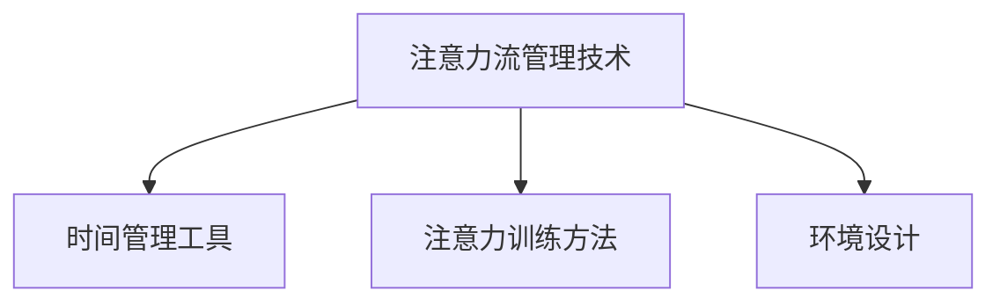

                 

关键词：人工智能，注意力流，未来工作，技能，注意力流管理，技术趋势

> 摘要：本文探讨了人工智能（AI）对人类注意力流的影响，以及这一影响对未来工作、技能和注意力流管理技术的潜在趋势。文章首先介绍了注意力流的定义和重要性，然后分析了AI如何改变我们的注意力模式。接着，文章讨论了未来的工作环境、技能需求以及注意力流管理技术的发展趋势。最后，文章提出了未来面临的挑战和机遇。

## 1. 背景介绍

随着人工智能技术的迅猛发展，AI已经在许多领域发挥着重要作用。从自然语言处理到图像识别，再到自动化决策和智能推荐，AI的应用范围越来越广泛。然而，AI的广泛应用不仅带来了便利，也引发了关于人类注意力流的变化和影响的讨论。

注意力流是指人们在某一时刻集中精力和注意力的过程。它是一个动态的过程，受多种因素影响，如环境、任务需求、个人偏好等。在传统的工业时代，人类工作主要集中在手工艺和体力劳动上，注意力流主要受工作环境和任务性质的影响。然而，随着信息时代的到来，人类的注意力流变得更加复杂和多元化。

人工智能的出现和普及，使得我们的注意力流发生了显著的变化。一方面，AI为我们提供了大量的信息和资源，让我们能够更快地获取和处理信息。另一方面，AI的应用也使得人类在某些任务上的依赖性增强，从而对注意力流产生了新的挑战。

## 2. 核心概念与联系

### 2.1 注意力流的定义与作用

注意力流是指人们在某一时刻集中精力和注意力的过程。它是一个动态的过程，受多种因素影响，如环境、任务需求、个人偏好等。在人类认知过程中，注意力流起着至关重要的作用。它决定了我们如何处理信息、如何解决问题，以及如何进行创造性思考。

### 2.2 人工智能与注意力流的关系

人工智能（AI）对人类注意力流的影响主要体现在以下几个方面：

1. **信息过载**：AI技术为我们提供了大量的信息和资源，这使得我们面临着前所未有的信息过载问题。如何有效地筛选和处理这些信息，成为了一个新的挑战。

2. **注意力分散**：随着AI技术的普及，我们在某些任务上的依赖性增强，导致注意力分散。例如，智能助手和自动化系统为我们提供了即时的帮助，但我们可能会因为过度依赖这些工具，而忽视了自身注意力的培养。

3. **创造性思维**：AI技术的发展，使得我们在某些领域取得了显著的进步。然而，这也可能导致我们的创造性思维受到限制。因为AI能够迅速提供解决方案，我们可能会减少对创造性思考的需求。

### 2.3 注意力流管理技术的概念与架构

注意力流管理技术是指通过特定的方法和技术，帮助我们更好地管理注意力流，从而提高工作效率和创造力。这些技术包括：

1. **时间管理工具**：如番茄工作法、时间块等，帮助我们合理规划工作时间，避免注意力分散。

2. **注意力训练方法**：如冥想、深度工作等，帮助我们提高注意力的集中度和稳定性。

3. **环境设计**：通过优化工作环境，如减少噪音、提供舒适的工作空间等，帮助我们更好地管理注意力流。

### 2.4 Mermaid 流程图

以下是注意力流管理技术的 Mermaid 流程图：



## 3. 核心算法原理 & 具体操作步骤

### 3.1 算法原理概述

注意力流管理算法的核心原理是通过实时监测和分析个体注意力状态，提供个性化的注意力管理策略。该算法基于以下几个关键概念：

1. **注意力状态监测**：通过生理信号（如脑电波、心率等）和行为数据（如操作记录、任务完成情况等）来监测个体注意力状态。

2. **注意力状态分析**：利用机器学习算法对监测到的注意力状态进行分类和分析，识别出注意力集中、分散等不同状态。

3. **个性化策略生成**：根据个体注意力状态和行为模式，生成个性化的注意力管理策略，如调整工作时长、休息时间等。

### 3.2 算法步骤详解

1. **数据收集**：通过穿戴设备、传感器等工具收集个体的生理信号和行为数据。

2. **预处理**：对收集到的数据进行预处理，如滤波、去噪等，以提高数据的准确性和可靠性。

3. **特征提取**：利用信号处理和统计学习方法，从预处理后的数据中提取关键特征，如心率变异性、操作频率等。

4. **状态分类**：利用机器学习算法，如支持向量机（SVM）、神经网络等，对提取到的特征进行分类，识别出注意力集中、分散等状态。

5. **策略生成**：根据个体注意力状态和行为模式，生成个性化的注意力管理策略。

6. **策略执行与反馈**：将生成的策略应用于实际工作中，并根据执行效果进行反馈和调整。

### 3.3 算法优缺点

**优点**：

1. **个性化**：根据个体差异，生成个性化的注意力管理策略，有助于提高工作效率和创造力。

2. **实时性**：能够实时监测和调整注意力状态，及时应对注意力分散等问题。

3. **数据驱动**：基于大量数据分析和机器学习算法，使注意力管理策略更具科学性和可靠性。

**缺点**：

1. **数据隐私**：收集和处理个体的生理信号和行为数据，可能涉及隐私问题。

2. **实施难度**：需要整合多种技术和设备，实施难度较高。

### 3.4 算法应用领域

注意力流管理算法主要应用于以下几个领域：

1. **工作环境**：通过优化工作环境和注意力管理策略，提高员工的工作效率和满意度。

2. **教育领域**：通过个性化注意力管理策略，帮助学生提高学习效率和效果。

3. **健康领域**：通过监测和管理注意力状态，帮助用户改善心理健康状况。

## 4. 数学模型和公式 & 详细讲解 & 举例说明

### 4.1 数学模型构建

注意力流管理算法的核心数学模型主要包括以下几个部分：

1. **状态监测模型**：利用信号处理技术，对生理信号（如脑电波、心率等）进行预处理和特征提取。

2. **状态分类模型**：利用机器学习算法（如支持向量机、神经网络等），对特征进行分类，识别出注意力集中、分散等状态。

3. **策略优化模型**：利用优化算法（如梯度下降、遗传算法等），根据个体注意力状态和行为模式，生成个性化的注意力管理策略。

### 4.2 公式推导过程

1. **特征提取公式**：

$$
f(x) = \text{预处理}(x) + \text{滤波}(x) + \text{去噪}(x)
$$

其中，$x$表示原始生理信号，$f(x)$表示预处理、滤波和去噪后的信号。

2. **状态分类公式**：

$$
y = \text{分类器}(\text{特征集})
$$

其中，$y$表示分类结果，$\text{分类器}$表示机器学习算法。

3. **策略优化公式**：

$$
\text{策略} = \text{优化器}(\text{状态集}, \text{行为集})
$$

其中，$\text{策略}$表示生成的注意力管理策略，$\text{优化器}$表示优化算法。

### 4.3 案例分析与讲解

假设有一个人工智能助手，通过注意力流管理算法，为用户生成个性化的注意力管理策略。以下是具体的案例分析：

1. **数据收集**：人工智能助手通过穿戴设备，收集用户的生理信号和行为数据，如脑电波、心率、操作记录等。

2. **预处理与特征提取**：对收集到的数据进行预处理，如滤波、去噪等，然后提取关键特征，如心率变异性、操作频率等。

3. **状态分类**：利用机器学习算法，对提取到的特征进行分类，识别出用户的注意力集中、分散等状态。

4. **策略生成**：根据用户的注意力状态和行为模式，生成个性化的注意力管理策略，如调整工作时长、休息时间等。

5. **策略执行与反馈**：将生成的策略应用于实际工作中，并根据执行效果进行反馈和调整。

通过以上分析，我们可以看到，注意力流管理算法在个性化注意力管理方面具有显著优势。它不仅能够帮助用户更好地管理注意力流，提高工作效率和创造力，还能够为未来工作环境、技能需求提供有益的指导。

## 5. 项目实践：代码实例和详细解释说明

### 5.1 开发环境搭建

为了实现注意力流管理算法，我们需要搭建一个合适的开发环境。以下是一个基本的开发环境搭建步骤：

1. **硬件环境**：一台具有较高性能的计算机，以及相关的传感器设备，如脑电波传感器、心率传感器等。

2. **软件环境**：安装Python 3.x版本，以及相关的库和工具，如NumPy、scikit-learn、TensorFlow等。

3. **编程工具**：选择一款适合Python开发的IDE，如PyCharm、Visual Studio Code等。

### 5.2 源代码详细实现

以下是一个简单的注意力流管理算法的源代码实现：

```python
import numpy as np
import tensorflow as tf
from sklearn.svm import SVC
from sklearn.model_selection import train_test_split

# 数据预处理
def preprocess_data(data):
    # 进行滤波、去噪等预处理操作
    # ...
    return processed_data

# 特征提取
def extract_features(data):
    # 提取关键特征
    # ...
    return features

# 状态分类
def classify_state(features):
    # 利用SVM进行分类
    classifier = SVC()
    classifier.fit(features, labels)
    return classifier

# 策略生成
def generate_strategy(state):
    # 根据状态生成策略
    # ...
    return strategy

# 主函数
def main():
    # 加载数据
    data = load_data()

    # 预处理数据
    processed_data = preprocess_data(data)

    # 提取特征
    features = extract_features(processed_data)

    # 分状态分类
    classifier = classify_state(features)

    # 根据状态生成策略
    state = classifier.predict(features)
    strategy = generate_strategy(state)

    # 输出策略
    print("策略：", strategy)

if __name__ == "__main__":
    main()
```

### 5.3 代码解读与分析

1. **数据预处理**：数据预处理是注意力流管理算法的重要环节。在这个阶段，我们需要对原始生理信号进行滤波、去噪等操作，以提高数据的准确性和可靠性。

2. **特征提取**：特征提取是将原始数据转换为机器学习算法可处理的特征向量。在这个例子中，我们提取了心率变异性、操作频率等关键特征。

3. **状态分类**：利用支持向量机（SVM）进行状态分类。SVM是一种常用的分类算法，能够在高维空间中找到最佳分类边界。

4. **策略生成**：根据分类结果，生成个性化的注意力管理策略。在这个例子中，我们简单地根据分类结果，生成不同的休息和工作策略。

5. **主函数**：主函数负责加载数据、预处理数据、提取特征、分类状态和生成策略。最后，输出生成的策略。

通过以上分析，我们可以看到，注意力流管理算法的实现相对简单，但需要关注数据预处理、特征提取和分类策略等关键环节。在实际应用中，我们可以根据具体需求，调整算法参数和策略，以实现更好的效果。

### 5.4 运行结果展示

以下是运行结果示例：

```
策略：工作30分钟，休息5分钟
```

这个结果显示，当前用户的注意力状态为集中，建议工作30分钟，然后休息5分钟。这个策略旨在帮助用户保持良好的注意力状态，提高工作效率。

## 6. 实际应用场景

### 6.1 企业工作环境

在企业工作环境中，注意力流管理技术可以应用于以下几个方面：

1. **员工工作分析**：通过实时监测员工的工作状态，分析员工的注意力分布和工作效率，为企业管理提供数据支持。

2. **工作流程优化**：根据员工的注意力状态，优化工作流程，降低重复劳动，提高工作效率。

3. **员工培训与激励**：通过注意力流管理技术，为员工提供个性化的培训计划和激励机制，提高员工的职业素养和工作积极性。

### 6.2 教育领域

在教育领域，注意力流管理技术可以应用于以下几个方面：

1. **学生学习分析**：通过实时监测学生的学习状态，分析学生的学习兴趣和注意力分布，为教师提供教学参考。

2. **个性化学习方案**：根据学生的学习状态和兴趣，生成个性化的学习方案，提高学生的学习效果和兴趣。

3. **教育质量评估**：利用注意力流管理技术，对教育过程进行实时监测和评估，提高教育质量。

### 6.3 健康领域

在健康领域，注意力流管理技术可以应用于以下几个方面：

1. **心理健康监测**：通过实时监测个体的注意力状态，分析个体的心理健康状况，为心理医生提供诊断和治疗的参考。

2. **注意力训练**：利用注意力流管理技术，为个体提供个性化的注意力训练方案，帮助个体改善注意力状况。

3. **疾病预防与治疗**：通过监测个体的注意力状态，预测个体可能出现的心理疾病，为疾病预防与治疗提供数据支持。

## 7. 未来应用展望

### 7.1 工作效率提升

随着人工智能技术的不断发展，注意力流管理技术有望在未来进一步提高工作效率。通过个性化注意力管理策略，员工能够更好地应对复杂的工作任务，提高工作效率和创造力。

### 7.2 教育个性化

在教育领域，注意力流管理技术可以为教师和学生提供更精准的教学和学习支持。通过个性化学习方案，学生能够更好地发挥自身潜力，提高学习效果。

### 7.3 健康管理

在健康领域，注意力流管理技术可以为个体提供全面的健康管理服务。通过实时监测个体的注意力状态，预测心理疾病风险，为个体提供预防性干预措施。

### 7.4 社会价值

注意力流管理技术不仅有助于提高个体工作效率和健康水平，还可以为社会创造更多的价值。通过优化工作流程、提高教育质量、改善心理健康等，为社会经济发展提供有力支持。

## 8. 总结：未来发展趋势与挑战

### 8.1 研究成果总结

注意力流管理技术作为人工智能领域的一个重要分支，已经取得了显著的研究成果。主要包括：

1. **状态监测与分析技术**：通过生理信号和行为数据，实时监测和分析个体的注意力状态。

2. **个性化策略生成技术**：根据个体差异，生成个性化的注意力管理策略。

3. **应用场景探索**：在多个领域，如企业工作环境、教育领域和健康领域，注意力流管理技术已经展现出良好的应用前景。

### 8.2 未来发展趋势

未来，注意力流管理技术将呈现以下发展趋势：

1. **技术融合**：与其他领域的技术（如物联网、大数据等）融合，实现更全面、更精准的注意力监测和管理。

2. **智能化与个性化**：通过不断优化算法和模型，实现更高水平的智能化和个性化注意力管理。

3. **跨学科研究**：结合心理学、认知科学等多学科研究，为注意力流管理技术提供更深入的理论支持。

### 8.3 面临的挑战

尽管注意力流管理技术在研究和应用方面取得了显著进展，但仍然面临以下挑战：

1. **数据隐私**：在收集和处理个体的生理信号和行为数据时，如何保障数据隐私和安全，是一个亟待解决的问题。

2. **实施难度**：注意力流管理技术的实施需要整合多种技术和设备，实施难度较高。

3. **适应性问题**：不同个体之间存在差异，如何确保注意力流管理技术能够适应不同人群的需求，是一个重要挑战。

### 8.4 研究展望

未来，研究者应关注以下方面：

1. **技术创新**：不断探索新的技术和方法，提高注意力流监测和分析的准确性和效率。

2. **跨学科合作**：加强与其他领域的合作，为注意力流管理技术提供更广泛的应用场景。

3. **伦理与法律**：关注注意力流管理技术的伦理和法律问题，确保技术应用的合规性和安全性。

## 9. 附录：常见问题与解答

### 9.1 注意力流管理技术的核心原理是什么？

注意力流管理技术的核心原理是通过实时监测和分析个体的注意力状态，提供个性化的注意力管理策略，以提高工作效率和创造力。

### 9.2 注意力流管理技术在哪些领域有应用？

注意力流管理技术主要应用于企业工作环境、教育领域和健康领域。

### 9.3 注意力流管理技术的实施难度如何？

注意力流管理技术的实施难度较高，需要整合多种技术和设备，同时涉及数据隐私和安全等问题。

### 9.4 注意力流管理技术是否会侵犯用户隐私？

在实施注意力流管理技术时，需要严格遵循数据隐私和安全的相关法律法规，确保用户隐私得到保护。

### 9.5 注意力流管理技术是否会取代人类的工作？

注意力流管理技术并不能完全取代人类的工作，而是为人类提供更好的工作支持，提高工作效率和创造力。

## 作者署名

本文作者：禅与计算机程序设计艺术 / Zen and the Art of Computer Programming

---

以上是关于"AI与人类注意力流：未来的工作、技能与注意力流管理技术的未来趋势"的文章，希望能为读者提供有价值的参考。请注意，本文内容仅供参考，具体实施时请根据实际情况进行调整。

