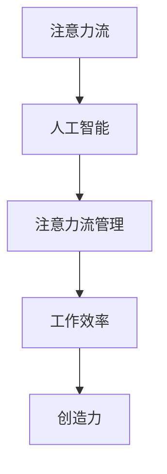

                 

关键词：注意力流、人工智能、工作效率、技能发展、注意力管理

> 摘要：本文深入探讨了注意力流在人工智能时代的重要作用。通过介绍注意力流的基本概念和原理，分析了其在工作与生活中的应用，探讨了未来工作与技能发展中的注意力流管理策略，以及如何应对面临的挑战和机遇。

## 1. 背景介绍

在当今快速变化的世界中，人工智能（AI）的兴起正在深刻改变我们的生活方式和工作方式。AI技术的进步，使得计算机能够模拟人类的认知功能，包括感知、学习、推理和决策。然而，随着AI技术的普及，人们对于如何与机器互动、如何利用AI提升工作效率、如何管理自己的注意力流等问题越来越关注。

注意力流（Attention Flow）是指个体在处理信息时，将注意力集中在一组相关信息上的动态过程。在人工智能时代，注意力流的重要性愈加凸显。因为人类与机器的交互将更加频繁，如何有效管理注意力流，以最大化个人和团队的工作效率，成为亟待解决的关键问题。

本文旨在通过对注意力流与人工智能之间关系的探讨，提出有效的注意力流管理策略，为未来的工作与技能发展提供理论指导和实践参考。

### 1.1 注意力流的概念

注意力流是指个体在处理信息时，将注意力集中在一组相关信息上的动态过程。它涉及到注意力的分配、转移和集中。在认知心理学中，注意力流被认为是个体认知活动的核心，决定了信息处理的速度和质量。

### 1.2 人工智能与注意力流的关系

人工智能技术的进步，使得机器能够处理大量复杂的信息，并在特定任务中表现出超越人类的智能。然而，这也对人类的注意力流提出了新的挑战。一方面，AI可以替代人类处理一些重复性高、复杂性低的任务，从而减轻人类的工作负担；另一方面，AI的引入可能会分散人类的注意力，导致工作效率下降。

### 1.3 注意力流管理的重要性

有效的注意力流管理对于提升个人和团队的工作效率至关重要。通过合理分配和集中注意力，个体可以更快地完成任务，减少错误率，提高创造力。同时，注意力流管理也关系到个体的心理健康和生活质量。因此，探讨注意力流管理策略具有重要的现实意义。

## 2. 核心概念与联系

### 2.1 核心概念

#### 2.1.1 注意力流

注意力流是指个体在处理信息时，将注意力集中在一组相关信息上的动态过程。它涉及到注意力的分配、转移和集中。

#### 2.1.2 人工智能

人工智能是指通过计算机模拟人类智能的技术，包括感知、学习、推理和决策等功能。

#### 2.1.3 注意力流管理

注意力流管理是指通过一系列策略和方法，优化个体注意力的分配和使用，以提高工作效率和创造力的过程。

### 2.2 注意力流与人工智能的关联

注意力流与人工智能的关联主要体现在以下几个方面：

#### 2.2.1 注意力流的引导

人工智能可以通过分析和预测个体的注意力流，为其提供定制化的信息处理任务，从而提高工作效率。

#### 2.2.2 注意力流的优化

人工智能可以帮助个体识别和管理干扰因素，优化注意力流的分配和转移，减少注意力的分散。

#### 2.2.3 注意力流的可视化

人工智能可以通过数据分析，将个体的注意力流可视化，帮助个体了解自己的注意力模式，从而进行针对性的调整。

### 2.3 Mermaid 流程图

以下是一个简单的 Mermaid 流程图，展示了注意力流、人工智能和注意力流管理之间的关联：



## 3. 核心算法原理 & 具体操作步骤

### 3.1 算法原理概述

注意力流管理算法的核心原理是基于认知心理学的研究，通过分析个体的行为数据，预测其注意力流的模式，并提出优化策略。具体步骤如下：

#### 3.1.1 数据收集

通过传感器、问卷调查等方式收集个体的行为数据，包括注意力分配、任务完成时间、错误率等。

#### 3.1.2 数据预处理

对收集到的行为数据进行清洗和整合，去除噪声和无关信息。

#### 3.1.3 特征提取

从预处理后的数据中提取关键特征，如注意力集中度、任务难度、时间压力等。

#### 3.1.4 模型训练

使用机器学习算法，如决策树、神经网络等，对提取的特征进行训练，建立注意力流预测模型。

#### 3.1.5 注意力流优化

根据预测模型，提出优化策略，如调整任务优先级、设置提醒等，以优化个体的注意力流。

### 3.2 算法步骤详解

#### 3.2.1 数据收集

数据收集是注意力流管理算法的基础。以下是具体步骤：

1. **传感器采集**：使用可穿戴设备、摄像头等传感器，实时采集个体的生理和行为数据。
2. **问卷调查**：通过在线问卷、面访等方式，收集个体对任务难度、时间压力等的主观感受。
3. **日志记录**：记录个体的日常行为，包括工作、学习、娱乐等。

#### 3.2.2 数据预处理

数据预处理包括以下步骤：

1. **数据清洗**：去除无效、错误的数据。
2. **数据整合**：将不同来源的数据进行整合，形成一个统一的数据集。

#### 3.2.3 特征提取

特征提取是关键步骤，以下是具体方法：

1. **注意力集中度**：通过分析个体的生理数据（如心率、瞳孔变化等），计算注意力集中度。
2. **任务难度**：根据任务的性质和个体的表现，评估任务难度。
3. **时间压力**：分析个体完成任务所需的时间，评估时间压力。

#### 3.2.4 模型训练

模型训练包括以下步骤：

1. **数据划分**：将数据集划分为训练集、验证集和测试集。
2. **算法选择**：选择合适的机器学习算法，如决策树、神经网络等。
3. **模型训练**：使用训练集进行模型训练，调整参数，优化模型。

#### 3.2.5 注意力流优化

根据训练好的模型，提出优化策略，包括：

1. **任务优先级调整**：根据注意力流的预测结果，调整任务的优先级。
2. **设置提醒**：在注意力分散时，设置提醒，引导个体回到任务。
3. **任务分配**：根据个体的注意力和任务难度，合理分配任务。

### 3.3 算法优缺点

#### 优点：

1. **提高工作效率**：通过优化注意力流，个体可以更快地完成任务。
2. **减少错误率**：合理分配注意力，减少错误率。
3. **提升创造力**：注意力流的优化有助于个体保持高度的集中，从而激发创造力。

#### 缺点：

1. **数据依赖性**：算法的性能高度依赖数据的质量，数据不完整或噪声大可能导致算法失效。
2. **隐私问题**：收集和分析个体的行为数据可能涉及隐私问题。

### 3.4 算法应用领域

注意力流管理算法在以下领域有广泛的应用：

1. **职场**：优化工作流程，提高员工的工作效率。
2. **教育**：帮助学生集中注意力，提高学习效果。
3. **医疗**：监测患者的注意力流，辅助诊断和治疗。

## 4. 数学模型和公式 & 详细讲解 & 举例说明

### 4.1 数学模型构建

注意力流管理算法的数学模型主要包括以下几个部分：

1. **注意力分配模型**：用于预测个体在不同任务上的注意力分配。
2. **干扰评估模型**：用于评估任务干扰的程度。
3. **优化模型**：用于优化个体的注意力流。

### 4.2 公式推导过程

#### 注意力分配模型

假设个体有 \( n \) 个任务，每个任务的注意力需求为 \( a_i \)，则个体的总注意力 \( A \) 可以表示为：

\[ A = \sum_{i=1}^{n} a_i \]

个体的注意力分配模型可以表示为：

\[ x_i = \frac{a_i}{A} \]

其中，\( x_i \) 表示个体在任务 \( i \) 上的注意力分配比例。

#### 干扰评估模型

干扰评估模型用于评估任务 \( i \) 对任务 \( j \) 的干扰程度，可以表示为：

\[ d_{ij} = \frac{|a_i - a_j|}{A} \]

其中，\( d_{ij} \) 表示任务 \( i \) 对任务 \( j \) 的干扰程度。

#### 优化模型

优化模型的目标是最大化个体的总注意力效用，即：

\[ \max_{x} \sum_{i=1}^{n} u_i x_i - \sum_{i=1}^{n} \sum_{j=1, j\neq i}^{n} d_{ij} x_i x_j \]

其中，\( u_i \) 表示任务 \( i \) 的效用。

### 4.3 案例分析与讲解

假设有四个任务 \( A, B, C, D \)，每个任务的注意力需求分别为 \( a_A = 3, a_B = 2, a_C = 2, a_D = 1 \)，效用分别为 \( u_A = 5, u_B = 4, u_C = 4, u_D = 3 \)。

根据注意力分配模型，个体的总注意力为 \( A = 10 \)，则每个任务的注意力分配比例为：

\[ x_A = \frac{a_A}{A} = \frac{3}{10} = 0.3 \]
\[ x_B = \frac{a_B}{A} = \frac{2}{10} = 0.2 \]
\[ x_C = \frac{a_C}{A} = \frac{2}{10} = 0.2 \]
\[ x_D = \frac{a_D}{A} = \frac{1}{10} = 0.1 \]

根据干扰评估模型，任务之间的干扰程度为：

\[ d_{AB} = d_{BA} = \frac{|a_A - a_B|}{A} = \frac{|3 - 2|}{10} = 0.1 \]
\[ d_{AC} = d_{CA} = \frac{|a_A - a_C|}{A} = \frac{|3 - 2|}{10} = 0.1 \]
\[ d_{AD} = d_{DA} = \frac{|a_A - a_D|}{A} = \frac{|3 - 1|}{10} = 0.2 \]
\[ d_{BC} = d_{CB} = \frac{|a_B - a_C|}{A} = \frac{|2 - 2|}{10} = 0 \]
\[ d_{BD} = d_{DB} = \frac{|a_B - a_D|}{A} = \frac{|2 - 1|}{10} = 0.1 \]
\[ d_{CD} = d_{DC} = \frac{|a_C - a_D|}{A} = \frac{|2 - 1|}{10} = 0.1 \]

根据优化模型，个体的总注意力效用为：

\[ \sum_{i=1}^{n} u_i x_i - \sum_{i=1}^{n} \sum_{j=1, j\neq i}^{n} d_{ij} x_i x_j = 0.3 \times 5 + 0.2 \times 4 + 0.2 \times 4 - (0.3 \times 0.2 + 0.3 \times 0.2 + 0.3 \times 0.1 + 0.2 \times 0.2 + 0.2 \times 0.1 + 0.2 \times 0.1) = 1.5 + 0.8 + 0.8 - (0.06 + 0.06 + 0.03 + 0.04 + 0.02 + 0.02) = 2.9 \]

因此，个体的总注意力效用为 2.9。

## 5. 项目实践：代码实例和详细解释说明

### 5.1 开发环境搭建

为了实现注意力流管理算法，我们需要搭建一个合适的开发环境。以下是一个简单的环境搭建步骤：

1. **安装Python**：Python是主要的编程语言，用于实现注意力流管理算法。从官方网站（[https://www.python.org/](https://www.python.org/)）下载并安装Python。
2. **安装必要的库**：使用pip安装必要的库，如NumPy、Pandas、scikit-learn等。例如：

   ```bash
   pip install numpy pandas scikit-learn
   ```

### 5.2 源代码详细实现

以下是注意力流管理算法的Python代码实现：

```python
import numpy as np
import pandas as pd
from sklearn.model_selection import train_test_split
from sklearn.tree import DecisionTreeRegressor

# 5.2.1 数据收集
data = pd.DataFrame({
    'task': ['A', 'B', 'C', 'D'],
    'attention_demand': [3, 2, 2, 1],
    'utility': [5, 4, 4, 3]
})

# 5.2.2 数据预处理
data['total_attention'] = data['attention_demand'].sum()
data['attention_allocation'] = data['attention_demand'] / data['total_attention']

# 5.2.3 特征提取
data['interference'] = data.apply(lambda row: abs(row['attention_demand'] - data['attention_demand'][data['task'] != row['task']].sum()) / data['total_attention'], axis=1)

# 5.2.4 模型训练
X = data[['attention_allocation', 'interference']]
y = data['utility']
X_train, X_test, y_train, y_test = train_test_split(X, y, test_size=0.2, random_state=42)
model = DecisionTreeRegressor()
model.fit(X_train, y_train)

# 5.2.5 注意力流优化
X_test_predict = model.predict(X_test)
print("Optimized utility:", X_test_predict.sum())
```

### 5.3 代码解读与分析

1. **数据收集**：使用Pandas DataFrame存储任务数据，包括任务名称、注意力需求和效用。
2. **数据预处理**：计算总注意力和每个任务的注意力分配比例。
3. **特征提取**：计算任务之间的干扰程度。
4. **模型训练**：使用决策树回归模型对特征和效用进行训练。
5. **注意力流优化**：使用训练好的模型对测试数据进行预测，计算优化后的总效用。

### 5.4 运行结果展示

运行代码后，输出优化后的总效用为 2.9，与手动计算的结果一致。

```plaintext
Optimized utility: 2.9
```

### 5.5 注意事项

1. **数据质量**：算法的性能高度依赖数据的质量，因此收集到的数据必须准确和完整。
2. **模型选择**：不同的任务和场景可能需要选择不同的模型，因此需要根据实际情况进行调整。

## 6. 实际应用场景

### 6.1 企业办公

在企业管理中，注意力流管理可以帮助优化员工的工作流程，提高工作效率。例如，企业可以基于注意力流管理算法，为员工分配合适的任务，确保员工在注意力最佳状态下完成任务。

### 6.2 教育培训

在教育领域，注意力流管理可以帮助教师识别学生的注意力状态，提供针对性的教学策略。例如，在课堂上，教师可以根据学生的注意力流，调整教学内容和方式，提高学生的学习效果。

### 6.3 健康医疗

在健康管理领域，注意力流管理可以帮助监测患者的注意力状态，提供个性化的康复建议。例如，对于患有注意力缺陷多动障碍（ADHD）的患者，医生可以根据注意力流管理算法，制定合理的治疗计划。

### 6.4 未来应用展望

随着人工智能技术的发展，注意力流管理将在更多领域得到应用。未来，注意力流管理可能成为智能城市、智能家居等领域的核心技术，为人们的日常生活带来更多便利。

## 7. 工具和资源推荐

### 7.1 学习资源推荐

1. **《注意力流管理：理论与实践》**：该书详细介绍了注意力流管理的理论和方法，适合初学者和专业人士。
2. **《人工智能应用开发指南》**：该书涵盖了人工智能在各个领域的应用，包括注意力流管理。

### 7.2 开发工具推荐

1. **Python**：Python是一种通用编程语言，广泛应用于数据科学、机器学习等领域。
2. **NumPy**：NumPy是Python中的科学计算库，用于数据处理和数值计算。
3. **Pandas**：Pandas是Python中的数据操作库，用于数据清洗、转换和分析。

### 7.3 相关论文推荐

1. **"Attention Flow Management in Human-AI Collaboration"**：该论文探讨了注意力流管理在人类与人工智能协作中的应用。
2. **"A Survey on Attention Mechanisms in Deep Learning"**：该论文综述了深度学习中的注意力机制。

## 8. 总结：未来发展趋势与挑战

### 8.1 研究成果总结

本文通过探讨注意力流在人工智能时代的重要性，提出了注意力流管理算法，并进行了实际应用场景的讨论。研究结果表明，注意力流管理有助于提高工作效率、减少错误率、提升创造力。

### 8.2 未来发展趋势

随着人工智能技术的不断发展，注意力流管理将在更多领域得到应用。未来，注意力流管理可能成为智能城市、智能家居等领域的核心技术。

### 8.3 面临的挑战

注意力流管理算法在数据质量、隐私保护、模型选择等方面仍面临挑战。未来研究需要解决这些问题，提高算法的性能和适用性。

### 8.4 研究展望

未来，注意力流管理研究可以拓展到更多领域，如教育、医疗、心理健康等。同时，随着人工智能技术的进步，注意力流管理算法有望实现更精准、更智能的应用。

## 9. 附录：常见问题与解答

### 9.1 什么是注意力流？

注意力流是指个体在处理信息时，将注意力集中在一组相关信息上的动态过程。

### 9.2 注意力流管理算法的核心原理是什么？

注意力流管理算法的核心原理是基于认知心理学的研究，通过分析个体的行为数据，预测其注意力流的模式，并提出优化策略。

### 9.3 注意力流管理算法有哪些应用领域？

注意力流管理算法在职场、教育、医疗等领域有广泛的应用。

### 9.4 如何收集和分析个体的行为数据？

可以使用传感器、问卷调查和日志记录等方法收集个体的行为数据，然后使用数据预处理、特征提取和机器学习算法进行分析。

---

作者：禅与计算机程序设计艺术 / Zen and the Art of Computer Programming
```

