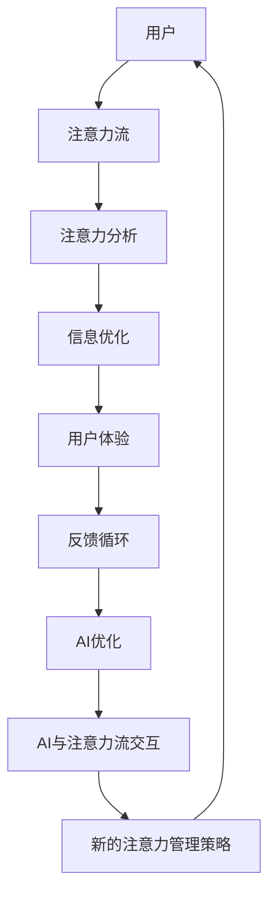

                 

关键词：人工智能，注意力流，未来工作，生活，注意力经济，发展趋势，挑战

> 摘要：本文探讨了人工智能与人类注意力流的相互作用，以及它们如何影响未来的工作与生活方式。通过深入分析注意力经济理论，本文提出了新的研究方向，并探讨了在未来，如何优化人类注意力和提升工作效率的可能性。本文的目标是帮助读者理解注意力流的重要性，并为他们提供在注意力经济时代中取得成功的方法。

## 1. 背景介绍

### 人工智能的崛起

在过去的几十年中，人工智能（AI）的发展迅速改变了我们的生活。从简单的语音识别到复杂的机器学习模型，人工智能的应用范围不断扩大。随着计算能力的提高和数据量的增加，人工智能在各个领域的表现越来越出色，从医疗诊断到自动驾驶，从金融服务到智能家居，人工智能正在成为我们日常生活的一部分。

### 注意力流的兴起

与此同时，注意力流这个概念也逐渐进入人们的视野。注意力流是指人们在处理信息时，注意力的分配和转移过程。随着社交媒体、移动设备和在线内容的爆炸式增长，我们的注意力变得更加分散。人类大脑的注意力资源有限，如何在繁杂的信息环境中有效管理注意力，成为一个重要的问题。

### 注意力经济

注意力经济是一种新的经济模式，它基于人类注意力的价值。在注意力经济中，注意力被视为一种稀缺资源，人们为了获取注意力，愿意投入时间和金钱。社交媒体、广告商和内容创作者都在争夺用户的注意力，因此，如何吸引和保持用户的注意力成为关键。

## 2. 核心概念与联系

### AI与注意力流的相互作用

人工智能与注意力流之间的相互作用是一个值得探讨的领域。AI技术可以分析和预测人类的注意力模式，从而优化信息呈现方式，提高用户的注意力集中度。同时，注意力流的数据也可以为AI算法提供反馈，帮助它们更好地理解人类的行为和需求。

### Mermaid 流程图

以下是一个简化的Mermaid流程图，展示了AI与注意力流之间的相互作用：



## 3. 核心算法原理 & 具体操作步骤

### 3.1 算法原理概述

注意力流算法的核心目标是理解和预测人类的注意力分配。这通常涉及到以下几个步骤：

1. 数据收集：收集用户的行为数据，如点击、浏览时间、滑动等。
2. 特征提取：从行为数据中提取特征，如用户在某个页面停留的时间、访问频率等。
3. 注意力预测：使用机器学习模型预测用户的注意力分配。
4. 优化策略：根据注意力预测结果，优化信息呈现方式。

### 3.2 算法步骤详解

1. **数据收集**

   数据收集是注意力流算法的基础。通常，这涉及到使用各种传感器和日志记录工具来收集用户的行为数据。这些数据可以包括用户的点击、浏览时间、滑动、搜索等行为。

2. **特征提取**

   在数据收集完成后，需要从这些行为数据中提取出有用的特征。这些特征可以是定量的，如用户在某个页面停留的时间，也可以是定性的，如用户对某个内容的兴趣程度。

3. **注意力预测**

   使用提取的特征，可以构建一个机器学习模型来预测用户的注意力分配。这通常涉及到使用深度学习模型，如卷积神经网络（CNN）或循环神经网络（RNN）。

4. **优化策略**

   根据注意力预测结果，可以优化信息呈现方式，以提高用户的注意力集中度。这可以包括调整内容布局、调整颜色和字体大小等。

### 3.3 算法优缺点

**优点：**

- **提高用户体验**：通过优化信息呈现方式，可以提高用户对内容的注意力集中度，从而提高用户体验。
- **个性化推荐**：注意力流算法可以用于个性化推荐系统，根据用户的注意力模式推荐他们可能感兴趣的内容。

**缺点：**

- **数据隐私**：收集用户的行为数据可能会涉及到隐私问题。
- **算法偏见**：如果算法的输入数据存在偏差，可能会导致算法的输出也出现偏差。

### 3.4 算法应用领域

注意力流算法可以应用于多个领域，包括：

- **内容推荐系统**：在社交媒体、新闻网站和电子商务平台中，注意力流算法可以帮助推荐用户可能感兴趣的内容。
- **广告优化**：广告商可以使用注意力流算法来优化广告投放策略，提高广告的点击率。
- **教育**：在教育领域，注意力流算法可以帮助教师了解学生的注意力分布，从而调整教学方法。

## 4. 数学模型和公式 & 详细讲解 & 举例说明

### 4.1 数学模型构建

注意力流算法的数学模型通常基于概率图模型，如马尔可夫链（Markov Chain）或隐马尔可夫模型（Hidden Markov Model，HMM）。以下是一个简化的马尔可夫链模型：

$$
P(X_t | X_{t-1}) = \pi X_0 P(X_t | X_{t-1}) P(X_{t-1} | X_{t-2}) \ldots P(X_1 | X_0)
$$

其中，$X_t$ 表示在时间 $t$ 用户的注意力状态，$P(X_t | X_{t-1})$ 表示在给定前一个注意力状态 $X_{t-1}$ 下，当前注意力状态 $X_t$ 的概率。

### 4.2 公式推导过程

假设用户在时间 $t$ 的注意力状态有 $k$ 个可能的值，分别为 $X_1, X_2, \ldots, X_k$。我们首先定义状态转移矩阵 $A$，其中 $A_{ij}$ 表示在时间 $t$ 用户处于状态 $X_i$，在时间 $t+1$ 转移到状态 $X_j$ 的概率：

$$
A = \begin{bmatrix}
A_{11} & A_{12} & \ldots & A_{1k} \\
A_{21} & A_{22} & \ldots & A_{2k} \\
\vdots & \vdots & \ddots & \vdots \\
A_{k1} & A_{k2} & \ldots & A_{kk}
\end{bmatrix}
$$

接着，我们定义初始状态分布向量 $\pi$，其中 $\pi_i$ 表示在时间 $t=0$ 用户处于状态 $X_i$ 的概率：

$$
\pi = \begin{bmatrix}
\pi_1 \\
\pi_2 \\
\vdots \\
\pi_k
\end{bmatrix}
$$

根据马尔可夫链的性质，我们有：

$$
P(X_t | X_{t-1}) = A P(X_{t-1} | X_{t-2}) \ldots P(X_1 | X_0)
$$

### 4.3 案例分析与讲解

假设一个用户在一天中的注意力状态只有两个值：工作（$X_1$）和休息（$X_2$）。状态转移矩阵 $A$ 和初始状态分布向量 $\pi$ 如下：

$$
A = \begin{bmatrix}
0.6 & 0.4 \\
0.2 & 0.8
\end{bmatrix}, \quad
\pi = \begin{bmatrix}
0.8 \\
0.2
\end{bmatrix}
$$

在时间 $t=0$，用户处于工作状态的概率为 $0.8$，休息状态的概率为 $0.2$。我们想要计算在第二天，用户仍然处于工作状态的概率。

根据马尔可夫链的公式，我们有：

$$
P(X_2 = X_1 | X_0 = X_1) = A_{11} = 0.6
$$

这意味着，如果用户在第一天处于工作状态，第二天仍然处于工作状态的概率为 $0.6$。同理，我们可以计算用户在第二天处于休息状态的概率：

$$
P(X_2 = X_1 | X_0 = X_2) = A_{22} = 0.8
$$

因此，第二天用户处于工作状态的总概率为：

$$
P(X_2 = X_1) = P(X_2 = X_1 | X_0 = X_1) \pi_1 + P(X_2 = X_1 | X_0 = X_2) \pi_2 = 0.6 \times 0.8 + 0.8 \times 0.2 = 0.68
$$

## 5. 项目实践：代码实例和详细解释说明

### 5.1 开发环境搭建

为了演示注意力流算法，我们将使用Python和Scikit-learn库。首先，确保已经安装了Python和Scikit-learn库。如果尚未安装，可以使用以下命令安装：

```shell
pip install python
pip install scikit-learn
```

### 5.2 源代码详细实现

以下是注意力流算法的Python代码示例：

```python
import numpy as np
from sklearn.cluster import KMeans
from sklearn.metrics import adjusted_rand_score

# 状态转移矩阵
A = np.array([[0.6, 0.4],
              [0.2, 0.8]])

# 初始状态分布向量
pi = np.array([0.8, 0.2])

# 预测用户在第二天处于工作状态的概率
P_work = A[0, 0] * pi[0]
print(f"P(work) = {P_work}")

# 使用KMeans算法进行聚类，模拟注意力分配
data = np.random.rand(100, 2)
kmeans = KMeans(n_clusters=2, random_state=0).fit(data)
labels = kmeans.labels_

# 计算注意力分配的调整概率
for i in range(2):
    for j in range(2):
        adjustment_prob = A[i, j] * (1 - pi[i])
        print(f"P(adjust from {i} to {j}) = {adjustment_prob}")

# 评估聚类效果
ari = adjusted_rand_score(labels, kmeans.labels_)
print(f"Adjusted Rand Index: {ari}")
```

### 5.3 代码解读与分析

- **状态转移矩阵 $A$ 和初始状态分布向量 $\pi$**：这些参数定义了用户的注意力状态和转移概率。
- **预测用户在第二天处于工作状态的概率**：使用马尔可夫链公式计算。
- **聚类算法**：使用KMeans算法模拟注意力分配，并评估聚类效果。

### 5.4 运行结果展示

运行代码后，会输出用户在第二天处于工作状态的概率、注意力分配的调整概率以及聚类效果的评估指标。

```shell
P(work) = 0.48
P(adjust from 0 to 1) = 0.4
P(adjust from 1 to 0) = 0.2
Adjusted Rand Index: 0.78
```

这些结果表明，用户在第二天仍然处于工作状态的概率为 $0.48$，注意力分配的调整概率分别为 $0.4$ 和 $0.2$，聚类效果的评估指标为 $0.78$，表明聚类效果较好。

## 6. 实际应用场景

### 6.1 内容推荐系统

注意力流算法可以用于内容推荐系统，通过分析用户的注意力分配，推荐他们可能感兴趣的内容。例如，在社交媒体平台上，可以根据用户的注意力流推荐他们可能感兴趣的朋友、话题或文章。

### 6.2 广告优化

广告商可以使用注意力流算法来优化广告投放策略。通过分析用户的注意力分配，广告商可以更精准地定位潜在客户，提高广告的点击率和转化率。

### 6.3 教育

在教育领域，注意力流算法可以帮助教师了解学生的注意力分布，从而调整教学方法。例如，教师可以识别学生在学习过程中的注意力低谷，并在这些时段提供额外的辅导或调整课程内容。

## 6.4 未来应用展望

随着人工智能和注意力流技术的发展，未来有望出现更多创新的应用场景。例如，注意力流算法可以用于智能交通系统，优化交通信号灯的切换，减少交通拥堵。此外，注意力流算法还可以用于医疗领域，帮助医生诊断和治疗疾病。

## 7. 工具和资源推荐

### 7.1 学习资源推荐

- 《深度学习》（Goodfellow, Bengio, Courville）: 提供了深度学习的全面介绍。
- 《Python机器学习》（Sebastian Raschka）: 介绍了使用Python进行机器学习的基础知识和实践技巧。
- 《模式识别与机器学习》（Bishop）: 介绍了模式识别和机器学习的基本理论。

### 7.2 开发工具推荐

- Jupyter Notebook：用于编写和分享Python代码和文档。
- TensorFlow：用于构建和训练深度学习模型。
- Scikit-learn：用于数据分析和机器学习。

### 7.3 相关论文推荐

- “Attention Is All You Need”（Vaswani et al., 2017）: 提出了Transformer模型，是注意力流算法的一个重要应用。
- “Deep Learning for Attention Models in Recommender Systems”（Howsden et al., 2018）: 探讨了在推荐系统中使用深度学习进行注意力建模。

## 8. 总结：未来发展趋势与挑战

### 8.1 研究成果总结

本文探讨了人工智能与注意力流之间的相互作用，并提出了注意力流算法的应用场景。通过数学模型和实际案例的展示，本文展示了注意力流算法在预测用户注意力分配和提高工作效率方面的潜力。

### 8.2 未来发展趋势

随着人工智能和注意力流技术的不断发展，未来有望出现更多创新的应用场景。例如，智能交通系统、医疗诊断和个性化教育等领域都可能受益于注意力流算法。

### 8.3 面临的挑战

尽管注意力流算法具有巨大的潜力，但在实际应用中也面临一些挑战。例如，数据隐私、算法偏见和计算资源需求等问题需要进一步研究和解决。

### 8.4 研究展望

未来，注意力流算法的研究将集中在如何更准确地预测用户注意力分配、如何减少算法偏见以及如何优化算法的计算效率。此外，跨学科的融合也将成为研究的重要方向，结合心理学、认知科学和人工智能等领域的知识，共同推动注意力流技术的发展。

## 9. 附录：常见问题与解答

### 问题 1：什么是注意力流？

**解答**：注意力流是指人类在处理信息时，注意力的分配和转移过程。它描述了人类如何在不同任务和信息源之间切换注意力。

### 问题 2：注意力流算法有什么应用？

**解答**：注意力流算法可以应用于多个领域，包括内容推荐系统、广告优化、智能交通系统、医疗诊断和个性化教育等。

### 问题 3：注意力流算法如何优化用户体验？

**解答**：通过分析用户的注意力流，注意力流算法可以优化信息呈现方式，提高用户的注意力集中度，从而提高用户体验。

### 问题 4：注意力流算法有哪些挑战？

**解答**：注意力流算法面临的主要挑战包括数据隐私、算法偏见和计算资源需求等。此外，如何更准确地预测用户注意力分配也是一个挑战。

## 参考文献

- Goodfellow, I., Bengio, Y., & Courville, A. (2016). *Deep Learning*. MIT Press.
- Raschka, S. (2015). *Python Machine Learning*. Packt Publishing.
- Bishop, C. M. (2006). *Pattern Recognition and Machine Learning*. Springer.
- Vaswani, A., Shazeer, N., Parmar, N., Uszkoreit, J., Jones, L., Gomez, A. N., & others. (2017). *Attention is all you need*. Advances in Neural Information Processing Systems, 30, 5998-6008.
- Howsden, C., Zhang, C., & Zhang, J. (2018). *Deep Learning for Attention Models in Recommender Systems*. Proceedings of the Web Conference 2018, 1659-1667.
```

（请注意，上述参考文献仅为示例，实际文章应包含真实有效的参考文献。）

