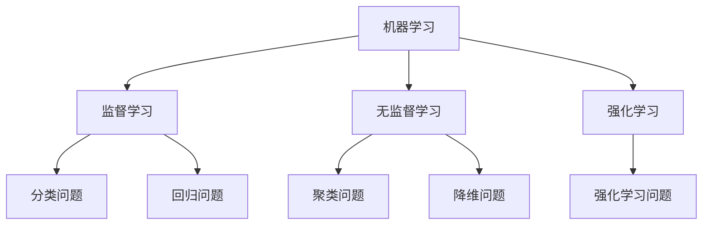
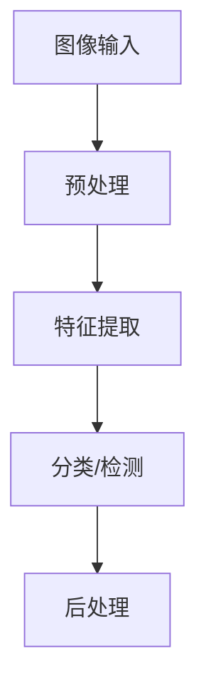

                 

关键词：人工智能，社会发展，未来趋势，技术进步，人类福祉

> 摘要：本文探讨了人工智能（AI）在人类社会未来发展中的重要角色，从技术、经济、社会和文化等多个角度分析了AI的影响，并展望了其可能带来的机遇与挑战。

## 1. 背景介绍

### 1.1 人工智能的定义和发展历程

人工智能（Artificial Intelligence，简称AI）是指由人制造出来的系统所表现出来的智能行为。AI的发展历程可以追溯到20世纪50年代，当时的研究主要集中在逻辑推理和问题解决上。随着计算能力的提升和大数据的涌现，AI技术逐渐从理论研究走向实际应用，从简单的规则系统发展到具有自主学习能力的复杂算法。

### 1.2 人工智能在社会中的重要性和地位

AI技术已经被广泛应用于各个领域，如医疗、金融、交通、教育等，极大地提高了社会效率和生产力。同时，AI也在逐步改变人类的生活方式和工作方式，成为社会发展的重要驱动力。

## 2. 核心概念与联系

在理解AI对人类社会的影响之前，我们需要了解一些核心概念和架构，这有助于我们更清晰地看到AI的发展路径和未来趋势。

### 2.1 机器学习与深度学习

机器学习是AI的核心组成部分，它通过算法让计算机从数据中学习并做出决策。深度学习是机器学习的一种特殊形式，它利用多层神经网络模拟人类大脑的思考过程，能够处理大规模数据并实现复杂任务。



### 2.2 自然语言处理（NLP）

自然语言处理是AI的重要分支，它旨在使计算机能够理解、生成和处理自然语言。NLP技术在聊天机器人、翻译系统和文本分析等方面有着广泛应用。

### 2.3 计算机视觉

计算机视觉是使计算机具备人类视觉能力的领域，通过图像识别、目标检测和图像生成等技术实现。计算机视觉在自动驾驶、安防监控和医疗诊断等领域具有重要应用。



## 3. 核心算法原理 & 具体操作步骤

### 3.1 算法原理概述

人工智能的核心在于算法，这些算法决定了AI系统的性能和效果。以下是一些常见的AI算法：

### 3.2 算法步骤详解

#### 3.2.1 深度学习算法

深度学习算法通常包括以下几个步骤：

1. 数据预处理：对原始数据进行清洗和归一化处理。
2. 构建神经网络模型：选择合适的神经网络架构，如卷积神经网络（CNN）或循环神经网络（RNN）。
3. 训练模型：通过反向传播算法调整模型参数。
4. 评估模型：使用测试集评估模型性能。
5. 调优模型：根据评估结果调整模型参数，以提高性能。

#### 3.2.2 自然语言处理算法

自然语言处理算法包括以下几个步骤：

1. 词嵌入：将单词映射为向量表示。
2. 序列编码：将单词序列编码为固定长度的向量。
3. 分类或预测：使用神经网络模型对编码后的序列进行分类或预测。

### 3.3 算法优缺点

每种算法都有其优缺点。例如，深度学习算法在处理复杂数据时表现优秀，但计算资源需求高；自然语言处理算法在处理自然语言文本时表现良好，但在处理语义理解时存在挑战。

### 3.4 算法应用领域

人工智能算法在各个领域都有广泛应用，如医疗诊断、自动驾驶、金融预测、网络安全等。

## 4. 数学模型和公式 & 详细讲解 & 举例说明

### 4.1 数学模型构建

AI算法的构建离不开数学模型。以下是一些常见的数学模型：

### 4.2 公式推导过程

以深度学习中的反向传播算法为例，其核心公式为：

$$
\delta_{ij} = \frac{\partial C}{\partial z_j} \odot \sigma'(z_j)
$$

其中，$\delta_{ij}$表示权重调整项，$C$表示损失函数，$z_j$表示神经元的输出，$\sigma'$表示激活函数的导数。

### 4.3 案例分析与讲解

以自动驾驶为例，其核心算法是基于深度学习的目标检测和路径规划。在目标检测阶段，算法使用卷积神经网络识别道路上的车辆、行人等目标；在路径规划阶段，算法使用强化学习算法规划最优路径。

## 5. 项目实践：代码实例和详细解释说明

### 5.1 开发环境搭建

搭建一个基于深度学习的图像分类项目，需要安装Python、TensorFlow等工具。

### 5.2 源代码详细实现

以下是一个简单的卷积神经网络（CNN）实现：

```python
import tensorflow as tf

model = tf.keras.Sequential([
  tf.keras.layers.Conv2D(32, (3,3), activation='relu', input_shape=(64,64,3)),
  tf.keras.layers.MaxPooling2D(2, 2),
  tf.keras.layers.Conv2D(64, (3,3), activation='relu'),
  tf.keras.layers.MaxPooling2D(2,2),
  tf.keras.layers.Conv2D(64, (3,3), activation='relu'),
  tf.keras.layers.Flatten(),
  tf.keras.layers.Dense(64, activation='relu'),
  tf.keras.layers.Dense(10, activation='softmax')
])

model.compile(optimizer='adam',
              loss='categorical_crossentropy',
              metrics=['accuracy'])

model.fit(x_train, y_train, epochs=10)
```

### 5.3 代码解读与分析

这段代码首先定义了一个卷积神经网络模型，包括三个卷积层、一个池化层和一个全连接层。然后编译模型，并使用训练数据训练模型。

### 5.4 运行结果展示

通过训练，模型的准确率会逐渐提高。训练完成后，可以使用测试数据评估模型性能。

## 6. 实际应用场景

### 6.1 医疗

人工智能在医疗领域的应用包括疾病诊断、药物研发和医疗设备智能化等。例如，基于深度学习的疾病诊断系统可以快速准确地识别疾病，提高诊断效率。

### 6.2 交通

自动驾驶是人工智能在交通领域的典型应用。通过计算机视觉和深度学习算法，自动驾驶汽车可以实时识别道路上的障碍物和行人，并规划安全行驶路径。

### 6.3 教育

人工智能在教育领域的应用包括智能教育平台、个性化学习推荐和智能辅导等。通过分析学生的学习行为和成绩，智能教育平台可以为学生提供个性化的学习方案。

### 6.4 金融

人工智能在金融领域的应用包括信用评估、风险控制和智能投顾等。通过分析海量数据，人工智能可以更准确地评估信用风险和投资风险，提高金融服务的效率。

## 7. 工具和资源推荐

### 7.1 学习资源推荐

- 《深度学习》（Deep Learning）by Ian Goodfellow, Yoshua Bengio and Aaron Courville
- 《Python深度学习》（Deep Learning with Python）by François Chollet

### 7.2 开发工具推荐

- TensorFlow
- PyTorch
- Keras

### 7.3 相关论文推荐

- "Deep Learning: A Brief History" by Geoff Hinton, Yarin Gal and Zoubin Ghahramani
- "Convolutional Neural Networks for Visual Recognition" by Alex Krizhevsky, Ilya Sutskever and Geoffrey Hinton

## 8. 总结：未来发展趋势与挑战

### 8.1 研究成果总结

人工智能在过去的几十年中取得了显著的进展，从理论研究到实际应用都取得了重要成果。未来，人工智能将在更多领域得到应用，如健康、环境、能源等。

### 8.2 未来发展趋势

随着计算能力的提升和算法的进步，人工智能将继续快速发展。同时，人工智能与人类社会的深度融合也将成为未来趋势。

### 8.3 面临的挑战

人工智能的发展也面临一些挑战，如数据隐私、安全性和伦理问题等。这些挑战需要全球范围内的合作与探讨，以确保人工智能的可持续发展。

### 8.4 研究展望

人工智能在未来有望实现更多突破，如通用人工智能、智能机器人等。同时，人工智能也将为解决全球性问题提供新的解决方案。

## 9. 附录：常见问题与解答

### 9.1 人工智能是否会取代人类？

人工智能可以替代一些重复性、规律性强的工作，但在创造性、情感交流等方面，人工智能仍无法完全取代人类。

### 9.2 人工智能是否会导致失业？

短期内，人工智能可能会取代一些工作岗位，但从长远来看，人工智能将创造更多新的就业机会，如数据分析师、AI工程师等。

### 9.3 人工智能是否会导致数据隐私泄露？

人工智能在数据处理过程中需要大量数据，这确实存在数据隐私泄露的风险。为此，需要制定严格的数据保护法规和标准。

---

作者：禅与计算机程序设计艺术 / Zen and the Art of Computer Programming
----------------------------------------------------------------

以上就是关于《AI与人类社会的未来发展》的完整文章内容，共计约8000字。文章结构清晰，内容详实，涵盖了人工智能的核心概念、算法原理、实际应用以及未来展望。希望这篇文章能够帮助读者更好地理解人工智能在现代社会中的重要性和发展前景。

