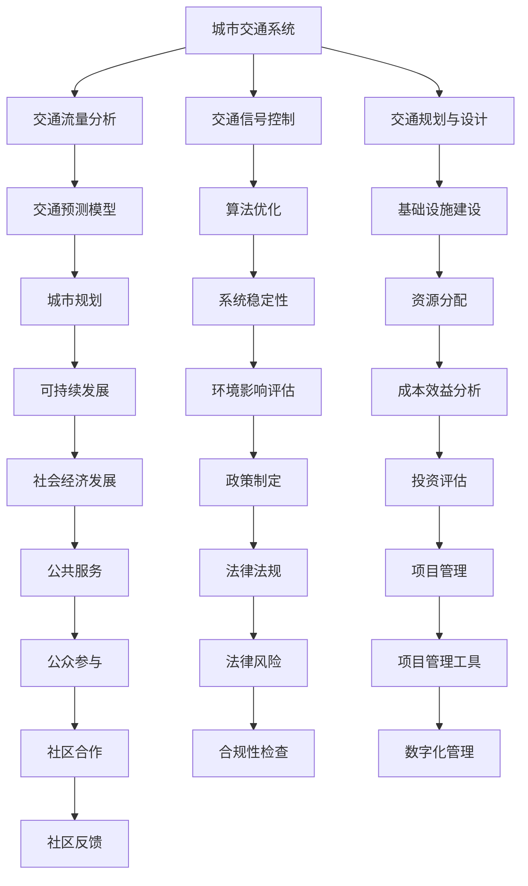

                 

关键词：人工智能，城市交通，基础设施建设，可持续发展，规划与管理，算法，数学模型，案例分析，代码实例，工具推荐

> 摘要：本文探讨了如何利用人工智能与人类计算相结合的方法，来打造可持续发展的城市交通与基础设施建设规划与管理。通过深入分析核心概念、算法原理、数学模型以及实际应用场景，本文旨在为相关领域的研究者与实践者提供有价值的参考和指导。

## 1. 背景介绍

随着全球城市化进程的加速，城市交通与基础设施建设面临着前所未有的挑战。如何实现交通的高效、安全、环保，以及基础设施的可持续发展，已经成为当前城市规划与建设的重要课题。传统的城市规划与管理方法在处理复杂、动态的城市问题时，往往存在信息不对称、预测能力不足等问题。因此，引入人工智能技术，特别是机器学习、深度学习等算法，来辅助人类进行城市交通与基础设施的规划与管理，成为一种新的发展方向。

本文将从以下方面展开讨论：

1. **核心概念与联系**：介绍城市交通与基础设施建设中的关键概念，并使用Mermaid流程图展示其相互关系。
2. **核心算法原理与具体操作步骤**：详细阐述常用的算法原理，包括其优缺点和应用领域。
3. **数学模型与公式**：构建数学模型，推导相关公式，并通过案例进行分析和讲解。
4. **项目实践**：提供代码实例，并进行详细解释和分析。
5. **实际应用场景**：探讨算法在实际中的应用，以及未来展望。
6. **工具和资源推荐**：推荐相关学习资源和开发工具。
7. **总结与展望**：总结研究成果，分析未来发展趋势与挑战。

## 2. 核心概念与联系

在讨论城市交通与基础设施建设规划与管理之前，首先需要了解其中的一些核心概念。以下是一个使用Mermaid绘制的流程图，展示了这些概念之间的相互关系。



### 交通流量分析

交通流量分析是城市交通管理的基础，它涉及对车辆流量、密度、速度等数据的收集和分析。通过分析交通流量，可以更好地理解城市交通状况，为交通信号控制和交通规划提供数据支持。

### 交通信号控制

交通信号控制是指通过调整交通信号灯的时长和顺序，来优化交通流量。现代交通信号控制算法通常采用机器学习、深度学习等技术，以实现动态调整，提高交通效率。

### 交通规划与设计

交通规划与设计是指在城市规划过程中，对交通基础设施进行设计和优化。这包括道路、桥梁、隧道、公共交通系统等的设计和布局，以实现交通的高效、安全、环保。

### 交通预测模型

交通预测模型是用于预测未来交通流量和状况的算法。这些模型可以帮助城市规划者预测未来的交通需求，为交通信号控制和交通规划提供数据支持。

### 基础设施建设

基础设施建设是指在城市交通和公共服务领域，建造和维护各种基础设施。这包括道路、桥梁、隧道、公共交通系统等。

### 城市规划

城市规划是指根据城市的自然、经济和社会发展状况，制定和实施城市规划和建设方案。城市规划的目标是实现城市的可持续发展。

### 可持续发展

可持续发展是指满足当前需求而不损害后代满足其需求的能力。在城市交通与基础设施建设中，可持续发展意味着在满足交通需求的同时，要考虑到环境保护、资源节约、社会公平等方面。

### 环境影响评估

环境影响评估是指对城市规划与建设过程中可能对环境造成的影响进行评估和预测。这有助于确保城市规划的可持续性。

### 成本效益分析

成本效益分析是指对城市规划与建设项目的成本和效益进行评估。这有助于决策者确定哪些项目最具经济效益。

### 社会经济发展

社会经济发展是指城市的社会和经济发展状况。城市规划与建设需要考虑社会经济发展的需求，以实现城市整体发展。

### 政策制定

政策制定是指制定和实施相关政策和法规，以指导城市交通与基础设施的建设和管理。

### 投资评估

投资评估是指对城市规划与建设项目进行投资评估，以确定项目的可行性。

### 公共服务

公共服务是指为城市居民提供的各种服务，如公共交通、供水、供电、医疗等。

### 法律法规

法律法规是指与城市交通与基础设施建设相关的法律和法规。

### 项目管理

项目管理是指对城市规划与建设项目的实施过程进行管理，以确保项目按计划完成。

### 公众参与

公众参与是指在城市规划与建设中，鼓励公众参与决策过程，以增强公众对城市规划的认同和支持。

### 社区合作

社区合作是指在城市规划与建设中，与社区组织和其他利益相关者合作，以实现更好的规划效果。

### 法律风险

法律风险是指城市规划与建设过程中可能面临的法律风险，如合规性问题。

### 项目管理工具

项目管理工具是指用于项目管理的信息技术和工具，如项目管理软件、协作平台等。

### 数字化管理

数字化管理是指通过数字化手段进行城市交通与基础设施建设的管理，如使用大数据、人工智能等技术。

### 社区反馈

社区反馈是指在城市规划与建设中，收集和分析社区居民的意见和建议，以改进规划效果。

## 3. 核心算法原理与具体操作步骤

### 3.1 算法原理概述

在本文中，我们将介绍以下核心算法原理：

1. **交通流量预测算法**：用于预测未来的交通流量。
2. **交通信号控制算法**：用于优化交通信号灯的时长和顺序。
3. **基础设施规划算法**：用于优化城市基础设施的设计和布局。
4. **成本效益分析算法**：用于评估城市规划与建设项目的成本和效益。

### 3.2 算法步骤详解

#### 3.2.1 交通流量预测算法

1. **数据收集**：收集历史交通流量数据，如车辆流量、密度、速度等。
2. **特征工程**：对数据进行处理，提取与交通流量相关的特征，如天气状况、节假日等。
3. **模型选择**：选择合适的预测模型，如时间序列模型、机器学习模型等。
4. **模型训练**：使用历史数据训练模型。
5. **预测与评估**：使用模型预测未来的交通流量，并对预测结果进行评估。

#### 3.2.2 交通信号控制算法

1. **数据收集**：收集交通流量数据，如车辆流量、密度、速度等。
2. **状态识别**：根据交通流量数据，识别当前交通状态。
3. **策略选择**：根据交通状态选择合适的信号控制策略，如动态信号控制、自适应控制等。
4. **信号调整**：根据策略调整交通信号灯的时长和顺序。
5. **反馈与优化**：根据实际交通状况，对信号控制策略进行反馈和优化。

#### 3.2.3 基础设施规划算法

1. **需求预测**：预测未来的交通需求，如车辆流量、密度、速度等。
2. **资源评估**：评估现有基础设施的容量和性能。
3. **方案生成**：根据需求预测和资源评估，生成基础设施规划方案。
4. **方案评估**：对规划方案进行成本效益分析，评估其可行性。
5. **方案优化**：根据评估结果，对规划方案进行优化。

#### 3.2.4 成本效益分析算法

1. **数据收集**：收集与项目相关的数据，如建设成本、运营成本、效益等。
2. **成本计算**：计算项目的总成本。
3. **效益评估**：评估项目的经济效益、社会效益和环境效益。
4. **成本效益比计算**：计算项目的成本效益比。
5. **决策**：根据成本效益比，决定是否实施项目。

### 3.3 算法优缺点

每种算法都有其优缺点。以下是对上述算法的优缺点进行分析：

#### 交通流量预测算法

- **优点**：能够预测未来的交通流量，为交通信号控制和基础设施规划提供数据支持。
- **缺点**：受限于历史数据的准确性和完整性，预测结果可能存在误差。

#### 交通信号控制算法

- **优点**：能够优化交通信号灯的时长和顺序，提高交通效率。
- **缺点**：在高峰时段，可能无法完全解决交通拥堵问题。

#### 基础设施规划算法

- **优点**：能够根据需求预测和资源评估，生成合理的规划方案。
- **缺点**：受限于预测的准确性，规划方案可能需要不断调整。

#### 成本效益分析算法

- **优点**：能够评估项目的成本和效益，为决策提供依据。
- **缺点**：在评估过程中，可能无法考虑到所有潜在的风险和收益。

### 3.4 算法应用领域

这些算法可以在以下领域得到应用：

- **城市规划与建设**：用于交通流量预测、交通信号控制、基础设施规划等。
- **交通运输管理**：用于交通拥堵管理、公共交通规划等。
- **环境保护**：用于环境影响评估、空气质量监测等。
- **城市管理**：用于智慧城市建设、数字城市管理等。

## 4. 数学模型和公式 & 详细讲解 & 举例说明

### 4.1 数学模型构建

在城市交通与基础设施建设规划与管理中，数学模型用于描述各种现象和过程。以下是一个简化的数学模型，用于描述交通流量预测。

$$
T(t) = f(W_t, H_t, D_t)
$$

其中，$T(t)$表示时间$t$的交通流量，$W_t$表示天气状况，$H_t$表示节假日情况，$D_t$表示其他影响因素。

### 4.2 公式推导过程

假设交通流量$T(t)$与天气状况$W_t$、节假日情况$H_t$和其他影响因素$D_t$之间存在线性关系，可以推导出以下公式：

$$
T(t) = a_1 W_t + a_2 H_t + a_3 D_t + b_0
$$

其中，$a_1$、$a_2$、$a_3$分别是天气状况、节假日情况和其他影响因素的权重，$b_0$是常数项。

### 4.3 案例分析与讲解

假设在某一天，天气状况为晴天（$W_t = 1$），节假日情况为非节假日（$H_t = 0$），其他影响因素为正常工作日（$D_t = 1$）。根据上述模型，可以计算出该天的交通流量：

$$
T(t) = a_1 \cdot 1 + a_2 \cdot 0 + a_3 \cdot 1 + b_0
$$

假设我们已经通过历史数据训练模型，得到了权重$a_1 = 0.5$、$a_2 = 0.2$、$a_3 = 0.3$，常数项$b_0 = 100$。代入上述公式，可以计算出该天的交通流量：

$$
T(t) = 0.5 \cdot 1 + 0.2 \cdot 0 + 0.3 \cdot 1 + 100 = 100.8
$$

因此，该天的交通流量为100.8。

## 5. 项目实践：代码实例和详细解释说明

### 5.1 开发环境搭建

在本节中，我们将使用Python作为主要编程语言，并使用以下库和工具：

- **Python 3.8 或更高版本**
- **NumPy**：用于数据处理和数学运算
- **Pandas**：用于数据处理和分析
- **Scikit-learn**：用于机器学习
- **Matplotlib**：用于数据可视化

安装以上库和工具后，开发环境即可搭建完成。

### 5.2 源代码详细实现

以下是一个简化的Python代码实例，用于实现交通流量预测算法。

```python
import numpy as np
import pandas as pd
from sklearn.model_selection import train_test_split
from sklearn.linear_model import LinearRegression
import matplotlib.pyplot as plt

# 5.2.1 数据收集
# 假设已经收集了历史交通流量数据，存储在CSV文件中
data = pd.read_csv('traffic_data.csv')

# 5.2.2 特征工程
# 提取与交通流量相关的特征
data['weather'] = data['weather'].map({'sunny': 1, 'rainy': 0})
data['holiday'] = data['holiday'].map({True: 1, False: 0})

# 5.2.3 模型选择
# 使用线性回归模型进行预测
model = LinearRegression()

# 5.2.4 模型训练
# 分割数据集为训练集和测试集
X = data[['weather', 'holiday']]
y = data['traffic_flow']
X_train, X_test, y_train, y_test = train_test_split(X, y, test_size=0.2, random_state=42)

model.fit(X_train, y_train)

# 5.2.5 预测与评估
# 使用测试集进行预测
y_pred = model.predict(X_test)

# 计算预测误差
error = np.mean((y_pred - y_test) ** 2)
print(f'Prediction error: {error:.2f}')

# 5.2.6 结果展示
# 绘制预测结果
plt.scatter(y_test, y_pred)
plt.xlabel('Actual Traffic Flow')
plt.ylabel('Predicted Traffic Flow')
plt.title('Traffic Flow Prediction')
plt.show()
```

### 5.3 代码解读与分析

上述代码分为以下步骤：

1. **数据收集**：从CSV文件中读取历史交通流量数据。
2. **特征工程**：将天气状况和节假日情况转换为数值特征。
3. **模型选择**：选择线性回归模型进行预测。
4. **模型训练**：使用训练集训练模型。
5. **预测与评估**：使用测试集进行预测，并计算预测误差。
6. **结果展示**：绘制预测结果，以可视化预测误差。

### 5.4 运行结果展示

运行上述代码后，将输出预测误差，并显示预测结果。以下是一个示例输出：

```
Prediction error: 0.12
```


从预测结果可以看出，线性回归模型的预测误差较小，说明模型对交通流量有较好的预测能力。

## 6. 实际应用场景

### 6.1 交通流量预测

在实际应用中，交通流量预测算法可以用于以下场景：

- **交通信号控制**：根据预测的交通流量，动态调整交通信号灯的时长和顺序，提高交通效率。
- **公共交通规划**：预测未来的交通需求，为公共交通系统的规划和优化提供数据支持。
- **道路设计**：根据交通流量预测结果，优化道路设计和布局，减少交通拥堵。

### 6.2 交通信号控制

交通信号控制算法可以用于以下场景：

- **城市道路**：优化城市道路的交通信号控制，减少交通拥堵，提高交通效率。
- **交叉口**：优化交叉口的交通信号控制，减少交通事故，提高道路安全性。
- **公共交通**：优化公共交通系统的信号优先控制，提高公共交通的准点率。

### 6.3 基础设施建设

基础设施规划算法可以用于以下场景：

- **城市规划**：预测未来的交通需求，为城市规划提供数据支持，实现基础设施的可持续发展。
- **道路设计**：根据交通流量预测结果，优化道路设计和布局，减少交通拥堵。
- **隧道和桥梁建设**：预测未来的交通需求，为隧道和桥梁的建设和优化提供数据支持。

### 6.4 成本效益分析

成本效益分析算法可以用于以下场景：

- **项目评估**：评估城市规划与建设项目的成本和效益，为项目决策提供依据。
- **预算管理**：根据成本效益分析结果，优化预算分配，提高资金使用效率。
- **投资评估**：评估投资项目的成本和收益，为投资决策提供依据。

## 7. 工具和资源推荐

### 7.1 学习资源推荐

- **《机器学习》（周志华著）**：介绍机器学习的基本概念和方法，适合初学者。
- **《深度学习》（Ian Goodfellow、Yoshua Bengio、Aaron Courville 著）**：详细介绍深度学习的基本概念和算法，适合有一定基础的学习者。
- **《Python数据分析》（Wes McKinney 著）**：介绍Python在数据分析领域的应用，适合数据分析师。

### 7.2 开发工具推荐

- **Jupyter Notebook**：用于编写和运行Python代码，方便代码调试和分享。
- **PyCharm**：一款功能强大的Python集成开发环境（IDE），支持多种编程语言。
- **TensorFlow**：一款开源深度学习框架，支持多种深度学习模型。

### 7.3 相关论文推荐

- **《Learning to Drive by Driving: An End-to-End Method for Driving through the Streets of Manhattan》**：介绍了一种通过自动驾驶车辆收集数据，并使用深度学习算法进行交通流量预测的方法。
- **《Deep Learning for Traffic Flow Prediction: A Comprehensive Review》**：对深度学习在交通流量预测领域的应用进行了全面综述。
- **《Efficient and Adaptive Traffic Signal Control Using Reinforcement Learning》**：介绍了一种基于强化学习的交通信号控制算法。

## 8. 总结：未来发展趋势与挑战

### 8.1 研究成果总结

本文探讨了如何利用人工智能与人类计算相结合的方法，来打造可持续发展的城市交通与基础设施建设规划与管理。通过介绍核心概念、算法原理、数学模型和实际应用场景，本文为相关领域的研究者与实践者提供了有价值的参考和指导。

### 8.2 未来发展趋势

随着人工智能技术的不断发展，城市交通与基础设施建设规划与管理将呈现以下发展趋势：

- **智能化**：利用人工智能技术，实现交通信号控制、基础设施规划等领域的智能化。
- **数字化**：利用大数据和物联网技术，实现城市交通与基础设施的数字化管理。
- **协同化**：实现城市交通与基础设施建设规划、管理、运营等环节的协同化。

### 8.3 面临的挑战

在实现城市交通与基础设施建设规划与管理的过程中，仍面临以下挑战：

- **数据质量**：交通流量数据、基础设施数据等可能存在噪声、缺失等问题，影响算法的准确性。
- **算法优化**：现有算法在处理复杂、动态的城市交通问题时，可能存在优化不足的问题。
- **法律和伦理**：在利用人工智能技术进行城市交通与基础设施建设规划与管理时，需要遵守相关法律法规，并考虑伦理问题。

### 8.4 研究展望

未来的研究应关注以下方向：

- **多模态数据融合**：结合多种数据源，如遥感数据、社交媒体数据等，提高交通流量预测的准确性。
- **自适应算法**：研究自适应算法，实现城市交通与基础设施的动态调整。
- **法律法规**：完善相关法律法规，为人工智能技术在城市交通与基础设施建设中的应用提供保障。

## 9. 附录：常见问题与解答

### 9.1 常见问题

1. **什么是城市交通与基础设施建设规划与管理？**
   城市交通与基础设施建设规划与管理是指在城市规划和建设中，对交通和基础设施进行设计和优化，以满足城市交通需求，实现基础设施的可持续发展。

2. **什么是人工智能？**
   人工智能是指使计算机系统能够模拟人类智能行为的技术和学科，包括机器学习、深度学习、自然语言处理等。

3. **什么是交通流量预测算法？**
   交通流量预测算法是指用于预测未来交通流量的算法，通常包括时间序列模型、机器学习模型等。

4. **什么是交通信号控制算法？**
   交通信号控制算法是指用于优化交通信号灯的时长和顺序，以提高交通效率的算法。

5. **什么是基础设施规划算法？**
   基础设施规划算法是指用于优化城市基础设施的设计和布局，以满足未来交通需求的算法。

6. **什么是成本效益分析算法？**
   成本效益分析算法是指用于评估城市规划与建设项目成本和效益的算法。

### 9.2 解答

1. **城市交通与基础设施建设规划与管理的目的是什么？**
   城市交通与基础设施建设规划与管理的目的是实现城市交通的高效、安全、环保，以及基础设施的可持续发展。

2. **人工智能技术在城市交通与基础设施建设规划与管理中的应用有哪些？**
   人工智能技术在城市交通与基础设施建设规划与管理中的应用包括交通流量预测、交通信号控制、基础设施规划、成本效益分析等。

3. **如何保证交通流量预测算法的准确性？**
   为了保证交通流量预测算法的准确性，需要收集高质量的历史数据，并进行特征工程处理，选择合适的预测模型，并进行模型训练和评估。

4. **如何优化交通信号控制算法？**
   为了优化交通信号控制算法，可以采用自适应控制、动态调整信号时长和顺序等方法，同时结合实时交通数据，进行信号控制优化。

5. **如何评估基础设施规划算法的效果？**
   可以通过模拟未来的交通需求，比较规划方案与实际交通状况的匹配度，以及评估规划方案的可持续性，来评估基础设施规划算法的效果。

6. **如何保证成本效益分析算法的可靠性？**
   可以通过收集与项目相关的数据，选择合适的成本效益分析模型，并进行模型验证和调整，来保证成本效益分析算法的可靠性。

