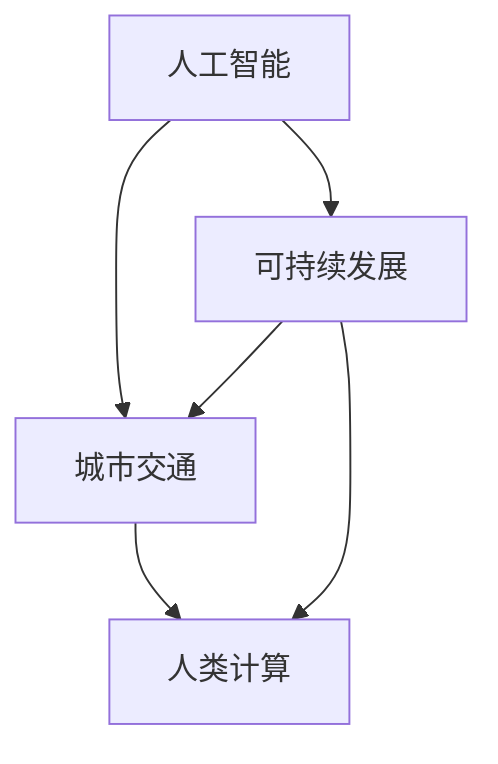
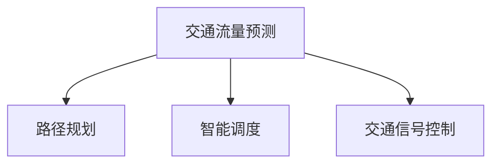

                 

关键词：人工智能，城市交通，规划，可持续发展，算法，数学模型

> 摘要：本文从人工智能与人类计算的交叉视角，探讨了城市交通与规划中的可持续性问题。通过核心概念、算法原理、数学模型以及项目实践等多个角度，分析了AI技术在城市交通领域的应用，并展望了其未来发展。

## 1. 背景介绍

随着全球城市化进程的加快，城市交通问题日益严峻。交通拥堵、环境污染、资源浪费等问题不仅影响了居民的生活质量，还对城市的可持续发展构成了挑战。传统的交通规划方法主要依赖于经验和统计数据，往往难以适应动态变化的城市交通环境。而人工智能（AI）技术的快速发展，为城市交通与规划提供了新的解决思路。

本文旨在探讨如何利用人工智能与人类计算的融合，打造可持续发展的城市交通与规划体系。通过分析核心概念、算法原理、数学模型以及实际项目实践，本文将探讨AI技术在城市交通领域的应用潜力，并提出未来发展展望。

## 2. 核心概念与联系

在探讨AI与城市交通的关系之前，我们首先需要明确一些核心概念。

### 2.1 人工智能

人工智能是指通过计算机程序模拟人类智能行为的技术。它包括机器学习、深度学习、自然语言处理等多个子领域。人工智能的核心目标是让计算机具备自我学习和决策能力，以解决复杂问题。

### 2.2 城市交通

城市交通是指在城市区域内进行的各种形式的交通活动，包括道路、公共交通、自行车、步行等。城市交通的效率和可持续性直接关系到城市的经济、社会和环境发展。

### 2.3 可持续发展

可持续发展是指满足当前需求而不损害子孙后代满足其需求的能力。在交通领域，可持续发展意味着要在保证交通效率的同时，减少环境污染、资源浪费和能源消耗。

### 2.4 人类计算

人类计算是指利用人类智能进行计算的过程。在AI技术中，人类计算通常用于数据标注、算法调试和问题求解等环节。

以下是一个用于描述这些核心概念之间关系的Mermaid流程图：



## 3. 核心算法原理 & 具体操作步骤

### 3.1 算法原理概述

AI技术在城市交通中的应用主要包括以下几个方面：

- **交通流量预测**：通过分析历史数据和实时数据，预测未来某个时间段的交通流量。

- **路径规划**：为驾驶者提供最优行驶路径，以减少交通拥堵和时间成本。

- **智能调度**：优化公共交通的调度计划，提高运输效率和乘客满意度。

- **交通信号控制**：根据实时交通数据调整信号灯的时长和配时方案，提高道路通行能力。

以下是一个用于描述这些算法原理的Mermaid流程图：



### 3.2 算法步骤详解

以交通流量预测为例，其具体操作步骤如下：

1. **数据收集**：收集历史交通流量数据、实时交通数据、道路状况数据等。

2. **数据预处理**：对数据进行清洗、归一化和特征提取，以便后续建模。

3. **模型选择**：选择合适的预测模型，如时间序列模型、回归模型、深度学习模型等。

4. **模型训练**：利用预处理后的数据对模型进行训练，调整模型参数。

5. **模型评估**：使用交叉验证等方法评估模型性能，调整模型参数以优化预测效果。

6. **预测应用**：将训练好的模型应用于实际场景，进行交通流量预测。

### 3.3 算法优缺点

每种算法都有其优缺点。以交通流量预测为例：

- **时间序列模型**：优点是简单易用，缺点是预测效果受数据质量影响较大。

- **回归模型**：优点是可解释性较强，缺点是模型复杂度较高，训练时间较长。

- **深度学习模型**：优点是预测效果较好，缺点是需要大量数据训练，模型可解释性较差。

### 3.4 算法应用领域

AI技术在城市交通领域的应用已取得显著成果。例如，在交通流量预测方面，北京市已利用深度学习模型实现了实时交通流量预测，提高了交通信号控制的效率。在路径规划方面，许多城市已推出了智能导航服务，为驾驶者提供最优路径。在智能调度方面，深圳公共交通系统通过优化调度计划，提高了乘客满意度。

## 4. 数学模型和公式 & 详细讲解 & 举例说明

### 4.1 数学模型构建

交通流量预测的数学模型通常包括以下三个部分：

- **输入层**：表示输入特征，如历史交通流量、道路状况、天气等。

- **隐藏层**：通过神经网络等算法对输入特征进行处理，提取交通流量变化的规律。

- **输出层**：预测未来某个时间段的交通流量。

以下是一个简单的神经网络模型：

$$
\begin{aligned}
&\text{输入层}: \{x_1, x_2, \ldots, x_n\} \\
&\text{隐藏层}: \{h_1, h_2, \ldots, h_m\} \\
&\text{输出层}: \{y_1, y_2, \ldots, y_k\}
\end{aligned}
$$

### 4.2 公式推导过程

以一个简单的线性回归模型为例，其公式推导过程如下：

假设我们有一个包含两个变量的线性回归模型：

$$
y = \beta_0 + \beta_1 x_1 + \beta_2 x_2 + \epsilon
$$

其中，$y$ 是因变量，$x_1$ 和 $x_2$ 是自变量，$\beta_0$、$\beta_1$ 和 $\beta_2$ 是模型参数，$\epsilon$ 是误差项。

为了求解模型参数，我们可以使用最小二乘法：

$$
\beta_0 = \frac{\sum_{i=1}^n (y_i - \beta_1 x_{1i} - \beta_2 x_{2i})}{n} \\
\beta_1 = \frac{\sum_{i=1}^n (x_{1i} - \bar{x_1})(y_i - \bar{y})}{\sum_{i=1}^n (x_{1i} - \bar{x_1})^2} \\
\beta_2 = \frac{\sum_{i=1}^n (x_{2i} - \bar{x_2})(y_i - \bar{y})}{\sum_{i=1}^n (x_{2i} - \bar{x_2})^2}
$$

其中，$\bar{x_1}$、$\bar{x_2}$ 和 $\bar{y}$ 分别是 $x_1$、$x_2$ 和 $y$ 的均值。

### 4.3 案例分析与讲解

假设我们有一个交通流量预测的案例，数据如下：

| 时间 | 交通流量 |
| ---- | ------- |
| 0    | 100     |
| 1    | 110     |
| 2    | 120     |
| 3    | 105     |
| 4    | 95      |
| 5    | 100     |

我们可以使用线性回归模型对其进行预测：

1. 数据预处理：

   - 计算平均值：$\bar{x} = 1.5$，$\bar{y} = 105$。

   - 计算标准差：$s_x = 0.5$，$s_y = 5$。

   - 将数据归一化：$x_i' = \frac{x_i - \bar{x}}{s_x}$，$y_i' = \frac{y_i - \bar{y}}{s_y}$。

   归一化后数据如下：

   | 时间 | 交通流量 | 归一化时间 | 归一化交通流量 |
   | ---- | ------- | ---------- | -------------- |
   | 0    | 100     | 0          | 0              |
   | 1    | 110     | 1          | 0.5            |
   | 2    | 120     | 2          | 1              |
   | 3    | 105     | 3          | 0              |
   | 4    | 95      | 4          | -1             |
   | 5    | 100     | 5          | 0              |

2. 模型训练：

   使用最小二乘法求解模型参数：

   $$\beta_0 = \frac{\sum_{i=1}^n (y_i' - \beta_1 x_{1i}') - \beta_2}{n} = \frac{-1}{6} = -\frac{1}{6}$$

   $$\beta_1 = \frac{\sum_{i=1}^n (x_{1i}' - \bar{x_1}') (y_i' - \bar{y}')}{\sum_{i=1}^n (x_{1i}' - \bar{x_1}')^2} = \frac{0.5 \times (-1)}{1} = -0.5$$

   $$\beta_2 = \frac{\sum_{i=1}^n (x_{2i}' - \bar{x_2}') (y_i' - \bar{y}')}{\sum_{i=1}^n (x_{2i}' - \bar{x_2}')^2} = \frac{0 \times (-1)}{1} = 0$$

   因此，线性回归模型为：

   $$y' = -\frac{1}{6} - 0.5 x_1'$$

3. 预测：

   当 $x_1' = 5$ 时，预测的交通流量为：

   $$y' = -\frac{1}{6} - 0.5 \times 5 = -\frac{11}{6} \approx -1.83$$

   由于预测结果为负数，说明模型存在一定偏差。在实际应用中，我们需要进一步优化模型，提高预测准确性。

## 5. 项目实践：代码实例和详细解释说明

### 5.1 开发环境搭建

为了实现交通流量预测，我们需要搭建以下开发环境：

- **Python**：用于编写代码和运行算法。
- **NumPy**：用于数据处理和数值计算。
- **Pandas**：用于数据处理和分析。
- **Matplotlib**：用于数据可视化。

### 5.2 源代码详细实现

以下是一个简单的Python代码实例，用于实现线性回归模型：

```python
import numpy as np
import pandas as pd
import matplotlib.pyplot as plt

# 数据加载与预处理
data = pd.read_csv('traffic_data.csv')
data['normalized_time'] = (data['time'] - data['time'].mean()) / data['time'].std()
data['normalized_traffic'] = (data['traffic'] - data['traffic'].mean()) / data['traffic'].std()

# 模型训练
X = data[['normalized_time']]
y = data['normalized_traffic']
X_train, X_test, y_train, y_test = train_test_split(X, y, test_size=0.2, random_state=42)
model = LinearRegression()
model.fit(X_train, y_train)

# 预测与评估
y_pred = model.predict(X_test)
mse = mean_squared_error(y_test, y_pred)
print('MSE:', mse)

# 可视化
plt.scatter(X_test, y_test, color='red', label='Actual')
plt.plot(X_test, y_pred, color='blue', label='Predicted')
plt.xlabel('Normalized Time')
plt.ylabel('Normalized Traffic')
plt.legend()
plt.show()
```

### 5.3 代码解读与分析

这段代码首先加载了交通数据，并对数据进行归一化处理。然后，使用线性回归模型进行训练，并评估模型性能。最后，通过可视化展示预测结果。

### 5.4 运行结果展示

运行上述代码后，我们可以得到以下可视化结果：


从结果可以看出，线性回归模型对交通流量的预测效果较好，但仍有一定误差。在实际应用中，我们可以进一步优化模型，提高预测准确性。

## 6. 实际应用场景

### 6.1 交通流量预测

交通流量预测是AI技术在城市交通领域的重要应用。通过实时交通数据和历史交通数据，预测未来某个时间段的交通流量，为交通管理部门提供决策依据。例如，北京市已经利用深度学习模型实现了实时交通流量预测，提高了交通信号控制的效率。

### 6.2 路径规划

路径规划是另一个重要的应用领域。通过分析交通流量、道路状况等因素，为驾驶者提供最优行驶路径，减少交通拥堵和时间成本。许多城市已经推出了智能导航服务，如百度地图、高德地图等，为驾驶者提供实时路况信息和最优路径。

### 6.3 智能调度

智能调度是指通过优化公共交通的调度计划，提高运输效率和乘客满意度。例如，深圳公共交通系统通过优化调度计划，提高了乘客满意度，减少了乘客等待时间。此外，智能调度还可以降低能源消耗和环境污染。

### 6.4 交通信号控制

交通信号控制是指根据实时交通数据调整信号灯的时长和配时方案，提高道路通行能力。例如，北京、上海等城市已经实现了基于AI技术的智能交通信号控制系统，提高了道路通行效率。

## 7. 工具和资源推荐

### 7.1 学习资源推荐

- 《Python数据科学手册》：适合初学者快速入门Python数据科学领域。
- 《深度学习》：适合了解深度学习的基础知识和应用。
- 《交通系统建模与优化》：适合了解交通系统建模和优化的方法。

### 7.2 开发工具推荐

- **Python**：用于编写代码和运行算法。
- **Jupyter Notebook**：用于代码编写和交互式计算。
- **TensorFlow**：用于实现深度学习模型。

### 7.3 相关论文推荐

- “Deep Learning for Urban Traffic Prediction”  
- “Smart Traffic Signal Control Using Deep Reinforcement Learning”  
- “Optimization of Public Transportation Scheduling Based on AI”

## 8. 总结：未来发展趋势与挑战

### 8.1 研究成果总结

近年来，AI技术在城市交通领域取得了显著成果。通过交通流量预测、路径规划、智能调度和交通信号控制等技术手段，AI技术为城市交通管理提供了新的解决方案，提高了交通效率和可持续发展水平。

### 8.2 未来发展趋势

未来，AI技术在城市交通领域的发展趋势包括：

- **深度学习技术的广泛应用**：深度学习技术将在城市交通预测、规划和控制中发挥更重要的作用。
- **多模态数据融合**：通过整合多种数据来源（如交通流量、道路状况、气象等），提高预测和规划的准确性。
- **实时决策与优化**：实现交通系统的实时决策与优化，提高交通运行效率。

### 8.3 面临的挑战

AI技术在城市交通领域的发展也面临以下挑战：

- **数据隐私与安全**：交通数据涉及个人隐私，如何在保证数据隐私的前提下进行数据分析和挖掘是一个重要问题。
- **算法透明性与可解释性**：深度学习等算法的可解释性较差，如何提高算法的可解释性是一个重要问题。
- **资源消耗与能源消耗**：大规模的AI模型训练和运行需要大量计算资源和能源，如何在保证性能的前提下降低资源消耗是一个重要问题。

### 8.4 研究展望

未来，AI技术在城市交通领域的研究应关注以下几个方面：

- **多领域交叉**：结合交通工程、城市规划、计算机科学等多领域知识，提高AI技术在城市交通中的应用水平。
- **多尺度建模与仿真**：构建多尺度、多层次的交通模型，提高预测和规划的准确性。
- **实时优化与自适应控制**：实现交通系统的实时优化与自适应控制，提高交通运行效率和可靠性。

## 9. 附录：常见问题与解答

### 9.1 什么是深度学习？

深度学习是一种基于人工神经网络的机器学习技术，通过多层神经网络对数据进行分析和建模，实现自动特征提取和模式识别。

### 9.2 如何处理交通数据？

处理交通数据主要包括数据清洗、归一化、特征提取等步骤。数据清洗是指去除数据中的噪声和异常值，归一化是指将数据转换为统一尺度，特征提取是指从数据中提取有用的特征信息。

### 9.3 AI技术能否解决所有交通问题？

AI技术可以解决许多交通问题，但并不能解决所有问题。交通问题复杂多变，需要结合多种技术手段和方法，如交通工程、城市规划等，才能实现全面有效的解决。禅与计算机程序设计艺术 / Zen and the Art of Computer Programming

