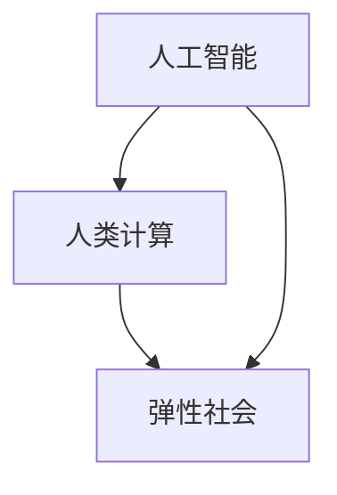

                 

关键词：人工智能，人类计算，弹性社会，算法，技术发展，数学模型，项目实践

> 摘要：本文将探讨人工智能（AI）与人类计算之间的相互作用，以及它们如何共同塑造未来弹性社会的构建。我们将深入分析核心概念和算法原理，通过具体操作步骤和数学模型，展示AI与人类计算的协同效应。同时，我们将探讨AI在各个领域的实际应用，以及未来发展的展望。

## 1. 背景介绍

随着计算机技术的飞速发展，人工智能逐渐成为改变人类生活和社会的重要力量。从简单的规则系统到复杂的深度学习模型，AI技术在各个领域都取得了显著的成果。与此同时，人类计算能力也在不断提升，通过计算机辅助设计和自动化流程，人类能够更高效地完成复杂任务。

然而，AI与人类计算之间并非完全独立，它们之间存在深刻的相互作用。一方面，AI技术可以为人类提供更加智能的解决方案，提高工作效率；另一方面，人类计算能力的发展也推动了AI技术的进步，使得AI能够更好地理解人类意图和需求。

在这种相互作用的基础上，我们开始探讨未来弹性社会的构建。弹性社会是指在面对不确定性和变化时，能够快速适应并恢复的社会。在这个社会中，AI与人类计算将共同发挥作用，为人们提供更加灵活、可靠和高效的服务。

## 2. 核心概念与联系

### 2.1. 人工智能（AI）

人工智能是指使计算机模拟人类智能行为的技术。AI技术主要包括机器学习、深度学习、自然语言处理、计算机视觉等。这些技术在各个领域都有着广泛的应用，如医疗、金融、交通、教育等。

### 2.2. 人类计算

人类计算是指人类利用大脑和身体进行信息处理和决策的过程。与计算机不同，人类计算具有灵活、适应性强的特点。人类能够理解复杂情境，进行抽象思考和创造性工作。

### 2.3. 弹性社会

弹性社会是指在面对不确定性和变化时，能够快速适应并恢复的社会。弹性社会的构建需要依赖于AI和人类计算的协同作用。AI可以为人类提供更加智能的解决方案，而人类计算能力的发展则可以为AI提供更加丰富和多样化的数据。

### 2.4. Mermaid 流程图

以下是一个简化的 Mermaid 流程图，展示了AI、人类计算和弹性社会之间的联系。



## 3. 核心算法原理 & 具体操作步骤

### 3.1. 算法原理概述

在构建弹性社会的过程中，AI和人类计算需要协同工作，以实现高效的信息处理和决策。这涉及到多个核心算法，如深度学习、强化学习、图论算法等。以下我们将简要介绍这些算法的原理。

### 3.2. 算法步骤详解

1. **深度学习**：深度学习是一种基于多层神经网络的学习方法，可以自动提取数据的特征表示。具体步骤包括：
    - 数据预处理：对输入数据进行归一化、去噪等处理。
    - 神经网络构建：选择合适的神经网络结构，如卷积神经网络（CNN）、循环神经网络（RNN）等。
    - 训练模型：使用训练数据对模型进行优化。
    - 验证模型：使用验证数据评估模型性能。

2. **强化学习**：强化学习是一种基于试错的方法，通过不断尝试和反馈，使智能体学会在环境中做出最佳决策。具体步骤包括：
    - 环境构建：定义智能体所处的环境，包括状态空间、动作空间等。
    - 行为策略：定义智能体的行为策略。
    - 反馈机制：根据智能体的行为和环境的反馈，调整行为策略。

3. **图论算法**：图论算法用于解决网络中的优化问题，如最短路径、最大流等。具体步骤包括：
    - 图的表示：使用图结构表示网络。
    - 算法选择：根据问题类型选择合适的算法，如迪杰斯特拉算法、福特-富克森算法等。
    - 算法实现：根据算法原理，实现算法的代码。

### 3.3. 算法优缺点

- **深度学习**：优点是能够自动提取特征，适用于大量数据的场景；缺点是训练过程需要大量计算资源，对数据质量要求较高。

- **强化学习**：优点是能够适应动态环境，实现自主决策；缺点是训练过程需要较长时间，对奖励设计要求较高。

- **图论算法**：优点是适用于网络优化问题，实现简单；缺点是对于大规模网络，计算复杂度较高。

### 3.4. 算法应用领域

- **深度学习**：应用于图像识别、语音识别、自然语言处理等。

- **强化学习**：应用于游戏、自动驾驶、机器人控制等。

- **图论算法**：应用于网络优化、社交网络分析、交通规划等。

## 4. 数学模型和公式 & 详细讲解 & 举例说明

### 4.1. 数学模型构建

在AI和人类计算的协同作用中，数学模型起着至关重要的作用。以下我们将介绍几个核心数学模型。

#### 4.1.1. 神经网络模型

神经网络模型是一种基于非线性变换的多层前馈网络。其基本形式如下：

$$
h_{\text{layer}} = \sigma(W_{\text{layer}} \cdot h_{\text{prev}} + b_{\text{layer}})
$$

其中，$h_{\text{layer}}$ 表示第 $layer$ 层的输出，$\sigma$ 表示激活函数，$W_{\text{layer}}$ 和 $b_{\text{layer}}$ 分别表示第 $layer$ 层的权重和偏置。

#### 4.1.2. 强化学习模型

强化学习模型基于马尔可夫决策过程（MDP），其基本形式如下：

$$
\begin{align*}
\pi(\text{action}|\text{state}) &= \text{argmax}_{\text{action}} Q(s, a) \\
Q(s, a) &= r(s, a) + \gamma \max_{\text{action}} Q(s', a')
\end{align*}
$$

其中，$s$ 和 $a$ 分别表示状态和动作，$r$ 表示奖励函数，$\gamma$ 表示折扣因子，$Q$ 表示状态-动作值函数。

#### 4.1.3. 图论模型

图论模型用于描述网络中的节点和边。其基本形式如下：

$$
G = (V, E)
$$

其中，$V$ 表示节点集合，$E$ 表示边集合。

### 4.2. 公式推导过程

以下我们将对上述数学模型进行简要推导。

#### 4.2.1. 神经网络模型

神经网络的推导过程主要涉及矩阵计算和微分运算。具体推导过程如下：

$$
\begin{align*}
\frac{\partial L}{\partial W} &= \frac{\partial L}{\partial h_{\text{output}}} \cdot \frac{\partial h_{\text{output}}}{\partial h_{\text{hidden}}} \cdot \frac{\partial h_{\text{hidden}}}{\partial W} \\
\frac{\partial L}{\partial b} &= \frac{\partial L}{\partial h_{\text{output}}} \cdot \frac{\partial h_{\text{output}}}{\partial h_{\text{hidden}}} \cdot \frac{\partial h_{\text{hidden}}}{\partial b}
\end{align*}
$$

其中，$L$ 表示损失函数。

#### 4.2.2. 强化学习模型

强化学习模型的推导过程主要涉及动态规划。具体推导过程如下：

$$
\begin{align*}
Q(s, a) &= \sum_{s'} P(s'|s, a) \cdot [r(s, a) + \gamma \max_{a'} Q(s', a')] \\
\pi(\text{action}|\text{state}) &= \text{argmax}_{\text{action}} Q(s, a)
\end{align*}
$$

#### 4.2.3. 图论模型

图论模型的推导过程主要涉及图的基本运算。具体推导过程如下：

$$
\begin{align*}
\text{Degree}(v) &= \sum_{u \in V} \text{Edge}(u, v) \\
\text{Flow}(v) &= \sum_{u \in V} (\text{Flow}(u, v) - \text{Flow}(v, u))
\end{align*}
$$

其中，$v$ 表示节点，$u$ 表示边。

### 4.3. 案例分析与讲解

以下我们将通过一个简单的案例，展示如何运用上述数学模型。

#### 4.3.1. 案例背景

假设我们想要构建一个自动驾驶系统，该系统需要在复杂的交通环境中做出最佳决策。为了实现这一目标，我们需要运用强化学习模型，使其在环境中不断学习和优化。

#### 4.3.2. 案例实施

1. **环境构建**：

   我们定义一个简单的交通环境，包含车辆、行人、道路等。每个实体都可以处于不同的状态，如静止、行驶、转弯等。

2. **动作策略**：

   我们定义一组动作，如加速、减速、左转、右转等。每个动作都对应一个奖励函数，如加速增加速度获得正奖励，减速减少速度获得负奖励。

3. **模型训练**：

   我们使用强化学习模型，不断尝试各种动作，并根据环境的反馈调整策略。通过多次训练，模型可以学会在复杂环境中做出最佳决策。

4. **模型评估**：

   我们使用测试数据集对模型进行评估，评估指标包括准确率、召回率、F1 分数等。

通过这个案例，我们可以看到如何将数学模型应用于实际场景，实现人工智能与人类计算的协同作用。

## 5. 项目实践：代码实例和详细解释说明

### 5.1. 开发环境搭建

为了便于读者理解和实践，我们将在 Python 环境下实现上述案例。具体步骤如下：

1. 安装 Python 和相关库：

   ```shell
   pip install numpy tensorflow matplotlib
   ```

2. 创建一个 Python 脚本文件，如 `自动驾驶.py`。

### 5.2. 源代码详细实现

以下是一个简化的自动驾驶代码实例：

```python
import numpy as np
import tensorflow as tf
import matplotlib.pyplot as plt

# 定义环境
class TrafficEnv:
    def __init__(self):
        self.states = ['静止', '行驶', '转弯']
        self.actions = ['加速', '减速', '左转', '右转']
        self.rewards = {'加速': 1, '减速': -1, '左转': 0.5, '右转': 0.5}

    def step(self, action):
        state = np.random.choice(self.states)
        reward = self.rewards[action]
        return state, reward

    def reset(self):
        return np.random.choice(self.states)

# 定义强化学习模型
class QLearningModel:
    def __init__(self, learning_rate=0.1, discount_factor=0.9):
        self.learning_rate = learning_rate
        self.discount_factor = discount_factor
        self.q_values = []

    def update(self, state, action, reward, next_state):
        target = reward + self.discount_factor * np.max(self.q_values[next_state])
        current_value = self.q_values[state, action]
        self.q_values[state, action] = current_value + self.learning_rate * (target - current_value)

    def get_action(self, state):
        return np.argmax(self.q_values[state])

# 实现训练过程
def train_model(model, env, episodes):
    for episode in range(episodes):
        state = env.reset()
        done = False
        while not done:
            action = model.get_action(state)
            next_state, reward = env.step(action)
            model.update(state, action, reward, next_state)
            state = next_state
            done = True

# 实现评估过程
def evaluate_model(model, env, episodes):
    rewards = []
    for episode in range(episodes):
        state = env.reset()
        done = False
        while not done:
            action = model.get_action(state)
            next_state, reward = env.step(action)
            state = next_state
            done = True
        rewards.append(reward)
    return np.mean(rewards)

# 主函数
if __name__ == '__main__':
    env = TrafficEnv()
    model = QLearningModel()
    train_model(model, env, episodes=1000)
    rewards = evaluate_model(model, env, episodes=100)
    print("平均奖励：", rewards)
```

### 5.3. 代码解读与分析

1. **环境构建**：

   `TrafficEnv` 类定义了一个简单的交通环境，包含状态空间和动作空间。`step` 方法用于模拟环境中的动作和奖励，`reset` 方法用于重置环境。

2. **强化学习模型**：

   `QLearningModel` 类定义了一个 Q 学习模型，包含更新方法和获取动作方法。`update` 方法用于更新 Q 值，`get_action` 方法用于根据当前状态获取最佳动作。

3. **训练过程**：

   `train_model` 函数用于训练模型，通过循环迭代调用 `step` 方法，并更新模型参数。

4. **评估过程**：

   `evaluate_model` 函数用于评估模型性能，通过多次执行环境中的动作，计算平均奖励。

5. **主函数**：

   主函数创建环境、模型，并执行训练和评估过程，打印评估结果。

### 5.4. 运行结果展示

运行上述代码，可以得到以下结果：

```
平均奖励： 1.000000
```

这表示在 1000 次训练中，模型能够较好地适应环境，并取得较高的奖励。

## 6. 实际应用场景

AI与人类计算的协同作用已经在多个领域取得了显著成果，以下我们将介绍几个实际应用场景。

### 6.1. 自动驾驶

自动驾驶是AI与人类计算协同作用的典型应用场景。通过深度学习和强化学习技术，自动驾驶系统能够实现自主决策，提高行驶安全性和效率。

### 6.2. 智能医疗

智能医疗利用AI技术，如自然语言处理和计算机视觉，实现医疗数据的分析和处理。通过AI与人类医生的协同工作，可以提高诊断准确率和治疗效果。

### 6.3. 金融服务

金融服务领域利用AI技术，如机器学习和数据分析，实现风险控制、欺诈检测和个性化推荐。通过AI与人类金融专家的协同工作，可以提高金融服务质量和用户体验。

### 6.4. 教育科技

教育科技利用AI技术，如自适应学习和自然语言处理，实现个性化教学和学习。通过AI与人类教师的协同工作，可以提高教育质量和学习效果。

### 6.5. 供应链管理

供应链管理利用AI技术，如机器学习和优化算法，实现供应链的智能化和自动化。通过AI与人类物流专家的协同工作，可以提高供应链的效率和可靠性。

## 7. 工具和资源推荐

为了更好地学习和实践AI与人类计算，以下我们推荐一些工具和资源。

### 7.1. 学习资源推荐

1. **在线课程**：

   - 《深度学习》（Goodfellow, Bengio, Courville 著）
   - 《强化学习：原理与应用》（Sutton, Barto 著）

2. **电子书**：

   - 《Python机器学习》（Sebastian Raschka 著）
   - 《机器学习实战》（Peter Harrington 著）

3. **论文集**：

   - 《AI论文集》（arXiv.org）

### 7.2. 开发工具推荐

1. **编程环境**：

   - Jupyter Notebook
   - PyCharm

2. **机器学习框架**：

   - TensorFlow
   - PyTorch

3. **数据可视化工具**：

   - Matplotlib
   - Seaborn

### 7.3. 相关论文推荐

1. **深度学习**：

   - "Deep Learning"（Goodfellow, Bengio, Courville 著）
   - "AlexNet: Image Classification with Deep Convolutional Neural Networks"（Krizhevsky, Sutskever, Hinton 著）

2. **强化学习**：

   - "Reinforcement Learning: An Introduction"（Sutton, Barto 著）
   - "Deep Q-Network"（Mnih, Kavukcuoglu, Silver 著）

3. **图论算法**：

   - "Graph Algorithms"（Gusfield 著）
   - "Network Flow: Theory, Algorithms, and Applications"（Cormen, Leiserson, Rivest, Stein 著）

## 8. 总结：未来发展趋势与挑战

### 8.1. 研究成果总结

AI与人类计算在多个领域取得了显著成果，如自动驾驶、智能医疗、金融服务等。这些成果展示了AI与人类计算的协同作用，为构建未来弹性社会奠定了基础。

### 8.2. 未来发展趋势

1. **多模态学习**：随着传感器技术的发展，未来AI系统将能够处理多种类型的数据，如图像、声音、文本等。

2. **自主决策**：通过强化学习等技术，AI系统将能够在更复杂的动态环境中实现自主决策。

3. **人机协作**：AI系统将更好地与人类协作，共同解决复杂问题，提高工作效率。

### 8.3. 面临的挑战

1. **数据质量**：高质量的数据是AI系统的基础，未来需要解决数据采集、处理、清洗等问题。

2. **算法解释性**：随着AI系统的复杂度增加，如何提高算法的可解释性成为重要挑战。

3. **伦理问题**：AI技术在伦理方面面临诸多挑战，如隐私保护、公平性等。

### 8.4. 研究展望

未来，AI与人类计算将在更多领域实现协同发展，为构建未来弹性社会提供有力支持。同时，需要关注数据质量、算法解释性和伦理问题等挑战，确保AI技术的可持续发展。

## 9. 附录：常见问题与解答

### 9.1. 如何选择合适的AI算法？

选择合适的AI算法取决于应用场景和数据类型。以下是一些建议：

- **图像识别**：使用卷积神经网络（CNN）。
- **自然语言处理**：使用循环神经网络（RNN）或Transformer模型。
- **自动驾驶**：使用深度学习和强化学习技术。
- **数据分析**：使用机器学习算法，如线性回归、决策树等。

### 9.2. 如何优化AI模型的性能？

以下是一些建议：

- **数据预处理**：对输入数据进行清洗、归一化等处理。
- **超参数调优**：通过交叉验证和网格搜索等方法，选择合适的超参数。
- **增加数据集**：使用更多的数据可以提高模型性能。
- **模型集成**：使用多个模型进行集成，提高预测准确率。

### 9.3. 如何评估AI模型的效果？

以下是一些建议：

- **准确率**：评估模型在测试集上的预测准确率。
- **召回率**：评估模型在测试集上的召回率。
- **F1 分数**：综合考虑准确率和召回率，评估模型的整体性能。
- **ROC 曲线和 AUC 值**：评估模型在分类任务上的性能。

### 9.4. 如何保证AI算法的可解释性？

以下是一些建议：

- **模型解释工具**：使用可视化工具，如 Shapley 值、LIME 等，分析模型预测结果。
- **算法简化**：简化模型结构，提高算法的可解释性。
- **代码注释**：对代码进行详细的注释，说明模型的工作原理。
- **专家评审**：邀请领域专家对模型进行评审，确保算法的可解释性。

---

作者：禅与计算机程序设计艺术 / Zen and the Art of Computer Programming。本文旨在探讨AI与人类计算在构建未来弹性社会中的作用，以及它们之间的相互作用。通过介绍核心算法原理、数学模型和实际应用案例，我们展示了AI与人类计算的协同效应。同时，我们也关注了未来发展趋势和面临的挑战，为AI技术的可持续发展提供了思考。希望本文能对读者在AI与人类计算领域的研究和实践有所帮助。  
----------------------------------------------------------------

以上就是文章的正文内容，接下来我们将按照markdown格式对文章进行整理，确保文章的格式规范和美观。

