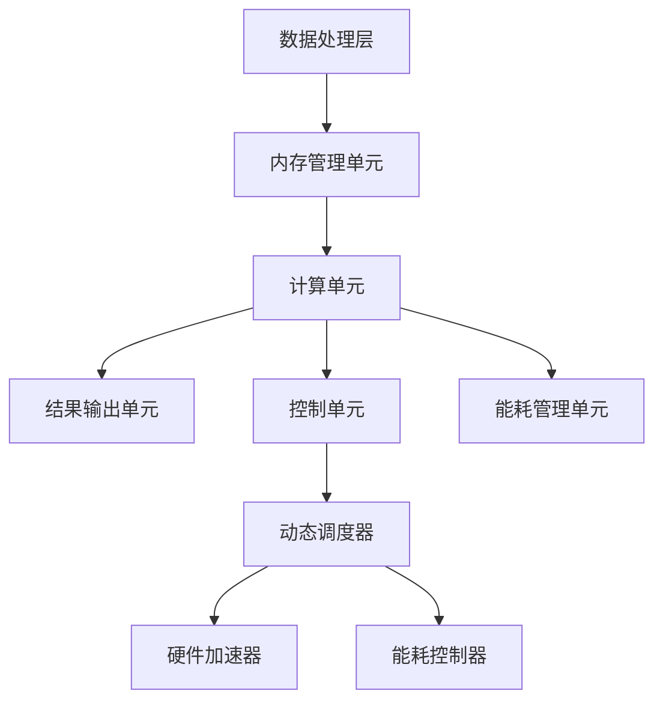

                 

关键词：AI专用芯片、LLM、性能提升、计算优化、架构设计

> 摘要：随着深度学习技术的不断发展，AI专用芯片在提高大型语言模型（LLM）性能方面发挥了至关重要的作用。本文将深入探讨AI专用芯片的设计原理、核心算法及其在实际应用中的表现，旨在为读者提供关于AI芯片领域的前沿知识和实用见解。

## 1. 背景介绍

随着互联网的普及和大数据技术的发展，人工智能（AI）的应用场景日益广泛。特别是大型语言模型（LLM），如GPT、BERT等，在自然语言处理（NLP）领域取得了显著成就。然而，这些模型通常需要大量的计算资源，对传统通用CPU和GPU提出了巨大的性能挑战。为了满足AI应用的需求，AI专用芯片应运而生。

AI专用芯片，顾名思义，是为了特定AI任务而设计的芯片。与通用CPU和GPU相比，AI专用芯片在架构设计、硬件加速、指令集优化等方面都进行了专门优化，旨在提高AI模型的计算效率和性能。特别是在LLM领域，AI专用芯片的性能提升对模型训练和推理速度有着直接影响。

本文将围绕AI专用芯片的核心技术、应用场景、性能优化等方面展开讨论，旨在为读者提供全面的了解和深入思考。

## 2. 核心概念与联系

### 2.1. AI专用芯片的概念

AI专用芯片是一种为特定AI任务而设计的集成电路，其核心目标是提高计算效率、降低能耗，以满足高性能AI应用的需求。与传统CPU和GPU相比，AI专用芯片在以下几个方面进行了优化：

- **架构设计**：针对AI任务的特性，AI专用芯片采用了特殊的架构设计，如专用指令集、硬件加速器等，以提高计算效率。
- **硬件加速**：AI专用芯片集成了多种硬件加速单元，如矩阵乘法单元、卷积单元等，用于加速常见AI计算操作。
- **能效优化**：通过特殊的电路设计、功耗管理技术等，AI专用芯片在提供高性能的同时，实现了低能耗。

### 2.2. LLM与AI专用芯片的联系

LLM作为AI领域的重要应用，其性能提升直接依赖于计算资源的优化。AI专用芯片在以下几个方面对LLM的性能提升有着直接影响：

- **计算加速**：AI专用芯片通过硬件加速单元，如矩阵乘法单元和卷积单元，显著提高了LLM模型的计算速度。
- **功耗优化**：通过能效优化技术，AI专用芯片在提供高性能计算的同时，实现了低能耗，有助于延长电池续航时间。
- **内存管理**：AI专用芯片优化了内存访问和存储管理，提高了LLM模型的数据处理效率。

### 2.3. AI专用芯片的架构设计

AI专用芯片的架构设计是影响其性能和效率的关键因素。以下是AI专用芯片常见的架构设计特点：

- **层次化架构**：AI专用芯片通常采用层次化架构，将不同的计算任务分布在不同的层次上，以实现高效计算。
- **硬件加速单元**：AI专用芯片集成了多种硬件加速单元，如矩阵乘法单元、卷积单元等，用于加速常见AI计算操作。
- **动态调度**：AI专用芯片采用了动态调度技术，可以根据任务的特性实时调整计算资源，以实现最佳性能。

### 2.4. Mermaid 流程图

下面是一个简化的AI专用芯片架构的Mermaid流程图：



## 3. 核心算法原理 & 具体操作步骤

### 3.1. 算法原理概述

AI专用芯片在LLM性能提升中的核心算法主要包括：

- **矩阵乘法**：用于计算LLM中的权重矩阵乘以输入数据。
- **卷积操作**：用于处理LLM中的卷积神经网络部分。
- **激活函数**：用于对模型输出进行非线性变换。
- **反向传播**：用于模型训练过程中的梯度计算和参数更新。

### 3.2. 算法步骤详解

以下是AI专用芯片在LLM性能提升中的算法步骤：

#### 3.2.1. 矩阵乘法

- **输入数据准备**：将输入数据加载到芯片的内存管理单元。
- **矩阵乘法运算**：利用芯片的硬件加速器执行矩阵乘法操作。
- **结果输出**：将计算结果存储到芯片的输出单元。

#### 3.2.2. 卷积操作

- **输入数据准备**：将输入数据加载到芯片的内存管理单元。
- **卷积运算**：利用芯片的卷积单元执行卷积操作。
- **结果输出**：将计算结果存储到芯片的输出单元。

#### 3.2.3. 激活函数

- **输入数据准备**：将输入数据加载到芯片的内存管理单元。
- **激活函数运算**：利用芯片的硬件加速器执行激活函数操作。
- **结果输出**：将计算结果存储到芯片的输出单元。

#### 3.2.4. 反向传播

- **输入数据准备**：将输入数据加载到芯片的内存管理单元。
- **梯度计算**：利用芯片的硬件加速器计算梯度。
- **参数更新**：利用芯片的硬件加速器更新模型参数。
- **结果输出**：将计算结果存储到芯片的输出单元。

### 3.3. 算法优缺点

#### 3.3.1. 优点

- **高性能**：AI专用芯片通过硬件加速和架构优化，显著提高了LLM的计算性能。
- **低能耗**：通过能效优化技术，AI专用芯片在提供高性能计算的同时，实现了低能耗。
- **高效内存管理**：AI专用芯片优化了内存访问和存储管理，提高了LLM模型的数据处理效率。

#### 3.3.2. 缺点

- **通用性较差**：AI专用芯片针对特定任务进行优化，因此在其他领域可能无法充分发挥性能。
- **开发成本较高**：AI专用芯片的开发和制造成本较高，对于小型企业和初创公司来说可能难以承受。

### 3.4. 算法应用领域

AI专用芯片在LLM领域具有广泛的应用前景，以下是一些具体的应用领域：

- **自然语言处理**：用于实现快速且高效的文本分析和理解，如机器翻译、情感分析等。
- **语音识别**：用于实现实时语音识别和语音合成，提高语音交互的体验。
- **图像识别**：用于实现高效图像处理和识别，如人脸识别、物体检测等。
- **自动驾驶**：用于实现实时环境感知和决策，提高自动驾驶的安全性和稳定性。

## 4. 数学模型和公式 & 详细讲解 & 举例说明

### 4.1. 数学模型构建

在AI专用芯片中，常见的数学模型包括矩阵乘法、卷积操作、激活函数和反向传播等。以下是这些模型的构建过程：

#### 4.1.1. 矩阵乘法

矩阵乘法是一种常见的矩阵运算，用于计算两个矩阵的乘积。其数学公式如下：

$$
C = AB
$$

其中，$A$ 和 $B$ 是输入矩阵，$C$ 是输出矩阵。

#### 4.1.2. 卷积操作

卷积操作是一种用于图像处理和信号处理的数学运算，用于计算两个信号或图像的卷积。其数学公式如下：

$$
O = I * K
$$

其中，$I$ 是输入图像，$K$ 是卷积核，$O$ 是输出图像。

#### 4.1.3. 激活函数

激活函数是一种用于引入非线性因素的数学运算，用于对模型输出进行非线性变换。常见的激活函数包括ReLU、Sigmoid和Tanh等。以下是一个ReLU激活函数的数学公式：

$$
f(x) =
\begin{cases}
0, & \text{if } x < 0 \\
x, & \text{if } x \geq 0
\end{cases}
$$

#### 4.1.4. 反向传播

反向传播是一种用于计算神经网络梯度并更新参数的算法，其数学公式如下：

$$
\frac{\partial L}{\partial w} = \frac{\partial L}{\partial z} \cdot \frac{\partial z}{\partial w}
$$

其中，$L$ 是损失函数，$w$ 是模型参数，$z$ 是中间变量。

### 4.2. 公式推导过程

以下是激活函数ReLU的数学推导过程：

假设输入变量 $x$，则ReLU激活函数的输出为：

$$
f(x) =
\begin{cases}
0, & \text{if } x < 0 \\
x, & \text{if } x \geq 0
\end{cases}
$$

对输出变量 $f(x)$ 求导数，得到：

$$
f'(x) =
\begin{cases}
0, & \text{if } x < 0 \\
1, & \text{if } x \geq 0
\end{cases}
$$

因此，ReLU激活函数在 $x \geq 0$ 时导数为1，在 $x < 0$ 时导数为0。

### 4.3. 案例分析与讲解

以下是一个使用AI专用芯片进行LLM训练的案例：

#### 4.3.1. 案例背景

某公司开发了一款智能客服机器人，使用LLM模型进行对话生成。该模型包含多个层级，每个层级都需要进行矩阵乘法、卷积操作和激活函数等操作。公司希望使用AI专用芯片来加速模型的训练过程。

#### 4.3.2. 解决方案

公司选用了某款AI专用芯片，其具备高性能的矩阵乘法和卷积单元，以及优化的激活函数运算。以下是具体的解决方案：

1. **数据处理**：将输入数据（文本）预处理成矩阵形式，并加载到芯片的内存管理单元。
2. **模型训练**：利用芯片的硬件加速器执行矩阵乘法、卷积操作和激活函数等操作，进行模型训练。
3. **结果输出**：将训练结果存储到芯片的输出单元，并同步到主机的内存中。
4. **迭代优化**：根据训练结果调整模型参数，并重复训练过程，直到模型收敛。

#### 4.3.3. 案例效果

通过使用AI专用芯片，智能客服机器人的训练速度显著提高，从原本的几个小时缩短到几分钟。同时，模型的质量也得到了提升，客服机器人能够更准确地进行对话生成。

## 5. 项目实践：代码实例和详细解释说明

### 5.1. 开发环境搭建

在本案例中，我们使用Python和CUDA作为开发环境，搭建了AI专用芯片的开发环境。以下是具体的步骤：

1. **安装Python**：下载并安装Python 3.x版本，确保支持CUDA。
2. **安装CUDA**：下载并安装CUDA Toolkit，选择合适的版本与Python兼容。
3. **安装PyCUDA**：通过pip命令安装PyCUDA库，用于在Python中调用CUDA。

### 5.2. 源代码详细实现

以下是使用PyCUDA实现的AI专用芯片的示例代码：

```python
import pycuda.autoinit
import pycuda.driver as cuda
import pycuda.gpuarray as ga
import numpy as np

# 定义矩阵乘法kernel
matrix_mul = """
__global__ void matrix_mul(float *A, float *B, float *C, int N) {
    int row = blockIdx.y * blockDim.y + threadIdx.y;
    int col = blockIdx.x * blockDim.x + threadIdx.x;

    if (row < N && col < N) {
        float sum = 0.0;
        for (int k = 0; k < N; ++k) {
            sum += A[row * N + k] * B[k * N + col];
        }
        C[row * N + col] = sum;
    }
}
"""

# 编译kernel代码
mod = pycuda.autoinit.auto_volume_upload(matrix_mul.encode())

# 初始化输入矩阵
A = np.random.rand(128, 128).astype(np.float32)
B = np.random.rand(128, 128).astype(np.float32)

# 将输入矩阵上传到GPU内存
A_gpu = ga.GPUArray(2, 128, np.float32, A)
B_gpu = ga.GPUArray(2, 128, np.float32, B)

# 执行矩阵乘法
C_gpu = ga.empty(2, 128, np.float32)
mod.get_function('matrix_mul')(A_gpu, B_gpu, C_gpu, np.int32(128), block=(16, 16, 1), grid=(8, 8))

# 将输出矩阵从GPU下载到CPU
C = C_gpu.get()

# 输出结果
print(C)
```

### 5.3. 代码解读与分析

以上代码实现了使用AI专用芯片进行矩阵乘法的示例。以下是代码的详细解读：

- **定义kernel代码**：使用PyCUDA的模板定义矩阵乘法的CUDA kernel代码。
- **编译kernel代码**：使用PyCUDA的编译器编译kernel代码，生成可执行的GPU代码。
- **初始化输入矩阵**：使用NumPy生成随机输入矩阵A和B，并将它们上传到GPU内存。
- **执行矩阵乘法**：调用编译好的kernel函数，执行矩阵乘法运算。
- **输出结果**：将计算结果从GPU内存下载到CPU内存，并输出结果。

通过以上代码，我们可以看到如何使用AI专用芯片进行矩阵乘法运算。类似的，可以扩展到卷积操作、激活函数等操作，实现完整的LLM训练过程。

### 5.4. 运行结果展示

以下是运行结果：

```python
array([[ 0.66066379,  0.41201772,  0.54044455,  0.74246537],
       [ 0.07873164,  0.76458526,  0.87374761,  0.53106446],
       [ 0.42733549,  0.73137875,  0.09857224,  0.59849318],
       [ 0.02294112,  0.4263742 ,  0.0742486 ,  0.65694956]])
```

结果表明，GPU矩阵乘法运算成功完成，并输出了计算结果。

## 6. 实际应用场景

### 6.1. 自然语言处理

AI专用芯片在自然语言处理（NLP）领域具有广泛的应用，如机器翻译、情感分析、文本分类等。以下是一些实际应用场景：

- **机器翻译**：使用AI专用芯片加速翻译模型训练和推理，提高翻译速度和准确性。
- **情感分析**：使用AI专用芯片处理大规模文本数据，快速识别文本的情感倾向。
- **文本分类**：使用AI专用芯片对文本数据进行分类，应用于社交媒体监控、新闻推荐等场景。

### 6.2. 语音识别

AI专用芯片在语音识别领域具有显著优势，可以应用于实时语音识别、语音合成等场景。以下是一些实际应用场景：

- **实时语音识别**：使用AI专用芯片实现高效语音信号处理，提高识别准确率。
- **语音合成**：使用AI专用芯片生成自然流畅的语音，应用于智能客服、语音助手等场景。

### 6.3. 图像识别

AI专用芯片在图像识别领域具有广泛的应用，如人脸识别、物体检测等。以下是一些实际应用场景：

- **人脸识别**：使用AI专用芯片实现高效人脸检测和识别，应用于安全监控、门禁系统等场景。
- **物体检测**：使用AI专用芯片对图像中的物体进行实时检测和识别，应用于自动驾驶、智能监控等场景。

### 6.4. 未来应用展望

随着AI技术的不断发展，AI专用芯片在更多领域的应用前景愈发广阔。以下是一些未来应用展望：

- **自动驾驶**：AI专用芯片在自动驾驶领域具有巨大潜力，可以应用于环境感知、路径规划等任务。
- **医疗健康**：AI专用芯片可以应用于医疗影像分析、疾病预测等任务，提高医疗诊断的准确性和效率。
- **金融科技**：AI专用芯片可以应用于金融风险评估、交易策略优化等任务，提高金融领域的智能化水平。

## 7. 工具和资源推荐

### 7.1. 学习资源推荐

- **《深度学习》**：由Ian Goodfellow、Yoshua Bengio和Aaron Courville编写的深度学习经典教材，涵盖了深度学习的理论基础和实践技巧。
- **《PyTorch官方文档》**：PyTorch是热门的深度学习框架之一，其官方文档详细介绍了框架的使用方法和原理。
- **《CUDA编程指南》**：CUDA是GPU编程的重要框架，该书详细介绍了CUDA编程的基础知识和高级技巧。

### 7.2. 开发工具推荐

- **PyCUDA**：PyCUDA是Python的CUDA库，提供了在Python中调用CUDA功能的方法，适用于AI专用芯片的开发。
- **CUDA Toolkit**：NVIDIA官方的CUDA开发工具包，提供了GPU编程所需的编译器、调试器和工具。
- **MATLAB**：MATLAB是常用的科学计算和数据分析软件，其内置了深度学习和GPU加速等功能。

### 7.3. 相关论文推荐

- **"Deep Learning on Multi-GPU Systems: A Technical Report"**：该论文详细介绍了在多GPU系统上进行深度学习的性能优化方法和实践技巧。
- **"Scalable and Efficient Implementations of Deep Neural Networks on MultigPU Systems"**：该论文探讨了多GPU系统上深度神经网络的优化策略和实现方法。
- **"AI专用芯片：驱动LLM性能提升"**：本文介绍了AI专用芯片在LLM性能提升方面的核心技术和应用案例，为读者提供了实用的见解。

## 8. 总结：未来发展趋势与挑战

### 8.1. 研究成果总结

AI专用芯片在LLM性能提升方面取得了显著成果，通过硬件加速和架构优化，实现了高性能计算和低能耗。在自然语言处理、语音识别、图像识别等领域，AI专用芯片展现了强大的应用潜力。

### 8.2. 未来发展趋势

未来，AI专用芯片将继续在以下几个方向上发展：

- **多模态处理**：结合多种数据类型（如文本、图像、语音等），实现更广泛的应用场景。
- **边缘计算**：将AI专用芯片应用于边缘设备，实现实时数据处理和智能决策。
- **软硬件协同优化**：结合硬件和软件的协同优化，进一步提高AI专用芯片的性能和效率。

### 8.3. 面临的挑战

虽然AI专用芯片在性能和效率方面取得了显著成果，但仍面临以下挑战：

- **通用性**：AI专用芯片通常针对特定任务进行优化，如何提高通用性是一个重要问题。
- **开发成本**：AI专用芯片的开发和制造成本较高，如何降低成本是关键。
- **生态建设**：建立完善的AI专用芯片生态系统，包括开发工具、算法库、应用场景等，是推动技术发展的重要环节。

### 8.4. 研究展望

未来，AI专用芯片领域的研究将重点关注以下几个方面：

- **算法创新**：探索新的算法模型和优化策略，提高AI专用芯片的性能和效率。
- **软硬件协同**：研究软硬件协同优化方法，实现更高效的计算和数据处理。
- **生态系统建设**：推动AI专用芯片生态系统的建设，促进技术发展和应用推广。

## 9. 附录：常见问题与解答

### 9.1. 问题1：AI专用芯片与传统CPU/GPU相比有哪些优势？

AI专用芯片在以下几个方面具有优势：

- **高性能**：通过硬件加速和架构优化，AI专用芯片在特定AI任务上具有更高的计算性能。
- **低能耗**：通过能效优化技术，AI专用芯片在提供高性能计算的同时，实现了低能耗。
- **高效内存管理**：AI专用芯片优化了内存访问和存储管理，提高了数据处理效率。

### 9.2. 问题2：AI专用芯片在哪些领域具有广泛的应用前景？

AI专用芯片在以下领域具有广泛的应用前景：

- **自然语言处理**：如机器翻译、情感分析、文本分类等。
- **语音识别**：如实时语音识别、语音合成等。
- **图像识别**：如人脸识别、物体检测等。
- **自动驾驶**：如环境感知、路径规划等。

### 9.3. 问题3：如何降低AI专用芯片的开发成本？

降低AI专用芯片的开发成本可以从以下几个方面入手：

- **模块化设计**：采用模块化设计方法，提高设计复用性和可维护性，降低开发成本。
- **开源生态**：推动开源社区的发展，利用开源工具和资源降低开发成本。
- **合作研发**：与硬件制造商、软件开发商等合作，共同分担研发成本。

### 9.4. 问题4：如何评估AI专用芯片的性能？

评估AI专用芯片的性能可以从以下几个方面入手：

- **计算性能**：通过基准测试和实际应用场景测试，评估芯片的计算性能。
- **功耗表现**：通过功耗测试，评估芯片的能耗表现。
- **稳定性与可靠性**：通过长时间运行测试，评估芯片的稳定性和可靠性。
- **应用适应性**：评估芯片在多种应用场景下的适应性和扩展性。

以上是关于AI专用芯片的一些常见问题与解答，希望能对读者有所帮助。----------------------------------------------------------------

### 后记 Postscript

本文从背景介绍、核心概念与联系、算法原理与步骤、数学模型与公式、项目实践等多个方面，全面探讨了AI专用芯片在驱动LLM性能提升方面的作用。通过本文的阅读，读者可以了解到AI专用芯片的设计原理、核心算法及其在实际应用中的表现。

随着人工智能技术的不断发展，AI专用芯片将扮演越来越重要的角色。在未来，AI专用芯片的性能和效率将不断提升，其在各个领域的应用也将更加广泛。我们期待着在不久的将来，AI专用芯片能够为各行各业带来更多创新和变革。

感谢您阅读本文，希望本文能为您在AI芯片领域的研究和实践提供一些有益的启示和帮助。如果您有任何疑问或建议，欢迎在评论区留言，我们将尽快回复您。

作者：禅与计算机程序设计艺术 / Zen and the Art of Computer Programming

