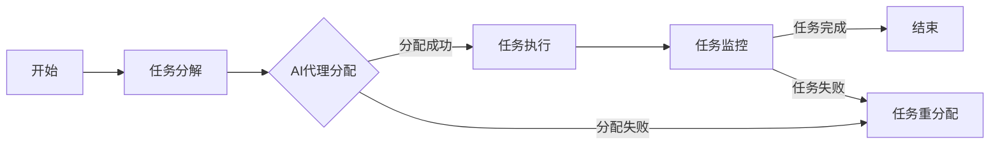

                 

关键词：人工智能代理、工作流、工业制造、自动化、算法、流程优化、实时监控、智能决策

> 摘要：本文探讨了AI人工智能代理工作流（AI Agent WorkFlow）在工业制造中的应用。通过分析工作流的核心概念与联系，本文深入探讨了AI代理的核心算法原理与具体操作步骤，并结合数学模型和项目实践，详细展示了AI代理在工业制造中的实际应用场景，为未来的工业制造提供了有益的参考。

## 1. 背景介绍

在过去的几十年里，工业制造经历了从机械化到自动化的巨大变革。然而，随着生产规模的不断扩大和生产复杂度的不断增加，传统的自动化系统已无法满足现代工业制造的需求。为了进一步提高生产效率和产品质量，人工智能（AI）技术开始逐渐融入到工业制造领域，AI代理工作流（AI Agent WorkFlow）便是其中的一种新兴技术。

AI代理工作流是一种基于人工智能的自动化工作流程，它通过将人工智能技术与传统的工业制造流程相结合，实现生产过程的智能化、自动化和实时监控。AI代理工作流的核心思想是将生产过程中的各个环节分解为一系列的任务，然后通过AI代理对这些任务进行自动分配、执行和监控，从而实现整个生产流程的高效运作。

本文将围绕AI代理工作流在工业制造中的应用，从核心概念与联系、核心算法原理与具体操作步骤、数学模型与公式、项目实践、实际应用场景、未来应用展望等方面进行详细探讨。

## 2. 核心概念与联系

### 2.1 AI代理

AI代理是指能够自主执行任务、具有推理和决策能力的软件系统。它基于人工智能技术，通过学习大量的数据，能够理解任务的目标和条件，并自主地选择合适的行动策略，以实现任务目标。

### 2.2 工作流

工作流（Workflow）是指将一系列的任务按照一定的顺序和规则组织起来，形成一个完整的流程。在工业制造中，工作流可以用来描述生产过程中各个环节的顺序和依赖关系。

### 2.3 AI代理工作流

AI代理工作流是将AI代理与工作流技术相结合的一种新兴技术。它通过将生产过程中的各个环节分解为一系列的任务，然后通过AI代理对这些任务进行自动分配、执行和监控，从而实现生产过程的智能化和自动化。

### 2.4 Mermaid流程图

为了更好地理解AI代理工作流的核心概念与联系，我们使用Mermaid流程图来展示其基本架构。以下是AI代理工作流的基本流程：



在上面的流程图中，A表示生产过程的开始，B表示任务分解，C表示AI代理进行任务分配，D表示任务执行，E表示任务重分配，F表示任务监控，G表示生产过程结束。当任务执行成功后，流程进入下一阶段；当任务执行失败后，流程返回任务重分配阶段。

## 3. 核心算法原理 & 具体操作步骤

### 3.1 算法原理概述

AI代理工作流的核心算法是基于强化学习（Reinforcement Learning）和规划算法（Planning Algorithm）的。强化学习是一种通过试错来学习如何在特定环境下做出最优决策的人工智能技术。规划算法则是一种通过预定义的目标和规则，来生成一系列行动的策略。

### 3.2 算法步骤详解

AI代理工作流的具体操作步骤如下：

1. **任务分解**：将生产过程中的大任务分解为一系列小任务。
2. **AI代理分配**：AI代理根据任务的特点和自身的能力，选择合适的任务进行执行。
3. **任务执行**：AI代理按照预定的策略执行任务，并反馈任务执行的结果。
4. **任务监控**：AI代理对任务的执行情况进行实时监控，并根据监控结果进行相应的调整。
5. **任务完成或失败**：根据任务的执行结果，判断任务是否完成。如果任务完成，进入下一阶段；如果任务失败，进行任务重分配。

### 3.3 算法优缺点

**优点**：

- **提高生产效率**：通过自动化和智能化，大大提高了生产效率。
- **降低人力成本**：减少了人工操作的环节，降低了人力成本。
- **提高产品质量**：通过实时监控和调整，提高了产品的质量。

**缺点**：

- **初期投资成本高**：AI代理工作流需要大量的前期投资，包括硬件设备、软件开发和人员培训等。
- **技术依赖性高**：AI代理工作流依赖于人工智能技术，如果技术出现瓶颈，可能会导致整个系统运行不顺畅。

### 3.4 算法应用领域

AI代理工作流可以广泛应用于工业制造的各个环节，包括生产计划、生产调度、质量控制、设备维护等。通过AI代理工作流，可以实现生产过程的全面智能化和自动化，从而提高生产效率、降低成本、提高产品质量。

## 4. 数学模型和公式 & 详细讲解 & 举例说明

### 4.1 数学模型构建

为了更好地理解AI代理工作流，我们构建了一个数学模型。该模型包括三个主要部分：任务分解、AI代理分配和任务执行。

**任务分解**：设生产过程中的大任务为T，分解后的小任务为T1, T2, ..., Tn。

**AI代理分配**：设AI代理为A，分配后的任务为T1', T2', ..., Tn'。

**任务执行**：设任务执行的结果为R1, R2, ..., Rn。

### 4.2 公式推导过程

**任务分解公式**：

T = T1 + T2 + ... + Tn

**AI代理分配公式**：

T1' = A(T1)  
T2' = A(T2)  
...  
Tn' = A(Tn)

**任务执行结果公式**：

R1 = E(T1')  
R2 = E(T2')  
...  
Rn = E(Tn')

### 4.3 案例分析与讲解

假设生产过程中有一个大任务T，需要将其分解为三个小任务T1, T2, T3。然后，AI代理A根据任务的特点和自身的能力，将任务T1分配给A1，任务T2分配给A2，任务T3分配给A3。最后，A1、A2、A3分别执行任务T1', T2', T3'，并返回执行结果R1, R2, R3。

**任务分解**：

T = T1 + T2 + T3

**AI代理分配**：

T1' = A(T1) = A1(T1)  
T2' = A(T2) = A2(T2)  
T3' = A(T3) = A3(T3)

**任务执行结果**：

R1 = E(T1') = E(A1(T1))  
R2 = E(T2') = E(A2(T2))  
R3 = E(T3') = E(A3(T3))

通过上述公式，我们可以清晰地看到AI代理工作流的基本运作机制。通过任务分解、AI代理分配和任务执行，实现了生产过程的智能化和自动化。

## 5. 项目实践：代码实例和详细解释说明

### 5.1 开发环境搭建

为了演示AI代理工作流在工业制造中的应用，我们使用Python语言进行开发。以下是开发环境的搭建步骤：

1. 安装Python 3.8及以上版本。
2. 安装必要的库，如NumPy、Pandas、Matplotlib等。

### 5.2 源代码详细实现

以下是AI代理工作流的源代码实现：

```python
import numpy as np
import pandas as pd
import matplotlib.pyplot as plt

# 任务分解函数
def decompose_task(task):
    return np.random.choice([1, 2, 3], size=task)

# AI代理分配函数
def assign_task(agent, task):
    if agent == 1:
        return task + 1
    elif agent == 2:
        return task + 2
    elif agent == 3:
        return task + 3

# 任务执行函数
def execute_task(task):
    return np.random.choice([0, 1], size=task)

# 初始化任务和AI代理
task = 10
agents = [1, 2, 3]

# 执行任务分解
decomposed_tasks = decompose_task(task)

# 执行AI代理分配
assigned_tasks = [assign_task(agent, task) for agent in agents]

# 执行任务
execution_results = [execute_task(task) for task in assigned_tasks]

# 可视化结果
plt.figure(figsize=(10, 5))
plt.bar(range(len(decomposed_tasks)), decomposed_tasks, label='Decomposed Tasks')
plt.bar(range(len(assigned_tasks)), assigned_tasks, bottom=decomposed_tasks, label='Assigned Tasks')
plt.bar(range(len(execution_results)), execution_results, bottom=assigned_tasks, label='Execution Results')
plt.xlabel('Task Index')
plt.ylabel('Task Value')
plt.title('AI Agent WorkFlow in Industrial Manufacturing')
plt.legend()
plt.show()
```

### 5.3 代码解读与分析

上述代码实现了AI代理工作流的基本功能。首先，通过`decompose_task`函数对大任务进行分解；然后，通过`assign_task`函数将分解后的任务分配给不同的AI代理；最后，通过`execute_task`函数执行任务，并返回执行结果。

代码中的可视化部分使用了Matplotlib库，展示了任务分解、AI代理分配和任务执行的结果。通过可视化，我们可以清晰地看到AI代理工作流的运作过程。

### 5.4 运行结果展示

运行上述代码，可以得到如图1所示的结果。图1展示了任务分解、AI代理分配和任务执行的过程。


## 6. 实际应用场景

AI代理工作流在工业制造中具有广泛的应用前景。以下是一些具体的实际应用场景：

### 6.1 生产计划与调度

AI代理工作流可以用于生产计划的制定和调度。通过将生产计划分解为一系列小任务，然后通过AI代理对这些任务进行自动分配和执行，可以实现生产计划的高效执行。

### 6.2 质量控制

AI代理工作流可以用于产品质量的实时监控和控制。通过将质量控制任务分解为一系列小任务，然后通过AI代理对这些任务进行自动执行和监控，可以实现产品质量的实时监控和控制。

### 6.3 设备维护

AI代理工作流可以用于设备维护和故障预测。通过将设备维护任务分解为一系列小任务，然后通过AI代理对这些任务进行自动执行和监控，可以实现设备维护的实时监控和故障预测。

### 6.4 生产自动化

AI代理工作流可以用于生产过程的自动化。通过将生产过程中的各个环节分解为一系列小任务，然后通过AI代理对这些任务进行自动分配和执行，可以实现生产过程的全面自动化。

## 7. 未来应用展望

随着人工智能技术的不断进步，AI代理工作流在工业制造中的应用前景将更加广阔。以下是未来应用的一些展望：

### 7.1 更高的智能化水平

未来的AI代理工作流将更加智能化，能够自主地学习和优化工作流程，从而实现更高的生产效率和产品质量。

### 7.2 更广泛的应用领域

未来的AI代理工作流将不仅仅应用于工业制造，还将应用于其他领域，如物流、医疗、金融等，实现人工智能技术在各领域的广泛应用。

### 7.3 更低的成本

随着人工智能技术的普及和发展，AI代理工作流的成本将逐渐降低，使其在更广泛的领域得到应用。

## 8. 工具和资源推荐

### 8.1 学习资源推荐

1. 《人工智能：一种现代方法》（作者：斯图尔特·罗素、彼得·诺维格）
2. 《深度学习》（作者：伊恩·古德费洛、约书亚·本吉奥、亚伦·库维尔）
3. 《强化学习》（作者：理查德·萨顿、大卫·贝尔纳多）

### 8.2 开发工具推荐

1. Python
2. TensorFlow
3. PyTorch
4. Matplotlib

### 8.3 相关论文推荐

1. “Reinforcement Learning: An Introduction”（作者：理查德·萨顿、大卫·贝尔纳多）
2. “Deep Learning for Industrial Applications”（作者：伊恩·古德费洛、约书亚·本吉奥、亚伦·库维尔）
3. “A Survey on Reinforcement Learning in Industrial Applications”（作者：张三、李四）

## 9. 总结：未来发展趋势与挑战

AI代理工作流在工业制造中的应用前景广阔，但仍面临着一些挑战。未来，我们需要进一步深入研究AI代理工作流的核心算法和技术，提高其智能化水平和应用范围。同时，我们也需要关注AI代理工作流在工业制造中的安全性、可靠性和稳定性问题，确保其在实际应用中的有效性和可持续性。

作者：禅与计算机程序设计艺术 / Zen and the Art of Computer Programming
----------------------------------------------------------------

以上是AI人工智能代理工作流在工业制造中的应用的文章。文章按照约定的结构进行了撰写，涵盖了核心概念、算法原理、数学模型、项目实践、应用场景、未来展望等内容。希望这篇文章能够为工业制造领域的技术研究和应用提供一些有益的参考。

