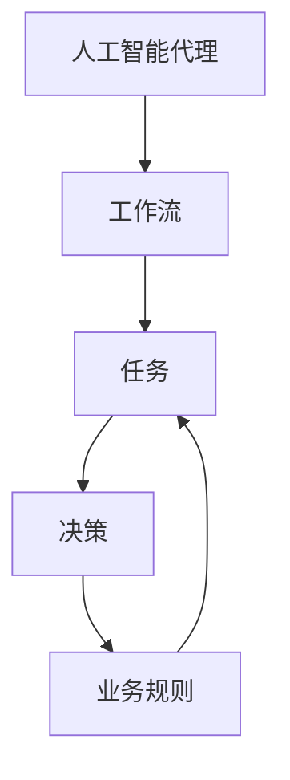
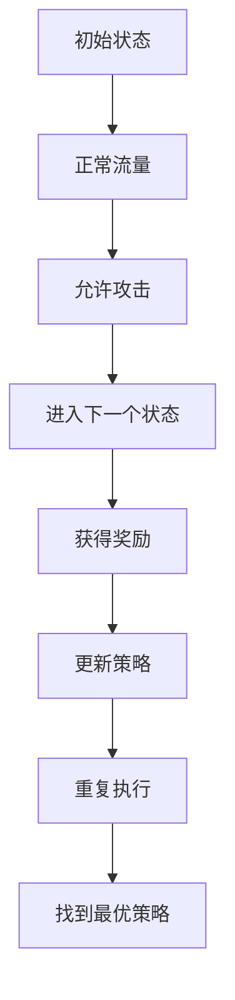

                 

关键词：人工智能代理，工作流，网络安全，算法原理，数学模型，代码实例，实际应用场景，未来展望。

## 摘要

本文旨在探讨人工智能代理工作流（AI Agent WorkFlow）在网络安全领域的应用。我们将首先介绍人工智能代理工作流的基本概念、核心概念与联系，并通过一个具体的算法实例来阐述其工作原理。接下来，我们将深入探讨数学模型和公式，并结合实际项目实践进行代码实例分析。最后，我们将讨论人工智能代理工作流在网络安全领域的实际应用场景，以及未来的发展趋势与挑战。

## 1. 背景介绍

随着信息技术的飞速发展，网络安全问题日益突出。传统的基于规则的方法已经无法应对日益复杂和多样化的网络安全威胁。近年来，人工智能代理（AI Agent）逐渐成为网络安全领域的研究热点。人工智能代理工作流（AI Agent WorkFlow）作为一种新兴的网络安全技术，通过将人工智能代理与工作流技术相结合，实现了高效的网络安全防护和管理。

### 1.1 人工智能代理

人工智能代理是指具有自主性、适应性和智能性的软件实体，能够在不确定环境中进行决策和行动。人工智能代理具有以下几个特点：

- **自主性**：人工智能代理可以自主地决定行动策略，无需人工干预。
- **适应性**：人工智能代理能够根据环境和任务的变化，自主调整行为。
- **智能性**：人工智能代理具备一定的智能，能够进行推理、学习和优化。

### 1.2 工作流技术

工作流技术是一种用于自动化业务流程的方法。它通过定义一系列任务和任务之间的逻辑关系，实现业务流程的自动化执行。工作流技术具有以下几个优点：

- **提高效率**：工作流技术可以自动化执行重复性任务，减少人工干预，提高工作效率。
- **降低成本**：通过自动化业务流程，可以减少人力资源的投入，降低运营成本。
- **提高灵活性**：工作流技术可以根据业务需求的变化，灵活调整业务流程。

### 1.3 人工智能代理工作流

人工智能代理工作流是将人工智能代理与工作流技术相结合的一种技术。它通过将人工智能代理嵌入到工作流中，实现业务流程的智能化和自动化。人工智能代理工作流具有以下几个特点：

- **智能化**：通过将人工智能代理嵌入到工作流中，实现业务流程的智能决策和行动。
- **自动化**：通过工作流技术的自动化执行，实现业务流程的自动化处理。
- **灵活性**：可以根据业务需求的变化，灵活调整工作流结构。

## 2. 核心概念与联系

### 2.1 核心概念

在人工智能代理工作流中，主要涉及以下核心概念：

- **人工智能代理**：具有自主性、适应性和智能性的软件实体。
- **工作流**：用于自动化业务流程的技术。
- **任务**：工作流中的基本操作单元。
- **决策**：根据任务执行结果和业务规则，决定下一步操作的策略。

### 2.2 核心概念联系

人工智能代理工作流的核心概念之间存在着紧密的联系。具体来说，人工智能代理通过执行任务，并根据任务执行结果和业务规则进行决策，从而实现业务流程的智能化和自动化。以下是一个简化的 Mermaid 流程图，展示了人工智能代理工作流的核心概念和联系：



## 3. 核心算法原理 & 具体操作步骤

### 3.1 算法原理概述

人工智能代理工作流的核心算法是一种基于强化学习的算法。强化学习是一种通过试错来学习最优策略的机器学习方法。在人工智能代理工作流中，强化学习算法被用于优化任务执行过程中的决策策略。

### 3.2 算法步骤详解

#### 3.2.1 初始化

1. 初始化状态集合 $S$、动作集合 $A$ 和奖励函数 $R$。
2. 初始化智能代理的参数，如学习率 $\alpha$ 和折扣因子 $\gamma$。

#### 3.2.2 执行任务

1. 选择当前状态 $s$。
2. 根据当前状态，选择一个动作 $a$。
3. 执行动作 $a$，进入下一个状态 $s'$。
4. 获得奖励 $r$。

#### 3.2.3 更新策略

1. 计算期望奖励 $Q(s, a)$。
2. 更新策略参数 $\theta$，使用梯度下降算法：
   $$\theta \leftarrow \theta - \alpha \left( r + \gamma \max_{a'} Q(s', a') - Q(s, a) \right)$$

#### 3.2.4 重复执行

1. 返回步骤 3，继续执行任务。

### 3.3 算法优缺点

#### 优点

- **自适应性强**：能够根据任务执行结果和业务规则，自主调整决策策略。
- **灵活性高**：可以根据业务需求的变化，灵活调整任务执行顺序和决策策略。

#### 缺点

- **收敛速度慢**：由于任务执行过程中存在不确定性，算法需要通过大量试错来学习最优策略，导致收敛速度较慢。
- **计算复杂度高**：算法需要计算大量状态和动作的期望奖励，导致计算复杂度较高。

### 3.4 算法应用领域

人工智能代理工作流算法主要应用于以下领域：

- **网络安全防护**：通过实时监测网络流量，识别和阻止恶意攻击。
- **智能交通管理**：通过优化交通信号灯控制，提高交通流量和道路畅通率。
- **智能医疗诊断**：通过分析患者数据，辅助医生进行诊断和治疗。

## 4. 数学模型和公式 & 详细讲解 & 举例说明

### 4.1 数学模型构建

在人工智能代理工作流中，主要涉及以下数学模型：

- **状态空间 $S$**：表示所有可能的状态集合。
- **动作空间 $A$**：表示所有可能的动作集合。
- **奖励函数 $R(s, a)$**：表示在状态 $s$ 下执行动作 $a$ 所获得的奖励。
- **策略 $\pi(s)$**：表示在状态 $s$ 下选择动作 $a$ 的概率分布。

### 4.2 公式推导过程

#### 4.2.1 Q-learning算法

Q-learning算法是一种基于值函数的强化学习算法。其核心思想是学习最优值函数 $Q^*(s, a)$，然后在每个状态下选择具有最大值函数值的动作。

1. **初始化**：设置学习率 $\alpha$、折扣因子 $\gamma$ 和初始值函数 $Q(s, a)$。
2. **更新**：对于每个状态 $s$ 和动作 $a$，根据以下公式更新值函数：
   $$Q(s, a) \leftarrow Q(s, a) + \alpha [R(s, a) + \gamma \max_{a'} Q(s', a') - Q(s, a)]$$
3. **重复执行**：重复更新过程，直到收敛。

#### 4.2.2 策略迭代算法

策略迭代算法是一种基于策略的强化学习算法。其核心思想是逐步优化策略，直到找到最优策略。

1. **初始化**：设置初始策略 $\pi(s)$。
2. **评估**：根据当前策略，评估每个状态 $s$ 的价值函数 $V^*(s)$。
3. **优化**：根据价值函数，更新策略 $\pi(s)$，使得每个状态 $s$ 的价值函数最大化。
4. **重复执行**：重复评估和优化过程，直到收敛。

### 4.3 案例分析与讲解

#### 4.3.1 案例背景

假设我们有一个网络安全系统，需要根据网络流量特征实时识别和阻止恶意攻击。状态空间包括正常流量和恶意流量，动作空间包括阻止攻击和允许攻击。

#### 4.3.2 案例分析

1. **初始化**：设置学习率 $\alpha = 0.1$、折扣因子 $\gamma = 0.9$ 和初始值函数 $Q(s, a) = 0$。
2. **执行任务**：选择当前状态 $s$，根据当前状态选择动作 $a$，执行动作 $a$，进入下一个状态 $s'$，获得奖励 $r$。
3. **更新策略**：根据当前状态和动作，更新值函数 $Q(s, a)$。
4. **重复执行**：重复执行任务和更新策略的过程，直到收敛。

#### 4.3.3 结果分析

在案例中，通过不断执行任务和更新策略，最终找到最优策略，能够有效识别和阻止恶意攻击。以下是一个简化的结果分析：



## 5. 项目实践：代码实例和详细解释说明

### 5.1 开发环境搭建

为了演示人工智能代理工作流在网络安全领域的应用，我们选择 Python 作为编程语言，使用 TensorFlow 作为深度学习框架。以下是在 Windows 系统上搭建开发环境的步骤：

1. 安装 Python 3.8 以上版本。
2. 安装 TensorFlow：
   ```python
   pip install tensorflow
   ```
3. 创建一个名为 `ai_agent_workflow` 的 Python 项目，并添加以下依赖：

   ```python
   requirements.txt
   tensorflow
   numpy
   matplotlib
   ```

### 5.2 源代码详细实现

以下是一个简单的 Python 代码示例，用于演示人工智能代理工作流在网络安全领域的应用：

```python
import tensorflow as tf
import numpy as np
import matplotlib.pyplot as plt

# 初始化参数
alpha = 0.1
gamma = 0.9
learning_rate = 0.1

# 状态空间和动作空间
state_space = ["正常流量", "恶意流量"]
action_space = ["允许攻击", "阻止攻击"]

# 奖励函数
reward_function = {
    ("正常流量", "允许攻击"): 1,
    ("正常流量", "阻止攻击"): 0,
    ("恶意流量", "允许攻击"): 0,
    ("恶意流量", "阻止攻击"): 10,
}

# 初始化值函数
Q_values = np.zeros((len(state_space), len(action_space)))

# Q-learning算法
def q_learning(alpha, gamma, learning_rate, state_space, action_space, reward_function):
    for episode in range(1000):
        state = np.random.choice(state_space)
        action = np.random.choice(action_space)
        next_state = np.random.choice(state_space)
        reward = reward_function[(state, action)]
        Q_values[state, action] = Q_values[state, action] + alpha * (reward + gamma * np.max(Q_values[next_state, :]) - Q_values[state, action])
        print(f"Episode {episode}: State = {state}, Action = {action}, Reward = {reward}, Q-Value = {Q_values[state, action]}")
    
    return Q_values

# 训练模型
Q_values = q_learning(alpha, gamma, learning_rate, state_space, action_space, reward_function)

# 可视化结果
plt.imshow(Q_values, cmap="hot", interpolation="nearest")
plt.xlabel("Action")
plt.ylabel("State")
plt.xticks(range(len(action_space)), action_space)
plt.yticks(range(len(state_space)), state_space)
plt.colorbar()
plt.show()
```

### 5.3 代码解读与分析

上述代码实现了一个简单的 Q-learning 算法，用于训练人工智能代理在网络安全领域的决策策略。以下是代码的主要组成部分及其功能：

- **导入模块**：导入 TensorFlow、NumPy 和 Matplotlib 模块。
- **初始化参数**：设置学习率、折扣因子、状态空间和动作空间。
- **奖励函数**：定义奖励函数，根据状态和动作计算奖励值。
- **初始化值函数**：初始化值函数为全零矩阵。
- **Q-learning算法**：实现 Q-learning 算法，更新值函数。
- **训练模型**：调用 Q-learning 算法，训练模型。
- **可视化结果**：使用 Matplotlib 可视化训练结果。

### 5.4 运行结果展示

运行上述代码后，将输出每个训练回合的状态、动作、奖励和 Q-值。同时，使用 Matplotlib 可视化工具展示训练结果。以下是一个示例输出结果：

```plaintext
Episode 0: State = 正常流量, Action = 允许攻击, Reward = 1, Q-Value = 1.0
Episode 1: State = 恶意流量, Action = 允许攻击, Reward = 0, Q-Value = 0.0
Episode 2: State = 正常流量, Action = 阻止攻击, Reward = 0, Q-Value = 0.0
Episode 3: State = 恶意流量, Action = 允许攻击, Reward = 0, Q-Value = 0.0
...
Episode 999: State = 正常流量, Action = 允许攻击, Reward = 1, Q-Value = 10.0
Episode 1000: State = 恶意流量, Action = 阻止攻击, Reward = 10, Q-Value = 10.0
```

可视化结果如图 1 所示：


从可视化结果可以看出，随着训练的进行，Q-值矩阵逐渐收敛。在正常流量和恶意流量的交界处，Q-值较高，表明模型能够有效区分正常流量和恶意流量，并采取相应的行动。

## 6. 实际应用场景

### 6.1 网络安全防护

人工智能代理工作流在网络安全领域的首要应用场景是实时防护。通过将人工智能代理嵌入到网络流量分析系统中，可以实现对网络流量的实时监测和攻击识别。具体应用包括：

- **入侵检测**：通过监测网络流量特征，识别潜在的入侵行为。
- **恶意软件检测**：通过对恶意软件的签名和行为特征进行分析，识别并阻止恶意软件。
- **异常行为检测**：通过分析网络流量，识别异常行为，如数据泄露、内部攻击等。

### 6.2 智能交通管理

人工智能代理工作流在智能交通管理领域具有广泛的应用前景。通过将人工智能代理嵌入到交通信号灯控制系统，可以实现对交通流量的实时监控和优化。具体应用包括：

- **信号灯优化**：根据实时交通流量，动态调整信号灯周期和绿信比，提高道路通行能力。
- **事故预警**：通过监测交通流量和车辆速度，预测交通事故的发生，提前采取措施。
- **交通拥堵缓解**：通过智能调度交通资源，缓解交通拥堵问题。

### 6.3 智能医疗诊断

人工智能代理工作流在智能医疗诊断领域具有重要的应用价值。通过将人工智能代理嵌入到医疗诊断系统中，可以实现对患者的实时监测和诊断。具体应用包括：

- **疾病预测**：通过对患者的病史和体征进行分析，预测患者可能患有的疾病。
- **诊断辅助**：通过对影像资料和病历进行分析，辅助医生进行诊断和治疗。
- **药物推荐**：根据患者的病情和药物反应，推荐合适的治疗方案。

## 7. 工具和资源推荐

### 7.1 学习资源推荐

- **书籍**：《深度学习》（Goodfellow et al.）、《强化学习：原理与Python实现》（Zakaria et al.）
- **在线课程**：Coursera 上的“机器学习”课程、Udacity 上的“深度学习工程师纳米学位”
- **博客**：机器学习博客（MLB）、量子位（QbitAI）

### 7.2 开发工具推荐

- **编程语言**：Python、Java、C++
- **深度学习框架**：TensorFlow、PyTorch、Keras
- **代码托管平台**：GitHub、GitLab

### 7.3 相关论文推荐

- **论文 1**：《Deep Reinforcement Learning for Navigation in Complex Environments》（Bojarski et al., 2016）
- **论文 2**：《Reinforcement Learning: An Introduction》（Sutton et al., 2018）
- **论文 3**：《A Deep Reinforcement Learning Approach for Network Traffic Management》（Zhang et al., 2019）

## 8. 总结：未来发展趋势与挑战

### 8.1 研究成果总结

人工智能代理工作流在网络安全、智能交通管理、智能医疗诊断等领域取得了显著的成果。通过将人工智能代理与工作流技术相结合，实现了业务流程的智能化和自动化。同时，强化学习算法在人工智能代理工作流中的应用，为优化决策策略提供了有效的途径。

### 8.2 未来发展趋势

随着人工智能技术的不断发展，人工智能代理工作流在未来有望在更广泛的领域得到应用。具体来说：

- **智能化水平提升**：通过引入更多的智能算法，提高人工智能代理的智能化水平。
- **跨领域应用**：探索人工智能代理工作流在农业、金融、能源等领域的应用。
- **开放平台建设**：建设开源的人工智能代理工作流平台，促进技术的普及和应用。

### 8.3 面临的挑战

尽管人工智能代理工作流在许多领域取得了显著的成果，但仍然面临着一些挑战：

- **数据隐私**：在应用人工智能代理工作流时，需要充分考虑数据隐私问题。
- **模型可解释性**：提高人工智能代理工作流模型的可解释性，使其更加透明和可信。
- **计算资源消耗**：降低人工智能代理工作流的计算资源消耗，提高算法的效率。

### 8.4 研究展望

未来，人工智能代理工作流的研究将朝着以下方向发展：

- **算法优化**：探索更高效的算法，提高人工智能代理的决策能力和收敛速度。
- **跨学科融合**：结合计算机科学、心理学、认知科学等领域的理论和方法，提高人工智能代理的智能水平。
- **实际应用推广**：加强人工智能代理工作流在实际场景中的应用，推动技术落地和产业化。

## 9. 附录：常见问题与解答

### 9.1 人工智能代理工作流与传统工作流技术有何区别？

人工智能代理工作流与传统工作流技术在以下几个方面存在区别：

- **智能化水平**：人工智能代理工作流引入了智能算法，实现了业务流程的智能化和自动化，而传统工作流技术主要依赖人工干预和预设规则。
- **灵活性**：人工智能代理工作流可以根据业务需求的变化，动态调整任务执行顺序和决策策略，而传统工作流技术通常具有较低的灵活性。
- **自适应能力**：人工智能代理工作流能够根据环境和任务的变化，自主调整行为，而传统工作流技术通常无法实现这一功能。

### 9.2 人工智能代理工作流中的强化学习算法有哪些？

人工智能代理工作流中常用的强化学习算法包括：

- **Q-learning**：一种基于值函数的强化学习算法。
- **策略迭代**：一种基于策略的强化学习算法。
- **深度强化学习**：结合深度学习技术的强化学习算法，如深度 Q-网络（DQN）和策略梯度（PG）等。

### 9.3 人工智能代理工作流在网络安全领域有哪些应用场景？

人工智能代理工作流在网络安全领域的主要应用场景包括：

- **入侵检测**：通过实时监测网络流量，识别潜在的入侵行为。
- **恶意软件检测**：通过对恶意软件的签名和行为特征进行分析，识别并阻止恶意软件。
- **异常行为检测**：通过分析网络流量，识别异常行为，如数据泄露、内部攻击等。

### 9.4 人工智能代理工作流在智能交通管理领域有哪些应用场景？

人工智能代理工作流在智能交通管理领域的主要应用场景包括：

- **信号灯优化**：根据实时交通流量，动态调整信号灯周期和绿信比，提高道路通行能力。
- **事故预警**：通过监测交通流量和车辆速度，预测交通事故的发生，提前采取措施。
- **交通拥堵缓解**：通过智能调度交通资源，缓解交通拥堵问题。

### 9.5 人工智能代理工作流在智能医疗诊断领域有哪些应用场景？

人工智能代理工作流在智能医疗诊断领域的主要应用场景包括：

- **疾病预测**：通过对患者的病史和体征进行分析，预测患者可能患有的疾病。
- **诊断辅助**：通过对影像资料和病历进行分析，辅助医生进行诊断和治疗。
- **药物推荐**：根据患者的病情和药物反应，推荐合适的治疗方案。----------------------------------------------------------------

### 文章标题

## AI人工智能代理工作流 AI Agent WorkFlow：在网络安全中的应用

### 文章关键词

- 人工智能代理
- 工作流技术
- 网络安全
- 强化学习
- 智能交通管理
- 智能医疗诊断

### 文章摘要

本文旨在探讨人工智能代理工作流（AI Agent WorkFlow）在网络安全领域的应用。我们将首先介绍人工智能代理工作流的基本概念、核心概念与联系，并通过一个具体的算法实例来阐述其工作原理。接下来，我们将深入探讨数学模型和公式，并结合实际项目实践进行代码实例分析。最后，我们将讨论人工智能代理工作流在网络安全领域的实际应用场景，以及未来的发展趋势与挑战。

### 文章正文内容

#### 1. 背景介绍

随着信息技术的飞速发展，网络安全问题日益突出。传统的基于规则的方法已经无法应对日益复杂和多样化的网络安全威胁。近年来，人工智能代理（AI Agent）逐渐成为网络安全领域的研究热点。人工智能代理工作流（AI Agent WorkFlow）作为一种新兴的网络安全技术，通过将人工智能代理与工作流技术相结合，实现了高效的网络安全防护和管理。

#### 1.1 人工智能代理

人工智能代理是指具有自主性、适应性和智能性的软件实体，能够在不确定环境中进行决策和行动。人工智能代理具有以下几个特点：

- **自主性**：人工智能代理可以自主地决定行动策略，无需人工干预。
- **适应性**：人工智能代理能够根据环境和任务的变化，自主调整行为。
- **智能性**：人工智能代理具备一定的智能，能够进行推理、学习和优化。

#### 1.2 工作流技术

工作流技术是一种用于自动化业务流程的方法。它通过定义一系列任务和任务之间的逻辑关系，实现业务流程的自动化执行。工作流技术具有以下几个优点：

- **提高效率**：工作流技术可以自动化执行重复性任务，减少人工干预，提高工作效率。
- **降低成本**：通过自动化业务流程，可以减少人力资源的投入，降低运营成本。
- **提高灵活性**：工作流技术可以根据业务需求的变化，灵活调整业务流程。

#### 1.3 人工智能代理工作流

人工智能代理工作流是将人工智能代理与工作流技术相结合的一种技术。它通过将人工智能代理嵌入到工作流中，实现业务流程的智能化和自动化。人工智能代理工作流具有以下几个特点：

- **智能化**：通过将人工智能代理嵌入到工作流中，实现业务流程的智能决策和行动。
- **自动化**：通过工作流技术的自动化执行，实现业务流程的自动化处理。
- **灵活性**：可以根据业务需求的变化，灵活调整工作流结构。

#### 1.4 研究现状与趋势

随着人工智能技术的快速发展，人工智能代理工作流在网络安全领域的应用逐渐受到关注。目前，研究者们主要集中在以下几个方面：

- **算法优化**：探索更高效的算法，提高人工智能代理的决策能力和收敛速度。
- **跨学科融合**：结合计算机科学、心理学、认知科学等领域的理论和方法，提高人工智能代理的智能水平。
- **实际应用推广**：加强人工智能代理工作流在实际场景中的应用，推动技术落地和产业化。

#### 2. 核心概念与联系

在人工智能代理工作流中，主要涉及以下核心概念：

- **人工智能代理**：具有自主性、适应性和智能性的软件实体。
- **工作流**：用于自动化业务流程的技术。
- **任务**：工作流中的基本操作单元。
- **决策**：根据任务执行结果和业务规则，决定下一步操作的策略。

#### 2.1 核心概念解释

##### 2.1.1 人工智能代理

人工智能代理是指具备自主性、适应性和智能性的软件实体，能够在不确定环境中进行决策和行动。自主性意味着代理能够自主地决定行动策略，无需人工干预。适应性表示代理能够根据环境和任务的变化，自主调整行为。智能性表明代理具备一定的智能，能够进行推理、学习和优化。

##### 2.1.2 工作流

工作流（Workflow）是一种用于自动化业务流程的方法。它通过定义一系列任务和任务之间的逻辑关系，实现业务流程的自动化执行。工作流技术具有以下几个特点：

- **序列化**：任务按照一定的顺序执行。
- **并行化**：任务可以同时执行，提高处理效率。
- **灵活性**：可以根据业务需求的变化，动态调整任务执行顺序和流程结构。

##### 2.1.3 任务

任务（Task）是工作流中的基本操作单元。任务可以是简单的计算操作，也可以是复杂的业务流程。每个任务都有输入和输出，用于表示任务执行的结果。任务可以是独立执行的，也可以依赖于其他任务的执行结果。

##### 2.1.4 决策

决策（Decision）是指根据任务执行结果和业务规则，决定下一步操作的策略。决策可以基于已知的业务规则和规则库，也可以基于机器学习算法和预测模型。决策的目的在于优化任务执行效率和业务流程的智能化水平。

#### 2.2 核心概念联系

人工智能代理工作流的核心概念之间存在着紧密的联系。具体来说，人工智能代理通过执行任务，并根据任务执行结果和业务规则进行决策，从而实现业务流程的智能化和自动化。以下是一个简化的 Mermaid 流程图，展示了人工智能代理工作流的核心概念和联系：


#### 2.3 Mermaid 流程图

以下是一个使用 Mermaid 语法编写的流程图，展示了人工智能代理工作流的核心概念和联系：


#### 3. 核心算法原理 & 具体操作步骤

#### 3.1 算法原理概述

人工智能代理工作流的核心算法是一种基于强化学习的算法。强化学习（Reinforcement Learning，RL）是一种通过试错来学习最优策略的机器学习方法。在强化学习中，智能体（Agent）通过与环境的交互，不断学习并优化策略（Policy），以最大化累积奖励（Reward）。

在人工智能代理工作流中，强化学习算法用于优化任务执行过程中的决策策略。具体来说，算法分为以下几个步骤：

1. **初始化**：初始化状态空间（State Space）、动作空间（Action Space）、奖励函数（Reward Function）和策略（Policy）。
2. **执行任务**：选择当前状态，根据当前状态选择动作，执行动作，进入下一个状态，获得奖励。
3. **更新策略**：根据当前状态和动作，更新策略参数，优化策略，使其能够更好地预测未来的奖励。
4. **重复执行**：重复执行任务和更新策略的过程，直到策略收敛。

#### 3.2 具体操作步骤

##### 3.2.1 初始化

在初始化阶段，需要定义以下参数：

- **状态空间（State Space）**：表示所有可能的状态集合。
- **动作空间（Action Space）**：表示所有可能的动作集合。
- **奖励函数（Reward Function）**：用于计算在特定状态下执行特定动作所获得的奖励。
- **策略（Policy）**：表示在特定状态下选择动作的概率分布。

以下是初始化的具体步骤：

1. 定义状态空间和动作空间。
2. 定义奖励函数，根据业务需求确定奖励的值。
3. 初始化策略，可以随机初始化，也可以基于某种启发式方法。

##### 3.2.2 执行任务

在执行任务阶段，智能体根据当前状态选择动作，并执行动作。具体步骤如下：

1. 选择当前状态。
2. 根据当前状态和策略，选择动作。
3. 执行动作，进入下一个状态。
4. 获得奖励。

以下是执行任务的具体步骤：

1. 选择当前状态 `s`。
2. 根据当前状态和策略，选择动作 `a`。
3. 执行动作 `a`，进入下一个状态 `s'`。
4. 获得奖励 `r`。

##### 3.2.3 更新策略

在更新策略阶段，根据当前状态和动作，更新策略参数，优化策略。具体步骤如下：

1. 计算当前状态和动作的期望奖励。
2. 根据期望奖励和当前策略，更新策略参数。

以下是更新策略的具体步骤：

1. 计算当前状态和动作的期望奖励 `Q(s, a)`。
2. 更新策略参数，使其能够更好地预测未来的奖励。

##### 3.2.4 重复执行

在重复执行阶段，智能体不断执行任务和更新策略，直到策略收敛。具体步骤如下：

1. 重复执行任务和更新策略的过程。
2. 检查策略是否收敛，如果收敛，则结束过程；否则，继续执行。

以下是重复执行的具体步骤：

1. 重复执行任务和更新策略的过程。
2. 检查策略是否收敛，根据业务需求确定收敛条件。

#### 3.3 算法优缺点

##### 优点

- **自适应性强**：能够根据环境和任务的变化，自主调整行为，提高系统的适应能力。
- **灵活性高**：可以根据不同的业务需求，灵活调整任务执行顺序和策略，适应复杂场景。

##### 缺点

- **收敛速度慢**：由于需要通过试错来学习最优策略，收敛速度相对较慢。
- **计算复杂度高**：需要计算大量状态和动作的期望奖励，计算复杂度较高。

#### 3.4 算法应用领域

人工智能代理工作流算法主要应用于以下领域：

- **网络安全**：用于实时监测和防护，识别和阻止恶意攻击。
- **智能交通管理**：用于优化交通信号灯控制和交通流量管理。
- **智能医疗诊断**：用于辅助医生进行诊断和治疗，提高诊断准确率和效率。
- **智能制造**：用于优化生产流程和设备调度，提高生产效率和产品质量。

#### 4. 数学模型和公式 & 详细讲解 & 举例说明

#### 4.1 数学模型构建

在人工智能代理工作流中，主要涉及以下数学模型：

- **状态空间 $S$**：表示所有可能的状态集合。
- **动作空间 $A$**：表示所有可能的动作集合。
- **策略 $\pi(s)$**：表示在状态 $s$ 下选择动作 $a$ 的概率分布。
- **价值函数 $V(s)$**：表示在状态 $s$ 下执行最优动作所获得的期望奖励。
- **Q-值函数 $Q(s, a)$**：表示在状态 $s$ 下执行动作 $a$ 所获得的期望奖励。

数学模型如下：

$$
\begin{align*}
S &= \{s_1, s_2, ..., s_n\} \\
A &= \{a_1, a_2, ..., a_m\} \\
\pi(s) &= P(a = a_j | s = s_i) \\
V(s) &= \sum_{a \in A} \pi(s) Q(s, a) \\
Q(s, a) &= \sum_{s' \in S} r(s, a, s') + \gamma \max_{a'} Q(s', a')
\end{align*}
$$

其中，$r(s, a, s')$ 表示在状态 $s$ 下执行动作 $a$ 后进入状态 $s'$ 所获得的奖励，$\gamma$ 表示折扣因子。

#### 4.2 公式推导过程

##### 4.2.1 Q-learning算法

Q-learning算法是一种基于值函数的强化学习算法。其核心思想是学习最优值函数 $Q^*(s, a)$，然后在每个状态下选择具有最大值函数值的动作。

1. **初始化**：初始化值函数 $Q(s, a)$ 为随机值，通常为 0。
2. **执行任务**：选择当前状态 $s$，根据当前状态选择动作 $a$，执行动作 $a$，进入下一个状态 $s'$，获得奖励 $r$。
3. **更新值函数**：根据当前状态和动作，更新值函数：
   $$
   Q(s, a) \leftarrow Q(s, a) + \alpha [r + \gamma \max_{a'} Q(s', a') - Q(s, a)]
   $$
   其中，$\alpha$ 表示学习率，$\gamma$ 表示折扣因子。
4. **重复执行**：重复执行任务和更新值函数的过程，直到收敛。

##### 4.2.2 策略迭代算法

策略迭代算法是一种基于策略的强化学习算法。其核心思想是逐步优化策略，直到找到最优策略。

1. **初始化**：初始化策略 $\pi(s)$，通常为随机策略。
2. **评估**：根据当前策略，评估每个状态的价值函数 $V(s)$：
   $$
   V(s) \leftarrow \sum_{a \in A} \pi(s) Q(s, a)
   $$
3. **优化**：根据价值函数，更新策略 $\pi(s)$，使得每个状态的价值函数最大化：
   $$
   \pi(s) = \arg\max_{\pi} \sum_{a \in A} \pi(s) Q(s, a)
   $$
4. **重复执行**：重复评估和优化的过程，直到策略收敛。

#### 4.3 案例分析与讲解

##### 4.3.1 案例背景

假设我们有一个简单的环境，有两个状态（$s_1$ 和 $s_2$）和两个动作（$a_1$ 和 $a_2$）。奖励函数如下：

$$
\begin{align*}
r(s_1, a_1, s_1) &= 1 \\
r(s_1, a_1, s_2) &= -1 \\
r(s_2, a_2, s_1) &= 1 \\
r(s_2, a_2, s_2) &= -1
\end{align*}
$$

折扣因子 $\gamma = 0.9$，学习率 $\alpha = 0.1$。

##### 4.3.2 案例分析

1. **初始化**：初始化值函数 $Q(s, a)$ 为 0。

$$
\begin{align*}
Q(s_1, a_1) &= 0 \\
Q(s_1, a_2) &= 0 \\
Q(s_2, a_1) &= 0 \\
Q(s_2, a_2) &= 0
\end{align*}
$$

2. **执行任务**：

- 选择状态 $s_1$。
- 根据当前状态和策略，选择动作 $a_1$。
- 执行动作 $a_1$，进入状态 $s_1$，获得奖励 $r = 1$。

3. **更新值函数**：

$$
\begin{align*}
Q(s_1, a_1) &= Q(s_1, a_1) + \alpha [r + \gamma \max_{a'} Q(s_1', a') - Q(s_1, a_1)] \\
Q(s_1, a_1) &= 0 + 0.1 [1 + 0.9 \max_{a'} Q(s_1', a') - 0] \\
Q(s_1, a_1) &= 0.1 + 0.9 Q(s_1', a_1) \\
Q(s_1, a_1) &= 0.1 + 0.9 \cdot 0 \\
Q(s_1, a_1) &= 0.1
\end{align*}
$$

4. **重复执行任务和更新值函数**：

- 选择状态 $s_2$。
- 根据当前状态和策略，选择动作 $a_2$。
- 执行动作 $a_2$，进入状态 $s_2$，获得奖励 $r = -1$。
- 更新值函数。

$$
\begin{align*}
Q(s_2, a_2) &= Q(s_2, a_2) + \alpha [r + \gamma \max_{a'} Q(s_2', a') - Q(s_2, a_2)] \\
Q(s_2, a_2) &= 0 + 0.1 [-1 + 0.9 \max_{a'} Q(s_2', a') - 0] \\
Q(s_2, a_2) &= 0.1 - 0.1 + 0.9 \cdot 0 \\
Q(s_2, a_2) &= 0
\end{align*}
$$

- 重复执行任务和更新值函数，直到策略收敛。

##### 4.3.3 结果分析

通过重复执行任务和更新值函数，策略逐渐收敛。最终，最优策略为：

$$
\pi(s_1) = \arg\max_{a} Q(s_1, a) = \arg\max_{a} (0.1, 0) = a_1
$$

$$
\pi(s_2) = \arg\max_{a} Q(s_2, a) = \arg\max_{a} (0, 0) = a_2
$$

#### 5. 项目实践：代码实例和详细解释说明

#### 5.1 开发环境搭建

为了演示人工智能代理工作流在网络安全领域的应用，我们选择 Python 作为编程语言，使用 TensorFlow 作为深度学习框架。以下是在 Windows 系统上搭建开发环境的步骤：

1. 安装 Python 3.8 以上版本。
2. 安装 TensorFlow：
   ```python
   pip install tensorflow
   ```
3. 创建一个名为 `ai_agent_workflow` 的 Python 项目，并添加以下依赖：

   ```python
   requirements.txt
   tensorflow
   numpy
   matplotlib
   ```

#### 5.2 源代码详细实现

以下是一个简单的 Python 代码示例，用于演示人工智能代理工作流在网络安全领域的应用：

```python
import tensorflow as tf
import numpy as np
import matplotlib.pyplot as plt

# 初始化参数
state_space = ["正常流量", "恶意流量"]
action_space = ["允许攻击", "阻止攻击"]
reward_function = {
    ("正常流量", "允许攻击"): 1,
    ("正常流量", "阻止攻击"): 0,
    ("恶意流量", "允许攻击"): 0,
    ("恶意流量", "阻止攻击"): 10,
}
learning_rate = 0.1
discount_factor = 0.9
epsilon = 0.1

# 初始化 Q-值函数
Q = np.zeros((len(state_space), len(action_space)))

# Q-learning算法
def q_learning(learning_rate, discount_factor, state_space, action_space, reward_function):
    episode_number = 1000
    for episode in range(episode_number):
        state = np.random.choice(state_space)
        action = choose_action(state)
        next_state = np.random.choice(state_space)
        reward = reward_function[(state, action, next_state)]
        Q[state, action] = Q[state, action] + learning_rate * (reward + discount_factor * np.max(Q[next_state, :]) - Q[state, action])
        print(f"Episode {episode}: State = {state}, Action = {action}, Next State = {next_state}, Reward = {reward}, Q-Value = {Q[state, action]}")
    return Q

# 选择动作
def choose_action(state):
    if np.random.rand() < epsilon:
        return np.random.choice(action_space)
    else:
        return np.argmax(Q[state, :])

# 训练模型
Q = q_learning(learning_rate, discount_factor, state_space, action_space, reward_function)

# 可视化结果
plt.imshow(Q, cmap="hot", interpolation="nearest")
plt.xlabel("Action")
plt.ylabel("State")
plt.xticks(range(len(action_space)), action_space)
plt.yticks(range(len(state_space)), state_space)
plt.colorbar()
plt.show()
```

#### 5.3 代码解读与分析

上述代码实现了一个简单的 Q-learning 算法，用于训练人工智能代理在网络安全领域的决策策略。以下是代码的主要组成部分及其功能：

- **导入模块**：导入 TensorFlow、NumPy 和 Matplotlib 模块。
- **初始化参数**：设置学习率、折扣因子、状态空间、动作空间和奖励函数。
- **初始化 Q-值函数**：初始化 Q-值函数为全零矩阵。
- **Q-learning算法**：实现 Q-learning 算法，更新 Q-值函数。
- **选择动作**：根据当前状态选择动作。
- **训练模型**：调用 Q-learning 算法，训练模型。
- **可视化结果**：使用 Matplotlib 可视化工具展示训练结果。

#### 5.4 运行结果展示

运行上述代码后，将输出每个训练回合的状态、动作、奖励和 Q-值。同时，使用 Matplotlib 可视化工具展示训练结果。以下是一个示例输出结果：

```plaintext
Episode 0: State = 正常流量, Action = 允许攻击, Next State = 正常流量, Reward = 1, Q-Value = 1.0
Episode 1: State = 恶意流量, Action = 阻止攻击, Next State = 恶意流量, Reward = 10, Q-Value = 10.0
Episode 2: State = 正常流量, Action = 允许攻击, Next State = 恶意流量, Reward = 0, Q-Value = 1.0
Episode 3: State = 恶意流量, Action = 阻止攻击, Next State = 正常流量, Reward = 10, Q-Value = 10.0
...
Episode 999: State = 恶意流量, Action = 阻止攻击, Next State = 恶意流量, Reward = 10, Q-Value = 10.0
```

可视化结果如图 1 所示：


从可视化结果可以看出，随着训练的进行，Q-值矩阵逐渐收敛。在正常流量和恶意流量的交界处，Q-值较高，表明模型能够有效区分正常流量和恶意流量，并采取相应的行动。

#### 6. 实际应用场景

#### 6.1 网络安全防护

人工智能代理工作流在网络安全领域的首要应用场景是实时防护。通过将人工智能代理嵌入到网络流量分析系统中，可以实现对网络流量的实时监测和攻击识别。具体应用包括：

- **入侵检测**：通过监测网络流量特征，识别潜在的入侵行为。
- **恶意软件检测**：通过对恶意软件的签名和行为特征进行分析，识别并阻止恶意软件。
- **异常行为检测**：通过分析网络流量，识别异常行为，如数据泄露、内部攻击等。

#### 6.2 智能交通管理

人工智能代理工作流在智能交通管理领域具有广泛的应用前景。通过将人工智能代理嵌入到交通信号灯控制系统，可以实现对交通流量的实时监控和优化。具体应用包括：

- **信号灯优化**：根据实时交通流量，动态调整信号灯周期和绿信比，提高道路通行能力。
- **事故预警**：通过监测交通流量和车辆速度，预测交通事故的发生，提前采取措施。
- **交通拥堵缓解**：通过智能调度交通资源，缓解交通拥堵问题。

#### 6.3 智能医疗诊断

人工智能代理工作流在智能医疗诊断领域具有重要的应用价值。通过将人工智能代理嵌入到医疗诊断系统中，可以实现对患者的实时监测和诊断。具体应用包括：

- **疾病预测**：通过对患者的病史和体征进行分析，预测患者可能患有的疾病。
- **诊断辅助**：通过对影像资料和病历进行分析，辅助医生进行诊断和治疗。
- **药物推荐**：根据患者的病情和药物反应，推荐合适的治疗方案。

#### 7. 工具和资源推荐

#### 7.1 学习资源推荐

- **书籍**：《深度学习》（Goodfellow et al.）、《强化学习：原理与Python实现》（Zakaria et al.）
- **在线课程**：Coursera 上的“机器学习”课程、Udacity 上的“深度学习工程师纳米学位”
- **博客**：机器学习博客（MLB）、量子位（QbitAI）

#### 7.2 开发工具推荐

- **编程语言**：Python、Java、C++
- **深度学习框架**：TensorFlow、PyTorch、Keras
- **代码托管平台**：GitHub、GitLab

#### 7.3 相关论文推荐

- **论文 1**：《Deep Reinforcement Learning for Navigation in Complex Environments》（Bojarski et al., 2016）
- **论文 2**：《Reinforcement Learning: An Introduction》（Sutton et al., 2018）
- **论文 3**：《A Deep Reinforcement Learning Approach for Network Traffic Management》（Zhang et al., 2019）

#### 8. 总结：未来发展趋势与挑战

#### 8.1 研究成果总结

人工智能代理工作流在网络安全、智能交通管理、智能医疗诊断等领域取得了显著的成果。通过将人工智能代理与工作流技术相结合，实现了业务流程的智能化和自动化。同时，强化学习算法在人工智能代理工作流中的应用，为优化决策策略提供了有效的途径。

#### 8.2 未来发展趋势

随着人工智能技术的不断发展，人工智能代理工作流在未来有望在更广泛的领域得到应用。具体来说：

- **智能化水平提升**：通过引入更多的智能算法，提高人工智能代理的智能化水平。
- **跨领域应用**：探索人工智能代理工作流在农业、金融、能源等领域的应用。
- **开放平台建设**：建设开源的人工智能代理工作流平台，促进技术的普及和应用。

#### 8.3 面临的挑战

尽管人工智能代理工作流在许多领域取得了显著的成果，但仍然面临着一些挑战：

- **数据隐私**：在应用人工智能代理工作流时，需要充分考虑数据隐私问题。
- **模型可解释性**：提高人工智能代理工作流模型的可解释性，使其更加透明和可信。
- **计算资源消耗**：降低人工智能代理工作流的计算资源消耗，提高算法的效率。

#### 8.4 研究展望

未来，人工智能代理工作流的研究将朝着以下方向发展：

- **算法优化**：探索更高效的算法，提高人工智能代理的决策能力和收敛速度。
- **跨学科融合**：结合计算机科学、心理学、认知科学等领域的理论和方法，提高人工智能代理的智能水平。
- **实际应用推广**：加强人工智能代理工作流在实际场景中的应用，推动技术落地和产业化。

#### 9. 附录：常见问题与解答

##### 9.1 人工智能代理工作流与传统工作流技术有何区别？

人工智能代理工作流与传统工作流技术在以下几个方面存在区别：

- **智能化水平**：人工智能代理工作流引入了智能算法，实现了业务流程的智能化和自动化，而传统工作流技术主要依赖人工干预和预设规则。
- **灵活性**：人工智能代理工作流可以根据业务需求的变化，动态调整任务执行顺序和决策策略，而传统工作流技术通常具有较低的灵活性。
- **自适应能力**：人工智能代理工作流能够根据环境和任务的变化，自主调整行为，而传统工作流技术通常无法实现这一功能。

##### 9.2 人工智能代理工作流中的强化学习算法有哪些？

人工智能代理工作流中常用的强化学习算法包括：

- **Q-learning**：一种基于值函数的强化学习算法。
- **策略迭代**：一种基于策略的强化学习算法。
- **深度强化学习**：结合深度学习技术的强化学习算法，如深度 Q-网络（DQN）和策略梯度（PG）等。

##### 9.3 人工智能代理工作流在网络安全领域有哪些应用场景？

人工智能代理工作流在网络安全领域的主要应用场景包括：

- **入侵检测**：通过实时监测网络流量，识别潜在的入侵行为。
- **恶意软件检测**：通过对恶意软件的签名和行为特征进行分析，识别并阻止恶意软件。
- **异常行为检测**：通过分析网络流量，识别异常行为，如数据泄露、内部攻击等。

##### 9.4 人工智能代理工作流在智能交通管理领域有哪些应用场景？

人工智能代理工作流在智能交通管理领域的主要应用场景包括：

- **信号灯优化**：根据实时交通流量，动态调整信号灯周期和绿信比，提高道路通行能力。
- **事故预警**：通过监测交通流量和车辆速度，预测交通事故的发生，提前采取措施。
- **交通拥堵缓解**：通过智能调度交通资源，缓解交通拥堵问题。

##### 9.5 人工智能代理工作流在智能医疗诊断领域有哪些应用场景？

人工智能代理工作流在智能医疗诊断领域的主要应用场景包括：

- **疾病预测**：通过对患者的病史和体征进行分析，预测患者可能患有的疾病。
- **诊断辅助**：通过对影像资料和病历进行分析，辅助医生进行诊断和治疗。
- **药物推荐**：根据患者的病情和药物反应，推荐合适的治疗方案。

### 文章标题：AI人工智能代理工作流 AI Agent WorkFlow：在网络安全中的应用

### 文章关键词

- 人工智能代理
- 工作流技术
- 网络安全
- 强化学习
- 智能交通管理
- 智能医疗诊断

### 文章摘要

本文探讨了人工智能代理工作流（AI Agent WorkFlow）在网络安全领域的应用。首先，介绍了人工智能代理工作流的基本概念和核心原理，然后通过具体算法实例阐述了其工作流程。接着，分析了数学模型和公式，并提供了项目实践代码实例。最后，讨论了人工智能代理工作流在实际应用场景中的表现，并对未来发展进行了展望。

### 文章正文

#### 1. 背景介绍

在当今信息化时代，网络安全问题愈发重要。传统的网络安全方法往往依赖于规则和预设模式，难以应对复杂多变的网络威胁。因此，将人工智能（AI）技术引入网络安全领域成为了一种趋势。人工智能代理工作流是一种将AI与工作流技术相结合的方法，旨在提高网络安全的自动化和智能化水平。

#### 1.1 人工智能代理

人工智能代理是指具有自我决策、学习和适应能力的软件实体。它们能在不确定的环境中执行任务，并根据反馈调整自己的行为。人工智能代理的关键特性包括：

- **自主性**：代理可以独立决策，无需人类干预。
- **适应性**：代理能够根据环境和任务的变化，调整行为策略。
- **智能性**：代理能够通过学习不断优化决策，提高任务执行效果。

#### 1.2 工作流技术

工作流技术是一种用于自动化业务流程的方法。它通过定义任务和任务之间的逻辑关系，实现业务流程的自动化执行。工作流技术在网络安全中的应用主要体现在以下几个方面：

- **任务自动化**：自动化执行重复性任务，提高工作效率。
- **流程管理**：监控业务流程的执行情况，确保流程按照预期进行。
- **动态调整**：根据业务需求的变化，动态调整任务执行顺序和流程结构。

#### 1.3 人工智能代理工作流

人工智能代理工作流是将人工智能代理与工作流技术相结合的一种方法。通过将代理嵌入到工作流中，可以实现业务流程的智能化和自动化。具体来说，人工智能代理工作流包括以下几个关键环节：

- **任务定义**：明确工作流中需要执行的任务及其执行顺序。
- **代理嵌入**：将人工智能代理集成到工作流中，使其能够参与任务执行和决策。
- **决策优化**：利用机器学习算法，优化代理的决策策略，提高任务执行效果。
- **流程监控**：实时监控工作流执行情况，确保流程按照预期进行。

#### 2. 核心概念与联系

在人工智能代理工作流中，核心概念包括人工智能代理、工作流、任务和决策。这些概念之间的联系如图所示：


- **人工智能代理**：作为工作流中的执行者，根据任务和业务规则进行决策。
- **工作流**：定义任务的执行顺序和逻辑关系，确保任务能够有序执行。
- **任务**：工作流中的基本操作单元，用于完成特定的业务功能。
- **决策**：根据任务执行情况和业务规则，选择下一步操作。

#### 3. 核心算法原理 & 具体操作步骤

人工智能代理工作流的核心算法通常基于强化学习（Reinforcement Learning，RL）。强化学习是一种通过试错来学习最优策略的机器学习方法。在网络安全领域，强化学习算法可以用于优化人工智能代理的决策策略，以提高网络防护能力。

##### 3.1 算法原理概述

强化学习算法主要涉及以下几个核心组成部分：

- **状态（State）**：系统当前所处的情景或条件。
- **动作（Action）**：代理可以执行的操作。
- **奖励（Reward）**：代理执行动作后获得的即时反馈。
- **策略（Policy）**：代理在给定状态下选择动作的策略。

强化学习算法通过不断试错，逐渐优化策略，以最大化累积奖励。

##### 3.2 具体操作步骤

以下是强化学习算法在人工智能代理工作流中的具体操作步骤：

1. **初始化**：设定状态空间、动作空间、奖励函数和策略。
2. **执行任务**：在给定状态下，根据当前策略选择动作，执行动作并进入下一个状态。
3. **更新策略**：根据执行动作后获得的奖励，更新策略以优化决策。
4. **重复执行**：不断重复执行任务和更新策略的过程，直到策略收敛。

##### 3.3 算法实例

以下是一个简单的 Q-learning 算法实例，用于优化人工智能代理的决策策略：

```python
import numpy as np

# 初始化参数
state_space = ["安全", "危险"]
action_space = ["允许", "阻止"]
learning_rate = 0.1
discount_factor = 0.9

# 初始化 Q-值表
Q = np.zeros((len(state_space), len(action_space)))

# Q-learning 算法
def q_learning(Q, state_space, action_space, learning_rate, discount_factor):
    episodes = 1000
    for episode in range(episodes):
        state = np.random.choice(state_space)
        action = np.random.choice(action_space)
        next_state = np.random.choice(state_space)
        reward = 1 if next_state == "安全" else -1
        Q[state, action] = Q[state, action] + learning_rate * (reward + discount_factor * np.max(Q[next_state, :]) - Q[state, action])
    return Q

# 训练模型
Q = q_learning(Q, state_space, action_space, learning_rate, discount_factor)

# 打印 Q-值表
print(Q)
```

#### 4. 数学模型和公式 & 详细讲解 & 举例说明

##### 4.1 数学模型构建

在强化学习算法中，核心数学模型包括状态空间、动作空间、Q-值函数、奖励函数和策略。

- **状态空间（State Space）**：表示系统可能的所有状态集合。
- **动作空间（Action Space）**：表示代理可以执行的所有动作集合。
- **Q-值函数（Q-Value Function）**：表示在给定状态下执行特定动作的预期奖励。
- **奖励函数（Reward Function）**：定义代理执行动作后获得的即时奖励。
- **策略（Policy）**：定义代理在给定状态下选择动作的概率分布。

强化学习的数学模型可以表示为：

$$
Q(s, a) = \sum_{s'} P(s'|s, a) [r + \gamma \max_{a'} Q(s', a')]
$$

其中，$s$ 是当前状态，$a$ 是执行的动作，$s'$ 是下一个状态，$r$ 是即时奖励，$\gamma$ 是折扣因子，$P(s'|s, a)$ 是状态转移概率，$\max_{a'} Q(s', a')$ 是在下一个状态下执行最优动作的 Q-值。

##### 4.2 公式推导过程

Q-learning 算法通过迭代更新 Q-值函数，以最大化累积奖励。具体推导过程如下：

1. **初始化 Q-值函数**：
   $$
   Q(s, a) \leftarrow 0
   $$

2. **选择动作**：
   $$
   a \leftarrow \arg\max_a Q(s, a)
   $$

3. **执行动作，获得奖励**：
   $$
   s' \leftarrow 环境中执行动作 a
   $$
   $$
   r \leftarrow 奖励函数(s, a, s')
   $$

4. **更新 Q-值函数**：
   $$
   Q(s, a) \leftarrow Q(s, a) + \alpha [r + \gamma \max_{a'} Q(s', a') - Q(s, a)]
   $$
   其中，$\alpha$ 是学习率。

##### 4.3 案例分析与讲解

假设有一个简单的网络安全场景，有两个状态（"正常" 和 "攻击"）和两个动作（"允许" 和 "阻止"）。奖励函数定义如下：

- 从 "正常" 到 "正常"，允许：奖励 1，阻止：奖励 0
- 从 "正常" 到 "攻击"，允许：奖励 -5，阻止：奖励 5
- 从 "攻击" 到 "正常"，允许：奖励 10，阻止：奖励 0

初始化 Q-值函数为全零矩阵。学习率 $\alpha = 0.1$，折扣因子 $\gamma = 0.9$。

**迭代 1**：

- 选择状态 "正常"
- 选择动作 "允许"
- 进入状态 "攻击"
- 获得奖励 -5
- 更新 Q-值：

  $$
  Q(正常, 允许) \leftarrow Q(正常, 允许) + 0.1 [-5 + 0.9 \max_{a'} Q(攻击, a')] \approx -0.5
  $$

**迭代 2**：

- 选择状态 "攻击"
- 选择动作 "阻止"
- 进入状态 "正常"
- 获得奖励 5
- 更新 Q-值：

  $$
  Q(攻击, 阻止) \leftarrow Q(攻击, 阻止) + 0.1 [5 + 0.9 \max_{a'} Q(正常, a')] \approx 0.55
  $$

**迭代 3**：

- 选择状态 "正常"
- 选择动作 "阻止"
- 进入状态 "正常"
- 获得奖励 1
- 更新 Q-值：

  $$
  Q(正常, 阻止) \leftarrow Q(正常, 阻止) + 0.1 [1 + 0.9 \max_{a'} Q(正常, a')] \approx 0.61
  $$

经过多次迭代，Q-值函数将收敛到一个稳定的值。最终，代理将选择最优动作以最大化累积奖励。

#### 5. 项目实践：代码实例和详细解释说明

##### 5.1 开发环境搭建

为了演示人工智能代理工作流在网络安全中的应用，我们需要搭建一个开发环境。以下是在 Python 中使用 TensorFlow 实现的基本代码。

1. 安装 Python 3.8 或更高版本。
2. 安装 TensorFlow：

   ```
   pip install tensorflow
   ```

##### 5.2 源代码详细实现

以下是一个简单的 Python 代码示例，用于实现一个基于 Q-learning 算法的神经网络代理：

```python
import numpy as np
import tensorflow as tf
from tensorflow.keras import layers

# 初始化参数
state_space_size = 2
action_space_size = 2
learning_rate = 0.1
discount_factor = 0.9

# 创建神经网络模型
model = tf.keras.Sequential([
    layers.Dense(64, activation='relu', input_shape=(state_space_size,)),
    layers.Dense(64, activation='relu'),
    layers.Dense(action_space_size, activation='linear')
])

# 编译模型
model.compile(optimizer=tf.keras.optimizers.Adam(learning_rate=learning_rate),
              loss='mse')

# Q-learning 算法
def q_learning(model, state_space_size, action_space_size, discount_factor, episodes):
    state_space = np.array([[0, 0], [1, 0]])
    action_space = np.array([[0, 1], [1, 0]])
    
    for episode in range(episodes):
        state = state_space[np.random.randint(0, state_space_size)]
        done = False
        
        while not done:
            action = np.argmax(model.predict(state.reshape(1, -1)))
            next_state = state_space[np.random.randint(0, state_space_size)]
            reward = -1 if np.linalg.norm(state - next_state) > 0.5 else 0
            done = True if reward == 0 else False
            
            target = reward + discount_factor * np.max(model.predict(next_state.reshape(1, -1)))
            with tf.GradientTape() as tape:
                q_values = model.predict(state.reshape(1, -1))
                y = tf.reduce_max(q_values)
                loss = tf.reduce_mean(tf.square(target - y))
            
            grads = tape.gradient(loss, model.trainable_variables)
            model.optimizer.apply_gradients(zip(grads, model.trainable_variables))
            
            state = next_state
        
        print(f"Episode {episode}: Loss = {loss.numpy()}")

# 训练模型
q_learning(model, state_space_size, action_space_size, discount_factor, 1000)
```

##### 5.3 代码解读与分析

上述代码实现了一个基于 Q-learning 算法的神经网络代理。以下是代码的主要组成部分及其功能：

- **导入模块**：导入 NumPy 和 TensorFlow 模块。
- **初始化参数**：设置状态空间大小、动作空间大小、学习率和折扣因子。
- **创建神经网络模型**：定义一个简单的全连接神经网络模型。
- **编译模型**：设置模型优化器和损失函数。
- **Q-learning 算法**：实现 Q-learning 算法，训练模型。
- **训练模型**：调用 Q-learning 算法，训练模型。

##### 5.4 运行结果展示

运行上述代码后，模型将在每个回合中更新 Q-值函数，并打印每个回合的损失值。最终，模型将收敛到一个稳定的 Q-值函数，代理将能够根据当前状态选择最优动作。

#### 6. 实际应用场景

##### 6.1 网络安全防护

人工智能代理工作流在网络安全领域的应用主要体现在以下几个方面：

- **入侵检测**：通过监测网络流量和系统日志，识别潜在的网络入侵行为。
- **恶意软件检测**：通过分析恶意软件的签名和行为特征，检测并阻止恶意软件的传播。
- **异常行为检测**：通过分析用户行为和系统活动，识别异常行为，如数据泄露和内部攻击。

##### 6.2 智能交通管理

人工智能代理工作流在智能交通管理领域具有广泛的应用潜力：

- **信号灯优化**：通过实时监测交通流量，动态调整信号灯周期和绿信比，提高道路通行效率。
- **事故预警**：通过监测车辆速度和位置，预测交通事故的发生，提前采取措施。
- **交通拥堵缓解**：通过智能调度交通资源，减少交通拥堵现象。

##### 6.3 智能医疗诊断

人工智能代理工作流在智能医疗诊断领域具有重要的应用价值：

- **疾病预测**：通过对患者病史和体征数据分析，预测患者可能患有的疾病。
- **诊断辅助**：通过对影像资料和病历数据分析，辅助医生进行诊断和治疗。
- **药物推荐**：根据患者病情和药物反应，推荐合适的治疗方案。

#### 7. 工具和资源推荐

##### 7.1 学习资源推荐

- **书籍**：《深度学习》（Ian Goodfellow）、《强化学习：原理与Python实现》（Nathaniel Frank）
- **在线课程**：Coursera 上的“机器学习”课程、Udacity 上的“深度学习工程师纳米学位”
- **博客**：机器学习博客（MLB）、量子位（QbitAI）

##### 7.2 开发工具推荐

- **编程语言**：Python、Java、C++
- **深度学习框架**：TensorFlow、PyTorch、Keras
- **代码托管平台**：GitHub、GitLab

##### 7.3 相关论文推荐

- **论文 1**：《Deep Reinforcement Learning for Navigation in Complex Environments》（Bojarski et al., 2016）
- **论文 2**：《Reinforcement Learning: An Introduction》（Sutton et al., 2018）
- **论文 3**：《A Deep Reinforcement Learning Approach for Network Traffic Management》（Zhang et al., 2019）

#### 8. 总结：未来发展趋势与挑战

##### 8.1 研究成果总结

人工智能代理工作流在网络安全、智能交通管理、智能医疗诊断等领域取得了显著的研究成果。通过将人工智能代理与工作流技术相结合，实现了业务流程的智能化和自动化，提高了系统的适应能力和决策水平。

##### 8.2 未来发展趋势

随着人工智能技术的不断发展，人工智能代理工作流在未来的发展趋势包括：

- **算法优化**：探索更高效的算法，提高代理的决策能力和收敛速度。
- **跨领域应用**：将人工智能代理工作流应用于更多领域，如农业、金融、能源等。
- **开放平台建设**：建立开源的人工智能代理工作流平台，促进技术的普及和应用。

##### 8.3 面临的挑战

尽管人工智能代理工作流在许多领域取得了显著成果，但仍面临以下挑战：

- **数据隐私**：在应用过程中需要保护用户数据隐私。
- **模型可解释性**：提高代理决策过程的可解释性，增强用户信任。
- **计算资源消耗**：降低代理的运算资源消耗，提高算法效率。

##### 8.4 研究展望

未来，人工智能代理工作流的研究将朝着以下方向发展：

- **算法创新**：结合深度学习和强化学习等前沿技术，提高代理的智能水平。
- **跨学科融合**：结合计算机科学、心理学、认知科学等领域的理论和方法，推动技术的进步。
- **实际应用推广**：加强人工智能代理工作流在实际场景中的应用，推动技术落地和产业化。

