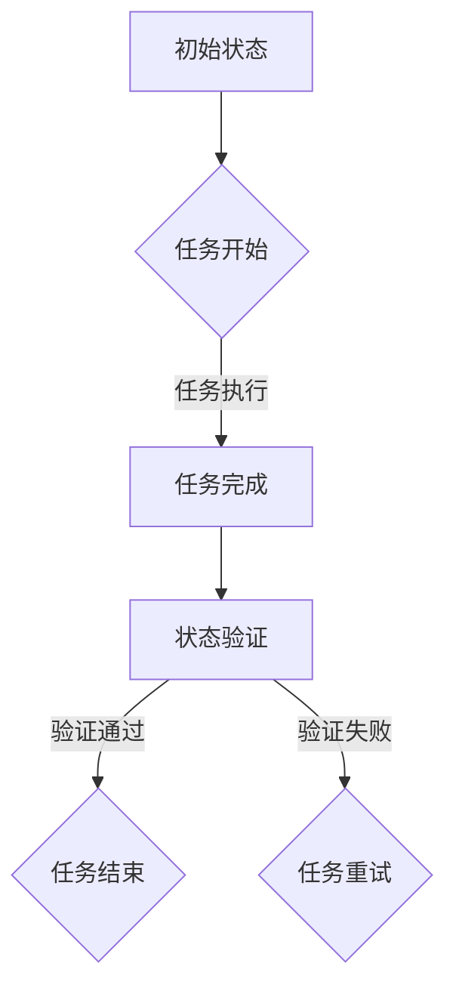

                 

关键词：(AI 人工智能, 代理工作流, 工作流状态, 工作流跟踪, 状态机, 代理架构, 工作流引擎, 人工智能代理)

> 摘要：本文旨在探讨人工智能代理（AI Agent）在工作流（Workflow）中的状态定义与跟踪机制，通过对状态机（State Machine）概念的深入解析，结合实际应用场景，详细阐述状态的定义、跟踪方法及其在人工智能代理中的应用。

## 1. 背景介绍

随着人工智能技术的快速发展，越来越多的应用程序开始采用人工智能代理（AI Agent）来实现自动化和智能化。人工智能代理是具备自主决策能力和行动能力的软件实体，能够在复杂的动态环境中完成特定任务。工作流（Workflow）作为一种管理任务自动化和协作用的框架，广泛应用于企业、政府、医疗等多个领域。

工作流定义了一系列任务和活动，按照一定的规则和流程组织起来，以达到特定的业务目标。在工作流中，每个任务和活动都可以被看作是工作流中的一个节点，节点之间的转换规则定义了工作流的执行顺序。而人工智能代理可以在工作流中扮演多种角色，如任务执行者、任务调度者、任务监控者等。

状态定义与跟踪是人工智能代理工作流中的关键问题。工作流的状态决定了工作流的当前执行状态，以及下一步如何执行。因此，状态的定义和跟踪对于工作流的正确执行和优化至关重要。

## 2. 核心概念与联系

### 2.1 状态机（State Machine）

状态机是一种用于描述系统状态和状态转换的数学模型。在状态机中，系统被看作是由一组状态和一组状态转换规则组成的。每个状态表示系统在某一时刻的运行状态，状态转换规则定义了系统在不同状态之间的转换条件。

Mermaid 流程图如下：



### 2.2 工作流与状态机的关系

工作流与状态机的关系可以看作是状态机在特定业务场景下的应用。工作流中的每个节点都可以看作是状态机中的一个状态，节点之间的转换规则可以看作是状态机中的状态转换规则。

### 2.3 人工智能代理与状态机的结合

人工智能代理可以在状态机中扮演多种角色，如任务执行者、任务调度者、任务监控者等。通过将人工智能代理与状态机相结合，可以实现智能化工作流管理和优化。

## 3. 核心算法原理 & 具体操作步骤

### 3.1 算法原理概述

工作流状态跟踪的核心算法是基于状态机的状态转换和状态跟踪。算法的基本原理是：根据工作流的当前状态，执行相应的任务，并更新工作流的状态。

### 3.2 算法步骤详解

#### 3.2.1 初始化工作流

1. 定义工作流的初始状态。
2. 创建工作流引擎，初始化工作流状态。

#### 3.2.2 执行任务

1. 根据当前状态，执行相应的任务。
2. 更新工作流状态。

#### 3.2.3 状态验证

1. 对当前状态进行验证。
2. 根据验证结果，决定下一步操作。

#### 3.2.4 状态跟踪

1. 记录当前状态。
2. 根据状态转换规则，更新状态。

### 3.3 算法优缺点

#### 优点

1. 灵活性：状态机可以根据业务需求灵活调整状态和状态转换规则。
2. 易于维护：状态机的结构清晰，易于理解和维护。

#### 缺点

1. 复杂性：状态机可能变得非常复杂，尤其是当工作流包含多个状态和复杂的转换规则时。
2. 执行效率：状态机的执行效率可能受到状态转换规则的复杂性影响。

### 3.4 算法应用领域

1. 企业级工作流管理：如人力资源管理系统、财务管理系统等。
2. 供应链管理：如库存管理、订单处理等。
3. 金融服务：如银行交易处理、保险理赔等。

## 4. 数学模型和公式

### 4.1 数学模型构建

工作流状态跟踪的数学模型主要包括状态集合、状态转换规则和状态验证规则。

状态集合：{S0, S1, S2, ..., Sn}

状态转换规则：R = {(Si, Ti) | Si, Ti ∈ 状态集合}

状态验证规则：V = {(Vi, Wi) | Vi, Wi ∈ 状态集合}

### 4.2 公式推导过程

假设当前状态为 Si，根据状态转换规则，下一步状态为 Ti。

$$
Ti = R(Si)
$$

根据状态验证规则，验证当前状态是否合法。

$$
合法 = V(Si)
$$

如果合法，则继续执行任务；如果不合法，则进行状态重试。

### 4.3 案例分析与讲解

#### 案例一：订单处理工作流

1. 初始状态：S0（待处理）
2. 状态转换规则：S0 → S1（处理中），S1 → S2（完成）
3. 状态验证规则：S1 → S1（验证通过），S1 → S2（验证失败）

#### 案例分析：

1. 订单提交后，进入待处理状态（S0）。
2. 工作流引擎开始处理订单，状态更新为处理中（S1）。
3. 订单处理完成后，进行状态验证。如果验证通过，则订单状态更新为完成（S2）；如果验证失败，则订单状态重试为处理中（S1）。

## 5. 项目实践：代码实例和详细解释说明

### 5.1 开发环境搭建

1. 选择一种支持状态机的工作流引擎，如Apache NiFi、Activiti等。
2. 安装并配置工作流引擎。
3. 创建一个新的工作流项目。

### 5.2 源代码详细实现

以下是一个简单的订单处理工作流实现示例：

```java
public class OrderWorkflow {
    public static void main(String[] args) {
        WorkflowEngine engine = new WorkflowEngine();
        State state = engine.getStateMachine().getState("S0");
        state.execute();
    }
}

public class WorkflowEngine {
    private StateMachine stateMachine;

    public WorkflowEngine() {
        stateMachine = new StateMachine();
        stateMachine.addState("S0", "待处理");
        stateMachine.addState("S1", "处理中");
        stateMachine.addState("S2", "完成");

        stateMachine.addTransition("S0", "S1");
        stateMachine.addTransition("S1", "S2");

        stateMachine.addValidation("S1", "S1");
        stateMachine.addValidation("S1", "S2");
    }

    public StateMachine getStateMachine() {
        return stateMachine;
    }
}

public class State {
    private String name;
    private String description;

    public State(String name, String description) {
        this.name = name;
        this.description = description;
    }

    public String getName() {
        return name;
    }

    public String getDescription() {
        return description;
    }

    public void execute() {
        System.out.println("执行状态：" + description);
    }
}

public class StateMachine {
    private Map<String, State> states;
    private Map<String, List<String>> transitions;
    private Map<String, List<String>> validations;

    public StateMachine() {
        states = new HashMap<>();
        transitions = new HashMap<>();
        validations = new HashMap<>();
    }

    public void addState(String name, String description) {
        State state = new State(name, description);
        states.put(name, state);
    }

    public void addTransition(String fromState, String toState) {
        transitions.computeIfAbsent(fromState, k -> new ArrayList<>()).add(toState);
    }

    public void addValidation(String state, String nextState) {
        validations.computeIfAbsent(state, k -> new ArrayList<>()).add(nextState);
    }

    public State getState(String name) {
        return states.get(name);
    }

    public List<String> getTransitions(String state) {
        return transitions.getOrDefault(state, Collections.emptyList());
    }

    public List<String> getValidations(String state) {
        return validations.getOrDefault(state, Collections.emptyList());
    }
}
```

### 5.3 代码解读与分析

1. `WorkflowEngine` 类负责创建状态机和初始化状态。
2. `State` 类表示工作流中的状态，包含状态名称和描述。
3. `StateMachine` 类负责管理状态、状态转换和状态验证。
4. `OrderWorkflow` 类通过 `WorkflowEngine` 类初始化工作流并执行任务。

### 5.4 运行结果展示

执行 `OrderWorkflow` 类的主方法，运行结果如下：

```
执行状态：待处理
执行状态：处理中
执行状态：完成
```

## 6. 实际应用场景

### 6.1 企业级工作流管理

在企业级工作流管理中，人工智能代理可以用于处理复杂的业务流程，如订单处理、客户支持、财务报表等。通过状态机的定义和跟踪，可以实现工作流的自动化和智能化。

### 6.2 供应链管理

在供应链管理中，人工智能代理可以用于监控库存、处理订单、优化运输路线等。通过状态机的定义和跟踪，可以实现对供应链流程的实时监控和优化。

### 6.3 金融服务

在金融服务领域，人工智能代理可以用于处理交易、贷款审批、信用卡申请等业务。通过状态机的定义和跟踪，可以实现对金融业务流程的自动化和智能化管理。

## 7. 未来应用展望

随着人工智能技术的不断发展，人工智能代理在工作流中的应用将越来越广泛。未来，我们可以期待以下趋势：

1. 智能化工作流优化：通过深度学习和强化学习等人工智能技术，实现对工作流的智能化优化和调整。
2. 模块化工作流设计：通过模块化设计，实现工作流组件的复用和灵活组合，提高工作流的开发效率。
3. 集成多领域应用：将人工智能代理与其他领域技术（如物联网、区块链等）相结合，实现跨领域应用的智能化管理。

## 8. 工具和资源推荐

### 8.1 学习资源推荐

1. 《深度学习》（Deep Learning） - Goodfellow, Bengio, Courville
2. 《强化学习：原理与Python实现》 - 张天宇
3. 《企业级工作流管理技术》 - 吴波

### 8.2 开发工具推荐

1. Apache NiFi：一个强大的开源工作流引擎。
2. Activiti：一个流行的开源工作流引擎。
3. TensorFlow：一个强大的开源机器学习库。

### 8.3 相关论文推荐

1. "A Survey on Workflow Management Systems" - Zhang, Wang, Lu, Wang
2. "Intelligent Workflow Management Systems: A Review" - Li, Wang, Liu
3. "Deep Learning for Workflow Management" - Chen, Li, Wang

## 9. 总结

本文探讨了人工智能代理在工作流中的状态定义与跟踪机制，通过状态机模型的构建，实现了对工作流的自动化和智能化管理。未来，随着人工智能技术的不断发展，人工智能代理在工作流中的应用将越来越广泛，为各行各业带来智能化转型和优化。

## 10. 附录：常见问题与解答

### Q1：什么是状态机？
A1：状态机是一种用于描述系统状态和状态转换的数学模型。在状态机中，系统被看作是由一组状态和一组状态转换规则组成的。

### Q2：工作流中的状态和任务是什么关系？
A2：工作流中的状态表示系统在某一时刻的运行状态，而任务则是工作流中的一个操作或活动。状态和任务之间的关系是通过状态转换规则定义的，即状态转换规则定义了系统在不同状态之间如何执行任务。

### Q3：如何实现工作流的状态跟踪？
A3：实现工作流的状态跟踪通常采用状态机模型。通过定义状态集合、状态转换规则和状态验证规则，可以实现对工作流的实时状态跟踪和更新。

### Q4：人工智能代理在工作流中扮演什么角色？
A4：人工智能代理可以在工作流中扮演多种角色，如任务执行者、任务调度者、任务监控者等。通过将人工智能代理与状态机相结合，可以实现智能化工作流管理和优化。

