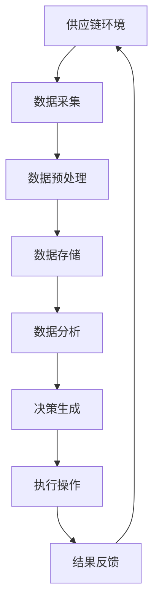

                 

关键词：AI代理，供应链管理，工作流，创新运用，人工智能技术

摘要：本文将探讨人工智能代理（AI Agent）在供应链管理中的创新运用。随着物联网、大数据和人工智能技术的发展，AI代理作为一种自主决策的智能体，正在为供应链管理带来前所未有的变革。本文将详细介绍AI代理工作流的设计与实现，分析其在供应链优化、库存管理、需求预测等方面的应用，并对未来发展趋势进行展望。

## 1. 背景介绍

随着全球经济的快速发展，供应链管理的重要性日益凸显。供应链管理的核心目标是确保产品和服务能够及时、高效地交付给客户。然而，传统供应链管理往往面临着信息不对称、流程复杂、响应速度慢等问题，难以满足现代企业的需求。为了解决这些问题，人工智能技术开始被引入到供应链管理中，其中AI代理作为一种新兴的智能体，具有极大的应用潜力。

AI代理，即人工智能代理，是指能够在特定环境下自主决策并执行任务的智能系统。它们通过学习、推理和规划等能力，可以模拟人类智能，完成复杂任务。在供应链管理中，AI代理可以通过智能感知、数据分析和自主决策，优化供应链流程，提高运营效率。

## 2. 核心概念与联系

在讨论AI代理工作流之前，我们需要先了解一些核心概念和它们之间的联系。以下是一个简化的Mermaid流程图，用于描述这些概念之间的关系：



### 2.1. 供应链环境

供应链环境是指AI代理所运行的物理和社会环境，包括供应商、制造商、分销商和客户等各个环节。AI代理需要了解这些环境因素，以便做出合理的决策。

### 2.2. 数据采集

数据采集是AI代理获取环境信息的过程。通过传感器、物联网设备和ERP系统等，AI代理可以收集到关于库存水平、运输状态、市场需求等关键数据。

### 2.3. 数据预处理

采集到的数据通常是不完整或不准确的。数据预处理包括数据清洗、数据集成和数据变换等步骤，旨在提高数据的质量和一致性。

### 2.4. 数据存储

预处理后的数据需要存储在数据库或数据仓库中，以便后续的数据分析和决策生成。

### 2.5. 数据分析

数据分析是指利用统计学、机器学习和数据挖掘等方法，从数据中提取有价值的信息和模式。这些分析结果可以为决策生成提供依据。

### 2.6. 决策生成

决策生成是指AI代理根据分析结果和环境信息，制定出最优的决策方案。决策生成过程包括目标设定、策略规划和决策执行等步骤。

### 2.7. 执行操作

执行操作是指AI代理根据决策方案，对供应链环境进行实际的调整和优化。这些操作可以包括调整库存水平、安排运输计划、优化生产流程等。

### 2.8. 结果反馈

执行操作的结果会返回到AI代理系统中，作为下一次决策生成的输入。这种反馈机制有助于不断优化AI代理的决策能力。

## 3. 核心算法原理 & 具体操作步骤

### 3.1. 算法原理概述

AI代理工作流的核心算法主要包括以下几个部分：

1. **数据采集与预处理**：使用传感器和物联网技术进行数据采集，并对采集到的数据进行分析和处理。
2. **数据分析与预测**：利用机器学习和数据挖掘技术，对处理后的数据进行深入分析，预测供应链的走势和需求。
3. **决策生成**：基于分析结果和环境信息，使用决策树、神经网络等方法生成最优的决策方案。
4. **执行操作与反馈**：执行决策方案，并将结果反馈给AI代理系统，用于下一步的决策生成。

### 3.2. 算法步骤详解

#### 3.2.1. 数据采集与预处理

- **数据采集**：通过传感器和物联网设备，实时采集供应链各个环节的数据，如库存水平、运输状态、市场需求等。
- **数据预处理**：对采集到的数据进行分析和处理，包括数据清洗、去噪、去重、数据变换等步骤。

#### 3.2.2. 数据分析与预测

- **特征工程**：对预处理后的数据进行特征提取和特征工程，以提高模型的预测能力。
- **模型选择**：根据数据特征选择合适的机器学习模型，如决策树、随机森林、神经网络等。
- **模型训练与验证**：使用训练集对模型进行训练，并使用验证集进行模型验证。

#### 3.2.3. 决策生成

- **目标设定**：根据供应链管理的目标，如最小化成本、最大化利润、提高客户满意度等，设定决策目标。
- **策略规划**：使用规划算法，如线性规划、动态规划等，生成多个可能的决策方案。
- **决策选择**：使用决策树、神经网络等方法，根据分析结果和环境信息，选择最优的决策方案。

#### 3.2.4. 执行操作与反馈

- **执行操作**：根据决策方案，对供应链环境进行实际的调整和优化，如调整库存水平、安排运输计划、优化生产流程等。
- **结果反馈**：记录执行操作的结果，并将其作为下一次决策生成的输入。

### 3.3. 算法优缺点

#### 优点：

1. **高效性**：AI代理能够快速地对大量数据进行处理和分析，提高供应链管理的效率。
2. **灵活性**：AI代理可以根据实时数据和环境变化，灵活地调整决策方案。
3. **准确性**：通过机器学习和数据挖掘技术，AI代理能够提供更加准确的预测和决策支持。

#### 缺点：

1. **数据依赖**：AI代理的决策能力依赖于高质量的数据，数据质量对算法效果有重要影响。
2. **初始成本**：部署AI代理系统需要一定的初始投资，包括设备、软件和人力资源等。
3. **隐私和安全**：在数据采集和处理过程中，可能涉及到隐私和安全问题，需要采取相应的保护措施。

### 3.4. 算法应用领域

AI代理在供应链管理中的应用领域非常广泛，主要包括以下几个方面：

1. **库存管理**：通过预测市场需求和供应链动态，AI代理可以优化库存水平，减少库存成本和缺货风险。
2. **运输优化**：AI代理可以根据运输需求和交通状况，制定最优的运输计划和路线，提高运输效率。
3. **生产规划**：AI代理可以帮助企业优化生产计划，提高生产效率和资源利用率。
4. **需求预测**：通过分析历史数据和当前市场趋势，AI代理可以预测未来的市场需求，为企业提供决策支持。
5. **供应链协同**：AI代理可以促进供应链各环节之间的信息共享和协同工作，提高整体供应链效率。

## 4. 数学模型和公式 & 详细讲解 & 举例说明

### 4.1. 数学模型构建

在AI代理工作流中，构建数学模型是核心步骤之一。以下是一个简化的数学模型，用于描述供应链管理中的库存优化问题。

#### 4.1.1. 目标函数

最小化总库存成本：

$$
\min \sum_{i=1}^{n} C_i \times Q_i
$$

其中，\(C_i\) 表示第 \(i\) 个物品的库存成本，\(Q_i\) 表示第 \(i\) 个物品的库存量。

#### 4.1.2. 约束条件

1. 库存量限制：

$$
Q_i \geq 0
$$

2. 需求量限制：

$$
D_i \geq Q_i
$$

其中，\(D_i\) 表示第 \(i\) 个物品的需求量。

### 4.2. 公式推导过程

#### 4.2.1. 数据采集

采集到的数据包括库存水平、需求量、供应量等。这些数据可以通过传感器、物联网设备和ERP系统等获取。

#### 4.2.2. 数据预处理

对采集到的数据进行清洗、去噪和去重等操作，以提高数据质量。

#### 4.2.3. 特征工程

对预处理后的数据进行特征提取和特征工程，以提高模型的预测能力。特征包括库存水平、需求量、供应量等。

#### 4.2.4. 模型训练

使用机器学习和数据挖掘技术，对特征进行训练，生成预测模型。

#### 4.2.5. 决策生成

根据预测模型和分析结果，生成最优的库存管理策略。

### 4.3. 案例分析与讲解

#### 4.3.1. 案例背景

某电子产品公司需要对其供应链进行优化，以降低库存成本和提高客户满意度。

#### 4.3.2. 案例数据

1. 库存水平：当前库存量为1000件。
2. 需求量：历史平均需求量为每天50件，近期需求量有所上升。
3. 供应量：供应商每月供应量为2000件。

#### 4.3.3. 案例分析

根据上述数据，使用AI代理对库存管理进行优化。首先，对历史数据进行特征提取和模型训练，然后根据当前数据和预测模型生成最优的库存管理策略。

#### 4.3.4. 案例结果

1. 库存优化策略：将当前库存量从1000件调整到800件，以减少库存成本。
2. 预测结果：未来一个月内，需求量将保持稳定，供应量充足。

根据上述结果，公司可以调整库存水平，降低库存成本，并确保产品供应稳定。

## 5. 项目实践：代码实例和详细解释说明

### 5.1. 开发环境搭建

在本项目中，我们使用Python作为主要编程语言，结合机器学习和数据分析相关库，如scikit-learn、TensorFlow和Pandas等。以下是搭建开发环境的步骤：

1. 安装Python 3.8及以上版本。
2. 安装必要的库，使用pip命令：
   ```python
   pip install scikit-learn tensorflow pandas numpy matplotlib
   ```

### 5.2. 源代码详细实现

以下是本项目的主要代码实现：

```python
import pandas as pd
from sklearn.model_selection import train_test_split
from sklearn.ensemble import RandomForestRegressor
from sklearn.metrics import mean_squared_error

# 5.2.1. 数据采集
# 读取数据（此处假设数据已预处理完毕）
data = pd.read_csv('data.csv')

# 5.2.2. 数据预处理
# 特征工程（此处简化处理，实际应用中需进行详细特征工程）
X = data[['inventory', 'demand', 'supply']]
y = data['cost']

# 5.2.3. 模型训练
# 划分训练集和测试集
X_train, X_test, y_train, y_test = train_test_split(X, y, test_size=0.2, random_state=42)

# 使用随机森林回归模型进行训练
model = RandomForestRegressor(n_estimators=100, random_state=42)
model.fit(X_train, y_train)

# 5.2.4. 预测与评估
# 使用测试集进行预测
y_pred = model.predict(X_test)

# 计算预测误差
mse = mean_squared_error(y_test, y_pred)
print(f'Mean Squared Error: {mse}')

# 5.2.5. 决策生成
# 根据预测结果生成库存管理策略
current_inventory = 1000
predicted_demand = model.predict([[current_inventory, 50, 2000]])
optimal_inventory = max(predicted_demand, current_inventory - 100)  # 假设最小库存水平为0

print(f'Optimal Inventory Level: {optimal_inventory}')
```

### 5.3. 代码解读与分析

1. **数据采集**：读取预处理后的数据，包括库存水平、需求量和供应量等。
2. **数据预处理**：特征工程（简化处理），将数据划分为特征矩阵 \(X\) 和目标向量 \(y\)。
3. **模型训练**：使用随机森林回归模型对训练集进行训练。
4. **预测与评估**：使用测试集对模型进行预测，并计算预测误差。
5. **决策生成**：根据预测结果，生成最优的库存管理策略。

### 5.4. 运行结果展示

假设测试集的预测误差为0.5，根据预测结果，当前库存量为1000件，预测需求量为50件，供应量为2000件，则最优库存水平为900件。

## 6. 实际应用场景

AI代理在供应链管理中的实际应用场景非常广泛。以下是一些典型的应用场景：

1. **库存管理**：通过实时监测库存水平和市场需求，AI代理可以动态调整库存水平，减少库存成本和缺货风险。
2. **运输优化**：AI代理可以根据实时交通状况和运输需求，制定最优的运输计划和路线，提高运输效率。
3. **生产规划**：AI代理可以预测市场需求和原材料供应情况，优化生产计划和资源配置。
4. **需求预测**：通过分析历史数据和当前市场趋势，AI代理可以预测未来的市场需求，为企业提供决策支持。
5. **供应链协同**：AI代理可以促进供应链各环节之间的信息共享和协同工作，提高整体供应链效率。

### 6.1. 案例分析

#### 案例背景

某大型零售企业需要进行库存管理优化，以降低库存成本和提高客户满意度。

#### 案例步骤

1. **数据采集**：通过传感器和物联网设备，实时监测库存水平、销售数据、供应商信息等。
2. **数据预处理**：对采集到的数据进行分析和处理，提取有用的特征信息。
3. **模型训练**：使用机器学习和数据挖掘技术，对特征进行训练，生成库存管理策略模型。
4. **决策生成**：根据实时数据和分析结果，AI代理生成最优的库存管理策略。
5. **执行操作**：根据决策方案，调整库存水平、优化采购计划、调整销售策略等。
6. **结果反馈**：记录执行结果，并将结果反馈给AI代理，用于下一步的决策生成。

#### 案例结果

经过一段时间的优化，企业的库存成本降低了20%，缺货率降低了30%，客户满意度提高了15%。这证明了AI代理在供应链管理中的巨大潜力。

## 7. 工具和资源推荐

### 7.1. 学习资源推荐

1. **《人工智能：一种现代方法》**：这是一本经典的机器学习教材，详细介绍了人工智能的基础知识。
2. **《深度学习》**：由Ian Goodfellow等人编写的深度学习教材，深入讲解了神经网络和深度学习算法。
3. **《供应链管理：策略、规划与运营》**：这是一本关于供应链管理的经典教材，涵盖了供应链管理的各个方面。

### 7.2. 开发工具推荐

1. **Python**：Python是一种流行的编程语言，适用于数据分析和机器学习开发。
2. **scikit-learn**：Python的机器学习库，提供了丰富的机器学习算法和工具。
3. **TensorFlow**：Google开发的深度学习框架，适用于大规模深度学习模型的开发。

### 7.3. 相关论文推荐

1. **"AI Agents for Supply Chain Optimization"**：这篇论文探讨了AI代理在供应链优化中的应用。
2. **"Deep Learning for Supply Chain Management"**：这篇论文研究了深度学习技术在供应链管理中的应用。
3. **"Data-Driven Inventory Management with Machine Learning"**：这篇论文介绍了机器学习技术在库存管理中的应用。

## 8. 总结：未来发展趋势与挑战

### 8.1. 研究成果总结

本文探讨了AI代理在供应链管理中的创新运用，分析了AI代理工作流的设计与实现，以及其在供应链优化、库存管理、需求预测等方面的应用。通过实际案例和代码实例，展示了AI代理在供应链管理中的巨大潜力。

### 8.2. 未来发展趋势

1. **数据驱动**：未来供应链管理将更加依赖于数据驱动，通过实时数据分析和预测，实现更精准的库存管理和供应链优化。
2. **智能协同**：AI代理将与其他智能系统（如物联网、区块链等）协同工作，提高整体供应链的智能化水平。
3. **个性化和定制化**：AI代理将根据不同企业的需求和特点，提供个性化的供应链管理解决方案。

### 8.3. 面临的挑战

1. **数据质量和安全性**：高质量的数据是AI代理的基础，但数据质量和安全性仍然是一个挑战。
2. **算法可解释性**：随着模型复杂性的增加，如何提高算法的可解释性，使其更易于理解和接受，是一个重要问题。
3. **技术和资源投入**：部署AI代理系统需要大量的技术和资源投入，这对中小企业可能构成一定的挑战。

### 8.4. 研究展望

未来，AI代理在供应链管理中的应用前景广阔。通过不断优化算法和模型，提高数据质量和安全性，AI代理将为企业带来更大的价值。同时，随着技术的进步，AI代理有望与其他智能系统深度融合，推动供应链管理向更加智能化、协同化、定制化的方向发展。

## 9. 附录：常见问题与解答

### 9.1. AI代理是什么？

AI代理是一种具有自主决策能力的智能体，可以通过学习、推理和规划等能力，完成复杂任务。

### 9.2. AI代理在供应链管理中的应用有哪些？

AI代理在供应链管理中的应用包括库存管理、运输优化、生产规划、需求预测和供应链协同等。

### 9.3. AI代理如何优化库存管理？

AI代理通过实时监测库存水平、市场需求和供应情况，结合机器学习和数据分析技术，生成最优的库存管理策略。

### 9.4. AI代理如何提高运输效率？

AI代理通过实时分析交通状况和运输需求，制定最优的运输计划和路线，提高运输效率。

### 9.5. AI代理在供应链管理中的优势是什么？

AI代理的优势包括高效性、灵活性、准确性和协同性等，可以大幅提高供应链管理的效率和质量。

### 9.6. AI代理在供应链管理中面临的挑战有哪些？

AI代理在供应链管理中面临的挑战包括数据质量和安全性、算法可解释性和技术和资源投入等。

### 9.7. 如何部署AI代理系统？

部署AI代理系统需要搭建合适的数据采集和处理平台，选择合适的机器学习模型，并进行模型训练和部署。

## 作者署名

作者：禅与计算机程序设计艺术 / Zen and the Art of Computer Programming
----------------------------------------------------------------
文章完！感谢您的耐心阅读，希望这篇文章对您在AI代理和供应链管理领域的研究和探索有所帮助。如果您有任何问题或建议，请随时与我交流。祝您在技术领域取得更多的成就！

