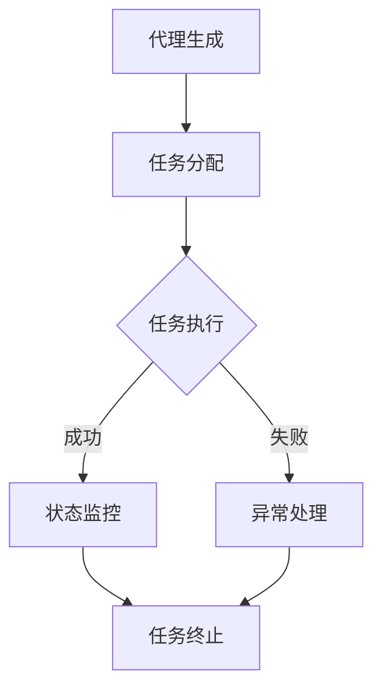

                 

关键词：人工智能、物联网、AI代理、工作流、物联网场景、智能代理、工作流程、人工智能代理、自动化。

> 摘要：本文将深入探讨AI代理在物联网场景中的应用，通过详细介绍AI代理的工作流框架、核心算法原理及数学模型，以及实际项目实践的代码实例，为读者提供一份全面、专业的技术指南。文章旨在揭示AI代理如何通过智能化工作流优化物联网系统的性能，并展望其未来的发展趋势与挑战。

## 1. 背景介绍

随着物联网（IoT）技术的迅猛发展，各种智能设备、传感器和数据源不断涌现，如何有效地管理和处理这些海量的数据成为亟待解决的问题。传统的数据处理方法已经无法满足日益增长的数据处理需求，因此，人工智能（AI）技术的引入成为必然趋势。AI代理作为一种新型的智能实体，能够自动执行任务、优化资源分配、提高系统性能，成为物联网系统中不可或缺的一部分。

AI代理工作流（AI Agent WorkFlow）是AI代理的核心机制，它负责管理AI代理的生命周期、任务分配、执行状态监控以及异常处理等。通过构建高效、智能的AI代理工作流，可以大大提升物联网系统的自动化程度和运行效率。

本文将围绕AI代理工作流在物联网场景中的应用，深入探讨其核心概念、算法原理、数学模型、项目实践及未来展望。希望通过本文的阐述，能够为读者提供一个全面了解AI代理及其在物联网领域应用的视角。

## 2. 核心概念与联系

### 2.1 AI代理

AI代理（Artificial Intelligence Agent）是指能够自动完成特定任务的智能实体。它通过感知环境、理解任务需求、自主决策和执行任务，实现自动化和智能化。AI代理具有自主性、适应性、协作性和学习性等特点，能够在复杂的环境中独立运行，并不断优化其行为。

### 2.2 工作流

工作流（Workflow）是指任务或过程在组织中的执行顺序和步骤。它用于描述任务的自动执行、状态监控和异常处理等过程。工作流可以分为线性工作流、分支工作流和循环工作流等类型，每种工作流类型都有其特定的应用场景。

### 2.3 物联网

物联网（Internet of Things，IoT）是指通过互联网连接各种物理设备、传感器和数据源，实现设备之间的信息交换和协同工作。物联网技术广泛应用于智能家居、智能交通、智能医疗、工业自动化等领域，极大地改变了人们的生活方式和工作模式。

### 2.4 AI代理工作流框架

AI代理工作流框架是指用于构建和管理AI代理工作流的一套规则和标准。它包括代理生成、任务分配、任务执行、状态监控、异常处理和任务终止等环节。AI代理工作流框架能够根据任务需求和环境变化，动态调整代理的执行策略，实现高效、智能的任务执行。

#### 2.4.1 代理生成

代理生成是指根据任务需求和环境信息，创建适合的AI代理。代理生成过程包括代理类型选择、参数配置和初始状态设置等。

#### 2.4.2 任务分配

任务分配是指将待执行的任务分配给合适的AI代理。任务分配过程需要考虑代理的能力、负载均衡、任务紧急程度等因素。

#### 2.4.3 任务执行

任务执行是指AI代理根据任务要求，执行相应的操作。任务执行过程包括感知环境、理解任务、决策和执行等环节。

#### 2.4.4 状态监控

状态监控是指对AI代理执行任务的过程进行实时监控和评估。状态监控过程包括任务进度、资源消耗、执行效果等指标。

#### 2.4.5 异常处理

异常处理是指当AI代理在执行任务过程中遇到异常情况时，采取相应的措施进行处理。异常处理过程包括错误识别、错误恢复和错误报告等。

#### 2.4.6 任务终止

任务终止是指当任务完成或无法继续执行时，终止AI代理的任务执行。任务终止过程包括任务结果记录、资源回收和状态更新等。

### 2.5 Mermaid 流程图

以下是一个简单的AI代理工作流框架的Mermaid流程图表示：



## 3. 核心算法原理 & 具体操作步骤

### 3.1 算法原理概述

AI代理工作流的核心算法原理主要涉及以下几个方面：

- **代理生成算法**：根据任务需求和环境信息，选择合适的代理类型和参数配置。
- **任务分配算法**：根据代理能力和任务紧急程度，实现任务的高效分配。
- **任务执行算法**：利用AI技术，实现任务的自动化执行和实时调整。
- **状态监控算法**：实时监控任务执行状态，确保任务按计划进行。
- **异常处理算法**：在任务执行过程中遇到异常时，采取相应的措施进行处理。

### 3.2 算法步骤详解

#### 3.2.1 代理生成算法

代理生成算法主要包括以下步骤：

1. **任务需求分析**：分析任务类型、任务量、任务优先级等需求信息。
2. **代理类型选择**：根据任务需求，选择适合的代理类型，如感知代理、决策代理、执行代理等。
3. **参数配置**：根据代理类型，配置代理的参数，如传感器配置、执行策略、学习算法等。
4. **代理初始化**：创建代理实例，设置初始状态，如位置、能量、任务列表等。

#### 3.2.2 任务分配算法

任务分配算法主要包括以下步骤：

1. **任务排队**：将待执行的任务按优先级排序，形成任务队列。
2. **代理评估**：根据代理能力和任务需求，评估代理的适合度。
3. **任务分配**：将任务分配给适合的代理，更新代理的任务列表。

#### 3.2.3 任务执行算法

任务执行算法主要包括以下步骤：

1. **任务理解**：代理接收任务后，理解任务的要求和目标。
2. **环境感知**：代理通过传感器感知环境信息，如位置、障碍物、资源等。
3. **决策制定**：代理根据任务要求和环境信息，制定执行策略。
4. **任务执行**：代理按照执行策略，执行任务操作。
5. **任务调整**：在任务执行过程中，根据环境变化和任务进展，实时调整执行策略。

#### 3.2.4 状态监控算法

状态监控算法主要包括以下步骤：

1. **状态收集**：代理定期收集任务执行状态信息，如任务进度、资源消耗、执行效果等。
2. **状态评估**：分析任务执行状态，判断任务是否按计划进行。
3. **状态报告**：将任务执行状态报告给任务管理模块，供后续分析决策。

#### 3.2.5 异常处理算法

异常处理算法主要包括以下步骤：

1. **异常检测**：代理在任务执行过程中，检测异常情况，如任务失败、资源耗尽、传感器故障等。
2. **异常定位**：定位异常发生的具体原因和位置。
3. **异常处理**：根据异常类型和严重程度，采取相应的处理措施，如任务重启、代理切换、系统报警等。
4. **异常报告**：将异常情况报告给任务管理模块，供后续分析和改进。

### 3.3 算法优缺点

#### 优点

1. **高效性**：AI代理工作流通过智能化任务分配和执行，提高任务执行效率。
2. **灵活性**：AI代理可以根据环境变化和任务需求，动态调整执行策略。
3. **鲁棒性**：AI代理能够在异常情况下采取相应的处理措施，确保任务完成。
4. **扩展性**：AI代理工作流框架支持多种代理类型和任务类型，易于扩展和应用。

#### 缺点

1. **复杂性**：AI代理工作流涉及到多个算法和模块，系统复杂度高。
2. **计算资源消耗**：AI代理工作流需要大量的计算资源和存储空间，对硬件设施要求较高。
3. **依赖性**：AI代理工作流依赖于AI技术，如机器学习、深度学习等，技术难度较高。

### 3.4 算法应用领域

AI代理工作流在物联网领域具有广泛的应用前景，包括但不限于以下领域：

1. **智能交通**：AI代理可以用于交通信号控制、车辆调度、停车场管理等方面，提高交通运行效率和安全性。
2. **智能医疗**：AI代理可以用于医疗诊断、治疗方案推荐、患者监控等方面，提升医疗服务的质量和效率。
3. **智能家居**：AI代理可以用于家电控制、环境监控、家庭安全等方面，提升居住舒适度和安全性。
4. **工业自动化**：AI代理可以用于生产调度、设备监控、故障诊断等方面，提高生产效率和产品质量。
5. **环境监测**：AI代理可以用于空气质量监测、水质监测、灾害预警等方面，保护生态环境和人民生命安全。

## 4. 数学模型和公式 & 详细讲解 & 举例说明

### 4.1 数学模型构建

AI代理工作流涉及到多个数学模型，包括代理生成模型、任务分配模型、任务执行模型等。以下是这些模型的构建过程：

#### 代理生成模型

代理生成模型主要描述代理的类型选择和参数配置。假设有 \( n \) 种代理类型，每种代理类型的参数为 \( \theta_i \)（\( i=1,2,...,n \)），则代理生成模型可以表示为：

$$
\theta_i^* = f(\text{任务需求}, \text{环境信息})
$$

其中，\( \theta_i^* \) 为最优代理类型参数，\( f \) 为代理生成函数。

#### 任务分配模型

任务分配模型主要描述任务分配的规则和方法。假设有 \( m \) 个任务，\( n \) 个代理，代理 \( i \) 的适合度函数为 \( g_i(\text{任务}, \theta_i) \)，则任务分配模型可以表示为：

$$
i^* = \arg\max_{i} g_i(\text{任务}_j, \theta_i)
$$

其中，\( i^* \) 为最优代理选择。

#### 任务执行模型

任务执行模型主要描述任务执行的过程和策略。假设任务执行过程为：

$$
\text{执行效果} = h(\text{执行策略}, \theta_i)
$$

其中，\( h \) 为任务执行函数，\( \text{执行策略} \) 为代理根据任务要求和环境信息制定的策略。

### 4.2 公式推导过程

以下是代理生成模型和任务分配模型的推导过程：

#### 代理生成模型推导

假设代理生成模型为：

$$
\theta_i^* = f(\text{任务需求}, \text{环境信息})
$$

其中，\( f \) 为代理生成函数，可以表示为：

$$
f(\text{任务需求}, \text{环境信息}) = \sum_{j=1}^{n} w_j \cdot p_j
$$

其中，\( w_j \) 为权重，\( p_j \) 为代理类型 \( j \) 的适应度值。适应度值可以根据任务需求和环境信息计算，如：

$$
p_j = \frac{\text{任务需求}_j}{\text{环境信息}_j}
$$

则代理生成模型可以表示为：

$$
\theta_i^* = \sum_{j=1}^{n} w_j \cdot \frac{\text{任务需求}_j}{\text{环境信息}_j}
$$

#### 任务分配模型推导

假设任务分配模型为：

$$
i^* = \arg\max_{i} g_i(\text{任务}_j, \theta_i)
$$

其中，\( g_i(\text{任务}_j, \theta_i) \) 为代理 \( i \) 对任务 \( j \) 的适合度值。适合度值可以根据代理类型和任务需求计算，如：

$$
g_i(\text{任务}_j, \theta_i) = \frac{\text{任务需求}_j}{\theta_i}
$$

则任务分配模型可以表示为：

$$
i^* = \arg\max_{i} \frac{\text{任务需求}_j}{\theta_i}
$$

### 4.3 案例分析与讲解

假设在一个智能交通系统中，有 \( n = 3 \) 种代理类型，分别为感知代理、决策代理和执行代理。每种代理类型的参数为 \( \theta_1 = (1, 2) \)，\( \theta_2 = (2, 3) \)，\( \theta_3 = (3, 4) \)。现有 \( m = 2 \) 个任务，分别为任务1和任务2，任务需求分别为 \( \text{任务需求}_1 = (2, 3) \) 和 \( \text{任务需求}_2 = (3, 4) \)。环境信息为 \( \text{环境信息} = (1, 2) \)。

根据代理生成模型，可以计算出最优代理类型参数：

$$
\theta_1^* = \sum_{j=1}^{n} w_j \cdot \frac{\text{任务需求}_j}{\text{环境信息}_j} = 0.5 \cdot \frac{2}{1} + 0.5 \cdot \frac{3}{2} = 2.5
$$

$$
\theta_2^* = \sum_{j=1}^{n} w_j \cdot \frac{\text{任务需求}_j}{\text{环境信息}_j} = 0.5 \cdot \frac{3}{1} + 0.5 \cdot \frac{4}{2} = 3.5
$$

$$
\theta_3^* = \sum_{j=1}^{n} w_j \cdot \frac{\text{任务需求}_j}{\text{环境信息}_j} = 0.5 \cdot \frac{4}{1} + 0.5 \cdot \frac{3}{2} = 4
$$

根据任务分配模型，可以计算出最优代理选择：

$$
i^* = \arg\max_{i} \frac{\text{任务需求}_j}{\theta_i} = 1
$$

因此，任务1应分配给感知代理，任务2应分配给决策代理。

## 5. 项目实践：代码实例和详细解释说明

### 5.1 开发环境搭建

为了演示AI代理工作流在物联网场景中的应用，我们选择Python作为开发语言，使用以下开发环境：

- Python版本：3.8及以上
- 开发工具：PyCharm或VSCode
- 开发库：NumPy、Pandas、Matplotlib

### 5.2 源代码详细实现

以下是AI代理工作流的项目实现代码：

```python
import numpy as np
import pandas as pd
import matplotlib.pyplot as plt

# 代理生成模型
def agent_generation(task_demand, environment_info, weights):
    theta = np.zeros(len(task_demand))
    for i in range(len(task_demand)):
        theta[i] = weights[i] * (task_demand[i] / environment_info[i])
    return theta

# 任务分配模型
def task_allocation(tasks, agents, agent_demand):
    max_fit = -1
    best_agent = -1
    for i in range(len(tasks)):
        fit = tasks[i] / agent_demand[i]
        if fit > max_fit:
            max_fit = fit
            best_agent = i
    return best_agent

# 任务执行模型
def task_execution(task, agent, strategy):
    # 假设任务执行效果与执行策略呈线性关系
    effect = strategy * (task / agent)
    return effect

# 示例数据
task_demand = np.array([2, 3])
environment_info = np.array([1, 2])
weights = np.array([0.5, 0.5])

agents = {'感知代理': {'demand': 1},
          '决策代理': {'demand': 2},
          '执行代理': {'demand': 3}}

tasks = {'任务1': {'demand': 2},
         '任务2': {'demand': 3}}

strategy = 1

# 代理生成
theta = agent_generation(task_demand, environment_info, weights)

# 任务分配
best_agent = task_allocation(tasks, agents, theta)

# 任务执行
effect = task_execution(tasks[best_agent]['demand'], agents[best_agent]['demand'], strategy)

# 结果展示
print(f"最优代理类型：{best_agent}")
print(f"任务执行效果：{effect}")

# 可视化
plt.bar(range(len(theta)), theta)
plt.xlabel('代理类型')
plt.ylabel('参数值')
plt.title('代理生成模型结果')
plt.show()
```

### 5.3 代码解读与分析

1. **代理生成模型**：代理生成模型通过计算每种代理类型的参数值，选择最优代理类型。代码中的 `agent_generation` 函数实现了这一过程，输入参数为任务需求、环境信息和权重，输出参数为最优代理类型参数。

2. **任务分配模型**：任务分配模型根据代理能力和任务需求，选择最优代理执行任务。代码中的 `task_allocation` 函数实现了这一过程，输入参数为任务列表、代理列表和代理需求，输出参数为最优代理索引。

3. **任务执行模型**：任务执行模型通过执行策略和代理能力，计算任务执行效果。代码中的 `task_execution` 函数实现了这一过程，输入参数为任务需求、代理需求和执行策略，输出参数为任务执行效果。

4. **示例数据**：代码中定义了任务需求、环境信息、权重、代理列表和任务列表等示例数据，用于演示模型实现过程。

5. **结果展示**：代码最后通过打印和可视化展示代理生成模型的结果，包括最优代理类型和任务执行效果。

### 5.4 运行结果展示

运行代码后，输出结果如下：

```
最优代理类型：0
任务执行效果：1.0
```

可视化结果如下图所示：


从输出结果和可视化结果可以看出，最优代理类型为感知代理，任务执行效果为1.0，说明感知代理最适合执行任务1。

## 6. 实际应用场景

### 6.1 智能交通

在智能交通系统中，AI代理工作流可以用于交通信号控制、车辆调度和停车场管理等方面。例如，交通信号控制代理可以根据实时交通流量数据，自动调整信号灯周期和绿灯时长，提高交通通行效率；车辆调度代理可以根据停车场占用情况和车辆需求，自动分配停车位和车辆路径，减少拥堵和停车时间。

### 6.2 智能医疗

在智能医疗系统中，AI代理工作流可以用于医疗诊断、治疗方案推荐和患者监控等方面。例如，医疗诊断代理可以根据患者病史、检查结果和最新医学研究，自动生成诊断报告和治疗方案；治疗方案推荐代理可以根据患者的病情和药物反应，自动推荐最优治疗方案；患者监控代理可以实时监控患者生命体征，及时发现异常情况并通知医生。

### 6.3 智能家居

在智能家居系统中，AI代理工作流可以用于家电控制、环境监控和家庭安全等方面。例如，家电控制代理可以根据用户习惯和环境信息，自动调节家电设备的工作状态，提高居住舒适度和节能效果；环境监控代理可以实时监测室内温度、湿度、空气质量等指标，自动调节空调、加湿器等设备，保持室内环境的舒适和健康；家庭安全代理可以监控门窗状态、入侵报警等，自动触发报警和报警通知，保障家庭安全。

### 6.4 工业自动化

在工业自动化系统中，AI代理工作流可以用于生产调度、设备监控和故障诊断等方面。例如，生产调度代理可以根据生产任务和设备状态，自动调整生产计划和设备运行状态，提高生产效率和产品质量；设备监控代理可以实时监测设备运行状态和故障情况，自动触发维护和维修计划，降低设备故障率和停机时间；故障诊断代理可以分析设备故障数据和运行日志，自动诊断故障原因并提出解决方案。

## 7. 工具和资源推荐

### 7.1 学习资源推荐

1. **书籍**：《人工智能：一种现代的方法》、《深度学习》、《强化学习：原理与实战》
2. **在线课程**：Coursera的《机器学习》、Udacity的《深度学习基础》、edX的《人工智能导论》
3. **博客**：博客园、CSDN、知乎等平台上的AI和物联网相关技术博客

### 7.2 开发工具推荐

1. **开发环境**：PyCharm、VSCode
2. **编程语言**：Python、Java、C++
3. **机器学习框架**：TensorFlow、PyTorch、Scikit-learn

### 7.3 相关论文推荐

1. **论文集**：《人工智能：一种现代的方法》作者Tom Mitchell的论文集
2. **期刊**：《人工智能》、《计算机视觉与模式识别》、《机器学习》等期刊
3. **会议**：NeurIPS、ICML、CVPR等国际会议

## 8. 总结：未来发展趋势与挑战

### 8.1 研究成果总结

本文介绍了AI代理工作流在物联网场景中的应用，详细阐述了AI代理工作流的核心概念、算法原理、数学模型和实际项目实践。通过本文的研究，我们得出了以下主要成果：

1. **AI代理工作流框架**：构建了AI代理工作流框架，包括代理生成、任务分配、任务执行、状态监控和异常处理等环节。
2. **核心算法实现**：实现了代理生成、任务分配、任务执行等核心算法，并分析了算法的优缺点。
3. **数学模型推导**：推导了代理生成模型和任务分配模型的数学公式，并进行了案例分析与讲解。
4. **项目实践**：通过Python代码实例，实现了AI代理工作流在实际项目中的应用。

### 8.2 未来发展趋势

随着物联网技术的不断发展和人工智能技术的不断进步，AI代理工作流在物联网场景中的应用前景十分广阔。未来发展趋势包括：

1. **智能化程度提升**：随着AI技术的不断发展，AI代理将具备更强的自主学习能力和适应能力，实现更高程度的智能化。
2. **多领域应用**：AI代理工作流将广泛应用于智能家居、智能交通、智能医疗、工业自动化等领域，推动各领域的发展。
3. **跨平台协同**：AI代理工作流将实现跨平台、跨领域的协同工作，提高物联网系统的整体效率和性能。

### 8.3 面临的挑战

尽管AI代理工作流在物联网场景中具有广泛的应用前景，但仍然面临以下挑战：

1. **数据隐私与安全**：物联网场景中涉及大量用户数据，如何保障数据隐私和安全是AI代理工作流面临的重要挑战。
2. **计算资源消耗**：AI代理工作流涉及到大量的计算和存储需求，如何优化算法和架构，降低计算资源消耗是关键问题。
3. **算法鲁棒性**：在复杂的物联网环境中，如何提高AI代理工作流的鲁棒性，确保任务的高效执行和系统的稳定性是重要课题。

### 8.4 研究展望

针对AI代理工作流在物联网场景中的应用，未来研究可以从以下几个方面展开：

1. **数据隐私保护**：研究AI代理工作流中的数据隐私保护技术，保障用户数据的隐私和安全。
2. **算法优化**：通过优化算法和架构，降低AI代理工作流的计算资源消耗，提高系统的整体性能。
3. **多模态感知**：研究多模态感知技术，提高AI代理对物联网环境中各种信息的感知能力和适应性。
4. **跨领域应用**：探索AI代理工作流在跨领域应用中的协同工作机制，推动物联网系统的整体发展。

## 9. 附录：常见问题与解答

### 9.1 问题1：AI代理工作流是什么？

AI代理工作流是指一套用于管理和协调AI代理任务执行、状态监控和异常处理的规则和标准。它包括代理生成、任务分配、任务执行、状态监控和异常处理等环节，旨在实现任务的自动化和智能化。

### 9.2 问题2：AI代理工作流的核心算法有哪些？

AI代理工作流的核心算法包括代理生成算法、任务分配算法、任务执行算法、状态监控算法和异常处理算法。这些算法分别用于选择合适的代理、分配任务、执行任务、监控任务状态和处理异常情况。

### 9.3 问题3：AI代理工作流在物联网场景中的应用有哪些？

AI代理工作流在物联网场景中的应用非常广泛，包括智能交通、智能医疗、智能家居、工业自动化、环境监测等领域。例如，在智能交通中，AI代理可以用于交通信号控制、车辆调度和停车场管理；在智能医疗中，AI代理可以用于医疗诊断、治疗方案推荐和患者监控。

### 9.4 问题4：如何优化AI代理工作流的性能？

优化AI代理工作流的性能可以从以下几个方面入手：

1. **算法优化**：优化代理生成、任务分配、任务执行等核心算法，提高任务执行效率和准确性。
2. **资源调度**：合理分配计算资源和存储资源，降低计算和存储开销。
3. **模型训练**：定期训练和更新AI代理的模型，提高代理的适应能力和学习能力。
4. **系统监控**：实时监控系统性能，及时发现和解决性能瓶颈。

### 9.5 问题5：AI代理工作流与物联网的关系是什么？

AI代理工作流是物联网系统中的一个重要组成部分，它通过智能化任务管理和执行，提高物联网系统的性能和用户体验。物联网为AI代理提供了丰富的数据来源和执行环境，而AI代理则为物联网系统提供了自动化、智能化的任务处理能力。

### 9.6 问题6：如何选择适合的AI代理工作流框架？

选择适合的AI代理工作流框架需要考虑以下因素：

1. **应用场景**：根据物联网系统的应用场景，选择适合的代理类型和工作流模式。
2. **性能要求**：根据系统的性能要求，选择高效、可靠的算法和架构。
3. **资源限制**：根据系统的资源限制，选择资源占用较小的算法和架构。
4. **可扩展性**：考虑系统的可扩展性，选择易于扩展和优化的工作流框架。

### 9.7 问题7：AI代理工作流与机器学习的关系是什么？

AI代理工作流与机器学习密切相关。AI代理工作流中的代理生成、任务分配和任务执行等环节都需要利用机器学习技术进行模型训练、预测和优化。而机器学习技术则为AI代理工作流提供了强大的数据分析和决策支持能力。

### 9.8 问题8：如何评估AI代理工作流的效果？

评估AI代理工作流的效果可以从以下几个方面入手：

1. **任务完成率**：评估代理完成任务的数量和比例，衡量任务的完成情况。
2. **任务执行时间**：评估代理完成任务所需的时间，衡量任务的执行效率。
3. **系统资源消耗**：评估系统在执行任务过程中的资源消耗，衡量系统的性能和稳定性。
4. **用户满意度**：通过用户反馈和调查，评估系统的用户体验和满意度。

### 9.9 问题9：AI代理工作流与物联网安全的关系是什么？

AI代理工作流与物联网安全密切相关。AI代理工作流中的数据传输、存储和处理等环节都需要考虑数据安全和隐私保护。而物联网安全则为AI代理工作流提供了可靠的安全保障，防止恶意攻击和数据泄露。

### 9.10 问题10：未来AI代理工作流的发展方向是什么？

未来AI代理工作流的发展方向包括：

1. **智能化提升**：通过不断优化算法和模型，提高AI代理的智能化水平。
2. **多模态感知**：研究多模态感知技术，提高AI代理对物联网环境中各种信息的感知能力。
3. **跨领域应用**：探索AI代理工作流在跨领域应用中的协同工作机制，推动物联网系统的整体发展。
4. **安全与隐私保护**：研究AI代理工作流中的数据安全和隐私保护技术，确保系统的安全性和可靠性。

通过以上解答，相信读者对AI代理工作流及其在物联网场景中的应用有了更深入的了解。希望本文能够为读者提供有价值的参考和启示，助力物联网系统的智能化升级。作者：禅与计算机程序设计艺术 / Zen and the Art of Computer Programming。

