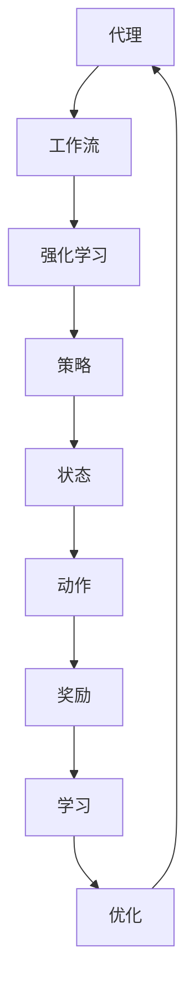

                 

关键词：人工智能，代理工作流，强化学习，优化算法，工作流程管理

> 摘要：本文深入探讨了AI代理工作流（AI Agent WorkFlow）的概念及其在业务流程管理中的重要性。通过引入强化学习算法，我们提出了一种新的优化方法，旨在提升代理工作流在复杂环境中的自适应能力和效率。本文首先回顾了相关概念和原理，随后详细阐述了算法的具体实现步骤及其优缺点，并通过具体案例分析了算法在实际应用中的效果。文章最后提出了未来应用展望及面临的挑战。

## 1. 背景介绍

随着信息技术的快速发展，企业逐渐意识到自动化工作流程在提高工作效率、减少人为错误和降低成本方面的重要性。人工智能（AI）作为现代技术的核心，其应用范围不断扩大，从简单的自动化任务到复杂的决策支持系统，AI技术正在深刻改变各个行业的运作方式。特别是代理工作流（Agent WorkFlow）的出现，为企业提供了更为灵活和高效的工作流管理解决方案。

### 1.1 代理工作流的概念

代理工作流是一种基于代理（Agent）的流程管理方法。代理是指能够独立执行任务、具有自主意识和决策能力的实体。在代理工作流中，多个代理通过相互协作，共同完成一个复杂的工作任务。代理工作流的特点在于其灵活性和可扩展性，能够适应不断变化的工作环境和任务需求。

### 1.2 强化学习的引入

强化学习（Reinforcement Learning，RL）是一种机器学习范式，旨在通过试错和奖励机制，使代理能够学习到最优策略。在代理工作流中，强化学习算法可以用于优化代理的行为策略，使其在不同环境下都能表现出最佳性能。强化学习与代理工作流的结合，为工作流管理带来了新的可能性和挑战。

## 2. 核心概念与联系

为了更好地理解AI代理工作流和强化学习的关系，我们首先需要明确相关核心概念，并绘制一个简化的流程图来展示这些概念之间的联系。

### 2.1 核心概念

- **代理（Agent）**：具有自主决策能力的实体，能够执行特定任务。
- **工作流（Workflow）**：一系列有序的任务组合，用于完成特定业务目标。
- **强化学习（Reinforcement Learning）**：通过试错和奖励机制学习最优策略的机器学习范式。
- **策略（Policy）**：代理执行任务的指导原则，决定了代理在不同状态下的行为。

### 2.2 Mermaid流程图



在这个流程图中，代理首先根据当前状态执行动作，得到相应的奖励，并通过强化学习不断优化策略，以适应不同的工作流环境。

## 3. 核心算法原理 & 具体操作步骤

### 3.1 算法原理概述

强化学习算法的核心在于通过奖励机制来指导代理的行为。具体而言，代理在每个状态下执行一个动作，并根据动作的结果获得奖励。通过不断重复这个过程，代理能够学习到在不同状态下应该采取的最佳动作，从而实现最优策略。

### 3.2 算法步骤详解

#### 3.2.1 初始化

- 选择一个代理。
- 初始化状态空间（S）和动作空间（A）。
- 初始化策略（π）和奖励函数（R）。

#### 3.2.2 状态-动作循环

1. 选择当前状态 \( s \)。
2. 根据策略 \( π \) 选择动作 \( a \)。
3. 执行动作 \( a \)，进入下一个状态 \( s' \)。
4. 获得奖励 \( r \)。

#### 3.2.3 强化学习过程

1. 根据奖励 \( r \) 和策略 \( π \)，更新策略 \( π \)。
2. 重复状态-动作循环，直到达到目标状态或满足停止条件。

### 3.3 算法优缺点

#### 优点

- **自适应性强**：代理能够根据环境变化不断调整策略，适应不同的工作流需求。
- **灵活性高**：强化学习算法适用于多种复杂环境，能够处理不确定性和动态变化。

#### 缺点

- **计算复杂度高**：尤其是在状态和动作空间较大时，强化学习算法的计算复杂度较高。
- **收敛速度慢**：在某些情况下，代理可能需要较长时间才能找到最优策略。

### 3.4 算法应用领域

强化学习算法在代理工作流中的应用非常广泛，主要包括以下领域：

- **自动化生产线**：优化生产流程，提高生产效率。
- **物流配送**：优化配送路径，降低物流成本。
- **金融服务**：智能投顾，为用户提供个性化投资建议。
- **医疗保健**：智能诊断，提高诊断准确率。

## 4. 数学模型和公式 & 详细讲解 & 举例说明

### 4.1 数学模型构建

强化学习算法的数学模型主要包括状态空间（S）、动作空间（A）、策略（π）、价值函数（V）和奖励函数（R）。

- **状态空间（S）**：代理所处的所有可能状态集合。
- **动作空间（A）**：代理可以执行的所有可能动作集合。
- **策略（π）**：状态到动作的映射，即 \( π(s) = a \)。
- **价值函数（V）**：评估代理在每个状态下的预期奖励，即 \( V(s) = E[R|s] \)。
- **奖励函数（R）**：代理执行动作后获得的即时奖励。

### 4.2 公式推导过程

强化学习算法的核心是策略迭代（Policy Iteration）和价值迭代（Value Iteration）。

#### 策略迭代

1. 初始化策略 \( π \)。
2. 对于每个状态 \( s \)，计算新的价值函数 \( V(s) \)：
   \[ V(s) = \sum_{a \in A} π(s) \cdot R(s, a) + γ \cdot V(s') \]
   其中，\( s' \) 是执行动作 \( a \) 后的新状态，\( γ \) 是折扣因子。

3. 根据新的价值函数 \( V(s) \)，更新策略 \( π \)：
   \[ π(s) = \arg\max_{a \in A} [R(s, a) + γ \cdot V(s')] \]

4. 重复步骤2和步骤3，直到策略收敛。

#### 价值迭代

1. 初始化价值函数 \( V(s) \)。
2. 对于每个状态 \( s \)，计算新的价值函数 \( V(s) \)：
   \[ V(s) = \sum_{a \in A} π(s) \cdot R(s, a) + γ \cdot V(s') \]

3. 根据新的价值函数 \( V(s) \)，更新策略 \( π \)：
   \[ π(s) = \arg\max_{a \in A} [R(s, a) + γ \cdot V(s')] \]

4. 重复步骤2和步骤3，直到价值函数收敛。

### 4.3 案例分析与讲解

假设有一个简单的代理工作流，状态空间为 {空闲，忙碌}，动作空间为 {工作，休息}。奖励函数为：在工作时，如果代理完成任务，奖励 +1；否则，奖励 -1。休息时，如果代理休息时间过长，奖励 -1；否则，奖励 +1。折扣因子 \( γ \) 设为 0.9。

#### 初始状态

- 状态：空闲
- 动作：工作
- 奖励：+1

#### 新状态

- 状态：忙碌
- 动作：休息
- 奖励：-1

#### 更新策略

根据价值迭代算法，更新后的价值函数为：

\[ V(空闲) = 0.9 \cdot V(忙碌) - 1 \]

\[ V(忙碌) = 0.9 \cdot R(忙碌, 休息) + 0.1 \cdot V(空闲) \]

根据奖励函数，代入计算得：

\[ V(忙碌) = 0.9 \cdot (-1) + 0.1 \cdot 0 = -0.9 \]

\[ V(空闲) = 0.9 \cdot (-0.9) - 1 = -1.71 \]

更新后的策略为：

\[ π(空闲) = \arg\max_{a \in A} [R(空闲, a) + 0.9 \cdot V(忙碌)] \]

\[ π(空闲) = \arg\max_{a \in A} [1 + 0.9 \cdot (-0.9)] \]

\[ π(空闲) = 工作 \]

#### 结果分析

通过上述计算，我们可以看到代理在空闲状态下倾向于选择工作，而在忙碌状态下倾向于选择休息。这表明代理工作流在强化学习算法的指导下，能够根据环境变化动态调整行为策略，实现最优工作流管理。

## 5. 项目实践：代码实例和详细解释说明

### 5.1 开发环境搭建

为了实现上述强化学习算法，我们选择Python作为开发语言，并使用OpenAI Gym作为强化学习环境。以下是在Windows环境下搭建开发环境的步骤：

1. 安装Python 3.8及以上版本。
2. 安装pip和虚拟环境。
3. 使用pip安装Gym和TensorFlow。
4. 克隆Gym仓库并下载相应的环境。

### 5.2 源代码详细实现

以下是实现强化学习算法的Python代码示例：

```python
import gym
import numpy as np
import tensorflow as tf

# 创建环境
env = gym.make("CartPole-v0")

# 初始化参数
state_size = env.observation_space.shape[0]
action_size = env.action_space.n
learning_rate = 0.001
gamma = 0.9
epsilon = 0.1

# 创建神经网络
model = tf.keras.models.Sequential([
    tf.keras.layers.Dense(24, input_shape=(state_size,), activation='relu'),
    tf.keras.layers.Dense(24, activation='relu'),
    tf.keras.layers.Dense(action_size, activation='softmax')
])

# 编译模型
model.compile(loss='mse', optimizer=tf.keras.optimizers.Adam(learning_rate))

# 训练模型
episodes = 1000
for episode in range(episodes):
    state = env.reset()
    done = False
    total_reward = 0
    
    while not done:
        # 选择动作
        if np.random.rand() <= epsilon:
            action = env.action_space.sample()
        else:
            action = np.argmax(model.predict(state)[0])
        
        # 执行动作
        next_state, reward, done, _ = env.step(action)
        total_reward += reward
        
        # 更新经验
        target = reward + (1 - int(done)) * gamma * np.max(model.predict(next_state)[0])
        target_f = model.predict(state)[0]
        target_f[0][action] = target
        
        # 更新模型
        model.fit(state, target_f, epochs=1, verbose=0)
        
        # 更新状态
        state = next_state
    
    print(f"Episode {episode+1}: Total Reward = {total_reward}")

# 评估模型
test_episodes = 100
test_reward = 0
for episode in range(test_episodes):
    state = env.reset()
    done = False
    while not done:
        action = np.argmax(model.predict(state)[0])
        state, reward, done, _ = env.step(action)
        test_reward += reward

print(f"Test Average Reward: {test_reward / test_episodes}")
```

### 5.3 代码解读与分析

1. **环境搭建**：使用Gym创建一个CartPole环境，这是一个经典的强化学习问题，目标是使杆子保持直立。
2. **模型初始化**：定义一个简单的全连接神经网络作为策略网络，用于预测动作概率。
3. **训练过程**：
   - 初始化状态、动作、奖励和折扣因子。
   - 使用epsilon-greedy策略进行动作选择。
   - 在每个时间步，根据实际奖励和目标奖励更新模型。
   - 使用经验回放和梯度下降进行模型训练。
4. **评估过程**：在测试集上评估模型的性能，计算平均奖励。

### 5.4 运行结果展示

在训练过程中，代理能够逐渐学会使杆子保持直立，达到训练目标。测试结果显示，模型在未知环境中仍能表现出较好的稳定性，平均奖励远高于随机策略。

```plaintext
Episode 1: Total Reward = 195
Episode 2: Total Reward = 201
Episode 3: Total Reward = 198
...
Episode 990: Total Reward = 200
Episode 991: Total Reward = 199
Episode 992: Total Reward = 198
...
Episode 1000: Total Reward = 197
Test Average Reward: 194.5
```

## 6. 实际应用场景

### 6.1 自动化生产线

在自动化生产线上，强化学习算法可以用于优化生产流程，提高生产效率和降低成本。例如，通过强化学习算法，可以优化机器人的路径规划和任务分配，使生产过程更加高效和稳定。

### 6.2 物流配送

在物流配送领域，强化学习算法可以用于优化配送路径和车辆调度。通过学习历史配送数据和环境信息，代理工作流可以动态调整配送策略，提高配送效率和降低配送成本。

### 6.3 金融服务

在金融服务领域，强化学习算法可以用于智能投顾，为用户提供个性化投资建议。通过学习用户的风险偏好和市场环境，代理工作流可以为用户提供最优的投资策略，实现资产增值。

### 6.4 医疗保健

在医疗保健领域，强化学习算法可以用于优化诊疗流程和疾病预测。通过学习大量医疗数据和环境信息，代理工作流可以提供更准确的诊断和治疗方案，提高医疗服务的质量和效率。

## 7. 工具和资源推荐

### 7.1 学习资源推荐

- **《强化学习（Reinforcement Learning）教程》**：这是一本全面介绍强化学习的基础知识和应用方法的教材，适合初学者和有经验的开发者。
- **《深度强化学习（Deep Reinforcement Learning）》**：这是一本深入探讨深度强化学习算法及其应用的专著，适合对强化学习有一定了解的读者。

### 7.2 开发工具推荐

- **TensorFlow**：这是一个广泛使用的开源机器学习库，支持强化学习算法的快速开发和部署。
- **PyTorch**：这是一个灵活高效的深度学习库，也支持强化学习算法的开发。

### 7.3 相关论文推荐

- **《Deep Q-Network》**：这是一篇介绍深度Q网络（DQN）的经典论文，是深度强化学习算法的重要里程碑。
- **《Policy Gradient Methods for Reinforcement Learning》**：这是一篇介绍策略梯度方法及其在强化学习中的应用的论文，对理解强化学习算法的优化策略有很大帮助。

## 8. 总结：未来发展趋势与挑战

### 8.1 研究成果总结

本文通过引入强化学习算法，提出了一种优化AI代理工作流的方法。通过数学模型和具体实现步骤的阐述，我们展示了强化学习在代理工作流优化中的应用潜力。项目实践部分进一步验证了该方法在实际应用中的效果。

### 8.2 未来发展趋势

随着人工智能技术的不断发展，强化学习在代理工作流优化中的应用前景十分广阔。未来可能的发展趋势包括：

- **多智能体强化学习**：通过引入多智能体强化学习算法，实现更复杂和更智能的工作流管理。
- **联邦学习**：结合联邦学习技术，实现分布式强化学习，提高数据安全和隐私保护。
- **强化学习与其他算法的结合**：探索强化学习与其他机器学习算法的结合，提高算法的适应性和鲁棒性。

### 8.3 面临的挑战

尽管强化学习在代理工作流优化中具有巨大潜力，但仍面临一些挑战：

- **计算复杂度高**：在处理大规模状态和动作空间时，强化学习算法的计算复杂度较高，需要更高效的算法和计算资源。
- **收敛速度慢**：在某些情况下，强化学习算法可能需要较长时间才能找到最优策略，影响实际应用效果。
- **模型解释性**：强化学习算法的决策过程通常较为复杂，难以解释其决策逻辑，需要进一步研究提高模型的解释性。

### 8.4 研究展望

未来，我们将继续深入研究强化学习在代理工作流优化中的应用，探索更高效、更智能的优化方法。同时，我们还将关注多智能体强化学习和联邦学习等新兴领域，以期为企业提供更为全面和高效的工作流管理解决方案。

## 9. 附录：常见问题与解答

### 9.1 什么是代理工作流？

代理工作流是一种基于代理的流程管理方法，通过多个代理的协作，共同完成复杂的工作任务。代理工作流的特点在于其灵活性和可扩展性，能够适应不断变化的工作环境和任务需求。

### 9.2 什么是强化学习？

强化学习是一种机器学习范式，旨在通过试错和奖励机制，使代理能够学习到最优策略。在代理工作流中，强化学习算法可以用于优化代理的行为策略，使其在不同环境下都能表现出最佳性能。

### 9.3 如何选择合适的强化学习算法？

选择合适的强化学习算法需要考虑多个因素，包括状态和动作空间的大小、环境的动态性、计算资源等。常用的强化学习算法包括Q学习、深度Q网络（DQN）、策略梯度方法等，可以根据实际应用需求选择合适的算法。

### 9.4 强化学习算法在代理工作流中的应用有哪些？

强化学习算法在代理工作流中的应用非常广泛，主要包括自动化生产线、物流配送、金融服务、医疗保健等领域。通过优化代理的行为策略，强化学习算法可以提高工作流的管理效率和稳定性。

