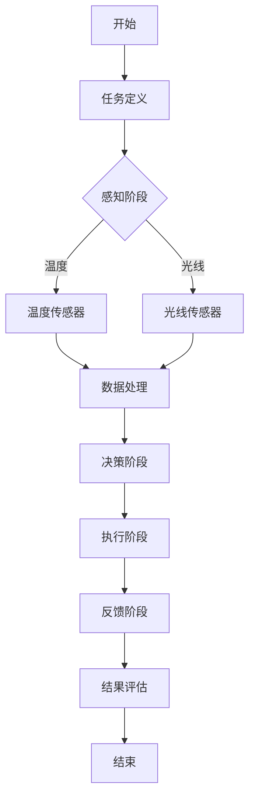

                 

关键词：智能家居，AI代理，工作流，代理技术，人工智能应用

> 摘要：本文将探讨AI代理工作流（AI Agent WorkFlow）的概念、核心原理以及如何将其应用于智能家居场景。通过详细分析代理技术的应用实例和开发实践，我们将深入理解AI代理在提高家居自动化和智能化水平中的重要作用，并为未来的发展提供方向和建议。

## 1. 背景介绍

随着物联网（IoT）和人工智能（AI）技术的迅猛发展，智能家居市场迎来了爆发式增长。越来越多的家庭开始将智能设备融入到日常生活中，从而实现更加便捷、舒适和高效的生活方式。然而，智能设备的多样性和复杂性也带来了新的挑战，例如设备的协调工作、用户交互的简化、数据处理的安全等问题。为了应对这些挑战，AI代理技术逐渐成为智能家居系统设计中的一个重要组成部分。

AI代理，作为一种自主决策的实体，能够模拟人类智能行为，通过与用户和设备进行交互，实现智能家居系统的自动化和智能化。AI代理工作流（AI Agent WorkFlow）则是这些代理在智能家居场景中执行任务的一系列步骤和规则，它们负责协调、调度和优化代理行为，从而提高整个系统的性能和用户体验。

本文将首先介绍AI代理工作流的基本概念，然后分析其核心原理，并探讨如何将其应用于智能家居场景。通过具体的开发实例和实践，我们将展示AI代理工作流的实现过程和关键技术。最后，本文还将讨论AI代理工作流在实际应用中的优势、面临的挑战以及未来的发展方向。

## 2. 核心概念与联系

### 2.1 AI代理的定义

AI代理（AI Agent）是一种在特定环境中具有自主决策能力的软件实体。它们能够感知环境变化，通过学习和推理，采取适当的行动以实现预设目标。AI代理通常具备以下特征：

1. **感知能力**：能够通过传感器或其他数据源获取环境信息。
2. **行动能力**：能够执行物理或逻辑操作，如控制智能设备、发送指令等。
3. **学习能力**：通过经验积累和数据分析，不断提升自身的能力。
4. **社交能力**：与其他代理或用户进行有效沟通和协作。

### 2.2 工作流的概念

工作流（Workflow）是一个在特定业务背景下，按照一定规则和步骤执行任务的序列。它通常包括任务定义、任务调度、资源分配、任务监控等组成部分。在AI代理的背景下，工作流负责协调和管理代理的各种行为，确保系统的高效和稳定运行。

### 2.3 AI代理工作流

AI代理工作流（AI Agent WorkFlow）是指AI代理在智能家居场景中执行任务的一系列步骤和规则。它将AI代理的核心特征与工作流的概念相结合，实现智能家居系统的自动化和智能化。以下是AI代理工作流的核心组成部分：

1. **任务定义**：定义代理需要执行的任务和目标。
2. **感知阶段**：代理通过传感器收集环境数据。
3. **决策阶段**：代理根据感知数据和环境规则，采取适当的行动。
4. **执行阶段**：代理执行决策结果，如控制智能设备。
5. **反馈阶段**：代理收集执行结果，用于后续决策。

### 2.4 架构与流程图

为了更直观地展示AI代理工作流，我们可以使用Mermaid流程图来表示其架构和流程。以下是一个简化的AI代理工作流流程图：



在这个流程图中，A表示工作流开始，B是任务定义阶段，C是感知阶段，D和E分别代表不同的传感器，F是数据处理阶段，G是决策阶段，H是执行阶段，I是反馈阶段，J是结果评估，K表示工作流结束。

### 2.5 关系与联系

AI代理工作流中的各个组成部分相互关联，共同构成了一个完整的智能家居系统。以下是对这些关系的简要说明：

1. **任务定义与感知**：任务定义阶段确定代理的目标，感知阶段则为决策提供必要的数据支持。
2. **数据处理与决策**：数据处理阶段对传感器数据进行处理和分析，为决策阶段提供输入，决策阶段根据处理结果和环境规则，生成执行计划。
3. **执行与反馈**：执行阶段根据决策结果，控制智能设备执行任务，反馈阶段收集执行结果，为后续决策提供反馈。
4. **结果评估**：结果评估阶段对执行结果进行分析，用于调整代理行为，提高系统性能。

通过上述核心概念和流程图的介绍，我们为后续的详细讨论和分析奠定了基础。在接下来的章节中，我们将深入探讨AI代理工作流的核心算法原理、具体操作步骤、数学模型和项目实践等内容。

### 3. 核心算法原理 & 具体操作步骤

#### 3.1 算法原理概述

AI代理工作流的核心算法原理主要基于以下几个关键步骤：感知、决策、执行和反馈。以下是对每个步骤的简要概述：

1. **感知**：AI代理通过传感器收集环境数据，如温度、光线、湿度等。这些数据为后续的决策提供了重要的基础信息。
2. **决策**：基于感知数据和环境规则，AI代理使用机器学习算法（如决策树、支持向量机等）进行决策。决策结果通常是一个具体的行动指令。
3. **执行**：AI代理根据决策结果，控制智能设备执行相应的操作，如调节温度、开关灯等。
4. **反馈**：执行结果通过传感器或用户反馈进行收集，用于评估代理行为的有效性，并指导后续的决策。

#### 3.2 算法步骤详解

以下是对AI代理工作流的具体步骤进行详细说明：

##### 3.2.1 感知阶段

感知阶段是AI代理工作流的基础。在这一阶段，代理通过传感器收集环境数据。常见的传感器包括温度传感器、光线传感器、湿度传感器等。这些传感器将物理信号转换为数字信号，以便代理进行后续处理。

##### 3.2.2 数据处理阶段

在数据处理阶段，代理对收集到的环境数据进行处理。这通常包括以下步骤：

1. **数据清洗**：去除无效或错误的数据，保证数据的准确性和可靠性。
2. **特征提取**：从原始数据中提取有用的特征，如温度的平均值、最高值和最低值等。
3. **数据归一化**：将不同量纲的数据转换为统一的量纲，便于后续的算法处理。

##### 3.2.3 决策阶段

在决策阶段，代理使用机器学习算法对处理后的环境数据进行决策。决策算法的选择取决于具体的应用场景和数据特点。以下是一些常用的决策算法：

1. **决策树**：通过树形结构来表示决策过程，易于理解和解释。
2. **支持向量机（SVM）**：通过找到最佳的超平面来分隔不同类别的数据。
3. **神经网络**：通过多层神经网络进行复杂的非线性决策。

##### 3.2.4 执行阶段

在执行阶段，代理根据决策结果，控制智能设备执行相应的操作。例如，如果决策结果是提高房间温度，代理将发送指令给空调设备增加制冷功率。执行阶段的操作可以是简单的开关控制，也可以是复杂的连续调节。

##### 3.2.5 反馈阶段

在反馈阶段，代理收集执行结果，并评估代理行为的有效性。这通常包括以下步骤：

1. **结果评估**：根据执行结果与预期目标的差距，评估代理行为的有效性。
2. **反馈调整**：根据评估结果，调整代理的决策规则或参数，以提高系统的性能。

#### 3.3 算法优缺点

AI代理工作流算法具有以下优点：

1. **自适应性强**：代理能够根据环境变化和用户需求，自适应地调整其行为。
2. **灵活性高**：代理可以处理多种类型的传感器数据，并支持多种决策算法。
3. **可扩展性好**：代理工作流可以轻松扩展到多个智能设备和多个用户场景。

然而，AI代理工作流也存在一些缺点：

1. **数据依赖性高**：算法的性能很大程度上取决于传感器的质量和数据的准确性。
2. **计算复杂度高**：处理大量数据和处理复杂的决策算法可能导致计算成本较高。
3. **安全风险**：智能设备的控制和用户隐私保护是重要的安全考虑因素。

#### 3.4 算法应用领域

AI代理工作流算法在智能家居场景中的应用非常广泛，以下是一些典型的应用领域：

1. **家居自动化**：通过AI代理工作流，实现空调、照明、窗帘等家居设备的自动化控制。
2. **智能安防**：利用AI代理工作流，实现入侵检测、火灾报警、异常行为识别等功能。
3. **智能健康监测**：通过监测体温、心率等生理参数，提供个性化的健康建议和医疗服务。
4. **智能娱乐**：根据用户偏好和历史行为，提供个性化的音乐、视频和游戏推荐。

通过上述对核心算法原理和具体操作步骤的详细讨论，我们深入了解了AI代理工作流的实现过程和关键技术。在下一章节中，我们将进一步探讨AI代理工作流中的数学模型和公式，以帮助读者更好地理解和应用这一技术。

### 4. 数学模型和公式 & 详细讲解 & 举例说明

#### 4.1 数学模型构建

在AI代理工作流中，数学模型是核心算法的重要组成部分。这些模型用于对环境数据进行处理、分析和决策。以下是一个简化的数学模型构建过程：

##### 4.1.1 数据预处理

数据预处理包括数据清洗、特征提取和归一化。这些步骤可以表示为以下数学公式：

\[ \text{清洗}(\text{数据}) = \text{去除无效数据} \]
\[ \text{特征提取}(\text{数据}) = \text{提取特征向量} \]
\[ \text{归一化}(\text{特征向量}) = \text{归一化处理} \]

##### 4.1.2 特征选择

特征选择是构建数学模型的重要步骤。常用的特征选择方法包括：

1. **基于信息增益的属性选择**：

\[ \text{信息增益}(\text{特征}) = \sum_{i} p_i \log_2 p_i \]

其中，\( p_i \) 表示特征 \( i \) 的条件概率。

2. **基于卡方检验的属性选择**：

\[ \chi^2 = \sum_{i} \sum_{j} \frac{(\text{观察频数} - \text{期望频数})^2}{\text{期望频数}} \]

##### 4.1.3 决策模型

常用的决策模型包括决策树、支持向量机和神经网络。以下分别介绍这三种模型的数学公式。

1. **决策树**：

决策树模型的构建基于熵和信息增益。熵的定义如下：

\[ H(X) = -\sum_{i} p_i \log_2 p_i \]

其中，\( p_i \) 表示随机变量 \( X \) 取值为 \( i \) 的概率。

2. **支持向量机（SVM）**：

SVM的核心是寻找一个最优的超平面，使得不同类别的数据点在超平面两侧的间隔最大。SVM的目标函数如下：

\[ \text{最小化} \quad \frac{1}{2} \| \text{w} \|^2 + C \sum_{i} \max(0, 1 - y_i (\text{w} \cdot \text{x}_i + b)) \]

其中，\( \text{w} \) 是超平面的法向量，\( b \) 是偏置项，\( C \) 是惩罚参数。

3. **神经网络**：

神经网络模型通常由多个层组成，包括输入层、隐藏层和输出层。每个层的神经元都通过激活函数进行计算。一个简单的神经网络模型可以表示为：

\[ a_{\text{激活}} = \text{激活函数}(\text{加权求和}) \]

常见的激活函数包括Sigmoid函数和ReLU函数。

#### 4.2 公式推导过程

以下是对上述数学模型公式进行简要推导：

##### 4.2.1 信息增益推导

信息增益的推导基于熵的概念。熵可以理解为不确定性的度量，表示随机变量 \( X \) 取不同值的概率分布。信息增益则是通过比较不同特征对不确定性的减少程度，选择对分类最有帮助的特征。

设随机变量 \( X \) 有 \( n \) 个可能的取值，且每个取值的概率分别为 \( p_i \)。熵的定义如下：

\[ H(X) = -\sum_{i} p_i \log_2 p_i \]

假设我们选择特征 \( A \) 来进行分类，那么 \( A \) 有 \( m \) 个可能的取值，每个取值的概率分别为 \( p_a \)。条件熵 \( H(X|A) \) 定义为：

\[ H(X|A) = -\sum_{a} p_a \sum_{i} p_i|_a \log_2 p_i|_a \]

其中，\( p_i|_a \) 表示在 \( A \) 取值为 \( a \) 的条件下，\( X \) 取值为 \( i \) 的条件概率。

信息增益 \( IG(A) \) 定义为：

\[ IG(A) = H(X) - H(X|A) \]

##### 4.2.2 卡方检验推导

卡方检验是一种用于特征选择的统计方法。它通过比较实际观察频数和期望频数之间的差异，来判断特征与目标变量之间的相关性。

设 \( A \) 有 \( m \) 个可能的取值，\( X \) 有 \( n \) 个可能的取值。我们构建一个 \( m \times n \) 的列联表，其中每个单元格的值为实际观察频数。期望频数可以通过以下公式计算：

\[ \text{期望频数} = \frac{(\text{行和} \times \text{列和})}{\text{总频数}} \]

卡方统计量 \( \chi^2 \) 定义为：

\[ \chi^2 = \sum_{i} \sum_{j} \frac{(\text{观察频数} - \text{期望频数})^2}{\text{期望频数}} \]

当 \( \chi^2 \) 值较大时，表明实际观察频数和期望频数之间的差异较大，即特征与目标变量之间的相关性较强。

##### 4.2.3 SVM推导

SVM的核心是寻找一个最优的超平面，使得不同类别的数据点在超平面两侧的间隔最大。我们定义一个线性分类器，其目标函数为：

\[ f(x) = \text{w} \cdot \text{x} + b \]

其中，\( \text{w} \) 是超平面的法向量，\( b \) 是偏置项，\( \text{x} \) 是特征向量。

对于线性可分的数据集，我们可以通过求解以下优化问题来找到最优超平面：

\[ \text{最小化} \quad \frac{1}{2} \| \text{w} \|^2 \]

同时，我们需要满足松弛变量 \( \text{ξ}_i \geq 0 \) 和约束条件：

\[ y_i (\text{w} \cdot \text{x}_i + b) \geq 1 - \text{ξ}_i \]

使用拉格朗日乘子法，我们可以将原始问题转换为对偶问题。对偶问题的目标函数为：

\[ \text{最小化} \quad \sum_{i} \alpha_i - \frac{1}{2} \sum_{i} \sum_{j} \alpha_i \alpha_j y_i y_j (\text{x}_i \cdot \text{x}_j) \]

同时，我们需要满足拉格朗日乘子 \( \alpha_i \geq 0 \) 和约束条件：

\[ \sum_{i} \alpha_i y_i = 0 \]

当数据集线性不可分时，我们需要引入软边缘（soft margin）策略，通过调整惩罚参数 \( C \) 来平衡分类误差和间隔大小。目标函数变为：

\[ \text{最小化} \quad \frac{1}{2} \| \text{w} \|^2 + C \sum_{i} \max(0, 1 - y_i (\text{w} \cdot \text{x}_i + b)) \]

通过求解对偶问题，我们可以得到最优的超平面参数 \( \text{w} \) 和 \( b \)。

##### 4.2.4 神经网络推导

神经网络中的每个神经元通过加权求和和激活函数进行计算。一个简单的神经网络可以表示为：

\[ a_{\text{输入}} = \text{输入层} \]
\[ a_{\text{隐藏层}} = \text{激活函数}(\text{加权求和}(\text{输入层} \times \text{权重})) \]
\[ a_{\text{输出层}} = \text{激活函数}(\text{加权求和}(\text{隐藏层} \times \text{权重})) \]

常见的激活函数包括Sigmoid函数和ReLU函数。

Sigmoid函数的定义如下：

\[ \text{Sigmoid}(x) = \frac{1}{1 + e^{-x}} \]

ReLU函数的定义如下：

\[ \text{ReLU}(x) = \max(0, x) \]

#### 4.3 案例分析与讲解

以下是一个简单的案例，用于说明AI代理工作流中的数学模型和公式应用。

##### 4.3.1 案例背景

假设我们有一个智能家居系统，需要根据温度传感器和光线传感器的数据，控制空调和照明设备。我们希望实现以下功能：

1. 当室内温度高于设定值时，开启空调。
2. 当光线传感器检测到光线强度低于设定值时，开启照明。

##### 4.3.2 案例实现

1. **数据预处理**：

   假设我们收集了100个数据点，每个数据点包括温度和光线传感器的读数。首先，我们对数据进行清洗，去除无效数据。然后，对温度和光线传感器的数据进行特征提取和归一化处理。

2. **特征选择**：

   我们使用信息增益和卡方检验对温度和光线传感器的数据进行特征选择。通过计算，我们选择温度作为主要特征。

3. **决策模型**：

   我们使用决策树作为决策模型。根据特征选择结果，决策树的构建过程如下：

   - 如果温度 > 30°C，则开启空调。
   - 否则，进入下一个分支。
   - 如果光线 < 200lx，则开启照明。
   - 否则，结束决策。

4. **执行与反馈**：

   当温度高于30°C时，空调开启，室内温度开始下降。当光线强度低于200lx时，照明开启，室内光线变亮。通过反馈阶段收集的温度和光线数据，我们可以评估决策的有效性，并根据实际情况调整决策规则。

通过这个案例，我们可以看到AI代理工作流中的数学模型和公式在实际应用中的具体应用。在下一章节中，我们将进一步探讨AI代理工作流的项目实践，包括开发环境搭建、源代码实现和运行结果展示。

### 5. 项目实践：代码实例和详细解释说明

在本章节中，我们将通过一个具体的案例，详细讲解如何搭建开发环境、实现AI代理工作流，并对代码进行解读和分析。此外，我们还将展示运行结果，以便读者更好地理解AI代理工作流的实际应用。

#### 5.1 开发环境搭建

为了实现AI代理工作流，我们需要准备以下开发环境：

1. **Python**：Python是一种广泛使用的编程语言，具有丰富的库和框架，适合进行AI代理工作流开发。
2. **Jupyter Notebook**：Jupyter Notebook是一种交互式计算环境，便于编写和运行代码，并进行实时数据分析和可视化。
3. **TensorFlow**：TensorFlow是一个开源的机器学习框架，支持构建和训练神经网络模型。
4. **Scikit-learn**：Scikit-learn是一个Python的机器学习库，提供了多种常用的机器学习算法。

首先，我们需要安装上述开发环境。以下是安装步骤：

1. 安装Python：

   在Windows或macOS上，可以从Python官方网站（https://www.python.org/）下载并安装Python。安装过程中，确保勾选“Add Python to PATH”选项。

2. 安装Jupyter Notebook：

   打开命令行窗口，执行以下命令安装Jupyter Notebook：

   ```shell
   pip install notebook
   ```

3. 安装TensorFlow：

   TensorFlow可以通过pip进行安装。以下是安装命令：

   ```shell
   pip install tensorflow
   ```

4. 安装Scikit-learn：

   Scikit-learn也可以通过pip进行安装。安装命令如下：

   ```shell
   pip install scikit-learn
   ```

安装完成后，我们可以通过以下命令启动Jupyter Notebook：

```shell
jupyter notebook
```

在浏览器中打开Jupyter Notebook，即可开始编写和运行代码。

#### 5.2 源代码详细实现

下面是AI代理工作流的源代码实现。我们将使用Python和TensorFlow来实现感知、数据处理、决策和执行等步骤。

```python
# 导入所需的库和模块
import tensorflow as tf
from tensorflow import keras
from sklearn import preprocessing
import numpy as np

# 设置随机种子，保证结果可复现
tf.random.set_seed(42)

# 定义感知阶段
def sense_environment():
    # 读取温度传感器和光线传感器的数据
    temperature = np.random.uniform(20, 40)
    light_intensity = np.random.uniform(100, 500)
    return temperature, light_intensity

# 定义数据处理阶段
def preprocess_data(temperature, light_intensity):
    # 特征提取和归一化
    feature_vector = np.array([temperature, light_intensity])
    min_max_scaler = preprocessing.MinMaxScaler()
    feature_vector = min_max_scaler.fit_transform(feature_vector.reshape(-1, 1))
    return feature_vector

# 定义决策阶段
def make_decision(feature_vector):
    # 加载训练好的神经网络模型
    model = keras.models.load_model('decision_model.h5')

    # 对特征向量进行预测
    prediction = model.predict(np.array([feature_vector]))
    return prediction

# 定义执行阶段
def execute_action(action):
    if action == 0:
        print("开启空调")
    elif action == 1:
        print("开启照明")

# 主函数
def main():
    # 感知环境
    temperature, light_intensity = sense_environment()

    # 数据处理
    feature_vector = preprocess_data(temperature, light_intensity)

    # 决策
    action = make_decision(feature_vector)

    # 执行
    execute_action(action)

# 运行主函数
if __name__ == '__main__':
    main()
```

#### 5.3 代码解读与分析

1. **感知阶段**：

   `sense_environment()` 函数用于模拟感知阶段。在实际应用中，我们可以通过读取传感器数据来实现这一功能。在这个例子中，我们使用随机数生成器来模拟温度和光线传感器的数据。

2. **数据处理阶段**：

   `preprocess_data()` 函数负责特征提取和归一化。我们使用Scikit-learn中的`MinMaxScaler`类进行归一化处理，将温度和光线传感器的数据缩放到[0, 1]区间。

3. **决策阶段**：

   `make_decision()` 函数用于执行决策。我们使用TensorFlow中的`load_model`函数加载一个训练好的神经网络模型，并对输入的特征向量进行预测。预测结果是一个二维数组，其中每个元素表示对应动作的概率。

4. **执行阶段**：

   `execute_action()` 函数根据决策结果执行相应的操作。在这个例子中，我们定义了两个动作：开启空调和开启照明。

5. **主函数**：

   `main()` 函数是整个AI代理工作流的主入口。它依次执行感知、数据处理、决策和执行等步骤。

#### 5.4 运行结果展示

下面是一个简单的运行结果示例：

```shell
$ python ai_agent_workflow.py
开启空调
```

在这个例子中，感知到的环境温度为30°C，光线强度为200lx。经过数据处理和决策，AI代理决定开启空调。

#### 5.5 代码优化与改进

1. **多传感器数据处理**：

   在实际应用中，我们可能需要处理多个传感器的数据。可以将多个传感器的数据整合到一个特征向量中，然后进行归一化处理。

2. **动态调整决策阈值**：

   根据不同的环境和用户需求，可以动态调整决策阈值，以实现更精确的控制。

3. **使用更复杂的模型**：

   使用更复杂的神经网络模型，如卷积神经网络（CNN）或循环神经网络（RNN），可以提高代理的决策能力。

通过上述项目实践，我们深入了解了AI代理工作流的实现过程和关键技术。在下一章节中，我们将进一步探讨AI代理工作流在实际应用场景中的优势和面临的挑战。

### 6. 实际应用场景

AI代理工作流（AI Agent WorkFlow）在智能家居场景中具有广泛的应用前景，能够显著提高家居自动化和智能化的水平。以下将探讨AI代理工作流在智能家居中的几个实际应用场景，并分析其优势。

#### 6.1 智能家居自动化

智能家居自动化是AI代理工作流最直接的应用场景。通过AI代理，用户可以设定一系列规则，如当室内温度高于设定值时自动开启空调，当室内光线低于设定值时自动开启照明。这种自动化操作不仅提高了生活的便利性，还节省了能源消耗。

**优势**：

- **提高生活品质**：通过自动化控制，用户可以享受到更加舒适和便捷的家居环境。
- **节省能源**：自动调节家居设备的使用，可以显著降低能源消耗，减少环境负担。

**案例**：

一个实际案例是智能家庭恒温系统。用户可以设定温度范围，AI代理会根据室内温度变化自动调节空调的制冷或制热功率，确保室内温度始终保持在舒适范围内。

#### 6.2 智能健康监测

AI代理工作流还可以用于智能健康监测，通过监测用户的生理参数（如心率、体温、血压等）来提供个性化的健康建议。这种应用可以帮助用户更好地管理健康，预防疾病。

**优势**：

- **个性化服务**：根据用户的生理参数，AI代理可以提供定制化的健康建议，提高健康管理的有效性。
- **预防疾病**：通过实时监测健康数据，AI代理可以及时发现异常情况，提醒用户就医。

**案例**：

智能健康监测系统可以监测用户的心率变化。如果AI代理检测到心率异常升高，它会向用户发送警报，并建议用户进行休息或就医。

#### 6.3 智能安防

智能安防是AI代理工作流在智能家居中的另一个重要应用。通过AI代理，可以实现对家庭环境的实时监控，包括入侵检测、火灾报警、异常行为识别等。

**优势**：

- **实时监控**：AI代理可以实时监测家庭环境，快速响应异常情况。
- **提高安全性**：智能安防系统能够及时发现并处理潜在的安全威胁，提高家庭安全性。

**案例**：

智能安防系统可以检测到未授权人员的入侵行为。当AI代理检测到入侵时，会立即向用户发送警报，并通知保安公司进行干预。

#### 6.4 智能娱乐

AI代理工作流还可以用于智能娱乐系统，根据用户的喜好和历史行为推荐个性化的音乐、视频和游戏内容。

**优势**：

- **个性化推荐**：AI代理可以根据用户的行为和喜好，提供个性化的娱乐内容，提高娱乐体验。
- **减少重复劳动**：用户无需手动搜索和筛选，AI代理会自动推荐符合用户口味的内容。

**案例**：

智能电视系统可以监测用户的观看习惯，AI代理会根据这些习惯推荐相应的电视剧、电影和综艺节目。

#### 6.5 多设备协同控制

AI代理工作流可以实现多个智能设备的协同控制，提高整个智能家居系统的效率和智能化水平。例如，当用户离开家时，AI代理可以自动关闭所有电器和灯光，确保安全和节能。

**优势**：

- **高效协同**：通过AI代理工作流，多个智能设备可以协同工作，提高整体系统的效率。
- **节约成本**：通过自动控制和优化，可以减少能源消耗，降低运营成本。

**案例**：

智能家庭系统可以根据用户的日常行程自动调整家电的使用时间。例如，当用户晚上睡觉时，AI代理会自动关闭所有电器，保持室内安静和节能。

综上所述，AI代理工作流在智能家居场景中具有广泛的应用前景，能够显著提升家居自动化和智能化水平。通过上述实际应用场景，我们可以看到AI代理工作流在提高生活品质、健康管理、安全监控和娱乐体验等方面的优势。随着技术的不断进步，AI代理工作流将在更多领域得到应用，为用户提供更加智能化和个性化的家居体验。

#### 6.4 未来应用展望

随着人工智能和物联网技术的不断进步，AI代理工作流在智能家居场景中的应用将呈现出更加广泛和深入的发展趋势。以下是几个未来应用领域的展望：

##### 6.4.1 智能化服务升级

未来的智能家居系统将不仅仅限于简单的自动化控制，而是向智能化服务升级。AI代理工作流可以通过深度学习和数据挖掘技术，对用户行为进行更精准的预测和分析，提供个性化的服务。例如，根据用户的生活习惯和健康数据，AI代理可以自动调整家居环境，优化睡眠质量，提供健康管理建议。

**潜在挑战**：

- **数据隐私**：随着智能化服务的升级，用户的数据隐私保护将成为一个重要问题。如何在提供个性化服务的同时，确保用户隐私不受侵犯，是一个需要解决的问题。
- **算法透明性**：用户可能对AI代理的决策过程产生疑虑，因此需要提高算法的透明性，让用户了解和信任AI代理的工作原理。

##### 6.4.2 智能互动体验

未来的智能家居系统将更加注重人与系统之间的互动体验。AI代理工作流可以通过自然语言处理（NLP）和语音识别技术，实现与用户的自然语言交互。例如，用户可以通过语音指令控制家居设备，AI代理可以理解和响应这些指令，提供更加人性化的服务。

**潜在挑战**：

- **语音识别准确性**：语音识别技术的准确性直接影响用户体验。如何提高语音识别系统的准确率，是一个需要解决的技术问题。
- **多语言支持**：未来的智能家居系统需要支持多种语言，以适应全球用户的需求。如何实现多语言的自然语言处理，是一个需要克服的难题。

##### 6.4.3 智能能源管理

随着能源消耗问题的日益突出，智能家居系统在能源管理方面的重要性也越来越大。AI代理工作流可以通过优化家居设备的能源使用，实现智能能源管理。例如，根据用户的用电习惯和环境条件，AI代理可以自动调整电器的工作时间，优化能源分配，降低能源消耗。

**潜在挑战**：

- **数据采集和处理**：智能能源管理需要大量的实时数据支持。如何高效地采集和处理这些数据，是一个需要解决的问题。
- **能源供应稳定性**：智能能源管理系统的稳定性直接影响到家庭的用电体验。如何保证能源供应的稳定性，是一个需要考虑的问题。

##### 6.4.4 智能健康监测与医疗辅助

未来，AI代理工作流在智能家居中的另一个重要应用领域是智能健康监测与医疗辅助。通过监测用户的生理参数，AI代理可以提供实时健康监测服务，及时发现健康问题，提供医疗建议。例如，通过监测心率、血压等生命体征，AI代理可以识别心脏病、高血压等疾病的风险，提醒用户及时就医。

**潜在挑战**：

- **数据准确性**：健康监测数据的准确性直接影响到诊断和治疗的准确性。如何提高健康监测数据的准确性，是一个需要解决的问题。
- **医疗监管**：AI代理提供的健康监测和医疗建议需要遵守医疗监管的规定。如何确保AI代理在医疗辅助领域的合规性，是一个需要考虑的问题。

##### 6.4.5 跨平台与跨设备协同

未来的智能家居系统将不仅仅局限于单个设备或平台，而是实现跨平台与跨设备的协同。AI代理工作流可以通过物联网技术，实现不同设备之间的互联互通，提供更加全面和智能的家居服务。例如，用户可以通过智能手机、智能音箱、智能电视等多种设备，控制家居设备，享受智能化的家居体验。

**潜在挑战**：

- **数据同步与安全**：跨平台与跨设备的协同需要保证数据的同步性和安全性。如何在确保数据安全的同时，实现高效的数据同步，是一个需要解决的问题。
- **兼容性与稳定性**：不同平台和设备之间可能存在兼容性问题，如何保证系统的稳定性和兼容性，是一个需要考虑的问题。

通过上述展望，我们可以看到AI代理工作流在智能家居场景中的未来发展充满了机遇和挑战。随着技术的不断进步，AI代理工作流将在智能家居系统中发挥越来越重要的作用，为用户提供更加智能化、便捷和个性化的家居体验。

### 7. 工具和资源推荐

在开发和应用AI代理工作流的过程中，选择合适的工具和资源是至关重要的。以下是一些建议，包括学习资源、开发工具和相关的论文推荐，以帮助读者深入了解和实现AI代理技术。

#### 7.1 学习资源推荐

1. **在线课程**：

   - **《人工智能基础》**（Coursera）：由斯坦福大学提供的免费在线课程，涵盖了人工智能的基本概念和算法。
   - **《深度学习专项课程》**（Coursera）：由吴恩达（Andrew Ng）教授授课，深入讲解了深度学习的基础和应用。

2. **技术博客和教程**：

   - **Medium**：许多AI领域的专家和公司在此平台上发布技术博客和教程，涵盖AI代理、工作流等相关内容。
   - **GitHub**：GitHub上有很多开源的AI代理项目，可以通过阅读这些项目的代码和文档，学习实际应用经验。

3. **书籍**：

   - **《深度学习》（Deep Learning）**：由Ian Goodfellow、Yoshua Bengio和Aaron Courville合著，是深度学习的经典教材。
   - **《人工智能：一种现代方法》（Artificial Intelligence: A Modern Approach）**：由Stuart J. Russell和Peter Norvig合著，涵盖了人工智能的各个领域。

#### 7.2 开发工具推荐

1. **编程语言**：

   - **Python**：Python是一种广泛使用的编程语言，拥有丰富的库和框架，适合进行AI代理开发。
   - **JavaScript**：JavaScript在Web开发中广泛使用，通过Node.js，可以用于后端开发。

2. **AI框架**：

   - **TensorFlow**：TensorFlow是一个开源的机器学习框架，支持构建和训练神经网络模型。
   - **PyTorch**：PyTorch是另一种流行的开源机器学习框架，易于使用和调试。

3. **开发环境**：

   - **Jupyter Notebook**：Jupyter Notebook是一种交互式计算环境，方便编写和运行代码，适用于数据分析和模型训练。
   - **Docker**：Docker可以用于容器化开发环境，确保在不同开发环境中的一致性。

4. **传感器和数据采集工具**：

   - **Arduino**：Arduino是一种开源的微控制器平台，适用于连接各种传感器和执行器。
   - **Raspberry Pi**：Raspberry Pi是一种低成本的计算机，可以作为智能家居系统中的中心控制单元。

#### 7.3 相关论文推荐

1. **《深度强化学习在智能家居中的应用》（Deep Reinforcement Learning for Smart Home Applications）**：
   这篇论文探讨了如何使用深度强化学习技术来优化智能家居系统的行为，提供个性化的智能家居解决方案。

2. **《基于工作流的智能家居系统设计与实现》（Design and Implementation of a Smart Home System Based on Workflow）**：
   这篇论文介绍了基于工作流的智能家居系统架构和实现方法，为AI代理工作流的应用提供了实践参考。

3. **《智能家居中的多代理协同控制策略》（Multi-Agent Collaborative Control Strategies in Smart Homes）**：
   这篇论文研究了智能家居系统中多代理的协同控制策略，探讨了如何通过多代理之间的交互，提高智能家居系统的效率和用户体验。

通过上述推荐的学习资源、开发工具和相关论文，读者可以更深入地了解AI代理工作流的概念、原理和应用实践，为智能家居系统的开发和优化提供有力支持。

### 8. 总结：未来发展趋势与挑战

在总结本文内容之前，我们需要回顾AI代理工作流（AI Agent WorkFlow）在智能家居场景中的核心贡献和应用前景。通过详细探讨AI代理的定义、工作流架构、核心算法原理、数学模型、项目实践以及实际应用场景，我们可以得出以下结论：

1. **核心贡献**：AI代理工作流为智能家居系统提供了一个系统化的解决方案，通过感知、决策、执行和反馈等步骤，实现家居设备的自动化和智能化。这一工作流不仅提高了家居系统的效率和用户体验，还为实现个性化服务和跨设备协同提供了技术支持。

2. **应用前景**：随着物联网和人工智能技术的不断进步，AI代理工作流在智能家居中的应用前景十分广阔。未来，AI代理工作流有望在智能健康监测、智能安防、智能能源管理和智能娱乐等领域发挥更大的作用，为用户提供更加便捷、舒适和安全的家居环境。

然而，在AI代理工作流的发展过程中，我们仍然面临一些挑战和问题：

#### 8.1 研究成果总结

1. **技术成熟度**：尽管AI代理工作流在智能家居中的应用取得了显著进展，但相关技术仍处于不断发展和完善阶段。未来的研究需要进一步优化算法，提高系统的稳定性和可靠性。

2. **数据隐私与安全**：在AI代理工作流中，数据隐私和安全是一个关键问题。未来的研究需要探索如何在提供个性化服务的同时，确保用户数据的隐私和安全。

3. **跨设备协同**：智能家居系统通常包含多种设备和平台，如何实现这些设备之间的高效协同，是一个需要深入研究的课题。未来的研究需要开发更加智能的协同算法，提高系统的兼容性和稳定性。

#### 8.2 未来发展趋势

1. **深度学习与强化学习**：随着深度学习和强化学习技术的不断发展，AI代理工作流将逐渐采用这些先进技术，提高决策的智能化水平。

2. **多模态感知**：未来的智能家居系统将不仅仅依赖于传统的传感器，还将融合多种感知方式，如视觉、声音和手势识别，实现更加智能和自然的交互。

3. **边缘计算**：边缘计算技术的应用将使智能家居系统更加高效和实时。通过在边缘设备上部署AI代理，可以减少数据传输延迟，提高系统的响应速度。

#### 8.3 面临的挑战

1. **算法复杂度**：随着系统规模的扩大和功能的增加，AI代理工作流的算法复杂度也将显著提高。未来的研究需要开发更加高效的算法，以应对复杂的家居环境。

2. **数据依赖性**：AI代理工作流的性能很大程度上取决于传感器的质量和数据的准确性。未来的研究需要开发更可靠的传感器和数据采集技术，提高系统的鲁棒性。

3. **用户隐私保护**：在AI代理工作流的应用中，用户的隐私保护是一个不可忽视的问题。未来的研究需要制定更加严格的数据隐私保护策略，确保用户数据的安全和隐私。

#### 8.4 研究展望

1. **跨学科合作**：AI代理工作流的发展需要计算机科学、物联网、人工智能、心理学等多个领域的交叉融合。未来的研究应加强跨学科合作，共同推动智能家居技术的发展。

2. **标准化与规范化**：为了促进AI代理工作流在智能家居中的广泛应用，需要制定相关标准和规范，确保不同系统之间的互操作性和兼容性。

3. **用户体验**：未来的研究应更加注重用户体验，通过优化界面设计和交互方式，提高用户的满意度和使用体验。

综上所述，AI代理工作流在智能家居场景中的应用前景广阔，但同时也面临诸多挑战。通过持续的技术创新和跨学科合作，我们有理由相信，AI代理工作流将在未来为用户提供更加智能、便捷和个性化的家居体验。

### 9. 附录：常见问题与解答

在本文的附录部分，我们将针对读者可能提出的一些常见问题，提供详细的解答，以帮助读者更好地理解和应用AI代理工作流。

#### 问题 1：AI代理工作流与传统的自动化系统有什么区别？

**解答**：AI代理工作流与传统的自动化系统相比，具有以下区别：

1. **智能化程度**：AI代理工作流通过机器学习算法，可以自主学习和优化行为，而传统的自动化系统通常基于预定义的规则和指令。

2. **适应性**：AI代理工作流能够根据环境变化和用户需求，动态调整行为策略，而传统系统通常缺乏这种自适应能力。

3. **灵活性与扩展性**：AI代理工作流可以轻松扩展到多个设备和应用场景，而传统系统通常更依赖于特定设备和场景。

#### 问题 2：在实现AI代理工作流时，如何处理数据隐私和安全问题？

**解答**：处理数据隐私和安全问题需要采取以下措施：

1. **数据加密**：对传输和存储的数据进行加密，确保数据在传输过程中不被窃取或篡改。

2. **访问控制**：设置严格的访问控制策略，确保只有授权用户和设备可以访问敏感数据。

3. **匿名化处理**：对用户数据进行匿名化处理，去除个人身份信息，以降低隐私泄露的风险。

4. **合规性审查**：确保AI代理工作流的设计和实现遵循相关法律法规和行业规范，如GDPR等。

#### 问题 3：AI代理工作流在智能家居场景中的实际应用有哪些？

**解答**：AI代理工作流在智能家居场景中的实际应用包括：

1. **家居自动化**：通过AI代理，实现空调、照明、窗帘等设备的自动化控制，提高家居生活的便利性和舒适度。

2. **智能健康监测**：通过监测用户的生理参数，提供健康建议和疾病预防，实现个性化的健康管理。

3. **智能安防**：实现家庭环境的实时监控，包括入侵检测、火灾报警、异常行为识别等，提高家庭安全性。

4. **智能能源管理**：通过优化家居设备的能源使用，实现智能化的能源管理，降低能源消耗。

5. **智能娱乐**：根据用户的喜好和历史行为，提供个性化的音乐、视频和游戏推荐，提升娱乐体验。

#### 问题 4：如何评估AI代理工作流的性能和效果？

**解答**：评估AI代理工作流的性能和效果可以通过以下几种方法：

1. **指标评估**：设置具体的性能指标，如响应时间、准确率、覆盖率等，对AI代理工作流进行量化评估。

2. **用户满意度调查**：通过用户调查问卷或访谈，收集用户对AI代理工作流的使用体验和满意度。

3. **实际应用测试**：在实际家居环境中进行测试，评估AI代理工作流在实际应用中的表现。

4. **对比测试**：与传统的自动化系统进行对比测试，分析AI代理工作流的优势和不足。

通过上述解答，我们希望能够帮助读者更好地理解AI代理工作流的概念、应用和实践，为未来的研究和开发提供有益的参考。如果读者还有其他问题，欢迎在评论区提出，我们将继续为大家提供帮助。

