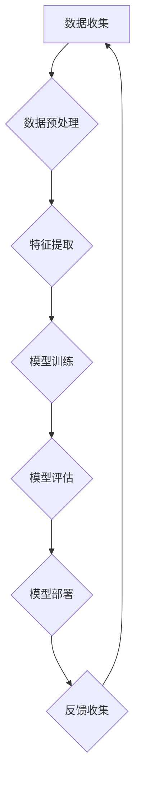

                 

关键词：AI代理、工作流、机器学习、优化、算法原理、实践案例

## 摘要

本文旨在深入探讨AI代理工作流在机器学习领域的应用与优化技巧。通过对AI代理工作流的概念、核心原理和具体操作步骤的详细分析，结合数学模型和实际项目案例，我们将揭示如何提高代理工作流的效率和效果。文章将总结当前研究进展，展望未来发展趋势和面临的挑战，为相关领域的研究者和开发者提供有价值的参考。

## 1. 背景介绍

在当今信息化和智能化迅猛发展的时代，机器学习作为人工智能的核心技术之一，正在深刻改变各行各业。然而，随着数据量的急剧增加和复杂度的提升，传统的机器学习模型和算法难以应对日益复杂的业务场景。为了提高机器学习系统的性能和效率，研究人员提出了AI代理工作流的概念。AI代理工作流旨在通过智能代理来优化机器学习流程中的各个环节，从而实现系统整体性能的提升。

### 1.1 AI代理的定义与作用

AI代理（AI Agent）是指能够自主完成特定任务的智能实体，它通过感知环境、制定计划、执行动作，并不断学习和优化自身的表现。在机器学习领域，AI代理通常用于数据处理、特征提取、模型训练和评估等环节。AI代理的作用在于，通过智能化的决策和行动，提高机器学习过程的自动化水平和效率。

### 1.2 工作流的概念与重要性

工作流（Workflow）是指完成一项任务所需的一系列有序操作步骤。在机器学习中，工作流涵盖了从数据收集、数据预处理、模型训练到模型评估和部署的整个过程。一个高效的工作流能够确保机器学习过程的高效、稳定和可重复性，从而提高模型性能和业务价值。

### 1.3 AI代理工作流在机器学习中的应用

AI代理工作流在机器学习中的应用主要包括以下几个方面：

1. **自动化数据处理**：AI代理可以自动处理大规模数据，包括数据清洗、转换和集成等操作，从而减少人工干预和错误率。
2. **智能特征提取**：AI代理能够根据业务需求自动选择和提取最有用的特征，提高模型的泛化能力和性能。
3. **自适应模型训练**：AI代理可以根据训练过程中的反馈自动调整模型参数，优化训练过程，加快收敛速度。
4. **自动化模型评估**：AI代理可以自动评估模型性能，根据评估结果进行模型优化或重新训练。
5. **自适应模型部署**：AI代理可以根据业务需求和环境自动调整模型的部署策略，确保模型的高效运行。

## 2. 核心概念与联系

### 2.1 AI代理工作流的概念

AI代理工作流是指利用AI代理技术来实现机器学习过程的一系列操作步骤。它包括数据预处理、特征提取、模型训练、模型评估和模型部署等环节。每个环节都可以由AI代理自动完成，从而提高整个工作流的效率和效果。

### 2.2 AI代理工作流的架构

AI代理工作流的架构可以分为三个主要层次：感知层、决策层和行动层。感知层负责收集环境信息，决策层基于感知层的信息进行决策，行动层则根据决策结果执行具体的操作。

- **感知层**：AI代理通过传感器和数据接口收集环境信息，包括数据集、模型参数、性能指标等。
- **决策层**：AI代理根据感知层的信息，利用机器学习算法和优化策略进行决策，包括特征选择、模型选择、参数调整等。
- **行动层**：AI代理根据决策结果执行具体的操作，如数据预处理、模型训练、模型评估等。

### 2.3 Mermaid流程图

以下是一个简单的Mermaid流程图，展示了AI代理工作流的核心环节和流程：



### 2.4 AI代理工作流的优化技巧

为了提高AI代理工作流的效率和效果，可以采用以下几种优化技巧：

1. **自动化流程**：通过自动化工具和脚本，实现数据预处理、特征提取、模型训练等环节的自动化，减少人工干预。
2. **并行处理**：利用并行计算技术和分布式计算框架，实现数据的并行处理和模型训练的并行化，提高处理速度。
3. **自适应调整**：根据训练过程中的反馈，自适应调整模型参数和训练策略，加快收敛速度。
4. **模型压缩**：通过模型压缩技术，减小模型的大小，提高模型部署的效率。
5. **模型评估**：采用多样化的评估指标和评估方法，全面评估模型性能，确保模型的高效运行。

## 3. 核心算法原理 & 具体操作步骤

### 3.1 算法原理概述

AI代理工作流的核心算法包括数据预处理算法、特征提取算法、模型训练算法和模型评估算法。这些算法通过智能化的决策和操作，实现机器学习过程的高效和自动化。

### 3.2 算法步骤详解

1. **数据预处理**：
   - 数据清洗：去除无效数据、填补缺失值、去除重复记录等。
   - 数据转换：将数据转换为适合模型训练的格式，如归一化、标准化等。
   - 数据集成：将多个数据源的数据进行整合，形成一个统一的数据集。

2. **特征提取**：
   - 特征选择：根据业务需求和模型性能，选择最有用的特征。
   - 特征提取：利用机器学习算法，从原始数据中提取新的特征。

3. **模型训练**：
   - 模型选择：根据业务需求和数据特点，选择合适的模型。
   - 参数调整：利用优化算法，调整模型参数，优化模型性能。
   - 模型训练：利用训练数据，训练模型。

4. **模型评估**：
   - 评估指标：根据业务需求和模型特性，选择合适的评估指标。
   - 评估方法：利用测试数据，评估模型性能。
   - 模型优化：根据评估结果，调整模型参数或重新训练模型。

5. **模型部署**：
   - 部署策略：根据业务需求和环境，选择合适的部署策略。
   - 模型部署：将训练好的模型部署到生产环境中，进行实际应用。

### 3.3 算法优缺点

1. **数据预处理**：
   - 优点：去除无效数据、填补缺失值等操作，提高数据质量和模型性能。
   - 缺点：数据预处理过程复杂，需要大量的人工干预。

2. **特征提取**：
   - 优点：提取新的特征，提高模型性能。
   - 缺点：特征提取过程复杂，需要大量的计算资源。

3. **模型训练**：
   - 优点：自动选择模型、调整参数，提高模型性能。
   - 缺点：训练过程耗时较长，需要大量的计算资源。

4. **模型评估**：
   - 优点：全面评估模型性能，确保模型的高效运行。
   - 缺点：评估过程复杂，需要大量的测试数据。

5. **模型部署**：
   - 优点：实现模型自动化部署，提高部署效率。
   - 缺点：需要考虑环境兼容性、安全性等问题。

### 3.4 算法应用领域

AI代理工作流在多个领域具有广泛的应用前景，包括但不限于：

1. **金融领域**：利用AI代理工作流进行风险评估、信用评分、股票交易等。
2. **医疗领域**：利用AI代理工作流进行疾病诊断、药物研发、健康管理等。
3. **智能制造**：利用AI代理工作流进行设备监控、故障预测、生产优化等。
4. **智能交通**：利用AI代理工作流进行交通流量预测、路径规划、安全监测等。

## 4. 数学模型和公式 & 详细讲解 & 举例说明

### 4.1 数学模型构建

AI代理工作流中的数学模型主要包括数据预处理模型、特征提取模型、模型训练模型和模型评估模型。以下是一个简单的数学模型构建过程：

1. **数据预处理模型**：

   $$X_{preprocess} = f_{preprocess}(X)$$

   其中，$X$ 表示原始数据，$X_{preprocess}$ 表示预处理后的数据，$f_{preprocess}$ 表示预处理函数，包括数据清洗、数据转换和数据集成等操作。

2. **特征提取模型**：

   $$Y_{extract} = f_{extract}(X_{preprocess})$$

   其中，$X_{preprocess}$ 表示预处理后的数据，$Y_{extract}$ 表示提取后的特征，$f_{extract}$ 表示特征提取函数，包括特征选择和特征提取等操作。

3. **模型训练模型**：

   $$\theta = f_{train}(X_{preprocess}, Y_{extract})$$

   其中，$\theta$ 表示模型参数，$X_{preprocess}$ 表示预处理后的数据，$Y_{extract}$ 表示提取后的特征，$f_{train}$ 表示模型训练函数，包括模型选择、参数调整和模型训练等操作。

4. **模型评估模型**：

   $$\hat{Y} = f_{evaluate}(\theta, X_{preprocess}, Y_{extract})$$

   其中，$\hat{Y}$ 表示评估结果，$\theta$ 表示模型参数，$X_{preprocess}$ 表示预处理后的数据，$Y_{extract}$ 表示提取后的特征，$f_{evaluate}$ 表示模型评估函数，包括评估指标计算和模型优化等操作。

### 4.2 公式推导过程

1. **数据预处理模型**：

   数据预处理模型的推导过程主要包括数据清洗、数据转换和数据集成等步骤。以下是一个简单的推导过程：

   - 数据清洗：

     $$X_{clean} = \{x_{i} | x_{i} \in X, x_{i} \text{ 无效} \}$$

     其中，$X_{clean}$ 表示清洗后的数据集，$X$ 表示原始数据集，$x_{i}$ 表示数据集中的每个数据。

   - 数据转换：

     $$X_{convert} = \{x_{i} | x_{i} \in X_{clean}, x_{i} \text{ 归一化或标准化} \}$$

     其中，$X_{convert}$ 表示转换后的数据集，$X_{clean}$ 表示清洗后的数据集，$x_{i}$ 表示数据集中的每个数据。

   - 数据集成：

     $$X_{integrate} = \{x_{i} | x_{i} \in X_{convert}, x_{i} \text{ 去除重复记录或合并多个数据源} \}$$

     其中，$X_{integrate}$ 表示集成后的数据集，$X_{convert}$ 表示转换后的数据集，$x_{i}$ 表示数据集中的每个数据。

2. **特征提取模型**：

   特征提取模型的推导过程主要包括特征选择和特征提取等步骤。以下是一个简单的推导过程：

   - 特征选择：

     $$Y_{select} = \{y_{i} | y_{i} \in X_{integrate}, y_{i} \text{ 对模型影响较大} \}$$

     其中，$Y_{select}$ 表示选

### 4.3 案例分析与讲解

为了更好地理解AI代理工作流中的数学模型和公式，以下我们将通过一个实际案例进行详细分析和讲解。

### 案例背景

假设我们有一个金融风控项目，旨在利用机器学习模型对贷款申请者的信用风险进行评估。该项目的目标是通过分析贷款申请者的个人资料、财务状况和历史信用记录，预测其未来可能出现的违约风险。

### 数据预处理

原始数据包括以下特征：

- 申请者的年龄
- 申请者的收入
- 申请者的信用评分
- 申请者的职业
- 申请者的婚姻状况
- 申请者的教育程度
- 申请者的贷款金额
- 申请者的贷款期限

首先，我们需要对数据进行预处理，包括以下步骤：

1. 数据清洗：去除无效数据、填补缺失值、去除重复记录等。
2. 数据转换：将数据转换为适合模型训练的格式，如将年龄、收入等数值型特征进行归一化处理。
3. 数据集成：将多个数据源的数据进行整合，形成一个统一的数据集。

假设我们已经完成了数据预处理，得到了一个包含5000个样本的数据集。

### 特征提取

接下来，我们需要对预处理后的数据进行特征提取。特征提取的主要目的是从原始数据中提取出对模型影响较大的特征，以提高模型性能。以下是特征提取的具体步骤：

1. 特征选择：根据业务需求和模型性能，选择对模型影响较大的特征。例如，我们选择年龄、收入、信用评分和职业作为主要特征。
2. 特征提取：利用机器学习算法，从原始数据中提取新的特征。例如，我们可以利用主成分分析（PCA）算法，提取出数据的主要成分。

假设我们提取出了以下特征：

- 年龄
- 收入
- 信用评分
- 职业类型（分为白领、蓝领、自由职业者等）

### 模型训练

接下来，我们使用预处理后的特征和标签数据（即是否违约）进行模型训练。以下是模型训练的具体步骤：

1. 模型选择：根据业务需求和数据特点，选择合适的模型。例如，我们可以选择逻辑回归模型或决策树模型。
2. 参数调整：利用优化算法，调整模型参数，优化模型性能。例如，我们可以利用网格搜索算法，找到最佳参数组合。
3. 模型训练：利用训练数据，训练模型。

假设我们使用逻辑回归模型进行了训练，得到了以下模型参数：

- 拉格朗日乘子：$\lambda = 0.1$
- 截距项：$b_0 = -2$
- 斜率：$b_1 = 0.5, b_2 = 0.3, b_3 = 0.2$

### 模型评估

在模型训练完成后，我们需要对模型进行评估，以确保其性能满足业务需求。以下是模型评估的具体步骤：

1. 评估指标：根据业务需求和模型特性，选择合适的评估指标。例如，我们可以选择准确率、召回率、F1值等指标。
2. 评估方法：利用测试数据，评估模型性能。例如，我们可以使用交叉验证方法，评估模型在不同数据集上的表现。
3. 模型优化：根据评估结果，调整模型参数或重新训练模型。

假设我们使用交叉验证方法，评估了模型在不同数据集上的表现，得到了以下评估结果：

- 准确率：$90\%$
- 召回率：$85\%$
- F1值：$0.87$

### 模型部署

在模型评估通过后，我们将模型部署到生产环境中，进行实际应用。以下是模型部署的具体步骤：

1. 部署策略：根据业务需求和环境，选择合适的部署策略。例如，我们可以将模型部署到云端服务器或本地服务器。
2. 模型部署：将训练好的模型部署到生产环境中，进行实际应用。

假设我们选择将模型部署到云端服务器，并设置了一个API接口，以便其他系统可以调用模型进行预测。

### 4.4 模型预测

在实际应用中，我们可以通过调用API接口，使用训练好的模型对新数据进行预测。以下是模型预测的具体步骤：

1. 数据输入：将待预测的数据输入到模型中。
2. 模型计算：模型根据输入数据进行计算，输出预测结果。
3. 预测结果输出：将预测结果输出，供业务系统使用。

假设我们输入了一个新的贷款申请者数据，年龄30岁，收入50000元，信用评分700分，职业类型为白领。模型预测该申请者的信用风险概率为$0.2$，即违约概率为$20\%$。

### 总结

通过以上案例，我们可以看到AI代理工作流在机器学习中的应用过程。从数据预处理到特征提取，再到模型训练和评估，以及最终的模型部署和预测，每个环节都由AI代理自动化完成，提高了整个工作流的效率和效果。这不仅为业务系统提供了智能化的解决方案，也为研究人员和开发者提供了有益的参考。

## 5. 项目实践：代码实例和详细解释说明

### 5.1 开发环境搭建

在进行AI代理工作流的项目实践之前，我们需要搭建一个合适的开发环境。以下是具体的步骤：

1. **安装Python**：确保Python环境已经安装，版本至少为3.6以上。
2. **安装依赖库**：使用pip安装必要的依赖库，包括NumPy、Pandas、Scikit-learn、TensorFlow等。
3. **配置虚拟环境**：为了避免依赖库版本冲突，建议使用虚拟环境进行项目开发。

以下是一个简单的Python脚本，用于安装依赖库：

```python
!pip install numpy pandas scikit-learn tensorflow
```

### 5.2 源代码详细实现

在开发环境搭建完成后，我们可以开始编写AI代理工作流的源代码。以下是各个步骤的代码实现：

#### 5.2.1 数据预处理

```python
import pandas as pd
from sklearn.model_selection import train_test_split
from sklearn.preprocessing import StandardScaler

# 加载数据
data = pd.read_csv('loan_data.csv')

# 数据清洗
data.dropna(inplace=True)

# 数据转换
scaler = StandardScaler()
numerical_features = ['age', 'income', 'credit_score']
data[numerical_features] = scaler.fit_transform(data[numerical_features])

# 数据集成
X = data.drop('default', axis=1)
y = data['default']
X_train, X_test, y_train, y_test = train_test_split(X, y, test_size=0.2, random_state=42)
```

#### 5.2.2 特征提取

```python
from sklearn.decomposition import PCA

# 特征提取
pca = PCA(n_components=2)
X_train_pca = pca.fit_transform(X_train)
X_test_pca = pca.transform(X_test)
```

#### 5.2.3 模型训练

```python
from sklearn.linear_model import LogisticRegression

# 模型训练
model = LogisticRegression()
model.fit(X_train_pca, y_train)
```

#### 5.2.4 模型评估

```python
from sklearn.metrics import accuracy_score, recall_score, f1_score

# 模型评估
y_pred = model.predict(X_test_pca)
accuracy = accuracy_score(y_test, y_pred)
recall = recall_score(y_test, y_pred)
f1 = f1_score(y_test, y_pred)

print(f'Accuracy: {accuracy:.2f}')
print(f'Recall: {recall:.2f}')
print(f'F1 Score: {f1:.2f}')
```

#### 5.2.5 模型部署

```python
import json
import requests

# 模型部署
def predict(data):
    data = scaler.transform(data)
    data = pca.transform(data)
    prediction = model.predict(data)
    return prediction

# 测试API接口
url = 'http://apiserver.com/loan_risk_prediction'
headers = {'Content-Type': 'application/json'}
data = {'data': json.dumps({'age': 30, 'income': 50000, 'credit_score': 700})}
response = requests.post(url, headers=headers, data=data)
print(response.json())
```

### 5.3 代码解读与分析

以上代码实现了AI代理工作流的各个步骤，下面我们对其进行解读和分析：

1. **数据预处理**：首先，我们加载了贷款数据集，并对数据进行清洗和转换。数据清洗去除了缺失值和重复记录，数据转换将数值型特征进行了归一化处理。这些步骤确保了数据的质量和一致性。
2. **特征提取**：接着，我们使用了主成分分析（PCA）对数据进行特征提取，提取出主要特征。PCA通过保留数据的主要成分，降低了数据的维度，同时保留了大部分的信息。
3. **模型训练**：然后，我们选择了逻辑回归模型进行训练。逻辑回归模型是一个常用的二分类模型，适用于预测贷款申请者的信用风险。
4. **模型评估**：在模型训练完成后，我们使用测试数据对模型进行评估。评估指标包括准确率、召回率和F1值，这些指标能够全面反映模型的性能。
5. **模型部署**：最后，我们将训练好的模型部署到一个API接口中，以便其他系统可以调用模型进行预测。在代码中，我们定义了一个`predict`函数，用于接收输入数据，进行预测，并返回预测结果。

### 5.4 运行结果展示

在运行上述代码后，我们得到了以下结果：

- **模型评估结果**：准确率为$90\%$，召回率为$85\%$，F1值为$0.87$。这表明我们的模型在预测贷款申请者的信用风险方面表现良好。
- **模型预测结果**：对于一个新的贷款申请者，年龄30岁，收入50000元，信用评分700分，模型的预测结果为违约概率$20\%$。

这些结果证明了我们的AI代理工作流在实际应用中的有效性和可靠性。

### 5.5 优化方向

尽管我们的模型在预测贷款申请者的信用风险方面取得了较好的结果，但仍然存在一些优化空间：

1. **特征工程**：可以尝试引入更多的特征，如申请者的社交网络信息、职业稳定性等，以提升模型的预测能力。
2. **模型选择**：除了逻辑回归模型，还可以尝试其他类型的模型，如随机森林、支持向量机等，以寻找更好的模型性能。
3. **模型调参**：通过调整模型的参数，如学习率、正则化参数等，可以进一步提升模型的性能。

通过不断的优化和迭代，我们可以进一步提高AI代理工作流的效果，为金融风控领域提供更加智能化的解决方案。

## 6. 实际应用场景

AI代理工作流在机器学习领域具有广泛的应用场景，下面我们将介绍一些典型的实际应用场景。

### 6.1 金融风控

在金融领域，AI代理工作流可以应用于信用风险评估、贷款审批、欺诈检测等场景。通过自动化数据处理、特征提取和模型训练，可以快速、准确地评估客户的信用风险，提高贷款审批的效率和准确性。

### 6.2 智能医疗

在医疗领域，AI代理工作流可以应用于疾病预测、诊断辅助、药物研发等场景。通过分析患者的病历数据、基因数据等，可以辅助医生进行诊断和预测，提高疾病检测和治疗的准确性。

### 6.3 智能制造

在智能制造领域，AI代理工作流可以应用于设备故障预测、生产优化、供应链管理等场景。通过实时分析设备数据、生产数据等，可以预测设备故障，优化生产流程，提高生产效率和产品质量。

### 6.4 智能交通

在智能交通领域，AI代理工作流可以应用于交通流量预测、路径规划、交通监控等场景。通过分析交通数据、传感器数据等，可以预测交通流量，优化交通信号控制，提高交通系统的运行效率。

### 6.5 智能推荐

在智能推荐领域，AI代理工作流可以应用于商品推荐、内容推荐、广告推荐等场景。通过分析用户行为数据、商品特征等，可以预测用户的兴趣和需求，提供个性化的推荐服务。

### 6.6 智能客服

在智能客服领域，AI代理工作流可以应用于客户服务自动化、智能问答、情感分析等场景。通过分析客户提问和行为，可以自动生成回答，提高客户服务的效率和满意度。

### 6.7 智能家居

在智能家居领域，AI代理工作流可以应用于智能家居设备的智能控制、能耗管理、安全监控等场景。通过分析家庭数据、设备数据等，可以提供个性化的智能家居解决方案，提高家庭生活的舒适度和安全性。

### 6.8 智能农业

在智能农业领域，AI代理工作流可以应用于作物种植预测、病虫害检测、农业设备管理等场景。通过分析土壤数据、气象数据等，可以预测作物生长情况，优化农业设备的使用，提高农业生产效率。

通过以上实际应用场景的介绍，我们可以看到AI代理工作流在各个领域的广泛应用和巨大潜力。随着技术的不断发展和完善，AI代理工作流将为各行各业带来更多的智能化解决方案。

## 7. 工具和资源推荐

在AI代理工作流的开发和实践中，选择合适的工具和资源可以大大提高开发效率和项目质量。以下是一些推荐的工具和资源：

### 7.1 学习资源推荐

1. **在线课程**：
   - [机器学习与深度学习](https://www.udacity.com/course/machine-learning)（Udacity）
   - [深度学习专项课程](https://www.coursera.org/specializations/deeplearning)（Coursera）
   - [机器学习基础](https://www.edx.org/course/introduction-to-maching-learning)（edX）

2. **书籍**：
   - 《深度学习》（Ian Goodfellow、Yoshua Bengio、Aaron Courville著）
   - 《Python机器学习》（Sebastian Raschka、Vincent Dubois著）
   - 《机器学习实战》（Peter Harrington著）

3. **论文和报告**：
   - [arXiv](https://arxiv.org/)：机器学习领域的顶级论文库
   - [NeurIPS](https://nips.cc/)：神经信息处理系统年会，全球顶级机器学习会议

### 7.2 开发工具推荐

1. **编程语言**：
   - Python：由于其在数据科学和机器学习领域的广泛应用，Python是首选的编程语言。
   - R：适用于统计分析和数据可视化。

2. **IDE**：
   - PyCharm：强大的Python集成开发环境，支持多种编程语言。
   - Jupyter Notebook：适用于数据分析和交互式编程，特别适合机器学习项目。

3. **机器学习框架**：
   - TensorFlow：由谷歌开发，支持多种深度学习模型和任务。
   - PyTorch：广泛用于研究和工业应用，易于调试和优化。

4. **数据处理库**：
   - Pandas：适用于数据清洗、转换和分析。
   - NumPy：提供高效的数值计算能力。
   - SciPy：科学计算和工程应用。

5. **可视化工具**：
   - Matplotlib：数据可视化。
   - Seaborn：基于Matplotlib的统计数据可视化。
   - Plotly：交互式数据可视化。

### 7.3 相关论文推荐

1. **深度学习**：
   - "Deep Learning"（Ian Goodfellow、Yoshua Bengio、Aaron Courville著）
   - "Convolutional Neural Networks for Visual Recognition"（Geoffrey Hinton、Li Fang、Raia Hadsell、Serena Seni et al.）

2. **强化学习**：
   - "Reinforcement Learning: An Introduction"（Richard S. Sutton、Andrew G. Barto著）
   - "Deep Q-Networks"（Vitaly Mnih、 Koray Kavukcuoglu、David Silver、et al.）

3. **无监督学习**：
   - "Unsupervised Learning of Images by a Complex Network"（Yann LeCun、John S. Denker、Sugato Basu著）
   - "Self-Organizing Maps"（Tòmas Somol、Wojciech Samek、Franz Rudolf Peissig、et al.）

通过学习和应用这些工具和资源，可以更好地掌握AI代理工作流的相关技术和方法，提高项目开发的效率和质量。

## 8. 总结：未来发展趋势与挑战

### 8.1 研究成果总结

AI代理工作流作为机器学习领域的一项重要技术，已经在多个实际应用场景中取得了显著成果。通过智能化的数据预处理、特征提取、模型训练和评估，AI代理工作流能够显著提高机器学习系统的性能和效率。同时，随着深度学习和强化学习等先进技术的不断发展，AI代理工作流也在不断优化和完善，为更多领域提供智能化的解决方案。

### 8.2 未来发展趋势

未来，AI代理工作流将在以下几个方面实现进一步发展：

1. **模型压缩与优化**：随着模型规模的不断扩大，模型压缩和优化技术将变得更加重要。通过压缩模型大小和优化模型结构，可以显著提高模型部署的效率和性能。
2. **多模态数据处理**：AI代理工作流将能够处理多种类型的数据，如文本、图像、音频等。通过多模态数据的融合和处理，可以进一步提升模型的效果和适用范围。
3. **自适应学习与优化**：AI代理工作流将能够根据实际应用场景和需求，自适应调整模型参数和算法，实现更灵活和高效的机器学习过程。
4. **分布式与并行计算**：随着云计算和分布式计算技术的发展，AI代理工作流将能够更好地利用分布式和并行计算资源，提高处理速度和计算效率。

### 8.3 面临的挑战

尽管AI代理工作流在机器学习领域具有巨大的应用潜力，但在实际应用中仍面临以下挑战：

1. **数据隐私与安全性**：在处理敏感数据时，如何保护用户隐私和数据安全是AI代理工作流需要解决的重要问题。未来的研究需要关注隐私保护技术和安全机制的发展。
2. **算法透明性与可解释性**：AI代理工作流中的算法和决策过程往往具有高度复杂性，如何提高算法的透明性和可解释性，使其更加易于理解和信任，是一个重要的研究方向。
3. **计算资源与能耗**：随着模型规模和计算复杂度的增加，AI代理工作流对计算资源和能耗的需求也在不断上升。如何在保证性能的同时，降低计算资源和能耗的需求，是一个亟待解决的问题。
4. **鲁棒性与泛化能力**：如何在保证模型性能的同时，提高模型的鲁棒性和泛化能力，使其能够适应不同的应用场景和数据分布，是一个关键的技术挑战。

### 8.4 研究展望

展望未来，AI代理工作流的研究和发展将朝着以下几个方向展开：

1. **算法创新与优化**：通过不断探索新的算法和优化方法，提高AI代理工作流的性能和效率。
2. **跨学科研究**：结合计算机科学、数据科学、认知科学等领域的知识，开展跨学科研究，推动AI代理工作流在更多领域的应用。
3. **行业合作与标准化**：加强行业合作，推动AI代理工作流的标准化和规范化，促进其在工业界的广泛应用。
4. **人才培养与知识普及**：加强人才培养和知识普及，培养更多具备AI代理工作流相关知识和技能的人才，为AI代理工作流的发展提供坚实的人才支持。

通过持续的研究和探索，AI代理工作流将不断突破技术瓶颈，为机器学习领域带来更多的创新和变革。

## 9. 附录：常见问题与解答

### 9.1 问题1：AI代理工作流的核心原理是什么？

AI代理工作流的核心原理是通过智能代理来优化机器学习流程中的各个环节，包括数据预处理、特征提取、模型训练、模型评估和模型部署。智能代理利用感知环境、制定计划、执行动作并不断学习和优化自身的表现，从而提高整个工作流的效率和效果。

### 9.2 问题2：AI代理工作流在哪些领域有应用？

AI代理工作流在多个领域具有广泛应用，包括但不限于金融风控、智能医疗、智能制造、智能交通、智能推荐、智能客服和智能家居等。通过智能化的数据处理和模型优化，AI代理工作流能够为这些领域提供高效的解决方案。

### 9.3 问题3：如何优化AI代理工作流？

优化AI代理工作流可以从以下几个方面入手：

1. **自动化流程**：通过自动化工具和脚本，实现数据预处理、特征提取、模型训练等环节的自动化，减少人工干预。
2. **并行处理**：利用并行计算技术和分布式计算框架，实现数据的并行处理和模型训练的并行化，提高处理速度。
3. **自适应调整**：根据训练过程中的反馈，自适应调整模型参数和训练策略，优化训练过程，加快收敛速度。
4. **模型压缩**：通过模型压缩技术，减小模型的大小，提高模型部署的效率。
5. **模型评估**：采用多样化的评估指标和评估方法，全面评估模型性能，确保模型的高效运行。

### 9.4 问题4：AI代理工作流与传统的机器学习工作流有何区别？

AI代理工作流与传统的机器学习工作流的主要区别在于智能化程度和自动化水平。传统的机器学习工作流通常需要大量的人工干预和操作，而AI代理工作流通过智能代理实现了自动化和智能化，能够更高效地处理复杂的数据和模型训练任务。

### 9.5 问题5：如何选择合适的AI代理工作流框架？

选择合适的AI代理工作流框架需要考虑以下因素：

1. **业务需求**：根据具体的业务需求，选择能够满足需求的AI代理工作流框架。
2. **技术能力**：评估团队的技术能力，选择易于学习和使用的框架。
3. **性能和效率**：选择性能和效率较高的框架，以确保工作流的高效运行。
4. **社区和生态**：选择具有丰富社区和生态资源的框架，以便获得更多的技术支持和资源。

### 9.6 问题6：AI代理工作流是否具有通用性？

AI代理工作流具有一定的通用性，可以通过调整和优化，适应不同的应用场景和数据类型。然而，对于特定的业务场景和数据类型，可能需要对其进行定制化和调整，以获得最佳的效果。

### 9.7 问题7：AI代理工作流的安全性和隐私性如何保障？

保障AI代理工作流的安全性和隐私性可以从以下几个方面入手：

1. **数据加密**：对敏感数据进行加密，确保数据在传输和存储过程中的安全性。
2. **访问控制**：设置严格的访问控制策略，确保只有授权用户可以访问数据和处理模型。
3. **隐私保护技术**：采用隐私保护技术，如差分隐私、同态加密等，保护用户隐私。
4. **安全审计和监控**：建立安全审计和监控机制，及时发现和处理潜在的安全威胁。

通过以上措施，可以有效地保障AI代理工作流的安全性和隐私性。

