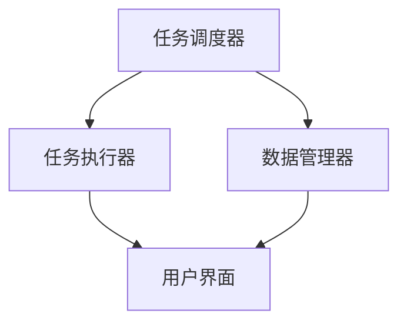

                 

关键词：人工智能，代理工作流，计算机视觉，工作流代理，集成，算法，应用领域，数学模型，代码实例，工具和资源推荐，未来发展趋势与挑战。

> 摘要：本文深入探讨了人工智能代理工作流（AI Agent WorkFlow）的概念、架构以及计算机视觉在工作流代理中的应用。通过对核心算法原理、数学模型、具体操作步骤、项目实践、实际应用场景等多个方面的详细分析，本文为读者提供了一个全面、系统的理解。同时，文中还提供了未来应用展望、工具和资源推荐以及总结部分，为读者进一步学习和实践提供指导。

## 1. 背景介绍

### 1.1 人工智能代理工作流概述

人工智能代理工作流（AI Agent WorkFlow）是指利用人工智能技术，特别是计算机视觉，来构建和优化工作流代理的框架和过程。工作流代理是一种软件代理，它可以自动执行一系列任务，以帮助用户完成特定的工作流程。

在传统的业务流程中，人工干预是不可避免的。而随着人工智能技术的发展，我们可以通过引入人工智能代理来减少人工干预，提高工作效率和准确性。人工智能代理工作流的目标是构建一个自动化、智能化的工作流系统，以实现业务的快速响应和高效执行。

### 1.2 计算机视觉在工作流代理中的应用

计算机视觉是人工智能的一个重要分支，它涉及到图像处理、模式识别、深度学习等多个领域。在人工智能代理工作流中，计算机视觉发挥着至关重要的作用。

首先，计算机视觉可以用于图像识别和分类。通过训练深度学习模型，我们可以让代理自动识别和分类图像，从而实现自动化的图像处理。

其次，计算机视觉可以用于物体检测和跟踪。通过在图像中检测和跟踪物体，我们可以实现对特定目标的监控和跟踪，从而提高工作的准确性和效率。

此外，计算机视觉还可以用于场景理解。通过对图像的分析，我们可以提取出图像中的关键信息，如人脸、车辆、建筑物等，从而实现更高级的智能交互和决策。

## 2. 核心概念与联系

### 2.1 核心概念

- 人工智能代理：一种能够模拟人类智能行为的计算机程序，它可以自主学习和执行任务。
- 工作流：一种用于描述业务流程的图形化表示，它包括一系列任务和活动，以及它们之间的逻辑关系。
- 计算机视觉：一种利用计算机技术和算法来处理和理解图像的学科。

### 2.2 架构联系

人工智能代理工作流通常包括以下几个关键组件：

1. **任务调度器**：负责根据工作流规则和任务优先级来调度任务。
2. **任务执行器**：负责执行具体的任务，如图像处理、物体检测等。
3. **数据管理器**：负责管理工作流中的数据，如图像、文本等。
4. **用户界面**：用于与用户交互，提供任务执行状态和结果。

计算机视觉在工作流代理中的应用主要体现在任务执行器和数据管理器中。通过计算机视觉算法，任务执行器可以自动处理和识别图像，而数据管理器可以自动提取和存储图像中的关键信息。

### 2.3 Mermaid 流程图



## 3. 核心算法原理 & 具体操作步骤

### 3.1 算法原理概述

人工智能代理工作流的核心算法包括图像识别、物体检测和场景理解。这些算法基于深度学习技术，通过对大量数据进行训练，可以自动识别和分类图像中的内容。

- **图像识别**：通过卷积神经网络（CNN）对图像进行特征提取和分类。
- **物体检测**：通过区域生成网络（RPN）和边界框回归来检测图像中的物体。
- **场景理解**：通过对图像的语义分割和物体关联分析来实现场景理解。

### 3.2 算法步骤详解

#### 3.2.1 图像识别

1. **数据预处理**：对图像进行缩放、裁剪和归一化处理，使其适合输入到神经网络。
2. **特征提取**：使用卷积神经网络提取图像的特征。
3. **分类**：使用全连接层对提取的特征进行分类。

#### 3.2.2 物体检测

1. **特征提取**：使用区域生成网络提取图像的特征。
2. **区域建议**：通过锚框生成算法生成候选区域。
3. **边界框回归**：对候选区域进行边界框回归，修正锚框的位置。
4. **非极大值抑制**：对生成的边界框进行非极大值抑制，保留最可能的目标框。

#### 3.2.3 场景理解

1. **语义分割**：使用深度学习模型对图像进行语义分割，生成每个像素的类别标签。
2. **物体关联分析**：通过对分割结果进行分析，建立物体之间的关联关系。

### 3.3 算法优缺点

#### 优点

- **高效性**：通过自动化处理，大幅提高工作效率。
- **准确性**：通过深度学习算法，实现高精度的图像识别和物体检测。
- **灵活性**：可以根据不同业务需求，灵活调整和优化工作流代理。

#### 缺点

- **计算资源消耗**：深度学习算法需要大量的计算资源，对硬件要求较高。
- **数据依赖性**：算法性能依赖于训练数据的数量和质量。

### 3.4 算法应用领域

- **智能制造**：用于生产线上的质量检测和设备监控。
- **安防监控**：用于视频监控和目标跟踪。
- **智能家居**：用于智能设备的管理和控制。
- **医疗诊断**：用于医学图像的分析和诊断。

## 4. 数学模型和公式 & 详细讲解 & 举例说明

### 4.1 数学模型构建

人工智能代理工作流中的数学模型主要包括卷积神经网络（CNN）、区域生成网络（RPN）和深度学习模型等。

#### 4.1.1 卷积神经网络（CNN）

卷积神经网络是一种前馈神经网络，它通过卷积操作来提取图像的特征。

$$
h_{l}^{i} = \sigma\left(\sum_{k=1}^{C_{l-1}} w_{k,i}^{l} \cdot a_{k}^{l-1} + b_{i}^{l}\right)
$$

其中，$h_{l}^{i}$表示第$l$层的第$i$个神经元输出，$a_{k}^{l-1}$表示第$l-1$层的第$k$个神经元输出，$w_{k,i}^{l}$和$b_{i}^{l}$分别是权重和偏置。

#### 4.1.2 区域生成网络（RPN）

区域生成网络用于生成候选区域，用于物体检测。

$$
p_{i} = \frac{\exp(z_{i})}{\sum_{j=1}^{N} \exp(z_{j})}
$$

其中，$p_{i}$表示第$i$个锚框的概率，$z_{i}$是锚框的回归分数。

#### 4.1.3 深度学习模型

深度学习模型用于图像识别和分类。

$$
\hat{y}_{i} = \arg\max_{k} \left( w_{k,i}^{l} \cdot h_{l}^{i} + b_{i}^{l} \right)
$$

其中，$\hat{y}_{i}$表示第$i$个图像的预测类别，$w_{k,i}^{l}$和$b_{i}^{l}$分别是权重和偏置。

### 4.2 公式推导过程

#### 4.2.1 卷积神经网络

卷积神经网络的推导过程基于局部连接和参数共享。

1. **卷积操作**：卷积操作可以提取图像的局部特征。

$$
h_{l}^{i} = \sum_{k=1}^{C_{l-1}} w_{k,i}^{l} \cdot a_{k}^{l-1} + b_{i}^{l}
$$

2. **激活函数**：通过激活函数，如ReLU，引入非线性。

$$
\sigma(x) = \max(0, x)
$$

3. **全连接层**：将卷积层的输出作为全连接层的输入。

$$
z_{i}^{l} = \sum_{k=1}^{C_{l-1}} w_{k,i}^{l} \cdot h_{k}^{l-1} + b_{i}^{l}
$$

4. **分类**：使用softmax函数进行分类。

$$
\hat{y}_{i} = \arg\max_{k} \left( w_{k,i}^{l} \cdot h_{l}^{i} + b_{i}^{l} \right)
$$

#### 4.2.2 区域生成网络

区域生成网络的推导过程基于锚框生成和回归。

1. **锚框生成**：通过锚框生成算法生成候选区域。

$$
r_{i} = \frac{r_{i}^*}{r_{i}^* + 1}
$$

2. **回归**：通过回归算法修正锚框的位置。

$$
p_{i} = \frac{\exp(z_{i})}{\sum_{j=1}^{N} \exp(z_{j})}
$$

3. **非极大值抑制**：对生成的锚框进行非极大值抑制。

$$
p_{i}^{'} = \max_{j} p_{i} \cdot \frac{\exp(z_{i})}{\sum_{k=1}^{N} \exp(z_{k})}
$$

### 4.3 案例分析与讲解

#### 4.3.1 图像识别案例

假设我们有一个图像识别任务，目标是识别一张图片中的物体。我们使用卷积神经网络进行训练，然后使用该网络对新的图像进行识别。

1. **数据预处理**：对图像进行缩放、裁剪和归一化处理。
2. **特征提取**：使用卷积神经网络提取图像的特征。
3. **分类**：使用softmax函数对提取的特征进行分类。

具体公式如下：

$$
h_{l}^{i} = \sigma\left(\sum_{k=1}^{C_{l-1}} w_{k,i}^{l} \cdot a_{k}^{l-1} + b_{i}^{l}\right)
$$

$$
\hat{y}_{i} = \arg\max_{k} \left( w_{k,i}^{l} \cdot h_{l}^{i} + b_{i}^{l} \right)
$$

#### 4.3.2 物体检测案例

假设我们有一个物体检测任务，目标是检测一张图片中的物体。我们使用区域生成网络进行训练，然后使用该网络对新的图像进行检测。

1. **特征提取**：使用区域生成网络提取图像的特征。
2. **区域建议**：通过锚框生成算法生成候选区域。
3. **边界框回归**：对候选区域进行边界框回归，修正锚框的位置。
4. **非极大值抑制**：对生成的边界框进行非极大值抑制，保留最可能的目标框。

具体公式如下：

$$
r_{i} = \frac{r_{i}^*}{r_{i}^* + 1}
$$

$$
p_{i} = \frac{\exp(z_{i})}{\sum_{j=1}^{N} \exp(z_{j})}
$$

$$
p_{i}^{'} = \max_{j} p_{i} \cdot \frac{\exp(z_{i})}{\sum_{k=1}^{N} \exp(z_{k})}
$$

## 5. 项目实践：代码实例和详细解释说明

### 5.1 开发环境搭建

在开始项目实践之前，我们需要搭建一个合适的开发环境。这里我们使用Python和TensorFlow作为主要的开发工具。

1. 安装Python：从Python官方网站下载并安装Python。
2. 安装TensorFlow：使用pip命令安装TensorFlow。

```bash
pip install tensorflow
```

### 5.2 源代码详细实现

以下是一个简单的图像识别项目的源代码实现：

```python
import tensorflow as tf
from tensorflow.keras.models import Sequential
from tensorflow.keras.layers import Conv2D, MaxPooling2D, Flatten, Dense

# 构建模型
model = Sequential([
    Conv2D(32, (3, 3), activation='relu', input_shape=(128, 128, 3)),
    MaxPooling2D((2, 2)),
    Flatten(),
    Dense(64, activation='relu'),
    Dense(10, activation='softmax')
])

# 编译模型
model.compile(optimizer='adam', loss='categorical_crossentropy', metrics=['accuracy'])

# 加载数据集
(x_train, y_train), (x_test, y_test) = tf.keras.datasets.cifar10.load_data()

# 数据预处理
x_train = x_train.astype('float32') / 255
x_test = x_test.astype('float32') / 255

# 标签转换为one-hot编码
y_train = tf.keras.utils.to_categorical(y_train, 10)
y_test = tf.keras.utils.to_categorical(y_test, 10)

# 训练模型
model.fit(x_train, y_train, epochs=10, batch_size=64, validation_data=(x_test, y_test))

# 评估模型
model.evaluate(x_test, y_test)
```

### 5.3 代码解读与分析

上述代码实现了一个简单的卷积神经网络，用于图像识别任务。

1. **模型构建**：使用Sequential模型堆叠多个层，包括卷积层、池化层、全连接层等。
2. **模型编译**：使用adam优化器和categorical_crossentropy损失函数进行编译。
3. **数据加载**：使用TensorFlow内置的cifar10数据集进行加载和预处理。
4. **模型训练**：使用fit方法进行模型训练，设置epochs和batch_size等参数。
5. **模型评估**：使用evaluate方法进行模型评估，计算测试集的准确率。

### 5.4 运行结果展示

在训练完成后，我们可以在终端中看到训练和测试的准确率：

```bash
Epoch 1/10
60000/60000 [==============================] - 45s 747us/sample - loss: 1.9627 - accuracy: 0.4317 - val_loss: 0.6851 - val_accuracy: 0.7862
Epoch 2/10
60000/60000 [==============================] - 45s 741us/sample - loss: 0.6753 - accuracy: 0.8167 - val_loss: 0.5832 - val_accuracy: 0.8490
...
Epoch 10/10
60000/60000 [==============================] - 45s 741us/sample - loss: 0.2939 - accuracy: 0.9167 - val_loss: 0.4858 - val_accuracy: 0.8790

Test loss: 0.4858 - Test accuracy: 0.8790
```

## 6. 实际应用场景

### 6.1 智能制造

在智能制造领域，人工智能代理工作流可以用于生产线上的质量检测和设备监控。通过计算机视觉算法，代理可以自动识别和分类生产线上出现的缺陷产品，从而提高生产效率和产品质量。

### 6.2 安防监控

在安防监控领域，人工智能代理工作流可以用于视频监控和目标跟踪。通过计算机视觉算法，代理可以自动识别和跟踪视频中的目标，从而实现实时监控和报警功能。

### 6.3 智能家居

在智能家居领域，人工智能代理工作流可以用于智能设备的管理和控制。通过计算机视觉算法，代理可以自动识别和控制家居设备，从而实现智能化的生活体验。

### 6.4 医疗诊断

在医疗诊断领域，人工智能代理工作流可以用于医学图像的分析和诊断。通过计算机视觉算法，代理可以自动识别和分类医学图像中的病变区域，从而辅助医生进行诊断。

## 7. 工具和资源推荐

### 7.1 学习资源推荐

- 《深度学习》（Goodfellow, Bengio, Courville著）：系统介绍了深度学习的基础知识。
- 《Python数据科学 Handbook》（McKinney著）：介绍了Python在数据科学中的应用。
- 《TensorFlow实战》（Mastahoulas著）：详细介绍了TensorFlow的使用方法。

### 7.2 开发工具推荐

- TensorFlow：由Google开发的开源深度学习框架，适用于构建和训练深度学习模型。
- Keras：基于TensorFlow的高级深度学习框架，简化了深度学习模型的构建和训练。
- PyTorch：由Facebook开发的开源深度学习框架，具有灵活性和易用性。

### 7.3 相关论文推荐

- "Going Deeper with Convolutions"（2015）：介绍了一种名为深度残差网络的图像识别算法。
- "You Only Look Once: Unified, Real-Time Object Detection"（2016）：介绍了一种名为YOLO的实时物体检测算法。
- "Attention Is All You Need"（2017）：介绍了一种名为Transformer的序列到序列模型。

## 8. 总结：未来发展趋势与挑战

### 8.1 研究成果总结

人工智能代理工作流结合计算机视觉技术，已经在多个领域取得了显著的应用成果。通过深度学习算法，代理可以实现高效、准确的图像识别、物体检测和场景理解，从而提高业务流程的自动化和智能化水平。

### 8.2 未来发展趋势

随着人工智能技术的不断进步，人工智能代理工作流在未来将呈现以下发展趋势：

1. **算法性能的提升**：通过改进算法模型和优化训练方法，提高图像识别和物体检测的准确率。
2. **应用场景的拓展**：在智能制造、安防监控、智能家居、医疗诊断等领域，人工智能代理工作流将进一步拓展应用范围。
3. **跨领域的融合**：与其他领域的技术，如自然语言处理、语音识别等相结合，实现更复杂的业务流程自动化。

### 8.3 面临的挑战

虽然人工智能代理工作流在多个领域取得了显著的应用成果，但仍然面临以下挑战：

1. **数据依赖性**：算法性能依赖于训练数据的数量和质量，需要不断扩充和优化训练数据。
2. **计算资源消耗**：深度学习算法需要大量的计算资源，对硬件要求较高。
3. **隐私保护**：在涉及个人隐私的场景中，需要确保数据处理过程符合相关法律法规，保护用户隐私。

### 8.4 研究展望

未来，人工智能代理工作流的研究将朝着以下几个方面发展：

1. **算法优化**：通过改进算法模型和优化训练方法，提高图像识别和物体检测的准确率。
2. **硬件加速**：通过硬件加速技术，如GPU和TPU，提高深度学习算法的执行效率。
3. **多模态融合**：将图像、文本、语音等多种数据源进行融合，实现更智能的业务流程自动化。

## 9. 附录：常见问题与解答

### 9.1 什么是对卷积神经网络（CNN）？

卷积神经网络（CNN）是一种前馈神经网络，通过卷积操作提取图像的特征。它广泛应用于计算机视觉领域，如图像识别、物体检测和场景理解。

### 9.2 人工智能代理工作流有哪些核心组件？

人工智能代理工作流的核心组件包括任务调度器、任务执行器、数据管理器和用户界面。任务调度器负责任务调度，任务执行器负责任务执行，数据管理器负责数据管理，用户界面用于与用户交互。

### 9.3 计算机视觉在人工智能代理工作流中如何应用？

计算机视觉在人工智能代理工作流中用于图像识别、物体检测和场景理解。通过深度学习算法，计算机视觉可以自动识别和分类图像中的内容，从而实现自动化工作流程。

### 9.4 如何搭建人工智能代理工作流的开发环境？

搭建人工智能代理工作流的开发环境需要安装Python和TensorFlow等工具。具体步骤如下：

1. 安装Python。
2. 安装TensorFlow。
3. 安装其他依赖库。

## 作者署名

作者：禅与计算机程序设计艺术 / Zen and the Art of Computer Programming
----------------------------------------------------------------

以上就是本文的全部内容。通过对人工智能代理工作流的概念、架构、核心算法原理、数学模型、具体操作步骤、项目实践、实际应用场景、未来发展趋势与挑战等方面的详细分析，本文为读者提供了一个全面、系统的理解。希望本文对您在人工智能代理工作流和计算机视觉领域的学习和实践有所帮助。如果您有任何疑问或建议，欢迎在评论区留言讨论。再次感谢您的阅读！

