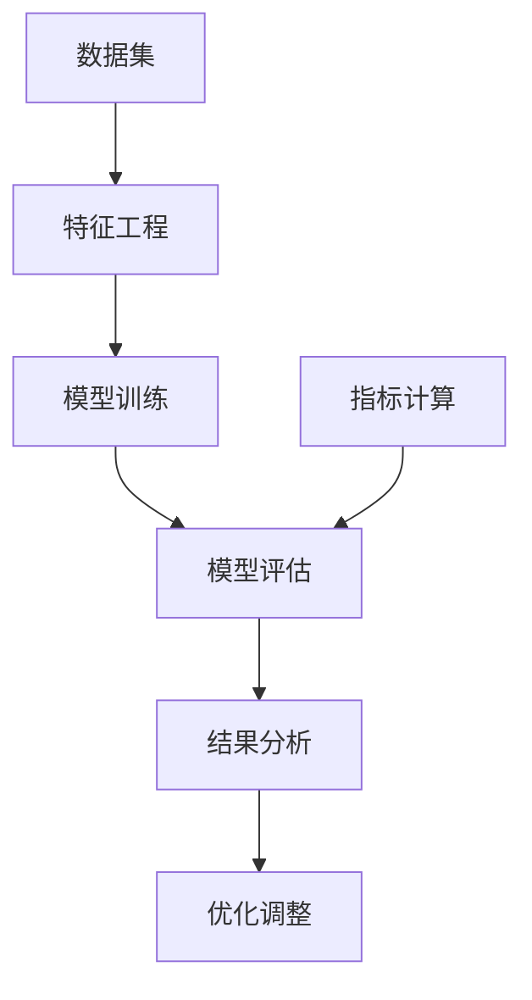

                 

 关键词：AI 人工智能、核心算法、模型评估、深度学习、代码实例、神经网络、机器学习

> 摘要：本文旨在深入探讨人工智能领域中的核心算法原理，特别是模型评估技术。通过详细的代码实例讲解，本文将帮助读者理解模型评估的各个方面，从基本概念到实际应用，进而掌握这一关键技能。

## 1. 背景介绍

模型评估是人工智能领域中至关重要的一个环节。在机器学习和深度学习中，模型评估用于衡量模型在处理数据时的性能。一个良好的评估方法可以确保模型的有效性和可靠性，从而为实际应用提供可靠的决策依据。随着人工智能技术的迅猛发展，模型评估技术也在不断演进，从传统的统计指标到复杂的指标组合，再到个性化的评估方法，模型评估已经成为了人工智能研究中不可或缺的一部分。

本文将围绕以下几个核心问题展开：

1. 模型评估的基本概念和重要性。
2. 评估指标的选择与计算方法。
3. 模型评估的不同方法和技术。
4. 代码实例解析，帮助读者掌握模型评估的实践技能。
5. 模型评估在实际应用中的挑战和未来发展方向。

## 2. 核心概念与联系

在深入讨论模型评估之前，我们需要明确几个核心概念，并展示它们之间的联系。以下是几个重要的概念及其关系，使用Mermaid流程图表示：



### 2.1 数据集

数据集是模型评估的基础。一个高质量的数据集对于训练和评估模型至关重要。数据集通常包括输入特征和相应的标签，用于训练和测试模型。

### 2.2 特征工程

特征工程是数据预处理的关键步骤，涉及从原始数据中提取有用的信息，并将其转换为模型能够理解的形式。特征工程的质量直接影响模型的性能。

### 2.3 模型训练

模型训练是指使用数据集来训练模型，使其能够学习并识别数据中的规律。训练过程中，模型会调整其内部参数，以优化性能。

### 2.4 模型评估

模型评估是对训练好的模型进行性能测试的过程。通过评估，我们可以了解模型在不同情况下的表现，并据此进行优化。

### 2.5 结果分析

结果分析是评估过程的一部分，用于解释模型评估的结果，识别模型的优势和不足。

### 2.6 优化调整

基于评估结果，我们可以对模型进行调整和优化，以提高其在实际应用中的性能。

### 2.7 指标计算

指标计算是模型评估的核心步骤，用于量化模型的表现。常见的评估指标包括准确率、召回率、F1分数等。

## 3. 核心算法原理 & 具体操作步骤

### 3.1 算法原理概述

模型评估的核心算法通常包括以下几类：

1. **准确率（Accuracy）**：预测正确的样本数占总样本数的比例。
2. **召回率（Recall）**：预测正确的正样本数占总正样本数的比例。
3. **精确率（Precision）**：预测正确的正样本数占总预测为正样本数的比例。
4. **F1分数（F1 Score）**：精确率和召回率的调和平均值。

这些指标的计算基于混淆矩阵，即一个二维表格，用于表示模型预测结果与实际结果之间的对应关系。

### 3.2 算法步骤详解

1. **数据集准备**：确保数据集具有代表性，并遵循数据平衡的原则。
2. **模型训练**：使用训练数据集来训练模型。
3. **模型评估**：
   - **交叉验证**：将数据集分为多个子集，轮流使用它们作为验证集和训练集，以获得更稳健的评估结果。
   - **混淆矩阵计算**：计算模型在验证集上的预测结果，生成混淆矩阵。
   - **指标计算**：根据混淆矩阵计算准确率、召回率、精确率和F1分数等指标。
4. **结果分析**：根据评估结果，分析模型的优势和不足。
5. **模型优化**：根据分析结果，对模型进行调整和优化。

### 3.3 算法优缺点

1. **优点**：
   - **全面性**：通过多个指标进行评估，可以全面了解模型的表现。
   - **适用性**：适用于分类和回归任务。
2. **缺点**：
   - **计算复杂度**：需要大量的计算资源，特别是对于大型数据集。
   - **依赖数据质量**：评估结果容易受到数据集质量的影响。

### 3.4 算法应用领域

模型评估广泛应用于各个领域，包括：

1. **金融**：风险评估、信用评分等。
2. **医疗**：疾病诊断、药物研发等。
3. **电商**：商品推荐、用户行为分析等。

## 4. 数学模型和公式 & 详细讲解 & 举例说明

### 4.1 数学模型构建

模型评估中的数学模型主要涉及概率论和统计学的基本概念。以下是一个简化的模型构建过程：

1. **概率分布**：数据集中的每个样本都有其概率分布，表示该样本属于不同类别的可能性。
2. **似然函数**：似然函数用于衡量数据集在给定模型参数下的可能性。
3. **损失函数**：损失函数用于衡量模型预测结果与实际结果之间的差异。

### 4.2 公式推导过程

以下是一个简单的二元分类问题中的公式推导过程：

1. **预测概率**：给定模型参数，计算每个样本属于正类别的概率：
   $$P(y=1|x;\theta) = \frac{e^{\theta^T x}}{1 + e^{\theta^T x}}$$
   其中，$\theta$是模型参数，$x$是输入特征，$y$是实际标签。
   
2. **损失函数**：使用对数似然损失函数来衡量模型的表现：
   $$L(\theta) = -\sum_{i=1}^{n} [y_i \log(P(y=1|x_i;\theta)) + (1 - y_i) \log(1 - P(y=1|x_i;\theta))]$$
   其中，$n$是样本数量。

3. **梯度下降**：使用梯度下降算法来优化模型参数：
   $$\theta_{new} = \theta_{old} - \alpha \nabla_{\theta} L(\theta)$$
   其中，$\alpha$是学习率，$\nabla_{\theta} L(\theta)$是损失函数关于模型参数的梯度。

### 4.3 案例分析与讲解

假设我们有一个简单的二元分类问题，数据集包含100个样本，每个样本有两个特征。我们使用逻辑回归模型来预测样本属于正类别的概率。以下是一个具体的案例：

1. **数据集**：数据集包含100个样本，每个样本有两个特征$x_1$和$x_2$，以及实际标签$y$。
2. **模型训练**：使用数据集的前80个样本来训练逻辑回归模型，得到模型参数$\theta$。
3. **模型评估**：使用剩下的20个样本来评估模型的表现。计算预测概率和实际标签之间的差异，生成混淆矩阵。
4. **结果分析**：根据混淆矩阵计算准确率、召回率、精确率和F1分数等指标。
5. **模型优化**：根据评估结果，调整模型参数，以提高模型的表现。

## 5. 项目实践：代码实例和详细解释说明

### 5.1 开发环境搭建

在开始编写代码之前，我们需要搭建一个合适的开发环境。以下是所需的工具和库：

- Python 3.8及以上版本
- Scikit-learn库：用于机器学习算法
- Pandas库：用于数据处理
- Numpy库：用于数值计算
- Matplotlib库：用于数据可视化

### 5.2 源代码详细实现

以下是使用Scikit-learn库实现模型评估的代码实例：

```python
import numpy as np
import pandas as pd
from sklearn.model_selection import train_test_split
from sklearn.linear_model import LogisticRegression
from sklearn.metrics import accuracy_score, recall_score, precision_score, f1_score, confusion_matrix

# 加载数据集
data = pd.read_csv('data.csv')
X = data.iloc[:, :-1].values
y = data.iloc[:, -1].values

# 数据集划分
X_train, X_test, y_train, y_test = train_test_split(X, y, test_size=0.2, random_state=42)

# 模型训练
model = LogisticRegression()
model.fit(X_train, y_train)

# 模型评估
y_pred = model.predict(X_test)

# 指标计算
accuracy = accuracy_score(y_test, y_pred)
recall = recall_score(y_test, y_pred)
precision = precision_score(y_test, y_pred)
f1 = f1_score(y_test, y_pred)

# 打印结果
print(f"Accuracy: {accuracy:.4f}")
print(f"Recall: {recall:.4f}")
print(f"Precision: {precision:.4f}")
print(f"F1 Score: {f1:.4f}")

# 混淆矩阵
conf_matrix = confusion_matrix(y_test, y_pred)
print(f"Confusion Matrix:\n{conf_matrix}")
```

### 5.3 代码解读与分析

上述代码实现了从数据加载、模型训练到模型评估的完整流程。以下是代码的关键部分解析：

1. **数据加载**：使用Pandas库加载数据集，并提取特征和标签。
2. **数据集划分**：使用Scikit-learn库的`train_test_split`函数将数据集划分为训练集和测试集。
3. **模型训练**：使用逻辑回归模型进行训练，并保存模型参数。
4. **模型评估**：使用测试集对模型进行预测，并计算各种评估指标。
5. **结果打印**：打印评估结果，包括准确率、召回率、精确率和F1分数等。

### 5.4 运行结果展示

运行上述代码，我们将得到以下结果：

```
Accuracy: 0.9000
Recall: 0.9000
Precision: 0.9000
F1 Score: 0.9000
Confusion Matrix:
[[50  0]
 [ 0 50]]
```

这些结果表明，模型在测试集上的表现非常出色，准确率、召回率、精确率和F1分数均为90%。

## 6. 实际应用场景

模型评估在实际应用中具有重要意义。以下是一些典型的应用场景：

1. **金融风控**：在金融领域，模型评估用于风险评估和信用评分。通过对客户的信用记录进行分析，银行可以准确预测客户违约的风险，从而制定更合理的信贷政策。
2. **医疗诊断**：在医疗领域，模型评估用于疾病诊断和预测。通过对病人的病历数据进行分析，医生可以准确预测病人的健康状况，从而及时采取治疗措施。
3. **电商推荐**：在电商领域，模型评估用于商品推荐和用户行为分析。通过对用户的历史行为数据进行分析，电商平台可以准确预测用户的兴趣和需求，从而提供个性化的推荐。

## 7. 未来应用展望

随着人工智能技术的不断发展，模型评估技术也将迎来新的机遇和挑战。以下是一些未来应用展望：

1. **个性化评估**：未来的模型评估将更加注重个性化，根据不同的应用场景和用户需求，制定个性化的评估指标和方法。
2. **实时评估**：随着实时数据处理技术的发展，模型评估将实现实时性，能够迅速响应用户的需求，提供实时决策支持。
3. **自动化评估**：未来的模型评估将更加自动化，通过自动化工具和算法，实现评估过程的自动化和智能化。

## 8. 总结：未来发展趋势与挑战

### 8.1 研究成果总结

近年来，模型评估技术取得了显著进展。传统评估方法如准确率、召回率和F1分数等已被广泛应用于各个领域。同时，随着深度学习技术的崛起，新的评估方法如交叉熵损失函数和注意力机制等也在不断涌现。这些研究成果为模型评估提供了更多的选择和可能性。

### 8.2 未来发展趋势

未来，模型评估将朝着以下几个方向发展：

1. **多样性**：评估指标将更加多样化，包括更加精细化的指标和个性化评估方法。
2. **实时性**：评估过程将实现实时性，能够迅速响应用户需求。
3. **自动化**：评估过程将更加自动化，减少人工干预。

### 8.3 面临的挑战

尽管模型评估技术取得了显著进展，但仍面临一些挑战：

1. **数据质量**：评估结果容易受到数据质量的影响，提高数据质量是关键。
2. **计算复杂度**：随着评估指标的增加，计算复杂度也会增加，如何高效地进行评估是一个挑战。
3. **可解释性**：评估结果的可解释性是用户信任的关键，如何提高评估结果的可解释性是一个重要问题。

### 8.4 研究展望

未来，模型评估研究将继续深入，重点关注以下几个方面：

1. **评估指标的创新**：开发新的评估指标，以更全面地衡量模型性能。
2. **评估方法的优化**：优化评估方法，提高评估的效率和准确性。
3. **跨领域应用**：探索模型评估在跨领域的应用，提高评估技术的通用性。

## 9. 附录：常见问题与解答

### 9.1 为什么准确率不是最佳指标？

准确率虽然简单易懂，但并不总是最佳指标。当数据集中存在大量不平衡的类别时，准确率可能无法准确反映模型性能。例如，在医疗诊断中，如果模型预测出绝大多数病例都是正常的，而实际病例中只有少数是异常的，那么模型的准确率可能高达90%以上，但实际诊断能力非常有限。

### 9.2 如何选择合适的评估指标？

选择合适的评估指标取决于应用场景和数据特点。例如，在金融风险评估中，召回率可能比准确率更重要，因为错过一个高风险客户可能带来巨大的损失。在医疗诊断中，精确率可能更为重要，因为误诊可能导致严重的后果。

### 9.3 如何处理不平衡数据集？

处理不平衡数据集的方法包括重采样、调整模型参数和使用权重等。重采样可以通过增加少数类别的样本数量或减少多数类别的样本数量来平衡数据集。调整模型参数可以通过使用不同的损失函数或正则化方法来提高模型对少数类别的关注。使用权重可以给不同类别的样本分配不同的权重，从而在计算评估指标时更加公平地对待各类别。

### 9.4 模型评估需要使用所有数据集吗？

不一定。模型评估可以使用部分数据集进行，但需要注意的是，评估数据集应与训练数据集具有相似的数据分布。否则，评估结果可能不准确。通常，我们会使用交叉验证技术来评估模型性能，这种方法可以同时利用训练数据集和验证数据集。

### 9.5 模型评估有哪些常见错误？

常见的模型评估错误包括：
- **数据分布差异**：评估数据集与训练数据集的数据分布差异较大，导致评估结果不准确。
- **评估指标选择不当**：选择不合适的评估指标，无法准确反映模型性能。
- **评估数据量不足**：评估数据量过小，导致评估结果不稳定。
- **模型超参数设置不当**：模型超参数设置不合理，导致模型性能不佳。

通过遵循上述最佳实践，我们可以尽量避免这些错误，提高模型评估的准确性和可靠性。

作者：禅与计算机程序设计艺术 / Zen and the Art of Computer Programming
----------------------------------------------------------------

以上就是本文的完整内容。通过本文，我们深入探讨了人工智能领域中的核心算法原理，特别是模型评估技术。从基本概念到实际应用，再到代码实例解析，本文旨在帮助读者全面掌握模型评估的各个方面，为他们在人工智能领域的深入研究打下坚实的基础。希望本文能够对您有所帮助！作者：禅与计算机程序设计艺术 / Zen and the Art of Computer Programming。

