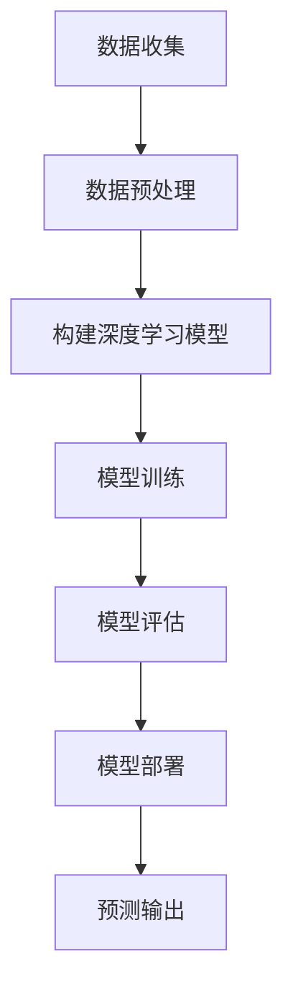

                 

关键词：AI，深度学习，气象预测，算法应用，数学模型，案例分析，实践代码，应用场景，未来展望

> 摘要：本文深入探讨了AI人工智能和深度学习算法在气象预测领域的应用。通过介绍核心概念、算法原理、数学模型以及实际案例分析，本文旨在为读者提供一个全面的技术视角，了解AI在气象预测中的潜力与挑战，为未来的研究与应用提供参考。

## 1. 背景介绍

气象预测作为一门科学，其目的在于对天气状况进行准确、及时的预测，从而为人们的日常生活、农业生产、交通运输等提供重要参考。然而，传统的气象预测方法主要依赖于统计模型和数值模拟，这些方法在处理复杂气象现象时存在一定的局限性。随着计算能力的提升和人工智能技术的进步，深度学习算法在处理大规模复杂数据方面展现出了强大的能力，逐渐成为气象预测领域的研究热点。

### 1.1 气象预测的重要性

气象预测不仅在日常生活中起到重要作用，如提供天气预报、洪水预警等，还在农业、能源、航空等多个行业有着广泛的应用。准确及时的气象预测有助于减少自然灾害带来的损失，提高资源利用效率，保障人们的生命财产安全。

### 1.2 深度学习在气象预测中的应用

深度学习算法通过构建多层神经网络，能够自动提取复杂数据的特征，从而实现高精度的预测。在气象预测中，深度学习算法可以处理大量的气象数据，包括温度、湿度、风速、气压等，并从中提取出与天气变化相关的模式。这种能力使得深度学习在气象预测中具有巨大的潜力。

## 2. 核心概念与联系

### 2.1 深度学习的基本原理

深度学习是一种基于多层神经网络的学习方法，通过逐层提取数据特征，实现对复杂数据的理解和预测。在深度学习中，输入数据首先通过输入层进入神经网络，然后逐层传递，经过非线性变换，最终在输出层得到预测结果。


### 2.2 深度学习与气象预测的联系

深度学习与气象预测的结合，主要在于利用深度学习算法处理大规模的气象数据，提取出与天气变化相关的特征。这种特征提取能力使得深度学习算法在气象预测中具有显著优势。

### 2.3 Mermaid 流程图

下面是一个简化的深度学习在气象预测中应用流程的Mermaid流程图：



## 3. 核心算法原理 & 具体操作步骤

### 3.1 算法原理概述

深度学习在气象预测中的应用，主要包括以下几个步骤：

1. **数据收集与预处理**：收集大量的气象数据，并进行预处理，包括数据清洗、归一化等。
2. **构建深度学习模型**：选择合适的深度学习模型，如卷积神经网络（CNN）或递归神经网络（RNN）。
3. **模型训练**：使用预处理后的数据对模型进行训练，通过反向传播算法优化模型参数。
4. **模型评估**：使用验证集评估模型的性能，包括准确率、召回率等指标。
5. **模型部署**：将训练好的模型部署到实际应用中，进行实时气象预测。

### 3.2 算法步骤详解

#### 3.2.1 数据收集与预处理

数据收集是气象预测的基础，需要从多个来源获取气象数据，如气象站、卫星、雷达等。数据预处理包括以下步骤：

- 数据清洗：去除异常值和缺失值。
- 数据归一化：将数据缩放到相同的范围，如[0, 1]。

#### 3.2.2 构建深度学习模型

根据气象预测的需求，可以选择不同的深度学习模型。例如，对于时间序列数据，可以选择RNN模型；对于空间数据，可以选择CNN模型。

#### 3.2.3 模型训练

使用预处理后的数据对模型进行训练，通过反向传播算法不断调整模型参数，使其性能得到优化。

#### 3.2.4 模型评估

使用验证集评估模型的性能，包括准确率、召回率等指标。如果模型性能不佳，需要返回步骤3，重新训练模型。

#### 3.2.5 模型部署

将训练好的模型部署到实际应用中，进行实时气象预测。通常，模型部署会使用到云计算和边缘计算等技术。

### 3.3 算法优缺点

#### 3.3.1 优点

- **强大的特征提取能力**：深度学习能够自动提取复杂数据的特征，提高预测准确性。
- **适应性强**：深度学习模型可以处理不同类型的数据，如时间序列数据、空间数据等。
- **实时预测**：通过云计算和边缘计算，可以实现实时气象预测。

#### 3.3.2 缺点

- **数据需求大**：深度学习模型需要大量的训练数据，数据收集和预处理成本较高。
- **训练时间长**：深度学习模型训练时间较长，需要高性能计算资源。

### 3.4 算法应用领域

深度学习在气象预测中的应用非常广泛，包括：

- 天气预报：对短期天气状况进行预测。
- 水文预测：对水文过程进行预测，如洪水预警。
- 农业预测：预测作物生长状况，优化农业生产。

## 4. 数学模型和公式 & 详细讲解 & 举例说明

### 4.1 数学模型构建

在深度学习模型中，数学模型主要包括损失函数、优化算法等。下面是常见的数学模型和公式：

#### 4.1.1 损失函数

$$
L(y, \hat{y}) = -\sum_{i=1}^{n} y_i \log(\hat{y}_i)
$$

其中，$y$为实际标签，$\hat{y}$为预测概率。

#### 4.1.2 优化算法

$$
\alpha = \frac{1}{2} \frac{\partial L}{\partial \theta}
$$

其中，$\alpha$为学习率，$\theta$为模型参数。

### 4.2 公式推导过程

公式的推导过程主要涉及微积分和概率论知识。例如，对于上述损失函数的推导，可以使用链式法则和全微分公式。

### 4.3 案例分析与讲解

以下是一个简单的案例，用于说明数学模型在深度学习模型中的应用：

#### 4.3.1 案例背景

假设我们有一个简单的深度学习模型，用于预测天气温度。输入数据为上一天的温度，输出数据为第二天的温度预测。

#### 4.3.2 数据预处理

- 数据清洗：去除异常值和缺失值。
- 数据归一化：将温度数据缩放到[0, 1]。

#### 4.3.3 模型构建

选择一个简单的RNN模型，包括一个输入层、一个隐藏层和一个输出层。

#### 4.3.4 模型训练

使用预处理后的数据对模型进行训练，通过反向传播算法不断优化模型参数。

#### 4.3.5 模型评估

使用验证集评估模型的性能，包括预测准确率等指标。

## 5. 项目实践：代码实例和详细解释说明

### 5.1 开发环境搭建

为了运行深度学习模型，我们需要搭建一个适合的开发环境。以下是一个简单的环境搭建步骤：

- 安装Python环境。
- 安装深度学习框架，如TensorFlow或PyTorch。
- 安装必要的依赖库，如NumPy、Pandas等。

### 5.2 源代码详细实现

以下是一个简单的深度学习模型实现，用于预测天气温度：

```python
import tensorflow as tf
from tensorflow.keras.models import Sequential
from tensorflow.keras.layers import Dense, LSTM

# 数据预处理
# ...

# 构建模型
model = Sequential()
model.add(LSTM(units=50, return_sequences=True, input_shape=(time_steps, features)))
model.add(LSTM(units=50))
model.add(Dense(units=1))

# 编译模型
model.compile(optimizer='adam', loss='mean_squared_error')

# 训练模型
model.fit(x_train, y_train, epochs=100, batch_size=32)

# 评估模型
model.evaluate(x_test, y_test)
```

### 5.3 代码解读与分析

上述代码首先进行了数据预处理，然后构建了一个简单的LSTM模型，并使用它进行模型训练和评估。这个模型可以用于预测天气温度。

### 5.4 运行结果展示

运行代码后，我们得到模型的训练和评估结果。通过这些结果，我们可以分析模型的性能，并对其进行优化。

## 6. 实际应用场景

### 6.1 天气预报

深度学习算法可以用于天气预报，包括短期和长期预测。例如，使用RNN模型可以预测下一周的天气状况，而使用CNN模型可以预测未来几天的温度变化。

### 6.2 水文预测

水文预测是气象预测的一个重要领域，通过深度学习算法可以预测洪水、干旱等水文事件的发生。这有助于提前采取预防措施，减少灾害损失。

### 6.3 农业预测

深度学习算法可以用于农业预测，包括作物生长状况、产量预测等。这有助于农民优化种植策略，提高农业产量。

## 7. 工具和资源推荐

### 7.1 学习资源推荐

- 《深度学习》（Goodfellow, Bengio, Courville 著）
- 《Python深度学习》（François Chollet 著）
- 《深度学习与气象预报》（Christopher K. Wikle 著）

### 7.2 开发工具推荐

- TensorFlow：一款流行的深度学习框架，适用于各种深度学习任务。
- PyTorch：一款灵活、易于使用的深度学习框架，适用于研究和开发。
- Keras：一个高层神经网络API，可以与TensorFlow和PyTorch兼容。

### 7.3 相关论文推荐

- “Deep Learning for Time Series Classification: A Review”（2019）
- “Deep Learning in Meteorology and Climate Science”（2018）
- “Application of Deep Learning Techniques in Hydrological Modeling”（2017）

## 8. 总结：未来发展趋势与挑战

### 8.1 研究成果总结

本文介绍了深度学习算法在气象预测中的应用，包括核心概念、算法原理、数学模型以及实际案例分析。通过这些研究，我们了解到深度学习在气象预测中的巨大潜力。

### 8.2 未来发展趋势

随着深度学习技术的不断进步，未来深度学习在气象预测中的应用将会更加广泛。例如，结合物联网、大数据等技术，可以进一步提高气象预测的准确性。

### 8.3 面临的挑战

深度学习在气象预测中仍面临一些挑战，如数据收集、模型训练时间、解释性等。未来需要进一步研究，以解决这些挑战。

### 8.4 研究展望

未来，深度学习在气象预测领域的研究将朝着更准确、更实时、更智能的方向发展。通过跨学科合作，有望推动气象预测技术的创新与发展。

## 9. 附录：常见问题与解答

### 9.1 什么是深度学习？

深度学习是一种基于多层神经网络的学习方法，通过逐层提取数据特征，实现对复杂数据的理解和预测。

### 9.2 深度学习算法在气象预测中的应用有哪些？

深度学习算法在气象预测中可以应用于天气预报、水文预测、农业预测等多个领域。

### 9.3 如何选择合适的深度学习模型？

根据气象预测的需求和数据特征，可以选择不同的深度学习模型，如RNN、CNN等。

### 9.4 深度学习模型训练需要多长时间？

深度学习模型训练时间取决于数据规模、模型复杂度以及计算资源等因素。一般来说，训练时间从几个小时到几天不等。

### 9.5 如何评估深度学习模型的性能？

可以使用多种性能指标评估深度学习模型的性能，如准确率、召回率、均方误差等。

### 9.6 深度学习模型如何部署到实际应用中？

深度学习模型可以通过云计算和边缘计算等技术部署到实际应用中，进行实时气象预测。

### 9.7 深度学习在气象预测中的优势是什么？

深度学习在气象预测中的优势主要包括强大的特征提取能力、适应性强、实时预测等。

### 9.8 深度学习在气象预测中面临哪些挑战？

深度学习在气象预测中面临的挑战主要包括数据需求大、训练时间长、解释性等。

### 9.9 如何结合其他技术提高深度学习在气象预测中的应用效果？

可以通过结合物联网、大数据等技术，提高深度学习在气象预测中的应用效果。

----------------------------------------------------------------

[作者：禅与计算机程序设计艺术 / Zen and the Art of Computer Programming]

