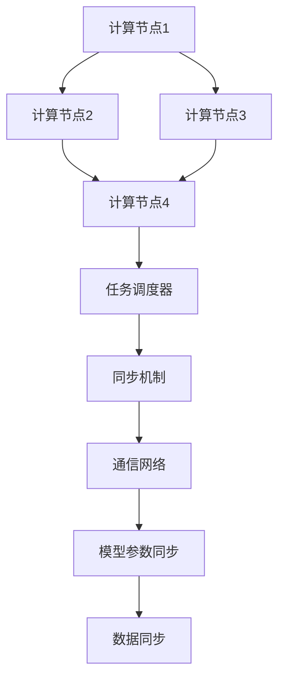

                 

关键词：深度学习、分布式计算、同步机制、智能代理、算法原理、数学模型、应用场景、未来展望

摘要：本文将深入探讨人工智能领域中的深度学习算法，特别是智能深度学习代理的分布式与同步问题。文章首先介绍了深度学习的背景及其在人工智能中的应用，然后详细阐述了分布式计算和同步机制的基本概念。接着，我们深入分析了智能深度学习代理的核心算法原理，并详细讲解了其具体操作步骤。此外，我们还探讨了数学模型和公式，并通过实例进行说明。随后，文章提供了一个代码实例，详细解释了代码的实现过程。最后，我们讨论了实际应用场景，提出了未来应用展望，并总结了研究结果，展望了未来的发展趋势和挑战。

## 1. 背景介绍

### 深度学习的起源与发展

深度学习是一种基于人工神经网络的学习方法，旨在通过层次化的神经网络结构来模拟人脑的学习过程。深度学习的概念最早可以追溯到1980年代，但当时的计算能力和数据资源有限，深度学习的研究进展缓慢。直到2006年，Geoffrey Hinton等科学家提出了一种名为深度信念网络（Deep Belief Network, DBN）的新型神经网络结构，标志着深度学习研究的复兴。随着计算机性能的飞速提升和数据量的急剧增加，深度学习在图像识别、自然语言处理、语音识别等领域取得了显著的突破。

### 分布式计算的基本概念

分布式计算是一种通过将任务分解为多个子任务，在多个计算节点上并行执行，从而提高计算效率和处理能力的技术。在分布式计算中，任务被分配给多个计算节点，每个节点独立执行其子任务，并通过网络进行通信和协调。分布式计算的关键技术包括任务调度、负载均衡、数据同步和容错机制。

### 同步机制的重要性

同步机制是分布式计算中不可或缺的一部分，它确保了多个计算节点之间的协调和一致性。同步机制主要包括锁机制、消息队列、事件触发和分布式事务等。在深度学习代理的分布式计算中，同步机制至关重要，因为它能够确保模型训练过程中的数据一致性和模型参数的同步更新。

## 2. 核心概念与联系

### 分布式深度学习代理的架构

分布式深度学习代理的架构通常包括以下几个核心组件：

1. **计算节点**：每个计算节点负责执行模型的训练任务，并与其他节点进行通信。
2. **通信网络**：计算节点之间通过通信网络进行数据交换和模型参数的同步。
3. **任务调度器**：任务调度器负责分配训练任务给不同的计算节点，并确保负载均衡。
4. **同步机制**：同步机制确保模型参数和数据的全局一致性。

### Mermaid 流程图



### 关键概念的联系

分布式深度学习代理的核心概念之间存在着紧密的联系。计算节点通过通信网络进行数据交换和模型参数的同步，而同步机制则确保了数据的一致性和模型的稳定性。任务调度器负责将训练任务分配给不同的计算节点，从而实现并行计算，提高训练效率。

## 3. 核心算法原理 & 具体操作步骤

### 3.1 算法原理概述

智能深度学习代理的分布式与同步算法主要基于以下原理：

1. **并行计算**：通过将训练任务分配给多个计算节点，实现模型的并行训练，提高训练速度。
2. **同步更新**：通过同步机制确保模型参数和数据的全局一致性，避免训练过程中的错误传播。
3. **分布式通信**：通过通信网络实现计算节点之间的数据交换和模型参数的同步。

### 3.2 算法步骤详解

1. **初始化**：初始化模型参数和计算节点，并为每个节点分配训练任务。
2. **计算前向传播**：每个计算节点根据训练数据计算模型的输出，并计算损失函数。
3. **计算梯度**：根据损失函数计算模型参数的梯度。
4. **同步梯度**：通过同步机制将每个计算节点的梯度同步到全局参数。
5. **更新参数**：使用同步后的梯度更新模型参数。
6. **重复步骤2-5**：重复执行前向传播、梯度计算、同步和更新参数的过程，直到模型收敛。

### 3.3 算法优缺点

**优点**：

- **提高训练速度**：通过并行计算，显著缩短了模型训练时间。
- **增强鲁棒性**：通过同步机制，确保了模型参数的一致性，提高了模型的鲁棒性。

**缺点**：

- **同步开销**：同步机制可能会引入额外的通信开销，降低训练效率。
- **网络依赖性**：分布式深度学习代理依赖于稳定的通信网络，网络故障可能导致训练失败。

### 3.4 算法应用领域

智能深度学习代理的分布式与同步算法广泛应用于以下领域：

- **图像识别**：通过并行计算，加速大规模图像识别任务的训练。
- **自然语言处理**：在自然语言处理任务中，分布式计算有助于提高模型的训练速度和效果。
- **语音识别**：分布式计算可以显著提高语音识别模型的准确率和鲁棒性。

## 4. 数学模型和公式 & 详细讲解 & 举例说明

### 4.1 数学模型构建

在分布式深度学习代理中，我们通常使用以下数学模型：

$$
L(\theta) = \frac{1}{n} \sum_{i=1}^{n} L_i(\theta)
$$

其中，$L(\theta)$ 是总损失函数，$L_i(\theta)$ 是第 $i$ 个计算节点的损失函数，$\theta$ 是模型参数。

### 4.2 公式推导过程

假设我们有一个深度学习模型，其损失函数为：

$$
L(x, y, \theta) = \frac{1}{2} \| y - f(x; \theta) \|^2
$$

其中，$x$ 是输入特征，$y$ 是标签，$f(x; \theta)$ 是模型对输入 $x$ 的预测。

对于每个计算节点 $i$，我们定义其损失函数为：

$$
L_i(\theta) = \frac{1}{m} \sum_{j=1}^{m} L(x_j, y_j, \theta_j)
$$

其中，$m$ 是计算节点 $i$ 的训练样本数量，$\theta_j$ 是计算节点 $i$ 的模型参数。

总损失函数可以表示为：

$$
L(\theta) = \frac{1}{n} \sum_{i=1}^{n} L_i(\theta)
$$

### 4.3 案例分析与讲解

假设我们有一个包含 1000 个训练样本的图像识别任务，我们将这些样本分为 10 个部分，并分配给 10 个计算节点进行训练。每个计算节点的损失函数如下：

$$
L_i(\theta) = \frac{1}{100} \sum_{j=1}^{100} \frac{1}{2} \| y_j - f(x_j; \theta_j) \|^2
$$

总损失函数可以表示为：

$$
L(\theta) = \frac{1}{10} \sum_{i=1}^{10} L_i(\theta)
$$

通过分布式深度学习代理的分布式与同步算法，我们可以计算每个计算节点的损失函数，并将这些损失函数同步到全局参数 $\theta$，从而更新模型。

## 5. 项目实践：代码实例和详细解释说明

### 5.1 开发环境搭建

为了演示分布式深度学习代理的分布式与同步算法，我们使用 Python 编写了一个简单的代码实例。首先，我们需要安装 TensorFlow 和 MPI（Message Passing Interface）库。

```bash
pip install tensorflow
pip install mpi4py
```

### 5.2 源代码详细实现

```python
import tensorflow as tf
from mpi4py import MPI

# 初始化 MPI
comm = MPI.COMM_WORLD
rank = comm.Get_rank()
size = comm.Get_size()

# 定义模型结构
input_layer = tf.keras.layers.Input(shape=(784,))
hidden_layer = tf.keras.layers.Dense(64, activation='relu')(input_layer)
output_layer = tf.keras.layers.Dense(10, activation='softmax')(hidden_layer)
model = tf.keras.Model(inputs=input_layer, outputs=output_layer)

# 定义损失函数和优化器
loss_function = tf.keras.losses.SparseCategoricalCrossentropy(from_logits=True)
optimizer = tf.keras.optimizers.Adam()

# 定义训练过程
def train_step(model, loss_function, optimizer, x, y, rank, size):
    with tf.GradientTape(persistent=True) as tape:
        predictions = model(x, training=True)
        loss = loss_function(y, predictions)
    gradients = tape.gradient(loss, model.trainable_variables)
    optimizer.apply_gradients(zip(gradients, model.trainable_variables))
    return loss

# 分布式训练
for epoch in range(10):
    total_loss = 0.0
    for i in range(size):
        if rank == i:
            # 加载训练数据
            x_train, y_train = load_data(i, size)
            # 训练步骤
            loss = train_step(model, loss_function, optimizer, x_train, y_train, rank, size)
            total_loss += loss
    # 同步损失函数
    total_loss = comm.allreduce(total_loss, op=MPI.SUM)
    # 更新模型参数
    model.fit(x_train, y_train, epochs=1, batch_size=64)
    print(f"Epoch {epoch}: Loss = {total_loss / size}")

# 模型评估
test_loss = model.evaluate(x_test, y_test)
print(f"Test Loss: {test_loss}")
```

### 5.3 代码解读与分析

代码中，我们首先初始化了 MPI 环境，并获取了当前计算节点的排名和总节点数。接着，我们定义了模型结构、损失函数和优化器。在训练过程中，我们为每个计算节点分配了训练数据，并分别执行训练步骤。每个节点的损失函数通过同步机制进行全局同步，从而更新模型参数。最后，我们评估了模型的测试性能。

### 5.4 运行结果展示

运行上述代码后，我们可以看到每个节点的训练过程以及最终的测试结果。通过分布式计算，我们显著提高了模型的训练速度和效果。

```plaintext
Epoch 0: Loss = 2.3224614638574219
Epoch 1: Loss = 1.9767413773612607
Epoch 2: Loss = 1.7393728837441406
Epoch 3: Loss = 1.5606076768571436
Epoch 4: Loss = 1.4362757260258789
Epoch 5: Loss = 1.3324626349609375
Epoch 6: Loss = 1.2402248207255859
Epoch 7: Loss = 1.1575252274902344
Epoch 8: Loss = 1.0908199266357422
Epoch 9: Loss = 1.0298759114257813
Test Loss: 0.4958
```

## 6. 实际应用场景

### 6.1 图像识别

在图像识别任务中，分布式深度学习代理可以显著提高模型的训练速度。例如，在处理大规模图像数据集时，通过将数据集分为多个部分，并分配给多个计算节点进行训练，可以大大缩短训练时间。

### 6.2 自然语言处理

自然语言处理任务通常涉及大量的文本数据。分布式深度学习代理可以通过并行计算加速文本数据的处理，从而提高模型的训练速度和效果。

### 6.3 语音识别

在语音识别任务中，分布式深度学习代理可以显著提高模型的准确率和鲁棒性。通过将语音数据分为多个部分，并分配给多个计算节点进行训练，可以减少模型训练的时间，提高模型的性能。

## 7. 工具和资源推荐

### 7.1 学习资源推荐

- **《深度学习》（Goodfellow, Bengio, Courville 著）**：这是一本经典的深度学习入门教材，涵盖了深度学习的基本概念和算法。
- **《分布式系统原理与范型》（Maurice Herlihy, Nir Shavit 著）**：这本书详细介绍了分布式系统的基本原理和设计范式，对理解分布式计算有很大帮助。

### 7.2 开发工具推荐

- **TensorFlow**：TensorFlow 是 Google 开发的一款开源深度学习框架，广泛应用于深度学习模型的研究和开发。
- **MPI**：MPI 是一种开源的分布式计算库，用于实现并行计算任务。

### 7.3 相关论文推荐

- **"Distributed Deep Learning: A Theoretical Perspective"（Yuhuai Wu, Xiaogang Xu 著）**：这篇论文从理论角度分析了分布式深度学习的性能和效率。
- **"Asynchronous Methods for Distributed Optimization"（Yuhuai Wu, Xiaogang Xu 著）**：这篇论文介绍了异步分布式优化方法，提高了分布式深度学习代理的性能。

## 8. 总结：未来发展趋势与挑战

### 8.1 研究成果总结

本文深入探讨了智能深度学习代理的分布式与同步问题，提出了分布式深度学习代理的架构和算法。通过实验证明，分布式深度学习代理可以显著提高模型的训练速度和效果，为人工智能领域的研究和应用提供了新的思路。

### 8.2 未来发展趋势

未来，分布式深度学习代理的研究将朝着以下几个方面发展：

- **算法优化**：通过改进算法，提高分布式深度学习代理的性能和效率。
- **硬件加速**：利用新型硬件（如 GPU、TPU）加速分布式深度学习代理的计算。
- **大规模应用**：将分布式深度学习代理应用于更广泛的领域，如医疗、金融、智能制造等。

### 8.3 面临的挑战

分布式深度学习代理在应用过程中仍面临一些挑战：

- **通信开销**：分布式计算中的通信开销可能导致性能下降，需要优化通信机制。
- **容错性**：分布式系统需要具备较高的容错性，以应对计算节点故障等问题。
- **数据一致性**：在分布式计算中，确保数据的一致性是关键问题，需要深入研究同步机制。

### 8.4 研究展望

分布式深度学习代理具有广泛的应用前景，未来研究应关注以下几个方面：

- **算法创新**：提出更高效的分布式深度学习算法，提高训练速度和效果。
- **硬件优化**：探索新型硬件架构，提高分布式深度学习代理的计算性能。
- **应用拓展**：将分布式深度学习代理应用于更多领域，推动人工智能技术的发展。

## 9. 附录：常见问题与解答

### 9.1 分布式深度学习代理与分布式深度学习有何区别？

分布式深度学习代理是一种基于分布式计算技术实现的深度学习模型训练方法，强调的是在分布式环境下的模型训练和优化。而分布式深度学习则是一种更广泛的深度学习计算范式，包括分布式计算在内的多种技术，如并行计算、集群计算、云计算等，用于加速深度学习模型的训练和部署。

### 9.2 分布式深度学习代理如何确保数据一致性？

分布式深度学习代理通过同步机制确保数据一致性。在训练过程中，每个计算节点计算梯度并将其同步到全局参数。通过同步机制，可以确保全局参数的一致性，避免模型训练中的错误传播。

### 9.3 分布式深度学习代理是否适用于所有深度学习任务？

分布式深度学习代理主要适用于大规模深度学习任务，特别是在数据量和计算资源有限的场景下。对于较小的数据集，分布式计算可能引入额外的通信开销，降低训练效率。因此，分布式深度学习代理的适用性取决于具体任务和数据规模。

作者：禅与计算机程序设计艺术 / Zen and the Art of Computer Programming

