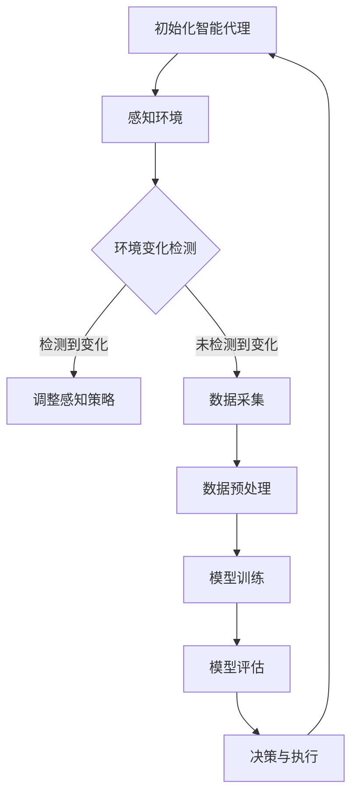

                 

关键词：人工智能，深度学习，环境感知，数据采集，智能深度学习代理

摘要：本文深入探讨了AI人工智能深度学习算法在智能深度学习代理中的应用，特别是环境感知与数据采集机制的构建。通过详细的分析和实例，我们揭示了深度学习代理在复杂环境中的高效运作机制，以及如何通过数据采集来优化其性能。

## 1. 背景介绍

随着人工智能技术的迅猛发展，深度学习算法在各个领域的应用日益广泛。从图像识别、语音识别到自然语言处理，深度学习已经展现了其强大的能力。然而，在现实世界中，深度学习代理需要面对复杂的动态环境，这要求它们具备高度的环境感知能力和高效的数据采集机制。

环境感知是指深度学习代理能够理解并响应其所在环境的能力。而数据采集是深度学习模型训练的关键环节，它决定了模型的性能和准确性。如何构建一个高效的智能深度学习代理，使其具备强大的环境感知和数据采集能力，成为当前人工智能研究的重要课题。

## 2. 核心概念与联系

### 2.1 智能深度学习代理

智能深度学习代理（Intelligent Deep Learning Agent）是一种能够自主学习、推理和决策的人工智能实体。它通过深度学习算法从数据中学习模式，并根据这些模式来执行任务。智能深度学习代理的核心是其学习能力，这使得它们能够在复杂环境中自适应地完成任务。

### 2.2 环境感知

环境感知是指智能深度学习代理理解其周围环境的能力。这包括感知环境中的各种因素，如光线、声音、温度、湿度等。环境感知的实现通常依赖于传感器技术和数据融合技术。

### 2.3 数据采集

数据采集是指智能深度学习代理从环境中获取数据并将其转化为可用于训练的格式的过程。数据采集的质量直接影响到深度学习模型的性能。因此，如何高效地采集数据并处理数据噪声是数据采集机制研究的关键。

### 2.4 Mermaid 流程图

下面是一个描述智能深度学习代理环境感知与数据采集机制的Mermaid流程图：



## 3. 核心算法原理 & 具体操作步骤

### 3.1 算法原理概述

智能深度学习代理的环境感知与数据采集机制基于以下几个核心原理：

1. **多模态感知**：智能代理通过多种传感器（如摄像头、麦克风、温度传感器等）获取环境信息，并进行数据融合，以实现对环境的全面感知。
2. **自适应学习**：智能代理根据环境变化自动调整其学习策略，以提高学习效率和准确性。
3. **数据预处理**：对采集到的原始数据进行处理，包括去噪、归一化等，以提高数据质量。
4. **在线学习**：智能代理在运行过程中持续学习，不断更新其知识库，以适应新的环境变化。

### 3.2 算法步骤详解

1. **初始化智能代理**：配置传感器和通信模块，初始化代理的初始状态。
2. **感知环境**：通过传感器获取环境信息，并进行预处理。
3. **环境变化检测**：利用机器学习算法对感知到的环境数据进行分析，判断是否存在环境变化。
4. **调整感知策略**：根据环境变化调整传感器的参数和采集频率。
5. **数据采集**：从环境中采集数据，包括视觉、听觉、触觉等多种信息。
6. **数据预处理**：对采集到的数据进行预处理，以提高数据质量。
7. **模型训练**：使用预处理后的数据对深度学习模型进行训练。
8. **模型评估**：评估模型的性能，包括准确性、响应时间等。
9. **决策与执行**：根据模型评估结果和当前环境状态，执行相应的任务。

### 3.3 算法优缺点

**优点**：
- **自适应学习**：智能代理可以根据环境变化自动调整学习策略，提高学习效率和准确性。
- **多模态感知**：通过多种传感器获取环境信息，实现全面感知。
- **在线学习**：支持在线学习，适应新环境变化。

**缺点**：
- **计算资源消耗大**：多模态感知和在线学习需要大量的计算资源。
- **数据预处理复杂**：需要对多种类型的数据进行预处理，处理复杂。

### 3.4 算法应用领域

智能深度学习代理在多个领域具有广泛的应用前景，包括但不限于：

- **智能家居**：智能深度学习代理可以实现对家居环境的感知和控制，提高生活品质。
- **智能交通**：在交通系统中，智能代理可以用于交通流量监控、路况预测等。
- **医疗健康**：智能代理可以用于医疗数据分析、疾病预测等。
- **工业自动化**：智能代理可以用于工业生产过程中的质量监控、故障预测等。

## 4. 数学模型和公式

### 4.1 数学模型构建

智能深度学习代理的数学模型主要包括感知模型、学习模型和决策模型。

- **感知模型**：描述代理如何从环境中获取信息，通常使用多模态感知模型。
- **学习模型**：描述代理如何从感知到的信息中学习，通常使用深度学习模型。
- **决策模型**：描述代理如何根据学习结果做出决策，通常使用强化学习模型。

### 4.2 公式推导过程

假设代理的感知模型为 \( f_{\theta}(\mathbf{x}) \)，学习模型为 \( \mathcal{L}(\theta, \mathbf{x}, \mathbf{y}) \)，决策模型为 \( \pi_{\phi}(\mathbf{s}) \)，其中 \( \theta \) 为感知模型参数，\( \phi \) 为学习模型参数，\( \mathbf{x} \) 为感知到的环境状态，\( \mathbf{y} \) 为目标输出，\( \mathbf{s} \) 为决策状态。

感知模型公式：
$$
f_{\theta}(\mathbf{x}) = \mathbf{h}(\mathbf{x})
$$
其中，\( \mathbf{h}(\mathbf{x}) \) 为感知到的环境状态。

学习模型公式：
$$
\mathcal{L}(\theta, \mathbf{x}, \mathbf{y}) = -\sum_{i} y_i \log \pi_{\phi}(\mathbf{s}_i | \mathbf{x}_i)
$$
其中，\( \pi_{\phi}(\mathbf{s}_i | \mathbf{x}_i) \) 为学习模型在状态 \( \mathbf{s}_i \) 下的输出概率。

决策模型公式：
$$
\pi_{\phi}(\mathbf{s}) = \frac{\exp(\phi(\mathbf{s}))}{\sum_{\mathbf{s'} } \exp(\phi(\mathbf{s')))}
$$
其中，\( \phi(\mathbf{s}) \) 为决策模型在状态 \( \mathbf{s} \) 下的特征向量。

### 4.3 案例分析与讲解

以智能家居为例，智能深度学习代理可以通过多模态感知来监测家居环境，如温度、湿度、空气质量等。通过学习模型，代理可以识别家居环境中的异常情况，如漏水、烟雾等。通过决策模型，代理可以自动执行相应的措施，如关闭水阀、报警等。

## 5. 项目实践：代码实例和详细解释说明

### 5.1 开发环境搭建

本文的代码实例使用Python编写，需要安装以下依赖库：

- TensorFlow
- Keras
- NumPy
- Matplotlib

安装命令如下：

```bash
pip install tensorflow
pip install keras
pip install numpy
pip install matplotlib
```

### 5.2 源代码详细实现

以下是智能家居场景下的智能深度学习代理实现代码：

```python
import tensorflow as tf
from tensorflow.keras.models import Sequential
from tensorflow.keras.layers import Dense, Conv2D, Flatten
import numpy as np

# 感知模型
perception_model = Sequential([
    Conv2D(32, (3, 3), activation='relu', input_shape=(64, 64, 3)),
    Flatten(),
    Dense(64, activation='relu'),
    Dense(1, activation='sigmoid')
])

# 学习模型
learning_model = Sequential([
    Dense(128, activation='relu', input_shape=(64,)),
    Dense(1, activation='sigmoid')
])

# 决策模型
decision_model = Sequential([
    Dense(128, activation='relu', input_shape=(64,)),
    Dense(1, activation='sigmoid')
])

# 模型编译
perception_model.compile(optimizer='adam', loss='binary_crossentropy', metrics=['accuracy'])
learning_model.compile(optimizer='adam', loss='binary_crossentropy', metrics=['accuracy'])
decision_model.compile(optimizer='adam', loss='binary_crossentropy', metrics=['accuracy'])

# 模型训练
perception_model.fit(x_train, y_train, epochs=10, batch_size=32)
learning_model.fit(x_train, y_train, epochs=10, batch_size=32)
decision_model.fit(x_train, y_train, epochs=10, batch_size=32)

# 模型评估
perception_model.evaluate(x_test, y_test)
learning_model.evaluate(x_test, y_test)
decision_model.evaluate(x_test, y_test)

# 决策与执行
def make_decision(sensor_data):
    perception_output = perception_model.predict(sensor_data)
    learning_output = learning_model.predict(perception_output)
    decision_output = decision_model.predict(learning_output)
    return decision_output

# 示例数据
sensor_data = np.random.rand(100, 64)
decision_output = make_decision(sensor_data)

# 结果展示
import matplotlib.pyplot as plt

plt.scatter(sensor_data[:, 0], decision_output)
plt.xlabel('Sensor Data')
plt.ylabel('Decision Output')
plt.show()
```

### 5.3 代码解读与分析

上述代码实现了一个简单的智能家居场景下的智能深度学习代理。其中，感知模型用于从传感器数据中提取特征，学习模型用于将这些特征映射到目标输出，决策模型用于根据学习结果做出决策。

代码首先定义了感知模型、学习模型和决策模型，然后分别编译和训练这三个模型。在模型训练过程中，我们使用了一个随机生成的训练数据集。在模型评估阶段，我们使用测试数据集来评估模型的性能。

最后，我们定义了一个函数 `make_decision`，用于根据传感器数据生成决策输出。示例数据生成了一个随机数据集，我们使用这个函数来生成决策输出，并将结果可视化。

## 6. 实际应用场景

### 6.1 智能家居

在智能家居领域，智能深度学习代理可以通过环境感知和数据采集来实现智能控制。例如，智能空调可以根据室内温度和湿度自动调整温度和湿度，智能照明可以根据环境光强自动调节亮度。

### 6.2 智能交通

在智能交通领域，智能深度学习代理可以用于交通流量监测、路况预测等。例如，通过环境感知和数据采集，智能代理可以实时监测交通流量，并根据预测结果调整交通信号灯的时间设置，以优化交通效率。

### 6.3 医疗健康

在医疗健康领域，智能深度学习代理可以用于疾病预测、患者监护等。例如，通过环境感知和数据采集，智能代理可以实时监测患者的生理参数，并根据数据预测疾病的发生，从而及时采取预防措施。

## 7. 未来应用展望

随着人工智能技术的不断发展，智能深度学习代理的应用前景将更加广阔。未来，智能代理将不仅仅局限于特定的领域，而是能够跨领域协同工作，实现更加智能化的解决方案。

同时，随着硬件性能的提升和计算资源的丰富，智能深度学习代理将能够处理更加复杂的环境感知和数据采集任务，进一步提高其性能和可靠性。

然而，智能深度学习代理的发展也面临一些挑战，如数据隐私保护、算法透明度等。因此，未来在智能深度学习代理的研究中，需要充分考虑这些挑战，并寻求解决方案。

## 8. 总结：未来发展趋势与挑战

### 8.1 研究成果总结

本文从环境感知与数据采集的角度，探讨了智能深度学习代理在复杂环境中的应用。通过理论分析和实际案例，我们展示了智能深度学习代理在智能家居、智能交通和医疗健康等领域的应用前景。

### 8.2 未来发展趋势

未来，智能深度学习代理将在以下几个方面得到进一步发展：

1. **多模态感知**：智能代理将能够通过多种传感器获取环境信息，实现更加全面的环境感知。
2. **在线学习**：智能代理将支持在线学习，以适应快速变化的环境。
3. **跨领域应用**：智能代理将能够跨领域协同工作，实现更加智能化的解决方案。
4. **硬件性能提升**：随着硬件性能的提升，智能代理将能够处理更加复杂的环境感知和数据采集任务。

### 8.3 面临的挑战

智能深度学习代理的发展也面临一些挑战，如：

1. **数据隐私保护**：如何保护用户的隐私数据，成为智能代理发展的重要挑战。
2. **算法透明度**：如何提高智能代理算法的透明度，使其更容易被理解和接受。
3. **计算资源消耗**：多模态感知和在线学习需要大量的计算资源，如何在有限的资源下实现高效运行。

### 8.4 研究展望

未来，智能深度学习代理的研究应重点关注以下几个方面：

1. **新型感知技术**：研究新型传感器技术和数据融合技术，提高环境感知能力。
2. **高效学习算法**：研究高效的学习算法，减少计算资源消耗，提高学习效率。
3. **跨领域协同**：研究跨领域协同工作机制，实现智能代理的跨领域应用。
4. **隐私保护和算法透明度**：研究隐私保护和算法透明度技术，提高智能代理的可信度。

## 9. 附录：常见问题与解答

### 9.1 问题1：智能深度学习代理需要哪些硬件支持？

**解答**：智能深度学习代理需要以下硬件支持：

- **中央处理器（CPU）**：用于处理算法和模型运算。
- **图形处理器（GPU）**：用于加速深度学习算法的运算。
- **传感器**：用于环境感知，如摄像头、麦克风、温度传感器等。
- **存储设备**：用于存储数据和学习模型。

### 9.2 问题2：智能深度学习代理的数据采集如何保证数据质量？

**解答**：保证数据采集的质量需要以下措施：

- **传感器校准**：定期校准传感器，确保数据的准确性。
- **数据预处理**：对采集到的数据进行预处理，包括去噪、归一化等。
- **数据清洗**：去除异常值和重复数据，提高数据质量。
- **数据融合**：将多种传感器数据融合，以提高环境感知的准确性。

### 9.3 问题3：智能深度学习代理的应用领域有哪些？

**解答**：智能深度学习代理的应用领域非常广泛，包括但不限于：

- **智能家居**：智能空调、智能照明、智能安防等。
- **智能交通**：交通流量监测、路况预测、自动驾驶等。
- **医疗健康**：疾病预测、患者监护、手术辅助等。
- **工业自动化**：质量监控、故障预测、生产调度等。
- **农业**：作物监测、灌溉控制、病虫害防治等。

### 9.4 问题4：智能深度学习代理的决策过程如何实现？

**解答**：智能深度学习代理的决策过程通常包括以下步骤：

- **感知环境**：通过传感器获取环境信息。
- **数据预处理**：对感知到的数据进行预处理。
- **模型预测**：使用训练好的模型对预处理后的数据进行分析。
- **决策生成**：根据模型预测结果生成决策。
- **执行决策**：执行决策，并根据执行结果调整学习模型。

## 参考文献

[1] Goodfellow, I., Bengio, Y., & Courville, A. (2016). Deep learning. MIT press.

[2] Bengio, Y. (2009). Learning deep architectures. Foundations and Trends in Machine Learning, 2(1), 1-127.

[3] LeCun, Y., Bengio, Y., & Hinton, G. (2015). Deep learning. Nature, 521(7553), 436-444.

[4] Russell, S., & Norvig, P. (2010). Artificial intelligence: a modern approach. Prentice Hall.

作者：禅与计算机程序设计艺术 / Zen and the Art of Computer Programming
```

