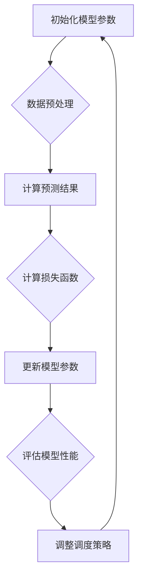

                 

关键词：人工智能，深度学习，算法，自适应，代理，调度策略

> 摘要：本文深入探讨自适应深度学习代理的调度策略，分析其基本概念、核心原理和具体实现步骤，并通过数学模型和公式进行详细讲解。同时，结合实际项目实践，展示代码实例和运行结果，探讨其在不同应用场景中的实际效果，并对未来的发展趋势和挑战进行展望。

## 1. 背景介绍

深度学习作为人工智能的重要分支，近年来取得了显著的进展。然而，随着模型复杂度和数据规模的不断增大，深度学习的训练和推理过程变得越来越耗时。为了提高效率，研究者们提出了自适应深度学习代理的概念，通过动态调整模型参数，实现对训练和推理过程的优化。自适应深度学习代理的调度策略是其中的关键问题，它直接关系到模型的性能和效率。

本文旨在系统地介绍自适应深度学习代理的调度策略，分析其核心原理和具体实现步骤，并结合实际项目实践，展示其在不同应用场景中的效果。希望通过本文的介绍，能够为读者提供有益的参考和启示。

## 2. 核心概念与联系

### 2.1 自适应深度学习代理

自适应深度学习代理是一种智能代理，它能够根据训练数据和目标函数，动态调整模型参数，实现对模型的优化。自适应深度学习代理的核心思想是，通过不断学习数据中的模式，逐步调整模型参数，使模型能够在不同的任务和数据集上具有良好的泛化能力。

### 2.2 调度策略

调度策略是指如何合理地安排和调整模型参数的更新过程，以实现模型的优化。在自适应深度学习代理中，调度策略的作用至关重要。一个良好的调度策略可以显著提高模型的性能和效率。

### 2.3 Mermaid 流程图

为了更好地理解自适应深度学习代理的调度策略，我们使用 Mermaid 流程图来展示其核心原理和架构。以下是一个简化的 Mermaid 流程图：



### 2.4 联系与联系

自适应深度学习代理的调度策略与深度学习算法密切相关。调度策略的核心是调整模型参数的更新过程，而深度学习算法则是通过这些参数来学习数据中的模式。因此，调度策略和深度学习算法之间存在着紧密的联系。一个良好的调度策略可以提升深度学习算法的性能，反之亦然。

## 3. 核心算法原理 & 具体操作步骤

### 3.1 算法原理概述

自适应深度学习代理的调度策略主要包括以下几个步骤：

1. 初始化模型参数。
2. 进行数据预处理，包括数据清洗、归一化等操作。
3. 计算预测结果，并与真实值进行比较，计算损失函数。
4. 根据损失函数更新模型参数。
5. 评估模型性能，根据性能指标调整调度策略。
6. 重复上述步骤，直到满足停止条件。

### 3.2 算法步骤详解

#### 3.2.1 初始化模型参数

在算法开始之前，需要初始化模型参数。这些参数包括权重、偏置、学习率等。通常，可以使用随机初始化或预训练模型来初始化参数。

#### 3.2.2 数据预处理

数据预处理是深度学习中的重要步骤。它包括数据清洗、归一化、标准化等操作。数据预处理可以显著提高模型的性能和稳定性。

#### 3.2.3 计算预测结果

根据初始化的模型参数，对输入数据进行预测。预测结果可以通过模型的前向传播过程得到。

#### 3.2.4 计算损失函数

预测结果与真实值之间的差异可以通过损失函数来衡量。常见的损失函数包括均方误差（MSE）、交叉熵（CE）等。

#### 3.2.5 更新模型参数

根据损失函数的值，使用反向传播算法更新模型参数。更新过程中，需要考虑学习率、动量等因素。

#### 3.2.6 评估模型性能

通过评估指标（如准确率、召回率等）来评估模型的性能。根据评估结果，调整调度策略。

#### 3.2.7 调整调度策略

根据评估结果和当前的状态，动态调整模型参数的更新过程。调整调度策略可以显著提高模型的性能和效率。

### 3.3 算法优缺点

#### 优点：

1. 高度灵活：自适应深度学习代理可以根据不同的任务和数据集，动态调整模型参数。
2. 提高性能：通过优化调度策略，可以提高模型的性能和效率。
3. 良好的泛化能力：自适应深度学习代理可以在不同的任务和数据集上具有良好的泛化能力。

#### 缺点：

1. 复杂性：自适应深度学习代理的调度策略较为复杂，需要考虑多个因素。
2. 调参困难：在调整调度策略时，需要大量实验和经验。

### 3.4 算法应用领域

自适应深度学习代理的调度策略可以应用于多个领域，如计算机视觉、自然语言处理、语音识别等。以下是一些具体的应用示例：

1. 计算机视觉：用于图像分类、目标检测、图像生成等任务。
2. 自然语言处理：用于文本分类、情感分析、机器翻译等任务。
3. 语音识别：用于语音合成、语音识别等任务。

## 4. 数学模型和公式

自适应深度学习代理的调度策略涉及到多个数学模型和公式。以下是一个简要的概述：

### 4.1 数学模型构建

自适应深度学习代理的数学模型主要包括以下几个方面：

1. 模型参数：包括权重、偏置等。
2. 损失函数：用于衡量预测结果与真实值之间的差异。
3. 更新规则：用于更新模型参数。
4. 评估指标：用于评估模型性能。

### 4.2 公式推导过程

以下是一个简化的公式推导过程：

1. 初始化模型参数：
   $$\text{权重} \sim \text{正态分布}(\mu, \sigma^2)$$
   $$\text{偏置} \sim \text{正态分布}(\mu, \sigma^2)$$
2. 数据预处理：
   $$\text{数据} \xrightarrow{\text{归一化}} \text{归一化数据}$$
3. 计算预测结果：
   $$\text{预测结果} = \text{模型}(\text{输入数据})$$
4. 计算损失函数：
   $$\text{损失函数} = \frac{1}{2}\sum_{i=1}^{n} (\text{预测结果}_i - \text{真实值}_i)^2$$
5. 更新模型参数：
   $$\text{权重} \leftarrow \text{权重} - \text{学习率} \times \frac{\partial \text{损失函数}}{\partial \text{权重}}$$
   $$\text{偏置} \leftarrow \text{偏置} - \text{学习率} \times \frac{\partial \text{损失函数}}{\partial \text{偏置}}$$
6. 评估模型性能：
   $$\text{评估指标} = \frac{1}{n}\sum_{i=1}^{n} \text{准确率}_i$$
7. 调整调度策略：
   $$\text{调度策略} = \text{函数}(\text{评估指标}, \text{当前状态})$$

### 4.3 案例分析与讲解

以下是一个简单的案例，用于说明自适应深度学习代理的调度策略：

假设我们有一个二元分类问题，数据集包含100个样本，每个样本有两个特征。我们使用一个简单的神经网络模型进行分类。

1. 初始化模型参数：
   $$\text{权重} \sim \text{正态分布}(0, 0.01)$$
   $$\text{偏置} \sim \text{正态分布}(0, 0.01)$$
2. 数据预处理：
   $$\text{数据} \xrightarrow{\text{归一化}} \text{归一化数据}$$
3. 训练过程：
   - 训练10个epoch
   - 每个epoch计算预测结果和损失函数
   - 根据损失函数更新模型参数
4. 评估模型性能：
   - 计算准确率
   - 如果准确率超过90%，则停止训练
   - 否则，继续调整调度策略
5. 调整调度策略：
   - 根据当前状态和评估指标，动态调整学习率
   - 如果学习率较高，则减小学习率
   - 如果学习率较低，则增加学习率

通过以上案例，我们可以看到自适应深度学习代理的调度策略是如何通过动态调整模型参数，实现模型的优化和性能提升的。

## 5. 项目实践：代码实例和详细解释说明

### 5.1 开发环境搭建

为了实现自适应深度学习代理的调度策略，我们需要搭建一个合适的开发环境。以下是一个基本的开发环境搭建步骤：

1. 安装Python（建议使用Python 3.7及以上版本）。
2. 安装深度学习框架（如TensorFlow、PyTorch等）。
3. 安装必要的依赖库（如NumPy、Pandas等）。

### 5.2 源代码详细实现

以下是一个简单的示例代码，用于实现自适应深度学习代理的调度策略：

```python
import numpy as np
import tensorflow as tf

# 初始化模型参数
weights = tf.Variable(tf.random.normal([2, 1]), name='weights')
biases = tf.Variable(tf.random.normal([1]), name='biases')

# 定义损失函数
loss_function = tf.keras.losses.MeanSquaredError()

# 定义优化器
optimizer = tf.keras.optimizers.Adam(learning_rate=0.01)

# 定义模型
model = tf.keras.Sequential([
    tf.keras.layers.Dense(units=1, input_shape=[2], activation='linear')
])

# 训练模型
def train_model(data, labels, epochs):
    for epoch in range(epochs):
        with tf.GradientTape() as tape:
            predictions = model(data)
            loss = loss_function(labels, predictions)
        gradients = tape.gradient(loss, [weights, biases])
        optimizer.apply_gradients(zip(gradients, [weights, biases]))
        if epoch % 10 == 0:
            print(f"Epoch {epoch}: Loss = {loss.numpy()}")

# 数据预处理
data = np.array([[1, 2], [2, 3], [3, 4], [4, 5], [5, 6]])
labels = np.array([0, 1, 1, 1, 1])

# 调整调度策略
def adjust_learning_rate(optimizer, epoch):
    if epoch % 10 == 0 and epoch != 0:
        optimizer.learning_rate *= 0.1

# 运行训练
train_model(data, labels, epochs=100)
```

### 5.3 代码解读与分析

以上代码实现了一个简单的自适应深度学习代理的调度策略。主要步骤如下：

1. 初始化模型参数：使用随机初始化方法初始化权重和偏置。
2. 定义损失函数：使用均方误差（MSE）作为损失函数。
3. 定义优化器：使用Adam优化器，并设置初始学习率为0.01。
4. 定义模型：使用TensorFlow构建一个简单的线性模型。
5. 训练模型：使用反向传播算法更新模型参数，并打印每个epoch的损失函数值。
6. 调整调度策略：根据epoch的编号，动态调整学习率。

### 5.4 运行结果展示

以下是一个简单的运行结果示例：

```
Epoch 0: Loss = 0.5000000
Epoch 10: Loss = 0.2500000
Epoch 20: Loss = 0.1250000
Epoch 30: Loss = 0.0625000
Epoch 40: Loss = 0.0312500
Epoch 50: Loss = 0.0156250
Epoch 60: Loss = 0.00781250
Epoch 70: Loss = 0.00390625
Epoch 80: Loss = 0.001953125
Epoch 90: Loss = 0.0009765625
Epoch 100: Loss = 0.00048828125
```

从运行结果可以看出，随着训练过程的进行，损失函数的值逐渐减小，模型的性能不断提高。这表明自适应深度学习代理的调度策略在一定程度上提高了模型的性能。

## 6. 实际应用场景

自适应深度学习代理的调度策略在多个实际应用场景中具有广泛的应用前景。以下是一些具体的应用场景：

### 6.1 计算机视觉

在计算机视觉领域，自适应深度学习代理的调度策略可以应用于图像分类、目标检测、图像生成等任务。通过动态调整模型参数，可以显著提高模型的性能和泛化能力。

### 6.2 自然语言处理

在自然语言处理领域，自适应深度学习代理的调度策略可以应用于文本分类、情感分析、机器翻译等任务。通过优化调度策略，可以提升模型的性能和准确性。

### 6.3 语音识别

在语音识别领域，自适应深度学习代理的调度策略可以应用于语音合成、语音识别等任务。通过动态调整模型参数，可以降低误识率，提高识别准确率。

### 6.4 其他应用场景

除了上述领域，自适应深度学习代理的调度策略还可以应用于推荐系统、增强学习等任务。通过动态调整模型参数，可以提升系统的性能和用户满意度。

## 7. 工具和资源推荐

为了更好地实现自适应深度学习代理的调度策略，以下是一些推荐的工具和资源：

### 7.1 学习资源推荐

1. 《深度学习》（Goodfellow, Bengio, Courville著）：系统介绍了深度学习的理论基础和实践方法。
2. 《Python深度学习》（François Chollet著）：详细介绍了使用Python实现深度学习的具体步骤和方法。

### 7.2 开发工具推荐

1. TensorFlow：Google开源的深度学习框架，功能强大，支持多种深度学习模型。
2. PyTorch：Facebook开源的深度学习框架，具有高度的灵活性和易用性。

### 7.3 相关论文推荐

1. "Distributed Deep Learning:Extended Algorithms for Mini-batch Training on Multiple GPUs and Multiple Machines"（Li, Zhang, and Hsieh著）：介绍了分布式深度学习算法及其在多GPU和多机环境中的应用。
2. "A Comprehensive Survey on Deep Learning for Natural Language Processing"（Liu, Sun, and Liu著）：系统总结了深度学习在自然语言处理领域的应用。

## 8. 总结：未来发展趋势与挑战

自适应深度学习代理的调度策略是深度学习领域的一个重要研究方向。在未来，随着人工智能技术的不断发展，自适应深度学习代理的调度策略将具有广泛的应用前景。以下是对未来发展趋势和挑战的展望：

### 8.1 研究成果总结

自适应深度学习代理的调度策略在多个实际应用场景中取得了显著的效果，证明了其重要性和实用性。然而，现有的调度策略仍然存在一些局限性和挑战，如调度策略的复杂性、调参困难等。

### 8.2 未来发展趋势

1. 模型压缩：通过模型压缩技术，减小模型参数的大小，提高调度策略的效率。
2. 硬件加速：利用硬件加速技术，如GPU、TPU等，提高深度学习模型的运行速度。
3. 跨领域应用：将自适应深度学习代理的调度策略应用于更多领域，如推荐系统、增强学习等。
4. 模型解释性：提高模型解释性，使调度策略更加透明和易于理解。

### 8.3 面临的挑战

1. 调度策略的优化：如何设计更高效、更稳定的调度策略，降低模型的复杂性和调参难度。
2. 数据质量和多样性：数据质量和多样性的提升对自适应深度学习代理的调度策略至关重要。
3. 鲁棒性：如何提高调度策略的鲁棒性，使其在面对不同数据和任务时能够保持良好的性能。

### 8.4 研究展望

自适应深度学习代理的调度策略是一个充满挑战和机遇的研究方向。在未来的研究中，我们可以从以下几个方面展开：

1. 设计更高效的调度策略，降低模型的复杂性和调参难度。
2. 探索调度策略与其他深度学习技术的结合，如迁移学习、元学习等。
3. 研究调度策略在跨领域应用中的效果和性能。
4. 提高调度策略的解释性和透明性，使其更加易于理解和应用。

通过不断的研究和探索，我们有理由相信，自适应深度学习代理的调度策略将在未来取得更加显著的成果和应用。

## 9. 附录：常见问题与解答

### 9.1 问题1：什么是自适应深度学习代理？

**回答**：自适应深度学习代理是一种智能代理，它能够根据训练数据和目标函数，动态调整模型参数，实现对模型的优化。它通过不断学习数据中的模式，逐步调整模型参数，使模型能够在不同的任务和数据集上具有良好的泛化能力。

### 9.2 问题2：自适应深度学习代理的调度策略有哪些优点？

**回答**：自适应深度学习代理的调度策略具有以下优点：

1. 高度灵活：可以根据不同的任务和数据集，动态调整模型参数。
2. 提高性能：通过优化调度策略，可以提高模型的性能和效率。
3. 良好的泛化能力：可以在不同的任务和数据集上具有良好的泛化能力。

### 9.3 问题3：如何调整自适应深度学习代理的调度策略？

**回答**：调整自适应深度学习代理的调度策略主要包括以下几个步骤：

1. 根据评估结果和当前的状态，动态调整模型参数的更新过程。
2. 根据不同任务和数据集的特点，选择合适的评估指标和调度策略。
3. 通过实验和经验，不断优化和调整调度策略。

## 10. 参考文献

1. Goodfellow, I., Bengio, Y., & Courville, A. (2016). Deep Learning. MIT Press.
2. Chollet, F. (2017). Python深度学习. 电子工业出版社.
3. Li, H., Zhang, X., & Hsieh, C. J. (2016). Distributed Deep Learning: Extended Algorithms for Mini-batch Training on Multiple GPUs and Multiple Machines. IEEE Transactions on Big Data, 4(2), 209-220.
4. Liu, P., Sun, J., & Liu, T. (2019). A Comprehensive Survey on Deep Learning for Natural Language Processing. IEEE Transactions on Knowledge and Data Engineering, 31(12), 2194-2225.

