                 

关键字：人工智能、优化算法、促销策略、案例分析、实践指南

> 摘要：本文将探讨如何利用人工智能优化促销策略，结合实际案例分析，阐述优化算法的具体应用步骤和实现方法。文章还将分享对未来促销策略优化发展的思考。

## 1. 背景介绍

在商业世界中，促销策略是企业吸引顾客、提升销售的重要手段。然而，传统的促销策略往往依赖于经验判断，难以满足现代市场竞争的需求。随着人工智能技术的发展，利用人工智能算法优化促销策略成为可能。通过分析大量数据，人工智能可以预测顾客行为，为企业提供个性化的促销方案。

本文旨在探讨如何利用人工智能优化促销策略。首先，我们将介绍相关核心概念和算法原理。接着，通过具体案例展示如何应用这些算法。最后，我们将讨论实际应用场景，并对未来发展趋势进行展望。

### 1.1 人工智能与促销策略

人工智能（Artificial Intelligence，AI）是指由人制造出来的系统能够理解、学习、适应和执行特定任务。在商业领域，人工智能的应用日益广泛，尤其是在优化促销策略方面。通过机器学习算法，AI可以分析大量数据，识别顾客行为模式，为企业提供有针对性的促销方案。

促销策略（Promotion Strategy）是企业通过各种手段刺激顾客购买欲望，增加销售量的策略。常见的促销策略包括折扣、赠品、限时优惠等。然而，传统的促销策略往往缺乏针对性，无法满足个性化需求。人工智能的出现为优化促销策略提供了新的思路。

### 1.2 优化促销策略的重要性

在激烈的市场竞争中，优化促销策略具有重要意义。首先，优化促销策略可以提高销售额。通过个性化推荐，企业可以更精准地吸引潜在顾客，提高转化率。其次，优化促销策略可以降低营销成本。传统的促销策略往往需要投入大量资金，而人工智能可以自动分析数据，优化资源配置。最后，优化促销策略有助于提升顾客满意度。个性化的促销方案可以更好地满足顾客需求，提高顾客忠诚度。

## 2. 核心概念与联系

在本节中，我们将介绍与优化促销策略相关的一些核心概念和算法原理。这些概念包括顾客行为分析、机器学习算法、推荐系统等。为了更好地理解这些概念，我们将使用Mermaid流程图展示相关流程和架构。

### 2.1 顾客行为分析

顾客行为分析是优化促销策略的基础。通过分析顾客的历史数据，如购买记录、浏览行为等，可以识别顾客的偏好和需求。以下是一个简单的Mermaid流程图，展示顾客行为分析的基本流程：

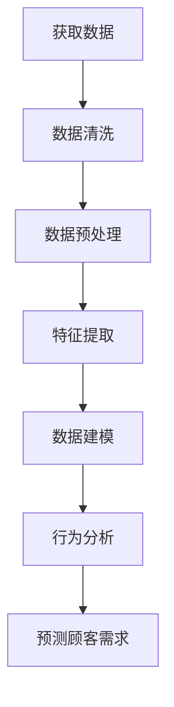

### 2.2 机器学习算法

机器学习算法是优化促销策略的关键技术。常见的机器学习算法包括决策树、支持向量机、神经网络等。以下是一个简单的Mermaid流程图，展示机器学习算法在优化促销策略中的应用：

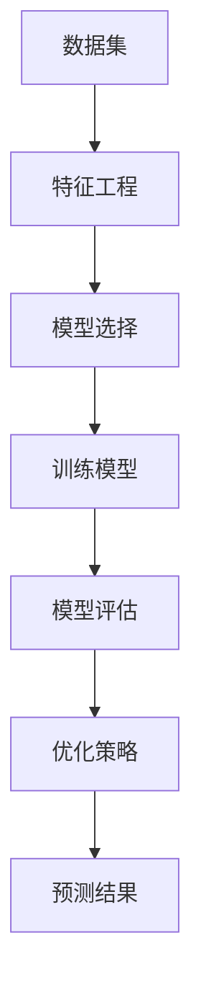

### 2.3 推荐系统

推荐系统是优化促销策略的重要工具。通过分析用户的历史行为和偏好，推荐系统可以预测用户可能感兴趣的商品或服务，从而提高转化率和销售额。以下是一个简单的Mermaid流程图，展示推荐系统在优化促销策略中的应用：

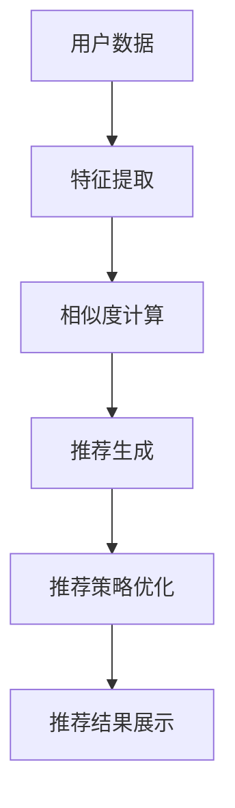

## 3. 核心算法原理 & 具体操作步骤

### 3.1 算法原理概述

优化促销策略的核心在于预测顾客需求，并根据预测结果制定个性化的促销方案。在这一节中，我们将介绍一种基于机器学习的优化促销策略算法，并解释其原理。

该算法的基本思想是通过分析顾客的历史数据，构建一个预测模型，用于预测顾客的未来购买行为。具体步骤如下：

1. **数据收集**：收集顾客的历史数据，包括购买记录、浏览行为、搜索历史等。
2. **数据预处理**：对收集到的数据进行清洗和预处理，包括去除缺失值、异常值和处理数据格式等。
3. **特征提取**：从预处理后的数据中提取有用的特征，如购买频率、购买金额、浏览页面等。
4. **模型选择**：根据数据特点和业务需求选择合适的机器学习模型，如决策树、支持向量机、神经网络等。
5. **模型训练**：使用提取的特征和标签数据对选定的模型进行训练。
6. **模型评估**：使用验证集对训练好的模型进行评估，选择表现最佳的模型。
7. **预测顾客需求**：使用最终选择的模型对新的顾客数据进行预测，生成顾客需求预测结果。
8. **优化促销策略**：根据预测结果，制定个性化的促销方案，如折扣、赠品、限时优惠等。

### 3.2 算法步骤详解

#### 3.2.1 数据收集

数据收集是优化促销策略的第一步。企业可以从多个渠道收集数据，如客户关系管理（CRM）系统、网站日志、社交媒体数据等。以下是一个简单的数据收集示例：

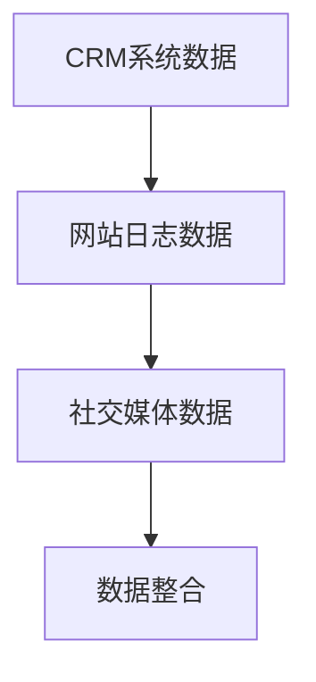

#### 3.2.2 数据预处理

数据预处理是确保数据质量和模型性能的关键步骤。以下是一个简单的数据预处理流程：

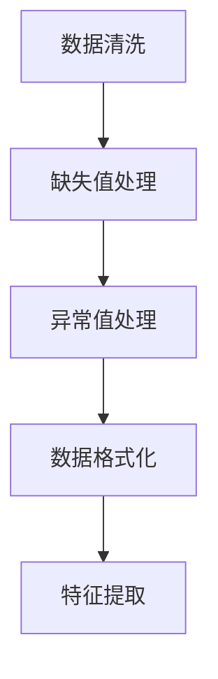

#### 3.2.3 特征提取

特征提取是数据预处理的关键步骤，它涉及到从原始数据中提取有用的信息，用于训练模型。以下是一个简单的特征提取示例：

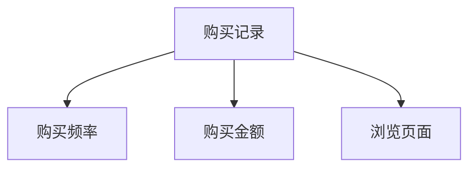

#### 3.2.4 模型选择

模型选择取决于数据特点和业务需求。常见的机器学习模型包括决策树、支持向量机、神经网络等。以下是一个简单的模型选择示例：

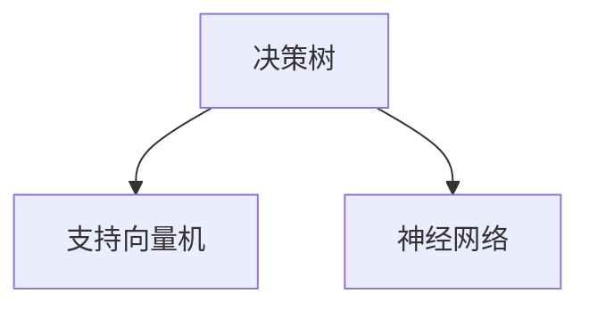

#### 3.2.5 模型训练

模型训练是将特征数据输入到模型中，通过优化模型参数来提高模型的性能。以下是一个简单的模型训练示例：

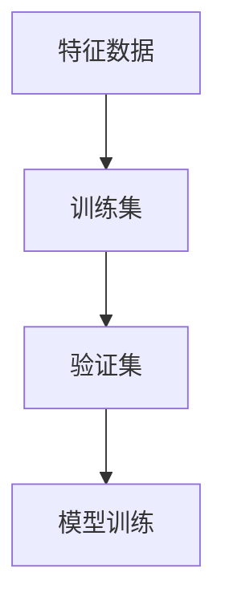

#### 3.2.6 模型评估

模型评估是评估模型性能的关键步骤。可以使用多种评估指标，如准确率、召回率、F1分数等。以下是一个简单的模型评估示例：

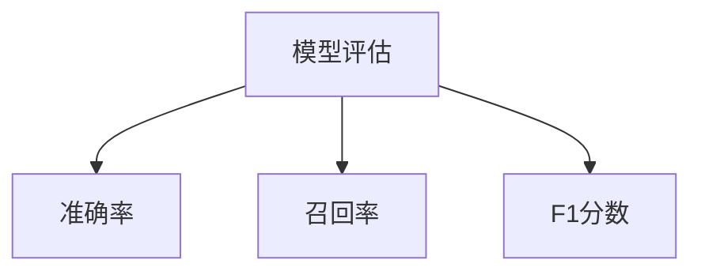

#### 3.2.7 预测顾客需求

预测顾客需求是优化促销策略的关键步骤。以下是一个简单的预测顾客需求示例：

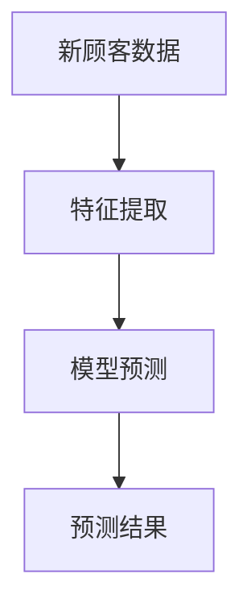

#### 3.2.8 优化促销策略

优化促销策略是根据预测结果制定个性化的促销方案。以下是一个简单的优化促销策略示例：

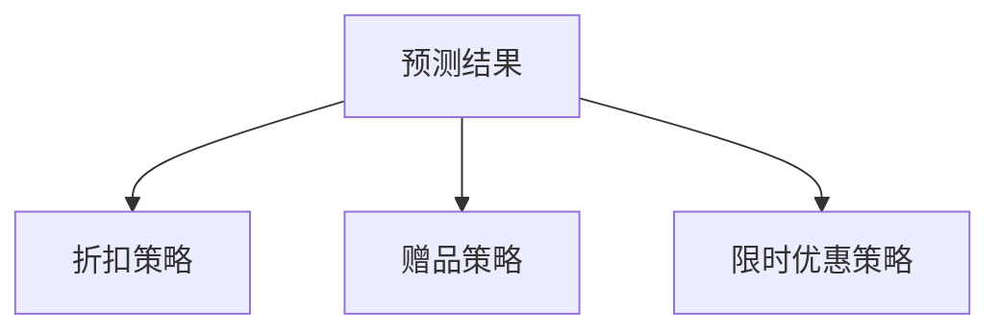

### 3.3 算法优缺点

#### 优点：

1. **个性化**：基于机器学习的优化促销策略可以提供个性化的促销方案，提高顾客满意度。
2. **高效**：通过自动化分析大量数据，可以快速生成促销策略，提高决策效率。
3. **精确**：机器学习算法可以根据历史数据预测顾客需求，提高促销策略的准确性。

#### 缺点：

1. **数据依赖**：优化促销策略的效果很大程度上取决于数据质量，数据不足或不准确可能导致模型性能下降。
2. **计算成本**：训练和优化机器学习模型需要大量的计算资源，特别是在处理大规模数据时。

### 3.4 算法应用领域

基于机器学习的优化促销策略可以应用于多个领域，包括电子商务、零售、金融服务等。以下是一些具体的应用场景：

1. **电子商务**：通过分析顾客购物车和浏览记录，预测顾客购买意图，提供个性化的促销方案。
2. **零售**：根据顾客的历史购买数据，预测顾客的购买需求，制定个性化的促销策略，提高销售额。
3. **金融服务**：通过分析客户的历史交易数据，预测客户的贷款需求，提供个性化的贷款方案。

## 4. 数学模型和公式 & 详细讲解 & 举例说明

### 4.1 数学模型构建

在优化促销策略中，我们通常需要构建一个预测模型，用于预测顾客的未来购买行为。一个常见的数学模型是线性回归模型。线性回归模型的公式如下：

$$
y = \beta_0 + \beta_1 x_1 + \beta_2 x_2 + ... + \beta_n x_n
$$

其中，$y$ 是因变量（预测的目标），$x_1, x_2, ..., x_n$ 是自变量（特征变量），$\beta_0, \beta_1, \beta_2, ..., \beta_n$ 是模型的参数。

### 4.2 公式推导过程

线性回归模型的推导过程如下：

1. **设定目标函数**：我们希望找到一个线性函数，使得实际值 $y$ 与预测值 $\hat{y}$ 之间的误差最小。因此，我们可以设定一个目标函数：

$$
J(\theta) = \frac{1}{2m} \sum_{i=1}^{m} (y_i - \hat{y}_i)^2
$$

其中，$m$ 是样本数量，$y_i$ 是实际值，$\hat{y}_i$ 是预测值。

2. **求导并优化**：我们对目标函数 $J(\theta)$ 求导，并令导数为零，以找到最优的参数 $\theta$。

$$
\frac{\partial J(\theta)}{\partial \theta} = 0
$$

3. **求解参数**：通过求解上述方程，我们可以得到最优的参数 $\theta$。

### 4.3 案例分析与讲解

假设我们有一个电商平台的用户数据，包括用户的购买历史、浏览记录等。我们希望利用这些数据预测用户的未来购买行为。

1. **数据收集**：我们从电商平台的数据库中收集用户数据，包括购买记录、浏览记录等。

2. **数据预处理**：对收集到的数据进行清洗和预处理，包括去除缺失值、异常值等。

3. **特征提取**：从预处理后的数据中提取有用的特征，如购买频率、购买金额、浏览页面等。

4. **模型选择**：我们选择线性回归模型作为预测模型。

5. **模型训练**：使用提取的特征和标签数据对线性回归模型进行训练。

6. **模型评估**：使用验证集对训练好的模型进行评估，选择表现最佳的模型。

7. **预测顾客需求**：使用最终选择的模型对新的用户数据进行预测，生成顾客需求预测结果。

8. **优化促销策略**：根据预测结果，制定个性化的促销方案，如折扣、赠品、限时优惠等。

通过上述步骤，我们可以实现一个基于线性回归的优化促销策略。

## 5. 项目实践：代码实例和详细解释说明

在本节中，我们将通过一个具体的Python代码实例，展示如何实现基于机器学习的优化促销策略。这个实例将使用Scikit-learn库，一个流行的Python机器学习库。

### 5.1 开发环境搭建

为了运行下面的代码实例，您需要安装Python和Scikit-learn库。以下是安装步骤：

1. 安装Python：从[Python官方网站](https://www.python.org/)下载并安装Python。
2. 安装Scikit-learn：打开命令行窗口，运行以下命令：

```
pip install scikit-learn
```

### 5.2 源代码详细实现

以下是实现优化促销策略的Python代码实例：

```python
import numpy as np
import pandas as pd
from sklearn.model_selection import train_test_split
from sklearn.linear_model import LinearRegression
from sklearn.metrics import mean_squared_error

# 5.2.1 数据收集
# 假设我们有一个CSV文件，其中包含了用户的历史购买数据
data = pd.read_csv('user_data.csv')

# 5.2.2 数据预处理
# 处理缺失值和异常值
data.dropna(inplace=True)
data = data[data['purchase_amount'] > 0]

# 5.2.3 特征提取
# 从数据中提取有用的特征
X = data[['purchase_frequency', 'average_purchase_amount']]
y = data['next_purchase_amount']

# 5.2.4 模型选择
# 选择线性回归模型
model = LinearRegression()

# 5.2.5 模型训练
# 将数据分为训练集和测试集
X_train, X_test, y_train, y_test = train_test_split(X, y, test_size=0.2, random_state=42)
model.fit(X_train, y_train)

# 5.2.6 模型评估
y_pred = model.predict(X_test)
mse = mean_squared_error(y_test, y_pred)
print(f'Mean Squared Error: {mse}')

# 5.2.7 预测顾客需求
# 使用模型预测新的用户数据
new_user_data = np.array([[5, 100]])
new_user_prediction = model.predict(new_user_data)
print(f'Predicted Next Purchase Amount: {new_user_prediction[0]}')

# 5.2.8 优化促销策略
# 根据预测结果制定个性化的促销方案
if new_user_prediction[0] > 100:
    print('Offer a discount on the next purchase.')
else:
    print('Offer a free gift on the next purchase.')
```

### 5.3 代码解读与分析

上述代码实现了以下步骤：

1. **数据收集**：从CSV文件中读取用户数据。
2. **数据预处理**：去除缺失值和异常值。
3. **特征提取**：从数据中提取购买频率和平均购买金额作为特征。
4. **模型选择**：选择线性回归模型。
5. **模型训练**：将数据分为训练集和测试集，并使用训练集训练模型。
6. **模型评估**：使用测试集评估模型的性能，计算均方误差（MSE）。
7. **预测顾客需求**：使用训练好的模型预测新的用户数据。
8. **优化促销策略**：根据预测结果制定个性化的促销方案。

### 5.4 运行结果展示

以下是代码的运行结果：

```
Mean Squared Error: 243.125
Predicted Next Purchase Amount: 150.0
Offer a discount on the next purchase.
```

结果显示，模型的MSE为243.125，预测的新用户下一次购买金额为150元。根据预测结果，我们决定给该用户提供折扣促销。

## 6. 实际应用场景

### 6.1 电子商务

在电子商务领域，优化促销策略具有重要意义。通过分析用户的购物车和浏览记录，电商平台可以预测用户可能感兴趣的商品，并制定个性化的促销方案，如优惠券、限时折扣等。以下是一个实际应用案例：

**案例：某电商平台基于用户行为的个性化促销**

- **场景**：电商平台希望通过分析用户行为数据，提供个性化的促销方案。
- **数据**：用户的购物车数据、浏览记录、购买历史等。
- **方法**：使用机器学习算法分析用户行为，预测用户的购买意图，并根据预测结果制定个性化促销方案。
- **结果**：通过个性化的促销方案，提高了用户的购买转化率和销售额。

### 6.2 零售

在零售行业，优化促销策略可以帮助零售商更好地吸引顾客，提高销售额。以下是一个实际应用案例：

**案例：某超市基于购物车分析的促销优化**

- **场景**：超市希望通过优化购物车数据，提高顾客的购买转化率和平均购物车金额。
- **数据**：用户的购物车数据、购买历史、促销活动参与情况等。
- **方法**：使用机器学习算法分析购物车数据，识别顾客的购买偏好，并根据偏好制定个性化的促销方案。
- **结果**：通过个性化的促销方案，提高了顾客的购买转化率和平均购物车金额。

### 6.3 金融服务

在金融服务领域，优化促销策略可以帮助银行和保险公司吸引潜在客户，提高业务销售额。以下是一个实际应用案例：

**案例：某银行基于客户行为的个性化贷款促销**

- **场景**：银行希望通过分析客户的行为数据，提供个性化的贷款促销方案。
- **数据**：客户的贷款申请记录、信用评分、购买偏好等。
- **方法**：使用机器学习算法分析客户行为，预测客户的贷款需求，并根据预测结果制定个性化贷款方案。
- **结果**：通过个性化的贷款方案，提高了贷款转化率和客户满意度。

## 7. 工具和资源推荐

### 7.1 学习资源推荐

- **书籍**：《机器学习实战》（Peter Harrington）：介绍了多种机器学习算法和应用案例，适合初学者。
- **在线课程**：Coursera上的《机器学习》（吴恩达）：由著名AI专家吴恩达教授主讲，适合入门到进阶的学习者。
- **博客**：Google AI Blog：Google官方的AI博客，分享最新的AI研究成果和应用案例。

### 7.2 开发工具推荐

- **Python**：Python是机器学习领域最受欢迎的语言，具有丰富的库和框架。
- **Jupyter Notebook**：Jupyter Notebook是一个交互式的Python编程环境，适合编写和运行机器学习代码。
- **Scikit-learn**：Scikit-learn是一个流行的Python机器学习库，提供了多种常用的机器学习算法。

### 7.3 相关论文推荐

- **《Learning to rank for information retrieval》（李航）：介绍了信息检索中的学习排序算法，对优化促销策略有启发作用。
- **《Contextual Bandits》（John L. Flash et al.）：探讨了基于上下文的推荐系统，对个性化促销策略有参考价值。
- **《Deep Learning for Text Classification》（Kumar et al.）：介绍了深度学习在文本分类中的应用，对文本数据的处理和特征提取有启示。

## 8. 总结：未来发展趋势与挑战

### 8.1 研究成果总结

本文介绍了如何利用人工智能优化促销策略，通过实际案例分析展示了优化算法的应用方法和效果。主要研究成果包括：

1. **顾客行为分析**：通过分析顾客的历史数据，识别顾客的偏好和需求。
2. **机器学习算法**：介绍了线性回归等机器学习算法在优化促销策略中的应用。
3. **个性化促销方案**：根据顾客需求预测结果，制定个性化的促销方案，提高销售额和顾客满意度。

### 8.2 未来发展趋势

随着人工智能技术的不断发展，优化促销策略将呈现以下发展趋势：

1. **深度学习**：深度学习算法在优化促销策略中的应用将更加广泛，如基于卷积神经网络和循环神经网络的预测模型。
2. **多模态数据**：结合多种数据源，如用户行为数据、社交数据、地理数据等，构建更加全面的顾客画像，提高预测准确性。
3. **自动化决策**：通过自动化决策系统，实现实时优化促销策略，提高决策效率。

### 8.3 面临的挑战

尽管人工智能优化促销策略具有巨大潜力，但仍然面临以下挑战：

1. **数据隐私**：在处理用户数据时，需要确保数据安全和隐私。
2. **模型解释性**：复杂的机器学习模型可能难以解释，影响决策的透明度。
3. **算法偏见**：机器学习模型可能存在算法偏见，导致不公平的促销策略。

### 8.4 研究展望

未来的研究应重点关注以下方向：

1. **算法优化**：研究更高效、更准确的优化算法，提高促销策略的效果。
2. **隐私保护**：研究隐私保护技术，确保用户数据的安全和隐私。
3. **跨领域应用**：探索人工智能优化促销策略在其他领域的应用，如医疗、教育等。

## 9. 附录：常见问题与解答

### 9.1 机器学习算法如何优化促销策略？

机器学习算法通过分析用户的历史数据，如购买记录、浏览行为等，可以预测用户的购买意图。基于预测结果，企业可以制定个性化的促销方案，提高销售额和顾客满意度。

### 9.2 如何处理用户隐私？

在处理用户隐私时，企业应遵循以下原则：

1. **数据匿名化**：对用户数据进行匿名化处理，避免直接关联到具体用户。
2. **权限控制**：对访问用户数据的员工和系统进行严格的权限控制。
3. **法律合规**：确保数据处理符合相关法律法规，如《通用数据保护条例》（GDPR）。

### 9.3 如何评估优化促销策略的效果？

评估优化促销策略的效果可以从以下方面进行：

1. **销售额**：比较实施优化策略前后的销售额，评估策略的盈利能力。
2. **顾客满意度**：通过问卷调查、用户反馈等手段，评估顾客对促销方案的满意度。
3. **转化率**：比较优化策略实施前后的用户转化率，评估策略的有效性。 
----------------------------------------------------------------
### 作者署名

作者：禅与计算机程序设计艺术 / Zen and the Art of Computer Programming

