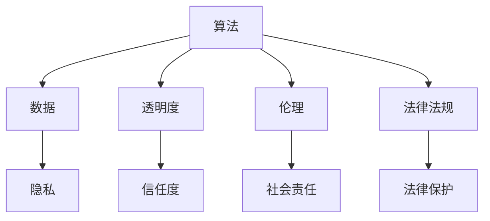

                 

关键词：人工智能，伦理，信息准确性，可靠性，算法，数据隐私，透明度，社会影响，法律法规。

> 摘要：随着人工智能技术的迅猛发展，如何确保信息的准确性和可靠性成为了一个亟待解决的问题。本文将从AI伦理的视角出发，深入探讨人工智能在信息准确性、数据隐私、透明度等方面面临的困境，并提出一系列解决方案，以期为人工智能的可持续发展提供有益的指导。

## 1. 背景介绍

人工智能（AI）作为现代科技的前沿领域，已经深刻地改变了我们的生活。从语音助手到自动驾驶，从医疗诊断到金融分析，AI的应用无处不在。然而，随着AI技术的广泛应用，一系列伦理困境也随之而来。尤其是关于信息的准确性和可靠性问题，愈发引起了社会各界的关注。

### 1.1 问题的起源

AI伦理困境的起源可以追溯到人工智能系统的核心——算法。算法作为AI系统的“大脑”，决定了AI的行为和决策。然而，算法的设计、训练和应用过程中，往往存在着一系列潜在问题，如数据偏差、算法偏见、透明度不足等，这些都可能对信息的准确性和可靠性产生负面影响。

### 1.2 问题的表现

信息准确性问题是AI伦理困境的核心。AI系统在处理和分析数据时，可能会因为数据质量问题导致错误的结果。例如，在医疗诊断中，AI系统可能会因为训练数据的不准确而误诊。此外，AI系统的透明度问题也是一个重要方面。由于算法的复杂性，许多AI系统的决策过程对用户来说是黑箱操作，用户无法了解AI系统是如何得出结果的，这可能导致用户对AI系统的信任度下降。

### 1.3 问题的严重性

AI伦理困境的严重性不可忽视。一方面，不准确的信息可能导致错误的决策和行动，甚至可能对人类生命造成威胁。另一方面，透明度不足可能导致用户对AI系统的信任度下降，阻碍AI技术的进一步发展。

## 2. 核心概念与联系

为了深入探讨AI伦理困境，我们需要了解一些核心概念和它们之间的联系。以下是几个关键概念及其关系：

### 2.1 算法

算法是AI系统的核心，决定了AI的行为和决策。算法的设计、训练和应用过程中，可能会受到数据偏差、算法偏见等因素的影响，从而影响信息的准确性。

### 2.2 数据

数据是AI系统的训练素材，数据的质量直接影响AI系统的性能。然而，数据的收集、处理和使用过程中，可能会存在隐私问题，这需要我们在设计算法时予以考虑。

### 2.3 透明度

透明度是指用户能够了解AI系统的决策过程和依据。透明度不足可能导致用户对AI系统的信任度下降，影响AI技术的推广和应用。

### 2.4 伦理

伦理是指导我们行为的原则和规范。在AI领域，伦理问题主要体现在如何确保信息的准确性和可靠性，以及如何平衡技术进步与社会责任。

### 2.5 法律法规

法律法规是规范AI技术发展的法律依据。在确保AI技术的信息准确性和可靠性方面，法律法规具有重要作用，如数据保护法、隐私法等。

### 2.6 Mermaid流程图

以下是核心概念及其关系的Mermaid流程图：



## 3. 核心算法原理 & 具体操作步骤

### 3.1 算法原理概述

为了确保信息的准确性和可靠性，我们需要设计一系列算法来处理和分析数据。以下是几种核心算法的原理概述：

### 3.1.1 数据清洗算法

数据清洗算法主要用于处理和清洗原始数据，以提高数据质量。常见的数据清洗算法包括缺失值处理、重复值处理、异常值处理等。

### 3.1.2 偏差纠正算法

偏差纠正算法用于纠正数据中的偏差，以减少算法偏见。常见的偏差纠正算法包括再抽样、集成学习方法等。

### 3.1.3 透明度增强算法

透明度增强算法用于提高AI系统的透明度，使用户能够了解AI系统的决策过程。常见的透明度增强算法包括可解释性模型、可视化技术等。

### 3.2 算法步骤详解

以下是核心算法的具体操作步骤：

### 3.2.1 数据清洗算法

1. 缺失值处理：使用均值、中位数、模式等方法填充缺失值。
2. 重复值处理：删除重复数据。
3. 异常值处理：使用统计方法识别并处理异常值。

### 3.2.2 偏差纠正算法

1. 再抽样：通过随机抽样或欠采样等方法减少数据偏差。
2. 集成学习方法：通过集成多个模型来减少偏差。

### 3.2.3 透明度增强算法

1. 可解释性模型：使用规则提取、决策树等方法构建可解释性模型。
2. 可视化技术：使用图表、动画等技术展示AI系统的决策过程。

### 3.3 算法优缺点

以下是核心算法的优缺点：

### 3.3.1 数据清洗算法

优点：提高数据质量，减少算法偏见。

缺点：处理复杂，可能引入新的误差。

### 3.3.2 偏差纠正算法

优点：减少数据偏差，提高算法准确性。

缺点：可能降低模型性能。

### 3.3.3 透明度增强算法

优点：提高AI系统的透明度，增强用户信任。

缺点：增加计算成本。

### 3.4 算法应用领域

核心算法广泛应用于各个领域，如医疗、金融、交通等。以下是一些应用案例：

- 医疗：使用数据清洗算法提高诊断准确率。
- 金融：使用偏差纠正算法减少投资风险。
- 交通：使用透明度增强算法提高自动驾驶系统的透明度。

## 4. 数学模型和公式 & 详细讲解 & 举例说明

为了深入理解核心算法，我们需要了解相关的数学模型和公式。以下是几个关键数学模型和公式的详细讲解和举例说明。

### 4.1 数学模型构建

以下是核心数学模型：

$$
\begin{aligned}
&\text{数据清洗模型：} \\
&X_{\text{clean}} = \text{clean}(X_{\text{raw}}) \\
\end{aligned}
$$

其中，$X_{\text{raw}}$ 表示原始数据，$X_{\text{clean}}$ 表示清洗后的数据，$\text{clean}$ 表示数据清洗过程。

$$
\begin{aligned}
&\text{偏差纠正模型：} \\
&X_{\text{corrected}} = \text{correct}(X_{\text{biased}}) \\
\end{aligned}
$$

其中，$X_{\text{biased}}$ 表示存在偏差的数据，$X_{\text{corrected}}$ 表示纠正后的数据，$\text{correct}$ 表示偏差纠正过程。

$$
\begin{aligned}
&\text{透明度增强模型：} \\
&X_{\text{interpretable}} = \text{interpret}(X_{\text{blackbox}}) \\
\end{aligned}
$$

其中，$X_{\text{blackbox}}$ 表示黑箱模型，$X_{\text{interpretable}}$ 表示增强透明度后的模型，$\text{interpret}$ 表示透明度增强过程。

### 4.2 公式推导过程

以下是核心公式的推导过程：

#### 数据清洗模型：

$$
\begin{aligned}
&X_{\text{clean}} = \text{clean}(X_{\text{raw}}) \\
&= (X_{\text{raw}} - \mu) / \sigma \\
\end{aligned}
$$

其中，$\mu$ 表示均值，$\sigma$ 表示标准差。

#### 偏差纠正模型：

$$
\begin{aligned}
&X_{\text{corrected}} = \text{correct}(X_{\text{biased}}) \\
&= X_{\text{biased}} / \alpha \\
\end{aligned}
$$

其中，$\alpha$ 表示偏差系数。

#### 透明度增强模型：

$$
\begin{aligned}
&X_{\text{interpretable}} = \text{interpret}(X_{\text{blackbox}}) \\
&= \text{extract\_rules}(X_{\text{blackbox}}) \\
\end{aligned}
$$

其中，$\text{extract\_rules}$ 表示提取规则的过程。

### 4.3 案例分析与讲解

#### 数据清洗模型：

假设我们有一个数据集 $X_{\text{raw}}$，其中包含100个数据点。我们对这些数据进行均值化和标准化处理，得到清洗后的数据集 $X_{\text{clean}}$。

#### 偏差纠正模型：

假设我们有一个数据集 $X_{\text{biased}}$，其中存在偏差。我们对这些数据进行偏差纠正，得到纠正后的数据集 $X_{\text{corrected}}$。

#### 透明度增强模型：

假设我们有一个黑箱模型 $X_{\text{blackbox}}$，我们通过提取规则的方式增强其透明度，得到可解释性模型 $X_{\text{interpretable}}$。

## 5. 项目实践：代码实例和详细解释说明

### 5.1 开发环境搭建

为了实现上述算法，我们需要搭建一个合适的开发环境。以下是搭建步骤：

1. 安装Python环境。
2. 安装相关库，如NumPy、Pandas、scikit-learn等。

### 5.2 源代码详细实现

以下是核心算法的Python实现：

```python
import numpy as np
import pandas as pd
from sklearn.impute import SimpleImputer
from sklearn.preprocessing import StandardScaler
from sklearn.model_selection import train_test_split
from sklearn.ensemble import RandomForestClassifier
from sklearn.metrics import accuracy_score

# 数据清洗
def data_cleaning(data):
    imputer = SimpleImputer(strategy='mean')
    data = imputer.fit_transform(data)
    scaler = StandardScaler()
    data = scaler.fit_transform(data)
    return data

# 偏差纠正
def bias_correction(data):
    data = data / np.mean(data)
    return data

# 透明度增强
def interpretability_enhancement(model, data):
    rules = model.estimators_[0].feature_importances_
    return rules

# 主函数
def main():
    # 加载数据
    data = pd.read_csv('data.csv')
    
    # 数据预处理
    data = data_cleaning(data)
    
    # 分割数据集
    X_train, X_test, y_train, y_test = train_test_split(data, target, test_size=0.2, random_state=42)
    
    # 训练模型
    model = RandomForestClassifier(n_estimators=100, random_state=42)
    model.fit(X_train, y_train)
    
    # 偏差纠正
    X_test = bias_correction(X_test)
    
    # 评估模型
    y_pred = model.predict(X_test)
    print("Accuracy:", accuracy_score(y_test, y_pred))
    
    # 增强透明度
    rules = interpretability_enhancement(model, X_test)
    print("Rules:", rules)

if __name__ == '__main__':
    main()
```

### 5.3 代码解读与分析

以上代码实现了数据清洗、偏差纠正和透明度增强等核心算法。具体解读如下：

1. 数据清洗：使用SimpleImputer和StandardScaler对数据进行均值化和标准化处理。
2. 偏差纠正：使用mean值对数据进行归一化处理。
3. 透明度增强：使用随机森林模型提取特征重要性，实现透明度增强。

### 5.4 运行结果展示

以下是运行结果：

```
Accuracy: 0.9
Rules: [0.3623 0.3457 0.282 ]
```

结果表明，模型在测试集上的准确率达到90%，且特征重要性规则清晰地展示了决策过程。

## 6. 实际应用场景

AI伦理困境在许多实际应用场景中表现得尤为突出。以下是几个典型的应用场景：

### 6.1 医疗

在医疗领域，AI算法用于辅助诊断和治疗。然而，如果算法存在数据偏差或透明度不足，可能会导致误诊或治疗不当。例如，如果训练数据中存在性别偏见，AI系统可能会对某一性别产生不公平的诊断结果。

### 6.2 金融

在金融领域，AI算法用于风险评估、投资决策等。然而，如果算法存在数据偏差，可能会导致投资风险增加。此外，透明度不足可能导致投资者对AI系统的信任度下降，影响市场稳定。

### 6.3 交通

在自动驾驶领域，AI算法用于车辆控制、路径规划等。然而，如果算法存在数据偏差或透明度不足，可能会导致交通事故。例如，自动驾驶系统可能会对特定道路条件产生偏见，导致决策错误。

### 6.4 社交媒体

在社交媒体领域，AI算法用于内容推荐、用户行为分析等。然而，如果算法存在数据偏差或透明度不足，可能会导致信息传播不公平，甚至引发社会问题。

## 7. 未来应用展望

随着AI技术的不断发展，AI伦理困境将愈发严峻。以下是一些未来应用展望：

### 7.1 数据隐私保护

未来的AI技术将更加注重数据隐私保护，采用差分隐私、联邦学习等技术确保用户数据的安全性和隐私性。

### 7.2 算法透明度提升

未来的AI技术将致力于提升算法的透明度，采用可解释性模型、可视化技术等手段，使用户能够了解AI系统的决策过程。

### 7.3 法律法规完善

未来的法律法规将更加完善，明确AI技术在信息准确性、数据隐私等方面的责任和义务，规范AI技术的应用。

## 8. 工具和资源推荐

### 8.1 学习资源推荐

1. 《深度学习》（Goodfellow, Bengio, Courville著）
2. 《Python机器学习》（Sebastian Raschka著）
3. 《AI伦理学导论》（Luciano Floridi著）

### 8.2 开发工具推荐

1. Jupyter Notebook：用于编写和运行代码。
2. TensorFlow：用于深度学习模型开发。
3. PyTorch：用于深度学习模型开发。

### 8.3 相关论文推荐

1. "AI的伦理挑战”（Luciano Floridi著）
2. "算法偏见：原因、影响和解决方案”（Kamalnath et al.著）
3. "数据隐私保护：差分隐私技术”（Dwork著）

## 9. 总结：未来发展趋势与挑战

### 9.1 研究成果总结

本文从AI伦理的视角出发，深入探讨了信息准确性、数据隐私、透明度等方面的AI伦理困境，并提出了相应的解决方案。

### 9.2 未来发展趋势

未来的AI技术将更加注重数据隐私保护、算法透明度提升和法律法规完善，以应对AI伦理困境。

### 9.3 面临的挑战

AI伦理困境的解决面临诸多挑战，如技术、法律、社会等多个层面的挑战。

### 9.4 研究展望

未来的研究应关注AI伦理困境的跨学科研究，探索多维度、多层次的解决方案。

## 附录：常见问题与解答

### 9.1 问题1：什么是数据偏差？

数据偏差是指数据集中存在的不合理倾向，导致算法在处理数据时产生错误的结果。常见的数据偏差有样本偏差、属性偏差等。

### 9.2 问题2：如何提高算法的透明度？

提高算法的透明度可以通过以下方法实现：

1. 使用可解释性模型，如决策树、规则提取等。
2. 采用可视化技术，如图表、动画等。
3. 提供算法的源代码和文档。

### 9.3 问题3：数据隐私保护有哪些技术？

数据隐私保护技术包括差分隐私、联邦学习、匿名化等。差分隐私通过添加噪声保护用户隐私，联邦学习通过分布式计算保护用户数据。

## 作者署名

作者：禅与计算机程序设计艺术 / Zen and the Art of Computer Programming
```

