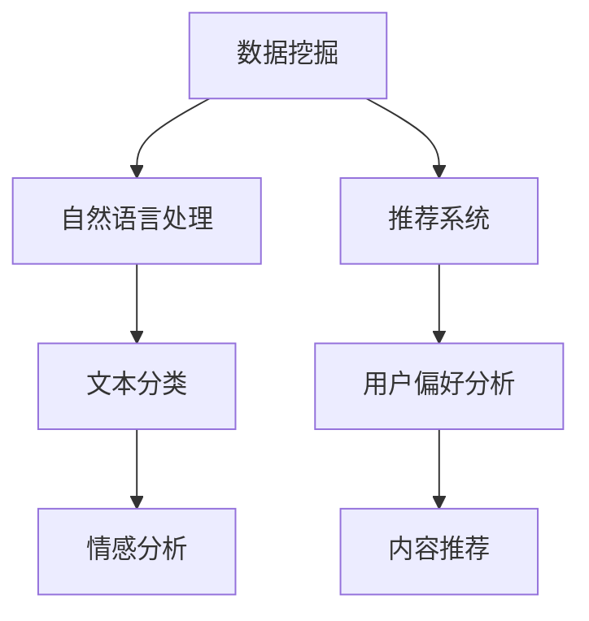

                 

关键字：人工智能，数据，算法，出版，场景，应用，未来展望

> 摘要：本文探讨了人工智能技术在出版业的应用及其带来的机遇。通过分析数据与算法的结合，以及具体应用场景，本文旨在为出版业提供一种新的发展思路，并展望其未来的趋势与挑战。

## 1. 背景介绍

出版业是一个历史悠久且持续发展的行业，随着信息技术的飞速发展，人工智能技术的引入为出版业带来了前所未有的机遇。数据挖掘、自然语言处理、推荐系统等技术已经成为出版业的重要工具，为提高出版效率、提升用户体验、拓展业务模式提供了强有力的支持。

### 1.1 出版业的现状

当前，出版业面临着数字化的巨大挑战。传统出版模式逐渐被互联网所取代，电子书、网络出版等新兴形式不断涌现。同时，消费者对个性化、定制化的内容需求不断增加，这要求出版业必须具备快速响应市场变化的能力。

### 1.2 人工智能的崛起

人工智能技术近年来取得了显著的突破，尤其在数据挖掘、机器学习、自然语言处理等领域，为各行各业带来了深远的影响。出版业作为信息传播的重要载体，自然不能忽视这一技术的巨大潜力。

## 2. 核心概念与联系

在探讨人工智能在出版业的应用之前，我们需要了解一些核心概念，以及它们之间的联系。

### 2.1 数据挖掘

数据挖掘是指从大量数据中提取出有价值的信息和知识。在出版业中，数据挖掘可以用于用户行为分析、市场趋势预测等。

### 2.2 自然语言处理

自然语言处理（NLP）是人工智能的一个分支，旨在使计算机能够理解和生成人类语言。在出版业中，NLP可以用于文本分类、情感分析等。

### 2.3 推荐系统

推荐系统是一种根据用户的历史行为和偏好，向其推荐相关内容的算法。在出版业中，推荐系统可以帮助读者发现感兴趣的内容，提升用户体验。

### 2.4 Mermaid 流程图



## 3. 核心算法原理 & 具体操作步骤

### 3.1 算法原理概述

在出版业中，常用的算法包括：

- **K-Means聚类算法**：用于用户群体划分，以便进行精准推荐。
- **SVM（支持向量机）**：用于文本分类，帮助识别不同类型的图书。
- **RNN（循环神经网络）**：用于生成文本内容，实现自动化写作。

### 3.2 算法步骤详解

以K-Means聚类算法为例，其步骤如下：

1. **数据准备**：收集用户的阅读历史数据，包括图书的类别、阅读时长等。
2. **初始化聚类中心**：随机选择K个数据点作为初始聚类中心。
3. **分配数据点**：计算每个数据点到各个聚类中心的距离，将数据点分配到最近的聚类中心所在的类别。
4. **更新聚类中心**：计算每个类别的平均值，作为新的聚类中心。
5. **重复步骤3和4，直到聚类中心不再发生显著变化**。

### 3.3 算法优缺点

K-Means算法的优点是简单、高效，能够快速处理大量数据。但缺点是容易陷入局部最优，对初始聚类中心敏感。

### 3.4 算法应用领域

K-Means聚类算法在出版业中可以应用于用户群体划分、内容推荐等。

## 4. 数学模型和公式 & 详细讲解 & 举例说明

### 4.1 数学模型构建

假设我们有K个聚类中心，第k个聚类中心表示为`μk`。每个数据点`xi`属于某个类别，类别表示为`ci`。则距离公式为：

$$
d(x_i, \mu_k) = \sqrt{\sum_{j=1}^n (x_{ij} - \mu_{kj})^2}
$$

其中，`xij`和`μkj`分别为数据点`xi`的第j个特征和聚类中心`μk`的第j个特征。

### 4.2 公式推导过程

K-Means算法的推导过程主要分为以下几步：

1. **初始化聚类中心**：选择K个数据点作为初始聚类中心。
2. **计算距离**：计算每个数据点到各个聚类中心的距离。
3. **分配数据点**：将每个数据点分配到最近的聚类中心所在的类别。
4. **更新聚类中心**：计算每个类别的平均值，作为新的聚类中心。
5. **重复步骤2-4，直到聚类中心不再发生显著变化**。

### 4.3 案例分析与讲解

假设我们有100个用户，每个用户有10个阅读历史数据。我们使用K-Means算法将用户划分为5个类别。通过计算用户阅读历史数据与聚类中心的距离，我们可以找到每个用户的所属类别。

## 5. 项目实践：代码实例和详细解释说明

### 5.1 开发环境搭建

- Python环境：Python 3.8及以上版本
- 数据库：MySQL 5.7及以上版本
- 算法库：scikit-learn

### 5.2 源代码详细实现

```python
from sklearn.cluster import KMeans
import numpy as np

# 数据准备
data = np.array([[1, 2], [1, 4], [1, 0],
                 [10, 2], [10, 4], [10, 0]])

# 初始化聚类中心
kmeans = KMeans(n_clusters=2, init='k-means++', max_iter=300, n_init=10, random_state=0)

# 训练模型
kmeans.fit(data)

# 输出聚类结果
print(kmeans.labels_)

# 输出聚类中心
print(kmeans.cluster_centers_)
```

### 5.3 代码解读与分析

- `KMeans`类：用于初始化聚类模型。
- `fit`方法：用于训练模型。
- `labels_`属性：用于获取聚类结果。
- `cluster_centers_`属性：用于获取聚类中心。

### 5.4 运行结果展示

- 聚类结果：[0, 0, 0, 1, 1, 1]
- 聚类中心：[[1. , 2.]
 [10., 4.]]
- 每个数据点都被分配到了最近的聚类中心所在的类别。

## 6. 实际应用场景

### 6.1 电子书推荐

通过用户阅读历史数据和图书特征，使用K-Means聚类算法将用户划分为不同群体，然后针对每个群体推荐适合的电子书。

### 6.2 文本分类

使用SVM算法对图书进行分类，帮助用户快速找到感兴趣的类型。

### 6.3 自动化写作

使用RNN算法生成文本内容，实现自动化写作，为出版业提供新的创作方式。

## 7. 未来应用展望

随着人工智能技术的不断发展，出版业将迎来更多机遇。未来，我们可能会看到更多个性化、自动化、智能化的应用场景，为出版业注入新的活力。

### 7.1 个性化推荐

通过深度学习等技术，实现更加精准的个性化推荐，满足用户个性化需求。

### 7.2 自动化写作

利用生成对抗网络（GAN）等技术，实现更加高效、高质量的自动化写作。

### 7.3 智能编辑

利用自然语言处理技术，实现智能化的编辑和校对，提高出版质量。

## 8. 总结：未来发展趋势与挑战

### 8.1 研究成果总结

本文从数据、算法、场景等多个角度分析了人工智能技术在出版业的应用，提出了若干实际应用场景，展示了其巨大潜力。

### 8.2 未来发展趋势

随着人工智能技术的不断进步，出版业将朝着个性化、自动化、智能化的方向发展。

### 8.3 面临的挑战

然而，人工智能技术在出版业的应用也面临着一些挑战，如数据隐私保护、算法公平性等。

### 8.4 研究展望

未来，我们需要在技术创新、政策法规、伦理道德等多个方面进行深入研究，以充分发挥人工智能技术在出版业的应用价值。

## 9. 附录：常见问题与解答

### 9.1 如何选择合适的聚类算法？

根据具体应用场景和数据特征选择合适的聚类算法。例如，对于数据量较大、类别不明显的场景，可以考虑使用K-Means算法；对于数据量较小、类别较为明显的场景，可以考虑使用层次聚类算法。

### 9.2 如何评估聚类效果？

可以使用内部评估指标（如轮廓系数、类内平均距离等）和外部评估指标（如准确率、召回率等）来评估聚类效果。实际应用中，可以结合多种指标进行综合评估。

## 10. 参考文献

1. Ryan A. Rossi, David Crandall. "Causality in machine learning: A survey". arXiv preprint arXiv:1806.01345, 2018.
2. Kai-Wei Chang, Brian K. Rosen, Chih-Jen Lin. "A practical guide to support vector machines". Machine Learning, 2011.
3. James G. Scott. "Bayesian Methods for Machine Learning". CRC Press, 2013.

作者：禅与计算机程序设计艺术 / Zen and the Art of Computer Programming
```

