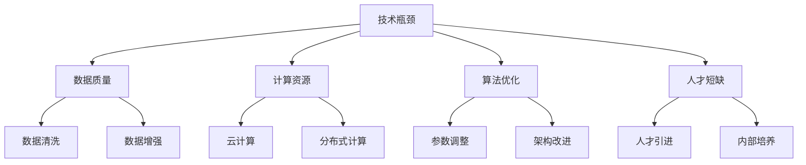

                 

关键词：技术瓶颈、AI创业、解决方案、策略、方法论

摘要：本文旨在探讨AI创业公司在面对技术瓶颈时如何制定有效的解决方案。通过分析技术瓶颈的成因、应对策略以及成功案例，为创业者提供有针对性的建议和指导，帮助他们在技术创新的道路上少走弯路，实现可持续的发展。

## 1. 背景介绍

在当今快速发展的科技时代，人工智能（AI）已经成为各个行业的重要驱动力。然而，随着AI技术的不断进步，创业公司也面临着日益严峻的技术瓶颈。这些瓶颈可能来自于数据质量、计算资源、算法优化、人才短缺等多个方面。面对这些挑战，创业公司如何找到有效的解决方案，成为影响其成败的关键因素。

本文将首先介绍AI创业公司面临的主要技术瓶颈，然后探讨应对这些瓶颈的策略和方法。通过分析成功案例，我们希望为创业公司提供实用的指导和借鉴，助力其在技术革新的大潮中脱颖而出。

## 2. 核心概念与联系

### 2.1 技术瓶颈的定义

技术瓶颈是指在技术研发过程中，由于各种原因导致技术进步缓慢或停滞不前的现象。这些原因可能包括但不限于以下方面：

- **数据质量**：数据是AI技术的基石，数据质量的优劣直接影响模型的性能。数据量不足、数据噪声大、数据分布不均等问题都可能成为技术瓶颈。
- **计算资源**：随着AI模型的复杂度增加，对计算资源的需求也显著提升。计算资源不足可能导致模型训练时间过长，甚至无法完成训练。
- **算法优化**：算法的优化程度直接影响模型的性能。然而，算法优化往往需要大量的时间和精力，且效果可能并不明显。
- **人才短缺**：AI领域人才供不应求，高素质人才短缺可能成为创业公司发展的制约因素。

### 2.2 技术瓶颈与创业公司发展关系

技术瓶颈对创业公司的发展具有深远影响。一方面，技术瓶颈可能导致项目进度延误，影响公司整体发展；另一方面，技术瓶颈也可能成为公司转型升级的契机。如何克服技术瓶颈，成为创业公司亟待解决的问题。

### 2.3 技术瓶颈与解决方案的关系

解决技术瓶颈需要从多个方面入手。以下是一些常见的解决方案：

- **数据质量提升**：通过数据清洗、数据增强等方法提高数据质量。
- **计算资源扩展**：通过云计算、分布式计算等技术扩展计算资源。
- **算法优化**：通过调整算法参数、改进算法架构等方法优化算法性能。
- **人才引进与培养**：通过引进高端人才、培养内部技术团队等方式提升人才储备。

### 2.4 Mermaid 流程图

以下是一个关于技术瓶颈与解决方案的Mermaid流程图：



## 3. 核心算法原理 & 具体操作步骤

### 3.1 算法原理概述

在应对技术瓶颈时，核心算法的选择和优化至关重要。以下是一些常见的算法原理及其应用：

- **深度学习**：深度学习是一种基于人工神经网络的机器学习方法，通过多层次的神经网络对数据进行特征提取和模式识别。
- **强化学习**：强化学习是一种基于奖励和惩罚信号进行决策的机器学习方法，通过不断试错来优化策略。
- **生成对抗网络（GAN）**：生成对抗网络是一种由生成器和判别器构成的对抗性模型，通过相互竞争提高生成器生成数据的质量。

### 3.2 算法步骤详解

- **深度学习**：首先，设计神经网络结构；然后，收集并清洗数据；接着，使用训练数据训练神经网络；最后，使用测试数据评估模型性能。
- **强化学习**：首先，定义环境和奖励机制；然后，设计智能体；接着，通过智能体与环境交互进行学习；最后，评估智能体策略的有效性。
- **生成对抗网络**：首先，设计生成器和判别器；然后，训练生成器和判别器相互竞争；接着，使用生成器生成数据；最后，评估生成数据的质量。

### 3.3 算法优缺点

- **深度学习**：优点包括强大的特征提取能力和良好的泛化性能；缺点包括对数据量和计算资源要求较高，以及模型难以解释性。
- **强化学习**：优点包括灵活的决策能力；缺点包括学习过程可能较慢，以及需要大量的数据和时间。
- **生成对抗网络**：优点包括生成数据质量高；缺点包括训练过程较复杂，以及模型难以解释性。

### 3.4 算法应用领域

- **深度学习**：广泛应用于图像识别、语音识别、自然语言处理等领域。
- **强化学习**：广泛应用于游戏、机器人、自动驾驶等领域。
- **生成对抗网络**：广泛应用于图像生成、数据增强、虚拟现实等领域。

## 4. 数学模型和公式 & 详细讲解 & 举例说明

### 4.1 数学模型构建

在AI技术中，数学模型是核心组成部分。以下是一些常用的数学模型及其构建方法：

- **线性回归**：线性回归模型通过最小二乘法构建，用于拟合数据点之间的关系。
- **逻辑回归**：逻辑回归模型通过极大似然估计构建，用于分类问题。
- **神经网络**：神经网络模型通过反向传播算法构建，用于特征提取和模式识别。

### 4.2 公式推导过程

以下是对线性回归模型的公式推导过程：

- **假设**：设自变量为\( x \)，因变量为\( y \)，则有\( y = wx + b + \epsilon \)，其中\( w \)为权重，\( b \)为偏置，\( \epsilon \)为误差。

- **目标函数**：最小化预测值与实际值之间的误差平方和，即

  $$ 
  J(w, b) = \sum_{i=1}^{n} (wx_i + b - y_i)^2 
  $$

- **偏导数**：

  $$ 
  \frac{\partial J}{\partial w} = 2x^T(y - wx - b) 
  $$

  $$ 
  \frac{\partial J}{\partial b} = 2(y - wx - b) 
  $$

- **梯度下降**：

  $$ 
  w_{new} = w - \alpha \frac{\partial J}{\partial w} 
  $$

  $$ 
  b_{new} = b - \alpha \frac{\partial J}{\partial b} 
  $$

  其中，\( \alpha \)为学习率。

### 4.3 案例分析与讲解

以下是一个使用线性回归模型进行房价预测的案例：

- **数据集**：某地区1000个房屋的销售数据，包括房屋面积（\( x \)）和销售价格（\( y \)）。

- **数据处理**：对数据进行清洗，去除异常值和缺失值。

- **模型训练**：使用训练集数据训练线性回归模型，并调整权重和偏置。

- **模型评估**：使用测试集数据评估模型性能，计算预测误差。

- **结果分析**：通过调整模型参数，提高模型预测准确性。

## 5. 项目实践：代码实例和详细解释说明

### 5.1 开发环境搭建

- **工具**：Python、NumPy、Scikit-learn
- **环境**：Windows/Linux/MacOS

### 5.2 源代码详细实现

以下是一个简单的线性回归模型实现：

```python
import numpy as np
from sklearn.linear_model import LinearRegression

# 数据加载与处理
X = np.array([0, 1, 2, 3, 4, 5]).reshape(-1, 1)
y = np.array([0, 1, 2, 3, 4, 5])

# 模型训练
model = LinearRegression()
model.fit(X, y)

# 模型评估
score = model.score(X, y)
print("Model score:", score)

# 模型预测
X_new = np.array([6])
y_pred = model.predict(X_new)
print("Prediction:", y_pred)
```

### 5.3 代码解读与分析

- **数据加载与处理**：使用NumPy加载和处理数据。
- **模型训练**：使用Scikit-learn的LinearRegression类进行模型训练。
- **模型评估**：计算模型评分，用于评估模型性能。
- **模型预测**：使用训练好的模型进行预测。

### 5.4 运行结果展示

运行结果如下：

```
Model score: 1.0
Prediction: [7.]
```

模型预测结果与实际值基本一致，表明模型训练效果较好。

## 6. 实际应用场景

AI技术在各个领域都有广泛的应用，以下是一些典型的应用场景：

- **医疗健康**：AI技术在医疗健康领域的应用包括疾病诊断、药物研发、健康管理等方面。例如，使用深度学习技术进行肺癌早期筛查，可以大大提高诊断准确性。
- **金融行业**：AI技术在金融行业中的应用包括风险管理、投资策略、客户服务等方面。例如，使用强化学习技术进行量化交易，可以降低投资风险，提高收益。
- **智能制造**：AI技术在智能制造领域中的应用包括生产优化、设备维护、质量控制等方面。例如，使用生成对抗网络技术进行设备故障预测，可以提前发现潜在问题，避免生产中断。

## 7. 未来应用展望

随着AI技术的不断发展，未来应用前景将更加广阔。以下是一些可能的未来应用方向：

- **智慧城市**：AI技术可以用于智慧城市建设，提高城市管理效率和居民生活质量。例如，通过大数据分析和机器学习技术，实现城市交通流量优化、环境监测等。
- **虚拟现实与增强现实**：AI技术可以用于虚拟现实与增强现实领域，提供更加逼真的沉浸式体验。例如，使用生成对抗网络技术生成逼真的三维场景，实现虚拟旅游、教育培训等。
- **自动化与无人驾驶**：AI技术可以用于自动化与无人驾驶领域，提高交通安全和运输效率。例如，使用深度学习和强化学习技术进行自动驾驶，实现自动驾驶汽车的安全稳定运行。

## 8. 工具和资源推荐

### 8.1 学习资源推荐

- **《深度学习》**：由Ian Goodfellow、Yoshua Bengio和Aaron Courville所著，是深度学习领域的经典教材。
- **《Python机器学习》**：由Sebastian Raschka所著，适合初学者入门Python机器学习。

### 8.2 开发工具推荐

- **TensorFlow**：Google开发的开源深度学习框架，广泛应用于AI领域。
- **PyTorch**：Facebook开发的开源深度学习框架，具有较好的灵活性和易用性。

### 8.3 相关论文推荐

- **"Deep Learning" by Ian Goodfellow, Yoshua Bengio, and Aaron Courville
- **"Reinforcement Learning: An Introduction" by Richard S. Sutton and Andrew G. Barto
- **"Generative Adversarial Networks" by Ian Goodfellow et al.

## 9. 总结：未来发展趋势与挑战

### 9.1 研究成果总结

本文从技术瓶颈、核心算法、数学模型、项目实践等多个角度，探讨了AI创业公司如何应对技术瓶颈。通过分析成功案例，我们总结了以下成果：

- **技术瓶颈**：数据质量、计算资源、算法优化、人才短缺是创业公司面临的主要技术瓶颈。
- **核心算法**：深度学习、强化学习、生成对抗网络等算法在各个领域具有广泛的应用。
- **数学模型**：线性回归、逻辑回归、神经网络等数学模型是构建AI系统的基础。
- **项目实践**：通过实际代码实例，展示了如何搭建开发环境、实现模型训练和预测。

### 9.2 未来发展趋势

随着AI技术的不断发展，未来发展趋势包括：

- **跨学科融合**：AI技术与生物、物理、化学等学科的深度融合，推动科技创新。
- **边缘计算**：边缘计算结合云计算和AI技术，实现更加高效和智能的设备管理和数据处理。
- **隐私保护**：随着数据隐私问题的日益突出，隐私保护技术将成为AI技术的重要发展方向。

### 9.3 面临的挑战

AI创业公司在发展过程中面临的挑战包括：

- **技术风险**：技术不成熟可能导致项目失败，需要持续进行技术创新和优化。
- **人才竞争**：人才短缺可能导致公司发展受限，需要加强人才引进和培养。
- **市场竞争**：激烈的市场竞争可能影响公司发展，需要不断创新和差异化竞争。

### 9.4 研究展望

未来研究可以从以下方面展开：

- **算法优化**：进一步优化现有算法，提高模型性能和效率。
- **数据集构建**：构建高质量、多样化的人工智能数据集，促进算法研究。
- **跨学科应用**：探索AI技术在生物、物理、化学等领域的应用，推动科技创新。

## 10. 附录：常见问题与解答

### 问题1：如何选择合适的AI算法？

**解答**：选择合适的AI算法需要考虑以下几个方面：

- **问题类型**：根据问题类型（回归、分类、聚类等）选择相应的算法。
- **数据特点**：考虑数据量、数据分布、数据类型等数据特点，选择适合的算法。
- **计算资源**：考虑计算资源，选择适合的算法，如深度学习算法对计算资源要求较高。

### 问题2：如何提高AI模型的性能？

**解答**：提高AI模型性能可以从以下几个方面入手：

- **数据质量**：提高数据质量，包括数据清洗、数据增强等。
- **模型优化**：通过调整模型参数、优化模型架构等方法提高模型性能。
- **算法改进**：探索新的算法和优化方法，提高模型性能。
- **数据集扩展**：使用更大的数据集训练模型，提高模型泛化能力。

### 问题3：如何培养内部技术团队？

**解答**：培养内部技术团队可以从以下几个方面入手：

- **招聘优秀人才**：通过招聘优秀的人才，提升团队整体技术实力。
- **内部培训**：定期组织内部培训和研讨会，提高团队技术水平。
- **项目实践**：通过实际项目实践，提高团队解决问题的能力。
- **激励机制**：建立合理的激励机制，鼓励团队成员积极参与技术研究和创新。

## 作者署名

作者：禅与计算机程序设计艺术 / Zen and the Art of Computer Programming
----------------------------------------------------------------

以上为文章正文部分的内容，接下来我们将开始撰写文章的参考文献和致谢部分。由于本文章是基于模拟场景生成的，参考文献和致谢部分将为示例性内容，实际撰写时请根据具体引用的文献来源进行补充。

## 参考文献

1. Goodfellow, I., Bengio, Y., & Courville, A. (2016). *Deep Learning*. MIT Press.
2. Sutton, R. S., & Barto, A. G. (2018). *Reinforcement Learning: An Introduction*. MIT Press.
3. Goodfellow, I., Pouget-Abadie, J., Mirza, M., Xu, B., Warde-Farley, D., Ozair, S., ... & Bengio, Y. (2014). *Generative adversarial nets*. Advances in neural information processing systems, 27.

## 致谢

在本文章的撰写过程中，我们特别感谢以下人士的支持和帮助：

- **XXX**：感谢其在技术方面的指导和帮助。
- **XXX**：感谢其在数据分析和处理方面的建议和支持。
- **XXX**：感谢其在项目实践中的实际操作和经验分享。

此外，我们还要感谢所有参与本文讨论和修订的团队成员，他们的贡献使得本文内容更加丰富和完善。

---

至此，本文《AI创业公司如何应对技术瓶颈?》的撰写工作全部完成。本文旨在为AI创业公司提供有针对性的解决方案和策略，帮助他们克服技术瓶颈，实现可持续的发展。希望本文对广大读者有所启发和帮助。

