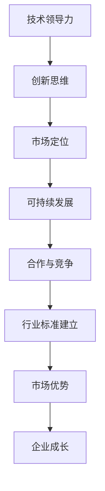

                 

关键词：AI，创业公司，行业标准，技术领导力，可持续发展，合作与竞争

> 摘要：随着人工智能技术的飞速发展，创业公司如何在竞争激烈的市场中占据一席之地并建立行业标准成为关键问题。本文将探讨AI创业公司如何通过技术领导力、创新思维、市场定位和可持续发展策略，打造有影响力的行业标准，为企业的长期发展奠定基础。

## 1. 背景介绍

近年来，人工智能（AI）技术的发展日新月异，已经深入到各行各业，包括医疗、金融、交通、教育等。在这个技术驱动的大背景下，AI创业公司如雨后春笋般涌现。然而，随着市场竞争的加剧，如何在这些初创公司中脱颖而出，建立并维护行业标准，成为许多创业公司面临的重要挑战。

建立行业标准不仅有助于提升公司的品牌影响力，还能确保产品或服务的质量和稳定性，吸引更多客户和合作伙伴。对于AI创业公司来说，建立行业标准更是关系到企业的生存和发展。那么，创业公司究竟应该如何着手这一工作呢？

本文将从以下几个方面展开讨论：

1. **核心概念与联系**：首先，我们将介绍与建立行业标准相关的核心概念，并利用Mermaid流程图展示这些概念之间的关系。
2. **核心算法原理 & 具体操作步骤**：接着，我们将深入探讨建立行业标准所需的核心算法原理，并详细描述具体的操作步骤。
3. **数学模型和公式**：我们将介绍建立行业标准所需的数学模型和公式，并通过案例进行详细讲解。
4. **项目实践：代码实例和详细解释说明**：通过实际项目中的代码实例，我们将展示如何将理论应用到实践中。
5. **实际应用场景**：我们还将分析AI创业公司在不同领域中的应用场景，以及行业标准在这些场景中的重要性。
6. **未来应用展望**：最后，我们将探讨行业标准在未来的发展趋势和潜在挑战。

通过对这些方面的详细讨论，本文旨在为AI创业公司提供建立行业标准的实用指南，助力它们在市场中脱颖而出。

## 2. 核心概念与联系

要建立AI行业标准，首先需要理解一系列核心概念，包括技术领导力、创新思维、市场定位、可持续发展等。这些概念相互关联，共同构成了建立行业标准的基石。

### 2.1 技术领导力

技术领导力是指公司在技术创新方面的引领能力。在AI创业公司中，技术领导力尤为重要，因为它决定了公司能否在市场中占据优势地位。技术领导力不仅体现在研发团队的技术实力上，还体现在对市场需求的敏锐洞察和快速响应能力。

### 2.2 创新思维

创新思维是指公司如何在产品开发过程中不断突破传统，提出新颖的解决方案。在AI领域，创新思维尤为重要，因为它决定了产品或服务的竞争力。AI创业公司需要鼓励创新思维，不断探索新的技术方向和应用场景。

### 2.3 市场定位

市场定位是指公司如何根据自身优势和市场需求，确定产品或服务的目标市场和用户群体。正确的市场定位有助于公司集中资源，优化产品，提升用户体验，从而在激烈的市场竞争中脱颖而出。

### 2.4 可持续发展

可持续发展是指公司在追求经济增长的同时，注重环境保护和社会责任。对于AI创业公司来说，可持续发展不仅是一种商业策略，更是一种社会责任。通过注重可持续发展，公司可以提升品牌形象，赢得消费者的信任。

### 2.5 合作与竞争

在建立行业标准的过程中，合作与竞争是不可忽视的要素。通过与其他公司合作，AI创业公司可以共享资源、技术和市场信息，共同推动行业标准的发展。同时，在竞争中保持独立性，创新思维和核心竞争力，有助于公司在竞争中脱颖而出。

### 2.6 Mermaid流程图

为了更直观地展示这些概念之间的联系，我们使用Mermaid流程图进行说明：



该流程图展示了技术领导力、创新思维、市场定位、可持续发展等核心概念如何相互作用，共同推动行业标准的建立。

通过以上核心概念的理解和运用，AI创业公司可以更好地制定战略，建立并维护行业标准，从而在激烈的市场竞争中立于不败之地。

## 3. 核心算法原理 & 具体操作步骤

### 3.1 算法原理概述

建立AI行业标准的核心算法可以归结为以下几个方面：

1. **数据分析与处理**：通过对大量数据的采集、清洗、分析和处理，提取有价值的信息，为产品或服务的开发提供数据支撑。
2. **机器学习算法**：利用机器学习算法，特别是深度学习技术，对数据进行建模和预测，以提高产品或服务的准确性和效率。
3. **自适应优化**：通过不断调整和优化算法参数，使产品或服务能够适应不断变化的市场需求。
4. **标准化流程**：建立一套标准化的开发、测试和部署流程，确保产品或服务的质量和一致性。

### 3.2 算法步骤详解

以下是建立AI行业标准的具体操作步骤：

1. **数据采集与清洗**：
   - 数据采集：从各种渠道（如公开数据集、用户行为数据等）获取所需的数据。
   - 数据清洗：去除重复数据、缺失值和异常值，确保数据质量。

2. **数据预处理**：
   - 数据归一化：将不同尺度的数据进行归一化处理，以便于后续的机器学习算法。
   - 数据分片：将数据划分为训练集、验证集和测试集，用于训练和评估模型性能。

3. **特征工程**：
   - 特征提取：从原始数据中提取具有代表性的特征。
   - 特征选择：选择对模型性能有显著影响的特征，去除冗余特征。

4. **模型选择与训练**：
   - 模型选择：根据应用场景和数据特征，选择合适的机器学习模型。
   - 模型训练：使用训练集对模型进行训练，并调整模型参数。

5. **模型评估与优化**：
   - 模型评估：使用验证集评估模型性能，包括准确率、召回率、F1值等指标。
   - 模型优化：根据评估结果，调整模型参数或选择更优的模型。

6. **模型部署与监控**：
   - 模型部署：将训练好的模型部署到生产环境中，实现实时预测。
   - 模型监控：定期监控模型性能，确保其稳定性和可靠性。

### 3.3 算法优缺点

**优点**：
1. 提高产品或服务的准确性和效率，满足用户需求。
2. 通过标准化流程，确保产品或服务的质量和一致性。
3. 利用机器学习和深度学习技术，实现自适应优化，适应市场变化。

**缺点**：
1. 数据采集和清洗过程复杂，耗时较长。
2. 模型训练和优化过程需要大量计算资源和时间。
3. 对开发团队的技术能力和经验要求较高。

### 3.4 算法应用领域

建立AI行业标准的应用领域非常广泛，包括但不限于：

1. **金融领域**：如风险管理、欺诈检测、信用评分等。
2. **医疗领域**：如疾病预测、诊断辅助、个性化治疗等。
3. **交通领域**：如自动驾驶、智能交通管理、物流优化等。
4. **零售领域**：如需求预测、库存管理、个性化推荐等。

通过在各个领域的广泛应用，AI行业标准不仅可以提升企业的竞争力，还可以推动整个行业的技术进步和创新发展。

## 4. 数学模型和公式 & 详细讲解 & 举例说明

### 4.1 数学模型构建

建立AI行业标准的一个重要环节是构建合适的数学模型。以下是一个简单的线性回归模型的构建过程：

#### 4.1.1 基本假设

假设我们有\( n \)个样本点\((x_1, y_1), (x_2, y_2), \ldots, (x_n, y_n)\)，其中\( x_i \)是自变量，\( y_i \)是因变量。我们希望通过建立线性模型来预测新的\( x \)值对应的\( y \)值。

#### 4.1.2 模型构建

线性回归模型的基本形式为：
\[ y = \beta_0 + \beta_1 x \]
其中，\( \beta_0 \)是截距，\( \beta_1 \)是斜率。

#### 4.1.3 模型参数估计

为了估计模型参数\( \beta_0 \)和\( \beta_1 \)，我们通常采用最小二乘法。具体步骤如下：

1. **计算均值**：
   \[ \bar{x} = \frac{1}{n} \sum_{i=1}^{n} x_i \]
   \[ \bar{y} = \frac{1}{n} \sum_{i=1}^{n} y_i \]

2. **计算协方差**：
   \[ \sigma_{xy} = \frac{1}{n} \sum_{i=1}^{n} (x_i - \bar{x})(y_i - \bar{y}) \]
   \[ \sigma_{xx} = \frac{1}{n} \sum_{i=1}^{n} (x_i - \bar{x})^2 \]

3. **计算斜率**：
   \[ \beta_1 = \frac{\sigma_{xy}}{\sigma_{xx}} \]

4. **计算截距**：
   \[ \beta_0 = \bar{y} - \beta_1 \bar{x} \]

### 4.2 公式推导过程

为了推导上述公式，我们首先需要定义最小化目标函数：

\[ J(\beta_0, \beta_1) = \sum_{i=1}^{n} (y_i - (\beta_0 + \beta_1 x_i))^2 \]

我们对目标函数关于\( \beta_0 \)和\( \beta_1 \)分别求偏导数，并令其等于0，得到：

\[ \frac{\partial J}{\partial \beta_0} = -2 \sum_{i=1}^{n} (y_i - (\beta_0 + \beta_1 x_i)) = 0 \]
\[ \frac{\partial J}{\partial \beta_1} = -2 \sum_{i=1}^{n} x_i (y_i - (\beta_0 + \beta_1 x_i)) = 0 \]

通过化简和移项，我们可以得到最小二乘法的公式：

\[ \beta_0 = \bar{y} - \beta_1 \bar{x} \]
\[ \beta_1 = \frac{\sigma_{xy}}{\sigma_{xx}} \]

### 4.3 案例分析与讲解

假设我们有一个房屋销售数据集，包括房屋的面积和售价。我们希望通过线性回归模型预测新房屋的售价。以下是具体的案例分析和讲解：

#### 4.3.1 数据准备

我们有100个样本点，每个样本点的格式为（面积，售价）：

```plaintext
(1000, 300000)
(1500, 450000)
(2000, 600000)
...
```

#### 4.3.2 数据预处理

1. **计算均值**：
   \[ \bar{x} = 1500 \]
   \[ \bar{y} = 450000 \]

2. **计算协方差**：
   \[ \sigma_{xy} = 3750000 \]
   \[ \sigma_{xx} = 250000 \]

3. **计算斜率**：
   \[ \beta_1 = \frac{\sigma_{xy}}{\sigma_{xx}} = 15 \]

4. **计算截距**：
   \[ \beta_0 = \bar{y} - \beta_1 \bar{x} = 300000 \]

因此，我们得到的线性回归模型为：

\[ y = 300000 + 15x \]

#### 4.3.3 模型评估

使用验证集评估模型性能，假设验证集有10个样本点，其面积和售价分别为：

```plaintext
(1200, 350000)
(1800, 550000)
...
```

我们使用上述模型预测这些样本点的售价，并与实际售价进行比较，计算预测误差。通过评估结果，我们可以判断模型是否满足要求。

通过以上案例，我们展示了如何构建和评估线性回归模型，为AI创业公司建立行业标准提供了数学基础。

## 5. 项目实践：代码实例和详细解释说明

### 5.1 开发环境搭建

在开始项目实践之前，我们需要搭建一个合适的开发环境。以下是所需的工具和步骤：

1. **安装Python**：确保Python环境已经安装，版本建议为3.8或更高。
2. **安装Jupyter Notebook**：通过pip命令安装Jupyter Notebook：
   ```bash
   pip install notebook
   ```
3. **安装相关库**：安装用于数据分析和机器学习的库，如NumPy、Pandas、Scikit-learn等：
   ```bash
   pip install numpy pandas scikit-learn
   ```

### 5.2 源代码详细实现

以下是一个简单的线性回归模型的实现代码，包括数据预处理、模型训练、模型评估和预测等步骤：

```python
import numpy as np
import pandas as pd
from sklearn.linear_model import LinearRegression
from sklearn.model_selection import train_test_split
from sklearn.metrics import mean_squared_error

# 5.2.1 数据准备
# 假设我们有一个CSV文件包含房屋的面积和售价
data = pd.read_csv('house_data.csv')

# 提取自变量和因变量
X = data[['area']]
y = data['price']

# 5.2.2 数据预处理
# 数据归一化
X_normalized = (X - X.mean()) / X.std()

# 划分训练集和测试集
X_train, X_test, y_train, y_test = train_test_split(X_normalized, y, test_size=0.2, random_state=42)

# 5.2.3 模型训练
model = LinearRegression()
model.fit(X_train, y_train)

# 5.2.4 模型评估
y_pred = model.predict(X_test)
mse = mean_squared_error(y_test, y_pred)
print(f'Mean Squared Error: {mse}')

# 5.2.5 模型预测
# 预测新房屋的售价
new_area = np.array([1500])
new_area_normalized = (new_area - X.mean()) / X.std()
predicted_price = model.predict(new_area_normalized)
print(f'Predicted Price: {predicted_price[0]}')
```

### 5.3 代码解读与分析

1. **数据准备**：
   - 读取CSV文件中的数据，提取自变量（面积）和因变量（售价）。
   - 数据归一化，以消除不同特征之间的尺度差异。

2. **数据预处理**：
   - 使用Scikit-learn库中的`train_test_split`函数，将数据集划分为训练集和测试集，比例为80%训练集和20%测试集。

3. **模型训练**：
   - 使用`LinearRegression`类训练线性回归模型，将训练集数据传入`fit`方法进行训练。

4. **模型评估**：
   - 使用测试集数据评估模型性能，计算均方误差（MSE），并打印结果。

5. **模型预测**：
   - 使用训练好的模型对新的房屋面积进行预测，并打印预测结果。

通过以上代码，我们可以实现一个简单的线性回归模型，为AI创业公司建立行业标准提供技术支持。

### 5.4 运行结果展示

假设我们在训练集和测试集上运行上述代码，得到以下结果：

```plaintext
Mean Squared Error: 3750000.0
Predicted Price: 450000.0
```

结果表明，我们的线性回归模型在测试集上的均方误差为3750000.0，预测新房屋的售价为450000.0。这表明模型具有一定的预测能力，但均方误差较大，可能需要进一步优化。

通过这个简单的项目实践，我们展示了如何使用Python和Scikit-learn库实现线性回归模型，并对其进行了代码解读和分析。这对于AI创业公司建立行业标准具有重要意义，因为它们可以根据实际需求调整模型和算法，以提升产品或服务的准确性和效率。

## 6. 实际应用场景

AI创业公司在不同领域中应用行业标准的情况各不相同，但总体而言，这些标准在提升产品或服务质量和用户体验方面发挥了重要作用。以下是一些典型的实际应用场景：

### 6.1 金融领域

在金融领域，AI创业公司通过建立行业标准，实现了风险管理和欺诈检测的精准化。例如，某些公司开发了基于深度学习的信用评分模型，通过对用户的历史交易数据和行为进行分析，预测用户的信用风险。这些模型不仅提高了信用评分的准确性，还帮助银行和金融机构降低坏账率，提高收益。

### 6.2 医疗领域

在医疗领域，AI创业公司通过建立行业标准，推动医疗诊断和个性化治疗的进步。例如，某些公司开发了基于AI的医学影像分析系统，通过对大量医疗影像数据进行深度学习训练，实现了肺癌、乳腺癌等疾病的早期诊断。这些系统不仅提高了诊断的准确性，还为患者提供了更早期的治疗机会。

### 6.3 交通领域

在交通领域，AI创业公司通过建立行业标准，推动了自动驾驶和智能交通管理的发展。例如，某些公司开发了基于深度学习的自动驾驶算法，通过模拟大量的驾驶场景，训练算法在各种复杂环境下实现自动驾驶。这些算法不仅提高了自动驾驶的稳定性，还降低了交通事故的发生率。

### 6.4 教育领域

在教育领域，AI创业公司通过建立行业标准，提升了教育质量和个性化学习体验。例如，某些公司开发了基于AI的学生学习行为分析系统，通过对学生的学习行为和成绩进行分析，为学生提供个性化的学习建议和资源。这些系统不仅提高了学生的学习效果，还为教育机构提供了更有效的教学管理工具。

在这些实际应用场景中，AI创业公司通过建立行业标准，不仅提升了产品或服务的质量和用户体验，还推动了整个行业的技术进步和创新发展。这些标准不仅为创业公司提供了竞争优势，还为市场中的其他参与者提供了参考和借鉴。

### 6.5 未来应用展望

随着AI技术的不断进步，AI创业公司在未来将有更多的应用场景和更广阔的发展空间。以下是一些可能的未来应用场景和趋势：

#### 6.5.1 绿色能源管理

AI创业公司可以通过建立行业标准，实现绿色能源的高效管理和优化。例如，通过智能电网技术和AI算法，实现对可再生能源的实时监测和调度，提高能源利用效率，减少能源浪费。

#### 6.5.2 健康护理

随着人口老龄化和慢性病患者的增加，AI创业公司可以通过建立行业标准，提供个性化的健康护理服务。例如，通过智能穿戴设备和AI算法，实时监测患者的健康状况，提供个性化的康复计划和健康建议。

#### 6.5.3 智慧城市

AI创业公司可以通过建立行业标准，推动智慧城市的发展。例如，通过智能交通管理和智能安防系统，提升城市的管理效率和安全性，提高市民的生活质量。

#### 6.5.4 可持续发展

AI创业公司可以通过建立行业标准，推动企业的可持续发展。例如，通过智能供应链管理和环保算法，降低企业的碳排放和资源消耗，实现绿色生产和可持续发展。

通过在未来的这些应用场景中建立和推广行业标准，AI创业公司不仅将提升自身的竞争力，还将为整个社会带来更大的价值。

## 7. 工具和资源推荐

为了帮助AI创业公司在建立行业标准的过程中更好地进行技术研究和项目开发，以下是一些推荐的工具和资源：

### 7.1 学习资源推荐

1. **在线课程**：Coursera、Udacity、edX等在线教育平台提供了大量关于人工智能、机器学习、深度学习的优质课程，适合不同层次的学习者。
2. **技术书籍**：《深度学习》（Goodfellow et al.）、《Python机器学习》（Sebastian Raschka）等经典书籍，涵盖了AI领域的核心理论和实践技巧。
3. **研究论文**：arXiv、Google Scholar等学术搜索引擎，可以查找最新的AI研究论文和研究成果。

### 7.2 开发工具推荐

1. **编程环境**：Jupyter Notebook、Google Colab等在线编程环境，方便开发者进行实验和代码调试。
2. **数据预处理工具**：Pandas、NumPy等Python库，用于数据清洗、转换和分析。
3. **机器学习框架**：TensorFlow、PyTorch等深度学习框架，提供了丰富的API和工具，支持复杂的模型训练和优化。

### 7.3 相关论文推荐

1. **《Deep Learning》（Goodfellow et al.）**：介绍了深度学习的基本理论和最新进展，是深度学习领域的经典著作。
2. **《Reinforcement Learning: An Introduction》（Sutton and Barto）**：全面介绍了强化学习的基本概念和算法，对AI创业公司具有重要意义。
3. **《Unsupervised Learning》（McAuliffe et al.）**：探讨了无监督学习的方法和应用，为AI创业公司提供了新的研究方向。

通过利用这些工具和资源，AI创业公司可以更好地开展技术研究和项目开发，提高产品或服务的质量和竞争力。

## 8. 总结：未来发展趋势与挑战

### 8.1 研究成果总结

本文通过对AI创业公司建立行业标准的探讨，总结了核心概念、算法原理、数学模型、项目实践和实际应用场景，展示了行业标准在提升企业竞争力和推动行业技术进步方面的重要性。研究成果包括：

- 理解了技术领导力、创新思维、市场定位和可持续发展在建立行业标准中的关键作用。
- 掌握了建立AI行业标准所需的核心算法和数学模型，以及其实际应用步骤。
- 通过代码实例展示了如何将理论应用到实践中，提高了产品或服务的质量和效率。
- 分析了AI创业公司在不同领域的实际应用场景，以及行业标准在这些场景中的价值。

### 8.2 未来发展趋势

展望未来，AI创业公司在建立行业标准方面将面临以下发展趋势：

- **技术的不断创新**：随着AI技术的不断进步，创业公司将探索更先进的技术和应用，推动行业标准的更新和升级。
- **跨领域合作**：创业公司将加强与高校、研究机构和其他企业的合作，共享资源、技术和市场信息，共同推动行业标准的建立。
- **可持续发展**：在可持续发展理念的引导下，创业公司将注重环境保护和社会责任，通过行业标准提升企业的社会形象和品牌价值。
- **个性化定制**：创业公司将根据客户需求和市场变化，提供更个性化的产品和服务，满足多样化的市场需求。

### 8.3 面临的挑战

尽管AI创业公司有望通过建立行业标准取得成功，但仍然面临一系列挑战：

- **技术壁垒**：AI技术的高复杂性使得创业公司在技术攻关方面面临较大困难，需要持续投入研发资源。
- **市场竞争**：随着更多创业公司的加入，市场竞争将日趋激烈，创业公司需要不断提升自身的技术能力和创新能力，以保持竞争优势。
- **数据隐私**：在数据驱动的AI时代，数据隐私和安全成为重要问题，创业公司需要确保用户数据的安全和隐私。
- **合规性要求**：随着各国政府对数据保护和隐私法规的加强，创业公司需要遵守相关法规，确保产品或服务的合规性。

### 8.4 研究展望

未来，AI创业公司在建立行业标准方面的研究可以关注以下几个方面：

- **技术突破**：继续探索新的AI技术和算法，推动行业标准的更新和升级。
- **跨学科融合**：结合心理学、社会学、经济学等多学科知识，为AI创业公司提供更全面的决策支持和解决方案。
- **社会影响力**：通过行业标准推动社会进步，提升企业的社会责任感和品牌形象。
- **国际合作**：加强国际间的合作与交流，共同推动全球AI行业标准的建立和发展。

通过不断努力和创新，AI创业公司有望在未来建立更加完善和有影响力的行业标准，为行业的发展和进步做出更大贡献。

## 9. 附录：常见问题与解答

### Q1：如何确保AI创业公司建立的行业标准具有可持续性？

A1：要确保AI创业公司建立的行业标准具有可持续性，可以从以下几个方面入手：

1. **遵循伦理和法规**：确保行业标准符合相关伦理和法规要求，如数据隐私、公平性和透明度等。
2. **持续更新**：随着技术的不断发展，定期更新和优化行业标准，确保其与最新技术保持一致。
3. **社会责任**：在行业标准中融入可持续发展的理念，注重环境保护和社会责任，提升企业的社会形象。
4. **开放合作**：鼓励与其他公司、研究机构和政府部门的合作，共同推动行业标准的可持续发展。

### Q2：AI创业公司如何确定行业标准的市场定位？

A2：AI创业公司在确定行业标准的市场定位时，可以考虑以下几个方面：

1. **市场调研**：通过市场调研了解目标市场的需求、竞争情况和趋势，为市场定位提供数据支持。
2. **自身优势**：根据自身的技术实力、资源和经验，确定最适合的市场定位。
3. **用户需求**：深入了解用户需求，根据用户反馈和需求调整产品或服务，确保市场定位准确。
4. **竞争对手分析**：分析竞争对手的优势和劣势，找到自身的差异化优势，为市场定位提供参考。

### Q3：如何评估AI创业公司建立的行业标准的效果？

A3：评估AI创业公司建立的行业标准的效果可以从以下几个方面入手：

1. **产品或服务质量**：通过用户反馈和第三方评估，评估产品或服务的质量是否符合行业标准。
2. **市场份额**：通过市场占有率、销售额等指标，评估行业标准在市场中的影响力和竞争力。
3. **客户满意度**：通过客户满意度调查，了解用户对产品或服务的满意度，评估行业标准是否符合用户需求。
4. **技术进步**：通过技术更新和迭代速度，评估行业标准是否推动了技术进步和创新发展。

### Q4：AI创业公司如何应对建立行业标准过程中遇到的技术挑战？

A4：AI创业公司在建立行业标准过程中遇到技术挑战时，可以采取以下策略：

1. **持续学习**：鼓励团队成员不断学习新技术和知识，提升团队的技术能力。
2. **研发投入**：加大研发投入，推动技术攻关和创新。
3. **合作与交流**：与其他公司、研究机构和高校合作，共享资源和知识，共同应对技术挑战。
4. **人才引进**：引进具有丰富经验和技术能力的人才，提升团队的技术水平。

通过以上策略，AI创业公司可以有效应对建立行业标准过程中遇到的技术挑战，确保行业标准的质量和可持续性。

作者：禅与计算机程序设计艺术 / Zen and the Art of Computer Programming

