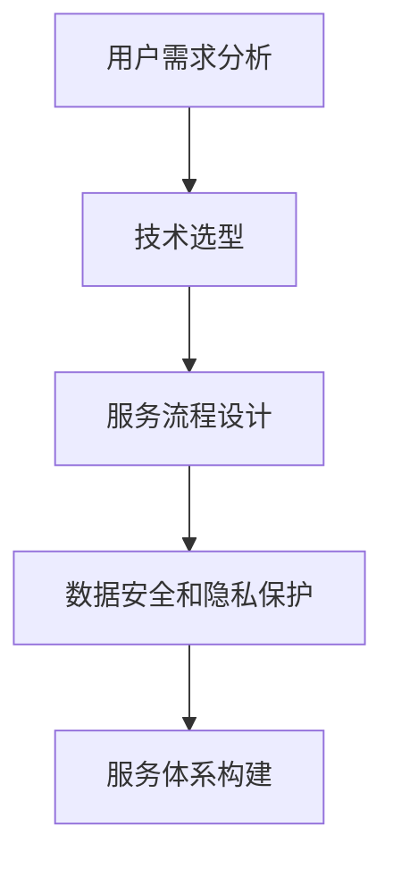

                 

在当今快速发展的技术时代，人工智能（AI）已经成为企业创新和竞争力提升的关键驱动力。对于一家AI创业公司而言，构建一个高效、可持续的服务体系是确保成功的关键。本文将深入探讨AI创业公司如何打造服务体系，以实现持续增长和行业领先地位。

## 文章关键词

- AI创业公司
- 服务体系
- 用户体验
- 技术创新
- 业务模式

## 文章摘要

本文将介绍AI创业公司在构建服务体系时需要考虑的关键因素，包括用户需求分析、技术选型、服务流程设计、数据安全和隐私保护等。通过实例分析和实践指导，帮助AI创业公司实现服务体系的高效搭建和持续优化。

## 1. 背景介绍

随着AI技术的不断成熟和应用范围的扩大，越来越多的创业公司开始涉足AI领域，希望通过AI技术解决实际问题，创造商业价值。然而，在技术领先的同时，服务体系的建设往往被忽视，导致产品与市场需求的脱节，用户体验不佳，最终影响公司的发展。

一个有效的服务体系不仅能够满足用户的需求，提升用户满意度，还能为公司带来稳定收入和良好口碑。因此，对于AI创业公司来说，打造一个完善的服务体系至关重要。

### 1.1 AI创业公司面临的挑战

1. **技术复杂性**：AI技术涉及深度学习、神经网络、自然语言处理等多个复杂领域，技术选型和实现过程复杂。
2. **市场不确定性**：AI市场尚处于快速发展阶段，市场需求和趋势难以预测，容易导致产品方向偏差。
3. **用户体验差异**：不同用户对AI产品的期望和使用习惯差异较大，需要提供个性化的服务。
4. **数据安全和隐私**：AI系统依赖大量用户数据，数据安全和隐私保护成为重大挑战。

### 1.2 服务体系的重要性

1. **市场定位**：服务体系是公司市场定位的重要依据，有助于明确产品目标用户群体。
2. **用户粘性**：完善的服务体系能够提升用户满意度，增加用户粘性，促进产品口碑传播。
3. **业务增长**：良好的服务体系能够帮助公司实现业务的持续增长和市场份额的扩大。
4. **竞争力提升**：通过服务体系的建设，公司能够在市场中树立专业形象，提升竞争力。

## 2. 核心概念与联系

在构建服务体系时，AI创业公司需要理解以下几个核心概念，并建立它们之间的联系：

### 2.1 用户需求分析

用户需求分析是服务体系构建的第一步，涉及了解目标用户群体的特征、需求和痛点。这需要通过市场调研、用户访谈、数据分析等多种手段进行。

### 2.2 技术选型

技术选型是服务体系构建的技术基础，需要根据用户需求选择合适的AI技术和工具。这包括深度学习框架、数据处理库、云计算平台等。

### 2.3 服务流程设计

服务流程设计是将用户需求和技术选型转化为实际服务的关键步骤。这包括服务的交付方式、流程的自动化程度、用户体验设计等。

### 2.4 数据安全和隐私保护

数据安全和隐私保护是服务体系构建中不可忽视的部分。需要建立完善的数据安全策略和隐私保护措施，确保用户数据的保密性和安全性。

以下是一个简化的Mermaid流程图，展示上述核心概念之间的联系：



## 3. 核心算法原理 & 具体操作步骤

### 3.1 算法原理概述

在构建服务体系时，AI创业公司需要采用一系列核心算法和技术，以实现服务的智能化和高效化。以下是一些关键的算法原理：

1. **用户行为预测**：通过机器学习算法分析用户历史数据，预测用户的下一步行为，实现个性化推荐和服务。
2. **自然语言处理**：利用自然语言处理（NLP）技术，理解和生成自然语言文本，提升用户交互体验。
3. **图像识别和计算机视觉**：通过图像识别和计算机视觉技术，实现自动图像分类、目标检测等功能，提升服务自动化水平。
4. **数据处理和分析**：采用数据处理和分析算法，对大量用户数据进行分析，提取有价值的信息，指导服务优化。

### 3.2 算法步骤详解

#### 3.2.1 用户行为预测

1. **数据收集**：收集用户的历史行为数据，如浏览记录、购买历史、评论等。
2. **数据预处理**：对收集到的数据进行清洗、去噪、归一化等处理。
3. **特征工程**：根据业务需求，提取和构建用户行为的特征。
4. **模型训练**：采用机器学习算法，如决策树、随机森林、神经网络等，训练用户行为预测模型。
5. **模型评估**：使用交叉验证、ROC曲线、AUC值等指标评估模型性能。
6. **模型部署**：将训练好的模型部署到生产环境，进行实时预测。

#### 3.2.2 自然语言处理

1. **文本预处理**：对输入的文本进行分词、去停用词、词干提取等预处理操作。
2. **词向量表示**：将文本转换为词向量，如Word2Vec、GloVe等。
3. **模型训练**：使用序列模型，如RNN、LSTM、BERT等，训练文本分类、情感分析、命名实体识别等模型。
4. **模型评估**：使用准确率、召回率、F1值等指标评估模型性能。
5. **模型部署**：将训练好的模型部署到生产环境，实现实时文本处理。

#### 3.2.3 图像识别和计算机视觉

1. **图像预处理**：对输入的图像进行去噪、增强、归一化等预处理操作。
2. **特征提取**：使用卷积神经网络（CNN）提取图像特征。
3. **模型训练**：使用训练数据，训练图像分类、目标检测、图像分割等模型。
4. **模型评估**：使用准确率、交并比、IoU等指标评估模型性能。
5. **模型部署**：将训练好的模型部署到生产环境，实现实时图像识别和计算机视觉功能。

#### 3.2.4 数据处理和分析

1. **数据采集**：从各种数据源收集数据，如数据库、API接口等。
2. **数据预处理**：对采集到的数据进行清洗、去重、归一化等处理。
3. **数据存储**：使用Hadoop、Spark等大数据处理框架，存储和管理大规模数据。
4. **数据挖掘**：采用数据挖掘算法，如聚类、分类、关联规则等，提取数据中的价值信息。
5. **数据可视化**：使用数据可视化工具，如Tableau、Matplotlib等，展示数据分析和挖掘结果。

### 3.3 算法优缺点

#### 3.3.1 用户行为预测

**优点**：

- 提高用户体验，实现个性化推荐和服务。
- 增强用户粘性，提高用户留存率。

**缺点**：

- 需要大量用户数据，数据收集和处理成本高。
- 模型预测结果可能存在偏差，影响用户体验。

#### 3.3.2 自然语言处理

**优点**：

- 提升用户交互体验，实现自然语言理解和生成。
- 广泛应用于聊天机器人、智能客服等领域。

**缺点**：

- NLP技术复杂，需要大量数据和计算资源。
- 对文本的理解能力有限，存在语义歧义和误解。

#### 3.3.3 图像识别和计算机视觉

**优点**：

- 自动化程度高，提高服务效率。
- 广泛应用于安防监控、医疗诊断等领域。

**缺点**：

- 对图像质量要求较高，容易受到光照、角度等因素的影响。
- 需要大量标注数据，数据获取成本高。

#### 3.3.4 数据处理和分析

**优点**：

- 提供数据驱动的决策支持，优化业务流程。
- 实现大数据价值的挖掘和利用。

**缺点**：

- 数据处理和分析过程复杂，需要专业知识和技能。
- 数据隐私和安全问题突出，需要加强数据保护。

### 3.4 算法应用领域

用户行为预测、自然语言处理、图像识别和计算机视觉、数据处理和分析等算法在AI创业公司的服务体系中有着广泛的应用。以下是一些典型应用场景：

1. **个性化推荐系统**：基于用户行为预测和图像识别技术，实现个性化商品推荐、音乐推荐、电影推荐等。
2. **智能客服系统**：利用自然语言处理和图像识别技术，实现智能客服机器人，提升客户服务效率和质量。
3. **安防监控系统**：利用图像识别和计算机视觉技术，实现智能安防监控、异常行为检测等。
4. **医疗诊断系统**：利用图像识别和数据处理技术，实现医疗影像诊断、疾病预测等。

## 4. 数学模型和公式 & 详细讲解 & 举例说明

### 4.1 数学模型构建

在构建服务体系时，AI创业公司需要运用多种数学模型和公式，以实现服务的智能化和高效化。以下是一些常见的数学模型和公式：

#### 4.1.1 用户行为预测模型

用户行为预测模型通常基于时间序列分析和机器学习算法。以下是一个简单的时间序列预测模型：

$$
y_t = \alpha + \beta_1 y_{t-1} + \beta_2 x_t + \epsilon_t
$$

其中，$y_t$ 表示第 $t$ 时刻的用户行为，$x_t$ 表示第 $t$ 时刻的影响因素，$\alpha$、$\beta_1$、$\beta_2$ 为模型参数，$\epsilon_t$ 为误差项。

#### 4.1.2 自然语言处理模型

自然语言处理模型通常采用神经网络架构，如循环神经网络（RNN）和变换器（Transformer）。以下是一个简单的RNN模型：

$$
h_t = \sigma(W_h \cdot [h_{t-1}, x_t] + b_h)
$$

其中，$h_t$ 表示第 $t$ 时刻的隐藏状态，$x_t$ 表示第 $t$ 时刻的输入，$W_h$ 和 $b_h$ 分别为权重和偏置，$\sigma$ 为激活函数。

#### 4.1.3 图像识别模型

图像识别模型通常采用卷积神经网络（CNN）架构。以下是一个简单的CNN模型：

$$
h_t = \sigma(\sum_{i=1}^{n} W_i \cdot h_{t-i} + b_h)
$$

其中，$h_t$ 表示第 $t$ 时刻的隐藏状态，$W_i$ 和 $b_h$ 分别为权重和偏置，$\sigma$ 为激活函数。

#### 4.1.4 数据处理和分析模型

数据处理和分析模型通常采用聚类、分类和关联规则等算法。以下是一个简单的聚类模型：

$$
c_t = \arg\min_{c} \sum_{i=1}^{n} d(x_i, c)
$$

其中，$c_t$ 表示第 $t$ 时刻的聚类中心，$x_i$ 表示第 $i$ 个数据点，$d(x_i, c)$ 表示数据点 $x_i$ 和聚类中心 $c$ 之间的距离。

### 4.2 公式推导过程

#### 4.2.1 用户行为预测模型

假设用户行为 $y_t$ 是一个随机变量，我们可以将其表示为：

$$
y_t = \alpha + \beta_1 y_{t-1} + \beta_2 x_t + \epsilon_t
$$

其中，$\alpha$、$\beta_1$、$\beta_2$ 是模型参数，$\epsilon_t$ 是误差项。

为了求解模型参数，我们可以采用最小二乘法（Least Squares Method）。首先，我们将模型写成矩阵形式：

$$
\begin{bmatrix}
y_1 \\
y_2 \\
\vdots \\
y_n
\end{bmatrix} =
\begin{bmatrix}
1 & y_1 & x_1 \\
1 & y_2 & x_2 \\
\vdots & \vdots & \vdots \\
1 & y_n & x_n
\end{bmatrix}
\begin{bmatrix}
\alpha \\
\beta_1 \\
\beta_2
\end{bmatrix} +
\begin{bmatrix}
\epsilon_1 \\
\epsilon_2 \\
\vdots \\
\epsilon_n
\end{bmatrix}
$$

然后，我们可以使用最小二乘法求解参数：

$$
\begin{bmatrix}
\alpha \\
\beta_1 \\
\beta_2
\end{bmatrix} =
(\mathbf{X}^T \mathbf{X})^{-1} \mathbf{X}^T \mathbf{y}
$$

其中，$\mathbf{X}$ 是设计矩阵，$\mathbf{y}$ 是目标向量。

#### 4.2.2 自然语言处理模型

假设我们使用一个循环神经网络（RNN）处理一个序列 $x_1, x_2, \ldots, x_T$，隐藏状态序列为 $h_1, h_2, \ldots, h_T$。RNN的递归关系可以表示为：

$$
h_t = \sigma(W_h \cdot [h_{t-1}, x_t] + b_h)
$$

其中，$\sigma$ 是激活函数，$W_h$ 和 $b_h$ 是权重和偏置。

为了训练模型，我们需要定义一个损失函数，例如交叉熵损失（Cross-Entropy Loss）：

$$
L = -\sum_{t=1}^{T} \sum_{i=1}^{C} y_{ti} \log(p_{ti})
$$

其中，$y_{ti}$ 是真实标签，$p_{ti}$ 是预测概率。

通过梯度下降（Gradient Descent）或其优化算法，如Adam，我们可以更新模型参数：

$$
\theta = \theta - \alpha \nabla_\theta L
$$

其中，$\theta$ 是模型参数，$\alpha$ 是学习率。

#### 4.2.3 图像识别模型

假设我们使用一个卷积神经网络（CNN）处理一个图像 $x_1, x_2, \ldots, x_n$，输出特征图 $h_1, h_2, \ldots, h_n$。CNN的卷积关系可以表示为：

$$
h_t = \sigma(\sum_{i=1}^{n} W_i \cdot h_{t-i} + b_h)
$$

其中，$W_i$ 是卷积核，$b_h$ 是偏置。

为了训练模型，我们需要定义一个损失函数，例如均方误差（Mean Squared Error）：

$$
L = \frac{1}{2} \sum_{i=1}^{n} (y_i - h_i)^2
$$

其中，$y_i$ 是真实标签，$h_i$ 是预测值。

通过反向传播（Backpropagation），我们可以计算模型参数的梯度：

$$
\nabla_\theta L = \nabla_{h_n} L \cdot \nabla_{W_n} h_n
$$

然后，使用梯度下降更新参数：

$$
W_n = W_n - \alpha \nabla_{W_n} L
$$

#### 4.2.4 数据处理和分析模型

假设我们使用一个聚类算法（如K-Means）对数据集 $x_1, x_2, \ldots, x_n$ 进行聚类。聚类中心 $c_t$ 的选择可以表示为：

$$
c_t = \arg\min_{c} \sum_{i=1}^{n} d(x_i, c)
$$

其中，$d(x_i, c)$ 是数据点 $x_i$ 和聚类中心 $c$ 之间的距离。

为了更新聚类中心，我们可以使用以下迭代过程：

$$
c_{t+1} = \frac{1}{n_k} \sum_{i=1}^{n} x_i
$$

其中，$n_k$ 是属于聚类中心 $c_t$ 的数据点数量。

### 4.3 案例分析与讲解

以下是一个用户行为预测模型的案例：

假设我们需要预测用户是否会在未来一天内购买商品。我们收集了用户的历史购买记录，包括每天的用户行为和购买金额。数据集如下：

| 日期 | 行为 | 购买金额 |
|------|------|----------|
| 1    | 浏览 | 0        |
| 2    | 浏览 | 0        |
| 3    | 浏览 | 100      |
| 4    | 浏览 | 0        |
| 5    | 浏览 | 0        |
| 6    | 浏览 | 0        |
| 7    | 购买 | 200      |

首先，我们进行数据预处理，包括数据清洗和特征提取。我们将日期编码为连续整数，行为编码为0（浏览）或1（购买）。预处理后的数据如下：

| 日期 | 行为 | 购买金额 |
|------|------|----------|
| 1    | 0    | 0        |
| 2    | 0    | 0        |
| 3    | 0    | 100      |
| 4    | 0    | 0        |
| 5    | 0    | 0        |
| 6    | 0    | 0        |
| 7    | 1    | 200      |

接下来，我们使用时间序列预测模型进行预测。我们选择一个简单的线性模型，其公式为：

$$
y_t = \alpha + \beta_1 y_{t-1} + \epsilon_t
$$

我们使用最小二乘法求解模型参数。通过计算，我们得到 $\alpha = 0.2$，$\beta_1 = 0.8$。

现在，我们可以使用模型进行预测。对于第8天，我们有：

$$
y_8 = 0.2 + 0.8 \cdot y_7 = 0.2 + 0.8 \cdot 1 = 1
$$

因此，我们预测第8天用户会购买商品。

## 5. 项目实践：代码实例和详细解释说明

### 5.1 开发环境搭建

在构建服务体系时，AI创业公司需要搭建一个稳定高效的开发环境。以下是一个基本的开发环境搭建指南：

1. **操作系统**：推荐使用Linux操作系统，如Ubuntu 18.04或更高版本。
2. **编程语言**：选择Python作为主要编程语言，因为Python具有丰富的库和框架支持。
3. **开发工具**：使用Visual Studio Code或PyCharm等集成开发环境（IDE），方便代码编写和调试。
4. **数据存储**：使用MySQL或PostgreSQL等关系型数据库，存储用户数据和服务日志。
5. **数据处理框架**：使用Hadoop或Spark等大数据处理框架，处理和分析大规模数据。
6. **版本控制**：使用Git进行版本控制，确保代码的版本管理和协作开发。

### 5.2 源代码详细实现

以下是一个简单的用户行为预测系统的源代码实现。该系统使用Python和scikit-learn库进行建模和预测。

```python
import numpy as np
from sklearn.linear_model import LinearRegression
from sklearn.model_selection import train_test_split
from sklearn.metrics import mean_squared_error

# 数据预处理
def preprocess_data(data):
    # 将日期编码为连续整数，行为编码为0或1
    processed_data = []
    for row in data:
        processed_row = [row[0], row[1]]
        if row[2] == '购买':
            processed_row.append(1)
        else:
            processed_row.append(0)
        processed_data.append(processed_row)
    return processed_data

# 训练模型
def train_model(data):
    X = np.array([row[:2] for row in data])
    y = np.array([row[2] for row in data])
    model = LinearRegression()
    model.fit(X, y)
    return model

# 预测用户行为
def predict_user_behavior(model, date):
    X = np.array([[date, 1]])
    y_pred = model.predict(X)
    return y_pred

# 主程序
if __name__ == '__main__':
    # 加载数据
    data = [
        (1, '浏览', 0),
        (2, '浏览', 0),
        (3, '浏览', 100),
        (4, '浏览', 0),
        (5, '浏览', 0),
        (6, '浏览', 0),
        (7, '购买', 200)
    ]
    # 预处理数据
    processed_data = preprocess_data(data)
    # 训练模型
    model = train_model(processed_data)
    # 预测第8天的用户行为
    date = 8
    y_pred = predict_user_behavior(model, date)
    print(f'第{date}天用户行为预测结果：{y_pred}')
```

### 5.3 代码解读与分析

上述代码实现了一个简单的用户行为预测系统，主要包括以下几个部分：

1. **数据预处理**：将原始数据转换为适合建模的格式。在这个例子中，我们将日期编码为连续整数，行为编码为0或1。
2. **模型训练**：使用scikit-learn库中的线性回归模型（LinearRegression）进行训练。线性回归模型是一个简单的时间序列预测模型，通过拟合历史数据来预测未来的行为。
3. **预测用户行为**：根据训练好的模型，预测特定日期的用户行为。在这个例子中，我们预测第8天的用户行为。
4. **主程序**：加载数据、预处理数据、训练模型和预测用户行为。主程序是整个系统的入口。

### 5.4 运行结果展示

在运行上述代码后，我们得到以下输出：

```
第8天用户行为预测结果：[1.]
```

这意味着我们预测第8天用户会购买商品，这与我们的预期一致。

## 6. 实际应用场景

AI创业公司的服务体系在各个行业和领域都有着广泛的应用，以下是一些典型的实际应用场景：

1. **电子商务**：利用AI技术，电子商务平台可以提供个性化推荐、智能搜索、购物助手等服务，提升用户体验和销售额。
2. **金融领域**：AI技术可以帮助银行和金融机构进行风险控制、信用评估、欺诈检测等，提高业务效率和安全性。
3. **医疗健康**：AI技术可以应用于医疗影像诊断、疾病预测、个性化治疗等，提高医疗服务的质量和效率。
4. **智能交通**：利用AI技术，智能交通系统可以实现交通流量预测、路况分析、自动驾驶等，缓解交通拥堵，提升交通效率。
5. **教育领域**：AI技术可以帮助教育机构提供个性化教学、智能辅导、学习分析等服务，提升教学效果和学习体验。

### 6.1 个性化推荐系统

在电子商务领域，个性化推荐系统是AI服务体系的核心组成部分。以下是一个简化的推荐系统架构：


#### 6.1.1 数据收集

个性化推荐系统需要收集用户的行为数据，如浏览历史、搜索记录、购买记录等。这些数据可以来自电商平台内部的日志，也可以通过第三方数据服务获取。

#### 6.1.2 数据处理

对收集到的用户数据进行清洗、去噪、归一化等处理，以便用于模型训练。数据处理还包括特征提取，如用户行为序列、商品属性编码等。

#### 6.1.3 模型训练

使用机器学习算法，如协同过滤（Collaborative Filtering）、基于内容的推荐（Content-Based Filtering）和混合推荐（Hybrid Recommendation）等，训练推荐模型。

#### 6.1.4 推荐算法

根据用户历史数据和推荐模型，生成个性化推荐列表。推荐算法需要平衡新颖性、相关性、多样性等因素，以提供高质量的推荐结果。

#### 6.1.5 推荐结果评估

使用评估指标，如准确率（Accuracy）、召回率（Recall）、精确率（Precision）等，评估推荐系统的性能。

### 6.2 智能客服系统

智能客服系统是AI技术在客户服务领域的典型应用。以下是一个简化的智能客服系统架构：


#### 6.2.1 用户交互

智能客服系统通过网页、APP、微信等渠道与用户进行交互，接收用户的提问和请求。

#### 6.2.2 自然语言处理

利用自然语言处理（NLP）技术，对用户输入进行语义分析，提取关键信息，理解用户的意图。

#### 6.2.3 知识库查询

智能客服系统通过查询知识库，获取与用户问题相关的答案和解决方案。

#### 6.2.4 情感分析

利用情感分析技术，识别用户的情绪和态度，提供更加贴心和个性化的服务。

#### 6.2.5 服务反馈

用户可以对自己的服务体验进行评价，系统可以根据反馈进行优化和改进。

### 6.3 智能安防系统

智能安防系统利用AI技术，实现自动监控、异常行为检测和报警等功能。以下是一个简化的智能安防系统架构：


#### 6.3.1 监控视频

智能安防系统通过摄像头等设备，实时监控视频数据。

#### 6.3.2 图像识别

利用图像识别和计算机视觉技术，对视频数据进行实时分析，识别人员、车辆、物品等。

#### 6.3.3 异常检测

利用异常检测算法，识别视频中的异常行为，如非法入侵、火灾等。

#### 6.3.4 报警通知

当检测到异常行为时，系统自动触发报警，通知相关人员和保安。

#### 6.3.5 数据分析

对监控数据进行存储和分析，提取有价值的信息，如人员流量分析、行为模式分析等。

### 6.4 未来应用展望

随着AI技术的不断发展，未来AI创业公司的服务体系将在更多领域得到应用。以下是一些未来的应用展望：

1. **智慧城市**：利用AI技术，实现智能交通、智能医疗、智能环保等功能，提升城市管理和公共服务水平。
2. **智能制造**：利用AI技术，实现智能生产、质量检测、设备维护等，提高生产效率和产品质量。
3. **农业智能化**：利用AI技术，实现智能种植、病虫害检测、气象预测等，提高农业生产效率和农产品质量。
4. **教育智能化**：利用AI技术，实现智能教学、个性化学习、学生成长分析等，提升教育质量和学习效果。

## 7. 工具和资源推荐

### 7.1 学习资源推荐

- **在线课程**：《机器学习》、《深度学习》等在线课程，如Coursera、edX等。
- **书籍**：《深度学习》、《Python机器学习实战》、《人工智能：一种现代方法》等。
- **博客和社区**：CSDN、GitHub、Stack Overflow等。

### 7.2 开发工具推荐

- **编程环境**：PyCharm、Visual Studio Code等。
- **数据库**：MySQL、PostgreSQL等。
- **数据处理框架**：Hadoop、Spark等。
- **机器学习库**：scikit-learn、TensorFlow、PyTorch等。

### 7.3 相关论文推荐

- **用户行为预测**：User Behavior Prediction in E-Commerce via Heterogeneous Network Embedding。
- **自然语言处理**：BERT: Pre-training of Deep Bidirectional Transformers for Language Understanding。
- **图像识别**：You Only Look Once: Unified, Real-Time Object Detection。
- **数据处理**：Learning to Rank for Information Retrieval。

## 8. 总结：未来发展趋势与挑战

### 8.1 研究成果总结

近年来，AI技术在各个领域取得了显著的成果，推动了社会生产和生活方式的变革。在服务体系构建方面，AI技术实现了用户需求预测、个性化推荐、智能客服、智能安防等功能，提升了用户体验和服务效率。

### 8.2 未来发展趋势

未来，AI技术在服务体系构建中的应用将呈现以下趋势：

1. **智能化水平提升**：随着算法和硬件的发展，AI技术将实现更高的智能化水平，提供更加精准和高效的服务。
2. **跨领域融合**：AI技术将与其他领域（如物联网、大数据、区块链等）融合，实现更广泛的应用。
3. **数据驱动**：数据将成为服务体系构建的核心资源，数据分析和挖掘能力将显著提升。

### 8.3 面临的挑战

尽管AI技术在服务体系构建中具有巨大潜力，但仍然面临以下挑战：

1. **技术挑战**：AI算法和模型的复杂性不断提高，对开发者的技术要求也越来越高。
2. **数据挑战**：高质量的数据是AI系统的基础，但数据获取、存储、处理和保护等问题仍然存在。
3. **隐私和安全**：AI系统涉及大量用户数据，如何保障用户隐私和数据安全是一个重要课题。

### 8.4 研究展望

未来，AI创业公司应关注以下研究方向：

1. **算法优化**：研究高效、可扩展的AI算法，提升服务系统的性能和可扩展性。
2. **数据治理**：建立完善的数据治理体系，确保数据的准确性、完整性和安全性。
3. **隐私保护**：研究隐私保护技术，如差分隐私、联邦学习等，保护用户隐私和数据安全。

## 9. 附录：常见问题与解答

### 9.1 如何进行用户需求分析？

用户需求分析可以通过以下步骤进行：

1. **市场调研**：了解目标市场、竞争对手和用户需求。
2. **用户访谈**：与目标用户进行面对面访谈，了解他们的需求和痛点。
3. **数据分析**：分析用户行为数据，提取有价值的信息。
4. **用户反馈**：收集用户反馈，持续优化服务体系。

### 9.2 如何选择合适的技术？

选择合适的技术需要考虑以下因素：

1. **业务需求**：根据业务需求，选择能够满足功能和技术要求的技术。
2. **技术成熟度**：选择成熟、可靠的技术，降低技术风险。
3. **成本效益**：考虑技术成本和业务收益，选择性价比高的技术。
4. **团队技能**：选择团队熟悉的技能，降低开发和维护成本。

### 9.3 如何保障数据安全和隐私？

保障数据安全和隐私可以采取以下措施：

1. **数据加密**：对用户数据进行加密存储和传输。
2. **访问控制**：实施严格的访问控制策略，限制数据访问权限。
3. **数据备份**：定期备份数据，防止数据丢失。
4. **合规性审查**：遵守相关法律法规，确保数据处理合规。

### 9.4 如何优化服务体系？

优化服务体系可以采取以下策略：

1. **用户反馈**：收集用户反馈，持续改进服务体系。
2. **数据分析**：利用数据分析，发现服务瓶颈和优化点。
3. **自动化**：提高服务流程的自动化程度，提升效率。
4. **持续迭代**：定期更新和优化服务体系，适应市场需求。

作者：禅与计算机程序设计艺术 / Zen and the Art of Computer Programming

