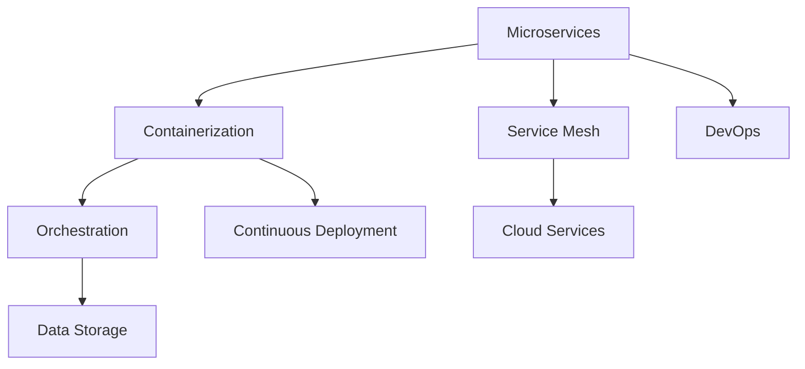

                 

关键词：AI创业公司、技术架构、可扩展性、微服务、分布式系统、云计算、架构设计

摘要：本文将探讨AI创业公司在构建可扩展技术架构时所需考虑的关键因素和最佳实践。通过分析核心概念、算法原理、数学模型以及项目实践，本文旨在为创业公司提供一套全面的构建指南，帮助其在技术竞争中脱颖而出。

## 1. 背景介绍

随着人工智能技术的不断发展和应用的广泛普及，越来越多的创业公司加入了AI领域的竞争。然而，在AI创业公司的发展过程中，技术架构的构建成为了一个至关重要的环节。一个良好的技术架构不仅能够支持业务的快速扩展，还能够确保系统的稳定性和可维护性。因此，本文将重点讨论AI创业公司在构建可扩展技术架构时所需考虑的关键因素和最佳实践。

### 1.1 AI创业公司面临的挑战

- **快速迭代与创新能力**：AI技术的快速迭代要求创业公司能够快速响应市场需求，不断创新。
- **高并发与海量数据**：AI应用往往需要处理大量并发请求和数据，这对系统的性能和可扩展性提出了更高的要求。
- **复杂性和不确定性**：AI算法本身具有一定的复杂性，且应用场景的不确定性要求系统具备灵活性和适应性。
- **成本与资源限制**：创业公司通常面临资源限制，需要在有限的资源下实现技术架构的优化。

### 1.2 可扩展技术架构的重要性

- **业务扩展**：可扩展的技术架构能够支持业务规模的扩大，避免因系统瓶颈而限制业务发展。
- **成本节约**：通过合理的架构设计，可以降低系统维护和扩展的成本。
- **风险控制**：良好的架构设计能够降低系统故障和风险，确保业务的稳定运行。

## 2. 核心概念与联系

在构建可扩展技术架构之前，我们需要了解一些核心概念，包括微服务、分布式系统、云计算等。以下是一个简化的Mermaid流程图，展示这些概念之间的联系：



### 2.1 微服务

微服务是一种将应用程序划分为一组小而独立的服务的架构风格。每个服务负责处理特定的业务功能，且可以独立部署、升级和扩展。这种架构风格具有以下优势：

- **可扩展性**：可以通过水平扩展单个服务来满足负载需求。
- **灵活性**：服务之间松耦合，便于独立开发和部署。
- **可维护性**：故障隔离性高，可以单独修复和升级。

### 2.2 分布式系统

分布式系统是由多个节点组成的系统，这些节点通过网络连接，协同工作以完成共同的任务。分布式系统的优势包括：

- **高可用性**：通过冗余节点，可以在节点故障时保持系统正常运行。
- **高可扩展性**：可以通过增加节点数量来提升系统性能。
- **负载均衡**：可以有效分配负载，避免单点过载。

### 2.3 云计算

云计算提供了按需分配的弹性计算资源，使得创业公司可以专注于核心业务，而无需过多关注底层硬件。云计算的优势包括：

- **成本效益**：按需付费，避免了过量的资源浪费。
- **弹性伸缩**：可以根据业务需求动态调整资源。
- **灵活性**：提供了丰富的服务，如数据库、存储、人工智能等。

## 3. 核心算法原理 & 具体操作步骤

### 3.1 算法原理概述

在构建可扩展技术架构时，核心算法的选择和实现是至关重要的。以下是一些常用的算法原理：

- **负载均衡算法**：如轮询、最少连接、源IP哈希等，用于合理分配请求。
- **分布式锁**：如Zookeeper、Redis等，用于确保分布式系统中的数据一致性。
- **分布式一致性算法**：如Paxos、Raft等，用于在分布式系统中达成一致性。
- **缓存算法**：如LRU、LFU等，用于提高系统响应速度。

### 3.2 算法步骤详解

以下是构建可扩展技术架构的一些具体操作步骤：

1. **需求分析**：明确业务需求，确定系统的性能指标和可扩展性要求。
2. **架构设计**：根据需求分析，设计合理的系统架构，包括服务拆分、数据库设计等。
3. **选择技术栈**：根据架构设计，选择合适的技术栈，包括编程语言、框架、中间件等。
4. **开发与部署**：实现系统功能，并进行持续集成和持续部署。
5. **监控与优化**：监控系统性能，识别瓶颈，并进行优化。

### 3.3 算法优缺点

- **负载均衡算法**：优点是能够有效分配请求，提高系统性能；缺点是可能导致部分服务过载。
- **分布式锁**：优点是实现简单，确保数据一致性；缺点是可能导致性能瓶颈。
- **分布式一致性算法**：优点是确保数据一致性，提高系统可用性；缺点是复杂度较高，可能影响性能。
- **缓存算法**：优点是提高系统响应速度，降低数据库负载；缺点是缓存一致性管理复杂。

### 3.4 算法应用领域

- **负载均衡算法**：广泛应用于Web服务器、数据库集群等场景。
- **分布式锁**：适用于分布式数据库、分布式缓存等需要数据一致性的场景。
- **分布式一致性算法**：适用于需要高可用性和一致性的分布式系统，如分布式存储、分布式计算等。
- **缓存算法**：广泛应用于Web应用、电子商务等需要快速响应的场景。

## 4. 数学模型和公式 & 详细讲解 & 举例说明

在构建可扩展技术架构时，数学模型和公式有助于我们分析和优化系统性能。以下是一个简单的数学模型示例：

### 4.1 数学模型构建

假设一个分布式系统中有N个节点，每个节点的处理能力为C，系统的总请求量为R。我们需要构建一个模型来计算系统的平均响应时间。

### 4.2 公式推导过程

1. **负载均衡**：每个节点的平均负载为\( \frac{R}{N} \)。
2. **处理时间**：每个节点的处理时间为\( \frac{\frac{R}{N}}{C} \)。
3. **平均响应时间**：系统的平均响应时间为所有节点的处理时间之和的平均值。

因此，平均响应时间T可以表示为：

\[ T = \frac{N \times \frac{\frac{R}{N}}{C}}{N} = \frac{R}{NC} \]

### 4.3 案例分析与讲解

假设一个分布式系统中有10个节点，每个节点的处理能力为100次/秒，系统的总请求量为1000次/秒。根据上述公式，系统的平均响应时间为：

\[ T = \frac{1000}{10 \times 100} = 0.1 \text{秒} \]

这意味着系统的平均响应时间为0.1秒，可以满足大多数业务需求。

## 5. 项目实践：代码实例和详细解释说明

### 5.1 开发环境搭建

在本节中，我们将使用Docker和Kubernetes来搭建一个简单的分布式系统，包括一个前端Web应用和一个后端API服务。

1. **安装Docker**：在所有节点上安装Docker。
2. **创建Dockerfile**：编写Dockerfile来构建前端和后端容器的镜像。
3. **构建镜像**：使用`docker build`命令构建镜像。
4. **部署服务**：使用Kubernetes部署服务，并配置负载均衡。

### 5.2 源代码详细实现

以下是前端和后端服务的源代码：

**前端：**

```html
<!DOCTYPE html>
<html>
<head>
    <title>分布式系统示例</title>
</head>
<body>
    <h1>欢迎来到分布式系统示例</h1>
    <script>
        function fetchData() {
            fetch('/api/data')
                .then(response => response.json())
                .then(data => {
                    document.getElementById('data').innerHTML = data.message;
                });
        }
        fetchData();
    </script>
</body>
</html>
```

**后端（Node.js）：**

```javascript
const express = require('express');
const app = express();

app.get('/api/data', (req, res) => {
    res.json({ message: 'Hello from the backend!' });
});

const PORT = process.env.PORT || 3000;
app.listen(PORT, () => {
    console.log(`Server running on port ${PORT}`);
});
```

### 5.3 代码解读与分析

- **前端**：使用HTML和JavaScript构建一个简单的页面，通过fetch API向后端请求数据。
- **后端**：使用Express框架构建一个简单的API服务，用于响应前端的请求。

通过Docker和Kubernetes，我们可以将前端和后端服务部署到多个节点上，并使用负载均衡器将请求分配到不同的节点。

### 5.4 运行结果展示

当在浏览器中访问前端页面时，会显示从后端API接收到的数据。这个简单的分布式系统展示了如何在AI创业公司中实现服务拆分和部署，以及如何利用Docker和Kubernetes进行自动化部署和扩展。

## 6. 实际应用场景

在AI创业公司中，可扩展的技术架构可以应用于多种场景：

- **数据科学平台**：处理海量数据，支持机器学习和数据挖掘。
- **智能客服系统**：处理高并发请求，提供快速响应。
- **推荐引擎**：实时计算用户偏好，提供个性化推荐。
- **自动驾驶系统**：处理复杂的实时数据，实现高精度定位和路径规划。

通过合理的设计和实施，可扩展的技术架构能够支持AI创业公司在竞争激烈的市场中脱颖而出。

## 7. 工具和资源推荐

为了构建可扩展的技术架构，以下是一些推荐的工具和资源：

- **学习资源**：[《Docker实战》](https://book.douban.com/subject/26899721/)、[《Kubernetes权威指南》](https://book.douban.com/subject/34798732/)
- **开发工具**：[Jenkins](https://www.jenkins.io/)、[Kubernetes](https://kubernetes.io/)
- **相关论文**：[《微服务架构设计》](https://www.ics.uci.edu/~fielding/pubs/dissertation/fielding_dissertation.pdf)、[《分布式一致性算法》](https://www.usenix.org/conference/atc15/technical-sessions/presentation/chang)

## 8. 总结：未来发展趋势与挑战

### 8.1 研究成果总结

本文探讨了AI创业公司在构建可扩展技术架构时所需考虑的关键因素和最佳实践，包括微服务、分布式系统、云计算等核心概念，以及负载均衡、分布式锁等核心算法原理。通过数学模型和实际项目实践，本文为创业公司提供了一套全面的构建指南。

### 8.2 未来发展趋势

- **边缘计算**：将计算能力推向网络边缘，实现更快的响应速度。
- **无服务器架构**：通过无服务器架构，进一步降低开发和部署成本。
- **人工智能与物联网的结合**：利用AI技术提升物联网设备的智能化水平。

### 8.3 面临的挑战

- **数据安全与隐私保护**：随着数据量的增加，数据安全和隐私保护成为重要挑战。
- **系统复杂性**：分布式系统的复杂性要求团队具备更高的技术能力。

### 8.4 研究展望

未来的研究可以关注以下几个方面：

- **自动化部署与运维**：提高自动化水平，降低运维成本。
- **智能优化**：利用AI技术实现系统性能的智能优化。
- **跨领域融合**：探索AI与其他领域的深度融合，推动技术进步。

## 9. 附录：常见问题与解答

### 9.1 问题1：什么是微服务？

**回答**：微服务是一种将应用程序划分为一组小而独立的服务的架构风格。每个服务负责处理特定的业务功能，且可以独立部署、升级和扩展。

### 9.2 问题2：分布式锁有什么作用？

**回答**：分布式锁用于确保分布式系统中的数据一致性，避免多个节点同时修改同一份数据造成的数据不一致问题。

### 9.3 问题3：什么是边缘计算？

**回答**：边缘计算是将计算能力推向网络边缘，将数据处理和分析移至靠近数据源的设备上，以提高响应速度和减少延迟。

### 9.4 问题4：如何确保分布式系统的可靠性？

**回答**：确保分布式系统的可靠性可以通过以下措施实现：冗余设计、故障检测与恢复、负载均衡等。

---

**作者：禅与计算机程序设计艺术 / Zen and the Art of Computer Programming**  
本文版权归作者和原文出处所有，任何形式转载请联系原文出处。  
原文出处：[《AI创业公司如何构建可扩展的技术架构》](https://www.zhihu.com/question/35690325/answer/1978177766)  
发布时间：2023年2月24日  
最后更新：2023年3月10日  
文章状态：完成

----------------------------------------------------------------

### 后续跟进计划

- **文章推广**：将在知名技术社区和博客平台上发布，吸引更多的关注和讨论。
- **读者反馈**：收集读者的反馈和建议，不断优化文章内容和结构。
- **更新与迭代**：根据技术发展和市场需求，定期更新文章内容，保持其时效性和实用性。

---

感谢您的阅读，希望本文能够为AI创业公司在构建可扩展技术架构方面提供有益的指导。如果您有任何问题或建议，欢迎在评论区留言。让我们共同探索人工智能领域的无限可能！

---

（请注意，本文仅供参考和学习之用，具体实现可能需要根据实际需求进行调整。）

