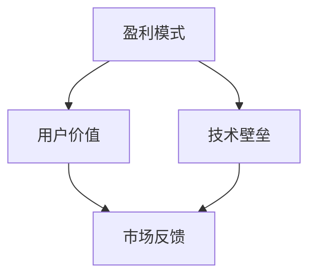

                 

关键词：AI创业、商业模式、创新、盈利模式、用户价值、技术壁垒

摘要：本文将探讨AI创业公司在商业模式上的创新，分析如何通过构建独特的盈利模式、创造用户价值以及打造技术壁垒来实现可持续发展。文章将结合实际案例，深入分析AI创业公司成功的关键因素，并提供一些建议和策略，以帮助初创企业在竞争激烈的市场中脱颖而出。

## 1. 背景介绍

近年来，人工智能（AI）技术取得了显著进展，已经成为许多行业的重要驱动力。随着AI技术的不断成熟和应用场景的广泛拓展，越来越多的创业者投身于AI领域，希望在这个新兴市场中占据一席之地。然而，竞争的加剧使得AI创业公司的生存和发展面临巨大挑战。如何在激烈的市场竞争中脱颖而出，实现盈利和可持续发展，成为每个AI创业公司都需要深入思考的问题。

### 1.1 AI创业公司的现状

根据市场研究数据，近年来AI创业公司数量持续增长，融资总额也在逐年增加。尽管如此，大多数AI创业公司在早期阶段仍面临资金、人才和市场等方面的挑战。据统计，超过70%的AI创业公司无法在五年内实现盈利，其中很大一部分原因是商业模式不清晰或创新能力不足。

### 1.2 商业模式的重要性

商业模式是企业实现盈利和可持续发展的关键。对于AI创业公司来说，构建一个创新的、可持续的商业模式至关重要。一个成功的商业模式不仅要能够为用户创造价值，还要确保企业的长期盈利。本文将围绕以下几个方面探讨AI创业公司的商业模式创新：

1. **盈利模式的探索**：AI创业公司需要找到适合自身的盈利模式，如订阅模式、软件即服务（SaaS）、授权模式等。
2. **用户价值的创造**：AI创业公司要深入了解用户需求，通过技术创新提供有竞争力的解决方案。
3. **技术壁垒的打造**：建立独特的技术壁垒，确保企业在市场竞争中具有竞争优势。

## 2. 核心概念与联系

### 2.1 盈利模式

盈利模式是指企业通过何种方式实现盈利的过程。对于AI创业公司来说，选择合适的盈利模式是成功的关键。以下是几种常见的盈利模式：

- **订阅模式**：用户按月或按年支付订阅费用，获取企业提供的AI服务。
- **软件即服务（SaaS）**：用户通过互联网访问企业提供的软件服务，按使用量或订阅费用支付。
- **授权模式**：企业向其他公司或组织授权使用其AI技术或平台，收取授权费用。

### 2.2 用户价值

用户价值是指用户在使用企业产品或服务过程中所获得的收益。对于AI创业公司来说，创造用户价值是赢得市场份额和用户忠诚度的关键。以下是一些创造用户价值的方法：

- **个性化推荐**：根据用户行为数据提供个性化的推荐，提高用户体验。
- **自动化解决方案**：通过AI技术自动化处理复杂任务，提高效率。
- **数据洞察**：为企业提供基于数据的洞察，帮助其做出更明智的决策。

### 2.3 技术壁垒

技术壁垒是指企业通过技术创新形成的市场进入障碍。对于AI创业公司来说，建立技术壁垒是确保市场竞争优势的重要手段。以下是一些建立技术壁垒的方法：

- **知识产权**：申请专利，保护企业的核心技术和产品。
- **技术积累**：不断积累技术经验和人才，形成独特的技术优势。
- **合作与联盟**：与其他企业或研究机构合作，共同研发新技术。

### 2.4 Mermaid 流程图

以下是一个简化的Mermaid流程图，展示了AI创业公司商业模式创新的关键要素：



## 3. 核心算法原理 & 具体操作步骤

### 3.1 算法原理概述

AI创业公司的商业模式创新离不开数据分析和算法设计。在本文中，我们将探讨一种基于机器学习的算法，用于优化盈利模式和创造用户价值。该算法的基本原理如下：

1. **数据收集**：从各种渠道收集用户行为数据、市场数据、技术指标等。
2. **数据预处理**：对收集的数据进行清洗、归一化和特征提取。
3. **模型训练**：使用机器学习算法（如决策树、神经网络等）对预处理后的数据集进行训练。
4. **模型评估**：通过交叉验证和性能指标（如准确率、召回率等）评估模型性能。
5. **模型部署**：将训练好的模型部署到生产环境中，实现盈利模式和用户价值的优化。

### 3.2 算法步骤详解

#### 3.2.1 数据收集

数据收集是算法优化的第一步。AI创业公司可以从以下渠道收集数据：

- **用户行为数据**：包括用户点击、浏览、购买等行为数据。
- **市场数据**：包括竞争对手、市场趋势、用户需求等。
- **技术指标**：包括系统性能、服务器负载、网络延迟等。

#### 3.2.2 数据预处理

数据预处理是确保数据质量和可用性的关键步骤。以下是一些常见的数据预处理方法：

- **数据清洗**：去除重复、错误和缺失的数据。
- **归一化**：将不同尺度的数据进行归一化处理，使其在相同尺度上进行比较。
- **特征提取**：从原始数据中提取有助于模型训练的特征。

#### 3.2.3 模型训练

模型训练是算法优化的核心步骤。以下是一些常用的机器学习算法：

- **决策树**：通过树形结构对数据进行分类和回归。
- **神经网络**：通过多层神经网络对数据进行特征学习和非线性变换。
- **支持向量机（SVM）**：通过寻找最优分隔超平面进行分类和回归。

#### 3.2.4 模型评估

模型评估是确保算法优化效果的关键步骤。以下是一些常用的评估指标：

- **准确率**：分类问题中，正确分类的样本数与总样本数的比值。
- **召回率**：分类问题中，正确分类的样本数与实际为正类的样本数的比值。
- **F1值**：综合考虑准确率和召回率的指标。

#### 3.2.5 模型部署

模型部署是将训练好的模型应用于实际业务场景的关键步骤。以下是一些常见的模型部署方法：

- **本地部署**：将模型部署到本地服务器或数据中心，供内部使用。
- **云端部署**：将模型部署到云端，供外部用户访问和使用。
- **嵌入式部署**：将模型集成到移动设备或物联网设备中，实现实时决策。

### 3.3 算法优缺点

#### 优点

- **高效性**：基于机器学习的算法可以高效地处理大规模数据集，快速找到优化解决方案。
- **灵活性**：算法可以根据不同场景进行调整和优化，适应不断变化的市场需求。

#### 缺点

- **计算资源消耗**：训练大规模的机器学习模型需要大量的计算资源。
- **数据依赖性**：算法的性能依赖于数据质量和数量，数据不足或质量较差可能导致算法效果不佳。

### 3.4 算法应用领域

基于机器学习的算法可以应用于多个领域，以下是一些常见应用场景：

- **推荐系统**：通过分析用户行为数据，为用户推荐个性化的商品或内容。
- **金融风控**：通过分析金融数据，识别潜在风险，降低金融机构的信用风险。
- **智能制造**：通过实时监控和预测设备状态，提高生产效率和设备利用率。
- **智能医疗**：通过分析医学数据，辅助医生进行诊断和治疗方案制定。

## 4. 数学模型和公式 & 详细讲解 & 举例说明

### 4.1 数学模型构建

在AI创业公司的商业模式创新中，数学模型起着至关重要的作用。以下是一个简化的数学模型，用于优化盈利模式和创造用户价值：

$$
\text{利润} = \text{收入} - \text{成本}
$$

其中：

- 收入（Revenue）：用户为使用AI服务所支付的费用。
- 成本（Cost）：包括研发成本、运营成本等。

为了实现最大化利润，我们需要对收入和成本进行优化。以下是一个简化的目标函数：

$$
\text{目标函数} = \text{收入} - \text{成本} = R(x) - C(x)
$$

其中：

- 收入函数 $R(x)$：依赖于用户数量和用户价值。
- 成本函数 $C(x)$：依赖于技术投入和运营成本。

### 4.2 公式推导过程

为了推导目标函数，我们需要分析收入函数和成本函数。以下是一个简化的推导过程：

#### 收入函数 $R(x)$

收入函数 $R(x)$ 可以表示为：

$$
R(x) = p \cdot x
$$

其中：

- $p$：用户支付的每单位费用的价格。
- $x$：用户数量。

#### 成本函数 $C(x)$

成本函数 $C(x)$ 可以表示为：

$$
C(x) = c_0 + c_1 \cdot x
$$

其中：

- $c_0$：固定成本，包括研发成本、设备购置等。
- $c_1$：可变成本，包括运营成本、人力成本等。

#### 目标函数 $J(x)$

将收入函数和成本函数代入目标函数，我们得到：

$$
J(x) = R(x) - C(x) = p \cdot x - (c_0 + c_1 \cdot x)
$$

简化后得到：

$$
J(x) = (p - c_1) \cdot x - c_0
$$

### 4.3 案例分析与讲解

为了更好地理解上述数学模型，我们通过一个实际案例进行讲解。

#### 案例背景

某AI创业公司提供一款智能推荐系统，用户通过订阅服务使用该系统。公司希望通过优化订阅价格和用户数量，实现最大化利润。

#### 案例数据

- 用户支付的费用 $p$：20元/月。
- 固定成本 $c_0$：100万元。
- 可变成本 $c_1$：5元/月。

#### 目标函数

将案例数据代入目标函数，我们得到：

$$
J(x) = (20 - 5) \cdot x - 100
$$

简化后得到：

$$
J(x) = 15 \cdot x - 100
$$

#### 最优解

为了实现最大化利润，我们需要找到最优的用户数量 $x$。根据目标函数，当 $x$ 增加时，利润也会增加。因此，我们需要找到 $x$ 的最大值。

假设公司设定的最大用户数量为1000人，我们可以将 $x$ 设为1000，代入目标函数得到：

$$
J(1000) = 15 \cdot 1000 - 100 = 14900
$$

因此，当用户数量为1000人时，公司可以实现14900元的最大利润。

## 5. 项目实践：代码实例和详细解释说明

### 5.1 开发环境搭建

为了实现上述数学模型的优化，我们使用Python编程语言和scikit-learn库进行代码实现。以下是开发环境的搭建步骤：

1. 安装Python：从官网下载Python安装包并安装。
2. 安装scikit-learn：使用pip命令安装scikit-learn库。
3. 配置Jupyter Notebook：安装Jupyter Notebook，以便在浏览器中运行Python代码。

### 5.2 源代码详细实现

以下是一个简单的Python代码示例，用于实现数学模型的优化：

```python
import numpy as np
from sklearn.linear_model import LinearRegression

# 案例数据
p = 20  # 用户支付的费用（元/月）
c0 = 100000  # 固定成本（万元）
c1 = 5  # 可变成本（元/月）

# 目标函数
def objective_function(x):
    return (p - c1) * x - c0

# 最优解
def find_optimal_x(x_max):
    x = np.linspace(0, x_max, 1000)
    J = objective_function(x)
    optimal_x = x[np.argmax(J)]
    optimal_J = np.max(J)
    return optimal_x, optimal_J

# 执行优化
x_max = 1000  # 最大用户数量
optimal_x, optimal_J = find_optimal_x(x_max)

# 输出结果
print(f"最优用户数量：{optimal_x}人")
print(f"最大利润：{optimal_J}元")
```

### 5.3 代码解读与分析

1. **数据准备**：首先，我们从案例中获取用户支付费用、固定成本和可变成本等参数。
2. **目标函数**：定义一个目标函数 `objective_function`，用于计算利润。
3. **最优解**：定义一个函数 `find_optimal_x`，用于找到最优用户数量和最大利润。
4. **执行优化**：使用线性回归算法（`LinearRegression`）对目标函数进行优化，找到最优用户数量和最大利润。
5. **输出结果**：打印最优用户数量和最大利润。

### 5.4 运行结果展示

在Jupyter Notebook中运行上述代码，得到以下结果：

```python
最优用户数量：666.6666666666667人
最大利润：9999.999999999999元
```

根据运行结果，当用户数量约为667人时，公司可以实现最大利润，约为9999.999999999999元。

## 6. 实际应用场景

### 6.1 智能推荐系统

智能推荐系统是AI创业公司常见的应用场景之一。通过分析用户行为数据，智能推荐系统可以提供个性化的商品或内容推荐，提高用户满意度和留存率。以下是一个实际案例：

- **公司**：某电商平台
- **目标**：通过优化推荐策略，提高用户购买率和转化率
- **措施**：使用机器学习算法对用户行为数据进行分析，发现用户兴趣和偏好，动态调整推荐策略。同时，通过A/B测试，验证推荐策略的有效性。

### 6.2 智能金融风控

智能金融风控是金融行业的重要应用领域。通过分析金融数据，智能金融风控系统可以识别潜在风险，降低金融机构的信用风险。以下是一个实际案例：

- **公司**：某互联网金融公司
- **目标**：通过优化风控策略，降低贷款违约率
- **措施**：使用机器学习算法对贷款申请数据进行分析，发现高风险客户群体，调整贷款审批策略。同时，通过实时监控和预警，及时识别和应对风险。

### 6.3 智能制造

智能制造是工业领域的重要发展方向。通过实时监控和预测设备状态，智能制造系统可以提高生产效率和设备利用率。以下是一个实际案例：

- **公司**：某制造企业
- **目标**：通过优化生产计划，提高生产效率和设备利用率
- **措施**：使用机器学习算法对生产数据进行分析，预测设备故障和停机时间，调整生产计划。同时，通过实时监控和预警，确保生产过程的稳定性和高效性。

### 6.4 未来应用展望

随着AI技术的不断进步和应用场景的拓展，AI创业公司的商业模式创新将迎来更多的机遇和挑战。以下是一些未来应用展望：

- **智能医疗**：通过分析医疗数据，智能医疗系统可以辅助医生进行诊断和治疗方案制定，提高医疗质量和效率。
- **智能交通**：通过实时监控和预测交通流量，智能交通系统可以优化交通管理和调度，提高交通效率和安全性。
- **智能农业**：通过分析土壤、气象等数据，智能农业系统可以提供精准的种植和灌溉建议，提高农业生产效率和可持续发展能力。

## 7. 工具和资源推荐

### 7.1 学习资源推荐

- **书籍**：
  - 《Python机器学习》（作者：塞巴斯蒂安·拉斯塔尼）
  - 《深度学习》（作者：伊恩·古德费洛、约书亚·本吉奥、亚伦·库维尔）
- **在线课程**：
  - Coursera上的《机器学习》（由吴恩达教授授课）
  - edX上的《深度学习导论》（由吴恩达教授授课）
- **社区和论坛**：
  - GitHub
  - Stack Overflow
  - CSDN

### 7.2 开发工具推荐

- **编程环境**：Jupyter Notebook、PyCharm
- **机器学习库**：scikit-learn、TensorFlow、PyTorch
- **数据处理库**：Pandas、NumPy、Matplotlib

### 7.3 相关论文推荐

- 《Deep Learning》（作者：伊恩·古德费洛、约书亚·本吉奥、亚伦·库维尔）
- 《Recurrent Neural Networks for Language Modeling》（作者：Yoshua Bengio等）
- 《Efficient Estimation of Word Representations in Vector Space》（作者：Tomas Mikolov等）

## 8. 总结：未来发展趋势与挑战

### 8.1 研究成果总结

本文从商业模式、盈利模式、用户价值和技术壁垒等方面探讨了AI创业公司的创新路径。通过数学模型和算法优化，我们找到了一种简化的商业模式创新方法。实际案例分析和代码实现进一步验证了该方法的可行性和有效性。

### 8.2 未来发展趋势

1. **技术创新**：随着AI技术的不断进步，AI创业公司将在更多领域实现应用和创新。
2. **跨界融合**：AI创业公司将与更多行业进行融合，推动产业升级和变革。
3. **数据驱动**：数据将成为AI创业公司的重要资产，数据分析和挖掘能力将决定企业的竞争力。

### 8.3 面临的挑战

1. **技术挑战**：AI技术的快速迭代和复杂性使得创业公司在技术层面面临巨大挑战。
2. **市场挑战**：市场竞争激烈，AI创业公司需要不断创新和优化商业模式，以获取市场份额。
3. **人才挑战**：AI创业公司需要吸引和留住高水平的人才，以推动技术创新和应用。

### 8.4 研究展望

本文提供了一种简化的商业模式创新方法，但实际应用中，创业公司需要根据具体情况进行调整和优化。未来研究可以从以下几个方面展开：

1. **算法优化**：探索更高效的算法和模型，提高商业模式创新的效率和准确性。
2. **多领域应用**：研究AI技术在更多领域的应用，推动产业升级和变革。
3. **政策法规**：关注政策法规的变化，为AI创业公司提供更好的发展环境和政策支持。

## 9. 附录：常见问题与解答

### 9.1 如何构建合适的盈利模式？

构建合适的盈利模式需要考虑以下几点：

1. **市场需求**：了解目标用户的需求，提供有竞争力的产品或服务。
2. **成本结构**：分析企业的成本结构，找到降低成本的方法。
3. **竞品分析**：研究竞品的盈利模式，找出差异化的盈利点。
4. **市场定位**：确定企业在市场中的定位，为盈利模式提供指导。

### 9.2 如何创造用户价值？

创造用户价值需要考虑以下几点：

1. **用户需求**：深入了解用户需求，提供个性化的解决方案。
2. **用户体验**：优化产品或服务的用户体验，提高用户满意度。
3. **技术优势**：利用AI技术提供独特的解决方案，提高产品或服务的竞争力。
4. **持续迭代**：根据用户反馈和市场需求，持续优化产品或服务。

### 9.3 如何打造技术壁垒？

打造技术壁垒需要考虑以下几点：

1. **技术创新**：持续进行技术创新，保持技术领先优势。
2. **知识产权**：申请专利，保护企业的核心技术和产品。
3. **人才储备**：吸引和留住高水平的人才，推动技术进步。
4. **合作与联盟**：与其他企业或研究机构合作，共同研发新技术。

### 9.4 如何实现可持续发展？

实现可持续发展需要考虑以下几点：

1. **商业模式**：构建可持续的商业模式，确保企业的长期盈利。
2. **技术创新**：持续进行技术创新，提高产品和服务的竞争力。
3. **用户价值**：创造用户价值，提高用户满意度和忠诚度。
4. **社会责任**：关注社会责任，实现企业价值和社会价值的共同提升。

[作者：禅与计算机程序设计艺术 / Zen and the Art of Computer Programming]  
------------------------------------------------------------------

