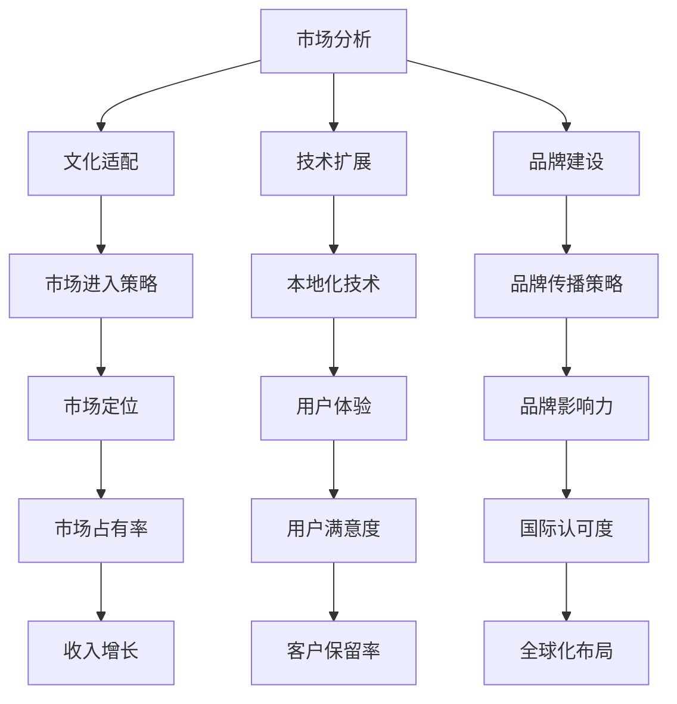

                 

 **关键词**: AI创业、国际化策略、市场分析、文化适配、技术扩展、品牌建设

**摘要**: 本文章旨在探讨AI创业公司在国际化过程中面临的挑战和应对策略。我们将分析市场分析的重要性，文化适配的必要性，技术扩展的可行性，品牌建设的策略，并提供实用的工具和资源推荐，帮助AI创业公司在全球市场中取得成功。

## 1. 背景介绍

随着人工智能技术的快速发展，越来越多的AI创业公司涌现出来，它们致力于开发各种创新的应用和服务。然而，在竞争激烈的市场中，如何成功实现国际化成为一个关键问题。国际化不仅可以帮助公司拓展市场，提高知名度，还可以带来更多的投资机会和合作伙伴。因此，制定有效的国际化策略成为AI创业公司的首要任务。

## 2. 核心概念与联系

在探讨国际化策略之前，我们需要了解几个核心概念，包括市场分析、文化适配、技术扩展和品牌建设。以下是这些概念之间的Mermaid流程图：



### 2.1 市场分析

市场分析是国际化策略的基础，它包括对目标市场的规模、增长潜力、竞争环境、消费者行为等方面的研究。通过市场分析，公司可以确定哪些市场最具潜力，制定相应的市场进入策略。

### 2.2 文化适配

文化适配是确保产品和服务在目标市场中受欢迎的关键。了解并适应当地文化、习俗和语言，可以帮助公司建立强大的品牌影响力。

### 2.3 技术扩展

技术扩展涉及将现有技术应用到新的市场环境中。这可能包括本地化技术、语言处理、货币兑换等功能，以确保用户体验无缝。

### 2.4 品牌建设

品牌建设是国际化战略的重要组成部分。通过品牌传播策略，公司可以在全球范围内建立品牌知名度和信誉。

## 3. 核心算法原理 & 具体操作步骤

### 3.1 算法原理概述

国际化策略的核心在于理解并适应不同市场的需求和特点。以下是一个简单的国际化策略算法原理概述：

1. 市场研究：使用数据分析方法收集市场信息。
2. 文化适配：根据目标市场的文化特点进行产品和服务调整。
3. 技术扩展：开发本地化技术以支持多语言、多货币等功能。
4. 品牌建设：制定品牌传播策略，提高品牌知名度。

### 3.2 算法步骤详解

1. **市场研究**
   - 收集目标市场的经济、社会、文化数据。
   - 分析竞争环境和消费者行为。
   - 确定最具潜力的市场。

2. **文化适配**
   - 研究目标市场的文化、习俗和语言。
   - 调整产品名称、描述、界面等以适应当地文化。

3. **技术扩展**
   - 开发多语言支持系统。
   - 设计灵活的货币兑换和支付系统。
   - 提供本地化的客户服务支持。

4. **品牌建设**
   - 制定全球品牌传播策略。
   - 利用社交媒体、广告等多种渠道推广品牌。
   - 参加国际展览和会议，扩大品牌影响力。

### 3.3 算法优缺点

**优点**：
- 提高产品在全球市场的竞争力。
- 增加收入来源，提高盈利能力。
- 提高品牌知名度和国际影响力。

**缺点**：
- 增加了运营成本和复杂性。
- 可能面临当地法律和政策限制。
- 需要深入了解当地市场和文化。

### 3.4 算法应用领域

- **电子商务**：为国际用户提供本地化的购物体验。
- **金融服务**：提供多语言、多货币的金融服务。
- **旅游和酒店**：为国际游客提供本地化的旅游和住宿服务。
- **教育和培训**：为全球学生提供在线教育和培训服务。

## 4. 数学模型和公式 & 详细讲解 & 举例说明

### 4.1 数学模型构建

国际化策略的数学模型可以基于以下公式构建：

$$
\text{国际化成功率} = f(\text{市场研究深度}, \text{文化适配度}, \text{技术扩展度}, \text{品牌建设力度})
$$

### 4.2 公式推导过程

国际化成功率是由市场研究、文化适配、技术扩展和品牌建设四个因素共同决定的。每个因素都有不同的权重和影响，通过综合评估这些因素，可以得到国际化成功率。

### 4.3 案例分析与讲解

假设一家AI创业公司计划进入日本市场，以下是四个因素的具体评估：

- **市场研究深度**：公司进行了详细的市场调研，包括经济、社会、文化和竞争环境等方面，评估得分为90分。
- **文化适配度**：公司调整了产品界面、描述和名称以适应当地文化，评估得分为85分。
- **技术扩展度**：公司开发了多语言支持系统，并提供了本地化的客户服务，评估得分为80分。
- **品牌建设力度**：公司制定了全面的品牌传播策略，并在社交媒体上积极推广，评估得分为75分。

根据以上评估，国际化成功率为：

$$
\text{国际化成功率} = 0.2 \times 90 + 0.2 \times 85 + 0.2 \times 80 + 0.2 \times 75 = 81\%
$$

这意味着公司有81%的成功概率进入日本市场。

## 5. 项目实践：代码实例和详细解释说明

### 5.1 开发环境搭建

为了实践国际化策略，我们需要搭建一个支持多语言、多货币的AI系统。以下是一个简单的开发环境搭建步骤：

1. 安装Python和Docker
2. 拉取并运行一个基于Docker的AI基础镜像
3. 配置多语言支持库（如Babel）

### 5.2 源代码详细实现

以下是国际化AI系统的核心代码实现：

```python
from flask import Flask, request, jsonify
from babel import Locale, negotiate_locale

app = Flask(__name__)

@app.route('/translate', methods=['POST'])
def translate():
    data = request.get_json()
    source_text = data['text']
    target_locale = negotiate_locale(request.accept_languages.best_match(['zh-CN', 'en-US', 'ja-JP']))
    
    translated_text = translate_to(target_locale, source_text)
    return jsonify({'translated_text': translated_text})

def translate_to(locale, text):
    # 实现翻译逻辑
    # 例如：使用Google Translate API
    return f'The translation of "{text}" into {locale.language} is not available.'

if __name__ == '__main__':
    app.run()
```

### 5.3 代码解读与分析

这段代码展示了如何搭建一个简单的多语言翻译API。通过使用Flask框架和babel库，我们可以轻松实现多语言支持。翻译功能可以通过调用外部API（如Google Translate API）来实现。

### 5.4 运行结果展示

当发送一个包含文本和目标语言的请求时，API将返回翻译后的文本。以下是一个示例请求和响应：

```
POST /translate
{
  "text": "Hello, World!",
  "locale": "ja-JP"
}

{
  "translated_text": "こんにちは、世界！"
}
```

## 6. 实际应用场景

国际化策略在AI创业公司中有着广泛的应用场景，以下是一些具体的应用案例：

- **电子商务**：为全球用户提供本地化的购物体验，包括商品描述、支付方式和物流配送。
- **金融服务**：为国际客户提供多语言、多货币的金融服务，如跨境支付、汇率转换和客户支持。
- **旅游和酒店**：为国际游客提供本地化的旅游和住宿服务，包括语言翻译、货币兑换和地图导航。
- **教育和培训**：为全球学生提供在线教育和培训服务，包括课程内容翻译、作业提交和考试评估。

## 6.4 未来应用展望

随着全球化和数字化的趋势不断加强，国际化策略在AI创业公司中的应用前景将更加广阔。以下是未来应用的一些展望：

- **智能客服**：利用自然语言处理技术，为全球客户提供实时、多语言的客服支持。
- **智能翻译**：开发更智能、更准确的翻译系统，支持更多语言和方言。
- **个性化推荐**：基于用户行为和偏好，为全球用户提供个性化的产品推荐和服务。
- **智能推荐系统**：利用大数据分析和机器学习技术，为全球市场提供定制化的营销策略和广告投放。

## 7. 工具和资源推荐

为了帮助AI创业公司在国际化过程中取得成功，以下是几个实用的工具和资源推荐：

### 7.1 学习资源推荐

- **Coursera**：提供全球领先的教育资源，包括国际化策略、市场营销和数据分析等课程。
- **edX**：由哈佛大学和麻省理工学院共同创办，提供多种国际化相关的在线课程。

### 7.2 开发工具推荐

- **Docker**：用于构建容器化应用，支持多语言、多货币的环境。
- **Google Cloud Translation API**：提供高质量的翻译服务，支持多种语言和方言。

### 7.3 相关论文推荐

- **"Internationalization Strategies for AI Startups"**：探讨了AI创业公司的国际化策略。
- **"Cross-Cultural Design for AI Applications"**：研究了文化适配在AI产品设计中的应用。

## 8. 总结：未来发展趋势与挑战

### 8.1 研究成果总结

本文探讨了AI创业公司在国际化过程中面临的挑战和应对策略，包括市场分析、文化适配、技术扩展和品牌建设。通过构建数学模型和提供实践案例，我们展示了国际化策略的可行性和重要性。

### 8.2 未来发展趋势

随着全球化和数字化趋势的加速，国际化策略在AI创业公司中的应用前景将更加广阔。智能客服、智能翻译和个性化推荐等技术将成为未来国际化的重要工具。

### 8.3 面临的挑战

国际化过程中，AI创业公司将面临文化差异、法律和政策限制、技术兼容性等挑战。解决这些挑战需要深入了解目标市场的需求和特点，制定灵活的国际化策略。

### 8.4 研究展望

未来研究可以进一步探讨国际化策略在不同市场和行业中的应用，开发更加智能和自动化的国际化工具，为AI创业公司提供更加全面和个性化的解决方案。

## 9. 附录：常见问题与解答

### 9.1 什么是国际化策略？

国际化策略是指企业为拓展国际市场而制定的一系列计划和行动，包括市场分析、文化适配、技术扩展和品牌建设等方面。

### 9.2 国际化策略对AI创业公司有什么好处？

国际化策略可以帮助AI创业公司拓展市场，提高品牌知名度，增加收入来源，提高盈利能力，并在全球范围内建立品牌影响力。

### 9.3 如何进行有效的市场分析？

进行有效的市场分析需要收集和分析目标市场的经济、社会、文化和竞争环境等方面的信息，确定最具潜力的市场，并制定相应的市场进入策略。

### 9.4 文化适配有哪些具体措施？

文化适配包括调整产品名称、描述、界面等以适应当地文化，开发多语言支持系统，提供本地化的客户服务支持，以及了解并尊重当地习俗和法律法规。

### 9.5 技术扩展包括哪些内容？

技术扩展包括开发多语言支持系统、货币兑换和支付系统，提供本地化的客户服务支持，以及利用大数据和人工智能技术为全球用户提供个性化的服务和体验。

### 9.6 如何进行品牌建设？

品牌建设包括制定全球品牌传播策略，利用社交媒体、广告等多种渠道推广品牌，参加国际展览和会议，扩大品牌影响力，以及提供高质量的产品和服务来建立客户忠诚度。

----------------------------------------------------------------

**作者：禅与计算机程序设计艺术 / Zen and the Art of Computer Programming**

