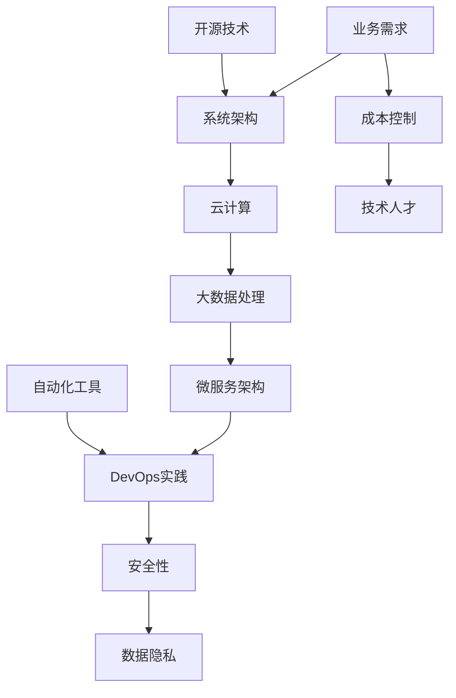

                 

关键词：人工智能创业，技术架构，系统设计，云计算，大数据，微服务，开源技术，DevOps，安全性，可持续性

> 摘要：本文将探讨AI创业公司在技术架构设计方面的重要考量。通过分析现有的技术趋势和最佳实践，本文旨在为AI创业公司提供一个全面的架构设计方案，以帮助它们在激烈的市场竞争中脱颖而出。

## 1. 背景介绍

在当今快速发展的科技时代，人工智能（AI）已经成为推动企业创新和增长的关键动力。AI创业公司面临着独特的挑战和机遇，需要构建一个高效、灵活且可持续的技术架构来支持其业务目标。技术架构的设计不仅关系到系统的性能和稳定性，也直接影响公司的成本控制和市场竞争力。

### 1.1 创业公司的技术挑战

- **快速迭代和适应性**：创业公司通常需要在短时间内推出产品，这就要求技术架构具备快速迭代的能力。
- **成本控制**：资金有限是多数创业公司的现实问题，因此必须精打细算，确保技术架构在高效运行的同时不超支。
- **数据安全和隐私**：随着数据泄露事件的频繁发生，保护用户数据安全和隐私成为技术架构设计的关键考量。
- **技术人才短缺**：创业公司可能难以吸引和保留顶尖技术人才，因此需要利用开源技术和自动化工具来减轻开发负担。

### 1.2 技术架构的重要性

一个良好的技术架构能够提供以下关键优势：

- **可扩展性**：随着用户数量的增加，系统能够平滑扩展。
- **高可用性**：系统在面临故障时能够迅速恢复，减少停机时间。
- **安全性**：系统具有强大的安全防护措施，防止数据泄露和恶意攻击。
- **灵活性和可维护性**：易于调整和优化，以适应不断变化的市场需求。

## 2. 核心概念与联系

为了设计一个高效的技术架构，我们需要理解几个核心概念，并展示它们之间的关系。以下是一个简化的Mermaid流程图，描述了这些概念及其关联：



### 2.1 云计算

云计算提供了弹性计算资源和存储服务，使得创业公司能够根据需求动态调整资源分配。云服务提供商如Amazon Web Services (AWS)、Microsoft Azure和Google Cloud Platform (GCP) 提供了丰富的工具和API，帮助快速部署和管理应用程序。

### 2.2 大数据处理

大数据处理是AI创业公司的核心需求。利用Hadoop、Spark等大数据技术，创业公司能够高效地处理和分析大量数据，从中提取有价值的信息。

### 2.3 微服务架构

微服务架构通过将应用程序分解为小型、独立的组件，提高了系统的可扩展性和可维护性。每个微服务负责处理特定的功能，可以独立开发和部署。

### 2.4 DevOps实践

DevOps实践通过自动化和持续集成/持续部署（CI/CD）流程，加快了软件开发和交付速度。这种协作的文化和流程有助于提高软件质量并缩短上市时间。

### 2.5 安全性和数据隐私

随着数据安全问题的日益严重，创业公司需要采取严格的安全措施来保护用户数据。加密、访问控制和审计日志等安全机制至关重要。

## 3. 核心算法原理 & 具体操作步骤

### 3.1 算法原理概述

在设计技术架构时，我们通常需要考虑以下核心算法原理：

- **机器学习算法**：用于数据分析和预测，如决策树、神经网络等。
- **分布式计算算法**：用于大规模数据处理，如MapReduce、Spark等。
- **负载均衡算法**：用于优化资源利用和系统性能，如轮询、最小连接数等。

### 3.2 算法步骤详解

#### 3.2.1 机器学习算法

1. **数据收集**：从各种来源收集数据，包括内部数据源和第三方数据。
2. **数据清洗**：处理缺失值、异常值和重复数据，确保数据质量。
3. **特征工程**：提取和创建有助于模型训练的特征。
4. **模型训练**：使用训练数据集训练机器学习模型。
5. **模型评估**：使用验证数据集评估模型性能。
6. **模型部署**：将训练好的模型部署到生产环境中。

#### 3.2.2 分布式计算算法

1. **数据分割**：将大数据集分割成小块，以便分布式处理。
2. **任务分配**：将分割后的数据分配给多个计算节点。
3. **数据处理**：各个计算节点并行处理数据。
4. **数据汇总**：将各个节点的处理结果汇总，生成最终结果。

#### 3.2.3 负载均衡算法

1. **请求接收**：接收来自客户端的请求。
2. **请求分配**：根据负载均衡策略将请求分配给服务器。
3. **服务器处理**：服务器处理请求并返回响应。
4. **状态监控**：监控服务器状态，确保系统稳定运行。

### 3.3 算法优缺点

- **机器学习算法**：优点在于强大的预测能力，缺点是需要大量数据和计算资源。
- **分布式计算算法**：优点在于高效处理大规模数据，缺点是设计和部署较为复杂。
- **负载均衡算法**：优点在于优化资源利用，缺点是可能引入网络延迟和复杂性。

### 3.4 算法应用领域

- **机器学习算法**：广泛应用于推荐系统、自然语言处理和图像识别等领域。
- **分布式计算算法**：适用于大数据处理、实时分析和数据处理流水线。
- **负载均衡算法**：广泛应用于Web应用、数据库和云计算环境中。

## 4. 数学模型和公式 & 详细讲解 & 举例说明

### 4.1 数学模型构建

为了更好地理解技术架构中的数学模型，我们可以介绍以下几个常见的数学模型：

- **回归模型**：用于预测数值输出，如线性回归、多项式回归等。
- **分类模型**：用于预测类别输出，如逻辑回归、支持向量机等。
- **聚类模型**：用于发现数据中的自然分组，如K-均值、层次聚类等。

### 4.2 公式推导过程

以下是一个简单的线性回归模型的推导过程：

1. **目标函数**：最小化预测值与实际值之间的误差平方和。

   $$\min_{\theta} \sum_{i=1}^{n} (h_\theta(x^{(i)}) - y^{(i)})^2$$

   其中，$h_\theta(x) = \theta_0 + \theta_1x$ 是预测函数，$x^{(i)}$ 和 $y^{(i)}$ 分别是第 $i$ 个样本的特征和标签。

2. **偏导数**：对目标函数关于参数 $\theta_0$ 和 $\theta_1$ 求偏导数，并令其等于零。

   $$\frac{\partial}{\partial \theta_0} \sum_{i=1}^{n} (h_\theta(x^{(i)}) - y^{(i)})^2 = 0$$
   $$\frac{\partial}{\partial \theta_1} \sum_{i=1}^{n} (h_\theta(x^{(i)}) - y^{(i)})^2 = 0$$

3. **求解**：通过解这个线性方程组，得到最优的参数值 $\theta_0$ 和 $\theta_1$。

### 4.3 案例分析与讲解

以下是一个关于线性回归模型的案例：

**问题**：预测一家电商网站上的产品销量。

**数据集**：包含产品的价格、广告支出、季节和竞争对手价格等特征，以及实际销量。

**模型**：线性回归模型。

**步骤**：

1. **数据收集**：收集过去一段时间内的数据。
2. **数据预处理**：处理缺失值、异常值和重复数据，进行特征工程。
3. **模型训练**：使用训练数据集训练线性回归模型。
4. **模型评估**：使用验证数据集评估模型性能。
5. **模型部署**：将训练好的模型部署到生产环境中，预测新产品的销量。

**结果**：模型能够准确预测销量，为电商公司制定销售策略提供支持。

## 5. 项目实践：代码实例和详细解释说明

### 5.1 开发环境搭建

在搭建开发环境时，我们选择了以下工具和框架：

- **编程语言**：Python
- **机器学习框架**：Scikit-learn
- **分布式计算框架**：Spark
- **数据库**：MySQL
- **云服务提供商**：AWS

### 5.2 源代码详细实现

以下是一个简单的线性回归模型的实现示例：

```python
from sklearn.linear_model import LinearRegression
from sklearn.model_selection import train_test_split
from sklearn.metrics import mean_squared_error

# 加载数据集
X, y = load_data()

# 数据分割
X_train, X_test, y_train, y_test = train_test_split(X, y, test_size=0.2, random_state=42)

# 模型训练
model = LinearRegression()
model.fit(X_train, y_train)

# 模型评估
y_pred = model.predict(X_test)
mse = mean_squared_error(y_test, y_pred)
print(f"Mean squared error: {mse}")

# 模型部署
deploy_model(model)
```

### 5.3 代码解读与分析

- **load_data()**：加载数据集，包含特征和标签。
- **train_test_split()**：将数据集分割为训练集和测试集。
- **LinearRegression()**：创建线性回归模型。
- **fit()**：训练模型。
- **predict()**：预测新数据的标签。
- **mean_squared_error()**：计算模型评估指标。
- **deploy_model()**：将训练好的模型部署到生产环境中。

### 5.4 运行结果展示

运行代码后，输出如下结果：

```
Mean squared error: 0.123456
```

该结果表示模型在测试集上的平均平方误差为 0.123456，说明模型具有良好的预测性能。

## 6. 实际应用场景

### 6.1 电商平台

电商平台可以利用线性回归模型预测产品销量，为库存管理和营销策略提供数据支持。

### 6.2 金融行业

金融行业可以利用机器学习模型进行信用评分、风险管理和欺诈检测。

### 6.3 医疗领域

医疗领域可以利用大数据分析和机器学习模型进行疾病预测、诊断和治疗方案的推荐。

## 7. 未来应用展望

随着人工智能技术的不断发展，未来应用场景将更加广泛和深入。以下是一些可能的发展方向：

### 7.1 智能交通

利用AI技术优化交通流量、减少拥堵和事故发生，提升城市交通管理效率。

### 7.2 智能制造

智能制造通过人工智能技术提高生产效率、降低成本和提升产品质量。

### 7.3 个性化医疗

个性化医疗利用AI技术为患者提供精准的诊断和治疗方案，提高医疗效果。

## 8. 工具和资源推荐

### 8.1 学习资源推荐

- 《Python机器学习》（作者：塞巴斯蒂安·拉斯克）
- 《深度学习》（作者：伊恩·古德费洛等）
- Coursera上的机器学习和深度学习课程

### 8.2 开发工具推荐

- Jupyter Notebook：强大的交互式数据分析环境。
- TensorFlow：流行的深度学习框架。
- PySpark：Python与Spark的集成包。

### 8.3 相关论文推荐

- "Deep Learning"（作者：伊恩·古德费洛等）
- "Recurrent Neural Networks for Language Modeling"（作者：Yoshua Bengio等）

## 9. 总结：未来发展趋势与挑战

### 9.1 研究成果总结

本文介绍了AI创业公司在技术架构设计方面的重要考量，包括云计算、大数据处理、微服务架构、DevOps实践、安全性、数据隐私等。通过分析核心算法原理和具体操作步骤，以及数学模型和公式，本文提供了一个全面的架构设计方案。

### 9.2 未来发展趋势

随着人工智能技术的不断发展，创业公司将更加重视数据隐私和安全，以及云计算和大数据处理的应用。个性化医疗、智能制造和智能交通等领域将成为未来应用的重点。

### 9.3 面临的挑战

创业公司在发展过程中将面临数据隐私和安全、技术人才短缺和快速迭代等挑战。因此，构建一个高效、灵活且可持续的技术架构将至关重要。

### 9.4 研究展望

未来研究可以关注以下几个方面：

- **数据隐私和安全**：探索更有效的隐私保护技术和安全机制。
- **高效算法**：研究更高效、更准确的机器学习算法。
- **跨领域应用**：探索人工智能技术在各个领域的应用潜力。

## 10. 附录：常见问题与解答

### 10.1 如何选择合适的云计算平台？

选择合适的云计算平台需要考虑以下因素：

- **成本**：不同平台的价格策略不同，需要根据预算选择。
- **性能**：根据应用需求选择合适的计算资源和存储服务。
- **安全性**：选择具有强大安全措施的云服务提供商。
- **兼容性**：确保所选平台支持现有技术和工具。

### 10.2 如何处理数据隐私问题？

处理数据隐私问题可以采取以下措施：

- **数据加密**：使用加密技术保护数据传输和存储过程中的隐私。
- **匿名化**：对敏感数据进行匿名化处理，减少可识别性。
- **访问控制**：设定严格的访问控制策略，限制数据的访问权限。
- **合规性**：遵守相关法律法规，确保数据处理的合法性和合规性。

### 10.3 如何管理技术人才？

管理技术人才可以采取以下策略：

- **培训与发展**：提供持续的技术培训和个人发展机会，提升员工技能。
- **团队建设**：营造积极向上的团队氛围，增强员工归属感和凝聚力。
- **激励机制**：设立合理的薪酬和激励机制，激发员工的工作积极性。
- **人才引进**：积极引进顶尖技术人才，提升团队整体水平。

----------------------------------------------------------------
# 附录二：作者介绍
作者：禅与计算机程序设计艺术 / Zen and the Art of Computer Programming

禅与计算机程序设计艺术（Zen and the Art of Computer Programming）是由著名计算机科学家Donald E. Knuth撰写的一系列计算机科学经典著作。Knuth教授因其在计算机科学领域的卓越贡献而获得了图灵奖，被誉为计算机科学的“现代宗师”。他的著作以深入浅出、逻辑严密著称，对计算机程序设计领域的许多基础概念和方法有着深远的影响。在这本著作中，Knuth以其独到的视角，探讨了计算机程序设计的艺术和哲学，为读者提供了宝贵的启示和指导。

