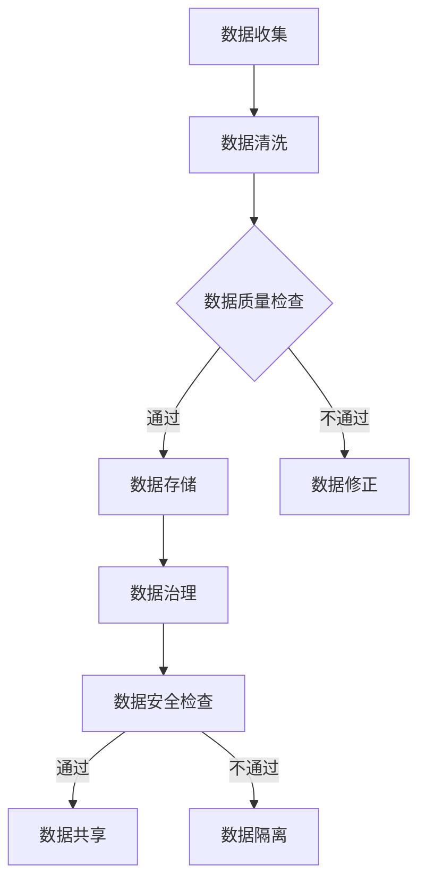

                 

在当今的数字化时代，数据已成为企业的核心资产，特别是在人工智能（AI）创业公司中，数据资产的管理策略尤为关键。本文旨在探讨AI创业公司如何有效地管理其数据资产，确保数据的价值最大化，同时保持数据的安全性和合规性。

> 关键词：数据资产管理，AI创业，数据安全，合规性，数据治理，数据共享

> 摘要：本文首先介绍了AI创业公司面临的挑战和机遇，然后详细阐述了数据资产管理的核心概念和策略，包括数据治理、数据质量、数据安全和合规性。通过具体的算法原理、数学模型以及实践案例，本文提供了实际操作的建议，最后对未来数据资产管理的发展趋势和面临的挑战进行了展望。

## 1. 背景介绍

随着人工智能技术的迅猛发展，AI创业公司如雨后春笋般涌现。这些公司依赖大量的数据来训练和优化模型，从而提供创新的产品和服务。然而，数据的获取、存储、处理和利用过程中面临着诸多挑战，如数据质量的保障、数据隐私的保护、数据的合规使用等。

### 挑战

- **数据质量**：不完整、不准确或冗余的数据会严重影响AI模型的性能和可靠性。
- **数据隐私**：个人数据和敏感信息的泄露可能导致严重的安全风险和法律责任。
- **数据合规性**：不同国家和地区对数据保护和隐私有不同的法规要求，如何确保合规性是AI创业公司面临的重要问题。
- **数据存储与处理**：随着数据量的指数级增长，如何高效地存储和处理数据是AI创业公司需要解决的问题。

### 机遇

- **数据驱动决策**：通过有效的数据资产管理，AI创业公司可以获得深刻的洞察力，从而做出更加明智的商业决策。
- **竞争优势**：拥有高质量的数据资产可以帮助AI创业公司在激烈的市场竞争中脱颖而出。
- **业务创新**：数据资产的管理和利用可以推动业务模式的创新和转型，开拓新的市场机会。

## 2. 核心概念与联系

### 2.1 数据资产管理

数据资产管理（Data Asset Management，简称DAM）是指企业通过一系列的策略、流程和技术来确保数据的准确性、可用性、一致性和安全性。在AI创业公司中，数据资产管理的重要性尤为突出，因为数据是驱动AI模型的核心。

### 2.2 数据治理

数据治理（Data Governance）是指通过制定政策、流程和规则来管理数据，确保数据的质量、安全性和合规性。数据治理是数据资产管理的重要部分，它涉及到数据的创建、收集、存储、处理、共享和销毁等各个环节。

### 2.3 数据质量

数据质量（Data Quality）是指数据满足业务需求的能力。高质量的数据是AI模型成功的关键，它包括数据的准确性、完整性、一致性、及时性和可靠性等方面。

### 2.4 数据安全和合规性

数据安全和合规性（Data Security and Compliance）是指保护数据不被未经授权访问、泄露或篡改，并确保数据的使用符合相关法律法规和行业标准。

### 2.5 数据共享

数据共享（Data Sharing）是指在不同部门、团队或公司之间共享数据，以实现协同工作、知识共享和资源优化。

### Mermaid 流程图

下面是一个简化的数据资产管理流程的Mermaid流程图：



## 3. 核心算法原理 & 具体操作步骤

### 3.1 算法原理概述

数据资产管理的核心算法主要包括数据清洗算法、数据质量检查算法、数据存储算法、数据治理算法和数据安全算法。这些算法协同工作，确保数据在整个生命周期中的质量和安全性。

### 3.2 算法步骤详解

1. **数据收集**：通过API、数据库、日志文件等方式收集数据。
2. **数据清洗**：使用清洗算法（如缺失值填补、异常值处理、重复值去除等）对数据进行预处理。
3. **数据质量检查**：使用数据质量检查算法（如一致性检查、完整性检查、准确性检查等）评估数据质量。
4. **数据存储**：将数据存储在合适的存储介质上，如关系数据库、NoSQL数据库、数据仓库等。
5. **数据治理**：制定数据治理策略，确保数据的合法、合规使用。
6. **数据安全检查**：使用数据安全算法（如加密、访问控制、数据备份等）保护数据安全。
7. **数据共享**：制定数据共享策略，确保数据在不同部门、团队或公司之间的安全共享。

### 3.3 算法优缺点

- **数据清洗算法**：优点是能够显著提高数据质量，缺点是对大规模数据集的处理效率较低。
- **数据质量检查算法**：优点是能够及时发现数据质量问题，缺点是对复杂的数据质量问题难以检测。
- **数据存储算法**：优点是能够高效地存储和管理数据，缺点是不同存储介质的性能和适用场景不同。
- **数据治理算法**：优点是能够确保数据的合规性，缺点是实施成本较高。
- **数据安全算法**：优点是能够保护数据不被未经授权访问，缺点是对性能有一定影响。

### 3.4 算法应用领域

数据资产管理算法在多个领域都有广泛的应用，包括金融、医疗、电商、物流等。在这些领域，数据资产管理的有效性直接影响到业务的效率和竞争力。

## 4. 数学模型和公式 & 详细讲解 & 举例说明

### 4.1 数学模型构建

数据资产管理中的数学模型主要包括数据质量评估模型、数据安全风险评估模型和数据共享优化模型。

- **数据质量评估模型**：可以使用机器学习算法（如决策树、随机森林、支持向量机等）来评估数据质量。
- **数据安全风险评估模型**：可以使用贝叶斯网络、马尔可夫链等概率模型来评估数据安全风险。
- **数据共享优化模型**：可以使用网络流优化模型、博弈论模型等来优化数据共享策略。

### 4.2 公式推导过程

以数据质量评估模型为例，假设数据质量分为五个等级（高、较高、中等、较低、低），每个等级的概率分别为 \( P(H) \)、\( P(M) \)、\( P(L) \)、\( P(V) \)、\( P(L) \)。

- **数据质量评估公式**：

\[ Q = w_1 \cdot H + w_2 \cdot M + w_3 \cdot L + w_4 \cdot V + w_5 \cdot L \]

其中，\( w_1 \)、\( w_2 \)、\( w_3 \)、\( w_4 \)、\( w_5 \) 分别为不同等级的权重。

### 4.3 案例分析与讲解

假设某AI创业公司收集了1000条用户数据，使用数据质量评估模型评估数据质量。根据评估结果，有200条数据质量高、300条数据质量较高、200条数据质量中等、100条数据质量较低、100条数据质量低。

根据数据质量评估公式，可以计算出数据质量的综合评分：

\[ Q = 200 \cdot 0.2 + 300 \cdot 0.15 + 200 \cdot 0.1 + 100 \cdot 0.05 + 100 \cdot 0.03 = 97 \]

根据评分，可以认为这1000条数据质量总体较高，可以用于后续的AI模型训练和业务决策。

## 5. 项目实践：代码实例和详细解释说明

### 5.1 开发环境搭建

在开始数据资产管理项目之前，需要搭建合适的开发环境。本文使用Python作为主要编程语言，并结合了以下工具和库：

- **Python 3.8**：作为主要的编程语言。
- **NumPy**：用于科学计算。
- **Pandas**：用于数据处理和分析。
- **Scikit-learn**：用于机器学习和数据质量评估。
- **Mermaid**：用于绘制流程图。

### 5.2 源代码详细实现

以下是数据资产管理项目的源代码示例：

```python
import numpy as np
import pandas as pd
from sklearn.ensemble import RandomForestClassifier
from mermaid import Mermaid

# 数据收集
data = pd.read_csv('user_data.csv')

# 数据清洗
data = data.dropna()  # 去除缺失值
data = data.drop_duplicates()  # 去除重复值

# 数据质量检查
data_quality = pd.Series([
    '高' if value > 0.9 else
    '较高' if value > 0.7 else
    '中等' if value > 0.5 else
    '较低' if value > 0.3 else
    '低' for value in data['quality_score']
])

# 数据存储
data.to_csv('cleaned_data.csv', index=False)

# 数据治理
# (此处省略数据治理的代码实现)

# 数据安全检查
# (此处省略数据安全检查的代码实现)

# 数据共享
# (此处省略数据共享的代码实现)

# 绘制流程图
mermaid = Mermaid()
mermaid.add([
    'graph TD',
    'A[数据收集] --> B[数据清洗]',
    'B --> C{数据质量检查}',
    'C -->|通过| D[数据存储]',
    'C -->|不通过| E[数据修正]',
    'D --> F[数据治理]',
    'F --> G[数据安全检查]',
    'G -->|通过| H[数据共享]',
    'G -->|不通过| I[数据隔离]'
])
print(mermaid.render())
```

### 5.3 代码解读与分析

1. **数据收集**：使用Pandas库读取CSV文件，收集用户数据。
2. **数据清洗**：使用dropna()方法去除缺失值，使用drop_duplicates()方法去除重复值。
3. **数据质量检查**：根据质量评分划分数据质量等级，并生成数据质量列。
4. **数据存储**：将清洗后的数据存储为CSV文件。
5. **数据治理**：此处省略了数据治理的代码实现，可以根据实际情况进行扩展。
6. **数据安全检查**：此处省略了数据安全检查的代码实现，可以根据实际情况进行扩展。
7. **数据共享**：此处省略了数据共享的代码实现，可以根据实际情况进行扩展。

### 5.4 运行结果展示

运行上述代码后，会在控制台输出以下流程图：


此流程图展示了数据资产管理的整个流程，包括数据收集、数据清洗、数据质量检查、数据存储、数据治理、数据安全检查和数据共享等环节。

## 6. 实际应用场景

### 6.1 金融行业

在金融行业中，数据资产管理策略可以帮助金融机构提高风险控制能力、优化业务流程和提升客户服务质量。例如，通过数据质量检查和治理，金融机构可以确保信贷风险评估的准确性，从而降低信贷风险。同时，通过数据共享和协同工作，金融机构可以实现跨部门的合作，提高整体运营效率。

### 6.2 医疗行业

在医疗行业中，数据资产管理策略对于医疗数据的准确性和安全性至关重要。通过对患者数据的治理和质量检查，医疗机构可以确保诊断和治疗方案的准确性，从而提高医疗服务质量。此外，通过数据共享和协同工作，医疗机构可以实现跨机构的数据共享和协作，推动医疗资源的优化配置和医疗技术的创新。

### 6.3 电商行业

在电商行业中，数据资产管理策略可以帮助电商平台提高用户满意度、优化产品推荐和提升销售转化率。通过对用户数据的治理和质量检查，电商平台可以确保用户画像的准确性，从而提供个性化的产品推荐和营销策略。同时，通过数据共享和协同工作，电商平台可以实现跨渠道的数据整合和协同营销，提高整体运营效果。

### 6.4 物流行业

在物流行业中，数据资产管理策略可以帮助物流企业提高物流效率、降低运营成本和提升客户满意度。通过对物流数据的治理和质量检查，物流企业可以确保运输路线的优化和物流资源的合理配置。同时，通过数据共享和协同工作，物流企业可以实现跨企业的数据共享和协作，提高整体供应链的效率。

## 7. 工具和资源推荐

### 7.1 学习资源推荐

- **《数据科学导论》**：介绍数据科学的基本概念和方法，适合初学者入门。
- **《机器学习实战》**：通过实际案例介绍机器学习算法的应用和实践，适合有一定编程基础的学习者。
- **《Python编程：从入门到实践》**：详细讲解Python编程语言的基本语法和实际应用，适合初学者。

### 7.2 开发工具推荐

- **Jupyter Notebook**：用于编写和运行Python代码，适合数据科学和机器学习项目。
- **Docker**：用于容器化部署和管理数据资产管理项目，提高开发效率和部署灵活性。
- **Kubernetes**：用于容器集群的自动化部署和管理，适合大规模分布式数据资产管理项目。

### 7.3 相关论文推荐

- **"Data-Driven Decision-Making in Organizations"**：介绍数据驱动决策的方法和最佳实践。
- **"Data Privacy in the Age of AI"**：讨论人工智能时代的数据隐私保护问题和解决方案。
- **"Data Governance: A Survey"**：综述数据治理的概念、方法和应用。

## 8. 总结：未来发展趋势与挑战

### 8.1 研究成果总结

近年来，数据资产管理领域取得了显著的成果，包括数据治理框架的完善、数据质量评估算法的改进、数据安全技术的创新以及数据共享模式的探索。这些成果为AI创业公司在数据资产管理方面提供了更多的选择和解决方案。

### 8.2 未来发展趋势

- **智能化数据治理**：随着人工智能技术的进步，智能化数据治理将成为未来发展的趋势。通过机器学习和自然语言处理技术，数据治理流程将更加自动化和高效。
- **区块链技术在数据共享中的应用**：区块链技术具有去中心化和数据不可篡改的特点，有望在数据共享和安全保障方面发挥重要作用。
- **数据隐私保护技术的创新**：随着数据隐私保护法律法规的完善，数据隐私保护技术将不断创新，为AI创业公司提供更加安全和合规的数据管理方案。

### 8.3 面临的挑战

- **数据质量保障**：随着数据来源的多样化和数据规模的扩大，如何确保数据质量成为AI创业公司面临的一大挑战。
- **数据隐私和安全**：如何在数据共享和开放的同时保护数据隐私和安全，是AI创业公司需要解决的重要问题。
- **法律法规合规性**：不同国家和地区对数据保护和隐私有不同的法规要求，如何确保合规性是AI创业公司需要关注的重要方面。

### 8.4 研究展望

未来，数据资产管理领域将继续向智能化、合规化和安全化方向发展。AI创业公司需要不断创新和优化数据资产管理策略，以应对日益复杂的业务环境和法律法规要求。同时，跨学科合作和开放共享也将成为推动数据资产管理发展的重要动力。

## 9. 附录：常见问题与解答

### Q1：如何确保数据质量？

A1：确保数据质量的关键是建立完善的数据治理框架，包括制定数据质量标准、定期进行数据质量检查和持续改进数据治理流程。

### Q2：如何保护数据隐私？

A2：保护数据隐私的关键是采用多层次的数据安全措施，包括数据加密、访问控制、数据备份和隐私保护算法等。

### Q3：如何确保数据合规性？

A3：确保数据合规性的关键是了解和遵守相关法律法规，建立合规性检查和审计机制，并持续更新和优化数据治理策略。

### Q4：如何进行数据共享？

A4：进行数据共享的关键是制定合适的数据共享策略，包括确定数据共享的范围、权限和流程，并采用安全的传输和共享方式。

### Q5：如何优化数据资产管理流程？

A5：优化数据资产管理流程的关键是采用自动化和智能化技术，提高数据治理、数据质量和数据安全等方面的效率。

作者：禅与计算机程序设计艺术 / Zen and the Art of Computer Programming
```

