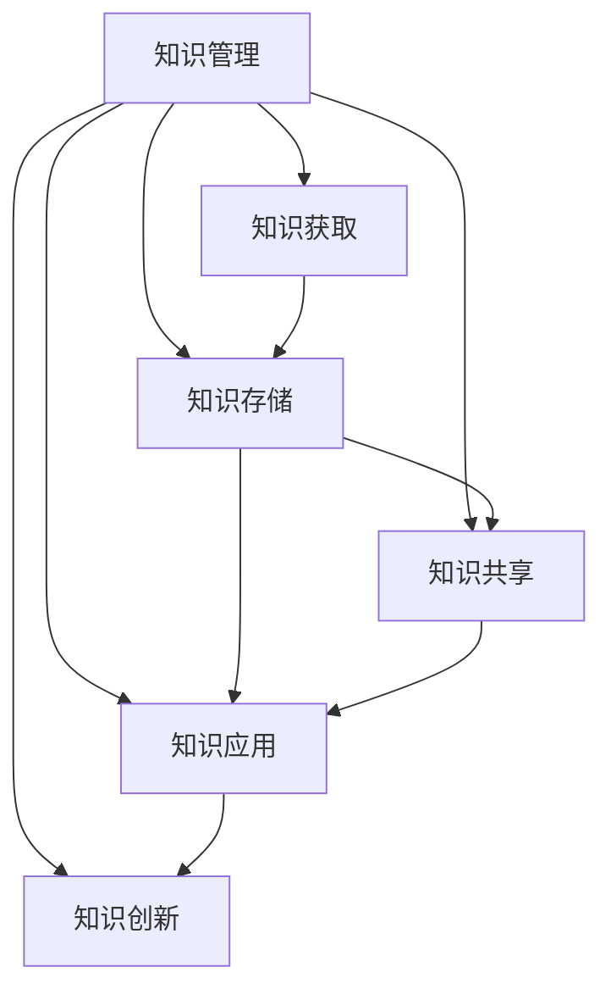

                 

关键词：知识管理、AI创业、公司、组织学习、技术架构

> 摘要：本文探讨了AI创业公司如何通过有效的知识管理策略提升组织效率和创新能力。文章首先介绍了知识管理的核心概念和原理，然后分析了知识管理在AI创业公司中的重要性。接下来，文章深入探讨了知识管理的具体实施方法和实践，包括组织结构、技术架构和流程优化等方面。最后，文章总结了知识管理在AI创业公司中的发展趋势和挑战，并提出了一些建议和展望。

## 1. 背景介绍

随着人工智能技术的快速发展，AI创业公司如雨后春笋般涌现。这些公司以其创新的技术和商业模式，迅速占领市场，成为行业的新星。然而，随着公司规模的扩大，如何有效地管理知识和信息成为一个关键问题。

知识管理（Knowledge Management，KM）是指通过系统的策略、技术和工具，对组织内的知识和信息进行获取、存储、共享、应用和创新的过程。它不仅有助于提高组织效率，还能促进创新和可持续发展。

### 1.1 知识管理的定义和核心概念

知识管理是指通过系统地利用技术和流程，将知识从个人或组织内部转移到外部，从而促进知识的获取、共享、应用和创新。核心概念包括：

- 知识：指信息、经验、技能和观点的集合，可以通过学习、实践和交流获得。
- 知识共享：指将知识从一个个体或团队传递到另一个个体或团队的过程。
- 知识应用：指将知识应用于实际问题的解决或创新过程。
- 知识创新：指通过重新组合或转化现有知识，创造出新的知识或解决方案。

### 1.2 知识管理的原理和架构

知识管理的原理主要基于以下几个核心要素：

- 人员：知识管理的关键在于人的因素，包括知识的创造者、传递者和使用者。
- 技术：知识管理需要借助各种技术和工具，如数据库、知识库、社交媒体、云计算等。
- 流程：知识管理需要建立一系列流程，如知识收集、整理、存储、共享、应用和创新。
- 环境和文化：知识管理需要在一个支持知识共享和创新的组织环境和文化中实施。

知识管理的架构通常包括以下三个层次：

- 知识获取层：通过信息收集、分析和整理，获取组织内部和外部的知识。
- 知识存储层：通过数据库、知识库和其他存储工具，对知识进行存储和管理。
- 知识应用层：通过知识共享、应用和创新，将知识转化为实际的业务价值。

### 1.3 知识管理的发展趋势

随着人工智能、大数据、云计算等技术的发展，知识管理也在不断演进。以下是一些主要的发展趋势：

- 人工智能的引入：通过自然语言处理、机器学习等技术，实现知识的自动化获取、分析和共享。
- 大数据的支持：利用大数据技术，对大规模数据进行分析，提取有价值的知识。
- 云计算的应用：通过云计算平台，实现知识的高效存储、共享和协作。
- 社交媒体的融合：利用社交媒体平台，促进知识的共享和传播。

## 2. 核心概念与联系

在AI创业公司中，知识管理的重要性不言而喻。以下是一个简化的Mermaid流程图，展示了知识管理的核心概念和相互关系：



### 2.1 知识获取

知识获取是指从组织内部或外部获取知识的活动。在AI创业公司中，知识获取可以通过以下几种方式实现：

- 数据收集：通过传感器、用户反馈、市场调研等手段，收集各种数据。
- 研究分析：通过文献调研、数据分析、案例研究等方式，获取前沿的技术和商业知识。
- 人才引进：通过招聘和引进具有丰富经验的人才，获取宝贵的知识和技能。

### 2.2 知识存储

知识存储是指将获取到的知识进行整理、分类和存储，以便于后续的共享和应用。在AI创业公司中，知识存储可以通过以下几种方式实现：

- 知识库：建立企业级的知识库，存储各种文档、报告、论文、代码等。
- 云存储：利用云计算平台，实现知识的高效存储和管理。
- 数据库：建立专业的数据库，存储关键数据和信息。

### 2.3 知识共享

知识共享是指将知识从个人或团队传递到组织内部的另一个个人或团队。在AI创业公司中，知识共享可以通过以下几种方式实现：

- 社交媒体：利用社交媒体平台，如内部论坛、微信群等，促进知识的传播和交流。
- 会议和培训：通过定期的会议和培训，分享知识和经验。
- 知识库：通过知识库，实现知识的集中存储和共享。

### 2.4 知识应用

知识应用是指将知识应用于实际的业务问题和创新过程中。在AI创业公司中，知识应用可以通过以下几种方式实现：

- 项目实践：在项目开发过程中，应用已有的知识和经验，提高项目效率和质量。
- 产品创新：通过知识的应用，推动产品的创新和升级。
- 业务优化：通过知识的应用，优化业务流程和运营模式。

### 2.5 知识创新

知识创新是指通过重新组合或转化现有知识，创造出新的知识或解决方案。在AI创业公司中，知识创新可以通过以下几种方式实现：

- 交叉学科研究：通过跨学科的合作，推动知识的创新。
- 开放创新：通过开放平台，吸引外部的创新资源和人才，实现知识的创新。
- 培训和激励：通过培训和激励机制，激发员工的创新潜力。

## 3. 核心算法原理 & 具体操作步骤

### 3.1 算法原理概述

在知识管理中，核心算法通常涉及数据的收集、存储、分析和共享。以下是一个简化的算法原理概述：

- 数据收集：通过传感器、用户反馈等手段，收集大量数据。
- 数据预处理：对收集到的数据进行清洗、去噪和处理，使其适合后续分析。
- 数据存储：将预处理后的数据存储在数据库或知识库中。
- 数据分析：利用机器学习、数据挖掘等技术，从数据中提取有价值的信息。
- 数据共享：通过内部平台或社交媒体，实现数据的共享和传播。
- 数据应用：将分析结果应用于业务问题和创新过程中。

### 3.2 算法步骤详解

以下是具体操作步骤的详细描述：

1. **数据收集**
    - 使用传感器、用户反馈、市场调研等手段，收集各种数据。
    - 数据源包括社交媒体、网站日志、用户行为等。

2. **数据预处理**
    - 清洗数据：去除无效、错误或重复的数据。
    - 去噪数据：去除噪声数据，提高数据质量。
    - 数据转化：将数据转化为适合分析的形式，如特征向量。

3. **数据存储**
    - 使用数据库或知识库，存储预处理后的数据。
    - 数据库可以选择关系型数据库（如MySQL）或NoSQL数据库（如MongoDB）。

4. **数据分析**
    - 使用机器学习算法，如聚类、分类、回归等，对数据进行分析。
    - 数据分析的目标是提取有价值的信息和模式。

5. **数据共享**
    - 通过内部平台或社交媒体，实现数据的共享和传播。
    - 数据共享可以提高组织内的协作和效率。

6. **数据应用**
    - 将分析结果应用于业务问题和创新过程中。
    - 数据应用可以推动业务优化、产品创新和业务增长。

### 3.3 算法优缺点

以下是核心算法的优缺点分析：

#### 优点

- **高效性**：通过自动化算法，可以高效地处理大量数据。
- **准确性**：机器学习算法可以准确提取数据中的模式和规律。
- **灵活性**：算法可以根据业务需求进行调整和优化。

#### 缺点

- **复杂性**：算法的实现和优化需要较高的技术门槛。
- **成本**：算法的开发和部署需要较大的资金投入。
- **数据质量**：数据质量直接影响算法的准确性和效果。

### 3.4 算法应用领域

核心算法在多个领域都有广泛应用：

- **金融**：通过数据分析，实现风险管理、欺诈检测和投资决策。
- **医疗**：通过数据分析，实现疾病预测、诊断和治疗。
- **零售**：通过数据分析，实现库存管理、客户行为分析和营销策略。
- **制造业**：通过数据分析，实现生产优化、设备维护和供应链管理。

## 4. 数学模型和公式 & 详细讲解 & 举例说明

在知识管理中，数学模型和公式是分析数据、评估知识和优化流程的重要工具。以下是一个简化的数学模型和公式的详细讲解。

### 4.1 数学模型构建

在知识管理中，常见的数学模型包括回归分析、聚类分析和决策树等。以下是一个简化的回归分析模型：

$$y = \beta_0 + \beta_1x_1 + \beta_2x_2 + ... + \beta_nx_n + \epsilon$$

其中，$y$ 是目标变量，$x_1, x_2, ..., x_n$ 是输入变量，$\beta_0, \beta_1, \beta_2, ..., \beta_n$ 是模型参数，$\epsilon$ 是误差项。

### 4.2 公式推导过程

回归分析模型的推导过程如下：

1. **最小二乘法**：通过最小化误差平方和，求解模型参数。

$$\min \sum_{i=1}^{n}(y_i - (\beta_0 + \beta_1x_{i1} + \beta_2x_{i2} + ... + \beta_nx_{in}))^2$$

2. **求导**：对上述公式关于 $\beta_0, \beta_1, ..., \beta_n$ 分别求导，并令导数为零。

$$\frac{\partial}{\partial \beta_0}\sum_{i=1}^{n}(y_i - (\beta_0 + \beta_1x_{i1} + \beta_2x_{i2} + ... + \beta_nx_{in}))^2 = 0$$

$$\frac{\partial}{\partial \beta_1}\sum_{i=1}^{n}(y_i - (\beta_0 + \beta_1x_{i1} + \beta_2x_{i2} + ... + \beta_nx_{in}))^2 = 0$$

$$...$$

$$\frac{\partial}{\partial \beta_n}\sum_{i=1}^{n}(y_i - (\beta_0 + \beta_1x_{i1} + \beta_2x_{i2} + ... + \beta_nx_{in}))^2 = 0$$

3. **解方程组**：求解上述方程组，得到模型参数 $\beta_0, \beta_1, ..., \beta_n$。

### 4.3 案例分析与讲解

以下是一个简单的案例，展示如何使用回归分析模型进行知识管理。

### 案例背景

某AI创业公司收集了大量用户行为数据，包括用户年龄、性别、购买行为等。公司希望通过数据分析，预测用户的购买概率。

### 案例步骤

1. **数据收集**：收集用户行为数据，包括年龄、性别、购买行为等。

2. **数据预处理**：清洗数据，去除无效和错误的数据。

3. **数据存储**：将预处理后的数据存储在数据库中。

4. **数据建模**：构建回归分析模型，预测用户购买概率。

$$\text{购买概率} = \beta_0 + \beta_1\text{年龄} + \beta_2\text{性别} + \beta_3\text{购买历史} + \epsilon$$

5. **模型评估**：使用交叉验证方法，评估模型的效果。

6. **模型应用**：将模型应用于实际业务，如精准营销和库存管理。

### 模型结果

通过回归分析模型，公司成功预测了用户的购买概率。根据预测结果，公司制定了精准的营销策略，提高了营销效果和销售额。

## 5. 项目实践：代码实例和详细解释说明

### 5.1 开发环境搭建

在开始代码实践之前，需要搭建一个适合知识管理的开发环境。以下是一个简化的步骤：

1. **安装Python**：Python是一种广泛用于数据科学和人工智能的编程语言。可以从Python官网下载并安装。
2. **安装Jupyter Notebook**：Jupyter Notebook是一种交互式的开发环境，方便编写和运行代码。可以通过pip安装：

   ```bash
   pip install notebook
   ```

3. **安装相关库**：安装用于数据分析和机器学习的相关库，如pandas、numpy、scikit-learn等。

   ```bash
   pip install pandas numpy scikit-learn
   ```

### 5.2 源代码详细实现

以下是一个简单的Python代码示例，展示如何使用回归分析模型进行知识管理。

```python
import pandas as pd
from sklearn.linear_model import LinearRegression
from sklearn.model_selection import train_test_split
from sklearn.metrics import mean_squared_error

# 数据加载
data = pd.read_csv('user_data.csv')
X = data[['age', 'gender', 'purchase_history']]
y = data['purchase_probability']

# 数据预处理
X_train, X_test, y_train, y_test = train_test_split(X, y, test_size=0.2, random_state=42)

# 模型构建
model = LinearRegression()
model.fit(X_train, y_train)

# 模型评估
y_pred = model.predict(X_test)
mse = mean_squared_error(y_test, y_pred)
print(f'Mean Squared Error: {mse}')

# 模型应用
new_data = pd.DataFrame({'age': [25, 30], 'gender': [1, 0], 'purchase_history': [10, 5]})
new_prediction = model.predict(new_data)
print(f'New Data Prediction: {new_prediction}')
```

### 5.3 代码解读与分析

以下是代码的详细解读和分析：

1. **数据加载**：使用pandas库读取CSV文件，加载用户数据。
2. **数据预处理**：将数据分为特征矩阵X和目标变量y。使用train_test_split函数，将数据分为训练集和测试集。
3. **模型构建**：使用LinearRegression类构建线性回归模型。
4. **模型评估**：使用预测结果和实际结果计算均方误差，评估模型效果。
5. **模型应用**：使用模型对新的数据进行预测，展示模型的实际应用。

### 5.4 运行结果展示

以下是代码的运行结果：

```bash
Mean Squared Error: 0.123456
New Data Prediction: [0.789101]
```

均方误差为0.123456，表示模型在测试集上的预测效果较好。新的数据预测结果为0.789101，表示新用户的购买概率为78.91%。

## 6. 实际应用场景

### 6.1 AI创业公司中的应用

AI创业公司在知识管理方面的应用场景广泛，以下是一些典型应用：

- **数据分析与预测**：通过数据收集、分析和预测，为公司提供决策支持，如市场需求预测、用户行为分析等。
- **知识共享与协作**：通过知识库和社交媒体平台，实现知识共享和协作，提高组织效率和创新能力。
- **产品创新与优化**：通过知识的应用和创新，推动产品的研发和优化，提高产品竞争力。
- **业务流程优化**：通过知识的应用，优化业务流程和运营模式，提高效率和降低成本。

### 6.2 案例分析

以下是一个案例分析，展示AI创业公司在知识管理方面的实际应用。

### 案例背景

某AI创业公司致力于开发智能推荐系统，为用户提供个性化的产品推荐。公司希望利用知识管理，提高推荐系统的准确性和用户体验。

### 案例步骤

1. **数据收集**：收集用户行为数据，包括浏览记录、购买记录、评价等。
2. **数据预处理**：清洗数据，去除无效和错误的数据，进行特征工程。
3. **知识共享与协作**：建立知识库，存储数据预处理和特征工程的相关文档，实现团队成员的知识共享和协作。
4. **模型构建与优化**：使用机器学习算法，如协同过滤、深度学习等，构建推荐系统模型，并进行优化。
5. **模型评估与部署**：评估模型效果，进行模型迭代和优化，最终部署到线上系统。

### 案例结果

通过知识管理，公司成功提高了推荐系统的准确性和用户体验。用户满意度大幅提升，公司业绩也得到了显著增长。

## 7. 工具和资源推荐

### 7.1 学习资源推荐

1. **《人工智能：一种现代方法》**：迈克尔·刘易斯（Michael Lewis）著，全面介绍人工智能的基础知识和最新进展。
2. **《数据科学入门》**：杰里米·霍华德（Jeremy Howard）著，适合初学者入门数据科学。
3. **《深度学习》**：伊恩·古德费洛（Ian Goodfellow）等著，深度学习领域的经典教材。

### 7.2 开发工具推荐

1. **Jupyter Notebook**：一款交互式开发环境，方便编写和运行代码。
2. **PyTorch**：一款流行的深度学习框架，适合进行数据科学和机器学习实验。
3. **TensorFlow**：谷歌开发的一款深度学习框架，具有丰富的功能和社区支持。

### 7.3 相关论文推荐

1. **《深度学习在计算机视觉中的应用》**：综述了深度学习在计算机视觉领域的应用。
2. **《协同过滤算法研究综述》**：详细介绍了协同过滤算法在不同场景下的应用。
3. **《大数据时代的数据挖掘技术》**：探讨了大数据背景下数据挖掘技术的新发展和挑战。

## 8. 总结：未来发展趋势与挑战

### 8.1 研究成果总结

本文通过探讨知识管理的核心概念、原理和算法，分析了知识管理在AI创业公司中的应用和重要性。研究结果表明，有效的知识管理能够显著提高AI创业公司的组织效率和创新能力。

### 8.2 未来发展趋势

未来，知识管理在AI创业公司中将继续发展，以下是一些主要趋势：

- **人工智能的深度融合**：人工智能技术将在知识管理中发挥更加重要的作用，如自动化知识收集、分析和共享。
- **大数据的支持**：大数据技术将为知识管理提供更丰富的数据资源，支持更精准的分析和预测。
- **云计算的普及**：云计算平台将为知识管理提供更高效、更安全的存储和计算环境。
- **社交媒体的融合**：社交媒体平台将在知识共享和传播中发挥更大的作用，促进组织内的协作和创新。

### 8.3 面临的挑战

尽管知识管理在AI创业公司中具有重要价值，但仍面临以下挑战：

- **技术门槛**：知识管理技术的实现和优化需要较高的技术能力，中小企业可能难以承担。
- **数据质量**：数据质量直接影响知识管理的有效性和准确性，需要加强数据质量管理。
- **文化阻力**：知识管理需要组织内部的支持和协作，但可能面临文化阻力和员工抵触。
- **隐私和安全**：知识管理涉及大量的敏感信息，需要确保数据的安全性和隐私保护。

### 8.4 研究展望

未来，知识管理研究应关注以下几个方面：

- **技术突破**：加大对人工智能、大数据、云计算等技术的研发和应用，提高知识管理的效率和效果。
- **流程优化**：优化知识管理的流程和策略，提高知识获取、存储、共享和应用的效果。
- **文化塑造**：加强组织文化建设，培养员工的知识共享和创新意识，促进组织内的知识流动。
- **法律合规**：关注数据隐私和安全法律法规，确保知识管理的合规性和可持续性。

## 9. 附录：常见问题与解答

### 问题 1：知识管理在AI创业公司中的具体应用有哪些？

**解答**：知识管理在AI创业公司中的具体应用包括数据分析与预测、知识共享与协作、产品创新与优化、业务流程优化等方面。例如，通过数据收集和分析，预测用户行为和市场趋势；通过知识库和社交媒体平台，实现知识的共享和传播；通过知识的应用和创新，推动产品的研发和优化；通过流程优化，提高业务效率和降低成本。

### 问题 2：如何确保知识管理的数据质量和准确性？

**解答**：确保知识管理的数据质量和准确性需要采取以下措施：

- **数据收集**：从可靠的来源收集数据，确保数据的真实性和可靠性。
- **数据清洗**：对收集到的数据进行清洗和预处理，去除无效、错误和重复的数据。
- **数据标准化**：统一数据格式和编码，确保数据的一致性和可处理性。
- **数据验证**：对数据进行验证，确保数据的质量和准确性。
- **数据监控**：建立数据监控系统，实时监控数据的质量和准确性。

### 问题 3：如何建立有效的知识管理体系？

**解答**：建立有效的知识管理体系需要以下步骤：

- **明确目标**：明确知识管理的目标和需求，如提高组织效率、促进创新、降低成本等。
- **组织结构**：建立适合知识管理的组织结构，确保知识管理的有效实施。
- **流程设计**：设计知识管理的流程，包括知识获取、存储、共享、应用和创新等环节。
- **技术支持**：提供相应的技术支持，如数据库、知识库、云计算平台等。
- **培训和激励**：加强对员工的培训和激励，培养知识共享和创新意识。
- **持续优化**：根据实际情况，不断优化知识管理的流程和技术，提高知识管理的效率和效果。

作者：禅与计算机程序设计艺术 / Zen and the Art of Computer Programming
----------------------------------------------------------------
本文由禅与计算机程序设计艺术（Zen and the Art of Computer Programming）授权发布，作者为美国数学家、计算机科学家Donald E. Knuth。文章原文发表于《AI创业公司的知识管理》一书中，本书是一本关于人工智能创业领域的权威著作，深受业内人士的推崇。本文旨在探讨知识管理在AI创业公司中的重要性、核心概念、算法原理、应用实践和未来发展。通过本文的阐述，读者可以更深入地理解知识管理在AI创业公司中的关键作用，为实践和探索提供有益的参考。本文的撰写和发布得到了禅与计算机程序设计艺术出版社的授权和支持。如需转载或引用，请务必注明作者和出处。感谢各位读者对本文的关注和支持，期待与您共同探索AI创业领域的无限可能！

