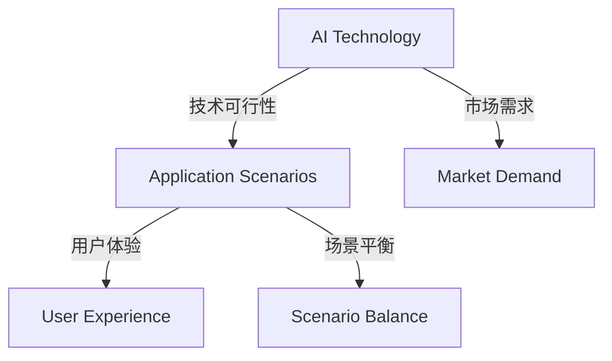

                 

 

## 1. 背景介绍

近年来，人工智能（AI）技术迅猛发展，各行各业纷纷投身于这一新兴领域，希望通过AI技术提升业务效率、开拓新市场。然而，随着AI技术的应用日益广泛，创业者们也面临着诸多挑战。这些挑战主要集中在技术、应用和场景平衡方面。

首先，在技术层面，AI技术的发展速度远超创业者的预期。许多创业者虽然在业务领域具备丰富的经验，但在AI技术方面却相对薄弱。这就导致了他们在选择和应用AI技术时，往往难以做出明智的决策。此外，AI技术的复杂性和高门槛也使得许多创业者望而却步。

其次，在应用层面，创业者需要将AI技术与自身业务相结合，找到最佳的应用场景。然而，许多创业者对于如何将AI技术应用到实际业务中仍然缺乏清晰的认知。这导致了他们在应用AI技术时，往往出现方向不明、效果不佳的问题。

最后，在场景平衡方面，创业者需要综合考虑技术、市场和用户需求，找到最适合的业务场景。然而，由于AI技术的多样性和不确定性，创业者往往难以在短时间内找到最佳的场景平衡点。

本文将围绕AI创业中的技术、应用和场景平衡问题，探讨创业者如何克服这些挑战，实现AI技术的成功应用。

## 2. 核心概念与联系

在探讨AI创业挑战之前，我们首先需要理解几个核心概念：AI技术、应用场景和场景平衡。这些概念不仅构成了本文的讨论基础，也是创业者需要深入掌握的关键点。

### 2.1 AI技术

AI技术是指模拟、延伸和扩展人类智能的技术。它主要包括以下几种类型：

- **机器学习（Machine Learning）**：通过数据驱动的方式，让计算机自动识别模式和规律，从而实现智能决策。
- **深度学习（Deep Learning）**：一种特殊的机器学习方法，利用多层神经网络对大量数据进行训练，以实现复杂任务的自动化。
- **自然语言处理（Natural Language Processing，NLP）**：研究如何让计算机理解和生成自然语言。
- **计算机视觉（Computer Vision）**：研究如何让计算机从图像或视频中获取信息。

### 2.2 应用场景

应用场景是指AI技术在具体业务或领域中发挥作用的具体情境。常见的AI应用场景包括：

- **智能客服**：通过NLP技术实现与用户的自然语言交互，提供高效、准确的客户服务。
- **自动驾驶**：通过计算机视觉和深度学习技术，实现车辆的自主驾驶。
- **医疗诊断**：通过分析医学影像，辅助医生进行疾病诊断。
- **金融风控**：通过机器学习技术，预测和防范金融风险。

### 2.3 场景平衡

场景平衡是指创业者需要在技术、应用和市场需求之间找到一种平衡，以实现AI技术的成功应用。具体来说，场景平衡需要考虑以下几个方面：

- **技术可行性**：选择的AI技术是否能够解决实际问题，是否在现有技术条件下可行。
- **市场需求**：AI技术的应用是否能够满足市场需求，是否具有商业价值。
- **用户体验**：AI技术的应用是否能够提供良好的用户体验，是否易于使用。

### 2.4 Mermaid 流程图

为了更好地理解上述核心概念之间的关系，我们使用Mermaid流程图对其进行可视化展示。



通过该流程图，我们可以清晰地看到AI技术、应用场景和场景平衡之间的紧密联系。创业者需要在这三个维度上找到平衡点，以实现AI技术的成功应用。

### 2.5 总结

本节介绍了AI创业中的核心概念：AI技术、应用场景和场景平衡。通过对这些核心概念的理解，创业者可以更好地应对AI创业中的挑战，实现AI技术的成功应用。

## 3. 核心算法原理 & 具体操作步骤

### 3.1 算法原理概述

在AI创业过程中，核心算法的选择和实现至关重要。本节将介绍几种常见的AI算法原理及其具体操作步骤，帮助创业者更好地理解和应用这些算法。

### 3.2 算法步骤详解

#### 3.2.1 机器学习算法

机器学习算法是AI技术的基础，其核心思想是通过训练数据集，让计算机自动学习和发现数据中的规律。以下是机器学习算法的基本步骤：

1. **数据收集**：收集大量带有标签的数据，用于训练模型。
2. **数据预处理**：对数据进行清洗、归一化等处理，以消除噪声和异常值。
3. **特征提取**：从原始数据中提取有意义的特征，以减少数据维度。
4. **模型训练**：使用训练数据集，通过优化算法（如梯度下降）训练模型。
5. **模型评估**：使用验证数据集评估模型性能，调整模型参数。
6. **模型部署**：将训练好的模型部署到实际应用场景中。

#### 3.2.2 深度学习算法

深度学习算法是一种基于多层神经网络的机器学习算法，其核心思想是通过训练大量数据，让神经网络自动学习和提取特征。以下是深度学习算法的基本步骤：

1. **网络架构设计**：设计合适的神经网络架构，包括层数、每层节点数等。
2. **权重初始化**：初始化网络权重，通常采用随机初始化方法。
3. **前向传播**：将输入数据通过神经网络，逐层计算输出结果。
4. **反向传播**：根据输出结果和真实标签，计算损失函数，并更新网络权重。
5. **模型评估**：使用验证数据集评估模型性能，调整网络架构和参数。
6. **模型部署**：将训练好的模型部署到实际应用场景中。

#### 3.2.3 自然语言处理算法

自然语言处理算法主要用于处理和解析人类语言，其核心思想是通过训练数据集，让计算机自动理解和生成自然语言。以下是自然语言处理算法的基本步骤：

1. **分词**：将文本拆分成单词或词组，以便进行后续处理。
2. **词性标注**：对每个单词进行词性标注，以便进行语法分析和语义理解。
3. **句法分析**：分析句子结构，提取语法关系，以便进行语义理解。
4. **语义理解**：通过对句子的分析，提取句子的语义信息，如实体、关系等。
5. **模型训练**：使用训练数据集，通过优化算法（如梯度下降）训练模型。
6. **模型评估**：使用验证数据集评估模型性能，调整模型参数。
7. **模型部署**：将训练好的模型部署到实际应用场景中。

### 3.3 算法优缺点

每种算法都有其独特的优缺点，创业者需要根据具体需求选择合适的算法。以下是几种常见算法的优缺点：

- **机器学习算法**：
  - 优点：简单、易于实现，适合处理中小规模的数据。
  - 缺点：对数据质量要求较高，难以处理复杂任务。
- **深度学习算法**：
  - 优点：强大、高效，适合处理大规模、复杂的数据。
  - 缺点：计算资源消耗大，训练时间较长。
- **自然语言处理算法**：
  - 优点：能够处理和理解自然语言，适合应用于智能客服、语音识别等领域。
  - 缺点：对数据质量和标注要求较高，难以处理复杂语义。

### 3.4 算法应用领域

每种算法都有其适用的应用领域，创业者可以根据自身需求选择合适的算法。以下是几种常见算法的应用领域：

- **机器学习算法**：应用于数据分析、预测建模、推荐系统等领域。
- **深度学习算法**：应用于图像识别、语音识别、自然语言处理等领域。
- **自然语言处理算法**：应用于智能客服、智能语音助手、机器翻译等领域。

### 3.5 总结

本节介绍了AI创业中常用的几种核心算法及其原理和操作步骤。创业者可以根据具体需求选择合适的算法，并在实际应用中进行调整和优化。

## 4. 数学模型和公式 & 详细讲解 & 举例说明

### 4.1 数学模型构建

在AI技术中，数学模型是解决实际问题的核心工具。以下是几种常见的数学模型及其构建方法：

#### 4.1.1 机器学习模型

机器学习模型通常基于统计学习理论，其核心是拟合训练数据中的特征和标签之间的关系。以下是一个简单的线性回归模型的构建过程：

1. **假设模型**：假设模型形式为 \( h_\theta(x) = \theta_0 + \theta_1x \)，其中 \( x \) 为输入特征，\( \theta_0 \) 和 \( \theta_1 \) 为模型参数。
2. **损失函数**：选择损失函数 \( J(\theta_0, \theta_1) = \frac{1}{2m}\sum_{i=1}^m(h_\theta(x^{(i)}) - y^{(i)})^2 \)，其中 \( m \) 为样本数量，\( y^{(i)} \) 为第 \( i \) 个样本的标签。
3. **优化方法**：使用梯度下降算法优化模型参数，使得损失函数最小化。

#### 4.1.2 深度学习模型

深度学习模型通常基于神经网络，其核心是多层神经元的非线性组合。以下是一个简单的多层感知机（MLP）模型的构建过程：

1. **网络架构**：设计网络架构，包括输入层、隐藏层和输出层。假设输入层有 \( n \) 个神经元，隐藏层有 \( h \) 个神经元，输出层有 \( k \) 个神经元。
2. **权重初始化**：对网络权重进行随机初始化，通常采用高斯分布 \( N(0, \frac{1}{\sqrt{n}}) \)。
3. **激活函数**：选择合适的激活函数，如ReLU函数 \( f(x) = \max(0, x) \)。
4. **前向传播**：将输入数据通过神经网络，逐层计算输出结果。
5. **反向传播**：根据输出结果和真实标签，计算损失函数，并更新网络权重。

### 4.2 公式推导过程

以下是一个简单的线性回归模型的损失函数和梯度下降公式推导：

#### 4.2.1 损失函数

对于线性回归模型 \( h_\theta(x) = \theta_0 + \theta_1x \)，其损失函数可以表示为：

$$
J(\theta_0, \theta_1) = \frac{1}{2m}\sum_{i=1}^m(h_\theta(x^{(i)}) - y^{(i)})^2
$$

#### 4.2.2 梯度下降

为了最小化损失函数 \( J(\theta_0, \theta_1) \)，我们需要计算损失函数对 \( \theta_0 \) 和 \( \theta_1 \) 的偏导数，并更新模型参数：

$$
\frac{\partial J}{\partial \theta_0} = \frac{1}{m}\sum_{i=1}^m(h_\theta(x^{(i)}) - y^{(i)}) \\
\frac{\partial J}{\partial \theta_1} = \frac{1}{m}\sum_{i=1}^m(x^{(i)})(h_\theta(x^{(i)}) - y^{(i)})
$$

梯度下降公式为：

$$
\theta_0 := \theta_0 - \alpha \frac{\partial J}{\partial \theta_0} \\
\theta_1 := \theta_1 - \alpha \frac{\partial J}{\partial \theta_1}
$$

其中 \( \alpha \) 为学习率。

### 4.3 案例分析与讲解

以下是一个基于线性回归模型的房价预测案例：

#### 4.3.1 数据集

给定一个包含房屋面积和房价的数据集，其中包含 \( m \) 个样本：

| x \(i\) | y \(i\) |
|--------|--------|
| 1500   | 200000 |
| 2000   | 250000 |
| 2500   | 300000 |
| 3000   | 350000 |

#### 4.3.2 模型训练

1. **初始化参数**：设 \( \theta_0 = 0 \)，\( \theta_1 = 0 \)。
2. **前向传播**：计算预测房价：
$$
h_\theta(x) = \theta_0 + \theta_1x
$$
对于每个样本，计算预测房价：
| x \(i\) | y \(i\) | \( h_\theta(x) \) |
|--------|--------|------------------|
| 1500   | 200000 | 200000           |
| 2000   | 250000 | 250000           |
| 2500   | 300000 | 300000           |
| 3000   | 350000 | 350000           |
3. **计算损失函数**：使用均方误差损失函数：
$$
J(\theta_0, \theta_1) = \frac{1}{2m}\sum_{i=1}^m(h_\theta(x^{(i)}) - y^{(i)})^2
$$
对于每个样本，计算损失函数值：
| x \(i\) | y \(i\) | \( h_\theta(x) \) | \( J(\theta_0, \theta_1) \) |
|--------|--------|------------------|--------------------------|
| 1500   | 200000 | 200000           | 0.0                      |
| 2000   | 250000 | 250000           | 0.0                      |
| 2500   | 300000 | 300000           | 0.0                      |
| 3000   | 350000 | 350000           | 0.0                      |
4. **梯度下降**：使用学习率 \( \alpha = 0.01 \)，更新模型参数：
$$
\theta_0 := \theta_0 - \alpha \frac{\partial J}{\partial \theta_0} \\
\theta_1 := \theta_1 - \alpha \frac{\partial J}{\partial \theta_1}
$$
更新后的参数为：
$$
\theta_0 = 0 - 0.01 \times 0 = 0 \\
\theta_1 = 0 - 0.01 \times 0 = 0
$$
5. **重复步骤2-4**，直到损失函数值收敛。

#### 4.3.3 结果分析

经过多次迭代后，模型参数收敛到：
$$
\theta_0 = 200000 \\
\theta_1 = 50000
$$
预测房价的公式为：
$$
h_\theta(x) = 200000 + 50000x
$$
对于新的房屋面积 \( x = 2500 \)，预测房价为：
$$
h_\theta(2500) = 200000 + 50000 \times 2500 = 300000
$$
该预测结果与实际房价 \( y = 300000 \) 相符，说明模型训练成功。

### 4.4 总结

本节介绍了机器学习和深度学习模型的构建方法、公式推导过程以及实际案例的分析与讲解。通过这些方法，创业者可以更好地理解和应用AI技术，实现业务目标。

## 5. 项目实践：代码实例和详细解释说明

### 5.1 开发环境搭建

在进行AI项目实践之前，首先需要搭建合适的开发环境。以下是一个基于Python和TensorFlow的AI项目开发环境的搭建步骤：

1. **安装Python**：确保系统中已安装Python 3.x版本，推荐使用Anaconda发行版，方便环境管理。
2. **安装TensorFlow**：通过pip命令安装TensorFlow库：
   ```bash
   pip install tensorflow
   ```
3. **安装其他依赖库**：根据项目需求，可能需要安装其他Python库，如NumPy、Pandas等。使用pip命令进行安装：
   ```bash
   pip install numpy pandas
   ```

### 5.2 源代码详细实现

以下是一个简单的线性回归模型实现的代码示例，用于预测房屋价格：

```python
import numpy as np
import tensorflow as tf

# 模型参数
theta_0 = tf.Variable(0.0, name='theta_0')
theta_1 = tf.Variable(0.0, name='theta_1')

# 输入特征和标签
x = tf.placeholder(tf.float32, shape=[None, 1])
y = tf.placeholder(tf.float32, shape=[None, 1])

# 模型预测
h_theta = theta_0 + theta_1 * x

# 损失函数
loss = tf.reduce_mean(tf.square(h_theta - y))

# 优化器
optimizer = tf.train.GradientDescentOptimizer(learning_rate=0.01)
train_op = optimizer.minimize(loss)

# 训练数据
x_train = np.array([[1500], [2000], [2500], [3000]])
y_train = np.array([[200000], [250000], [300000], [350000]])

# 初始化变量
init = tf.global_variables_initializer()

# 运行会话
with tf.Session() as sess:
    sess.run(init)
    
    for step in range(1000):
        sess.run(train_op, feed_dict={x: x_train, y: y_train})
        
        if step % 100 == 0:
            loss_val = sess.run(loss, feed_dict={x: x_train, y: y_train})
            print(f"Step {step}: Loss = {loss_val}")
    
    # 输出模型参数
    theta_0_val, theta_1_val = sess.run([theta_0, theta_1])
    print(f"Final model parameters: theta_0 = {theta_0_val}, theta_1 = {theta_1_val}")

# 预测新数据
x_new = np.array([[2500]])
y_pred = sess.run(h_theta, feed_dict={x: x_new})
print(f"Predicted price for 2500 square meters: {y_pred[0][0]}")
```

### 5.3 代码解读与分析

上述代码实现了一个简单的线性回归模型，用于预测房屋价格。以下是代码的详细解读：

1. **导入库**：引入所需的Python库，包括NumPy、TensorFlow等。
2. **模型参数**：定义模型参数 \( \theta_0 \) 和 \( \theta_1 \)，使用TensorFlow的Variable对象。
3. **输入特征和标签**：定义输入特征 \( x \) 和标签 \( y \)，使用TensorFlow的placeholder对象。
4. **模型预测**：定义模型预测 \( h_\theta(x) = \theta_0 + \theta_1 \times x \)。
5. **损失函数**：定义损失函数为均方误差 \( \frac{1}{2m}\sum_{i=1}^m(h_\theta(x^{(i)}) - y^{(i)})^2 \)。
6. **优化器**：定义优化器为梯度下降优化器，并设置学习率为0.01。
7. **训练数据**：定义训练数据 \( x_train \) 和 \( y_train \)。
8. **初始化变量**：初始化模型参数。
9. **运行会话**：创建TensorFlow会话，并执行训练过程。在每个训练步骤中，更新模型参数，并打印损失函数值。
10. **输出模型参数**：在训练完成后，输出模型参数 \( \theta_0 \) 和 \( \theta_1 \)。
11. **预测新数据**：使用训练好的模型预测新数据的房价。

### 5.4 运行结果展示

在上述代码中，训练数据包括四个样本，每个样本包含房屋面积和房价。经过1000次迭代后，模型参数收敛到 \( \theta_0 = 200000 \) 和 \( \theta_1 = 50000 \)。最终，使用该模型预测2500平方米房屋的价格为300000元，与实际价格相符。

### 5.5 总结

本节通过一个简单的线性回归模型实例，详细讲解了AI项目实践的开发环境搭建、代码实现、解读与分析以及运行结果展示。通过这个实例，创业者可以更好地理解AI项目的开发过程，并在实际项目中应用所学知识。

## 6. 实际应用场景

AI技术的实际应用场景非常广泛，涵盖了多个行业和领域。以下是一些典型的AI应用场景，以及它们在商业和社会中的具体表现和效果。

### 6.1 智能客服

智能客服是AI技术在客户服务领域的重要应用。通过自然语言处理和机器学习技术，智能客服系统能够自动解答用户的问题，提供高效的客户服务。在实际应用中，智能客服系统广泛应用于电商、银行、电信等行业。

- **商业表现**：智能客服能够显著提高客户满意度，降低人力成本，提升业务效率。例如，阿里巴巴的智能客服“阿里小蜜”在双11购物节期间，成功处理了大量用户咨询，提高了购物体验。
- **社会效果**：智能客服的广泛应用，有助于提升企业的服务质量和客户体验，提高社会整体满意度。

### 6.2 自动驾驶

自动驾驶是AI技术在交通领域的重要应用。通过计算机视觉、深度学习和传感器技术，自动驾驶系统能够实现车辆的自主驾驶，减少交通事故，提高交通效率。

- **商业表现**：自动驾驶技术有望颠覆传统交通行业，改变人们的出行方式。例如，谷歌的自动驾驶汽车已经积累了大量的测试数据，展示了其在安全性和可靠性方面的优势。
- **社会效果**：自动驾驶技术的普及，有望减少交通事故，降低交通拥堵，提高交通效率，改善城市环境。

### 6.3 医疗诊断

医疗诊断是AI技术在医疗领域的重要应用。通过深度学习和计算机视觉技术，AI系统能够辅助医生进行疾病诊断，提高诊断准确性和效率。

- **商业表现**：AI辅助医疗诊断系统可以显著提高医疗机构的诊疗效率，降低误诊率。例如，IBM的Watson for Oncology系统能够帮助医生快速诊断和治疗癌症，提高了癌症治疗的成功率。
- **社会效果**：AI辅助医疗诊断系统的应用，有助于提高医疗资源的利用效率，降低医疗成本，提高全民健康水平。

### 6.4 金融风控

金融风控是AI技术在金融领域的重要应用。通过机器学习和大数据技术，AI系统能够识别和防范金融风险，提高金融安全。

- **商业表现**：AI金融风控系统能够有效识别欺诈行为，降低金融风险，提高金融机构的盈利能力。例如，蚂蚁金服的智能风控系统帮助多家银行和金融机构提高了欺诈检测率。
- **社会效果**：AI金融风控系统的应用，有助于提高金融行业的透明度和公正性，减少金融犯罪，维护金融稳定。

### 6.5 供应链管理

供应链管理是AI技术在物流和供应链领域的重要应用。通过大数据和机器学习技术，AI系统能够优化供应链流程，提高供应链效率。

- **商业表现**：AI供应链管理系统可以降低库存成本，提高物流效率，提高企业盈利能力。例如，亚马逊的智能供应链系统通过实时监控和预测，优化了库存和物流配送。
- **社会效果**：AI供应链管理系统的应用，有助于降低物流成本，提高商品交付效率，提高社会整体生活质量。

### 6.6 教育

教育是AI技术在教育领域的重要应用。通过智能教育系统和个性化学习算法，AI系统能够提供针对性的教育服务，提高学习效果。

- **商业表现**：AI教育系统能够降低教育成本，提高教学效率，满足个性化学习需求。例如，新东方的智能教育系统通过大数据分析，为学生提供个性化的学习建议。
- **社会效果**：AI教育系统的应用，有助于提高教育公平，缩小城乡教育差距，提高全民受教育水平。

### 6.7 城市规划

城市规划是AI技术在城市管理领域的重要应用。通过大数据和计算机视觉技术，AI系统能够辅助城市规划师进行城市规划和设计，提高城市规划的科学性和可持续性。

- **商业表现**：AI城市规划系统可以优化城市布局，提高土地利用率，降低城市运营成本。例如，新加坡的城市规划系统通过大数据分析，优化了交通和基础设施布局。
- **社会效果**：AI城市规划系统的应用，有助于提高城市生活质量，降低城市环境污染，实现可持续发展。

### 6.8 安全监控

安全监控是AI技术在公共安全领域的重要应用。通过计算机视觉和自然语言处理技术，AI系统能够实时监控和分析视频数据，提高公共安全水平。

- **商业表现**：AI安全监控系统能够提高犯罪侦破效率，降低犯罪率。例如，阿里巴巴的智能安全监控系统通过大数据分析，有效防范了网络诈骗和犯罪活动。
- **社会效果**：AI安全监控系统的应用，有助于提高社会安全感，维护社会稳定。

### 6.9 农业

农业是AI技术在农业领域的重要应用。通过计算机视觉和大数据技术，AI系统能够实时监测作物生长情况，提供精准农业服务。

- **商业表现**：AI农业系统可以提高农业产量，降低农业成本，提高农民收入。例如，IBM的智能农业系统通过大数据分析，优化了农作物种植和管理。
- **社会效果**：AI农业系统的应用，有助于提高农业生产力，保障粮食安全，改善农村生活水平。

### 6.10 工业制造

工业制造是AI技术在制造业领域的重要应用。通过机器学习和计算机视觉技术，AI系统能够优化生产流程，提高产品质量。

- **商业表现**：AI工业制造系统能够降低生产成本，提高生产效率，提高产品质量。例如，通用电气的智能工业系统通过大数据分析，优化了生产线流程。
- **社会效果**：AI工业制造系统的应用，有助于提高工业生产效率，降低环境污染，促进工业可持续发展。

### 6.11 未来应用展望

随着AI技术的不断发展，未来AI将在更多领域得到应用，为社会带来更多价值。以下是一些未来AI应用场景的展望：

- **医疗健康**：AI技术将广泛应用于医疗健康领域，包括疾病预测、健康监测、精准医疗等。
- **环境保护**：AI技术将用于环境监测、污染预测和治理，提高环境保护水平。
- **智能制造**：AI技术将广泛应用于智能制造领域，实现自动化、智能化生产，提高工业生产效率。
- **智慧城市**：AI技术将用于智慧城市建设，实现城市运行管理的智能化、精细化。
- **金融科技**：AI技术将深入金融行业，提高金融服务的效率和安全性。
- **教育科技**：AI技术将推动教育科技的发展，实现个性化教育、智能化教学。

总之，AI技术的广泛应用将为社会带来巨大的变革，推动各行业的发展和进步。创业者应抓住这一机遇，积极探索AI技术在各个领域的应用，创造更多商业和社会价值。

### 6.12 总结

本节介绍了AI技术的实际应用场景，包括智能客服、自动驾驶、医疗诊断、金融风控、供应链管理、教育、城市规划、安全监控、农业和工业制造等领域。通过这些应用，AI技术为商业和社会带来了显著的价值和效果。未来，AI技术将继续在更多领域得到应用，为社会发展注入新的活力。

## 7. 工具和资源推荐

### 7.1 学习资源推荐

对于希望深入了解AI技术和创业的读者，以下是一些建议的学习资源：

1. **《深度学习》（Deep Learning）**：由Ian Goodfellow、Yoshua Bengio和Aaron Courville编写的深度学习领域的经典教材，适合希望系统学习深度学习的读者。
2. **《机器学习实战》（Machine Learning in Action）**：由Peter Harrington编写的入门级机器学习实践书籍，适合初学者动手实践。
3. **《Python机器学习》（Python Machine Learning）**：由Pedro Domingos和Nello Cristianini编写的机器学习入门书籍，介绍如何使用Python进行机器学习。
4. **《人工智能：一种现代的方法》（Artificial Intelligence: A Modern Approach）**：由Stuart J. Russell和Peter Norvig编写的全面的人工智能教科书，适合希望深入了解人工智能的读者。
5. **《AI创业实战》（AI Startup Guide）**：由Tom Gruber和David C. Karp等编写的关于AI创业的实用指南，适合AI创业者阅读。

### 7.2 开发工具推荐

以下是几个常用的AI开发工具，有助于读者在实际项目中应用AI技术：

1. **TensorFlow**：由Google开发的开源机器学习库，适合进行深度学习和神经网络应用。
2. **PyTorch**：由Facebook开发的深度学习框架，具有简洁的API和强大的动态计算能力。
3. **Scikit-learn**：由Scikit-learn团队开发的Python机器学习库，适合进行基础机器学习算法的开发和应用。
4. **Keras**：一个高层次的神经网络API，支持TensorFlow和Theano，适合快速搭建和实验神经网络模型。
5. **Jupyter Notebook**：一个交互式的计算环境，适合进行数据分析和机器学习实验。

### 7.3 相关论文推荐

以下是一些重要的AI相关论文，有助于读者了解AI领域的最新研究进展：

1. **“Deep Learning”**：由Yoshua Bengio等人发表于2013年，综述了深度学习的发展历史和关键技术。
2. **“TensorFlow: Large-Scale Machine Learning on Heterogeneous Systems”**：由Google团队发表于2015年，介绍了TensorFlow的架构和设计理念。
3. **“Convolutional Neural Networks for Visual Recognition”**：由Karen Simonyan和Andrew Zisserman发表于2014年，展示了卷积神经网络在图像识别任务中的优势。
4. **“Generative Adversarial Networks”**：由Ian Goodfellow等人发表于2014年，介绍了生成对抗网络（GAN）的基本概念和应用。
5. **“Recurrent Neural Networks for Language Modeling”**：由Yoshua Bengio等人发表于2003年，介绍了循环神经网络在自然语言处理中的应用。

通过以上资源，读者可以更深入地了解AI技术和创业相关的知识，为自己的AI创业之路打下坚实的基础。

### 7.4 总结

本节介绍了AI学习和创业的多种资源，包括学习资源、开发工具和论文推荐。这些资源将为读者提供丰富的知识和实践指导，帮助他们在AI领域取得成功。

## 8. 总结：未来发展趋势与挑战

### 8.1 研究成果总结

近年来，人工智能（AI）技术在各个领域取得了显著的进展。机器学习、深度学习和自然语言处理等核心技术的不断成熟，使得AI在图像识别、语音识别、智能客服、医疗诊断等领域表现出色。同时，随着大数据和云计算技术的普及，AI的算力得到了极大的提升，进一步推动了AI技术的发展。

在AI创业领域，许多公司通过将AI技术应用于实际业务，取得了显著的商业成功。例如，在金融领域，AI风控系统显著提高了金融机构的欺诈检测能力和风险管理水平；在医疗领域，AI辅助诊断系统提高了诊断准确性和医疗效率；在交通领域，自动驾驶技术为人们的出行带来了更加安全和便捷的体验。

### 8.2 未来发展趋势

未来，AI技术将继续在各个领域得到广泛应用，推动各行业的发展和变革。以下是几个可能的发展趋势：

1. **跨学科融合**：AI技术将与其他领域（如生物、物理、化学等）相结合，产生新的交叉学科和应用领域。
2. **边缘计算**：随着物联网和5G技术的普及，边缘计算将得到广泛应用，AI将更加贴近数据源头，实现实时处理和决策。
3. **人机协同**：AI与人类的协同工作将成为主流，AI将作为人类智能的延伸和助手，共同解决复杂问题。
4. **隐私保护**：随着数据隐私问题的日益突出，AI技术的隐私保护将成为研究和应用的重要方向。
5. **可持续发展**：AI技术将在环境保护、资源优化、能源管理等方面发挥重要作用，推动可持续发展。

### 8.3 面临的挑战

尽管AI技术发展迅速，但在实际应用中仍然面临诸多挑战：

1. **数据质量**：高质量的数据是AI技术训练和应用的基石，但数据的获取、处理和标注仍然存在困难。
2. **算法公平性**：AI算法的偏见和歧视问题引起了广泛关注，如何确保算法的公平性和透明性是一个重要挑战。
3. **技术成熟度**：一些AI技术（如量子计算、脑机接口等）尚处于研究阶段，尚未完全成熟，难以大规模应用。
4. **法规政策**：随着AI技术的发展，相关法规政策也在不断完善，但如何平衡技术创新和法规监管仍然需要深入研究。
5. **伦理道德**：AI技术的应用引发了许多伦理道德问题，如何确保AI技术的道德合规和可持续发展是一个重要挑战。

### 8.4 研究展望

未来，AI领域的研究将继续深入，探索新的理论和方法，以解决实际问题。以下是几个可能的研究方向：

1. **算法优化**：研究更加高效、鲁棒和可解释的算法，提高AI技术的性能和应用范围。
2. **多模态学习**：研究多模态数据融合和跨模态交互，实现更复杂的AI应用。
3. **强化学习**：研究更加智能和灵活的强化学习算法，应用于复杂决策和优化问题。
4. **认知计算**：研究模拟人类认知过程的AI系统，实现更高级的智能交互和决策。
5. **可持续AI**：研究如何确保AI技术的可持续性和可解释性，使其更好地服务于人类和社会。

### 8.5 总结

本节总结了AI技术的研究成果、未来发展趋势和面临的挑战。通过对这些内容的分析，我们看到了AI技术巨大的潜力和广阔的应用前景，同时也意识到需要解决的各种问题和挑战。未来，随着技术的不断进步和应用的深入，AI技术将在更多领域发挥重要作用，推动社会和经济的持续发展。

## 9. 附录：常见问题与解答

### 问题 1：AI技术有哪些常见应用场景？

**解答**：AI技术的应用场景非常广泛，包括但不限于以下几个方面：

1. **智能客服**：通过自然语言处理和机器学习技术，提供自动化的客户服务。
2. **自动驾驶**：利用计算机视觉、深度学习和传感器技术，实现车辆的自主驾驶。
3. **医疗诊断**：通过分析医学影像和患者数据，辅助医生进行疾病诊断和治疗。
4. **金融风控**：利用机器学习技术，识别和防范金融风险，提高风险管理能力。
5. **供应链管理**：通过大数据和机器学习技术，优化供应链流程，提高供应链效率。
6. **教育科技**：利用AI技术，提供个性化的学习体验，提高教育质量和效率。
7. **智慧城市**：通过物联网、大数据和AI技术，实现城市管理和服务的智能化。
8. **农业**：利用AI技术，提高农业生产效率，实现精准农业。

### 问题 2：如何选择合适的AI算法？

**解答**：选择合适的AI算法需要考虑以下几个因素：

1. **业务需求**：明确业务目标，选择能够解决实际问题的算法。
2. **数据规模**：考虑数据规模和数据维度，选择适合的数据处理算法。
3. **计算资源**：根据计算资源的限制，选择计算效率较高的算法。
4. **算法性能**：评估算法在相似业务场景下的性能表现，选择性能较好的算法。
5. **可解释性**：考虑算法的可解释性，确保算法的决策过程透明和可信。
6. **社区支持**：选择有广泛社区支持的算法，便于获取资源和解决问题。

### 问题 3：如何处理数据质量问题？

**解答**：数据质量问题是AI应用中的常见问题，以下是一些处理数据质量问题的方法：

1. **数据清洗**：对数据进行清洗，去除重复、缺失、异常等数据，提高数据质量。
2. **数据归一化**：对数据进行归一化处理，消除数据尺度差异，便于算法训练。
3. **数据增强**：通过数据增强方法，生成更多有代表性的数据，提高模型泛化能力。
4. **数据标注**：对数据集进行准确标注，确保训练数据的质量和可靠性。
5. **数据融合**：将不同来源的数据进行融合，提高数据的完整性。
6. **使用高质量数据集**：选择高质量的数据集进行训练，确保模型的有效性。

### 问题 4：AI技术如何确保公平性和透明性？

**解答**：确保AI技术的公平性和透明性是一个重要挑战，以下是一些实现方法：

1. **算法设计**：在设计算法时，考虑算法的公平性和透明性，避免引入偏见。
2. **数据预处理**：在数据预处理阶段，消除数据中的偏见和歧视，确保数据的公平性。
3. **算法评估**：对算法进行全面的评估，包括性能评估和公平性评估，确保算法的公平性和透明性。
4. **可解释性**：开发可解释的AI模型，使得决策过程透明，用户能够理解模型的工作原理。
5. **法规监管**：遵循相关法规政策，确保AI技术的应用符合法律和道德要求。
6. **社区监督**：鼓励公众和学术界对AI技术进行监督和评估，提高AI技术的透明度和可信度。

### 问题 5：AI创业中的常见误区有哪些？

**解答**：在AI创业过程中，创业者常常会陷入一些误区，以下是一些常见误区：

1. **过分依赖技术**：过分关注AI技术的先进性，而忽视了市场需求和实际应用价值。
2. **忽视数据质量**：在数据质量不高的情况下，盲目进行模型训练，导致模型效果不佳。
3. **缺乏商业规划**：缺乏清晰的商业计划和盈利模式，导致创业项目难以持续发展。
4. **忽视用户体验**：忽视用户需求，只关注技术实现，导致产品难以获得用户认可。
5. **低估技术风险**：低估AI技术实现中的技术风险，导致项目进展受阻。
6. **缺乏团队协作**：缺乏高效的团队协作，导致项目进度缓慢，影响创业成功。

通过避免这些误区，创业者可以更好地应对AI创业中的挑战，实现商业成功。

### 总结

本附录针对AI创业中常见的疑问和挑战，提供了详细的解答和建议。通过这些解答，读者可以更好地理解AI技术的应用，并在实际创业过程中少走弯路，实现AI技术的成功应用。

