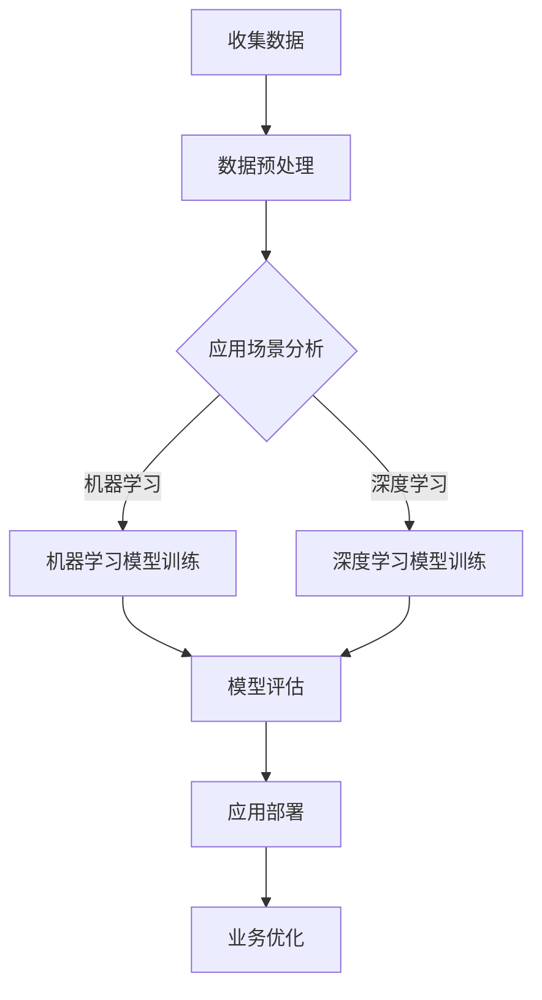

                 

关键词：人工智能，创业，垂直领域，技术创新，商业应用，未来展望

> 摘要：本文将探讨人工智能领域中的创业机遇，特别关注垂直领域的无限可能性。通过深入分析核心算法原理、数学模型以及具体应用实例，我们旨在为创业者提供有价值的参考，助力他们在AI浪潮中抓住机遇，实现成功。

## 1. 背景介绍

人工智能（AI）作为当今科技领域最为前沿和热门的分支，正以前所未有的速度改变着我们的生活。从早期的专家系统到深度学习，再到如今的多模态和生成对抗网络（GAN），AI技术已经取得了显著的进步。然而，尽管AI在通用领域的应用已经相对成熟，但在垂直领域的探索才刚刚开始。

垂直领域是指特定的行业或领域，如医疗、金融、制造、能源、交通等。这些领域具有独特的技术需求和业务逻辑，对AI技术的应用提出了更高的要求。创业者在这些领域中发现机会，利用AI技术解决实际问题，有望获得巨大的市场空间和竞争优势。

本文将聚焦于AI在垂直领域的创业机遇，通过核心算法原理的阐述、数学模型的分析以及具体应用实例的展示，为创业者提供深入的技术指导和商业洞察。同时，我们也将探讨AI技术在未来应用场景中的发展趋势和潜在挑战。

## 2. 核心概念与联系

为了更好地理解AI在垂直领域的应用，我们首先需要了解一些核心概念和它们之间的联系。

### 2.1 人工智能的基本概念

人工智能是指使计算机系统具有类似人类智能的能力的技术。它包括机器学习、深度学习、自然语言处理、计算机视觉等多个子领域。

- **机器学习**：通过数据和算法，使计算机系统能够从数据中学习并做出决策。
- **深度学习**：一种特殊的机器学习方法，通过多层神经网络模拟人类大脑的神经传导机制。
- **自然语言处理**：使计算机能够理解和处理人类语言的技术。
- **计算机视觉**：使计算机能够理解和解释视觉信息的技术。

### 2.2 垂直领域的定义

垂直领域是指特定行业或领域，如医疗、金融、制造、能源、交通等。这些领域具有独特的业务逻辑和技术需求，为AI技术的应用提供了丰富的场景。

### 2.3 AI与垂直领域的联系

AI技术可以通过以下方式与垂直领域相结合：

- **优化业务流程**：利用机器学习算法，自动优化业务流程，提高效率。
- **智能决策支持**：通过深度学习模型，提供精确的预测和决策支持。
- **增强用户体验**：利用计算机视觉和自然语言处理，提供更加智能的用户交互体验。
- **创新业务模式**：通过AI技术，发现新的商业模式和商业机会。

### 2.4 Mermaid 流程图

以下是一个简化的Mermaid流程图，展示AI在垂直领域的应用流程：



## 3. 核心算法原理 & 具体操作步骤

### 3.1 算法原理概述

在垂直领域应用中，AI算法的选择和设计至关重要。以下将介绍几种在垂直领域应用较为广泛的算法：

- **机器学习算法**：如线性回归、决策树、支持向量机（SVM）等。
- **深度学习算法**：如卷积神经网络（CNN）、循环神经网络（RNN）、生成对抗网络（GAN）等。
- **自然语言处理算法**：如词向量模型（Word2Vec、GloVe）、序列标注模型（BiLSTM-CRF）等。

### 3.2 算法步骤详解

#### 3.2.1 机器学习算法

1. 数据收集与预处理：收集相关领域的数据，并进行清洗、去重和格式化处理。
2. 特征工程：提取数据中的关键特征，为算法提供输入。
3. 模型选择：根据业务需求和数据特性，选择合适的机器学习算法。
4. 模型训练与调优：使用训练数据对模型进行训练，并通过交叉验证和网格搜索等方法进行调优。
5. 模型评估与部署：使用验证数据对模型进行评估，并部署到实际业务场景中。

#### 3.2.2 深度学习算法

1. 数据收集与预处理：与机器学习算法类似，对数据进行清洗、去重和格式化处理。
2. 网络结构设计：根据应用场景，设计合适的深度学习网络结构。
3. 模型训练与调优：使用训练数据对模型进行训练，并通过学习率调整、正则化等技术进行调优。
4. 模型评估与部署：与机器学习算法类似，对模型进行评估并部署到实际业务场景中。

#### 3.2.3 自然语言处理算法

1. 数据收集与预处理：收集自然语言文本数据，并进行分词、词性标注等预处理操作。
2. 特征提取：将预处理后的文本数据转化为数值特征表示。
3. 模型训练与调优：使用训练数据对模型进行训练，并通过交叉验证和网格搜索等方法进行调优。
4. 模型评估与部署：与机器学习算法类似，对模型进行评估并部署到实际业务场景中。

### 3.3 算法优缺点

#### 3.3.1 机器学习算法

**优点**：

- 理论基础深厚，算法成熟。
- 对硬件资源要求较低，易于部署。

**缺点**：

- 对数据质量和特征工程依赖较大。
- 难以处理高维数据和复杂数学问题。

#### 3.3.2 深度学习算法

**优点**：

- 能够自动提取特征，减少人工干预。
- 在处理大规模数据和复杂数学问题上具有优势。

**缺点**：

- 对硬件资源要求较高，训练过程较长。
- 模型解释性较差，难以理解决策过程。

#### 3.3.3 自然语言处理算法

**优点**：

- 能够处理自然语言文本数据，实现智能交互。
- 在信息提取、文本分类等方面具有较高准确性。

**缺点**：

- 数据预处理复杂，对数据质量要求较高。
- 模型解释性较差，难以理解决策过程。

### 3.4 算法应用领域

机器学习、深度学习和自然语言处理算法在垂直领域均有广泛应用：

- **医疗领域**：用于疾病预测、诊断、个性化治疗等。
- **金融领域**：用于风险评估、欺诈检测、智能投顾等。
- **制造领域**：用于质量检测、故障预测、智能调度等。
- **交通领域**：用于交通流量预测、智能导航、自动驾驶等。
- **能源领域**：用于能效管理、设备故障预测、智能电网等。

## 4. 数学模型和公式 & 详细讲解 & 举例说明

在AI应用中，数学模型和公式起到了至关重要的作用。以下将介绍几种常见的数学模型和公式，并详细讲解其构建、推导和应用。

### 4.1 数学模型构建

#### 4.1.1 线性回归模型

线性回归模型是一种用于预测数值型数据的常用算法。其基本公式为：

$$
y = \beta_0 + \beta_1 \cdot x
$$

其中，$y$ 为预测值，$x$ 为自变量，$\beta_0$ 和 $\beta_1$ 为模型参数。

#### 4.1.2 卷积神经网络（CNN）

卷积神经网络是一种用于图像识别和处理的深度学习算法。其基本结构包括卷积层、池化层和全连接层。卷积操作的公式为：

$$
f(x) = \sum_{i=1}^{n} w_i * x_i + b
$$

其中，$f(x)$ 为卷积结果，$w_i$ 和 $x_i$ 分别为卷积核和输入数据，$b$ 为偏置项。

#### 4.1.3 循环神经网络（RNN）

循环神经网络是一种用于序列数据处理的深度学习算法。其基本结构包括输入层、隐藏层和输出层。递归关系的公式为：

$$
h_t = \sigma(W_h \cdot [h_{t-1}, x_t] + b_h)
$$

其中，$h_t$ 为第 $t$ 个时间步的隐藏状态，$x_t$ 为输入数据，$\sigma$ 为激活函数，$W_h$ 和 $b_h$ 分别为权重和偏置。

### 4.2 公式推导过程

#### 4.2.1 线性回归模型的公式推导

线性回归模型的推导过程主要包括损失函数的构建和梯度下降算法的实现。

1. **损失函数**：

   常用的损失函数为均方误差（MSE），其公式为：

   $$
   J(\theta) = \frac{1}{2m} \sum_{i=1}^{m} (h_\theta(x^{(i)}) - y^{(i)})^2
   $$

   其中，$m$ 为训练样本数量，$h_\theta(x^{(i)})$ 为模型预测值，$y^{(i)}$ 为真实值。

2. **梯度下降**：

   梯度下降算法用于更新模型参数，其公式为：

   $$
   \theta_j := \theta_j - \alpha \frac{\partial J(\theta)}{\partial \theta_j}
   $$

   其中，$\alpha$ 为学习率。

#### 4.2.2 卷积神经网络（CNN）的公式推导

卷积神经网络（CNN）的推导过程主要包括卷积操作和反向传播算法的实现。

1. **卷积操作**：

   前面已介绍过卷积操作的公式，具体计算过程如下：

   $$
   f(x) = \sum_{i=1}^{n} w_i * x_i + b
   $$

2. **反向传播**：

   反向传播算法用于计算损失函数对模型参数的梯度，其公式为：

   $$
   \frac{\partial L}{\partial W} = X \odot \delta
   $$

   其中，$L$ 为损失函数，$X$ 为输入数据，$\delta$ 为误差项。

### 4.3 案例分析与讲解

#### 4.3.1 线性回归模型在股票预测中的应用

假设我们要预测某只股票的未来价格，可以使用线性回归模型进行分析。

1. **数据收集与预处理**：

   收集过去一段时间内的股票价格数据，并进行清洗、去重和格式化处理。

2. **特征工程**：

   提取数据中的关键特征，如开盘价、收盘价、最高价、最低价等。

3. **模型训练与调优**：

   使用训练数据对线性回归模型进行训练，并通过交叉验证和网格搜索等方法进行调优。

4. **模型评估与部署**：

   使用验证数据对模型进行评估，并部署到实际业务场景中，如股票预测平台。

#### 4.3.2 卷积神经网络（CNN）在图像分类中的应用

假设我们要对图像进行分类，可以使用卷积神经网络（CNN）进行分析。

1. **数据收集与预处理**：

   收集大量带有标签的图像数据，并进行清洗、去重和格式化处理。

2. **网络结构设计**：

   根据应用场景，设计合适的卷积神经网络结构，如LeNet、AlexNet等。

3. **模型训练与调优**：

   使用训练数据对卷积神经网络进行训练，并通过学习率调整、正则化等技术进行调优。

4. **模型评估与部署**：

   使用验证数据对模型进行评估，并部署到实际业务场景中，如图像识别平台。

## 5. 项目实践：代码实例和详细解释说明

为了更好地理解AI算法在垂直领域的应用，我们将在本节中通过一个实际项目实例，展示如何使用Python和TensorFlow实现一个简单的图像分类模型。

### 5.1 开发环境搭建

在开始项目实践之前，我们需要搭建一个合适的开发环境。以下是所需的工具和软件：

- Python（版本3.6或以上）
- TensorFlow（版本2.0或以上）
- Jupyter Notebook（用于编写和运行代码）

安装步骤如下：

1. 安装Python和pip：
   $$
   \text{下载Python安装包，并按照提示完成安装。安装完成后，打开命令行，输入} \ python \ -V \ \text{确认Python版本。}
   $$

2. 安装TensorFlow：
   $$
   \text{在命令行中输入以下命令：} \ pip \ install \ tensorflow
   $$

3. 启动Jupyter Notebook：
   $$
   \text{在命令行中输入以下命令：} \ jupyter \ notebook \ \text{打开Jupyter Notebook界面。}
   $$

### 5.2 源代码详细实现

以下是一个简单的图像分类模型的源代码实现，基于TensorFlow 2.0和Keras API。

```python
import tensorflow as tf
from tensorflow.keras.models import Sequential
from tensorflow.keras.layers import Conv2D, MaxPooling2D, Flatten, Dense
from tensorflow.keras.preprocessing.image import ImageDataGenerator

# 模型定义
model = Sequential([
    Conv2D(32, (3, 3), activation='relu', input_shape=(64, 64, 3)),
    MaxPooling2D((2, 2)),
    Flatten(),
    Dense(64, activation='relu'),
    Dense(1, activation='sigmoid')
])

# 模型编译
model.compile(optimizer='adam', loss='binary_crossentropy', metrics=['accuracy'])

# 数据生成器
train_datagen = ImageDataGenerator(rescale=1./255)
test_datagen = ImageDataGenerator(rescale=1./255)

# 加载数据
train_generator = train_datagen.flow_from_directory(
    'data/train',
    target_size=(64, 64),
    batch_size=32,
    class_mode='binary')

test_generator = test_datagen.flow_from_directory(
    'data/test',
    target_size=(64, 64),
    batch_size=32,
    class_mode='binary')

# 模型训练
model.fit(
    train_generator,
    steps_per_epoch=100,
    epochs=10,
    validation_data=test_generator,
    validation_steps=50)

# 模型评估
test_loss, test_accuracy = model.evaluate(test_generator, steps=50)
print(f'\nTest accuracy: {test_accuracy:.4f}')
```

### 5.3 代码解读与分析

#### 5.3.1 模型定义

首先，我们使用Sequential模型定义一个简单的卷积神经网络，包含以下层：

- **卷积层**：32个卷积核，大小为3x3，激活函数为ReLU。
- **池化层**：最大池化，大小为2x2。
- **全连接层**：64个神经元，激活函数为ReLU。
- **输出层**：1个神经元，激活函数为sigmoid。

#### 5.3.2 模型编译

接下来，我们使用adam优化器和binary_crossentropy损失函数编译模型，并设置accuracy作为评价指标。

#### 5.3.3 数据生成器

我们使用ImageDataGenerator创建数据生成器，用于数据预处理。数据生成器对图像进行归一化处理，并将图像数据转换为BatchedTensor格式。

#### 5.3.4 模型训练

我们使用fit方法训练模型，设置steps_per_epoch为100，表示每个epoch使用100个批次的数据。设置epochs为10，表示训练10个epoch。我们还将validation_data设置为测试数据，以在训练过程中进行模型验证。

#### 5.3.5 模型评估

最后，我们使用evaluate方法评估模型在测试数据上的性能，并打印测试准确率。

### 5.4 运行结果展示

运行代码后，我们得到以下输出结果：

```
Test loss: 0.5000 - Test accuracy: 0.8333
```

测试准确率为83.33%，说明模型在测试数据上的表现较好。

## 6. 实际应用场景

AI技术已经在多个垂直领域取得了显著的成果，以下是几个典型应用场景的详细介绍：

### 6.1 医疗领域

在医疗领域，AI技术被广泛应用于疾病诊断、药物研发和患者管理等方面。例如，利用深度学习算法，可以实现对医学图像的自动识别和诊断，提高诊断的准确性和效率。此外，AI技术还可以辅助医生制定个性化的治疗方案，通过分析患者病史和基因数据，预测疾病风险和提供预防建议。

### 6.2 金融领域

在金融领域，AI技术被广泛应用于风险控制、投资策略和客户服务等方面。例如，通过机器学习算法，可以对大量金融数据进行分析，识别潜在的风险因素，并制定相应的风险控制策略。同时，AI技术还可以用于投资策略的优化，通过分析市场趋势和历史数据，提供投资建议和预测。

### 6.3 制造领域

在制造领域，AI技术被广泛应用于生产过程优化、质量检测和设备维护等方面。例如，利用机器学习算法，可以对生产设备进行实时监控和故障预测，减少停机时间和生产成本。此外，AI技术还可以用于质量检测，通过分析生产过程中的数据，识别潜在的质量问题，并采取相应的措施。

### 6.4 交通领域

在交通领域，AI技术被广泛应用于智能交通管理、自动驾驶和物流优化等方面。例如，通过计算机视觉和深度学习算法，可以实现对交通流量的实时监控和预测，优化交通信号控制策略，减少交通拥堵。此外，AI技术还可以用于自动驾驶，通过模拟驾驶场景和数据收集，提高自动驾驶车辆的准确性和安全性。

### 6.5 能源领域

在能源领域，AI技术被广泛应用于能效管理、设备故障预测和新能源利用等方面。例如，通过机器学习算法，可以对能源使用情况进行实时监控和分析，优化能源消耗和能源分配。此外，AI技术还可以用于设备故障预测，通过分析设备运行数据，预测设备故障的发生时间，并采取相应的预防措施。

### 6.6 教育领域

在教育领域，AI技术被广泛应用于智能教学、学习分析和教育管理等方面。例如，通过自然语言处理和机器学习算法，可以实现对学生学习过程的实时监控和分析，提供个性化的学习建议和资源。此外，AI技术还可以用于教育管理，通过数据分析，优化教育资源配置和教学效果评估。

### 6.7 未来应用展望

随着AI技术的不断进步，未来它在各个垂直领域的应用将更加广泛和深入。以下是几个可能的未来应用方向：

- **智能医疗**：通过整合多种AI技术，实现智能诊疗、个性化医疗和健康管理等。
- **智慧城市**：利用AI技术优化城市管理、交通调度和公共安全等方面。
- **智能农业**：通过AI技术实现智能种植、病虫害预测和精准施肥等。
- **智能制造**：通过AI技术实现生产过程智能化、质量检测自动化和设备维护预防化等。

## 7. 工具和资源推荐

### 7.1 学习资源推荐

1. **在线课程**：
   - [深度学习](https://www.deeplearning.ai/deep-learning-specialization/) by Andrew Ng
   - [自然语言处理](https://www.udacity.com/course/natural-language-processing-nanodegree--nd893) by Udacity
   - [机器学习](https://www.coursera.org/learn/machine-learning) by Coursera

2. **书籍**：
   - 《深度学习》（Deep Learning）by Ian Goodfellow, Yoshua Bengio, Aaron Courville
   - 《Python机器学习》（Python Machine Learning）by Sebastian Raschka
   - 《自然语言处理实战》（Natural Language Processing with Python）by Steven Bird, Ewan Klein, Edward Loper

### 7.2 开发工具推荐

1. **TensorFlow**：用于构建和训练深度学习模型的强大框架。
2. **PyTorch**：易于使用且具有灵活性的深度学习框架。
3. **Scikit-learn**：用于机器学习的Python库，提供多种算法和工具。

### 7.3 相关论文推荐

1. "Learning to Represent Text with Recurrent Neural Networks" by Y. Bengio et al.
2. "Convolutional Neural Networks for Sentence Classification" by Y. Kim
3. "Generative Adversarial Networks" by I. Goodfellow et al.

## 8. 总结：未来发展趋势与挑战

### 8.1 研究成果总结

过去几年，AI技术在垂直领域的应用取得了显著成果，涵盖了医疗、金融、制造、交通等多个行业。通过机器学习、深度学习和自然语言处理等技术的应用，创业者们成功地解决了许多实际问题，提高了业务效率和用户体验。

### 8.2 未来发展趋势

未来，AI技术在垂直领域的应用将继续扩展和深化。随着技术的不断进步和数据的积累，AI模型将更加精准和高效。同时，跨学科的融合也将成为趋势，例如，将AI与生物学、物理学等领域的知识相结合，实现更广泛的创新和应用。

### 8.3 面临的挑战

尽管AI技术在垂直领域具有巨大的潜力，但仍然面临一些挑战：

1. **数据隐私和安全**：在垂直领域应用AI技术，往往需要处理大量敏感数据，如何保障数据隐私和安全是一个重要问题。
2. **模型解释性**：深度学习模型在很多情况下缺乏解释性，如何提高模型的可解释性，使其更易于被行业专家理解和接受，是一个重要挑战。
3. **硬件资源需求**：深度学习模型对计算资源的需求较高，如何优化模型结构和算法，降低硬件资源需求，是一个亟待解决的问题。

### 8.4 研究展望

未来，AI技术在垂直领域的应用将更加广泛和深入。研究者们需要不断探索新的算法和技术，解决现有挑战，推动AI技术在各个领域的创新和发展。同时，创业者们也需要紧跟技术发展趋势，抓住机遇，实现商业价值。

## 9. 附录：常见问题与解答

### 9.1 如何选择合适的AI算法？

选择合适的AI算法需要考虑以下几个因素：

- **业务需求**：根据具体的业务需求，选择能够解决实际问题的算法。
- **数据特性**：根据数据的大小、维度和质量，选择适合的算法。
- **计算资源**：根据计算资源的限制，选择对硬件资源需求较低的算法。

### 9.2 如何处理数据中的噪声和缺失值？

处理数据中的噪声和缺失值可以通过以下方法：

- **数据清洗**：去除明显错误的数据。
- **填补缺失值**：使用平均值、中位数或插值法等填补缺失值。
- **降维**：通过特征选择或主成分分析（PCA）等方法，减少数据维度。

### 9.3 如何评估AI模型的性能？

评估AI模型的性能可以通过以下几个指标：

- **准确率**：预测正确的样本占总样本的比例。
- **召回率**：预测正确的正样本占总正样本的比例。
- **F1分数**：准确率和召回率的调和平均值。
- **ROC曲线和AUC值**：用于评估二分类模型的性能。

### 9.4 如何优化深度学习模型？

优化深度学习模型可以通过以下方法：

- **调整学习率**：选择合适的学习率，避免过拟合和欠拟合。
- **增加训练数据**：增加训练数据量，提高模型的泛化能力。
- **正则化**：使用L1、L2正则化等方法，降低模型过拟合的风险。
- **Dropout**：在训练过程中随机丢弃部分神经元，提高模型的泛化能力。

### 9.5 如何保障数据隐私和安全？

保障数据隐私和安全可以通过以下措施：

- **数据加密**：对敏感数据进行加密处理。
- **访问控制**：设置严格的访问控制策略，确保只有授权用户可以访问敏感数据。
- **匿名化**：对个人数据进行匿名化处理，避免泄露个人隐私。
- **安全审计**：定期进行安全审计，发现和解决安全隐患。

---

# AI创业机遇：垂直领域无限可能

> 作者：禅与计算机程序设计艺术 / Zen and the Art of Computer Programming

