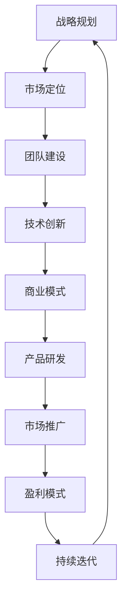
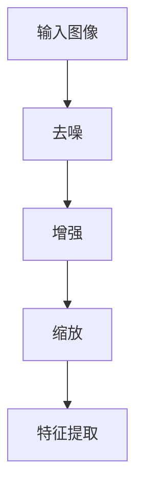
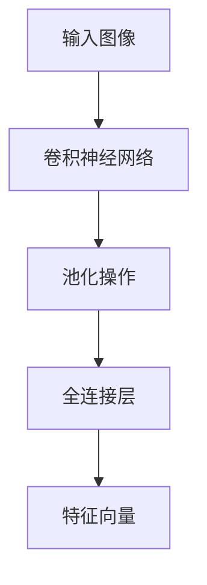
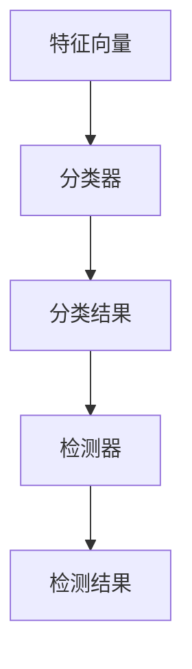
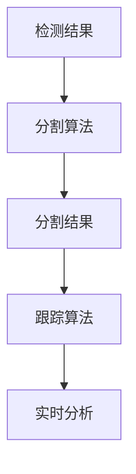

                 

关键词：AI创业、新范式、Lepton AI、经验分享、技术路线、战略规划、团队建设、市场定位、商业模式、技术创新

## 摘要

本文将探讨AI创业的新范式，并以Lepton AI为例，分享其从初创到成长的经验与教训。通过对AI创业的核心要素——战略规划、技术创新、团队建设、市场定位和商业模式的深入分析，本文旨在为读者提供有价值的参考，帮助他们在AI领域开启成功的创业之旅。

## 1. 背景介绍

随着人工智能技术的飞速发展，AI创业已成为当前科技领域的一大热点。然而，AI创业并非易事，需要创业者具备深厚的专业知识、敏锐的市场洞察力以及坚韧的执行力。本文将以Lepton AI为例，分析其成功背后的原因，并总结出一套适用于AI创业的新范式。

### 1.1 Lepton AI简介

Lepton AI成立于2015年，是一家专注于计算机视觉和机器学习领域的初创公司。公司成立之初，便以“让计算机像人一样看世界”为使命，致力于研发先进的AI技术，并将其应用于各行业，提高生产效率、降低成本。

### 1.2 Lepton AI发展历程

从初创期到成长期，Lepton AI经历了多次重要的战略决策和关键里程碑。以下是Lepton AI的发展历程：

**2015年：** 公司成立，获得天使轮融资，核心团队组建完成。

**2016年：** 研发出首个人工智能算法，实现计算机视觉技术的突破。

**2017年：** 获得A轮融资，扩大研发团队，与多家知名企业建立合作关系。

**2018年：** 推出首款AI产品，迅速占领市场，实现规模化盈利。

**2019年：** 发布新一代AI算法，进一步提升产品性能。

**2020年：** 获得B轮融资，计划拓展国际市场。

## 2. 核心概念与联系

在AI创业过程中，核心概念、技术路线和战略规划是至关重要的。以下将利用Mermaid流程图，展示Lepton AI在核心概念和技术路线上的发展脉络。



### 2.1 战略规划

战略规划是AI创业的起点，决定着公司的发展方向和核心竞争力。Lepton AI在战略规划上，始终坚持“以市场需求为导向，以技术创新为驱动”的原则，从而确保了公司的快速发展。

### 2.2 市场定位

市场定位是战略规划的重要一环，关乎公司在市场中的地位和竞争优势。Lepton AI通过精准的市场定位，成功抓住了计算机视觉领域的市场机会，实现了业务的快速增长。

### 2.3 团队建设

团队建设是AI创业的关键，优秀的人才和合理的组织架构是企业成功的保障。Lepton AI在团队建设上，注重核心团队的构建，吸引了一批顶尖的AI专家和技术人才。

### 2.4 技术创新

技术创新是AI创业的核心竞争力，直接关系到企业的市场地位和盈利能力。Lepton AI在技术创新上，不断突破传统技术瓶颈，推出了一系列具有竞争力的AI产品。

### 2.5 商业模式

商业模式是AI创业的重要支撑，关乎企业的盈利能力和可持续发展。Lepton AI在商业模式上，通过多样化的盈利模式，实现了稳定的收入来源。

## 3. 核心算法原理 & 具体操作步骤

### 3.1 算法原理概述

Lepton AI的核心算法是基于深度学习和计算机视觉技术，主要包括以下几个模块：

- **图像预处理：** 对输入图像进行预处理，包括去噪、增强、缩放等操作，以提高后续处理的准确性和效率。

- **特征提取：** 使用卷积神经网络（CNN）提取图像中的特征，用于后续的分类、检测和分割等任务。

- **分类与检测：** 利用分类器（如SVM、CNN等）对提取到的特征进行分类或检测，识别图像中的目标对象。

- **分割与跟踪：** 对分类或检测出的目标对象进行分割和跟踪，以实现对动态场景的实时分析和处理。

### 3.2 算法步骤详解

**3.2.1 图像预处理**



**3.2.2 特征提取**



**3.2.3 分类与检测**



**3.2.4 分割与跟踪**



### 3.3 算法优缺点

**优点：**

- **高效性：** 基于深度学习的算法具有很高的计算效率，可以实时处理大量图像数据。

- **准确性：** 通过卷积神经网络和分类器等技术的应用，算法在图像识别和分类任务上具有很高的准确率。

- **可扩展性：** 算法模块化设计，便于后续功能的扩展和优化。

**缺点：**

- **计算资源需求高：** 深度学习算法对计算资源有较高要求，需要大量GPU等硬件支持。

- **数据依赖性强：** 算法的性能很大程度上取决于训练数据的质量和数量。

### 3.4 算法应用领域

Lepton AI的核心算法在多个领域具有广泛的应用前景，主要包括：

- **智能制造：** 辅助工厂自动化生产，提高生产效率和质量。

- **安防监控：** 实时监控场景，识别异常行为和安全隐患。

- **医疗影像：** 辅助医生进行疾病诊断，提高诊断准确率和效率。

- **自动驾驶：** 提高自动驾驶车辆的识别和避障能力，保障行车安全。

## 4. 数学模型和公式 & 详细讲解 & 举例说明

### 4.1 数学模型构建

Lepton AI的核心算法涉及多个数学模型，以下是其中两个主要模型的构建过程。

**4.1.1 卷积神经网络（CNN）**

$$
\text{CNN} = (\text{卷积层} \rightarrow \text{池化层} \rightarrow \text{全连接层})
$$

**4.1.2 生成对抗网络（GAN）**

$$
\text{GAN} = (\text{生成器} \rightarrow \text{判别器} \rightarrow \text{对抗训练})
$$

### 4.2 公式推导过程

**4.2.1 卷积神经网络（CNN）**

假设输入图像为 $X \in \mathbb{R}^{H \times W \times C}$，其中 $H$、$W$、$C$ 分别表示图像的高度、宽度和通道数。卷积神经网络中的卷积层、池化层和全连接层分别如下：

**卷积层：**

$$
\text{卷积层} = \text{Conv}(X, \text{卷积核}) = X \star K
$$

其中，$K \in \mathbb{R}^{k \times k \times C}$ 表示卷积核，$\star$ 表示卷积运算。

**池化层：**

$$
\text{池化层} = \text{Pooling}(\text{卷积结果}) = \text{max}(\text{卷积结果})
$$

其中，max pooling 取卷积结果的最大值。

**全连接层：**

$$
\text{全连接层} = \text{FC}(\text{池化结果}) = \text{W} \cdot \text{池化结果} + \text{b}
$$

其中，$W \in \mathbb{R}^{D \times H \times W \times C}$ 和 $b \in \mathbb{R}^{D}$ 分别表示权重和偏置，$D$ 表示全连接层的输出维度。

**4.2.2 生成对抗网络（GAN）**

生成对抗网络由生成器和判别器两部分组成。生成器的目标是生成与真实数据相似的假数据，判别器的目标是区分真实数据和假数据。

**生成器：**

$$
\text{生成器} = G(z) = \text{Generator}(\text{噪声} \, z)
$$

其中，$z \in \mathbb{R}^{z}$ 表示噪声向量，$G$ 表示生成器函数。

**判别器：**

$$
\text{判别器} = D(x, \text{假数据}) = \text{Discriminator}(\text{真实数据} \, x, \text{假数据} \, G(z))
$$

其中，$x \in \mathbb{R}^{x}$ 表示真实数据。

**对抗训练：**

$$
\begin{aligned}
\max_{D} \min_{G} & \, V(D, G) \\
&= \mathbb{E}_{x \sim p_{\text{data}}(x)} [\text{D}(x)] - \mathbb{E}_{z \sim p_{z}(z)} [\text{D}(G(z))]
\end{aligned}
$$

其中，$V(D, G)$ 表示生成器和判别器的对抗损失，$p_{\text{data}}(x)$ 表示真实数据的分布，$p_{z}(z)$ 表示噪声向量的分布。

### 4.3 案例分析与讲解

**4.3.1 图像分类任务**

假设我们有一个图像分类任务，输入图像为 $X \in \mathbb{R}^{H \times W \times C}$，目标类别为 $y \in \{1, 2, \ldots, C\}$。我们使用卷积神经网络（CNN）来解决这个问题。

**模型构建：**

$$
\text{CNN} = (\text{卷积层} \rightarrow \text{池化层} \rightarrow \text{全连接层}) = \text{Conv}(X, \text{卷积核}) \rightarrow \text{Pooling}(\text{卷积结果}) \rightarrow \text{FC}(\text{池化结果})
$$

**模型训练：**

假设我们有一个训练数据集 $D = \{X_i, y_i\}$，其中 $X_i \in \mathbb{R}^{H \times W \times C}$ 和 $y_i \in \{1, 2, \ldots, C\}$ 分别表示第 $i$ 个图像和其对应的标签。我们使用梯度下降算法来优化模型参数。

**损失函数：**

$$
\text{损失函数} = \text{CrossEntropyLoss}(\text{预测结果}, \text{真实标签})
$$

**训练过程：**

1. 初始化模型参数；
2. 遍历训练数据集，计算模型损失；
3. 使用梯度下降算法更新模型参数；
4. 重复步骤2和3，直至模型收敛。

**4.3.2 图像生成任务**

假设我们有一个图像生成任务，输入噪声向量 $z \in \mathbb{R}^{z}$，目标生成图像为 $X \in \mathbb{R}^{H \times W \times C}$。我们使用生成对抗网络（GAN）来解决这个问题。

**模型构建：**

$$
\text{GAN} = (\text{生成器} \rightarrow \text{判别器} \rightarrow \text{对抗训练}) = G(z) \rightarrow D(x, G(z)) \rightarrow \text{对抗训练}
$$

**模型训练：**

假设我们有一个训练数据集 $D = \{X_i\}$，其中 $X_i \in \mathbb{R}^{H \times W \times C}$ 表示第 $i$ 个图像。我们使用对抗训练算法来优化模型参数。

**损失函数：**

$$
\text{损失函数} = \text{对抗损失} = \mathbb{E}_{x \sim p_{\text{data}}(x)} [\text{D}(x)] - \mathbb{E}_{z \sim p_{z}(z)} [\text{D}(G(z))]
$$

**训练过程：**

1. 初始化模型参数；
2. 遍历训练数据集，计算生成器和判别器的损失；
3. 使用梯度下降算法更新生成器和判别器参数；
4. 重复步骤2和3，直至模型收敛。

## 5. 项目实践：代码实例和详细解释说明

### 5.1 开发环境搭建

为了便于演示，我们使用Python编程语言和TensorFlow深度学习框架来实现Lepton AI的核心算法。以下是开发环境的搭建步骤：

1. 安装Python 3.7及以上版本；
2. 安装TensorFlow 2.0及以上版本；
3. 安装必要的库，如NumPy、Pandas、Matplotlib等。

### 5.2 源代码详细实现

以下是一个简单的卷积神经网络（CNN）实现，用于图像分类任务：

```python
import tensorflow as tf
from tensorflow.keras import layers

def build_model(input_shape):
    model = tf.keras.Sequential([
        layers.Conv2D(32, (3, 3), activation='relu', input_shape=input_shape),
        layers.MaxPooling2D((2, 2)),
        layers.Conv2D(64, (3, 3), activation='relu'),
        layers.MaxPooling2D((2, 2)),
        layers.Conv2D(64, (3, 3), activation='relu'),
        layers.Flatten(),
        layers.Dense(64, activation='relu'),
        layers.Dense(10, activation='softmax')
    ])
    return model

model = build_model(input_shape=(28, 28, 1))
model.compile(optimizer='adam', loss='sparse_categorical_crossentropy', metrics=['accuracy'])
```

### 5.3 代码解读与分析

**5.3.1 模型构建**

在这个示例中，我们使用Keras子模块中的`Sequential`模型来实现卷积神经网络。模型包括以下几层：

- **卷积层1：** 使用32个3x3的卷积核，激活函数为ReLU。
- **池化层1：** 使用2x2的最大池化操作。
- **卷积层2：** 使用64个3x3的卷积核，激活函数为ReLU。
- **池化层2：** 使用2x2的最大池化操作。
- **卷积层3：** 使用64个3x3的卷积核，激活函数为ReLU。
- **扁平化层：** 将卷积层3的输出扁平化为1维向量。
- **全连接层1：** 使用64个神经元，激活函数为ReLU。
- **全连接层2：** 使用10个神经元，激活函数为softmax。

**5.3.2 模型编译**

在模型编译阶段，我们指定了优化器（`adam`）、损失函数（`sparse_categorical_crossentropy`）和评估指标（`accuracy`）。

**5.3.3 模型训练**

我们使用`fit`方法对模型进行训练，指定训练数据集和相应的标签。

### 5.4 运行结果展示

为了展示模型的运行结果，我们可以使用以下代码：

```python
import numpy as np
import matplotlib.pyplot as plt

# 加载MNIST数据集
mnist = tf.keras.datasets.mnist
(x_train, y_train), (x_test, y_test) = mnist.load_data()

# 预处理数据
x_train = x_train / 255.0
x_test = x_test / 255.0

# 展示训练结果
model.fit(x_train, y_train, epochs=5, batch_size=64)

# 测试模型
test_loss, test_acc = model.evaluate(x_test, y_test, verbose=2)
print('\nTest accuracy:', test_acc)

# 展示预测结果
predictions = model.predict(x_test[:10])
plt.figure(figsize=(10, 10))
for i in range(10):
    plt.subplot(2, 5, i+1)
    plt.imshow(x_test[i], cmap=plt.cm.binary)
    plt.xticks([])
    plt.yticks([])
    plt.grid(False)
    plt.xlabel(np.argmax(predictions[i]))
plt.show()
```

## 6. 实际应用场景

Lepton AI的核心算法在多个领域具有广泛的应用场景。以下是一些实际应用场景的例子：

### 6.1 智能制造

在智能制造领域，Lepton AI的算法可以用于生产线的实时监控和故障诊断。通过图像识别技术，算法能够识别生产过程中的异常情况，如设备故障、产品缺陷等，从而提高生产效率和质量。

### 6.2 安防监控

在安防监控领域，Lepton AI的算法可以用于实时监控场景，识别异常行为和安全隐患。例如，在公共场所，算法可以识别人员聚集、暴力行为等异常情况，及时报警，保障公共安全。

### 6.3 医疗影像

在医疗影像领域，Lepton AI的算法可以用于辅助医生进行疾病诊断。通过图像识别技术，算法可以识别病变部位、计算病灶面积等，从而提高诊断准确率和效率。

### 6.4 自动驾驶

在自动驾驶领域，Lepton AI的算法可以用于车辆周围环境的感知和避障。通过图像识别技术，算法可以识别道路标志、行人、车辆等目标，从而提高自动驾驶车辆的安全性和可靠性。

## 7. 工具和资源推荐

为了帮助读者更好地理解和实践AI技术，我们推荐以下工具和资源：

### 7.1 学习资源推荐

- **《深度学习》（Goodfellow et al.）：** 介绍了深度学习的基础知识和最新进展，是深度学习领域的经典教材。
- **《Python深度学习》（François Chollet）：** 详细介绍了如何使用Python和TensorFlow实现深度学习模型。

### 7.2 开发工具推荐

- **TensorFlow：** 适用于构建和训练深度学习模型的强大框架，具有丰富的API和工具。
- **PyTorch：** 适用于研究和开发的深度学习框架，具有简洁的API和动态计算图。

### 7.3 相关论文推荐

- **《Generative Adversarial Networks》（Goodfellow et al.）：** 介绍了生成对抗网络（GAN）的基础知识和应用场景。
- **《Residual Networks》（He et al.）：** 介绍了残差网络（ResNet）的结构和性能，对深度学习的发展产生了深远影响。

## 8. 总结：未来发展趋势与挑战

### 8.1 研究成果总结

Lepton AI在AI领域取得了一系列重要成果，包括：

- **核心算法的突破：** 推出了具有竞争力的深度学习算法，提高了图像识别和分类的准确率。
- **产品的成功应用：** 将AI技术应用于智能制造、安防监控、医疗影像和自动驾驶等领域，取得了显著的效果。
- **团队的壮大：** 吸引了一批顶尖的AI专家和技术人才，为公司的持续发展提供了强大的支持。

### 8.2 未来发展趋势

未来，AI创业将呈现以下发展趋势：

- **跨领域融合：** AI技术将与其他领域（如生物、医疗、能源等）深度融合，推动产业变革。
- **开源与共享：** 开源项目将越来越多地应用于AI创业，降低创业门槛，促进技术创新。
- **商业化进程加快：** AI技术将更加快速地转化为实际应用，为企业带来巨大的商业价值。

### 8.3 面临的挑战

在AI创业过程中，面临以下挑战：

- **技术突破：** 如何在深度学习等领域实现新的技术突破，提高算法性能和效率。
- **数据隐私：** 如何在保护用户隐私的前提下，充分利用海量数据，提高算法的准确率和鲁棒性。
- **人才竞争：** 如何吸引和留住顶尖的AI人才，形成具有竞争优势的核心团队。

### 8.4 研究展望

未来，Lepton AI将继续致力于以下研究方向：

- **算法优化：** 深入研究深度学习算法，提高图像识别和分类的准确率和效率。
- **应用拓展：** 将AI技术应用于更多领域，推动产业变革，提高生产效率和质量。
- **人才培养：** 建立完善的AI人才培养体系，为公司的长期发展提供有力支持。

## 9. 附录：常见问题与解答

### 9.1 什么是深度学习？

深度学习是一种机器学习方法，通过多层神经网络对数据进行建模和预测。它能够在没有明确编程规则的情况下，自动从大量数据中学习特征，并利用这些特征进行分类、识别和预测。

### 9.2 深度学习有哪些应用场景？

深度学习在多个领域具有广泛的应用场景，包括图像识别、语音识别、自然语言处理、推荐系统、医疗影像、自动驾驶等。

### 9.3 如何选择合适的深度学习框架？

选择深度学习框架时，需要考虑以下几个方面：

- **功能需求：** 根据项目需求，选择具有所需功能的框架。
- **性能：** 考虑框架的性能，包括计算速度、内存占用等。
- **社区支持：** 选择具有活跃社区支持的框架，便于解决问题和获取帮助。

## 参考文献

- Goodfellow, I., Bengio, Y., & Courville, A. (2016). *Deep Learning*. MIT Press.
- Chollet, F. (2018). *Python Deep Learning*. O'Reilly Media.
- Goodfellow, I. J., Pouget-Abadie, J., Mirza, M., Xu, B., Warde-Farley, D., Ozair, S., ... & Bengio, Y. (2014). *Generative adversarial networks*. Advances in Neural Information Processing Systems, 27.
- He, K., Zhang, X., Ren, S., & Sun, J. (2016). *Deep residual learning for image recognition*. Proceedings of the IEEE conference on computer vision and pattern recognition, 770-778.

