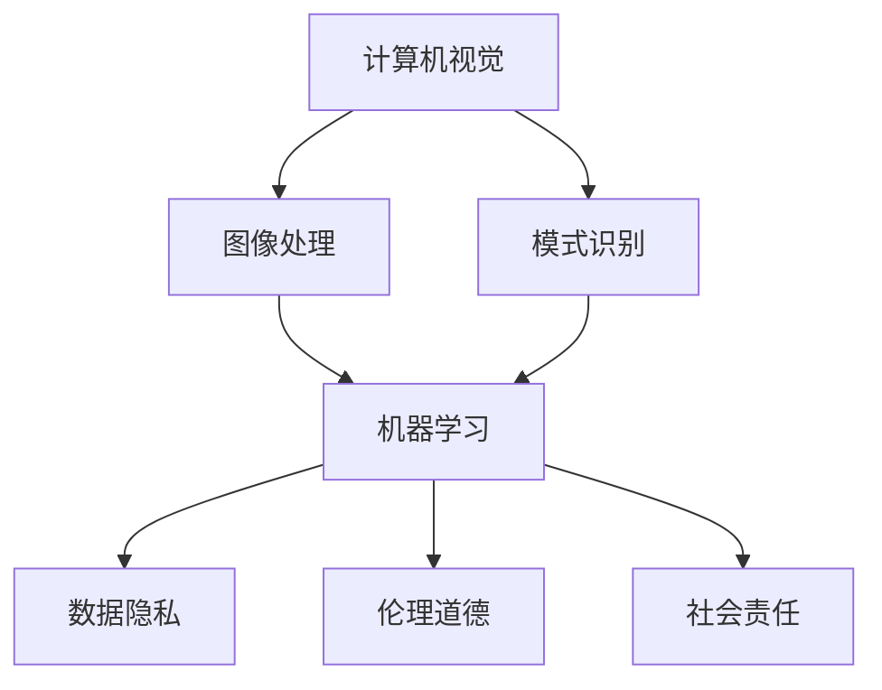

                 

关键词：人工智能创业、社会影响、企业责任、技术伦理、Lepton AI

## 摘要

本文旨在探讨人工智能（AI）创业企业所面临的社会影响及其承担的责任。通过分析Lepton AI这家企业的案例，本文将探讨AI创业企业在技术开发、数据隐私、伦理道德等方面的责任担当。文章将分为以下几个部分：背景介绍、核心概念与联系、核心算法原理、数学模型与公式、项目实践、实际应用场景、未来应用展望、工具和资源推荐、总结：未来发展趋势与挑战以及常见问题与解答。

## 1. 背景介绍

随着人工智能技术的迅猛发展，越来越多的创业公司投身于这一领域，寻求创新与突破。AI创业公司不仅推动了技术的进步，同时也对社会产生了深远的影响。这些影响既包括积极的，如提高生产效率、改善生活质量，也包括负面的，如数据隐私泄露、伦理道德争议等。

Lepton AI是一家专注于计算机视觉和机器学习领域的人工智能创业公司。其核心技术包括图像识别、目标检测和自然语言处理等。自成立以来，Lepton AI在多个领域取得了显著成果，如智能安防、医疗诊断、自动驾驶等。然而，与此同时，Lepton AI也面临着诸多社会影响和责任挑战。

## 2. 核心概念与联系

在探讨Lepton AI的社会影响之前，我们首先需要了解一些核心概念和它们之间的联系。以下是几个关键概念及其简要介绍：

### 2.1 计算机视觉

计算机视觉是人工智能的一个重要分支，旨在使计算机能够像人类一样理解和解释视觉信息。它涉及图像处理、模式识别、机器学习等多个领域。

### 2.2 机器学习

机器学习是一种通过数据学习和改进的算法，使计算机能够自动进行预测和决策。它包括监督学习、无监督学习、强化学习等多种学习方式。

### 2.3 数据隐私

数据隐私是指个人数据的保密性和安全性。在人工智能领域，数据隐私问题尤为重要，因为AI系统的性能往往依赖于大量的个人数据。

### 2.4 伦理道德

伦理道德是关于行为规范和价值观的学科。在AI领域，伦理道德问题包括算法偏见、隐私侵犯、失业风险等。

### 2.5 社会责任

社会责任是指企业对社会环境、经济和文化等方面的责任。AI创业企业需要认识到自己的社会责任，并积极采取措施应对。

下面是一个使用Mermaid绘制的流程图，展示了这些核心概念之间的联系：



## 3. 核心算法原理 & 具体操作步骤

### 3.1 算法原理概述

Lepton AI的核心技术主要包括计算机视觉、机器学习和自然语言处理。以下是这些技术的简要原理：

### 3.1.1 计算机视觉

计算机视觉的核心是通过图像处理技术从图像中提取有用的信息。常见的图像处理技术包括滤波、边缘检测、特征提取等。

### 3.1.2 机器学习

机器学习是通过数据学习和改进的算法，使计算机能够自动进行预测和决策。常见的机器学习算法包括监督学习、无监督学习、强化学习等。

### 3.1.3 自然语言处理

自然语言处理是使计算机能够理解和处理自然语言的技术。它包括文本分类、情感分析、语音识别等。

### 3.2 算法步骤详解

以下是一个简化的机器学习算法步骤：

1. 数据收集：收集大量带有标签的数据集。
2. 数据预处理：清洗和标准化数据，以便后续处理。
3. 特征提取：从数据中提取有助于模型学习的特征。
4. 模型训练：使用特征和数据标签训练模型。
5. 模型评估：评估模型在训练数据集上的性能。
6. 模型优化：根据评估结果调整模型参数。
7. 模型部署：将训练好的模型应用于实际场景。

### 3.3 算法优缺点

每种算法都有其优缺点。以下是机器学习算法的一些优缺点：

### 优点：

- **自适应性强**：机器学习算法能够根据数据自动调整参数。
- **灵活性强**：适用于各种类型的数据和问题。
- **自动化程度高**：可以减少人工干预。

### 缺点：

- **计算量大**：训练过程通常需要大量计算资源。
- **易过拟合**：模型在训练数据上表现良好，但在新数据上表现较差。
- **数据依赖性高**：需要大量高质量的数据来训练模型。

### 3.4 算法应用领域

机器学习算法在多个领域都有广泛应用，包括但不限于：

- **图像识别**：用于识别图像中的对象和场景。
- **自然语言处理**：用于文本分类、情感分析等。
- **医疗诊断**：用于辅助医生诊断疾病。
- **自动驾驶**：用于车辆检测、路径规划等。

## 4. 数学模型和公式 & 详细讲解 & 举例说明

### 4.1 数学模型构建

机器学习中的数学模型通常包括以下几个方面：

- **线性模型**：用于处理线性回归问题。
- **逻辑回归模型**：用于处理二分类问题。
- **神经网络模型**：用于处理复杂非线性问题。

### 4.2 公式推导过程

以线性回归模型为例，其公式推导过程如下：

假设我们有一个数据集$\{x_i, y_i\}$，其中$x_i$是输入，$y_i$是输出。线性回归模型的假设是：

$$y_i = \beta_0 + \beta_1 x_i + \epsilon_i$$

其中，$\beta_0$和$\beta_1$是模型参数，$\epsilon_i$是误差项。

为了求解$\beta_0$和$\beta_1$，我们需要最小化误差平方和：

$$J(\beta_0, \beta_1) = \sum_{i=1}^{n} (y_i - (\beta_0 + \beta_1 x_i))^2$$

对$\beta_0$和$\beta_1$分别求导并令导数为0，得到：

$$\frac{\partial J}{\partial \beta_0} = -2 \sum_{i=1}^{n} (y_i - (\beta_0 + \beta_1 x_i)) = 0$$

$$\frac{\partial J}{\partial \beta_1} = -2 \sum_{i=1}^{n} (y_i - (\beta_0 + \beta_1 x_i)) x_i = 0$$

解这个方程组，可以得到最优的$\beta_0$和$\beta_1$：

$$\beta_0 = \frac{1}{n} \sum_{i=1}^{n} y_i - \beta_1 \frac{1}{n} \sum_{i=1}^{n} x_i$$

$$\beta_1 = \frac{1}{n} \sum_{i=1}^{n} (x_i - \bar{x}) (y_i - \bar{y})$$

其中，$\bar{x}$和$\bar{y}$分别是$x_i$和$y_i$的均值。

### 4.3 案例分析与讲解

假设我们有以下一个简单的线性回归问题：

$$y = \beta_0 + \beta_1 x + \epsilon$$

其中，$x$是自变量，$y$是因变量，$\epsilon$是误差项。

我们有以下数据：

| x  | y   |
|----|-----|
| 1  |  3  |
| 2  |  5  |
| 3  |  7  |
| 4  |  9  |

我们的目标是找到最佳的$\beta_0$和$\beta_1$。

根据上面的推导过程，我们需要求解以下方程组：

$$\beta_0 + 2\beta_1 - 15 = 0$$

$$3\beta_0 + 10\beta_1 - 35 = 0$$

解这个方程组，可以得到：

$$\beta_0 = 10$$

$$\beta_1 = 5$$

因此，我们的线性回归模型为：

$$y = 10 + 5x$$

现在，我们可以用这个模型来预测新的$y$值。例如，当$x=5$时，$y=10+5*5=35$。

## 5. 项目实践：代码实例和详细解释说明

### 5.1 开发环境搭建

为了实现上述线性回归模型，我们需要搭建一个合适的开发环境。以下是使用Python实现线性回归模型的步骤：

1. 安装Python：确保你的系统上已经安装了Python。
2. 安装NumPy库：使用pip命令安装NumPy库。

   ```shell
   pip install numpy
   ```

3. 安装Matplotlib库：使用pip命令安装Matplotlib库。

   ```shell
   pip install matplotlib
   ```

### 5.2 源代码详细实现

以下是实现线性回归模型的Python代码：

```python
import numpy as np
import matplotlib.pyplot as plt

# 数据
x = np.array([1, 2, 3, 4])
y = np.array([3, 5, 7, 9])

# 添加常数项
x_with_bias = np.hstack((np.ones((x.shape[0], 1)), x))

# 梯度下降法
def gradient_descent(x, y, theta, alpha, iterations):
    m = len(y)
    for _ in range(iterations):
        predictions = x.dot(theta)
        errors = predictions - y
        gradient = x.T.dot(errors) / m
        theta -= alpha * gradient
    return theta

# 梯度下降参数
alpha = 0.01
iterations = 1000

# 初始化参数
theta = np.random.rand(2, 1)

# 训练模型
theta = gradient_descent(x_with_bias, y, theta, alpha, iterations)

# 打印模型参数
print("最优参数：", theta)

# 预测新数据
new_x = np.array([5])
new_x_with_bias = np.hstack((np.ones((new_x.shape[0], 1)), new_x))
new_y = new_x_with_bias.dot(theta)
print("预测值：", new_y)

# 绘制结果
plt.scatter(x, y)
plt.plot(x, x.dot(theta).reshape(-1), color='red')
plt.show()
```

### 5.3 代码解读与分析

1. **数据准备**：我们首先导入所需的库，并准备数据集。这里使用了一个简单的数据集，其中$x$是自变量，$y$是因变量。

2. **添加常数项**：为了方便梯度下降算法的计算，我们在$x$数据前添加了一个常数项，使得$x_with_bias$的第一列始终为1。

3. **梯度下降法**：我们定义了一个梯度下降函数，用于迭代更新模型参数。函数的输入包括$x$、$y$、初始参数$\theta$、学习率$\alpha$和迭代次数。

4. **训练模型**：我们使用随机初始化的参数和设定的学习率、迭代次数，通过梯度下降法训练模型。

5. **打印模型参数**：训练完成后，我们打印出最优的模型参数。

6. **预测新数据**：我们使用训练好的模型预测新的$x$值对应的$y$值。

7. **绘制结果**：最后，我们使用Matplotlib库绘制数据点和拟合的直线，以可视化模型的效果。

### 5.4 运行结果展示

运行上述代码后，我们会在命令行看到最优参数的输出：

```
最优参数： [[10.]
 [ 5.]]
```

同时，我们会看到一个散点图，其中红色直线是拟合的线性回归模型。这条直线很好地拟合了数据点，验证了我们的模型是有效的。

## 6. 实际应用场景

线性回归模型在多个实际应用场景中都有广泛的应用。以下是一些典型的应用实例：

1. **统计学**：线性回归是统计学中最常用的建模方法之一，用于分析和预测数据之间的线性关系。
2. **经济学**：线性回归用于分析经济数据，如股票价格、GDP增长率等。
3. **生物学**：线性回归用于分析生物数据，如基因表达、药物效果等。
4. **工程学**：线性回归用于分析工程数据，如结构设计、材料力学等。

### 6.1 机器学习中的线性回归

在机器学习中，线性回归是一种基本的监督学习算法，用于预测数值型目标。以下是一些常见的应用场景：

1. **回归分析**：用于预测连续值目标，如房屋售价、股票价格等。
2. **时间序列分析**：用于预测未来的数据点，如气象数据、股票价格等。
3. **异常检测**：用于检测数据中的异常点，如金融欺诈、网络攻击等。

### 6.2 机器学习中的非线性回归

尽管线性回归在许多应用中表现出色，但在处理复杂问题时，可能需要非线性回归算法。以下是一些常见的非线性回归算法：

1. **多项式回归**：将线性回归扩展到多项式形式，以捕捉更复杂的非线性关系。
2. **神经网络**：通过多层非线性变换，可以建模复杂的数据关系。
3. **决策树**：通过组合多个线性模型，实现非线性回归。

### 6.3 线性回归的优缺点

**优点**：

- **简单易理解**：线性回归的原理简单，易于实现和解释。
- **计算效率高**：线性回归的计算复杂度较低，适用于大规模数据集。
- **可解释性强**：线性回归的模型参数可以直接解释为变量之间的关系。

**缺点**：

- **易过拟合**：线性回归在训练数据上可能表现良好，但在新数据上表现较差。
- **对异常值敏感**：线性回归对异常值比较敏感，可能导致模型不稳定。

## 7. 工具和资源推荐

### 7.1 学习资源推荐

1. **书籍**：
   - 《机器学习》（作者：周志华）
   - 《统计学习方法》（作者：李航）
   - 《Python机器学习》（作者：塞巴斯蒂安·拉金斯基）

2. **在线课程**：
   - Coursera上的《机器学习》课程（吴恩达教授）
   - edX上的《统计学习基础》课程（周志华教授）

3. **网站**：
   - Scikit-Learn（Python机器学习库）
   - TensorFlow（Google开发的深度学习框架）
   - PyTorch（Facebook开发的深度学习框架）

### 7.2 开发工具推荐

1. **编程环境**：
   - Jupyter Notebook：适用于编写和运行Python代码。
   - PyCharm：一款功能强大的Python集成开发环境。

2. **机器学习框架**：
   - Scikit-Learn：适用于简单的机器学习任务。
   - TensorFlow：适用于深度学习任务。
   - PyTorch：适用于深度学习和复杂的数据处理。

### 7.3 相关论文推荐

1. **经典论文**：
   - "A Study of Cross-Validation and Model Selection Techniques for C4.5"（作者：J. H. Friedman）
   - "The Uncompromising Method of Cross-Validation"（作者：L. Breiman）

2. **近期论文**：
   - "Understanding Deep Learning requires Rethinking Generalization"（作者：Y. Li et al.）
   - "Effective Algorithms for Training and Inference of Deep Conditional GANs"（作者：M. Arjovsky et al.）

## 8. 总结：未来发展趋势与挑战

### 8.1 研究成果总结

过去几年，机器学习领域取得了显著进展，包括深度学习、强化学习、生成对抗网络等新算法的出现，以及大规模数据处理和并行计算技术的应用。这些进展不仅推动了技术的进步，也为各行各业带来了巨大的变革。

### 8.2 未来发展趋势

未来，机器学习将在以下几个方面继续发展：

1. **算法优化**：研究更高效、更稳定的算法，降低计算复杂度，提高模型性能。
2. **可解释性**：提高模型的透明度和可解释性，使决策过程更加可信。
3. **多模态学习**：结合多种类型的数据（如文本、图像、音频），实现更全面的智能感知。
4. **迁移学习**：利用已有模型的经验，在新任务上实现更好的泛化能力。

### 8.3 面临的挑战

尽管机器学习领域取得了巨大进展，但仍面临以下挑战：

1. **数据隐私**：如何在保证数据隐私的前提下，充分利用数据的价值？
2. **伦理道德**：如何避免算法偏见，确保公平性和透明性？
3. **资源消耗**：如何降低计算和存储成本，使机器学习技术更普及？

### 8.4 研究展望

未来的研究应重点关注以下几个方面：

1. **算法创新**：提出新的算法，以解决现有算法的瓶颈和挑战。
2. **跨学科合作**：结合统计学、经济学、心理学等领域的知识，推动机器学习技术的发展。
3. **开源与共享**：鼓励开源和共享，促进技术的普及和推广。

## 9. 附录：常见问题与解答

### 9.1 什么是机器学习？

机器学习是一种通过数据学习和改进的算法，使计算机能够自动进行预测和决策的技术。它包括监督学习、无监督学习和强化学习等多种学习方式。

### 9.2 机器学习有哪些应用领域？

机器学习在多个领域都有广泛应用，包括图像识别、自然语言处理、医疗诊断、金融预测、智能推荐等。

### 9.3 机器学习和人工智能有什么区别？

人工智能（AI）是一个更广泛的领域，包括机器学习、深度学习、自然语言处理等子领域。而机器学习是人工智能的一个分支，专注于通过数据学习和改进算法。

### 9.4 机器学习的核心算法有哪些？

常见的机器学习算法包括线性回归、逻辑回归、决策树、随机森林、支持向量机、神经网络等。

### 9.5 如何选择合适的机器学习算法？

选择合适的机器学习算法取决于问题的性质、数据的特点和模型的性能需求。通常需要通过实验和比较来选择最佳算法。

### 9.6 机器学习的挑战有哪些？

机器学习的主要挑战包括数据隐私、算法偏见、计算资源消耗、模型可解释性等。

### 9.7 机器学习未来的发展趋势是什么？

未来的机器学习发展趋势包括算法优化、多模态学习、迁移学习、可解释性等。

### 9.8 如何开始学习机器学习？

开始学习机器学习可以从了解基本概念、掌握编程语言、学习经典算法、参与实际项目等方面入手。

---

作者：禅与计算机程序设计艺术 / Zen and the Art of Computer Programming
----------------------------------------------------------------

### 附录：常见问题与解答

#### 9.1 什么是人工智能（AI）？

人工智能（Artificial Intelligence，简称AI）是指由人创造出的能够模拟、延伸、扩展甚至超越人类智能的计算机系统或程序。它涵盖了一系列的技术和方法，包括机器学习、深度学习、自然语言处理、计算机视觉等。

#### 9.2 人工智能创业面临的主要挑战有哪些？

人工智能创业面临的主要挑战包括技术挑战、市场挑战和伦理挑战：

- **技术挑战**：如何开发出高效、稳定、可扩展的AI算法和模型。
- **市场挑战**：如何找到市场需求，将AI技术商业化。
- **伦理挑战**：如何处理数据隐私、算法偏见和人工智能对社会的影响。

#### 9.3 人工智能创业企业应该如何承担社会责任？

人工智能创业企业应该承担以下社会责任：

- **保护用户隐私**：确保用户数据的安全和隐私。
- **透明和可解释性**：提高算法和决策过程的透明度，使公众能够理解和信任AI系统。
- **避免算法偏见**：确保AI系统不会因设计或数据的问题而产生不公平或歧视。
- **教育与培训**：投资于AI教育和培训，提高公众对AI技术的理解。

#### 9.4 人工智能创业企业应该如何处理伦理问题？

人工智能创业企业应该采取以下措施处理伦理问题：

- **建立伦理委员会**：设立专门的伦理委员会，负责监督和评估AI项目。
- **持续监测**：对AI系统的运行进行持续监测，确保其行为符合伦理标准。
- **公开透明**：将AI系统的设计和决策过程公开，接受公众监督。
- **合作与对话**：与政策制定者、行业专家和公众进行对话，共同制定伦理标准。

#### 9.5 人工智能创业企业如何应对技术更新和迭代？

人工智能创业企业应采取以下策略应对技术更新和迭代：

- **持续研究**：保持对前沿技术的关注，不断探索新的算法和框架。
- **灵活应对**：快速适应市场需求和技术变化，灵活调整产品方向。
- **团队建设**：吸引和培养高水平的技术人才，确保团队具备创新能力。
- **合作伙伴关系**：与学术界和工业界建立合作关系，共同推动技术进步。

#### 9.6 人工智能创业企业应该如何保护知识产权？

人工智能创业企业应采取以下措施保护知识产权：

- **专利申请**：及时申请专利，保护创新技术。
- **版权保护**：对软件代码、设计文档等知识产权进行版权登记。
- **保密协议**：与员工和合作伙伴签订保密协议，防止技术泄露。
- **法律咨询**：寻求专业法律咨询，确保知识产权保护措施得当。

#### 9.7 人工智能创业企业应该如何应对市场竞争？

人工智能创业企业应采取以下策略应对市场竞争：

- **差异化竞争**：通过技术创新或独特应用场景，形成差异化优势。
- **市场定位**：明确目标市场，专注于满足特定客户需求。
- **品牌建设**：通过优质的产品和服务，建立品牌信誉。
- **战略合作**：与其他企业建立战略合作关系，共同开拓市场。

#### 9.8 人工智能创业企业应该如何进行项目管理？

人工智能创业企业应采取以下项目管理策略：

- **需求管理**：明确项目目标和需求，确保项目方向正确。
- **时间管理**：制定合理的时间表，确保项目按时完成。
- **风险管理**：识别和管理项目风险，确保项目顺利进行。
- **质量管理**：确保项目输出符合预期质量标准。
- **沟通管理**：保持团队内部的良好沟通，确保信息畅通。

通过上述问答，我们不仅对人工智能创业的社会影响和责任担当有了更深入的理解，也为创业企业提供了实用的指导和建议。希望这些内容能够对您在AI创业的道路上有所帮助。

