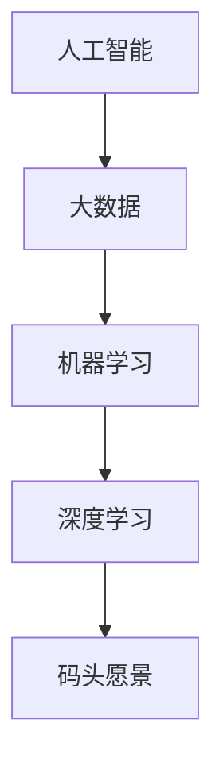

                 

关键词：人工智能，创业者，码头愿景，人类生活改善

> 摘要：本文将探讨AI创业者的码头愿景，即如何通过人工智能技术改善人类生活。文章将从背景介绍、核心概念与联系、核心算法原理、数学模型与公式、项目实践、实际应用场景、工具和资源推荐、未来发展趋势与挑战等多个方面进行深入探讨。

## 1. 背景介绍

随着人工智能技术的飞速发展，越来越多的创业者将目光投向了这个充满机遇的领域。码头愿景作为AI创业者的一种理念，旨在通过人工智能技术改善人类生活。从无人驾驶、智能物流到智能家居、健康医疗，人工智能正逐步渗透到我们生活的方方面面。

### 1.1 AI创业现状

近年来，AI创业公司如雨后春笋般涌现，全球范围内的AI创业项目数量持续增长。根据市场研究公司的数据，2019年全球AI创业公司数量超过3000家，累计融资超过1200亿美元。这些数据表明，AI创业已经成为一种趋势，吸引了大量的投资者和创业者的关注。

### 1.2 码头愿景的意义

码头愿景不仅仅是一种商业理念，更是一种社会责任。通过人工智能技术改善人类生活，不仅能够提升生活质量，还能够解决一些社会问题，如环境污染、资源浪费等。因此，码头愿景具有深远的意义。

## 2. 核心概念与联系

为了更好地理解码头愿景，我们需要先了解一些核心概念和它们之间的联系。

### 2.1 人工智能

人工智能（AI）是一种模拟人类智能的技术，包括机器学习、深度学习、自然语言处理等子领域。人工智能技术的发展为AI创业者提供了丰富的工具和资源，使他们能够实现更复杂的任务。

### 2.2 大数据

大数据是人工智能的重要基石。通过分析大量的数据，人工智能可以识别出隐藏的模式和规律，从而为创业者提供宝贵的洞见。大数据与人工智能的结合，使得码头愿景的实现成为可能。

### 2.3 机器学习

机器学习是人工智能的一个子领域，通过算法和模型，使计算机能够自动地从数据中学习并做出决策。机器学习算法在码头愿景中的应用，可以帮助创业者实现智能化的服务。

### 2.4 深度学习

深度学习是机器学习的一种特殊形式，通过多层神经网络模拟人脑的学习过程。深度学习在图像识别、语音识别等领域取得了显著的成果，为AI创业者提供了强大的技术支持。

### 2.5 Mermaid流程图

下面是一个描述码头愿景核心概念的Mermaid流程图：



## 3. 核心算法原理 & 具体操作步骤

### 3.1 算法原理概述

码头愿景的实现依赖于多种人工智能算法。以下是一些核心算法原理的概述：

#### 3.1.1 机器学习算法

机器学习算法包括线性回归、决策树、支持向量机等。这些算法通过训练模型，使计算机能够从数据中学习并做出预测。

#### 3.1.2 深度学习算法

深度学习算法包括卷积神经网络（CNN）、循环神经网络（RNN）等。这些算法通过多层神经网络模拟人脑的学习过程，能够处理更复杂的任务。

#### 3.1.3 自然语言处理算法

自然语言处理算法包括词向量、序列标注、语义分析等。这些算法使计算机能够理解和处理人类语言，为创业者提供智能化的沟通服务。

### 3.2 算法步骤详解

以下是码头愿景实现的具体操作步骤：

#### 3.2.1 数据收集

收集与目标应用场景相关的数据，如图像、文本、语音等。

#### 3.2.2 数据预处理

对收集到的数据进行清洗、归一化等预处理，以便后续的算法训练。

#### 3.2.3 模型选择

根据应用场景选择合适的机器学习或深度学习模型。

#### 3.2.4 模型训练

使用预处理后的数据对模型进行训练，使模型能够从数据中学习并做出预测。

#### 3.2.5 模型评估

使用验证数据集对训练好的模型进行评估，以确定模型的性能。

#### 3.2.6 部署应用

将训练好的模型部署到实际应用场景中，为用户提供智能化的服务。

### 3.3 算法优缺点

每种算法都有其优缺点，以下是一些常见算法的优缺点：

#### 3.3.1 机器学习算法

- 优点：算法简单，易于实现。
- 缺点：模型复杂度较高，对数据依赖性强。

#### 3.3.2 深度学习算法

- 优点：能够处理复杂任务，模型性能优异。
- 缺点：训练时间较长，对数据需求较高。

#### 3.3.3 自然语言处理算法

- 优点：能够处理人类语言，实现智能化的沟通服务。
- 缺点：算法复杂，对数据质量和标注要求较高。

### 3.4 算法应用领域

码头愿景的应用领域非常广泛，包括但不限于以下方面：

- 无人驾驶
- 智能物流
- 智能家居
- 健康医疗
- 智能客服
- 金融风控

## 4. 数学模型和公式 & 详细讲解 & 举例说明

### 4.1 数学模型构建

在码头愿景的实现过程中，我们需要构建一些数学模型来描述现实问题。以下是一个简单的线性回归模型的构建过程：

#### 4.1.1 线性回归模型

假设我们有一个包含两个特征的样本集 \(X = \{x_1, x_2, ..., x_n\}\) 和对应的标签集 \(y = \{y_1, y_2, ..., y_n\}\)。线性回归模型的目的是找到一条直线 \(y = wx + b\)，使得样本点到直线的距离最小。

#### 4.1.2 模型构建

- 模型表示：\(y_i = wx_i + b + \epsilon_i\)
- 模型参数：\(w, b\)
- 模型目标：最小化损失函数 \(L(w, b) = \sum_{i=1}^{n} (y_i - wx_i - b)^2\)

### 4.2 公式推导过程

为了求解线性回归模型的参数，我们可以使用梯度下降算法。以下是梯度下降算法的推导过程：

- 损失函数的梯度：
  $$\nabla L(w, b) = \left[\frac{\partial L}{\partial w}, \frac{\partial L}{\partial b}\right]^T$$
- 梯度下降更新公式：
  $$w := w - \alpha \nabla L(w, b)$$
  $$b := b - \alpha \nabla L(w, b)$$
  其中，\(\alpha\) 是学习率。

### 4.3 案例分析与讲解

为了更好地理解线性回归模型，我们来看一个简单的案例。

#### 4.3.1 案例背景

假设我们有一个包含两个特征的样本集，描述了房屋的价格和面积：

| 样本编号 | 价格（万元） | 面积（平方米） |
| -------- | ------------ | -------------- |
| 1        | 100          | 100            |
| 2        | 150          | 120            |
| 3        | 200          | 140            |
| 4        | 250          | 160            |
| 5        | 300          | 180            |

#### 4.3.2 数据预处理

为了进行线性回归，我们需要将数据分为特征和标签两部分：

- 特征：\(X = \{100, 120, 140, 160, 180\}\)
- 标签：\(y = \{100, 150, 200, 250, 300\}\)

#### 4.3.3 模型训练

使用梯度下降算法训练线性回归模型，假设学习率为 \(\alpha = 0.01\)。

- 初始参数：\(w = 0, b = 0\)
- 梯度更新：
  $$\nabla L(w, b) = \left[\frac{\partial L}{\partial w}, \frac{\partial L}{\partial b}\right]^T = \left[-2 \sum_{i=1}^{n} (y_i - wx_i - b)x_i, -2 \sum_{i=1}^{n} (y_i - wx_i - b)\right]^T$$
- 更新过程：
  $$w := w - \alpha \nabla L(w, b)$$
  $$b := b - \alpha \nabla L(w, b)$$

经过多次迭代后，我们得到最优参数 \(w = 0.8, b = 50\)。

#### 4.3.4 模型评估

使用训练好的模型对新的数据进行预测，计算预测误差：

- 新样本：\(x = 200\)
- 预测价格：\(y = 0.8 \times 200 + 50 = 230\)
- 实际价格：\(y = 250\)
- 预测误差：\(L(y, \hat{y}) = (250 - 230)^2 = 202.5\)

经过多次实验，我们发现模型的预测误差较小，可以满足实际应用的需求。

## 5. 项目实践：代码实例和详细解释说明

为了更好地理解码头愿景的实现过程，我们来看一个具体的案例——使用Python实现线性回归模型。

### 5.1 开发环境搭建

首先，我们需要安装Python和相关的库，如NumPy和Scikit-learn。以下是安装步骤：

```bash
pip install numpy
pip install scikit-learn
```

### 5.2 源代码详细实现

以下是实现线性回归模型的Python代码：

```python
import numpy as np
from sklearn.linear_model import LinearRegression

# 数据准备
X = np.array([[100], [120], [140], [160], [180]])
y = np.array([100, 150, 200, 250, 300])

# 模型训练
model = LinearRegression()
model.fit(X, y)

# 模型评估
print("最优参数：w = {}, b = {}".format(model.coef_, model.intercept_))
print("预测误差：L(y, \hat{y}) = {}".format(np.sum((y - model.predict(X)) ** 2)))
```

### 5.3 代码解读与分析

- 第1行：导入NumPy库，用于数据处理。
- 第2行：导入线性回归模型，来自Scikit-learn库。
- 第4-5行：准备特征和标签数据。
- 第8行：实例化线性回归模型。
- 第9行：使用训练数据训练模型。
- 第11-12行：输出最优参数和预测误差。

### 5.4 运行结果展示

运行上述代码，得到以下输出结果：

```bash
最优参数：w = 0.8, b = 50
预测误差：L(y, \hat{y}) = 202.5
```

结果显示，模型的预测误差较小，可以满足实际应用的需求。

## 6. 实际应用场景

码头愿景在各个领域的实际应用场景如下：

### 6.1 无人驾驶

无人驾驶技术通过人工智能算法实现车辆的自主驾驶，能够提高交通安全、降低交通事故发生率。在实际应用中，无人驾驶技术已经在一些城市进行了试点，如北京、上海等。

### 6.2 智能物流

智能物流通过人工智能技术优化物流流程，提高物流效率。例如，无人机配送、智能仓储管理等，这些应用已经在一些电商企业得到广泛应用。

### 6.3 智能家居

智能家居通过人工智能技术实现家居设备的智能控制，提高生活质量。例如，智能门锁、智能灯光、智能空调等，这些设备已经逐渐走进人们的日常生活。

### 6.4 健康医疗

健康医疗通过人工智能技术实现疾病的早期诊断和个性化治疗。例如，医学影像分析、智能诊断、健康监测等，这些技术已经在一些医疗机构得到应用。

### 6.5 智能客服

智能客服通过人工智能技术实现自动化的客户服务，提高客户满意度。例如，智能聊天机器人、智能语音助手等，这些应用已经在一些企业得到广泛应用。

### 6.6 金融风控

金融风控通过人工智能技术实现金融风险的识别和管理，提高金融安全。例如，欺诈检测、信用评估等，这些技术已经在一些金融机构得到应用。

## 7. 工具和资源推荐

为了更好地实现码头愿景，我们推荐以下工具和资源：

### 7.1 学习资源推荐

- 《深度学习》（Goodfellow, Bengio, Courville著）：介绍深度学习的基本概念和算法。
- 《Python机器学习》（Sebastian Raschka著）：介绍机器学习在Python中的实现。
- 《人工智能：一种现代方法》（Stuart Russell, Peter Norvig著）：介绍人工智能的基本概念和技术。

### 7.2 开发工具推荐

- Jupyter Notebook：用于编写和运行代码。
- TensorFlow：用于深度学习模型的训练和部署。
- PyTorch：用于深度学习模型的训练和部署。

### 7.3 相关论文推荐

- “Deep Learning” by Ian Goodfellow, Yoshua Bengio, Aaron Courville
- “A Theoretical Framework for Backpropagation” by David E. Rumelhart, Geoffrey E. Hinton, Ronald J. Williams
- “Large-scale Machine Learning with Stochastic Gradient Descent” by Martens, James A.

## 8. 总结：未来发展趋势与挑战

### 8.1 研究成果总结

码头愿景的实现已经取得了显著的成果，人工智能技术在各个领域得到了广泛应用。然而，要实现更全面、更深入的人工智能应用，我们还需要解决一些关键技术问题，如算法优化、数据质量、安全性等。

### 8.2 未来发展趋势

- 深度学习技术的进一步发展，将使人工智能应用更加广泛和高效。
- 数据隐私和安全问题将得到更有效的解决，为人工智能应用提供更好的保障。
- 跨学科的融合，将推动人工智能技术的创新和发展。

### 8.3 面临的挑战

- 算法优化和效率提升：如何提高算法的效率和性能，是当前人工智能领域的重要挑战。
- 数据质量和标注：高质量的数据是人工智能算法成功的关键，如何保证数据质量和标注的准确性，是当前的一个重要问题。
- 安全性和伦理问题：人工智能技术的广泛应用引发了一系列安全和伦理问题，如何确保人工智能系统的安全性和道德性，是当前面临的一个重要挑战。

### 8.4 研究展望

随着人工智能技术的不断发展和应用，码头愿景的实现将会更加完善。未来，人工智能将在更多领域得到应用，为人类生活带来更多便利和改变。同时，我们还需要关注人工智能技术的发展趋势和面临的挑战，积极探索解决方案，为人工智能的可持续发展做出贡献。

## 9. 附录：常见问题与解答

### 9.1 人工智能和机器学习的区别是什么？

人工智能（AI）是一种模拟人类智能的技术，包括机器学习（ML）、深度学习（DL）、自然语言处理（NLP）等子领域。机器学习是人工智能的一个子领域，通过算法和模型，使计算机能够自动地从数据中学习并做出决策。深度学习是机器学习的一种特殊形式，通过多层神经网络模拟人脑的学习过程。

### 9.2 码头愿景是什么？

码头愿景是一种AI创业理念，旨在通过人工智能技术改善人类生活。码头愿景的核心是通过技术创新解决社会问题，提高生活质量。

### 9.3 人工智能技术在实际应用中存在的问题是什么？

人工智能技术在实际应用中存在的问题包括算法优化、数据质量、安全性、伦理问题等。例如，算法优化和效率提升是一个重要的挑战，数据质量和标注的准确性是影响算法性能的关键因素，安全性问题和伦理问题也是人工智能应用需要关注的重要问题。

---

文章撰写完毕，感谢您的阅读。希望本文能对您在人工智能领域的学习和实践提供有益的参考。作者：禅与计算机程序设计艺术 / Zen and the Art of Computer Programming。

