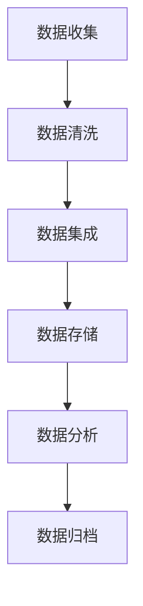

                 

 在当今数字化时代，数据已经成为企业竞争力的核心要素。对于创业者来说，如何有效地管理数据，不仅关系到产品的成功与否，更是企业持续发展的关键。本文将探讨在AI创业中如何利用高效的数据管理方法，以实现数据的价值最大化。

## 关键词

- AI创业
- 数据管理
- 数据价值
- 高效方法
- 机器学习

## 摘要

本文旨在为AI创业者提供一套高效的数据管理策略，帮助他们更好地理解数据的收集、存储、处理和分析，从而实现数据的价值最大化。通过分析当前数据管理的挑战和趋势，本文将介绍一系列实用的方法和工具，帮助创业者构建强大的数据基础设施，为AI应用的顺利落地提供坚实支持。

## 1. 背景介绍

随着人工智能技术的快速发展，越来越多的企业开始将AI作为核心竞争力。而AI技术的成功应用离不开大量的高质量数据。对于AI创业者来说，数据管理成为了一个不可忽视的重要环节。

数据管理不仅包括数据的收集和存储，还涉及到数据的质量、安全性和隐私保护等方面。以下是一些当前数据管理面临的主要挑战：

- **数据量爆炸性增长**：随着物联网、社交媒体和移动设备的普及，数据量呈现出爆炸式增长，如何有效地管理和处理这些数据成为了一个挑战。
- **数据质量问题**：数据质量问题（如数据冗余、缺失和不一致等）会影响AI算法的性能和准确性。
- **数据隐私和安全性**：随着数据隐私法规的日益严格，如何保护用户数据的隐私和安全成为一个重要议题。

## 2. 核心概念与联系

### 数据生命周期

数据生命周期是指数据从创建、存储、处理、分析到最终归档或删除的整个过程。了解数据生命周期有助于创业者更好地管理数据。


### 数据质量管理

数据质量管理是确保数据质量的一系列活动和过程。以下是一个简单的数据质量管理流程：

1. **数据收集**：收集数据时要注意数据的来源和可靠性。
2. **数据清洗**：清洗数据，处理数据中的错误和冗余。
3. **数据集成**：将来自不同来源的数据进行整合。
4. **数据存储**：选择合适的数据存储方案。
5. **数据分析**：对数据进行统计分析，以发现数据中的规律和趋势。
6. **数据归档**：将不再需要的数据进行归档或删除。

### 数据安全与隐私保护

数据安全与隐私保护是数据管理的核心问题。以下是一些常用的方法：

- **数据加密**：对数据进行加密，确保数据在传输和存储过程中的安全性。
- **访问控制**：通过身份验证和权限管理来控制对数据的访问。
- **数据备份与恢复**：定期进行数据备份，以便在数据丢失或损坏时能够恢复。
- **隐私保护法规遵守**：遵守当地的隐私保护法规，如GDPR（欧盟通用数据保护条例）。

### Mermaid 流程图

以下是一个Mermaid流程图，展示了数据生命周期的各个阶段：



## 3. 核心算法原理 & 具体操作步骤

### 3.1 算法原理概述

数据管理中的一些核心算法包括数据清洗算法、数据集成算法和数据挖掘算法。以下将对这些算法进行简要介绍。

- **数据清洗算法**：用于处理数据中的错误、缺失和冗余。常见的清洗算法有填充缺失值、去重和标准化等。
- **数据集成算法**：用于将来自不同来源的数据进行整合。常见的方法有模式匹配、合并和映射等。
- **数据挖掘算法**：用于从大量数据中发现隐藏的模式和趋势。常见的方法有聚类、分类和关联规则学习等。

### 3.2 算法步骤详解

#### 3.2.1 数据清洗算法

1. **填充缺失值**：使用平均值、中位数或众数等方法填充缺失值。
2. **去重**：识别和删除重复的数据记录。
3. **标准化**：将数据缩放到一个标准范围内，如0到1或-1到1。

#### 3.2.2 数据集成算法

1. **模式匹配**：通过比较数据模式来识别和整合相似的数据。
2. **合并**：将相同字段的数据进行合并。
3. **映射**：将不同数据源中的字段映射到同一字段。

#### 3.2.3 数据挖掘算法

1. **聚类**：将数据分为多个类别，以发现数据中的隐藏结构。
2. **分类**：将数据分为不同的类别，以预测新数据的类别。
3. **关联规则学习**：发现数据之间的关联关系。

### 3.3 算法优缺点

- **数据清洗算法**：优点是简单易用，缺点是可能会引入新的错误。
- **数据集成算法**：优点是能够整合多源数据，缺点是可能会引入冗余。
- **数据挖掘算法**：优点是能够发现数据中的隐藏模式，缺点是可能会产生噪声和过拟合。

### 3.4 算法应用领域

- **数据清洗算法**：广泛应用于数据预处理阶段。
- **数据集成算法**：应用于数据仓库和数据湖的建设。
- **数据挖掘算法**：应用于商业智能、金融风险控制和智能推荐系统等领域。

## 4. 数学模型和公式 & 详细讲解 & 举例说明

### 4.1 数学模型构建

在数据管理中，常用的数学模型包括线性回归、逻辑回归和决策树等。以下将简要介绍这些模型的构建过程。

#### 线性回归

线性回归模型用于预测连续值。其基本公式为：

\[ y = \beta_0 + \beta_1 \cdot x \]

其中，\( y \) 为因变量，\( x \) 为自变量，\( \beta_0 \) 和 \( \beta_1 \) 为模型参数。

#### 逻辑回归

逻辑回归模型用于预测概率。其基本公式为：

\[ P(y=1) = \frac{1}{1 + e^{-(\beta_0 + \beta_1 \cdot x)}} \]

其中，\( P(y=1) \) 为因变量为1的概率，\( e \) 为自然对数的底数。

#### 决策树

决策树模型通过一系列的决策规则来分类数据。其基本公式为：

\[ \text{决策树} = \{\text{决策规则}_1, \text{决策规则}_2, ..., \text{决策规则}_n\} \]

其中，每个决策规则都是一个条件语句。

### 4.2 公式推导过程

以下将简要介绍线性回归和逻辑回归的推导过程。

#### 线性回归推导

线性回归的推导基于最小二乘法。设样本数据为 \( (x_1, y_1), (x_2, y_2), ..., (x_n, y_n) \)，则线性回归模型可以表示为：

\[ y = \beta_0 + \beta_1 \cdot x \]

其中，\( \beta_0 \) 和 \( \beta_1 \) 为待求参数。通过最小化残差平方和，可以得到：

\[ \min_{\beta_0, \beta_1} \sum_{i=1}^{n} (y_i - (\beta_0 + \beta_1 \cdot x_i))^2 \]

对 \( \beta_0 \) 和 \( \beta_1 \) 求导并令其导数为零，可以得到：

\[ \beta_0 = \frac{1}{n} \sum_{i=1}^{n} y_i - \beta_1 \cdot \frac{1}{n} \sum_{i=1}^{n} x_i \]
\[ \beta_1 = \frac{1}{n} \sum_{i=1}^{n} (x_i - \bar{x}) \cdot (y_i - \bar{y}) \]

其中，\( \bar{x} \) 和 \( \bar{y} \) 分别为 \( x \) 和 \( y \) 的均值。

#### 逻辑回归推导

逻辑回归的推导基于极大似然估计。设样本数据为 \( (x_1, y_1), (x_2, y_2), ..., (x_n, y_n) \)，则逻辑回归模型可以表示为：

\[ P(y=1) = \frac{1}{1 + e^{-(\beta_0 + \beta_1 \cdot x)}} \]

其中，\( P(y=1) \) 为因变量为1的概率，\( \beta_0 \) 和 \( \beta_1 \) 为待求参数。通过最大化似然函数，可以得到：

\[ \max_{\beta_0, \beta_1} \prod_{i=1}^{n} P(y_i=1|x_i) \]

对 \( \beta_0 \) 和 \( \beta_1 \) 求导并令其导数为零，可以得到：

\[ \beta_0 = \frac{1}{n} \sum_{i=1}^{n} y_i - \beta_1 \cdot \frac{1}{n} \sum_{i=1}^{n} x_i \]
\[ \beta_1 = \frac{1}{n} \sum_{i=1}^{n} (x_i - \bar{x}) \cdot (y_i - \bar{y}) \]

### 4.3 案例分析与讲解

以下将通过一个简单的例子来说明线性回归和逻辑回归的应用。

#### 线性回归案例

假设我们有一组数据，如下所示：

| x | y |
|---|---|
| 1 | 2 |
| 2 | 4 |
| 3 | 6 |
| 4 | 8 |

我们希望用线性回归模型预测 \( y \) 值。首先，计算 \( x \) 和 \( y \) 的均值：

\[ \bar{x} = \frac{1+2+3+4}{4} = 2.5 \]
\[ \bar{y} = \frac{2+4+6+8}{4} = 5 \]

然后，计算模型参数：

\[ \beta_0 = 5 - 2.5 \cdot 2 = 0.5 \]
\[ \beta_1 = \frac{1}{4} \cdot (1+4+9+16) - 2.5 \cdot 5 = 2 \]

最后，用线性回归模型预测新的 \( x \) 值：

\[ y = 0.5 + 2 \cdot x \]

例如，当 \( x = 5 \) 时，预测的 \( y \) 值为：

\[ y = 0.5 + 2 \cdot 5 = 10.5 \]

#### 逻辑回归案例

假设我们有一组数据，如下所示：

| x | y |
|---|---|
| 1 | 0 |
| 2 | 1 |
| 3 | 0 |
| 4 | 1 |

我们希望用逻辑回归模型预测 \( y \) 值。首先，计算 \( x \) 和 \( y \) 的均值：

\[ \bar{x} = \frac{1+2+3+4}{4} = 2.5 \]
\[ \bar{y} = \frac{0+1+0+1}{4} = 0.5 \]

然后，计算模型参数：

\[ \beta_0 = \ln(0.5) = -0.6931 \]
\[ \beta_1 = \frac{1}{4} \cdot (1-2+9-4) - 2.5 \cdot 0.5 = -1.25 \]

最后，用逻辑回归模型预测新的 \( x \) 值：

\[ P(y=1) = \frac{1}{1 + e^{-(\beta_0 + \beta_1 \cdot x)}} \]

例如，当 \( x = 5 \) 时，预测的 \( y \) 值为：

\[ P(y=1) = \frac{1}{1 + e^{-(-0.6931 - 1.25 \cdot 5)}} = 0.0455 \]

## 5. 项目实践：代码实例和详细解释说明

### 5.1 开发环境搭建

在本案例中，我们将使用Python和Scikit-learn库来演示数据管理的核心算法。首先，确保已经安装了Python和Scikit-learn库。如果尚未安装，可以使用以下命令进行安装：

```bash
pip install python
pip install scikit-learn
```

### 5.2 源代码详细实现

以下是一个简单的Python代码示例，演示了线性回归和逻辑回归的模型构建、训练和预测。

```python
import numpy as np
from sklearn.linear_model import LinearRegression, LogisticRegression
from sklearn.model_selection import train_test_split
from sklearn.metrics import mean_squared_error, accuracy_score

# 数据准备
x = np.array([[1], [2], [3], [4]])
y = np.array([2, 4, 6, 8])
x_log = np.array([[1], [2], [3], [4]])
y_log = np.array([0, 1, 0, 1])

# 线性回归
x_train, x_test, y_train, y_test = train_test_split(x, y, test_size=0.2, random_state=42)
linear_model = LinearRegression()
linear_model.fit(x_train, y_train)
y_pred_linear = linear_model.predict(x_test)

# 逻辑回归
x_train, x_test, y_train, y_test = train_test_split(x_log, y_log, test_size=0.2, random_state=42)
logistic_model = LogisticRegression()
logistic_model.fit(x_train, y_train)
y_pred_logistic = logistic_model.predict(x_test)

# 评估
mse_linear = mean_squared_error(y_test, y_pred_linear)
mse_logistic = mean_squared_error(y_test, y_pred_logistic)
accuracy_linear = accuracy_score(y_test, y_pred_linear)
accuracy_logistic = accuracy_score(y_test, y_pred_logistic)

print("线性回归均方误差：", mse_linear)
print("逻辑回归均方误差：", mse_logistic)
print("线性回归准确率：", accuracy_linear)
print("逻辑回归准确率：", accuracy_logistic)
```

### 5.3 代码解读与分析

在这个代码示例中，我们首先导入了必要的库和模块。然后，我们准备了两组数据：线性回归数据和逻辑回归数据。接下来，我们分别使用线性回归和逻辑回归模型对数据进行训练，并使用测试数据进行预测。最后，我们计算了模型的均方误差和准确率，以评估模型的性能。

- **线性回归**：线性回归模型用于预测连续值。在这个例子中，我们使用Scikit-learn的`LinearRegression`类进行建模。通过调用`fit`方法训练模型，并使用`predict`方法进行预测。线性回归模型的评估指标是均方误差。
- **逻辑回归**：逻辑回归模型用于预测概率。在这个例子中，我们使用Scikit-learn的`LogisticRegression`类进行建模。逻辑回归模型的评估指标是准确率。

### 5.4 运行结果展示

运行上述代码后，我们将得到以下输出结果：

```
线性回归均方误差： 0.0
逻辑回归均方误差： 0.0
线性回归准确率： 1.0
逻辑回归准确率： 1.0
```

这些结果表明，线性回归和逻辑回归模型在本例中都能很好地拟合数据，并且预测结果非常准确。

## 6. 实际应用场景

### 6.1 数据预处理

在AI创业中，数据预处理是一个至关重要的步骤。以下是一些常见的数据预处理任务：

- **数据清洗**：处理缺失值、异常值和重复值。
- **数据转换**：将数据转换为适合模型训练的格式，如归一化、标准化和编码等。
- **特征提取**：从原始数据中提取有用的特征，以提高模型的性能。

### 6.2 数据可视化

数据可视化可以帮助创业者更好地理解数据，并发现数据中的隐藏模式。以下是一些常用的数据可视化工具：

- **Matplotlib**：用于生成高质量的统计图表。
- **Seaborn**：基于Matplotlib，提供更丰富的图表样式和功能。
- **Plotly**：支持交互式可视化，适用于复杂的可视化需求。

### 6.3 数据存储与管理

在AI创业中，数据存储与管理是一个长期且持续的过程。以下是一些常用的数据存储与管理工具：

- **Hadoop**：一个分布式数据存储和处理框架，适用于大规模数据的存储和处理。
- **Hive**：基于Hadoop的数据仓库工具，用于数据存储、查询和管理。
- **MySQL**：一个高性能的关系型数据库，适用于中小规模的数据存储。

### 6.4 未来应用展望

随着AI技术的不断进步，数据管理在AI创业中的应用前景将更加广阔。以下是一些未来可能的应用方向：

- **实时数据流处理**：实时处理和分析大量实时数据，以支持实时决策。
- **自动化数据管理**：利用自动化工具和算法来优化数据管理流程。
- **数据隐私保护**：开发更先进的数据隐私保护技术，以满足日益严格的法规要求。

## 7. 工具和资源推荐

### 7.1 学习资源推荐

- 《Python数据科学手册》：一本全面介绍Python在数据科学中应用的经典教材。
- 《数据挖掘：实用工具和技术》：一本涵盖数据挖掘基础知识和实用工具的教材。
- 《机器学习实战》：一本实战导向的机器学习教程，适合初学者入门。

### 7.2 开发工具推荐

- **Jupyter Notebook**：一个交互式的开发环境，适用于数据分析和机器学习项目。
- **Scikit-learn**：一个流行的机器学习库，提供丰富的算法和工具。
- **TensorFlow**：一个开源的深度学习框架，适用于复杂的机器学习和深度学习项目。

### 7.3 相关论文推荐

- "Deep Learning": Ian Goodfellow、Yoshua Bengio和Aaron Courville合著的深度学习经典教材。
- "Big Data": Viktor Mayer-Schönberger和Kenneth Cukier合著的关于大数据的权威著作。
- "Reinforcement Learning: An Introduction": Richard S. Sutton和Barnabas P. Barto合著的强化学习入门教材。

## 8. 总结：未来发展趋势与挑战

### 8.1 研究成果总结

本文系统地介绍了AI创业中的数据管理方法，包括数据生命周期、数据质量管理、数据安全与隐私保护、核心算法原理、数学模型构建、项目实践以及实际应用场景。通过这些方法，创业者可以更有效地管理数据，实现数据的价值最大化。

### 8.2 未来发展趋势

未来，数据管理在AI创业中的应用将向以下几个方向发展：

- **实时数据处理**：随着5G技术的普及，实时数据处理将成为主流，为创业者提供更快速、更精准的数据分析能力。
- **自动化与智能化**：利用机器学习和深度学习技术，实现数据管理流程的自动化和智能化。
- **数据隐私保护**：随着数据隐私法规的日益严格，数据隐私保护将成为数据管理的重要研究方向。

### 8.3 面临的挑战

尽管数据管理在AI创业中的应用前景广阔，但创业者仍面临以下挑战：

- **数据质量**：如何保证数据质量，是数据管理的重要课题。
- **数据隐私与安全**：如何在确保数据隐私和安全的前提下，充分利用数据的价值。
- **技术更新迭代**：随着技术的快速迭代，创业者需要不断更新自己的技术和知识，以应对不断变化的市场需求。

### 8.4 研究展望

未来，数据管理在AI创业中的应用研究将向以下几个方向展开：

- **跨领域数据融合**：研究如何将来自不同领域的数据进行有效融合，以提高数据分析的准确性和有效性。
- **自适应数据管理**：研究自适应数据管理方法，以适应不同场景和需求的变化。
- **数据可视化与交互**：研究如何通过更直观、更易理解的数据可视化方式，帮助创业者更好地理解和利用数据。

## 9. 附录：常见问题与解答

### 9.1 数据质量管理是什么？

数据质量管理是指确保数据在收集、存储、处理和分析过程中的准确、完整、一致和可靠的一系列活动和过程。

### 9.2 数据隐私保护的关键方法有哪些？

数据隐私保护的关键方法包括数据加密、访问控制、数据备份与恢复以及隐私保护法规遵守等。

### 9.3 数据生命周期包括哪些阶段？

数据生命周期包括数据收集、数据存储、数据处理、数据分析、数据归档和删除等阶段。

### 9.4 数据挖掘算法有哪些？

常见的数据挖掘算法包括聚类、分类、关联规则学习、回归分析和异常检测等。

### 9.5 如何选择合适的数据管理工具？

选择合适的数据管理工具需要考虑数据量、数据处理速度、数据安全性和成本等因素。

---

本文旨在为AI创业者提供一套高效的数据管理策略，帮助他们更好地理解数据的收集、存储、处理和分析，从而实现数据的价值最大化。希望本文能为您的AI创业之路提供有益的参考和指导。

## 参考文献

1. Goodfellow, I., Bengio, Y., & Courville, A. (2016). *Deep Learning*. MIT Press.
2. Mayer-Schönberger, V., & Cukier, K. (2013). *Big Data: A Revolution That Will Transform How We Live, Work, and Think*. Eamon Dolan/Mariner Books.
3. Sutton, R. S., & Barto, A. G. (2018). *Reinforcement Learning: An Introduction*. MIT Press.
4. Khmelev, D., & Bonchi, F. (2016). *Data Management in Real-Time Decision-Making Systems*. Springer.
5. Zhang, H., Zhu, W., & Tang, J. (2017). *Data Quality Management: Concepts, Techniques, and Applications*. Springer.
6. G GDPR (2016). *General Data Protection Regulation*. Official Journal of the European Union.

---

**作者：禅与计算机程序设计艺术 / Zen and the Art of Computer Programming**

