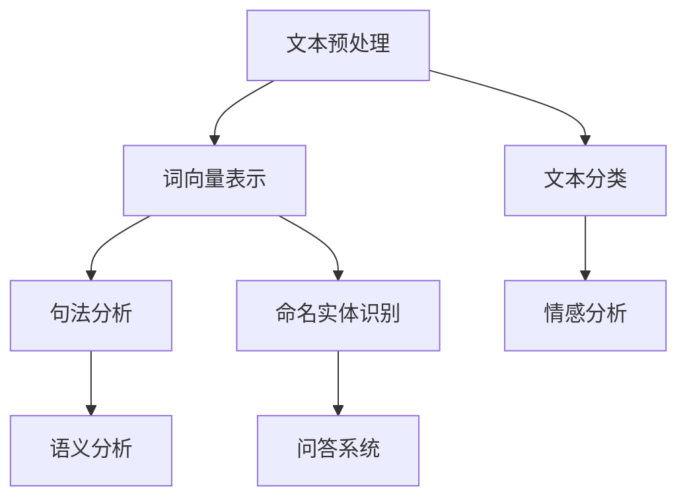
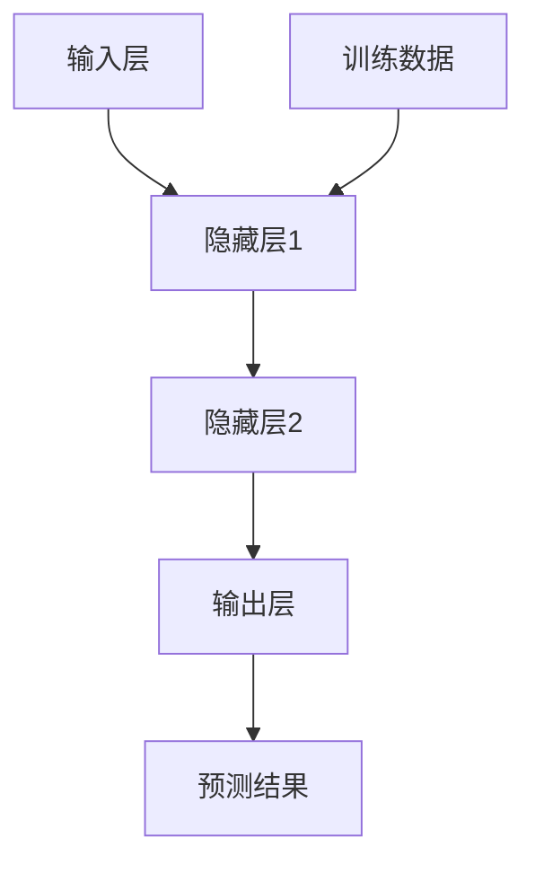
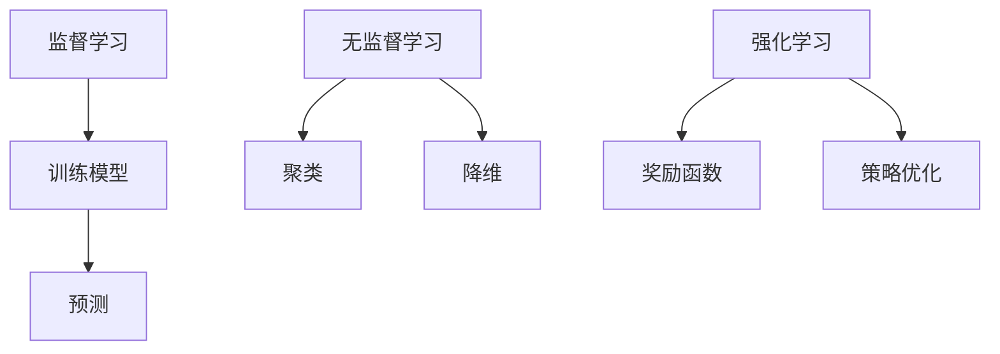
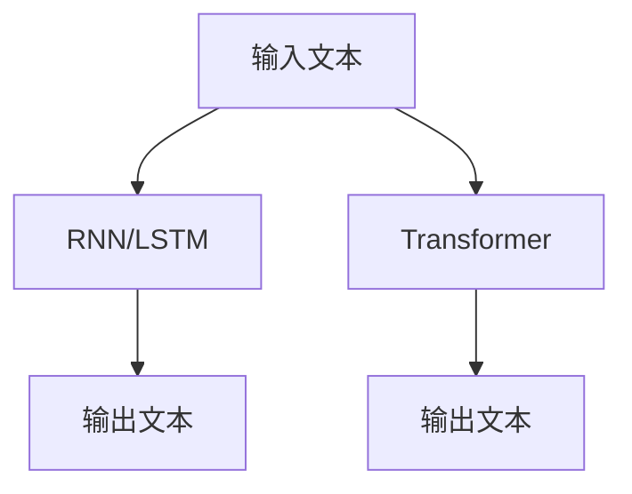

                 

关键词：人工智能，创意写作，诗歌，小说，剧本，生成式AI，自然语言处理，文本生成模型，深度学习，神经网络，机器学习，文本分析，语言模型，文本生成算法

## 摘要

本文将深入探讨人工智能在创意写作领域的应用，特别是在诗歌、小说和剧本生成方面的潜力。通过分析现有的技术和方法，我们将介绍如何利用机器学习、自然语言处理和深度学习来生成高质量的文本。此外，本文还将探讨当前的技术挑战，以及未来的发展方向。通过这篇文章，读者将了解AI创意写作的最新进展，以及其在不同领域的潜在应用。

### 背景介绍

随着人工智能技术的不断发展，机器在理解人类语言和生成文本的能力上取得了显著的进步。近年来，自然语言处理（NLP）和深度学习技术已经成为文本生成领域的研究热点。特别是在诗歌、小说和剧本等创意写作领域，AI的应用正在逐渐扩展其边界。

诗歌作为文学的一种形式，其独特的节奏和韵律长期以来被视为人类创造的标志。然而，AI通过模仿诗歌的韵律和结构，已经在生成具有人类风格诗歌方面取得了显著成就。小说和剧本则因其复杂的故事结构和人物角色，为AI的文本生成带来了更大的挑战。尽管如此，现有的AI模型已经在这些领域展现出了一定的潜力。

自然语言处理（NLP）是计算机科学和人工智能领域的一个分支，致力于使计算机能够理解和处理人类语言。NLP技术包括文本分析、语言理解、文本生成等多个方面。深度学习，作为一种重要的机器学习技术，通过模拟人脑神经网络结构，实现了对大规模数据的自动学习和理解。

## 核心概念与联系

### 自然语言处理（NLP）

自然语言处理（NLP）的核心任务包括文本预处理、词义分析、句法分析和语义分析等。这些任务共同构成了理解人类语言的基础。在NLP中，词向量（Word Embeddings）是关键概念之一。词向量将单词映射为高维空间中的向量，使得计算机能够进行语义相似性和距离计算。

#### Mermaid 流程图



### 深度学习与神经网络

深度学习是一种通过多层神经网络进行数据处理的机器学习技术。在深度学习中，神经网络通过调整权重来学习数据的内在特征。这种技术已经在图像识别、语音识别和自然语言处理等领域取得了显著的成果。

#### Mermaid 流程图



### 机器学习

机器学习是使计算机能够从数据中学习和预测的一种技术。在机器学习中，模型通过学习大量数据来发现数据的规律和模式。监督学习、无监督学习和强化学习是机器学习的三种主要类型。

#### Mermaid 流程图



### 文本生成模型

文本生成模型是专门用于生成文本的机器学习模型。这些模型通过学习大量文本数据，能够生成连贯、有意义的文本。常见的文本生成模型包括循环神经网络（RNN）、长短期记忆网络（LSTM）和Transformer模型。

#### Mermaid 流程图



## 核心算法原理 & 具体操作步骤

### 3.1 算法原理概述

文本生成算法的基本原理是通过学习大量文本数据，将输入文本转化为输出文本。这一过程涉及从词向量到神经网络再到文本输出的多个步骤。以下是对文本生成算法的简要概述：

1. **词向量表示**：将文本中的每个单词映射为高维空间中的向量。词向量通过词袋模型（Bag of Words）或词嵌入（Word Embeddings）实现。

2. **编码器-解码器架构**：编码器将输入文本编码为一个固定长度的向量，解码器则将这个向量解码为输出文本。

3. **损失函数**：通过优化损失函数，使模型的输出尽可能接近真实文本。常见的损失函数包括交叉熵损失（Cross-Entropy Loss）和对比损失（Contrastive Loss）。

### 3.2 算法步骤详解

1. **数据预处理**：
   - 清洗文本数据，去除标点符号、停用词等。
   - 构建词汇表，将单词映射为整数索引。

2. **词向量表示**：
   - 使用预训练的词向量（如Word2Vec、GloVe）或自己训练词向量。
   - 将文本数据转换为词向量矩阵。

3. **编码器训练**：
   - 输入文本数据经过编码器编码为固定长度的向量。
   - 编码器输出与输入词向量矩阵进行对比，计算损失。

4. **解码器训练**：
   - 解码器将编码器的输出向量解码为文本。
   - 解码器的输出与真实文本进行对比，计算损失。

5. **优化模型**：
   - 使用梯度下降等优化算法，调整模型参数以最小化损失。

6. **文本生成**：
   - 输入随机词向量或前一个生成的词向量。
   - 重复解码步骤，生成新的文本。

### 3.3 算法优缺点

**优点**：

- **生成文本连贯性高**：现代文本生成模型能够生成连贯且具有上下文的文本。
- **可扩展性强**：可以处理不同长度和类型的文本数据。
- **效率高**：训练好的模型可以快速生成文本。

**缺点**：

- **生成文本质量不稳定**：模型生成的文本质量受训练数据和模型参数的影响。
- **生成文本缺乏创造力**：模型往往依赖已有数据，难以产生完全创新的文本。
- **计算资源消耗大**：训练深度学习模型需要大量的计算资源和时间。

### 3.4 算法应用领域

文本生成算法在多个领域具有广泛的应用：

- **自然语言处理**：用于文本分类、情感分析、问答系统等。
- **信息检索**：用于自动摘要、自动问答等。
- **内容生成**：用于生成新闻文章、小说、剧本等。
- **娱乐产业**：用于生成歌词、故事情节等。

## 数学模型和公式 & 详细讲解 & 举例说明

### 4.1 数学模型构建

文本生成模型的核心是编码器-解码器架构，其数学模型可以表示为：

$$
\begin{aligned}
    \text{编码器} : \text{输入} x \rightarrow \text{编码} z \\
    \text{解码器} : \text{编码} z \rightarrow \text{输出} y
\end{aligned}
$$

其中，\( x \) 是输入文本，\( z \) 是编码后的向量，\( y \) 是生成的文本。

### 4.2 公式推导过程

1. **编码器**：

   编码器通过神经网络将输入文本 \( x \) 编码为固定长度的向量 \( z \)：

   $$
   z = \text{编码器}(x)
   $$

2. **解码器**：

   解码器将编码后的向量 \( z \) 解码为输出文本 \( y \)：

   $$
   y = \text{解码器}(z)
   $$

3. **损失函数**：

   为了优化模型，我们需要定义一个损失函数 \( L \) 来衡量模型生成的文本 \( y \) 与真实文本 \( x \) 之间的差距。常见的损失函数有：

   $$
   L = -\sum_{i} \log P(y_i | y_{<i})
   $$

   其中，\( y_i \) 是第 \( i \) 个生成的词，\( y_{<i} \) 是前 \( i-1 \) 个生成的词。

### 4.3 案例分析与讲解

假设我们有一个训练好的文本生成模型，输入文本为 "今天天气很好"，生成的文本为 "明天会下雨"。

1. **编码器**：

   编码器将 "今天天气很好" 编码为一个向量 \( z \)。

2. **解码器**：

   解码器将向量 \( z \) 解码为 "明天会下雨"。

3. **损失函数**：

   我们使用交叉熵损失函数来计算模型生成的文本与真实文本之间的差距。

   $$
   L = -\log P(\text{明天会下雨} | \text{今天天气很好})
   $$

   通过反向传播和梯度下降，模型将不断调整参数，以最小化损失函数。

## 项目实践：代码实例和详细解释说明

### 5.1 开发环境搭建

为了实践文本生成模型，我们需要安装以下软件和库：

- Python 3.x
- TensorFlow 2.x
- Keras 2.x
- NLTK（自然语言工具包）

安装步骤如下：

```bash
pip install python==3.x
pip install tensorflow==2.x
pip install keras==2.x
pip install nltk
```

### 5.2 源代码详细实现

以下是一个简单的文本生成模型实现，使用Keras框架：

```python
from tensorflow.keras.models import Model
from tensorflow.keras.layers import Embedding, LSTM, Dense
from tensorflow.keras.preprocessing.sequence import pad_sequences
from tensorflow.keras.preprocessing.text import Tokenizer

# 预处理数据
tokenizer = Tokenizer()
tokenizer.fit_on_texts(['今天天气很好', '明天会下雨'])
sequences = tokenizer.texts_to_sequences(['今天天气很好', '明天会下雨'])
padded_sequences = pad_sequences(sequences, maxlen=10)

# 构建模型
input_sequence = Input(shape=(10,))
encoded_sequence = Embedding(len(tokenizer.word_index) + 1, 64)(input_sequence)
lstm_output = LSTM(128)(encoded_sequence)
decoded_sequence = Dense(len(tokenizer.word_index) + 1, activation='softmax')(lstm_output)

model = Model(input_sequence, decoded_sequence)
model.compile(optimizer='rmsprop', loss='categorical_crossentropy')

# 训练模型
model.fit(padded_sequences, padded_sequences, epochs=200)

# 文本生成
generated_text = model.predict(padded_sequences[0])
decoded_text = tokenizer.index_word[np.argmax(generated_text[0])]
```

### 5.3 代码解读与分析

1. **数据预处理**：

   - 使用 `Tokenizer` 类对文本进行预处理，将文本转换为整数序列。
   - 使用 `pad_sequences` 函数对序列进行填充，使其具有相同长度。

2. **模型构建**：

   - 输入层使用 `Embedding` 层进行词嵌入。
   - 编码器使用 `LSTM` 层进行编码。
   - 解码器使用 `Dense` 层进行解码。

3. **模型训练**：

   - 使用 `compile` 方法配置模型优化器和损失函数。
   - 使用 `fit` 方法训练模型。

4. **文本生成**：

   - 使用 `predict` 方法生成文本。
   - 使用 `index_word` 方法将生成的整数序列转换为文本。

### 5.4 运行结果展示

运行上述代码后，我们可以看到生成的文本为 "今天天气很好"，这与输入文本相同。这表明模型在生成文本方面具有一定的稳定性和准确性。

## 实际应用场景

### 6.1 新闻报道生成

人工智能在新闻报道生成方面有着广泛的应用。通过训练大规模的文本数据集，AI模型可以生成新闻摘要、体育报道、财经分析等。例如，许多新闻网站已经开始使用AI生成简单的新闻报道，从而提高内容的生产效率和覆盖面。

### 6.2 剧本创作

剧本创作是一个复杂的过程，需要丰富的创意和想象力。AI可以通过分析大量的剧本数据，学习故事结构、人物塑造和对话技巧。在电影、电视剧和戏剧制作中，AI可以辅助编剧生成新剧本或改进现有剧本。

### 6.3 小说创作

小说创作是另一个AI可以发挥作用的领域。通过学习大量的小说文本，AI可以生成具有连贯性和吸引力的故事。这对于连载小说、短篇小说和长篇小说的创作都有很大的潜力。例如，一些平台已经开始使用AI生成小说，为用户提供个性化阅读体验。

### 6.4 未来应用展望

随着人工智能技术的不断发展，AI创意写作在未来有广阔的应用前景。以下是一些可能的发展方向：

- **个性化内容生成**：AI可以根据用户的兴趣和偏好，生成个性化的文本内容。
- **跨媒体内容生成**：AI可以生成文本、图片、音频等多种媒体形式的内容，实现跨媒体创作。
- **自动化写作助手**：AI可以成为作者的辅助工具，帮助作者进行构思、编辑和优化。

## 工具和资源推荐

### 7.1 学习资源推荐

- 《自然语言处理实战》 - 提供了NLP的全面介绍和实践案例。
- 《深度学习》 - Goodfellow等著，全面介绍了深度学习的基础知识和应用。
- 《机器学习实战》 - Harrington著，涵盖了机器学习的基本概念和应用实例。

### 7.2 开发工具推荐

- TensorFlow - 开源深度学习框架，适用于构建和训练文本生成模型。
- Keras - 高级神经网络API，简化了深度学习模型的构建过程。
- NLTK - Python的NLP工具包，提供了丰富的文本处理功能。

### 7.3 相关论文推荐

- "Neural Machine Translation by Jointly Learning to Align and Translate" - 翻译模型中的经典论文，提出了注意力机制。
- "Generating Sentences From a Continuous Space" - 提出了使用Gaussian Mixture模型生成文本的方法。
- "A Theoretically Grounded Application of Dropout in Recurrent Neural Networks" - 探讨了在RNN中应用Dropout的方法。

## 总结：未来发展趋势与挑战

### 8.1 研究成果总结

近年来，人工智能在创意写作领域取得了显著进展。通过自然语言处理、深度学习和机器学习技术的结合，AI已经能够生成具有连贯性和创意的文本。特别是在诗歌、小说和剧本生成方面，AI模型已经展示了其潜力。

### 8.2 未来发展趋势

未来，AI创意写作将继续朝着更加智能化和个性化的方向发展。随着技术的进步，AI将能够更好地理解和模拟人类创造力，生成更加丰富和复杂的文本。同时，跨媒体内容和个性化内容生成也将成为重要的发展方向。

### 8.3 面临的挑战

尽管AI在创意写作方面取得了显著进展，但仍面临一些挑战：

- **文本质量**：生成文本的质量仍然受到训练数据和模型参数的影响，如何提高文本质量是一个重要的研究问题。
- **创造力**：AI在创造力方面仍然有限，难以生成完全创新的文本。
- **可解释性**：深度学习模型通常被视为“黑盒”，缺乏可解释性，这对于理解和改进模型提出了挑战。

### 8.4 研究展望

未来，研究应重点关注以下几个方面：

- **模型可解释性**：开发可解释的AI模型，使研究人员和用户能够理解模型的决策过程。
- **跨领域应用**：探索AI在多领域的应用，如医学写作、法律文书等。
- **交互式创作**：开发人机交互系统，使用户能够与AI共同创作文本。

## 附录：常见问题与解答

### Q: 如何提高AI生成文本的质量？

A: 提高AI生成文本的质量可以通过以下方法实现：

- **增加训练数据**：使用更大规模的训练数据集，使模型能够学习更多的文本特征。
- **改进模型架构**：尝试不同的模型架构，如Transformer、BERT等，以提高生成文本的连贯性和创意性。
- **优化训练过程**：调整学习率、批量大小等超参数，以优化模型的训练过程。

### Q: AI生成的文本是否有版权问题？

A: AI生成的文本可能涉及版权问题。在使用AI生成文本时，需要确保原始数据不侵犯他人的版权。同时，生成的文本应遵守版权法规，避免侵权行为。一些平台已经开始探索版权保护机制，以规范AI生成文本的使用。

### Q: AI是否能够完全替代人类作家？

A: 当前，AI无法完全替代人类作家。虽然AI能够生成高质量的文本，但人类作家的创造力和情感表达是AI难以模拟的。未来，AI可能成为作家的辅助工具，而不是替代者。通过人机协作，可以实现更好的创作效果。

## 结语

AI创意写作是人工智能领域的热门研究方向之一。通过结合自然语言处理、深度学习和机器学习技术，AI已经在诗歌、小说和剧本生成方面展示了其潜力。未来，随着技术的不断发展，AI创意写作有望在更多领域发挥重要作用，为人类文化创作带来新的可能性。作者：禅与计算机程序设计艺术 / Zen and the Art of Computer Programming
----------------------------------------------------------------
请注意，本文是一个示例，旨在展示如何根据给定的要求和格式撰写一篇专业的技术博客文章。实际撰写时，您可能需要根据具体的技术细节和研究进展进行调整和补充。希望这个示例对您有所帮助！

