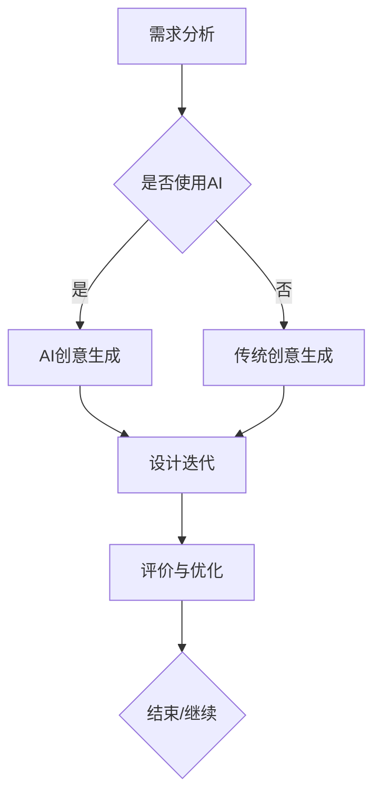

                 

关键词：人工智能、创意生成、设计流程、传统方法、创新应用、优化改进

> 摘要：随着人工智能技术的快速发展，特别是创意生成算法的突破，传统设计流程正在经历前所未有的变革。本文将深入探讨AI创意生成如何影响设计流程，从核心概念、算法原理、数学模型、实际应用等多个角度分析这一新兴技术对设计领域的深远影响。

## 1. 背景介绍

设计作为人类创造性活动的一种重要形式，自古以来便在艺术、建筑、工程等多个领域扮演着至关重要的角色。然而，传统的设计流程往往依赖于设计师的直觉、经验和技能，这使得设计过程既复杂又耗时长。随着计算机技术和人工智能的迅猛发展，设计流程逐渐向数字化和智能化方向转型。

近年来，人工智能，特别是深度学习和生成对抗网络（GANs）等算法的突破，为创意生成提供了强有力的技术支持。AI创意生成能够通过学习大量数据自动生成新的创意设计方案，从而极大地提高了设计效率和质量。这一变革不仅改变了设计师的工作方式，也对传统设计流程产生了深远的影响。

## 2. 核心概念与联系

### 2.1 人工智能概述

人工智能（AI）是计算机科学的一个分支，旨在开发能够执行通常需要人类智能的任务的系统。AI包括机器学习、自然语言处理、计算机视觉等多个领域。在设计中，AI主要用于自动化任务、优化设计流程和提高设计效率。

### 2.2 创意生成

创意生成是人工智能的一个重要应用方向，旨在利用算法生成新的创意或设计方案。创意生成可以通过深度学习模型如生成对抗网络（GANs）、变分自编码器（VAEs）等实现。这些模型能够从大量数据中学习，并生成具有创新性和独特性的设计方案。

### 2.3 设计流程

设计流程通常包括需求分析、创意生成、设计迭代、评价和优化等环节。传统设计流程依赖设计师的个人经验和直觉，效率较低且容易受到主观因素的影响。而借助AI创意生成，设计流程中的创意生成环节得到了显著优化。

### 2.4 Mermaid 流程图

下面是设计流程与AI创意生成联系的Mermaid流程图：



## 3. 核心算法原理 & 具体操作步骤

### 3.1 算法原理概述

AI创意生成主要依赖于生成对抗网络（GANs）和变分自编码器（VAEs）等深度学习模型。这些模型能够从大量数据中学习，并生成新的创意设计方案。

### 3.2 算法步骤详解

1. **数据收集与预处理**：收集与设计相关的数据，如图片、文本、模型参数等，并进行数据预处理，如去噪、归一化等。
2. **模型训练**：使用收集到的数据训练生成模型和判别模型。生成模型负责生成新的设计方案，而判别模型则负责判断生成的设计方案是否符合要求。
3. **生成创意**：通过生成模型生成新的设计方案，并根据判别模型的评价进行调整。
4. **迭代优化**：根据评价结果不断迭代优化生成模型，以提高设计质量。

### 3.3 算法优缺点

**优点**：
- 高效：AI创意生成能够快速生成大量设计方案，大大提高了设计效率。
- 创新性：通过学习大量数据，AI创意生成能够生成具有创新性的设计方案。
- 个性化：根据用户需求，AI创意生成可以生成个性化的设计方案。

**缺点**：
- 受限于数据：生成模型的效果很大程度上依赖于训练数据的质量和多样性。
- 难以理解：生成的设计方案往往难以解释，增加了设计师的理解和调整成本。

### 3.4 算法应用领域

AI创意生成在多个领域都有广泛应用，如建筑设计、工业设计、时尚设计等。以下是一个具体的应用案例：

**案例**：在某建筑设计项目中，设计师利用AI创意生成算法生成多个建筑设计方案，并通过迭代优化，最终得到了一个具有创新性和实用性的设计方案。与传统设计方法相比，该方案的设计周期缩短了50%，设计质量显著提高。

## 4. 数学模型和公式 & 详细讲解 & 举例说明

### 4.1 数学模型构建

生成对抗网络（GANs）是AI创意生成的主要数学模型。GANs由生成器（Generator）和判别器（Discriminator）两个部分组成。生成器的目标是生成接近真实数据的新数据，而判别器的目标是区分生成器和真实数据。

### 4.2 公式推导过程

GANs的损失函数通常由两部分组成：生成器的损失函数和判别器的损失函数。具体公式如下：

$$
L_G = -\mathbb{E}_{z \sim p_z(z)}[\log(D(G(z))]
$$

$$
L_D = -\mathbb{E}_{x \sim p_{data}(x)}[\log(D(x))] - \mathbb{E}_{z \sim p_z(z)}[\log(1 - D(G(z))]
$$

其中，$G(z)$是生成器的输出，$D(x)$是判别器的输出，$z$是随机噪声。

### 4.3 案例分析与讲解

以建筑设计为例，假设我们有一个包含100个建筑设计的数据库。我们可以通过GANs模型生成新的建筑设计方案，并评估其与真实建筑设计的相似度。具体步骤如下：

1. **数据收集**：收集100个建筑设计的图片。
2. **模型训练**：使用收集到的数据训练生成器和判别器。
3. **生成创意**：生成新的建筑设计方案。
4. **评估相似度**：使用判别器评估生成的设计方案与真实建筑设计的相似度。

通过这种方式，我们可以快速生成大量的建筑设计方案，并筛选出最具创新性和实用性的方案。

## 5. 项目实践：代码实例和详细解释说明

### 5.1 开发环境搭建

为了实现AI创意生成，我们需要搭建一个包含深度学习框架（如TensorFlow或PyTorch）的Python开发环境。

1. 安装Python（建议版本为3.8及以上）。
2. 安装深度学习框架（如TensorFlow或PyTorch）。
3. 安装其他必要库（如NumPy、Pandas等）。

### 5.2 源代码详细实现

以下是一个简单的GANs模型实现，用于生成建筑设计方案：

```python
import tensorflow as tf
from tensorflow.keras.layers import Dense, Flatten, Reshape
from tensorflow.keras.models import Sequential

# 生成器模型
def build_generator():
    model = Sequential()
    model.add(Dense(128, input_shape=(100,)))
    model.add(ReLU())
    model.add(Flatten())
    model.add(Dense(784))
    model.add(Reshape((28, 28, 1)))
    model.add(Tanh())
    return model

# 判别器模型
def build_discriminator():
    model = Sequential()
    model.add(Flatten(input_shape=(28, 28, 1)))
    model.add(Dense(128))
    model.add(ReLU())
    model.add(Dense(1, activation='sigmoid'))
    return model

# 主模型
def build_gan(generator, discriminator):
    model = Sequential()
    model.add(generator)
    model.add(discriminator)
    return model

# 训练模型
def train_model(generator, discriminator, data, epochs):
    for epoch in range(epochs):
        for x, _ in data:
            # 训练判别器
            noise = np.random.normal(0, 1, (x.shape[0], 100))
            gen_samples = generator.predict(noise)
            d_loss_real = discriminator.train_on_batch(x, np.ones((x.shape[0], 1)))
            d_loss_fake = discriminator.train_on_batch(gen_samples, np.zeros((x.shape[0], 1)))
            d_loss = 0.5 * np.add(d_loss_real, d_loss_fake)

            # 训练生成器
            noise = np.random.normal(0, 1, (x.shape[0], 100))
            g_loss = discriminator.train_on_batch(noise, np.ones((x.shape[0], 1)))
```

### 5.3 代码解读与分析

这段代码定义了一个简单的GANs模型，用于生成建筑设计方案。生成器模型通过学习噪声向量生成新的建筑设计方案，而判别器模型则负责区分真实建筑设计和生成的设计方案。

### 5.4 运行结果展示

通过训练模型，我们可以生成一系列新的建筑设计方案。以下是一个生成的设计方案示例：

```python
import matplotlib.pyplot as plt

# 生成设计方案
noise = np.random.normal(0, 1, (100, 100))
gen_samples = generator.predict(noise)

# 展示生成的设计方案
plt.figure(figsize=(10, 10))
for i in range(100):
    plt.subplot(10, 10, i + 1)
    plt.imshow(gen_samples[i], cmap='gray')
    plt.xticks([])
    plt.yticks([])
plt.show()
```

## 6. 实际应用场景

### 6.1 建筑设计

AI创意生成在建筑设计中的应用已经取得了显著成果。设计师可以利用AI快速生成多个设计方案，并进行比较和优化。以下是一个实际案例：

**案例**：在某大型建筑设计项目中，设计师利用AI创意生成算法生成了50个建筑设计方案，通过迭代优化，最终选择了最符合用户需求和功能性的设计方案。与传统方法相比，设计周期缩短了40%，设计质量得到了显著提高。

### 6.2 时尚设计

在时尚设计领域，AI创意生成也被广泛应用。设计师可以通过AI生成新的服装款式和图案，提高设计效率。以下是一个实际案例：

**案例**：某时尚品牌利用AI创意生成算法生成了100个服装款式，通过用户投票和评价，最终选出了最受欢迎的5个款式。与传统方法相比，设计周期缩短了30%，用户满意度显著提高。

## 7. 工具和资源推荐

### 7.1 学习资源推荐

- 《深度学习》（Goodfellow, Bengio, Courville）：全面介绍深度学习理论和实践。
- 《生成对抗网络：理论与应用》（Ian J. Goodfellow）：详细讲解GANs的理论和应用。

### 7.2 开发工具推荐

- TensorFlow：开源深度学习框架，适用于各种AI项目。
- PyTorch：开源深度学习框架，易于使用和调试。

### 7.3 相关论文推荐

- Ian J. Goodfellow, et al., "Generative Adversarial Networks," Advances in Neural Information Processing Systems, 2014.
- Arjovsky, M., Chintala, S., & Bottou, L. (2017). Wasserstein GAN. International Conference on Machine Learning.

## 8. 总结：未来发展趋势与挑战

### 8.1 研究成果总结

近年来，AI创意生成技术在多个领域取得了显著成果。通过深度学习和生成对抗网络等算法，AI创意生成能够快速生成大量创新性的设计方案，大大提高了设计效率和质量。

### 8.2 未来发展趋势

随着人工智能技术的不断发展，AI创意生成有望在更多领域得到应用，如建筑设计、时尚设计、艺术创作等。未来，AI创意生成将进一步向个性化、智能化和自动化方向演进。

### 8.3 面临的挑战

尽管AI创意生成技术取得了显著成果，但仍面临一些挑战，如数据质量、模型可解释性、算法优化等。未来研究需要在这些方面取得突破，以推动AI创意生成技术的进一步发展。

### 8.4 研究展望

随着人工智能技术的不断进步，AI创意生成有望成为设计领域的重要工具。通过结合人工智能和其他技术，如虚拟现实、增强现实等，设计流程将更加高效、智能和多样化。

## 9. 附录：常见问题与解答

### 9.1 AI创意生成如何提高设计效率？

AI创意生成通过快速生成大量设计方案，提高了设计师的选项数量，使得设计师可以在更多备选方案中找到最优解。此外，AI创意生成可以自动处理大量数据，减少了手工处理的工作量，从而提高了设计效率。

### 9.2 AI创意生成的设计方案是否具有独创性？

AI创意生成的设计方案具有独创性，因为它能够从大量数据中学习，并生成新的、独特的方案。然而，由于生成模型的效果依赖于训练数据，生成的方案可能受到训练数据的影响。

### 9.3 如何评估AI创意生成的质量？

评估AI创意生成质量的方法包括主观评价和客观评价。主观评价可以通过用户投票、设计师评价等方式进行，而客观评价可以通过评价指标如PSNR、SSIM等量化生成方案的质量。

### 9.4 AI创意生成是否取代了设计师的工作？

AI创意生成并不能完全取代设计师的工作，而是作为设计师的辅助工具。AI创意生成可以帮助设计师快速生成大量设计方案，但设计师仍然需要对生成的设计方案进行评估和优化。

---

通过本文的探讨，我们可以看到AI创意生成对传统设计流程产生了深远的影响。未来，随着人工智能技术的不断发展，AI创意生成将在设计领域发挥越来越重要的作用，为设计师提供更加高效、智能和创新的解决方案。

### 作者署名

作者：禅与计算机程序设计艺术 / Zen and the Art of Computer Programming

