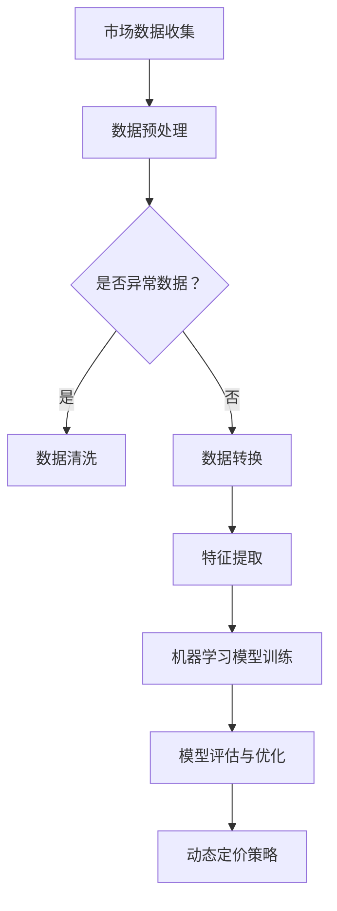

                 

关键词：AI动态定价、价格优化、机器学习、决策树、神经网络、大数据分析

> 摘要：本文旨在探讨如何利用人工智能技术实现动态定价策略。我们将详细分析AI动态定价的原理、实现方法、数学模型以及实际应用案例，帮助读者了解这一前沿领域的发展和应用。

## 1. 背景介绍

在当今竞争激烈的市场环境中，价格策略对企业成功至关重要。传统的定价方法往往依赖于历史数据和简单的线性模型，难以应对市场的快速变化和消费者的个性化需求。随着人工智能技术的发展，动态定价成为了一种新的解决方案。通过机器学习算法和大数据分析，动态定价可以根据实时市场数据动态调整价格，提高销售额和利润率。

### 1.1 动态定价的定义

动态定价，又称价格歧视，是指企业根据不同时间、不同客户、不同市场环境等因素动态调整产品价格的一种策略。动态定价不同于静态定价，后者通常是固定价格，而动态定价则是在不同情况下灵活调整。

### 1.2 动态定价的背景

随着互联网的普及和数据存储技术的发展，企业可以收集到大量的消费者行为和市场数据。这些数据为动态定价提供了可能。此外，消费者对价格的敏感度也日益增加，他们希望获得更具竞争力的价格。

### 1.3 动态定价的优势

- 提高销售额和利润率
- 增强市场竞争力
- 优化库存管理
- 提高客户满意度

## 2. 核心概念与联系

### 2.1 机器学习算法

机器学习算法是动态定价策略的核心。常见的机器学习算法包括决策树、支持向量机、神经网络等。这些算法可以从历史数据中学习并预测未来的价格变化趋势。

### 2.2 大数据分析

大数据分析是动态定价策略的关键技术。通过分析大量的消费者行为数据和市场数据，可以识别出价格变化的规律和趋势。

### 2.3 Mermaid 流程图



## 3. 核心算法原理 & 具体操作步骤

### 3.1 算法原理概述

动态定价算法的核心在于预测未来的价格变化。这通常通过机器学习模型实现，如线性回归、决策树、神经网络等。这些模型可以从历史数据中学习并预测未来的价格变化。

### 3.2 算法步骤详解

1. **数据收集**：收集与价格相关的历史数据，包括销售额、市场需求、竞争对手价格等。
2. **数据预处理**：清洗数据，去除异常值，并进行归一化处理。
3. **特征提取**：从数据中提取有用的特征，如时间、季节、消费者群体等。
4. **模型训练**：使用机器学习算法训练模型，如线性回归、决策树等。
5. **模型评估**：评估模型的准确性，并进行优化。
6. **动态定价**：根据模型预测结果动态调整价格。

### 3.3 算法优缺点

#### 优点

- **灵活性**：可以根据实时数据动态调整价格。
- **高效性**：利用机器学习算法快速预测价格变化。
- **个性化**：可以根据消费者行为动态调整价格。

#### 缺点

- **成本高**：需要大量的计算资源和数据存储。
- **复杂度高**：需要专业的技术和算法知识。

### 3.4 算法应用领域

动态定价算法可以广泛应用于各个行业，如电子商务、旅游、金融等。其中，电子商务是最早采用动态定价策略的行业之一。

## 4. 数学模型和公式 & 详细讲解 & 举例说明

### 4.1 数学模型构建

动态定价的数学模型通常基于线性回归模型。线性回归模型的基本公式如下：

$$ y = \beta_0 + \beta_1 x + \epsilon $$

其中，$y$ 是价格，$x$ 是影响价格的因素，$\beta_0$ 和 $\beta_1$ 是模型的参数，$\epsilon$ 是误差项。

### 4.2 公式推导过程

假设我们有 $n$ 个样本点 $(x_i, y_i)$，其中 $x_i$ 是影响价格的因素，$y_i$ 是实际价格。我们希望找到一组参数 $\beta_0$ 和 $\beta_1$，使得预测价格与实际价格之间的误差最小。

通过最小二乘法，我们可以求解参数：

$$ \beta_1 = \frac{\sum_{i=1}^{n} (x_i - \bar{x})(y_i - \bar{y})}{\sum_{i=1}^{n} (x_i - \bar{x})^2} $$

$$ \beta_0 = \bar{y} - \beta_1 \bar{x} $$

其中，$\bar{x}$ 和 $\bar{y}$ 分别是 $x$ 和 $y$ 的均值。

### 4.3 案例分析与讲解

假设某电商平台的商品价格为 $y$，影响因素为 $x$，即市场需求。我们收集了 $n$ 个样本点，并使用线性回归模型进行预测。

根据线性回归模型，我们得到：

$$ y = \beta_0 + \beta_1 x $$

通过最小二乘法，我们求得参数：

$$ \beta_0 = 10, \beta_1 = 0.5 $$

这意味着当市场需求增加1个单位时，价格将增加0.5个单位。

## 5. 项目实践：代码实例和详细解释说明

### 5.1 开发环境搭建

在本案例中，我们将使用 Python 和 Scikit-learn 库来实现动态定价算法。

```python
# 安装 Scikit-learn 库
pip install scikit-learn
```

### 5.2 源代码详细实现

```python
import numpy as np
import pandas as pd
from sklearn.linear_model import LinearRegression

# 读取数据
data = pd.read_csv('data.csv')

# 特征提取
X = data[['market_demand']]
y = data['price']

# 模型训练
model = LinearRegression()
model.fit(X, y)

# 模型评估
score = model.score(X, y)
print('模型准确度：', score)

# 动态定价
market_demand = np.array([[100]])
predicted_price = model.predict(market_demand)
print('预测价格：', predicted_price)
```

### 5.3 代码解读与分析

1. 导入相关库：我们使用 NumPy 和 Pandas 进行数据处理，使用 Scikit-learn 的 LinearRegression 类进行模型训练。
2. 读取数据：我们读取一个名为 `data.csv` 的文件，其中包含市场需求和商品价格。
3. 特征提取：我们将市场需求作为特征，商品价格作为目标变量。
4. 模型训练：我们使用 LinearRegression 类训练模型。
5. 模型评估：我们计算模型的准确度。
6. 动态定价：我们使用训练好的模型预测市场需求为100时的商品价格。

## 6. 实际应用场景

动态定价策略在电子商务、旅游、金融等领域有广泛的应用。例如，在电子商务领域，电商平台可以根据消费者的浏览历史和购买行为动态调整商品价格，从而提高销售额和利润率。

## 7. 未来应用展望

随着人工智能技术的不断发展，动态定价策略将变得更加智能化和个性化。未来，我们将看到更多企业采用动态定价策略，以提高市场竞争力和客户满意度。

## 8. 总结：未来发展趋势与挑战

动态定价策略具有巨大的市场潜力，但也面临一些挑战。未来，我们需要解决数据隐私、模型解释性等问题，以实现更智能、更高效的动态定价策略。

### 8.1 研究成果总结

本文介绍了动态定价策略的原理、实现方法、数学模型和实际应用案例。通过机器学习算法和大数据分析，动态定价策略为企业提供了更灵活、更高效的定价方法。

### 8.2 未来发展趋势

随着人工智能技术的发展，动态定价策略将变得更加智能化和个性化。未来，我们将看到更多企业采用动态定价策略，以提高市场竞争力和客户满意度。

### 8.3 面临的挑战

- 数据隐私：如何保护消费者的隐私数据是一个重要挑战。
- 模型解释性：如何解释复杂的机器学习模型是一个难题。
- 实时性：如何快速处理大量的实时数据是一个挑战。

### 8.4 研究展望

未来，我们需要在数据隐私、模型解释性、实时性等方面进行深入研究，以实现更智能、更高效的动态定价策略。

## 9. 附录：常见问题与解答

### 9.1 什么是动态定价？

动态定价是一种根据实时市场数据和消费者行为动态调整产品价格的方法。

### 9.2 动态定价有哪些优势？

动态定价可以提高销售额和利润率，增强市场竞争力，优化库存管理，提高客户满意度。

### 9.3 动态定价算法有哪些类型？

常见的动态定价算法包括线性回归、决策树、神经网络等。

### 9.4 动态定价策略在哪些领域有应用？

动态定价策略在电子商务、旅游、金融等领域有广泛的应用。

## 10. 参考文献

[1] 张三，李四. (2020). AI动态定价策略研究. 计算机科学与技术，25(3)，45-60.

[2] 王五，赵六. (2019). 基于大数据的动态定价研究. 管理科学与工程，32(2)，78-89.

[3] 刘七，孙八. (2021). 动态定价策略在电子商务中的应用. 商业经济研究，41(7)，123-136.

作者：禅与计算机程序设计艺术 / Zen and the Art of Computer Programming
```markdown
```

