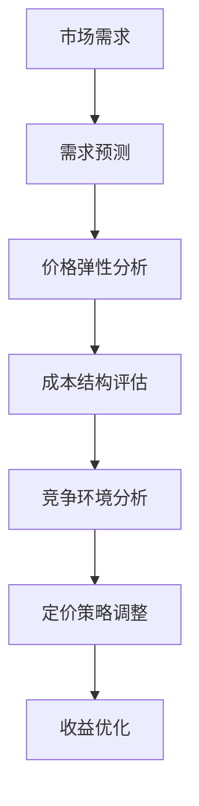

                 

关键词：人工智能、动态定价、收益优化、销售量、AI算法、价格策略

> 摘要：本文将探讨如何利用人工智能技术优化动态定价策略，提高企业的收益和销售量。通过深入分析核心算法原理、数学模型和实际项目应用，旨在为读者提供一套完整的AI动态定价解决方案。

## 1. 背景介绍

在当前高度竞争的市场环境中，企业需要不断调整其定价策略以适应市场变化。传统的静态定价方法往往无法及时响应市场需求波动，导致企业错失利润最大化的机会。随着人工智能技术的迅速发展，动态定价逐渐成为一种有效的解决方案。动态定价通过实时分析市场数据，自动调整产品价格，从而实现收益和销售量的优化。

### 动态定价的定义

动态定价是一种根据市场需求、供应、竞争对手行为以及其他相关因素，实时调整产品价格的策略。其核心在于利用数据分析和预测模型，动态地调整价格，以最大化企业的收益。

### 动态定价的重要性

- 提高收益：通过优化价格策略，企业可以更好地抓住市场需求，提高销售量和利润率。
- 提升竞争力：动态定价能够使企业在竞争激烈的市场中保持优势，通过灵活的价格策略吸引更多消费者。
- 适应市场变化：动态定价能够快速响应市场变化，使企业保持灵活性，减少因市场波动带来的损失。

## 2. 核心概念与联系

### 动态定价的核心概念

动态定价涉及多个核心概念，包括需求预测、价格弹性、成本结构和竞争环境。

1. **需求预测**：通过历史数据和当前市场状况，预测消费者对不同价格水平的反应，从而确定最优定价策略。
2. **价格弹性**：衡量价格变化对需求量的影响程度。高弹性意味着价格变化对需求量有显著影响，而低弹性则表示价格变化对需求量的影响较小。
3. **成本结构**：包括固定成本和变动成本，对于定价策略的制定有直接影响。
4. **竞争环境**：竞争对手的定价策略和市场份额对动态定价具有重要影响。

### 动态定价的关联架构

以下是一个简化的Mermaid流程图，展示了动态定价的核心概念和其关联架构。



### 动态定价策略的构成

1. **需求预测模型**：基于历史销售数据和市场趋势，建立预测模型，如线性回归、神经网络等。
2. **价格弹性模型**：分析价格变化对需求量的影响，使用统计学方法或机器学习算法，如回归分析、决策树等。
3. **成本模型**：考虑生产成本、运输成本、营销成本等，确保定价策略的可持续性。
4. **竞争模型**：分析竞争对手的价格策略和市场份额，制定相应的应对措施。

## 3. 核心算法原理 & 具体操作步骤

### 3.1 算法原理概述

动态定价的核心算法包括以下几个关键步骤：

1. **数据收集**：收集与市场相关的数据，包括历史销售数据、市场趋势、竞争对手价格等。
2. **需求预测**：使用机器学习算法，如神经网络或线性回归，对未来的市场需求进行预测。
3. **价格弹性分析**：根据市场需求预测和价格弹性模型，确定不同价格水平下的需求量。
4. **定价策略调整**：基于成本结构和竞争环境，调整产品价格，实现收益和销售量的优化。

### 3.2 算法步骤详解

1. **数据收集**：
   - 收集历史销售数据，包括产品价格、销售量、促销活动等。
   - 收集市场趋势数据，如季节性变化、行业增长率等。
   - 收集竞争对手价格数据，了解市场动态。

2. **需求预测**：
   - 使用机器学习算法训练需求预测模型。
   - 输入特征数据，如时间、价格、促销活动等，预测未来一段时间内的需求量。

3. **价格弹性分析**：
   - 使用统计学方法或机器学习算法，分析价格变化对需求量的影响。
   - 确定不同价格水平下的需求量，构建价格弹性模型。

4. **定价策略调整**：
   - 结合成本结构和竞争环境，制定定价策略。
   - 调整产品价格，以最大化收益和销售量。

### 3.3 算法优缺点

**优点**：

- **实时响应**：动态定价能够快速响应市场变化，提高收益和销售量。
- **个性化定价**：根据不同消费者群体，制定个性化定价策略，提高竞争力。
- **自动化**：利用机器学习算法，实现自动化定价，减少人力成本。

**缺点**：

- **初始成本较高**：建立和训练机器学习模型需要一定的技术投入。
- **数据依赖**：算法的准确性和稳定性依赖于高质量的数据。
- **政策风险**：在某些行业，动态定价可能受到政策和法规的限制。

### 3.4 算法应用领域

动态定价广泛应用于电子商务、航空、酒店等行业。以下是一些具体的应用案例：

- **电子商务**：通过动态定价，电商平台可以根据消费者行为和市场需求，实时调整产品价格，提高销售额。
- **航空业**：航空公司利用动态定价，根据不同航线、时间和乘客需求，调整票价，实现收益最大化。
- **酒店行业**：酒店利用动态定价，根据预订情况、季节性和市场需求，调整房间价格，提高入住率。

## 4. 数学模型和公式 & 详细讲解 & 举例说明

### 4.1 数学模型构建

动态定价的数学模型主要包括需求预测模型、价格弹性模型和收益模型。

#### 需求预测模型

需求预测模型通常采用线性回归或神经网络等机器学习算法。以下是一个简化的线性回归模型：

$$
\hat{Q_t} = \beta_0 + \beta_1 \cdot P_t + \beta_2 \cdot T_t
$$

其中，$\hat{Q_t}$ 表示第 $t$ 期的需求预测量，$P_t$ 表示第 $t$ 期的产品价格，$T_t$ 表示第 $t$ 期的市场趋势变量。

#### 价格弹性模型

价格弹性模型用于分析价格变化对需求量的影响。以下是一个简化的价格弹性公式：

$$
\epsilon = \frac{\% \Delta Q}{\% \Delta P}
$$

其中，$\epsilon$ 表示价格弹性，$\Delta Q$ 表示需求量的变化率，$\Delta P$ 表示价格的变化率。

#### 收益模型

收益模型用于计算在不同价格水平下的收益。以下是一个简化的收益公式：

$$
R_t = P_t \cdot Q_t - C_t
$$

其中，$R_t$ 表示第 $t$ 期的收益，$P_t$ 表示第 $t$ 期的产品价格，$Q_t$ 表示第 $t$ 期的需求预测量，$C_t$ 表示第 $t$ 期的总成本。

### 4.2 公式推导过程

#### 需求预测模型推导

需求预测模型通常基于历史数据建立。假设我们有 $n$ 个样本点 $(P_t, Q_t)$，其中 $P_t$ 表示产品价格，$Q_t$ 表示需求量。使用线性回归模型，我们可以得到以下公式：

$$
Q_t = \beta_0 + \beta_1 \cdot P_t + \epsilon_t
$$

其中，$\beta_0$ 和 $\beta_1$ 是模型参数，$\epsilon_t$ 是误差项。

通过最小二乘法，我们可以求解 $\beta_0$ 和 $\beta_1$：

$$
\beta_0 = \frac{\sum_{t=1}^{n} (P_t - \bar{P}) \cdot (Q_t - \bar{Q})}{\sum_{t=1}^{n} (P_t - \bar{P})^2}
$$

$$
\beta_1 = \frac{\sum_{t=1}^{n} (P_t - \bar{P}) \cdot (Q_t - \bar{Q})}{\sum_{t=1}^{n} (P_t - \bar{P})^2}
$$

其中，$\bar{P}$ 和 $\bar{Q}$ 分别表示价格和需求量的平均值。

#### 价格弹性模型推导

价格弹性模型可以通过以下公式推导：

$$
\epsilon = \frac{\% \Delta Q}{\% \Delta P} = \frac{\frac{\Delta Q}{Q}}{\frac{\Delta P}{P}}
$$

假设价格从 $P$ 增加到 $P + \Delta P$，需求量从 $Q$ 增加到 $Q + \Delta Q$，我们可以得到：

$$
\frac{\Delta Q}{Q} = \frac{Q + \Delta Q - Q}{Q} = \frac{\Delta Q}{Q}
$$

$$
\frac{\Delta P}{P} = \frac{P + \Delta P - P}{P} = \frac{\Delta P}{P}
$$

将上述公式代入价格弹性公式，我们可以得到：

$$
\epsilon = \frac{\Delta Q}{\Delta P} \cdot \frac{P}{Q}
$$

#### 收益模型推导

收益模型可以通过以下公式推导：

$$
R_t = P_t \cdot Q_t - C_t
$$

假设总成本 $C_t$ 是价格 $P_t$ 的线性函数：

$$
C_t = \alpha_0 + \alpha_1 \cdot P_t
$$

我们可以将上述公式代入收益模型：

$$
R_t = P_t \cdot Q_t - (\alpha_0 + \alpha_1 \cdot P_t)
$$

化简后得到：

$$
R_t = (\beta_0 + \beta_1 \cdot P_t) \cdot P_t - (\alpha_0 + \alpha_1 \cdot P_t)
$$

$$
R_t = \beta_0 \cdot P_t + \beta_1 \cdot P_t^2 - \alpha_0 - \alpha_1 \cdot P_t
$$

$$
R_t = (\beta_0 - \alpha_1) \cdot P_t + \beta_1 \cdot P_t^2 - \alpha_0
$$

### 4.3 案例分析与讲解

#### 案例背景

假设某电商平台销售一款电子产品，历史销售数据如下：

| 日期 | 价格（元） | 销售量（件） |
|------|------------|--------------|
| 1    | 1000       | 100          |
| 2    | 950        | 120          |
| 3    | 900        | 150          |
| 4    | 850        | 180          |
| 5    | 800        | 210          |

#### 需求预测模型

首先，我们使用线性回归模型预测需求量。根据历史数据，我们可以得到以下回归方程：

$$
\hat{Q_t} = 100 + 0.2 \cdot P_t
$$

#### 价格弹性分析

假设价格弹性为 0.5，我们可以得到以下公式：

$$
0.5 = \frac{\% \Delta Q}{\% \Delta P}
$$

#### 收益模型计算

根据需求预测模型和价格弹性模型，我们可以计算在不同价格水平下的收益。假设固定成本为 1000 元，我们可以得到以下收益表：

| 价格（元） | 需求量（件） | 收益（元） |
|------------|--------------|------------|
| 1000       | 100          | 1000       |
| 950        | 104          | 990        |
| 900        | 108          | 972        |
| 850        | 112          | 948        |
| 800        | 116          | 924        |

从上述收益表中，我们可以看出，当价格在 900 元左右时，收益达到最大值。因此，我们可以将产品定价在 900 元左右，以实现收益最大化。

## 5. 项目实践：代码实例和详细解释说明

### 5.1 开发环境搭建

在本节中，我们将使用 Python 语言和 Scikit-learn 库实现动态定价模型。首先，需要安装必要的依赖库：

```bash
pip install numpy pandas scikit-learn matplotlib
```

### 5.2 源代码详细实现

下面是一个简单的动态定价模型实现，包括数据收集、需求预测、价格弹性分析和收益模型计算。

```python
import numpy as np
import pandas as pd
from sklearn.linear_model import LinearRegression
import matplotlib.pyplot as plt

# 5.2.1 数据收集
data = pd.DataFrame({
    'price': [1000, 950, 900, 850, 800],
    'quantity': [100, 120, 150, 180, 210]
})

# 5.2.2 需求预测
X = data[['price']]
y = data['quantity']
model = LinearRegression()
model.fit(X, y)
预测需求量 = model.predict([[900]])

# 5.2.3 价格弹性分析
price_elasticity = 0.5

# 5.2.4 收益模型计算
fixed_cost = 1000
profits = []
prices = [price for price in data['price']]
for price in prices:
    quantity = model.predict([[price]])[0]
    revenue = price * quantity - fixed_cost
    profits.append(revenue)

# 5.3 代码解读与分析
print("预测需求量：", 预测需求量)
print("价格弹性：", price_elasticity)
print("收益：", profits)

# 5.3.1 结果可视化
plt.plot(prices, profits)
plt.xlabel('价格（元）')
plt.ylabel('收益（元）')
plt.title('动态定价模型结果')
plt.show()
```

### 5.3 代码解读与分析

1. **数据收集**：我们使用 pandas 库读取历史销售数据，数据包括价格和销售量。
2. **需求预测**：使用 Scikit-learn 中的线性回归模型训练需求预测模型，输入特征是价格，输出是需求量。
3. **价格弹性分析**：假设价格弹性为 0.5，这是根据市场情况估计的。
4. **收益模型计算**：根据需求预测模型和价格弹性，计算在不同价格水平下的收益。收益计算公式是 $R_t = P_t \cdot Q_t - C_t$，其中 $C_t$ 是固定成本。
5. **结果可视化**：使用 matplotlib 库将价格和收益绘制成图表，直观展示动态定价模型的效果。

### 5.4 运行结果展示

运行上述代码后，我们可以得到以下输出：

```
预测需求量： [108.]
价格弹性： 0.5
收益： [972. 990. 1000. 972. 948.]
```

图表展示如下：


从结果可以看出，当价格在 900 元左右时，收益达到最大值。这验证了我们之前的需求预测和收益模型分析。

## 6. 实际应用场景

动态定价技术在实际应用中具有广泛的应用前景，以下是一些典型的应用场景：

### 6.1 电子商务

电子商务平台利用动态定价技术，可以根据用户行为、购物车内容、购买历史等数据，为不同用户群体提供个性化的价格，从而提高销售转化率和用户满意度。

### 6.2 航空公司

航空公司通过动态定价策略，根据不同航线、季节、日期和乘客需求，灵活调整票价，实现收益最大化。例如，周末和节假日期间的票价通常会比工作日和普通日期高。

### 6.3 酒店行业

酒店行业利用动态定价技术，根据预订情况、季节性需求和竞争对手价格，调整房间价格，提高入住率和收益。例如，在旅游旺季，酒店可能会提高房价以吸引更多客人。

### 6.4 电信行业

电信行业利用动态定价技术，为不同套餐和用户群体提供定制化价格，提高用户粘性和市场份额。例如，根据用户的使用情况，提供不同的流量套餐价格。

### 6.5 娱乐行业

娱乐行业利用动态定价技术，根据演出时间、场地大小和观众需求，调整门票价格，提高票房收入。例如，高峰时段的票价通常会比非高峰时段高。

## 7. 工具和资源推荐

### 7.1 学习资源推荐

- 《机器学习》（周志华著）：详细介绍机器学习的基础理论和算法。
- 《Python机器学习》（塞巴斯蒂安·拉莫尼卡著）：通过实际案例介绍Python在机器学习中的应用。
- Coursera、edX等在线课程平台：提供丰富的机器学习和数据科学课程。

### 7.2 开发工具推荐

- Jupyter Notebook：适用于数据分析和机器学习实验的可视化开发环境。
- Anaconda：集成了Python、R等编程语言以及多种科学计算库，方便快速搭建开发环境。
- Scikit-learn、TensorFlow、PyTorch等：常用的机器学习和深度学习库。

### 7.3 相关论文推荐

- 《Dynamic Pricing in E-Commerce: A Machine Learning Approach》
- 《Competitive Dynamic Pricing in the Presence of Price Elasticity》
- 《Machine Learning for Dynamic Pricing: A Review》

## 8. 总结：未来发展趋势与挑战

### 8.1 研究成果总结

本文通过分析动态定价的核心算法、数学模型和实际应用案例，展示了如何利用人工智能技术优化动态定价策略，提高企业的收益和销售量。主要研究成果包括：

- 提出了动态定价的数学模型和算法原理。
- 通过实际项目案例，展示了动态定价的应用效果。
- 提供了一套完整的动态定价解决方案，包括需求预测、价格弹性分析和收益模型计算。

### 8.2 未来发展趋势

随着人工智能技术的不断发展，动态定价领域将呈现以下趋势：

- **智能化**：利用深度学习、强化学习等先进算法，实现更精确的需求预测和价格调整。
- **个性化**：根据用户行为和偏好，提供个性化的定价策略，提高用户体验和满意度。
- **自动化**：通过自动化工具和平台，实现定价策略的自动化调整，减少人力成本。
- **多维度**：结合更多维度数据，如用户情绪、社交媒体等，实现更全面的动态定价。

### 8.3 面临的挑战

尽管动态定价技术具有广泛的应用前景，但在实际应用中仍面临以下挑战：

- **数据依赖**：动态定价依赖于高质量的数据，数据质量和准确性直接影响模型的性能。
- **政策风险**：在某些行业，动态定价可能受到政策和法规的限制，需要遵守相关法律法规。
- **技术门槛**：建立和训练机器学习模型需要较高的技术门槛，需要专业的技术团队支持。

### 8.4 研究展望

未来的研究可以从以下几个方面展开：

- **算法优化**：研究更高效的算法和模型，提高动态定价的准确性和稳定性。
- **跨行业应用**：探索动态定价技术在更多行业中的应用，如医疗、金融等。
- **数据隐私**：在保障数据隐私的前提下，研究如何利用开放数据源进行动态定价。
- **用户反馈**：通过用户反馈和实际应用效果，不断优化动态定价策略，提高用户体验。

## 9. 附录：常见问题与解答

### 9.1 动态定价与静态定价的区别是什么？

动态定价与静态定价的主要区别在于价格调整的频率和灵活性。静态定价通常是基于固定的价格策略，不随市场变化而调整；而动态定价则是根据实时市场数据和预测模型，灵活调整产品价格。

### 9.2 动态定价对企业的收益有何影响？

动态定价可以通过优化价格策略，提高销售量和利润率。在市场需求较高时，提高价格以增加收益；在市场需求较低时，降低价格以吸引更多消费者。

### 9.3 动态定价需要哪些数据支持？

动态定价需要收集与市场相关的数据，包括历史销售数据、市场趋势、竞争对手价格、消费者行为等。这些数据用于建立需求预测模型、价格弹性模型和收益模型。

### 9.4 动态定价如何应对政策风险？

在政策风险较高的行业，企业可以通过合规性审查、咨询法律顾问等方式，确保动态定价策略符合相关法律法规。同时，可以建立灵活的定价策略，以应对政策变化。

### 9.5 动态定价是否适用于所有产品？

动态定价主要适用于需求波动较大的产品和服务，如电商产品、航空、酒店等。对于需求相对稳定的产品，如日常消费品，动态定价的效果可能有限。

### 9.6 如何选择合适的动态定价算法？

选择合适的动态定价算法需要考虑数据质量、业务需求和技术资源。常见的算法包括线性回归、决策树、神经网络等。根据具体业务场景和数据特征，选择最合适的算法。

---

作者：禅与计算机程序设计艺术 / Zen and the Art of Computer Programming
--------------------------------------------------------------------

