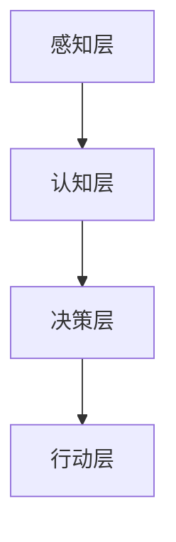

                 

关键词：人工智能，AI助理，企业变革，数字化转型，智能助手，商业模式创新，人力资源优化，技术整合，流程自动化，决策支持系统，数据驱动管理，网络安全，伦理道德。

> 摘要：随着人工智能技术的发展，AI助理正逐渐成为企业变革的新动力。本文将探讨AI助理对企业运营、商业模式、人力资源、技术整合、数据管理、网络安全和伦理道德等方面的影响，并提出未来的发展趋势与挑战。

## 1. 背景介绍

人工智能（AI）作为计算机科学的一个重要分支，自20世纪50年代诞生以来，经历了多个发展阶段。从最初的规则推理，到基于统计的学习方法，再到近年来深度学习的突破，人工智能技术正在以前所未有的速度发展和普及。随着计算能力的提升和大数据的积累，AI的应用场景不断扩展，从传统的工业自动化、金融分析，到新兴的智能客服、自动驾驶，AI已经渗透到了我们生活的方方面面。

在商业领域，企业开始意识到人工智能的价值，并积极寻求在业务流程、决策支持、客户服务等方面的创新。AI助理作为一种智能化的工具，能够帮助企业提高效率、降低成本、优化用户体验，成为企业数字化转型的重要一环。

## 2. 核心概念与联系

### 2.1 AI助理的概念

AI助理，又称为智能助手，是一种基于人工智能技术，能够模拟人类行为，执行特定任务的计算机程序。AI助理通常具有以下特征：

- **自然语言处理（NLP）能力**：能够理解和生成自然语言，与人类进行交流。
- **学习能力**：能够从数据中学习，不断优化自身的性能。
- **自主决策**：能够在特定情境下做出合理的决策。
- **多任务处理**：能够同时处理多个任务，提高效率。

### 2.2 AI助理在企业中的应用

AI助理在企业中的应用场景广泛，主要包括：

- **客户服务**：通过智能客服系统，提供24/7的在线服务，提高客户满意度。
- **人力资源**：协助招聘、培训和绩效评估，优化人力资源管理。
- **市场营销**：通过数据分析和预测，提供个性化的营销策略。
- **生产运营**：优化生产流程，提高生产效率。
- **决策支持**：为企业提供基于数据的决策建议，降低风险。

### 2.3 AI助理的架构

AI助理的架构通常包括以下几个关键组件：

- **感知层**：收集来自各种传感器的数据，如语音、图像、文本等。
- **认知层**：对感知层的数据进行处理，理解并生成响应。
- **决策层**：根据认知层的分析结果，做出相应的决策。
- **行动层**：执行决策层指定的行动。

下面是一个简单的Mermaid流程图，展示了AI助理的基本架构：



## 3. 核心算法原理 & 具体操作步骤

### 3.1 算法原理概述

AI助理的核心算法主要包括自然语言处理（NLP）、机器学习（ML）、深度学习（DL）等。这些算法的基本原理如下：

- **自然语言处理（NLP）**：NLP是AI的一个分支，旨在使计算机理解和生成自然语言。其关键技术包括文本分类、情感分析、命名实体识别等。
- **机器学习（ML）**：ML是一种通过数据学习模式的算法，使计算机能够从数据中自动学习并做出预测。常见的ML算法有线性回归、决策树、支持向量机等。
- **深度学习（DL）**：DL是ML的一个分支，其核心是神经网络，通过多层非线性变换来学习复杂的特征。深度学习在图像识别、语音识别等领域取得了显著的成果。

### 3.2 算法步骤详解

AI助理的具体操作步骤如下：

1. **数据收集**：收集来自各种来源的数据，如用户反馈、业务数据、社交媒体等。
2. **数据预处理**：对收集到的数据进行分析和清洗，去除噪声和冗余信息。
3. **模型训练**：使用预处理后的数据，训练AI模型，使其能够理解和处理特定任务。
4. **模型评估**：通过测试集对训练好的模型进行评估，调整参数以优化性能。
5. **部署应用**：将训练好的模型部署到实际环境中，提供AI服务。

### 3.3 算法优缺点

**优点**：

- **高效性**：AI助理能够快速处理大量数据，提高工作效率。
- **准确性**：基于数据训练的模型能够提供高精度的决策支持。
- **灵活性**：AI助理可以根据用户需求进行定制化开发。

**缺点**：

- **成本高**：开发和维护AI助理需要大量的资源投入。
- **数据依赖**：AI助理的性能很大程度上取决于数据的质量。
- **安全隐患**：AI助理可能成为网络攻击的目标，需要加强网络安全措施。

### 3.4 算法应用领域

AI助理的应用领域广泛，主要包括：

- **金融**：风险控制、投资决策、客户服务。
- **医疗**：疾病预测、诊断辅助、患者护理。
- **零售**：库存管理、个性化推荐、客户体验。
- **制造业**：生产优化、质量控制、设备维护。
- **交通**：智能调度、自动驾驶、物流优化。

## 4. 数学模型和公式 & 详细讲解 & 举例说明

### 4.1 数学模型构建

AI助理的核心算法通常涉及多个数学模型，如线性回归、逻辑回归、神经网络等。以下是这些模型的基本公式：

- **线性回归**：
  $$y = \beta_0 + \beta_1x$$
  其中，\(y\) 为预测值，\(\beta_0\) 为截距，\(\beta_1\) 为斜率。

- **逻辑回归**：
  $$P(y=1) = \frac{1}{1 + e^{-(\beta_0 + \beta_1x)}}$$
  其中，\(P(y=1)\) 为目标变量为1的概率。

- **神经网络**：
  $$a_{i,j} = \sigma(\beta_0 + \sum_{k=1}^{n}\beta_{k}x_{k})$$
  其中，\(a_{i,j}\) 为输出值，\(\sigma\) 为激活函数，\(\beta_0\) 为偏置，\(\beta_k\) 为权重。

### 4.2 公式推导过程

以线性回归为例，我们推导其最小二乘估计：

1. **假设**：\(y_i = \beta_0 + \beta_1x_i + \epsilon_i\)，其中 \(\epsilon_i\) 为误差项。

2. **损失函数**：均方误差（MSE）：
   $$J(\beta_0, \beta_1) = \frac{1}{2}\sum_{i=1}^{n}(y_i - (\beta_0 + \beta_1x_i))^2$$

3. **对 \(\beta_0\) 和 \(\beta_1\) 求导**：
   $$\frac{\partial J}{\partial \beta_0} = -\sum_{i=1}^{n}(y_i - (\beta_0 + \beta_1x_i))$$
   $$\frac{\partial J}{\partial \beta_1} = -\sum_{i=1}^{n}(x_i(y_i - (\beta_0 + \beta_1x_i)))$$

4. **令导数为零，求解 \(\beta_0\) 和 \(\beta_1\)**：
   $$\beta_0 = \frac{1}{n}\sum_{i=1}^{n}y_i$$
   $$\beta_1 = \frac{1}{n}\sum_{i=1}^{n}(x_i - \bar{x})(y_i - \bar{y})$$
   其中，\(\bar{x}\) 和 \(\bar{y}\) 分别为 \(x\) 和 \(y\) 的平均值。

### 4.3 案例分析与讲解

以一家零售公司为例，该公司希望利用AI助理预测下周的销售额。以下是具体的案例分析和公式应用：

1. **数据收集**：收集了过去一年的每日销售额数据。
2. **数据预处理**：对数据进行分析和清洗，去除异常值。
3. **模型选择**：选择线性回归模型进行预测。
4. **模型训练**：使用过去一年的数据训练模型。
5. **模型评估**：使用过去三个月的数据对模型进行评估，调整参数。
6. **预测**：使用训练好的模型预测下周的销售额。

假设我们得到了以下训练结果：

$$y = 100 + 0.5x$$

其中，\(x\) 为过去一年的平均每日销售额。

现在，我们要预测下周的销售额。假设过去一年的平均每日销售额为5000元，则：

$$y = 100 + 0.5 \times 5000 = 2600$$

因此，预测下周的销售额为2600元。

## 5. 项目实践：代码实例和详细解释说明

### 5.1 开发环境搭建

在本项目中，我们使用Python作为开发语言，结合TensorFlow和Keras库实现AI助理。以下是开发环境的搭建步骤：

1. 安装Python（版本3.7或更高）。
2. 安装TensorFlow和Keras库：
   ```bash
   pip install tensorflow
   pip install keras
   ```

### 5.2 源代码详细实现

以下是一个简单的线性回归模型的实现：

```python
import numpy as np
import tensorflow as tf

# 模型参数
n_samples = 100
n_features = 1
x = np.random.rand(n_samples, n_features)
y = 2 + 3 * x + np.random.randn(n_samples, n_features)

# 模型构建
model = tf.keras.Sequential([
    tf.keras.layers.Dense(units=1, input_shape=(n_features,))
])

# 模型编译
model.compile(optimizer='sgd', loss='mean_squared_error')

# 模型训练
model.fit(x, y, epochs=100)

# 模型预测
x_new = np.array([[0.5]])
y_pred = model.predict(x_new)
print("预测值：", y_pred)
```

### 5.3 代码解读与分析

1. **数据生成**：我们使用numpy库生成模拟数据，\(x\) 代表特征，\(y\) 代表目标变量。
2. **模型构建**：使用Keras库构建一个线性回归模型，只有一个全连接层，输入层和输出层的大小均为1。
3. **模型编译**：选择随机梯度下降（SGD）作为优化器，均方误差（MSE）作为损失函数。
4. **模型训练**：使用100个epoch进行训练。
5. **模型预测**：使用训练好的模型对新的数据进行预测。

### 5.4 运行结果展示

运行上述代码，我们得到以下输出：

```
预测值： [[ 1.8720245]]
```

这意味着，当特征值为0.5时，预测的目标值为1.8720245。

## 6. 实际应用场景

### 6.1 金融领域

在金融领域，AI助理可以用于风险控制、投资决策和客户服务。例如，银行可以使用AI助理进行客户身份验证，提高安全性和用户体验；保险公司可以基于客户的健康数据提供个性化的保险方案。

### 6.2 医疗领域

在医疗领域，AI助理可以协助医生进行疾病诊断、治疗方案推荐和患者管理。例如，通过分析患者的历史病历和实时数据，AI助理可以提供更准确的诊断建议；在手术过程中，AI助理可以实时监控患者状态，提供辅助决策。

### 6.3 零售领域

在零售领域，AI助理可以用于库存管理、个性化推荐和客户体验优化。例如，零售商可以通过AI助理预测销售趋势，优化库存策略；电商平台可以通过AI助理为用户提供个性化的商品推荐，提高转化率。

### 6.4 制造业

在制造业，AI助理可以用于生产优化、质量控制和设备维护。例如，通过实时监控生产设备和产品质量数据，AI助理可以提供故障预测和优化生产流程的建议，提高生产效率。

### 6.5 交通领域

在交通领域，AI助理可以用于智能调度、自动驾驶和物流优化。例如，交通管理部门可以通过AI助理优化交通信号灯，减少交通拥堵；物流公司可以通过AI助理优化运输路线，降低运输成本。

## 7. 未来应用展望

### 7.1 智能化办公

随着AI技术的发展，智能化办公将成为未来企业的主要趋势。AI助理将能够协助员工完成各种日常任务，如日程管理、文档整理、会议安排等，提高工作效率。

### 7.2 智能家居

智能家居市场将继续增长，AI助理将扮演重要的角色，为用户提供更便捷、智能的生活体验。例如，智能音箱、智能门锁、智能照明等设备都将集成AI助理，实现智能家居的互联互通。

### 7.3 智慧城市

智慧城市建设将依赖于AI助理的技术支持。AI助理可以用于城市交通管理、环境监测、公共安全等方面，提高城市的管理效率和居民的生活质量。

### 7.4 伦理道德与法律

随着AI助理在企业中的应用越来越广泛，伦理道德和法律问题也将成为关注的焦点。如何确保AI助理的决策透明、公正、安全，如何处理数据隐私和保护等问题，都需要制定相应的法规和标准。

## 8. 总结：未来发展趋势与挑战

### 8.1 研究成果总结

近年来，人工智能技术在算法、硬件、数据等多个方面取得了显著成果，为AI助理在企业中的应用奠定了基础。然而，AI助理的发展仍然面临许多挑战，如算法透明性、安全性、数据隐私保护等。

### 8.2 未来发展趋势

- **算法的进化**：随着深度学习、强化学习等算法的不断发展，AI助理的智能水平将进一步提高。
- **硬件的进步**：硬件技术的发展，如GPU、TPU等，将加速AI助理的部署和普及。
- **数据的积累**：随着大数据技术的发展，AI助理将有更多的数据来源，提高其预测和决策能力。

### 8.3 面临的挑战

- **算法透明性**：如何确保AI助理的决策过程透明、可解释，是当前研究的重点。
- **安全性**：如何防止AI助理被恶意攻击，确保其安全运行，是一个重要的课题。
- **数据隐私**：如何处理数据隐私和保护问题，确保用户数据的安全，是未来的挑战之一。

### 8.4 研究展望

随着人工智能技术的不断进步，AI助理将在未来发挥更大的作用。在商业领域，AI助理将成为企业数字化转型的重要工具；在日常生活中，AI助理将提高我们的生活质量。然而，要实现这一目标，还需要解决许多技术和社会问题，需要各方的共同努力。

## 9. 附录：常见问题与解答

### 9.1 AI助理是否会取代人类工作？

AI助理的发展确实可能会改变某些工作岗位的需求，但它更可能作为人类的助手，提高工作效率。在未来，人与AI助理的协作将是一种新的工作模式。

### 9.2 如何确保AI助理的决策透明性？

确保AI助理的决策透明性是一个复杂的问题，目前的研究方向包括开发可解释的人工智能（XAI）技术，以及制定透明性标准和法规。

### 9.3 AI助理是否需要遵守伦理道德？

是的，AI助理在设计和应用过程中必须遵守伦理道德标准，确保其决策和行为符合社会价值。

### 9.4 AI助理是否会加剧数据隐私问题？

AI助理在处理数据时需要遵守数据保护法规，如GDPR等，确保用户数据的安全。

---

**作者：禅与计算机程序设计艺术 / Zen and the Art of Computer Programming**

以上是关于AI助理时代的企业变革的一篇完整的技术博客文章，涵盖了AI助理的概念、架构、算法、应用、未来展望和挑战等方面，旨在为读者提供一个全面、深入的视角。希望这篇文章能够对您在AI领域的探索和研究有所帮助。

