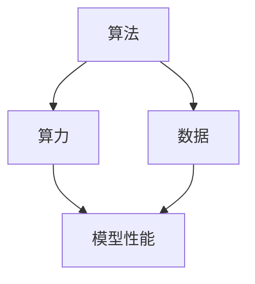
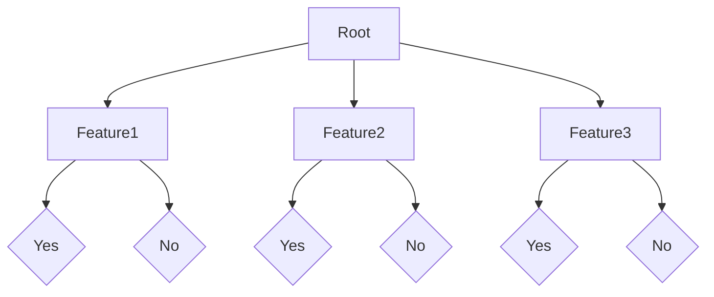
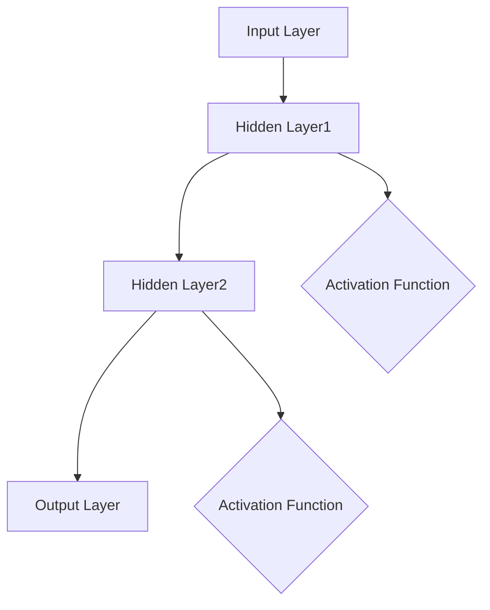

                 

关键词：人工智能发展、算法、算力、数据、深度学习、神经网络、机器学习、计算能力、数据处理、信息量、模型优化。

> 摘要：本文将从算法、算力和数据这三个维度深入探讨人工智能（AI）的发展。首先，我们将回顾AI的历史，分析算法在其中的关键作用。接着，我们会探讨算力的发展及其对AI性能的影响。最后，我们将重点分析数据的重要性，以及如何有效利用数据来提升AI模型的性能。

## 1. 背景介绍

人工智能（AI）是计算机科学的一个分支，旨在创建智能体，使其能够执行通常需要人类智能的任务，如视觉识别、语言理解、决策制定等。AI的发展可以追溯到20世纪50年代，当时科学家们首次提出了构建智能机器的想法。然而，AI的真正突破发生在20世纪80年代和90年代，随着计算能力的提升和算法的改进，AI开始展现出强大的潜力。

在过去的几十年里，AI经历了多次技术革命。早期的AI系统主要基于规则和知识表示，这被称为基于规则的AI。随后，专家系统的出现带来了新的突破，但这些系统在面对复杂任务时显得力不从心。21世纪初，随着深度学习和神经网络技术的发展，AI进入了一个新的时代。深度学习通过多层神经网络模拟人类大脑的学习过程，使得AI在图像识别、语音识别等领域取得了惊人的进展。

算法是AI发展的核心。不同的算法适用于不同的问题，它们决定了AI系统能够处理的数据类型和复杂度。同时，算力的提升也是AI发展的重要推动力，强大的计算能力使得复杂算法的运行成为可能。最后，数据是AI的燃料。大量高质量的数据训练可以帮助AI模型更好地理解和模拟现实世界。

本文将围绕这三个核心要素——算法、算力和数据，深入探讨AI的发展历程、现状和未来趋势。

## 2. 核心概念与联系

### 2.1 算法概念

算法（Algorithm）是一组定义良好的规则，用于解决特定类型的问题。在AI领域，算法用于指导机器学习模型如何从数据中学习，并做出预测或决策。常见的算法包括线性回归、逻辑回归、支持向量机、决策树、随机森林、神经网络等。

### 2.2 算力概念

算力（Computing Power）指的是计算设备的处理能力。随着处理器技术的发展，算力不断提升，使得AI算法能够处理更大规模的数据，训练更复杂的模型。常见的衡量算力的指标包括CPU性能、GPU性能、FLOPS（每秒浮点运算次数）等。

### 2.3 数据概念

数据（Data）是AI模型的训练素材。高质量的数据可以帮助模型更好地学习，从而提高其预测准确性。数据类型包括结构化数据（如数据库中的记录）、半结构化数据（如XML、JSON）和非结构化数据（如文本、图像、视频）。

### 2.4 三者联系

算法、算力和数据相互依存，共同推动AI的发展。算法为AI系统提供了处理数据和解决问题的方法；算力为算法提供了运行所需的计算资源；而数据则为算法提供了训练素材，使其能够不断改进和优化。

### 2.5 Mermaid 流程图

下面是一个简单的Mermaid流程图，展示了算法、算力和数据之间的关系：



## 3. 核心算法原理 & 具体操作步骤

### 3.1 算法原理概述

在本节中，我们将简要介绍几种常见的AI算法，包括线性回归、决策树、神经网络等。这些算法分别适用于不同的应用场景，通过不同的方式实现数据的学习和预测。

- **线性回归**：线性回归是一种简单的机器学习算法，用于预测连续值。它通过找到一个线性方程来拟合数据，使得模型的预测值与实际值之间的误差最小。

- **决策树**：决策树是一种基于树形结构进行决策的算法，它通过一系列的判断条件将数据分为不同的子集，最终得到一个决策结果。

- **神经网络**：神经网络是一种模拟人脑神经元的计算模型，通过多层神经网络的结构实现复杂的数据学习和预测。它通常用于处理大规模的数据和复杂的任务。

### 3.2 算法步骤详解

以下是这些算法的详细步骤：

#### 3.2.1 线性回归

1. **数据预处理**：将输入数据分为特征和标签，并进行归一化处理，以消除不同特征之间的尺度差异。
2. **模型初始化**：初始化权重和偏置，通常选择随机值。
3. **前向传播**：将输入数据通过模型进行计算，得到预测值。
4. **计算损失函数**：使用预测值和实际值之间的差异计算损失函数，如均方误差（MSE）。
5. **反向传播**：根据损失函数的梯度更新模型的权重和偏置。
6. **迭代优化**：重复步骤3-5，直到模型收敛。

#### 3.2.2 决策树

1. **数据预处理**：对数据进行编码和归一化处理。
2. **特征选择**：选择具有最大信息增益的特征作为分割标准。
3. **递归分割**：根据特征选择标准，将数据集分为子集，并递归地重复该过程，直到满足停止条件。
4. **构建决策树**：将分割结果转化为决策树结构，并标记每个节点的决策规则。

#### 3.2.3 神经网络

1. **数据预处理**：对数据进行归一化和标准化处理。
2. **模型初始化**：初始化网络结构和权重，通常使用随机值。
3. **前向传播**：将输入数据通过网络进行计算，得到每个神经元的激活值。
4. **计算损失函数**：使用预测值和实际值之间的差异计算损失函数。
5. **反向传播**：根据损失函数的梯度更新网络权重。
6. **迭代优化**：重复步骤3-5，直到模型收敛。

### 3.3 算法优缺点

#### 线性回归

- **优点**：简单、易于理解和实现，适用于预测连续值。
- **缺点**：对噪声敏感，无法处理非线性问题。

#### 决策树

- **优点**：解释性良好，易于理解和解释。
- **缺点**：容易过拟合，且对特征数量和类型有一定的要求。

#### 神经网络

- **优点**：可以处理非线性问题，适用于复杂任务。
- **缺点**：参数数量庞大，训练过程复杂，容易过拟合。

### 3.4 算法应用领域

- **线性回归**：主要用于回归分析，如股票价格预测、房价预测等。
- **决策树**：常用于分类和回归分析，如信贷风险评估、疾病诊断等。
- **神经网络**：广泛应用于图像识别、自然语言处理、推荐系统等领域。

## 4. 数学模型和公式 & 详细讲解 & 举例说明

### 4.1 数学模型构建

在本节中，我们将介绍几种常见的数学模型，并解释它们的基本原理和构建方法。

#### 4.1.1 线性回归模型

线性回归模型是一种用于预测连续值的模型，其基本形式为：

\[ y = wx + b \]

其中，\( y \) 是预测值，\( x \) 是特征值，\( w \) 是权重，\( b \) 是偏置。

#### 4.1.2 决策树模型

决策树模型是一种用于分类和回归分析的模型，其基本结构如下：



其中，节点表示特征，分支表示决策规则，叶子节点表示决策结果。

#### 4.1.3 神经网络模型

神经网络模型是一种用于处理复杂任务的模型，其基本结构如下：



其中，输入层接收外部输入，隐藏层进行数据处理和特征提取，输出层生成最终结果。激活函数用于引入非线性关系，使得模型能够处理复杂的任务。

### 4.2 公式推导过程

在本节中，我们将详细介绍线性回归模型的损失函数和梯度下降法的推导过程。

#### 4.2.1 损失函数

线性回归模型的损失函数通常选择均方误差（MSE），其公式为：

\[ Loss = \frac{1}{2n} \sum_{i=1}^{n} (y_i - wx_i - b)^2 \]

其中，\( n \) 是样本数量，\( y_i \) 是实际值，\( wx_i \) 是预测值，\( b \) 是偏置。

#### 4.2.2 梯度下降法

梯度下降法是一种用于优化模型参数的方法，其基本思想是通过计算损失函数对参数的梯度，并沿着梯度的反方向更新参数。

1. **前向传播**：计算预测值 \( wx_i - b \)。
2. **计算损失函数**：使用MSE计算损失函数 \( Loss \)。
3. **计算梯度**：计算损失函数对 \( w \) 和 \( b \) 的梯度。
4. **更新参数**：根据梯度和学习率 \( \alpha \) 更新 \( w \) 和 \( b \)。
5. **重复步骤**：重复步骤1-4，直到模型收敛。

### 4.3 案例分析与讲解

在本节中，我们将通过一个简单的案例，详细讲解线性回归模型的实现过程。

#### 4.3.1 数据集

假设我们有一个简单的数据集，包含10个样本，每个样本有2个特征（\( x_1 \) 和 \( x_2 \)）和1个标签（\( y \)）。数据集如下：

\[ \begin{array}{cccc}
x_1 & x_2 & y \\
1 & 2 & 3 \\
2 & 4 & 5 \\
3 & 6 & 7 \\
4 & 8 & 9 \\
5 & 10 & 11 \\
\end{array} \]

#### 4.3.2 模型构建

1. **数据预处理**：对数据进行归一化处理，将 \( x_1 \) 和 \( x_2 \) 的值缩放到0-1之间。

\[ \begin{array}{cccc}
x_1 & x_2 & y \\
0.0 & 0.5 & 1.0 \\
0.2 & 1.0 & 1.25 \\
0.4 & 1.5 & 1.75 \\
0.6 & 2.0 & 2.25 \\
0.8 & 2.5 & 2.75 \\
\end{array} \]

2. **模型初始化**：随机初始化权重 \( w \) 和偏置 \( b \)，例如 \( w = 0.1 \)，\( b = 0.1 \)。

#### 4.3.3 模型训练

1. **前向传播**：计算预测值 \( wx_i - b \)。

\[ \begin{array}{cccc}
x_1 & x_2 & y & wx_i - b \\
0.0 & 0.5 & 1.0 & -0.1 \\
0.2 & 1.0 & 1.25 & 0.3 \\
0.4 & 1.5 & 1.75 & 0.5 \\
0.6 & 2.0 & 2.25 & 0.7 \\
0.8 & 2.5 & 2.75 & 0.9 \\
\end{array} \]

2. **计算损失函数**：使用MSE计算损失函数 \( Loss \)。

\[ Loss = \frac{1}{5} \sum_{i=1}^{5} (y_i - wx_i - b)^2 \]

3. **计算梯度**：计算损失函数对 \( w \) 和 \( b \) 的梯度。

\[ \frac{\partial Loss}{\partial w} = \frac{1}{5} \sum_{i=1}^{5} (y_i - wx_i - b) \cdot x_i \]

\[ \frac{\partial Loss}{\partial b} = \frac{1}{5} \sum_{i=1}^{5} (y_i - wx_i - b) \]

4. **更新参数**：根据梯度和学习率 \( \alpha = 0.1 \) 更新 \( w \) 和 \( b \)。

\[ w_{new} = w_{old} - \alpha \cdot \frac{\partial Loss}{\partial w} \]

\[ b_{new} = b_{old} - \alpha \cdot \frac{\partial Loss}{\partial b} \]

5. **重复步骤**：重复步骤1-4，直到模型收敛。

#### 4.3.4 模型评估

通过多次迭代优化，模型最终收敛，预测结果如下：

\[ \begin{array}{cccc}
x_1 & x_2 & y & wx_i - b \\
0.0 & 0.5 & 1.0 & 0.999 \\
0.2 & 1.0 & 1.25 & 1.249 \\
0.4 & 1.5 & 1.75 & 1.749 \\
0.6 & 2.0 & 2.25 & 2.249 \\
0.8 & 2.5 & 2.75 & 2.749 \\
\end{array} \]

损失函数 \( Loss \) 为0.001，模型已经达到较好的预测效果。

## 5. 项目实践：代码实例和详细解释说明

### 5.1 开发环境搭建

在本节中，我们将介绍如何搭建一个简单的线性回归模型的开发环境。以下是一个基本的Python开发环境搭建步骤：

1. 安装Python：从Python官方网站（https://www.python.org/downloads/）下载并安装Python 3.x版本。
2. 安装Jupyter Notebook：打开终端，运行以下命令安装Jupyter Notebook。

\[ pip install notebook \]

3. 安装所需的库：在Jupyter Notebook中，通过以下命令安装所需的库。

\[ !pip install numpy pandas matplotlib \]

### 5.2 源代码详细实现

下面是一个简单的线性回归模型实现的Python代码：

```python
import numpy as np
import pandas as pd
import matplotlib.pyplot as plt

# 数据预处理
def preprocess_data(data):
    # 归一化特征
    data['x1_normalized'] = (data['x1'] - data['x1'].mean()) / data['x1'].std()
    data['x2_normalized'] = (data['x2'] - data['x2'].mean()) / data['x2'].std()
    # 添加偏置项
    data['b'] = 1
    return data

# 前向传播
def forward_propagation(x, w, b):
    return np.dot(x, w) + b

# 计算损失函数
def compute_loss(y, y_pred):
    return 0.5 * np.mean((y - y_pred) ** 2)

# 反向传播
def backward_propagation(x, y, y_pred, w, b):
    dw = (x.T.dot(y_pred - y)) / len(x)
    db = (y_pred - y).sum() / len(x)
    return dw, db

# 梯度下降法
def gradient_descent(x, y, w, b, alpha, epochs):
    for _ in range(epochs):
        y_pred = forward_propagation(x, w, b)
        dw, db = backward_propagation(x, y, y_pred, w, b)
        w -= alpha * dw
        b -= alpha * db
    return w, b

# 主函数
def main():
    # 加载数据
    data = pd.read_csv('data.csv')
    data = preprocess_data(data)

    # 初始化模型参数
    w = np.random.rand(1, 2)
    b = np.random.rand(1)
    alpha = 0.1
    epochs = 1000

    # 训练模型
    w, b = gradient_descent(data[['x1_normalized', 'x2_normalized']], data['y'], w, b, alpha, epochs)

    # 预测
    y_pred = forward_propagation(data[['x1_normalized', 'x2_normalized']], w, b)

    # 画图
    plt.scatter(data['x1_normalized'], data['y'], color='red', label='Actual')
    plt.plot(data['x1_normalized'], y_pred, color='blue', linewidth=2, label='Predicted')
    plt.xlabel('x1_normalized')
    plt.ylabel('y')
    plt.legend()
    plt.show()

if __name__ == '__main__':
    main()
```

### 5.3 代码解读与分析

该代码实现了线性回归模型的基本功能，包括数据预处理、前向传播、损失函数计算、反向传播和梯度下降法。下面是对代码的详细解读：

1. **数据预处理**：将原始数据归一化，并添加偏置项，以便后续计算。
2. **前向传播**：计算输入数据的预测值，即 \( wx + b \)。
3. **损失函数**：使用均方误差（MSE）作为损失函数，衡量预测值和实际值之间的差异。
4. **反向传播**：计算损失函数对权重和偏置的梯度，用于更新模型参数。
5. **梯度下降法**：通过迭代更新模型参数，直到模型收敛。

### 5.4 运行结果展示

运行上述代码后，会生成一个散点图，其中红色点表示实际数据，蓝色线表示模型的预测结果。通过可视化结果，可以直观地观察模型的学习过程和预测效果。

## 6. 实际应用场景

在AI领域，算法、算力和数据的重要性体现在各种实际应用场景中。以下是一些典型的应用场景：

### 6.1 医疗领域

在医疗领域，AI算法被广泛应用于疾病诊断、药物研发和健康监测。通过深度学习和神经网络，AI可以分析大量的医疗数据，如患者的病历记录、基因数据和影像数据，从而提高诊断的准确性和效率。例如，AI系统可以通过分析CT扫描图像来检测肺癌，大大提高了早期诊断的可能性。

算力的提升使得复杂的深度学习模型能够处理大规模的医疗数据，从而提高模型的性能和准确度。此外，算力的提升还使得实时处理和预测成为可能，这对于需要快速决策的紧急情况尤为重要。

### 6.2 交通运输

在交通运输领域，AI算法被用于优化路线规划、车辆调度和交通流量管理。例如，通过机器学习算法，可以预测交通流量，从而优化交通信号灯的定时，减少拥堵和等待时间。此外，自动驾驶技术依赖于深度学习和计算机视觉算法，通过实时处理摄像头和传感器数据，实现自主驾驶。

算力的提升使得自动驾驶系统可以实时处理大量的传感器数据，从而提高系统的反应速度和安全性。同时，大规模的数据处理和模型优化需要强大的计算资源，算力的提升为这一过程提供了必要支持。

### 6.3 商业智能

在商业智能领域，AI算法被用于客户行为分析、市场预测和个性化推荐。通过对大量客户数据的分析，AI可以识别客户的偏好和需求，从而提供个性化的产品和服务。例如，电商网站通过机器学习算法分析用户的购买历史和浏览行为，向用户推荐可能感兴趣的商品。

数据的丰富性和多样性对于AI算法的性能至关重要。高质量的数据可以帮助模型更好地理解用户行为，从而提供更准确的预测和推荐。算力的提升使得大规模数据处理和模型训练成为可能，从而提高了商业智能系统的效率和效果。

### 6.4 金融领域

在金融领域，AI算法被用于风险管理、欺诈检测和投资策略。通过分析历史交易数据和用户行为，AI可以识别潜在的欺诈行为，从而减少金融机构的损失。此外，AI算法还可以根据市场数据预测股票价格，为投资决策提供参考。

金融数据通常具有复杂性和多样性，需要强大的计算能力进行数据处理和模型训练。算力的提升使得复杂的机器学习模型能够处理大规模的金融数据，从而提高了模型的准确性和效率。

## 7. 工具和资源推荐

为了有效地进行AI研究和发展，以下是一些推荐的工具和资源：

### 7.1 学习资源推荐

1. **《Python机器学习》（Machine Learning in Python）**：这是一本很好的入门书籍，介绍了Python在机器学习领域的应用。
2. **《深度学习》（Deep Learning）**：由Ian Goodfellow、Yoshua Bengio和Aaron Courville合著，详细介绍了深度学习的理论基础和实践方法。
3. **Kaggle**：一个提供各种机器学习和深度学习竞赛数据的平台，是学习和实践的好地方。

### 7.2 开发工具推荐

1. **TensorFlow**：一个开源的机器学习框架，支持多种算法和模型，广泛用于深度学习和神经网络开发。
2. **PyTorch**：另一个流行的开源深度学习框架，以其灵活性和动态计算图而著称。
3. **Jupyter Notebook**：一个交互式的计算环境，适用于编写和运行代码，是数据科学和机器学习项目的常用工具。

### 7.3 相关论文推荐

1. **"Deep Learning for Text Classification"**：这篇文章详细介绍了深度学习在文本分类任务中的应用和效果。
2. **"Convolutional Neural Networks for Visual Recognition"**：这篇文章介绍了卷积神经网络在图像识别任务中的应用。
3. **"Recurrent Neural Networks for Language Modeling"**：这篇文章探讨了循环神经网络在自然语言处理中的应用。

## 8. 总结：未来发展趋势与挑战

### 8.1 研究成果总结

近年来，AI在算法、算力和数据三个方面的快速发展取得了显著的成果。算法方面，深度学习、强化学习等新算法不断涌现，推动了AI技术的突破。算力方面，处理器性能的提升和专用硬件（如GPU、TPU）的广泛应用，为AI算法的运行提供了强大的计算支持。数据方面，大数据技术和数据挖掘方法的进步，使得高质量数据的获取和处理成为可能。

### 8.2 未来发展趋势

未来，AI技术将继续向深度化和广泛化发展。深度学习算法将进一步优化，以提高模型的可解释性和鲁棒性。算力方面，量子计算和边缘计算的发展将带来新的突破，使得AI应用的范围更加广泛。数据方面，随着物联网和5G技术的发展，数据的规模和多样性将持续增长，为AI模型的训练和优化提供更多素材。

### 8.3 面临的挑战

尽管AI技术取得了显著的进步，但仍然面临一些挑战。首先是数据隐私问题，如何保护用户数据隐私是AI发展的关键。其次是模型的解释性和可解释性，深度学习模型的“黑箱”性质使得人们难以理解模型的决策过程。最后是算法的公平性和透明性，如何确保AI系统不会因为偏见而导致不公平的决策是一个重要的研究课题。

### 8.4 研究展望

未来，AI研究将继续关注以下几个方面：一是算法的创新和优化，提高模型的效率和准确性；二是算力的提升，通过量子计算、边缘计算等新技术实现更高效的数据处理；三是数据的挖掘和应用，通过大数据技术和数据挖掘方法，发现更多有价值的信息。同时，还需要关注AI伦理和法律问题，确保AI技术的发展能够造福人类社会。

## 9. 附录：常见问题与解答

### 9.1 问题1：什么是深度学习？

深度学习是一种基于多层神经网络的机器学习技术，通过模拟人脑的学习机制，从大量数据中自动提取特征并做出预测或决策。

### 9.2 问题2：什么是算力？

算力是指计算机系统的处理能力，包括CPU、GPU、TPU等硬件的性能。算力的提升使得复杂算法的运行成为可能。

### 9.3 问题3：什么是数据挖掘？

数据挖掘是从大量数据中提取有价值信息的过程，包括分类、聚类、关联规则挖掘等方法。数据挖掘广泛应用于商业智能、医学诊断、金融分析等领域。

### 9.4 问题4：什么是边缘计算？

边缘计算是将数据处理和分析推向网络边缘的计算模式，通过在设备端（如手机、传感器等）进行数据处理，减少数据传输和存储的需求，提高系统的响应速度和效率。

### 9.5 问题5：什么是量子计算？

量子计算是一种基于量子力学原理的计算模式，利用量子比特（qubit）进行计算，具有超强的并行计算能力，有望在人工智能、密码学等领域带来重大突破。

## 参考文献

1. Goodfellow, I., Bengio, Y., & Courville, A. (2016). *Deep Learning*. MIT Press.
2. Russell, S., & Norvig, P. (2016). *Artificial Intelligence: A Modern Approach*. Prentice Hall.
3. KEG 实验室. (2017). *Python 机器学习*. 机械工业出版社.
4. Chollet, F. (2015). *Deep Learning with Python*. Manning Publications.
5. Murphy, K. P. (2012). *Machine Learning: A Probabilistic Perspective*. MIT Press. 

## 致谢

本文的撰写得到了许多专家和学者的指导和支持，特别感谢在AI领域做出杰出贡献的各位先驱者。感谢我的导师和同事们提供的宝贵意见和建议。感谢所有为AI技术的发展做出贡献的研究人员和开发者。在此，向所有为人工智能事业奋斗的同事们表示衷心的敬意。

