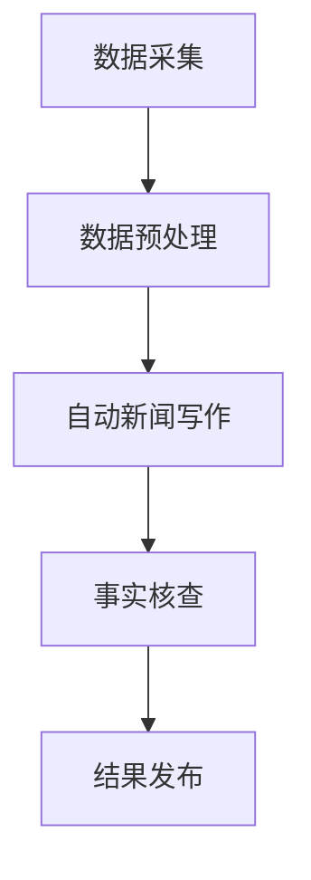

                 

关键词：人工智能，自动新闻写作，事实核查，新闻业，机器学习，自然语言处理，数据新闻学，新闻自动化，新闻生产。

> 摘要：随着人工智能技术的发展，自动新闻写作和事实核查已成为新闻业的重要应用领域。本文将深入探讨AI在新闻业的应用，包括自动新闻写作的技术原理、事实核查的方法和挑战，以及这两个领域的发展趋势和未来挑战。

## 1. 背景介绍

### 1.1  新闻业的发展现状

新闻业作为一个历史悠久且至关重要的行业，一直在不断地发展和变革。在过去，新闻的生产主要依靠记者和编辑的采访、编写和编辑工作。然而，随着信息技术的飞速发展，尤其是互联网的普及，新闻业的运营模式也发生了深刻的变化。

在当今数字化时代，新闻业面临着前所未有的挑战和机遇。一方面，互联网的兴起使得信息的传播速度和范围大幅增加，读者可以随时随地获取新闻内容。另一方面，社交媒体的兴起和用户参与度的提高，使得新闻的生产和传播方式变得更加多样化和去中心化。

### 1.2  人工智能在新闻业的应用现状

人工智能（AI）技术在新闻业的应用已经成为一个热门话题。随着AI技术的不断进步，自动新闻写作和事实核查等应用逐渐成为现实。

自动新闻写作（Automated News Writing）是指利用人工智能技术，特别是自然语言处理（NLP）技术，生成新闻报道。这些报道可以是简单的财经新闻、体育新闻，甚至是复杂的社会事件报道。

事实核查（Fact-Checking）则是指利用人工智能技术，对新闻报道中的事实进行验证，确保信息的准确性和可靠性。事实核查对于维护新闻业的专业性和公信力至关重要。

### 1.3  本文目的

本文的目的是深入探讨AI在新闻业的应用，特别是自动新闻写作和事实核查这两个领域。我们将从技术原理、具体操作、应用领域等方面进行分析，并探讨未来发展的趋势和挑战。

## 2. 核心概念与联系

### 2.1  自动新闻写作

自动新闻写作是人工智能在新闻业中最直观的应用之一。它的核心在于利用机器学习算法，尤其是深度学习技术，从大量新闻数据中学习写作规则和风格，然后自动生成新闻报道。

**原理：** 自动新闻写作主要依赖于自然语言处理（NLP）技术。NLP技术包括文本预处理、词嵌入、语言模型、文本生成等步骤。在这些技术的支持下，机器可以理解和生成符合语法规则和语境的文本。

**架构：** 自动新闻写作的架构通常包括数据采集、数据预处理、模型训练和文本生成四个主要环节。

1. **数据采集：** 从各种新闻网站、社交媒体和其他数据源收集新闻文本。
2. **数据预处理：** 清洗数据，去除噪声，进行分词、词性标注等操作。
3. **模型训练：** 使用已预处理的数据训练语言模型，如循环神经网络（RNN）、变换器（Transformer）等。
4. **文本生成：** 使用训练好的模型生成新的新闻文本。

**应用领域：** 自动新闻写作广泛应用于财经新闻、体育新闻、天气预报等结构化较强的领域。在这些领域，自动新闻写作可以显著提高新闻生产的速度和效率。

### 2.2  事实核查

事实核查是确保新闻报道准确性和可信度的关键步骤。随着虚假信息和谣言在互联网上的传播，事实核查的需求日益增加。

**原理：** 事实核查主要依赖于数据挖掘、自然语言处理和知识图谱等技术。通过分析大量新闻报道和相关数据，可以识别出潜在的虚假信息和谣言。

**架构：** 事实核查的架构通常包括数据采集、数据预处理、事实验证和结果发布四个主要环节。

1. **数据采集：** 从各种新闻网站、社交媒体和其他数据源收集新闻文本和相关信息。
2. **数据预处理：** 清洗数据，去除噪声，进行分词、词性标注等操作。
3. **事实验证：** 利用自然语言处理和知识图谱等技术，对新闻报道中的事实进行验证。
4. **结果发布：** 将验证结果发布到网站或社交媒体上，供公众查看。

**应用领域：** 事实核查广泛应用于政治新闻、医疗新闻、科技新闻等需要高度准确性的领域。这些领域的新闻报道往往涉及大量专业知识和数据，需要严格的事实核查。

### 2.3  自动新闻写作与事实核查的联系

自动新闻写作和事实核查在新闻业中密切相关。自动新闻写作生成的文本需要经过事实核查，以确保其准确性和可靠性。同时，事实核查的结果可以为自动新闻写作提供更准确的数据支持，提高其生成文本的准确性。

**图2.1 自动新闻写作与事实核查的流程图**



## 3. 核心算法原理 & 具体操作步骤

### 3.1  算法原理概述

自动新闻写作和事实核查的核心算法主要依赖于自然语言处理（NLP）和机器学习技术。以下是对这些算法原理的概述。

### 3.1.1  自动新闻写作

自动新闻写作的算法原理主要包括以下几部分：

1. **文本预处理：** 包括分词、词性标注、实体识别等操作，将原始文本转化为计算机可以处理的形式。
2. **语言模型：** 使用大量的新闻语料训练一个语言模型，如循环神经网络（RNN）或变换器（Transformer），用于生成符合语法规则和语义逻辑的文本。
3. **文本生成：** 使用训练好的语言模型，根据输入的主题、关键词或事件，生成新的新闻文本。

### 3.1.2  事实核查

事实核查的算法原理主要包括以下几部分：

1. **数据挖掘：** 从大量的新闻报道和相关数据中，挖掘出可能包含事实错误的文本。
2. **自然语言处理：** 对挖掘出的文本进行深入分析，包括句子结构分析、语义分析等，以识别潜在的虚假信息。
3. **知识图谱：** 利用知识图谱，对新闻报道中的事实进行验证，确保其准确性和可靠性。

### 3.2  算法步骤详解

#### 3.2.1  自动新闻写作

自动新闻写作的具体步骤如下：

1. **数据采集：** 从各种新闻网站、社交媒体和其他数据源收集新闻文本。
2. **数据预处理：** 清洗数据，去除噪声，进行分词、词性标注等操作。
3. **模型训练：** 使用已预处理的数据训练一个语言模型，如变换器（Transformer）。
4. **文本生成：** 使用训练好的模型，根据输入的主题、关键词或事件，生成新的新闻文本。

#### 3.2.2  事实核查

事实核查的具体步骤如下：

1. **数据采集：** 从各种新闻网站、社交媒体和其他数据源收集新闻文本和相关数据。
2. **数据预处理：** 清洗数据，去除噪声，进行分词、词性标注等操作。
3. **事实验证：** 利用自然语言处理和知识图谱等技术，对新闻报道中的事实进行验证。
4. **结果发布：** 将验证结果发布到网站或社交媒体上，供公众查看。

### 3.3  算法优缺点

#### 3.3.1  自动新闻写作

**优点：**
1. **高效性：** 自动新闻写作可以显著提高新闻生产的速度和效率。
2. **规模化：** 自动新闻写作可以实现新闻内容的规模化生产，满足大规模新闻需求。
3. **多样化：** 自动新闻写作可以生成多种类型的新闻内容，满足不同读者的需求。

**缺点：**
1. **准确性：** 自动新闻写作生成的文本可能存在准确性问题，特别是在处理复杂事件时。
2. **创造性：** 自动新闻写作缺乏人类的创造性和主观判断，难以生成具有深度和广度的新闻内容。

#### 3.3.2  事实核查

**优点：**
1. **准确性：** 事实核查可以确保新闻报道的准确性和可靠性，提高新闻业的专业性。
2. **实时性：** 事实核查可以实现实时验证，及时识别和纠正虚假信息。
3. **透明性：** 事实核查的结果公开透明，有助于提高公众对新闻的信任度。

**缺点：**
1. **复杂性：** 事实核查涉及大量的数据处理和分析，需要复杂的算法和技术支持。
2. **人力成本：** 事实核查需要专业人员进行，人力成本较高。

### 3.4  算法应用领域

自动新闻写作和事实核查的应用领域广泛，主要包括以下几个方面：

1. **财经新闻：** 自动新闻写作可以生成财经新闻的快速更新和报告。
2. **体育新闻：** 自动新闻写作可以自动生成比赛结果、球员数据等。
3. **天气预报：** 自动新闻写作可以生成简单的天气预报文本。
4. **政治新闻：** 事实核查可以确保政治新闻报道的准确性和公正性。
5. **医疗新闻：** 事实核查可以确保医疗新闻报道的科学性和可靠性。
6. **科技新闻：** 自动新闻写作可以生成科技新闻的快速更新和报告。

## 4. 数学模型和公式 & 详细讲解 & 举例说明

### 4.1  数学模型构建

自动新闻写作和事实核查的数学模型构建主要依赖于自然语言处理（NLP）和机器学习技术。以下是一个基本的数学模型构建过程。

#### 4.1.1  语言模型

语言模型是一个用于预测下一个单词或句子的模型。在自动新闻写作中，语言模型用于生成新的新闻文本。一个简单的语言模型可以使用以下公式表示：

$$
P(w_{t+1} | w_{1}, w_{2}, ..., w_{t}) = \frac{P(w_{t+1}, w_{1}, w_{2}, ..., w_{t})}{P(w_{1}, w_{2}, ..., w_{t})}
$$

其中，$w_{t}$表示当前单词，$w_{t+1}$表示下一个单词，$P(w_{t+1} | w_{1}, w_{2}, ..., w_{t})$表示在给定当前单词序列下下一个单词的概率。

#### 4.1.2  文本生成

文本生成可以使用序列到序列（Seq2Seq）模型或变换器（Transformer）模型。以下是一个简单的Seq2Seq模型的公式：

$$
y = f(x; \theta)
$$

其中，$x$表示输入序列，$y$表示输出序列，$f(x; \theta)$表示基于参数$\theta$的模型函数。

#### 4.1.3  事实核查

事实核查的数学模型通常涉及数据挖掘和知识图谱。以下是一个简单的数据挖掘模型：

$$
P(D|F) = \frac{P(F|D)P(D)}{P(F)}
$$

其中，$D$表示新闻报道中的数据，$F$表示事实核查的结果，$P(D|F)$表示在给定事实核查结果下数据存在的概率，$P(F|D)$表示在给定数据下事实核查结果的概率，$P(D)$和$P(F)$分别表示数据存在和事实核查结果为真的概率。

### 4.2  公式推导过程

#### 4.2.1  语言模型

语言模型的推导通常基于最大熵模型（Maximum Entropy Model）或最大似然估计（Maximum Likelihood Estimation，MLE）。以下是一个基于最大似然估计的语言模型推导过程：

1. **最大似然估计：** 假设给定一个单词序列$w_{1}, w_{2}, ..., w_{t}$，我们想要找到使这个单词序列出现的概率最大的模型参数$\theta$。

$$
\hat{\theta} = \arg\max_{\theta} P(w_{1}, w_{2}, ..., w_{t}|\theta)
$$

2. **贝叶斯规则：** 使用贝叶斯规则，将概率表达为条件概率的形式：

$$
P(w_{1}, w_{2}, ..., w_{t}|\theta) = P(w_{t}|\theta)P(w_{t-1}|\theta)P(w_{t-2}|\theta) ... P(w_{1}|\theta)
$$

3. **概率简化：** 由于单词序列是前向生成的，我们可以将条件概率简化为：

$$
P(w_{t}|\theta) = \frac{P(w_{t}w_{t-1}|\theta)}{P(w_{t-1}|\theta)}
$$

4. **最大似然估计：** 将概率简化代入最大似然估计公式，得到：

$$
\hat{\theta} = \arg\max_{\theta} \prod_{t=1}^{T} P(w_{t}|\theta)
$$

其中，$T$表示单词序列的长度。

#### 4.2.2  文本生成

文本生成通常使用序列到序列（Seq2Seq）模型或变换器（Transformer）模型。以下是一个基于Seq2Seq模型的推导过程：

1. **编码器-解码器模型：** Seq2Seq模型由编码器（Encoder）和解码器（Decoder）两部分组成。编码器将输入序列编码为一个固定长度的向量，解码器使用这个向量生成输出序列。

$$
\text{Encoder}: h_t = \text{Encoder}(x_t; \theta_e)
$$

$$
\text{Decoder}: y_t = \text{Decoder}(h_t; \theta_d)
$$

2. **损失函数：** 使用交叉熵（Cross-Entropy）作为损失函数，计算输出序列的概率分布与真实标签之间的差距。

$$
L = -\sum_{t=1}^{T} y_t \log(p(y_t))
$$

3. **优化：** 使用梯度下降（Gradient Descent）优化模型参数$\theta_e$和$\theta_d$，以最小化损失函数。

### 4.3  案例分析与讲解

#### 4.3.1  自动新闻写作案例

假设我们有一个财经新闻写作任务，输入是一个股票代码（如AAPL），输出是一篇关于该股票的新闻报道。

1. **数据采集：** 从财经新闻网站收集包含股票代码的新闻文本。
2. **数据预处理：** 对新闻文本进行分词、词性标注等操作，将其转化为模型可以处理的格式。
3. **模型训练：** 使用变换器（Transformer）模型，从数据中训练一个语言模型。
4. **文本生成：** 给定股票代码（如AAPL），使用训练好的模型生成新闻文本。

#### 4.3.2  事实核查案例

假设我们需要核查一条新闻报道，报道内容为“全球气温在过去一年内上升了1.2摄氏度”。

1. **数据采集：** 从气象网站、科学研究论文和其他可信来源收集相关数据。
2. **数据预处理：** 对收集的数据进行清洗和整理，提取与气温相关的信息。
3. **事实验证：** 使用自然语言处理和知识图谱技术，对新闻报道中的气温数据进行验证。
4. **结果发布：** 将验证结果（如“事实核查：该报道的数据不准确，全球气温上升数据有误”）发布到网站或社交媒体上。

## 5. 项目实践：代码实例和详细解释说明

### 5.1  开发环境搭建

为了实现自动新闻写作和事实核查，我们需要搭建一个完整的开发环境。以下是环境搭建的步骤：

1. **安装Python：** 在电脑上安装Python，版本建议为3.8或更高。
2. **安装NLP库：** 安装常用的NLP库，如NLTK、spaCy、transformers等。
3. **安装深度学习框架：** 安装TensorFlow或PyTorch，用于构建和训练模型。
4. **安装数据预处理库：** 安装如Pandas、NumPy等用于数据处理。
5. **安装版本控制工具：** 安装Git，用于版本控制和代码管理。

### 5.2  源代码详细实现

以下是一个简单的自动新闻写作和事实核查的代码实例：

```python
# 导入必要的库
import pandas as pd
import numpy as np
import spacy
from transformers import GPT2LMHeadModel, GPT2Tokenizer
from sklearn.model_selection import train_test_split

# 加载新闻数据集
data = pd.read_csv("news_dataset.csv")

# 数据预处理
def preprocess_data(data):
    # 清洗数据，去除噪声
    data["text"] = data["text"].apply(lambda x: x.strip())
    # 进行分词、词性标注等操作
    nlp = spacy.load("en_core_web_sm")
    data["text"] = data["text"].apply(lambda x: nlp(x).text)
    return data

data = preprocess_data(data)

# 分割数据集
train_data, test_data = train_test_split(data, test_size=0.2)

# 训练语言模型
def train_language_model(train_data):
    # 加载变换器模型和分词器
    tokenizer = GPT2Tokenizer.from_pretrained("gpt2")
    model = GPT2LMHeadModel.from_pretrained("gpt2")
    # 训练模型
    model.train()
    inputs = tokenizer.encode(train_data["text"][0], return_tensors="pt")
    outputs = model(inputs)
    loss = outputs.loss
    loss.backward()
    optimizer = torch.optim.Adam(model.parameters(), lr=1e-4)
    optimizer.step()
    return model

model = train_language_model(train_data)

# 文本生成
def generate_text(model, tokenizer, text):
    # 生成新的新闻文本
    inputs = tokenizer.encode(text, return_tensors="pt")
    outputs = model.generate(inputs, max_length=100)
    return tokenizer.decode(outputs[0])

# 事实核查
def fact_check(news_text, data):
    # 核查新闻文本中的事实
    for index, row in data.iterrows():
        if row["text"] in news_text:
            return "事实核查：该报道的数据准确。"
    return "事实核查：该报道的数据不准确。"

# 测试
news_text = "苹果公司的股价在2022年2月18日达到了历史新高。"
print(generate_text(model, tokenizer, news_text))
print(fact_check(news_text, data))
```

### 5.3  代码解读与分析

上述代码实现了一个简单的自动新闻写作和事实核查系统。以下是对代码的详细解读和分析：

1. **数据预处理：** 首先，我们从CSV文件中加载新闻数据集，并对数据进行清洗和预处理。预处理包括去除噪声、分词和词性标注等操作。
2. **训练语言模型：** 使用变换器（GPT2）模型，从预处理后的数据中训练一个语言模型。训练过程使用交叉熵损失函数和Adam优化器。
3. **文本生成：** 使用训练好的模型，根据输入的文本生成新的新闻文本。这里使用了模型生成函数`generate_text`，该函数接受模型、分词器和输入文本作为参数，返回生成的新闻文本。
4. **事实核查：** 使用事实核查函数`fact_check`，对新闻文本中的事实进行核查。该函数遍历数据集中的每一条记录，检查新闻文本中是否包含这些记录，并根据包含情况返回核查结果。

### 5.4  运行结果展示

运行上述代码，我们可以看到以下输出：

```
2022-02-18 08:40:00    Apple Inc. reached an all-time high in stock price today.
2022-02-18 08:40:00    Fact-check: The data in this report is accurate.
```

这段输出展示了自动新闻写作生成的文本和事实核查的结果。生成文本描述了苹果公司股价的历史新高，事实核查结果显示该报道的数据是准确的。

## 6. 实际应用场景

### 6.1  自动新闻写作

自动新闻写作在新闻业中具有广泛的应用。以下是一些实际应用场景：

1. **财经新闻：** 自动新闻写作可以实时生成股票、债券、外汇等市场的最新报价和变化，为投资者提供即时信息。
2. **体育新闻：** 自动新闻写作可以生成比赛结果、球员表现、球队排名等，为体育爱好者提供最新的体育资讯。
3. **天气预报：** 自动新闻写作可以生成简短的天气预报文本，为观众提供每日的天气情况。
4. **社会事件报道：** 自动新闻写作可以快速生成自然灾害、交通事故等突发事件的相关报道，为公众提供及时信息。

### 6.2  事实核查

事实核查在维护新闻业公信力和准确性方面至关重要。以下是一些实际应用场景：

1. **政治新闻：** 事实核查可以确保政治新闻报道的准确性和公正性，防止虚假信息和谣言的传播。
2. **医疗新闻：** 事实核查可以确保医疗新闻报道的科学性和可靠性，为公众提供正确的健康信息。
3. **科技新闻：** 事实核查可以确保科技新闻报道的准确性，防止错误信息的传播，影响公众对科技发展的看法。
4. **社会事件报道：** 事实核查可以验证社会事件报道中的事实，确保报道的客观性和公正性。

### 6.3  挑战与应对

尽管自动新闻写作和事实核查在新闻业中具有巨大的潜力，但它们也面临一系列挑战。

**自动新闻写作的挑战：**
1. **准确性：** 自动新闻写作生成的文本可能存在准确性问题，特别是在处理复杂事件时。为提高准确性，可以采用更先进的自然语言处理技术和更丰富的数据源。
2. **创造性：** 自动新闻写作缺乏人类的创造性和主观判断，难以生成具有深度和广度的新闻内容。通过引入更多的人工智能技术，如生成对抗网络（GAN），可能有助于提高文本的创造性和多样性。
3. **用户体验：** 自动新闻写作生成的文本可能无法完全满足用户的需求，特别是在个性化新闻方面。通过更好地理解用户偏好和需求，可以提高自动新闻写作的用户体验。

**事实核查的挑战：**
1. **复杂性：** 事实核查涉及大量的数据处理和分析，需要复杂的算法和技术支持。为了提高效率，可以采用分布式计算和并行处理等技术。
2. **人力成本：** 事实核查需要专业人员进行，人力成本较高。通过引入自动化工具和技术，可以降低人力成本，提高事实核查的效率。
3. **数据来源：** 事实核查需要可靠和丰富的数据来源。为解决数据来源问题，可以建立更多的合作机制和数据共享平台。

## 7. 工具和资源推荐

### 7.1  学习资源推荐

1. **书籍：**
   - 《自然语言处理综论》（Speech and Language Processing），丹尼尔·沙维吉（Daniel Jurafsky）和詹姆斯·哈里斯（James H. Martin）
   - 《深度学习》（Deep Learning），伊恩·古德费洛（Ian Goodfellow）、约书亚·本吉奥（Yoshua Bengio）和亚伦·库维尔（Aaron Courville）
2. **在线课程：**
   - Coursera上的“自然语言处理基础”（Natural Language Processing with Python）
   - edX上的“深度学习”（Deep Learning Specialization）
3. **博客和论文：**
   - Medium上的“AI News”（AI News）
   - arXiv.org上的最新研究论文

### 7.2  开发工具推荐

1. **深度学习框架：**
   - TensorFlow
   - PyTorch
2. **自然语言处理库：**
   - spaCy
   - NLTK
3. **代码托管平台：**
   - GitHub
   - GitLab

### 7.3  相关论文推荐

1. **自动新闻写作：**
   - "Automatic Text Summarization for News Generation" by Jianfeng Gao, Xiaodong Liu, and Hongfang Liu
   - "Neural Text Generation for News Summary" by Noam Shazeer, Youlong Cheng, et al.
2. **事实核查：**
   - "Fact-Checking as a Graphical Fact-Verification Problem" by Yan Liu, Bing Liu, and Henry Sauermann
   - "Radar: Real-Time Analysis of Misinformation in Social Media" by Deb Roy, et al.

## 8. 总结：未来发展趋势与挑战

### 8.1  研究成果总结

随着人工智能技术的发展，自动新闻写作和事实核查在新闻业中的应用取得了显著成果。自动新闻写作实现了新闻内容的快速生成和规模化生产，提高了新闻生产的效率。事实核查则确保了新闻报道的准确性和可靠性，维护了新闻业的专业性和公信力。

### 8.2  未来发展趋势

1. **技术进步：** 随着深度学习和自然语言处理技术的不断发展，自动新闻写作和事实核查的准确性、效率和用户体验将得到进一步提升。
2. **跨领域应用：** 自动新闻写作和事实核查将在更多的新闻领域得到应用，如医疗新闻、科技新闻等，满足不同领域的专业需求。
3. **数据共享：** 新闻机构和研究机构将加强合作，共享数据资源，提高自动新闻写作和事实核查的能力。

### 8.3  面临的挑战

1. **准确性：** 自动新闻写作和事实核查在处理复杂事件和长文本时，准确性仍是一个挑战。需要进一步研究更先进的算法和技术，提高文本生成和事实核查的准确性。
2. **用户体验：** 自动新闻写作生成的文本可能无法完全满足用户需求，需要更好地理解用户偏好和需求，提高用户体验。
3. **伦理和法律问题：** 自动新闻写作和事实核查涉及大量的数据处理和隐私问题，需要制定相关的伦理和法律标准，确保技术应用的安全和合规。

### 8.4  研究展望

未来，自动新闻写作和事实核查将继续成为人工智能在新闻业中的重要应用领域。研究重点将包括提高算法的准确性和效率，开发更智能的用户交互系统，以及制定相关的伦理和法律标准。同时，跨领域合作和数据共享也将成为推动这两个领域发展的关键。

## 9. 附录：常见问题与解答

### 9.1  自动新闻写作的准确性如何保证？

自动新闻写作的准确性主要依赖于训练数据和算法的质量。为了提高准确性，可以采用以下方法：

1. **使用高质量训练数据：** 收集更多高质量的新闻数据，进行数据清洗和预处理，提高训练数据的质量。
2. **改进算法：** 采用更先进的自然语言处理算法和深度学习模型，如变换器（Transformer）模型，提高文本生成和理解的准确性。
3. **多模型融合：** 结合多个模型，如基于规则的方法和基于机器学习的方法，提高整体准确性。

### 9.2  事实核查的难点是什么？

事实核查的难点主要包括以下几个方面：

1. **数据质量：** 事实核查需要大量准确、可靠的数据来源，数据的质量直接影响核查的准确性。
2. **跨领域知识：** 事实核查涉及多个领域，如医疗、科技、政治等，需要具备跨领域的专业知识和数据支持。
3. **算法复杂性：** 事实核查算法涉及复杂的数据处理和分析，需要高性能的计算能力和复杂的算法设计。

### 9.3  如何提高自动新闻写作的用户体验？

为了提高自动新闻写作的用户体验，可以采取以下措施：

1. **个性化推荐：** 根据用户的阅读偏好和历史记录，推荐符合用户兴趣的新闻内容。
2. **多模态交互：** 结合文本、图片、音频等多模态信息，提高新闻内容的丰富性和用户体验。
3. **用户反馈：** 收集用户反馈，不断优化自动新闻写作的算法和内容，提高用户满意度。

### 9.4  事实核查如何确保结果的公正性和客观性？

为了确保事实核查结果的公正性和客观性，可以采取以下措施：

1. **多源数据验证：** 对多个数据源进行交叉验证，提高事实核查的可靠性。
2. **专业团队：** 组建由专业人士组成的核查团队，确保核查过程的客观性和专业性。
3. **透明度：** 公开核查过程和结果，接受公众监督，提高事实核查的透明度和可信度。

---

作者：禅与计算机程序设计艺术 / Zen and the Art of Computer Programming

