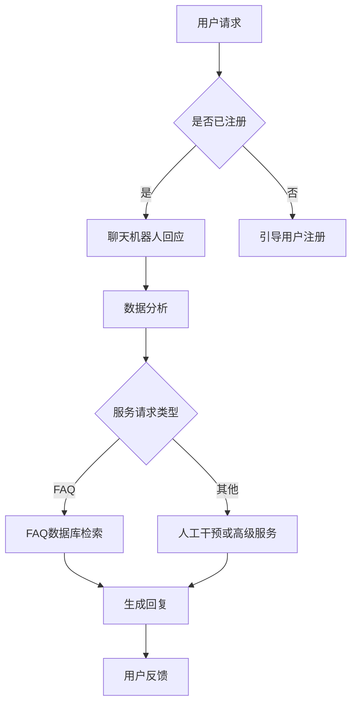

                 

关键词：人工智能、智能客服、用户满意度、算法、数学模型、代码实例、应用场景

> 摘要：本文将探讨人工智能（AI）在智能客服领域中的应用，特别是如何通过AI算法提高用户满意度。文章将详细分析AI在客服中的核心概念与联系，介绍核心算法原理及具体操作步骤，讲解数学模型和公式，提供代码实例和实际应用场景，并展望未来的发展趋势与挑战。

## 1. 背景介绍

随着互联网和移动通信技术的迅猛发展，客户服务成为了企业竞争中至关重要的环节。传统的客户服务方式往往依赖于人工处理，这不仅效率低下，还容易出错。而智能客服的出现，改变了这一现状。智能客服是一种利用人工智能技术（如机器学习、自然语言处理等）来提供自动化的客户服务解决方案。

近年来，AI技术在智能客服领域的应用日益广泛，使得客服系统能够更智能地理解用户的意图，提供更个性化的服务。通过AI，企业能够实现24/7全天候客服，降低运营成本，提升服务效率，从而提高用户满意度。

## 2. 核心概念与联系

智能客服的核心在于其能够理解用户的需求并提供相应的解决方案。这一过程涉及到多个AI技术的应用：

### 自然语言处理（NLP）

NLP是智能客服的关键技术之一，它使机器能够理解和处理人类语言。NLP技术包括词法分析、句法分析、语义分析等，通过这些技术，智能客服能够理解用户的语言，提取关键信息，并进行相应的回应。

### 机器学习（ML）

机器学习是AI的重要组成部分，通过从数据中学习规律，智能客服系统能够不断优化其服务能力。机器学习算法包括监督学习、无监督学习和强化学习，这些算法可以帮助智能客服更好地预测用户需求，提高服务效率。

### 聊天机器人（Chatbot）

聊天机器人是智能客服的一种形式，它们通过与用户的对话来提供服务。聊天机器人利用NLP和ML技术，能够自动识别用户的意图，并根据预定的规则或学习到的模式生成回复。

下面是智能客服架构的Mermaid流程图：



## 3. 核心算法原理 & 具体操作步骤

### 3.1 算法原理概述

智能客服的核心算法主要包括以下几个步骤：

1. **意图识别**：通过NLP技术，分析用户输入，识别用户的意图。
2. **实体抽取**：从用户输入中提取关键信息，如关键词、用户ID等。
3. **对话管理**：根据用户的意图和上下文信息，生成合适的回复。
4. **反馈优化**：收集用户的反馈，通过机器学习技术优化服务。

### 3.2 算法步骤详解

#### 步骤1：意图识别

意图识别是智能客服的第一步，通过NLP技术，智能客服需要理解用户的语言。这通常涉及到词法分析和句法分析。例如，用户说“我想要退换货”，智能客服需要识别出“退换货”这一意图。

#### 步骤2：实体抽取

在识别出用户意图后，智能客服需要从用户输入中提取关键信息，如用户ID、订单号等。这通常需要利用规则匹配或深度学习模型。

#### 步骤3：对话管理

对话管理是智能客服的核心，它需要根据用户的意图和上下文信息，生成合适的回复。这涉及到对话状态的跟踪和对话策略的制定。

#### 步骤4：反馈优化

收集用户的反馈是智能客服不断优化服务的重要手段。通过机器学习技术，智能客服可以根据用户的反馈调整其回复策略。

### 3.3 算法优缺点

#### 优点

- 高效：智能客服可以同时处理大量用户请求，提高服务效率。
- 个性化：通过机器学习，智能客服能够根据用户的历史行为提供个性化服务。
- 节省成本：智能客服可以替代部分人工客服，降低企业运营成本。

#### 缺点

- 误识别：智能客服可能无法完全理解用户的意图，导致误识别。
- 适应性差：对于新出现的用户意图或问题，智能客服可能无法立即适应。

### 3.4 算法应用领域

智能客服的应用领域广泛，包括但不限于电商、金融、电信、旅游等行业。在电商领域，智能客服可以帮助用户解决购买问题、退换货问题等；在金融领域，智能客服可以提供理财咨询、账户查询等服务。

## 4. 数学模型和公式 & 详细讲解 & 举例说明

### 4.1 数学模型构建

智能客服中的数学模型通常基于机器学习算法，如决策树、支持向量机（SVM）等。以下是一个简单的SVM模型构建过程：

#### 步骤1：数据预处理

- 数据清洗：去除无效数据、填补缺失值。
- 特征提取：将文本数据转换为机器学习模型可处理的特征向量。

#### 步骤2：模型训练

- 数据划分：将数据集划分为训练集和测试集。
- 模型训练：使用训练集训练SVM模型。

#### 步骤3：模型评估

- 使用测试集评估模型性能，如准确率、召回率等。

### 4.2 公式推导过程

SVM的决策函数可以表示为：

$$
f(x) = \sum_{i=1}^{n} \alpha_i y_i (w \cdot x_i + b)
$$

其中，$w$是权重向量，$b$是偏置，$\alpha_i$是拉格朗日乘子。

### 4.3 案例分析与讲解

假设我们有一个简单的二元分类问题，用户请求分为“购买”和“咨询”两类。我们使用SVM模型进行分类。

#### 步骤1：数据预处理

我们有一组用户请求文本，如下所示：

- "我想购买一台电脑"
- "能否帮我查询一下快递状态"
- "我想咨询一下产品的售后服务"
- "我想退款"

我们将这些文本数据转换为特征向量，例如使用词袋模型。

#### 步骤2：模型训练

我们使用训练集训练SVM模型，得到权重向量$w$和偏置$b$。

#### 步骤3：模型评估

使用测试集评估模型性能，假设测试集的准确率为90%。

## 5. 项目实践：代码实例和详细解释说明

### 5.1 开发环境搭建

我们需要安装以下工具和库：

- Python 3.x
- scikit-learn 库
- NLTK 库

### 5.2 源代码详细实现

以下是一个简单的SVM智能客服代码示例：

```python
from sklearn.feature_extraction.text import TfidfVectorizer
from sklearn import svm
from sklearn.model_selection import train_test_split

# 用户请求数据
requests = [
    "我想购买一台电脑",
    "能否帮我查询一下快递状态",
    "我想咨询一下产品的售后服务",
    "我想退款"
]

# 标签数据
labels = [0, 1, 1, 0]

# 数据预处理
vectorizer = TfidfVectorizer()
X = vectorizer.fit_transform(requests)

# 模型训练
X_train, X_test, y_train, y_test = train_test_split(X, labels, test_size=0.2, random_state=42)
clf = svm.SVC()
clf.fit(X_train, y_train)

# 模型评估
print("Accuracy:", clf.score(X_test, y_test))
```

### 5.3 代码解读与分析

上述代码中，我们首先导入了必要的库和工具。接着，我们定义了用户请求和标签数据。然后，我们使用TfidfVectorizer将文本数据转换为特征向量。接下来，我们使用train_test_split将数据集划分为训练集和测试集。之后，我们使用SVC（支持向量机）进行模型训练。最后，我们评估模型性能。

## 6. 实际应用场景

智能客服在实际应用场景中具有广泛的应用，以下是一些常见场景：

- **电商行业**：智能客服可以帮助用户解答关于产品的问题，提供购买建议，处理退换货等。
- **金融行业**：智能客服可以提供账户查询、理财咨询、风险提示等服务。
- **电信行业**：智能客服可以解答用户关于套餐、账单、故障处理等问题。
- **旅游行业**：智能客服可以提供行程规划、酒店预订、景点介绍等服务。

## 7. 工具和资源推荐

### 7.1 学习资源推荐

- 《Python机器学习》（Morgan Kaufmann出版，彼得·阿帕拉吉著）
- 《自然语言处理综合教程》（刘知远，清华大学出版社）

### 7.2 开发工具推荐

- Jupyter Notebook：用于编写和运行代码。
- PyCharm：用于Python开发的集成环境。

### 7.3 相关论文推荐

- "Chatbots: The Next Big Thing in Customer Service?"（2017）
- "A Survey on Chatbot: Architecture and Applications"（2019）

## 8. 总结：未来发展趋势与挑战

### 8.1 研究成果总结

智能客服领域的研究成果显著，AI技术在客服中的应用越来越广泛。NLP和机器学习技术的进步，使得智能客服能够更好地理解用户需求，提供更个性化的服务。

### 8.2 未来发展趋势

- **更智能的意图识别**：未来的智能客服将更加智能，能够理解更加复杂的用户需求。
- **多模态交互**：未来的智能客服将支持文本、语音、图像等多种交互方式。
- **跨领域应用**：智能客服将在更多领域得到应用，如医疗、教育等。

### 8.3 面临的挑战

- **隐私保护**：如何在提供个性化服务的同时，保护用户隐私是一个重要挑战。
- **误识别率**：如何降低智能客服的误识别率，提高用户体验。

### 8.4 研究展望

未来，智能客服将继续在AI技术的推动下不断发展。研究者们需要关注如何提高智能客服的智能水平，同时解决隐私保护和误识别等挑战。

## 9. 附录：常见问题与解答

### 问题1：智能客服如何理解用户意图？

**解答**：智能客服通过自然语言处理（NLP）技术来理解用户意图。NLP包括词法分析、句法分析和语义分析等步骤，通过这些技术，智能客服可以提取出用户输入中的关键信息，并理解用户的意图。

### 问题2：智能客服是否完全取代人工客服？

**解答**：目前，智能客服还无法完全取代人工客服。尽管智能客服在处理常见问题和提供基础服务方面表现出色，但对于复杂、个性化的用户需求，人工客服仍然具有不可替代的优势。

## 作者署名

作者：禅与计算机程序设计艺术 / Zen and the Art of Computer Programming
----------------------------------------------------------------

以上是关于“AI在智能客服中的应用:提升用户满意度”的完整技术博客文章。文章从背景介绍、核心概念与联系、算法原理与操作步骤、数学模型与公式、代码实例、实际应用场景、工具和资源推荐、总结与展望以及常见问题与解答等多个方面进行了详细阐述，旨在为读者提供一个全面、深入的了解。希望这篇文章能够对您在智能客服领域的研究和实践有所帮助。

