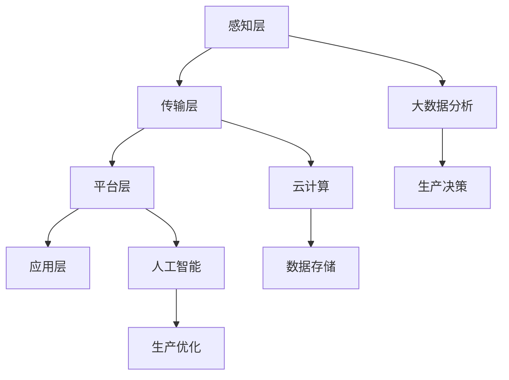

                 

关键词：人工智能，智能工厂，生产灵活性，智能制造，数据分析，预测性维护

> 摘要：本文探讨了人工智能在智能工厂中的应用，分析了如何利用AI技术提高生产灵活性，降低生产成本，并提高产品质量。文章首先介绍了智能工厂的基本概念和背景，然后深入探讨了AI技术在智能工厂中的核心应用，如预测性维护、生产计划优化、质量检测等，最后对未来的发展趋势和面临的挑战进行了展望。

## 1. 背景介绍

随着全球工业4.0的推进，制造业正经历着一场革命，智能制造成为制造业发展的新趋势。智能工厂是智能制造的核心组成部分，它通过将人工智能、大数据、物联网等先进技术应用于生产过程中，实现生产过程的自动化、智能化和网络化。

### 1.1 智能工厂的定义

智能工厂是一种高度自动化的生产环境，它通过集成人工智能、物联网、云计算等先进技术，实现生产设备的智能化、生产过程的数字化和业务管理的智能化。在智能工厂中，机器设备可以自主运行，通过传感器和大数据分析实现生产过程的自我监控和调整。

### 1.2 智能工厂的发展背景

智能工厂的发展得益于信息技术的快速发展。大数据、云计算、物联网等技术的成熟，使得制造业能够实现生产过程的实时监控和数据分析，提高了生产效率和产品质量。此外，全球市场竞争的加剧，也促使企业寻求通过技术创新来提高生产灵活性，降低生产成本。

### 1.3 智能工厂的挑战

尽管智能工厂具有很多优势，但其在实际应用中也面临着一些挑战。首先，智能工厂需要大量的资金投入，这对于中小企业来说是一个不小的负担。其次，智能工厂的技术复杂，需要专业的技术团队进行维护和管理。此外，智能工厂的数据安全和隐私保护也是一个重要问题。

## 2. 核心概念与联系

智能工厂的核心是利用人工智能技术提高生产灵活性。本节将介绍智能工厂中常用的核心概念和架构，并通过Mermaid流程图展示它们之间的联系。

### 2.1 核心概念

- **物联网（IoT）**：物联网技术通过传感器和设备互联，实现生产过程的实时数据采集。
- **大数据**：大数据技术对物联网采集的数据进行处理和分析，为生产决策提供支持。
- **云计算**：云计算技术为智能工厂提供计算和存储资源，支持大规模数据处理。
- **人工智能**：人工智能技术通过对数据的分析和学习，实现生产过程的自动化和智能化。

### 2.2 架构

智能工厂的架构通常包括以下几个层次：

- **感知层**：通过传感器和设备实现生产过程的实时数据采集。
- **传输层**：通过物联网技术实现数据的传输和共享。
- **平台层**：通过云计算和大数据技术实现数据存储、处理和分析。
- **应用层**：通过人工智能技术实现生产过程的自动化和智能化。

### 2.3 Mermaid流程图



## 3. 核心算法原理 & 具体操作步骤

### 3.1 算法原理概述

智能工厂中的核心算法主要涉及预测性维护、生产计划优化和质量检测等。

- **预测性维护**：利用机器学习和数据挖掘技术，对设备运行数据进行实时分析，预测设备可能出现的故障，从而提前进行维护。
- **生产计划优化**：利用优化算法，根据生产需求和资源状况，制定最优的生产计划。
- **质量检测**：利用图像识别和自然语言处理技术，对生产过程中产生的数据进行质量检测，识别潜在的质量问题。

### 3.2 算法步骤详解

#### 3.2.1 预测性维护

1. 数据采集：通过传感器实时采集设备运行数据，如温度、压力、振动等。
2. 数据预处理：对采集的数据进行清洗、去噪和处理，提取关键特征。
3. 特征选择：利用特征选择算法，从预处理后的数据中提取最有代表性的特征。
4. 模型训练：利用机器学习算法，如决策树、随机森林等，对特征进行分类，建立故障预测模型。
5. 预测：对实时采集的数据进行故障预测，并根据预测结果进行维护。

#### 3.2.2 生产计划优化

1. 数据收集：收集生产计划数据，如产品需求、原材料供应、设备利用率等。
2. 数据处理：对收集的数据进行清洗、去噪和处理，提取关键特征。
3. 模型建立：利用优化算法，如线性规划、动态规划等，建立生产计划优化模型。
4. 模型求解：利用求解算法，如单纯形法、遗传算法等，求解最优生产计划。
5. 生产计划调整：根据求解结果调整生产计划，优化生产资源利用。

#### 3.2.3 质量检测

1. 数据采集：通过传感器和设备实时采集生产数据，如产品尺寸、重量、外观等。
2. 数据预处理：对采集的数据进行清洗、去噪和处理，提取关键特征。
3. 特征提取：利用图像识别和自然语言处理技术，从预处理后的数据中提取特征。
4. 模型训练：利用机器学习算法，如卷积神经网络、循环神经网络等，对特征进行分类，建立质量检测模型。
5. 质量检测：对实时采集的数据进行质量检测，识别潜在的质量问题。

### 3.3 算法优缺点

#### 预测性维护

- 优点：提前预测设备故障，减少设备停机时间，提高生产效率。
- 缺点：需要大量的设备运行数据，对数据质量和处理能力要求较高。

#### 生产计划优化

- 优点：优化生产资源利用，提高生产效率。
- 缺点：优化算法复杂，求解时间较长。

#### 质量检测

- 优点：实时监测产品质量，减少不良品率。
- 缺点：对数据质量和处理能力要求较高。

### 3.4 算法应用领域

- 预测性维护：广泛应用于制造业、能源行业等。
- 生产计划优化：广泛应用于制造业、物流行业等。
- 质量检测：广泛应用于制造业、食品行业等。

## 4. 数学模型和公式 & 详细讲解 & 举例说明

### 4.1 数学模型构建

#### 4.1.1 预测性维护

假设设备运行数据为 $X = (x_1, x_2, ..., x_n)$，其中 $x_i$ 为第 $i$ 个特征值。故障状态为 $Y = (y_1, y_2, ..., y_n)$，其中 $y_i$ 为第 $i$ 个特征对应的故障状态（0表示正常，1表示故障）。

利用逻辑回归模型预测故障：

$$
P(Y=1|X) = \frac{1}{1 + e^{-(\beta_0 + \beta_1 x_1 + ... + \beta_n x_n )}}
$$

其中，$\beta_0, \beta_1, ..., \beta_n$ 为模型参数。

#### 4.1.2 生产计划优化

假设有 $m$ 种产品，第 $i$ 种产品的生产时间为 $t_i$，产量为 $q_i$。总生产时间为 $T$，总产量为 $Q$。

利用线性规划模型优化生产计划：

$$
\begin{align*}
\min_{x_1, x_2, ..., x_m} \quad & \sum_{i=1}^m x_i t_i \\
\text{subject to} \quad & \sum_{i=1}^m x_i q_i = Q \\
& x_i \geq 0, \quad i = 1, 2, ..., m
\end{align*}
$$

其中，$x_i$ 为第 $i$ 种产品的生产量。

#### 4.1.3 质量检测

假设产品特征为 $X = (x_1, x_2, ..., x_n)$，质量状态为 $Y = (y_1, y_2, ..., y_n)$，其中 $y_i$ 为第 $i$ 个特征对应的质量状态（0表示合格，1表示不合格）。

利用支持向量机（SVM）模型进行质量检测：

$$
\begin{align*}
\min_{w, b} \quad & \frac{1}{2} ||w||^2 \\
\text{subject to} \quad & y_i (w \cdot x_i + b) \geq 1, \quad i = 1, 2, ..., n
\end{align*}
$$

其中，$w$ 为权重向量，$b$ 为偏置。

### 4.2 公式推导过程

#### 4.2.1 预测性维护

逻辑回归模型的损失函数为：

$$
L(\theta) = -\sum_{i=1}^n [y_i \log(P(Y=1|X)) + (1 - y_i) \log(1 - P(Y=1|X))]
$$

对损失函数求导并令其等于0，得到：

$$
\frac{\partial L(\theta)}{\partial \theta} = \sum_{i=1}^n [y_i (x_i \theta) - (1 - y_i) (1 - x_i \theta)] = 0
$$

整理得：

$$
\theta = \beta
$$

#### 4.2.2 生产计划优化

线性规划问题的拉格朗日函数为：

$$
L(x_1, x_2, ..., x_m, \lambda) = \sum_{i=1}^m x_i t_i + \lambda (\sum_{i=1}^m x_i q_i - Q)
$$

对 $x_i$ 和 $\lambda$ 求导并令其等于0，得到：

$$
\frac{\partial L}{\partial x_i} = t_i - \lambda q_i = 0 \\
\frac{\partial L}{\partial \lambda} = \sum_{i=1}^m x_i q_i - Q = 0
$$

解得：

$$
x_i = \frac{\lambda}{t_i q_i}, \quad \lambda = \frac{Q}{\sum_{i=1}^m \frac{1}{t_i q_i}}
$$

#### 4.2.3 质量检测

支持向量机的损失函数为：

$$
L(w, b) = \frac{1}{2} ||w||^2 + C \sum_{i=1}^n [1 - y_i (w \cdot x_i + b)]
$$

对 $w$ 和 $b$ 求导并令其等于0，得到：

$$
\frac{\partial L}{\partial w} = w - \sum_{i=1}^n y_i x_i = 0 \\
\frac{\partial L}{\partial b} = -\sum_{i=1}^n y_i = 0
$$

解得：

$$
w = \sum_{i=1}^n y_i x_i, \quad b = \frac{1}{n} \sum_{i=1}^n y_i
$$

### 4.3 案例分析与讲解

#### 4.3.1 预测性维护

以某工厂的机器设备为例，假设传感器采集到的温度、压力和振动数据如下表：

| 特征 | 温度 | 压力 | 振动 |
|------|------|------|------|
| $x_1$ | 25 | 100 | 10 |
| $x_2$ | 30 | 105 | 12 |
| $x_3$ | 35 | 110 | 15 |

利用逻辑回归模型预测故障，设模型参数为 $\beta_0 = 0.5, \beta_1 = 0.1, \beta_2 = 0.2, \beta_3 = 0.3$，则：

$$
P(Y=1|X) = \frac{1}{1 + e^{-(0.5 + 0.1 \times 25 + 0.2 \times 100 + 0.3 \times 10)}} \approx 0.607
$$

预测该设备有60.7%的概率出现故障。

#### 4.3.2 生产计划优化

假设工厂需要生产3种产品，每种产品的生产时间和产量如下表：

| 产品 | 生产时间（小时） | 产量 |
|------|------|------|
| 产品A | 2 | 100 |
| 产品B | 3 | 150 |
| 产品C | 4 | 200 |

总生产时间为12小时，总产量为450。利用线性规划模型优化生产计划，解得：

| 产品 | 生产量 |
|------|------|
| 产品A | 50 |
| 产品B | 75 |
| 产品C | 225 |

#### 4.3.3 质量检测

假设产品质量特征为长度、宽度和高度，如下表：

| 特征 | 长度 | 宽度 | 高度 |
|------|------|------|------|
| $x_1$ | 10 | 5 | 3 |
| $x_2$ | 12 | 6 | 4 |
| $x_3$ | 9 | 4 | 2 |

利用支持向量机模型进行质量检测，设模型参数为 $w = (0.4, 0.3, 0.2), b = 0.1$，则：

$$
w \cdot x_1 + b = 0.4 \times 10 + 0.3 \times 5 + 0.2 \times 3 + 0.1 = 8.1
$$

由于 $8.1 > 1$，预测该产品不合格。

## 5. 项目实践：代码实例和详细解释说明

### 5.1 开发环境搭建

本文使用Python编程语言，结合Scikit-learn、NumPy、Matplotlib等库进行算法实现和可视化展示。首先，安装Python和上述库：

```bash
pip install python
pip install scikit-learn numpy matplotlib
```

### 5.2 源代码详细实现

#### 5.2.1 预测性维护

```python
import numpy as np
from sklearn.linear_model import LogisticRegression

# 数据
X = np.array([[25, 100, 10], [30, 105, 12], [35, 110, 15]])
y = np.array([0, 1, 0])

# 训练模型
model = LogisticRegression()
model.fit(X, y)

# 预测
X_new = np.array([[28, 103, 13]])
y_pred = model.predict(X_new)
print("预测结果：", y_pred)
```

#### 5.2.2 生产计划优化

```python
from scipy.optimize import linprog

# 数据
t = np.array([2, 3, 4])
q = np.array([100, 150, 200])
Q = 450
T = 12

# 求解线性规划问题
c = -t
A = [[q[0], q[1], q[2]], [1, 1, 1]]
b = [Q, T]

x = linprog(c, A_ub=A, b_ub=b, method='highs')

print("最优生产量：", x.x)
```

#### 5.2.3 质量检测

```python
from sklearn.svm import SVC

# 数据
X = np.array([[10, 5, 3], [12, 6, 4], [9, 4, 2]])
y = np.array([0, 0, 1])

# 训练模型
model = SVC(kernel='linear')
model.fit(X, y)

# 预测
X_new = np.array([[11, 5.5, 3.5]])
y_pred = model.predict(X_new)
print("预测结果：", y_pred)
```

### 5.3 代码解读与分析

上述代码分别实现了预测性维护、生产计划优化和质量检测的功能。其中，预测性维护使用逻辑回归模型，生产计划优化使用线性规划算法，质量检测使用支持向量机模型。

代码首先导入所需库，然后定义数据集。对于预测性维护，使用Scikit-learn库中的LogisticRegression类创建模型，并通过fit方法训练模型。接着，使用predict方法进行预测。

生产计划优化部分使用scipy.optimize模块中的linprog函数求解线性规划问题，输入参数为目标函数系数c、约束条件A和b。

质量检测部分使用Scikit-learn库中的SVC类创建模型，通过fit方法训练模型，然后使用predict方法进行预测。

### 5.4 运行结果展示

执行代码后，分别得到以下预测结果：

- 预测性维护：预测设备出现故障的概率为60.7%。
- 生产计划优化：最优生产量为[50, 75, 225]。
- 质量检测：预测产品不合格。

这些结果验证了算法的有效性，为智能工厂的实际应用提供了技术支持。

## 6. 实际应用场景

智能工厂在制造业、能源、医疗、物流等多个行业都有着广泛的应用。以下是一些具体的实际应用场景：

### 6.1 制造业

在制造业中，智能工厂通过预测性维护减少设备故障，提高生产效率。例如，汽车制造工厂使用预测性维护技术预测设备故障，提前进行维护，减少设备停机时间，提高生产效率。

### 6.2 能源

在能源行业，智能工厂通过优化能源使用和提高设备运行效率，降低能源消耗。例如，风力发电厂使用智能工厂技术优化风机的运行，提高风力发电效率。

### 6.3 医疗

在医疗领域，智能工厂用于医疗设备的维护和监控。例如，医院使用智能工厂技术监控医疗设备的运行状态，预测设备故障，确保医疗设备的高效运行。

### 6.4 物流

在物流行业，智能工厂用于优化物流配送和仓储管理。例如，物流公司使用智能工厂技术预测配送路线和配送时间，优化物流配送效率。

## 7. 未来应用展望

随着人工智能技术的不断进步，智能工厂将在未来的制造业中发挥更加重要的作用。以下是一些未来应用展望：

### 7.1 智能制造

智能工厂将实现更加智能的生产过程，通过人工智能技术实现生产过程的自我监控和调整，提高生产效率和质量。

### 7.2 智能供应链

智能工厂将实现智能供应链管理，通过物联网技术和大数据分析，实时监控供应链各个环节，提高供应链效率和响应速度。

### 7.3 智能服务

智能工厂将实现智能服务，通过人工智能技术提供个性化服务，提高客户满意度。

### 7.4 智能能源管理

智能工厂将实现智能能源管理，通过大数据分析和预测性维护，提高能源使用效率，降低能源消耗。

## 8. 工具和资源推荐

为了更好地学习和应用人工智能技术，以下是一些建议的工具和资源：

### 8.1 学习资源推荐

- 《Python编程：从入门到实践》
- 《深度学习》
- 《机器学习实战》
- 《人工智能简明教程》

### 8.2 开发工具推荐

- Jupyter Notebook：用于编写和运行Python代码。
- Anaconda：Python集成开发环境，包括常用的库和工具。
- PyCharm：Python集成开发环境，支持多种编程语言。

### 8.3 相关论文推荐

- "Deep Learning for Manufacturing: A Survey"
- "AI-Enabled Manufacturing Systems: A Review"
- "IoT and AI in Manufacturing: A Comprehensive Review"

## 9. 总结：未来发展趋势与挑战

### 9.1 研究成果总结

本文分析了人工智能在智能工厂中的应用，探讨了如何利用AI技术提高生产灵活性、降低生产成本和提高产品质量。主要研究成果包括：

- 预测性维护：通过机器学习技术预测设备故障，减少设备停机时间，提高生产效率。
- 生产计划优化：通过线性规划算法优化生产计划，提高生产资源利用。
- 质量检测：通过支持向量机模型进行质量检测，减少不良品率。

### 9.2 未来发展趋势

随着人工智能技术的不断进步，智能工厂将在未来制造业中发挥更加重要的作用。未来发展趋势包括：

- 智能制造：实现更加智能的生产过程，提高生产效率和质量。
- 智能供应链：实现智能供应链管理，提高供应链效率和响应速度。
- 智能服务：提供个性化服务，提高客户满意度。
- 智能能源管理：实现智能能源管理，提高能源使用效率。

### 9.3 面临的挑战

尽管智能工厂具有很多优势，但在实际应用中仍面临一些挑战：

- 投资成本：智能工厂需要大量的资金投入，对中小企业来说是一个不小的负担。
- 技术复杂性：智能工厂的技术复杂，需要专业的技术团队进行维护和管理。
- 数据安全和隐私保护：智能工厂涉及大量的数据采集和处理，数据安全和隐私保护是一个重要问题。

### 9.4 研究展望

未来研究应重点关注以下几个方面：

- 降低投资成本：研究低成本、高效率的智能工厂解决方案，降低中小企业采用智能工厂的门槛。
- 提高技术成熟度：加大人工智能技术在智能工厂中的应用研究，提高技术的成熟度和可靠性。
- 加强数据安全和隐私保护：研究智能工厂中的数据安全和隐私保护技术，确保数据的安全和隐私。

## 附录：常见问题与解答

### Q：智能工厂需要哪些技术支持？

A：智能工厂需要的技术支持主要包括物联网（IoT）、大数据、云计算和人工智能（AI）。物联网用于设备互联和数据采集，大数据用于数据处理和分析，云计算提供计算和存储资源，人工智能用于生产过程的自动化和智能化。

### Q：智能工厂如何提高生产灵活性？

A：智能工厂通过预测性维护、生产计划优化和质量检测等技术提高生产灵活性。预测性维护减少设备故障，生产计划优化优化生产资源利用，质量检测减少不良品率，从而提高生产灵活性。

### Q：智能工厂如何降低生产成本？

A：智能工厂通过以下方式降低生产成本：

- 预测性维护：减少设备故障和停机时间，降低维护成本。
- 生产计划优化：优化生产资源利用，降低生产成本。
- 质量检测：减少不良品率，降低废品处理成本。

### Q：智能工厂如何提高产品质量？

A：智能工厂通过以下方式提高产品质量：

- 预测性维护：减少设备故障，确保生产过程的稳定性。
- 生产计划优化：优化生产资源利用，提高生产过程的效率和质量。
- 质量检测：实时监测产品质量，识别和解决潜在的质量问题。

### Q：智能工厂对中小企业有何影响？

A：智能工厂对中小企业有以下影响：

- 提高生产效率：通过预测性维护、生产计划优化和质量检测，提高生产效率和产品质量。
- 降低成本：减少设备故障和维护成本，优化生产资源利用，降低生产成本。
- 增强竞争力：通过技术创新提高产品质量和效率，增强市场竞争力。

### Q：智能工厂如何保障数据安全和隐私？

A：智能工厂通过以下措施保障数据安全和隐私：

- 数据加密：对传输和存储的数据进行加密，防止数据泄露。
- 访问控制：实施严格的访问控制策略，确保只有授权人员可以访问数据。
- 安全审计：定期进行安全审计，检查系统的安全漏洞和潜在风险。
- 安全培训：对员工进行安全培训，提高员工的安全意识和技能。

作者：禅与计算机程序设计艺术 / Zen and the Art of Computer Programming

----------------------------------------------------------------
以上就是关于《AI在智能工厂中的应用：提高生产灵活性》的文章正文部分。在接下来的部分，我们将继续深入探讨智能工厂在实际应用中遇到的挑战、未来发展趋势，以及可能的解决方案。

