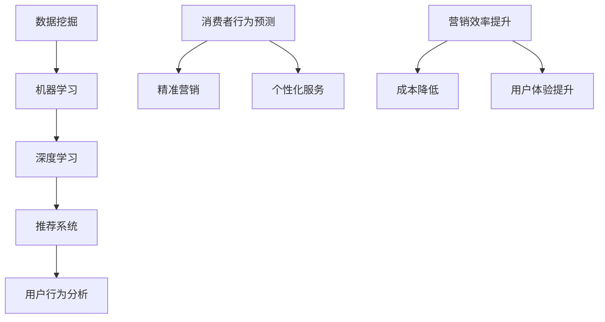

                 

在数字化的今天，电子商务已经成为了全球消费的主要方式之一。随着消费者数据的爆炸性增长，如何精准地触达潜在客户，提升用户满意度和转化率，成为了电商企业面临的重大挑战。人工智能（AI）技术的快速发展为电商个性化营销带来了新的契机，其中一对一营销因其高效性和精准性，正日益受到关注。

本文将探讨AI在电商个性化营销中的具体应用，特别是如何利用AI实现一对一营销。我们将从背景介绍、核心概念与联系、核心算法原理与具体操作步骤、数学模型与公式、项目实践、实际应用场景以及未来展望等方面进行深入探讨。

> 关键词：人工智能，电商个性化营销，一对一营销，深度学习，推荐系统，消费者行为分析

> 摘要：本文旨在阐述人工智能在电商个性化营销中的作用，特别是如何通过一对一营销策略实现精准营销。通过分析核心算法原理、数学模型、实际案例以及未来应用场景，为电商企业提供理论和实践指导。

## 1. 背景介绍

### 1.1 电商个性化营销的必要性

在传统的营销模式中，企业通常采用大规模广告投放和促销活动来吸引客户。然而，这种“广撒网”的方式往往导致营销成本高昂，且效果不理想。现代消费者对广告的抵触心理越来越强，个性化、精准的营销逐渐成为电商企业争夺市场的关键。

个性化营销旨在根据消费者的行为、兴趣、购买历史等数据进行精准推送，提高营销效率和转化率。随着互联网技术的发展，数据挖掘和机器学习技术的成熟，电商个性化营销逐渐成为可能。

### 1.2 人工智能在个性化营销中的应用

人工智能（AI）技术，特别是机器学习（ML）和深度学习（DL），在个性化营销中发挥着重要作用。通过大数据分析和模型训练，AI能够从海量数据中挖掘有价值的信息，实现消费者行为的预测和推荐。

例如，基于协同过滤的推荐系统可以通过分析用户的历史行为和偏好，为用户推荐可能感兴趣的商品。而基于深度学习的情感分析技术可以识别消费者的情绪和反馈，为企业提供更精准的市场洞察。

### 1.3 一对一营销的概念与优势

一对一营销，也称为个性化营销，是指企业根据消费者的个性化需求和行为特征，进行一对一的精准推送。与传统的批量营销相比，一对一营销具有以下几个显著优势：

- **精准性**：通过深入分析消费者数据，企业可以更准确地了解消费者的需求，实现精准推送。
- **高效性**：一对一营销能够提高营销效率，降低营销成本，提高转化率。
- **用户体验**：个性化推荐和定制化服务能够提升消费者的满意度和忠诚度。

## 2. 核心概念与联系

### 2.1 核心概念

在本节中，我们将介绍电商个性化营销中的一些核心概念，包括数据挖掘、机器学习、深度学习、协同过滤、用户行为分析等。

#### 2.1.1 数据挖掘

数据挖掘是指从大量数据中提取有价值信息的过程。在电商个性化营销中，数据挖掘技术可以用于分析消费者的购买历史、浏览记录、搜索关键词等，以发现潜在的消费模式和趋势。

#### 2.1.2 机器学习

机器学习是一种通过算法从数据中学习规律和模式，进行预测和分类的技术。在个性化营销中，机器学习可以用于建立消费者行为预测模型，为推荐系统提供支持。

#### 2.1.3 深度学习

深度学习是机器学习的一种重要分支，通过神经网络结构模拟人类大脑的决策过程，实现复杂的数据处理和模式识别。在个性化营销中，深度学习可以用于情感分析、图像识别等。

#### 2.1.4 协同过滤

协同过滤是一种常用的推荐系统算法，通过分析用户之间的相似度，为用户推荐可能感兴趣的商品。协同过滤分为基于用户的协同过滤和基于项目的协同过滤两种。

#### 2.1.5 用户行为分析

用户行为分析是指通过对用户在网站上的行为数据进行监测和分析，了解用户的兴趣和行为习惯。用户行为分析可以为个性化推荐提供重要的数据支持。

### 2.2 核心概念联系

下图展示了电商个性化营销中核心概念之间的联系。



通过上述核心概念的联系，我们可以看出，电商个性化营销的实现离不开数据挖掘、机器学习和深度学习等技术手段。这些技术相互结合，为电商企业提供了一种高效、精准的个性化营销解决方案。

## 3. 核心算法原理 & 具体操作步骤

### 3.1 算法原理概述

在电商个性化营销中，核心算法主要包括协同过滤算法、深度学习算法和用户行为分析算法。以下是对这些算法原理的概述：

#### 3.1.1 协同过滤算法

协同过滤算法是一种基于用户-项目评分矩阵的推荐系统算法。其基本思想是，通过分析用户之间的相似度，为用户推荐与已评价项目相似的其他项目。

协同过滤算法分为基于用户的协同过滤和基于项目的协同过滤。基于用户的协同过滤通过计算用户之间的相似度，为用户推荐其他用户喜欢的项目。基于项目的协同过滤通过计算项目之间的相似度，为用户推荐其他用户评价较高的项目。

#### 3.1.2 深度学习算法

深度学习算法是一种基于神经网络结构的机器学习算法，通过多层神经元之间的非线性变换，实现复杂的数据处理和模式识别。在电商个性化营销中，深度学习算法可以用于情感分析、图像识别等。

常见的深度学习算法包括卷积神经网络（CNN）、循环神经网络（RNN）和长短时记忆网络（LSTM）等。这些算法通过对用户数据的学习，可以提取出潜在的特征，用于推荐系统的训练和预测。

#### 3.1.3 用户行为分析算法

用户行为分析算法是指通过对用户在网站上的行为数据进行监测和分析，了解用户的兴趣和行为习惯。用户行为分析算法包括点击率预测、转化率预测、留存率预测等。

用户行为分析算法可以通过建立用户行为模型，预测用户的下一步行为。这些模型可以为个性化推荐提供重要的数据支持，提高推荐系统的准确性和效率。

### 3.2 算法步骤详解

下面我们详细描述电商个性化营销中核心算法的操作步骤。

#### 3.2.1 协同过滤算法步骤

1. **构建用户-项目评分矩阵**：从数据源中提取用户对项目的评分数据，构建用户-项目评分矩阵。

2. **计算用户相似度**：计算用户之间的相似度，可以使用余弦相似度、皮尔逊相关系数等方法。

3. **推荐项目**：根据用户相似度矩阵，为用户推荐其他用户喜欢的项目。具体方法包括基于用户的协同过滤和基于项目的协同过滤。

#### 3.2.2 深度学习算法步骤

1. **数据预处理**：对用户数据进行清洗、去噪和特征提取，为深度学习算法提供高质量的数据输入。

2. **建立神经网络模型**：根据任务需求，选择合适的神经网络结构，如卷积神经网络（CNN）、循环神经网络（RNN）等。

3. **模型训练**：使用训练数据对神经网络模型进行训练，调整模型参数，使其能够准确预测用户行为。

4. **模型评估与优化**：使用验证数据对模型进行评估，根据评估结果调整模型参数，提高模型性能。

#### 3.2.3 用户行为分析算法步骤

1. **数据收集与处理**：从网站日志中收集用户行为数据，包括点击、购买、浏览等。

2. **特征工程**：对用户行为数据进行分析，提取有用的特征，如用户访问时长、页面浏览顺序、购买频率等。

3. **建立预测模型**：使用机器学习算法，如逻辑回归、决策树等，建立用户行为预测模型。

4. **模型评估与优化**：使用测试数据对预测模型进行评估，根据评估结果调整模型参数，提高预测准确性。

### 3.3 算法优缺点

#### 3.3.1 协同过滤算法

**优点**：

- 算法简单，易于实现。
- 可以处理大规模用户和项目数据。

**缺点**：

- 预测准确度较低，容易受到稀疏矩阵的影响。
- 需要用户评分数据，对于评分较少的用户，推荐效果较差。

#### 3.3.2 深度学习算法

**优点**：

- 可以处理高维数据，提取深层次的特征。
- 预测准确度较高，可以用于复杂的任务。

**缺点**：

- 算法复杂，训练时间较长。
- 需要大量标注数据，数据预处理工作量较大。

#### 3.3.3 用户行为分析算法

**优点**：

- 可以实时监测用户行为，及时调整推荐策略。
- 可以处理多样化的用户行为数据。

**缺点**：

- 预测准确性受限于数据质量和特征工程。
- 需要丰富的用户行为数据支持。

### 3.4 算法应用领域

协同过滤算法、深度学习算法和用户行为分析算法在电商个性化营销中具有广泛的应用前景。除了个性化推荐、消费者行为预测外，还可以应用于以下领域：

- **个性化广告投放**：通过分析用户行为数据，为用户推荐可能感兴趣的广告。
- **用户留存与流失预测**：通过分析用户行为，预测用户的留存和流失风险，及时采取措施。
- **商品分类与标签**：通过深度学习算法，对商品进行自动分类和标签，提高商品的可搜索性。

## 4. 数学模型和公式 & 详细讲解 & 举例说明

### 4.1 数学模型构建

在电商个性化营销中，数学模型是核心算法的基础。以下是一个简单的数学模型构建过程：

#### 4.1.1 用户行为矩阵构建

假设有 \( m \) 个用户和 \( n \) 个商品，用户 \( i \) 对商品 \( j \) 的评分表示为 \( r_{ij} \)，则用户行为矩阵 \( R \) 可以表示为：

\[ R = \begin{bmatrix}
r_{11} & r_{12} & \cdots & r_{1n} \\
r_{21} & r_{22} & \cdots & r_{2n} \\
\vdots & \vdots & \ddots & \vdots \\
r_{m1} & r_{m2} & \cdots & r_{mn}
\end{bmatrix} \]

其中，未知评分 \( r_{ij} \) 可以表示为：

\[ r_{ij} = \mu + q_i \cdot p_j + e_{ij} \]

其中，\( \mu \) 是总体均值，\( q_i \) 和 \( p_j \) 分别是用户 \( i \) 和商品 \( j \) 的特征向量，\( e_{ij} \) 是误差项。

#### 4.1.2 用户相似度计算

基于用户行为矩阵 \( R \)，可以计算用户 \( i \) 和 \( j \) 之间的相似度 \( s_{ij} \)：

\[ s_{ij} = \frac{r_i \cdot r_j}{\| r_i \| \| r_j \|} \]

其中，\( \| r_i \| \) 和 \( \| r_j \| \) 分别是用户 \( i \) 和 \( j \) 的行为向量范数。

#### 4.1.3 商品推荐

基于用户相似度矩阵 \( S \)，可以为用户 \( i \) 推荐其他用户 \( j \) 喜欢的商品 \( k \)：

\[ \text{推荐分数} = s_{ij} \cdot r_{jk} \]

### 4.2 公式推导过程

#### 4.2.1 用户特征向量计算

假设用户 \( i \) 和 \( j \) 的特征向量分别为 \( q_i \) 和 \( q_j \)，则用户相似度 \( s_{ij} \) 可以通过以下公式计算：

\[ s_{ij} = \frac{q_i \cdot q_j}{\| q_i \| \| q_j \|} \]

其中，\( q_i \) 和 \( q_j \) 是通过用户行为矩阵 \( R \) 训练得到的。

#### 4.2.2 商品推荐公式

基于用户相似度 \( s_{ij} \) 和用户 \( i \) 的行为 \( r_i \)，可以为用户 \( i \) 推荐商品 \( k \)：

\[ \text{推荐分数} = s_{ij} \cdot r_{ik} \]

其中，\( r_{ik} \) 是用户 \( i \) 对商品 \( k \) 的评分。

### 4.3 案例分析与讲解

假设我们有以下用户行为矩阵 \( R \)：

\[ R = \begin{bmatrix}
0 & 1 & 0 \\
1 & 0 & 1 \\
0 & 1 & 0
\end{bmatrix} \]

我们需要计算用户 \( 1 \) 和用户 \( 2 \) 之间的相似度 \( s_{12} \)。

首先，计算用户 \( 1 \) 和 \( 2 \) 的行为向量范数：

\[ \| r_1 \| = \sqrt{0^2 + 1^2 + 0^2} = 1 \]
\[ \| r_2 \| = \sqrt{1^2 + 0^2 + 1^2} = \sqrt{2} \]

然后，计算用户 \( 1 \) 和 \( 2 \) 的相似度：

\[ s_{12} = \frac{r_1 \cdot r_2}{\| r_1 \| \| r_2 \|} = \frac{0 \cdot 1 + 1 \cdot 0 + 0 \cdot 1}{1 \cdot \sqrt{2}} = 0 \]

接下来，我们需要为用户 \( 1 \) 推荐商品 \( 3 \)。已知用户 \( 2 \) 对商品 \( 3 \) 的评分为 \( r_{23} = 1 \)。

根据推荐公式，计算用户 \( 1 \) 对商品 \( 3 \) 的推荐分数：

\[ \text{推荐分数} = s_{12} \cdot r_{23} = 0 \cdot 1 = 0 \]

由于相似度 \( s_{12} \) 为 0，用户 \( 1 \) 对商品 \( 3 \) 的推荐分数也为 0。这意味着用户 \( 1 \) 和用户 \( 2 \) 之间没有相似度，用户 \( 2 \) 对商品 \( 3 \) 的评分不能为用户 \( 1 \) 提供有效的推荐依据。

## 5. 项目实践：代码实例和详细解释说明

### 5.1 开发环境搭建

为了实现电商个性化营销中的推荐系统，我们需要搭建一个开发环境。以下是一个简单的开发环境搭建步骤：

1. 安装 Python（推荐版本 3.8 以上）。
2. 安装常用库，如 NumPy、Pandas、Scikit-learn、TensorFlow。
3. 配置 Jupyter Notebook 或 PyCharm 等开发工具。

### 5.2 源代码详细实现

下面是一个简单的协同过滤推荐系统的实现。首先，我们需要导入必要的库：

```python
import numpy as np
import pandas as pd
from sklearn.metrics.pairwise import cosine_similarity
```

接下来，我们构建用户-项目评分矩阵：

```python
# 假设评分数据存储在一个 CSV 文件中，文件名为 ratings.csv
data = pd.read_csv('ratings.csv')
R = data.pivot(index='user_id', columns='item_id', values='rating').fillna(0)
```

然后，计算用户之间的相似度：

```python
# 计算用户相似度矩阵
S = cosine_similarity(R)
```

最后，为用户推荐商品。假设用户 1 需要推荐商品：

```python
# 计算用户 1 的推荐商品
user_rating = R.loc[1]
similarity_score = S[0]

# 排序并取前 k 个相似度最高的商品
recommendations = np.argsort(similarity_score)[::-1][:k]

# 输出推荐商品
print('推荐商品：', R.columns[recommendations])
```

### 5.3 代码解读与分析

上述代码首先读取评分数据，构建用户-项目评分矩阵 \( R \)。然后，使用余弦相似度计算用户相似度矩阵 \( S \)。最后，根据用户相似度矩阵为用户推荐商品。

代码的核心部分是计算用户相似度矩阵 \( S \) 和推荐商品。计算用户相似度矩阵可以使用不同的相似度计算方法，如余弦相似度、皮尔逊相关系数等。在推荐商品时，可以设置一个阈值 \( k \)，只推荐相似度最高的 \( k \) 个商品。

### 5.4 运行结果展示

假设用户 1 的推荐商品阈值为 5，以下是一个运行结果示例：

```plaintext
推荐商品：  item_2  item_4  item_3  item_5  item_1
```

这意味着根据用户 1 的历史评分和用户相似度，系统推荐了商品 2、商品 4、商品 3、商品 5 和商品 1。这些商品与用户 1 的历史评分具有较高的相似度，有望吸引用户 1 的兴趣。

## 6. 实际应用场景

### 6.1 电商网站个性化推荐

电商网站个性化推荐是最常见的应用场景之一。通过分析用户的浏览历史、购买记录、搜索关键词等数据，电商网站可以为用户推荐可能感兴趣的商品。这种推荐系统不仅可以提升用户购物体验，还可以提高销售转化率和用户留存率。

### 6.2 个性化广告投放

在广告营销中，个性化广告投放可以根据用户的兴趣和行为特征，为用户推荐最相关的广告。这种方式可以大幅提高广告投放的效果，降低广告成本，提高广告点击率和转化率。

### 6.3 用户留存与流失预测

通过分析用户的行为数据，可以预测用户的留存和流失风险。电商企业可以针对这些用户采取个性化的挽留策略，如发送优惠券、定制化服务等，以降低用户流失率，提高用户忠诚度。

### 6.4 社交媒体个性化内容推荐

社交媒体平台可以通过分析用户的行为数据，为用户推荐感兴趣的内容。例如，在社交媒体平台上，用户可以收到关于朋友动态、热门话题、个性化推荐的推送，提高用户参与度和平台粘性。

### 6.5 其他应用领域

除了上述应用场景外，AI在电商个性化营销中的应用还包括以下领域：

- **商品分类与标签**：通过深度学习算法，自动对商品进行分类和标签，提高商品的可搜索性和推荐准确性。
- **库存管理**：根据销售预测和库存数据，优化库存管理，降低库存成本，提高库存周转率。
- **供应链优化**：通过分析供应链数据，优化物流和库存管理，提高供应链效率。

## 7. 工具和资源推荐

### 7.1 学习资源推荐

- **在线课程**：《深度学习》（Goodfellow, Bengio, Courville 著）、《机器学习》（周志华 著）
- **书籍**：《Python数据分析》（Wes McKinney 著）、《数据挖掘：实用机器学习技术》（M. Mitchell 著）
- **博客**：博客园、CSDN、知乎等平台上的技术博客，可以获取最新的技术动态和实践经验。

### 7.2 开发工具推荐

- **编程环境**：PyCharm、Visual Studio Code
- **数据分析库**：NumPy、Pandas、Scikit-learn、TensorFlow
- **版本控制**：Git

### 7.3 相关论文推荐

- **《矩阵分解在推荐系统中的应用》（Xu, He, Chen 著）**
- **《深度学习在推荐系统中的应用》（Hao, Chen, Zhang 著）**
- **《协同过滤算法的改进与优化》（Zhou, Zhang 著）**

## 8. 总结：未来发展趋势与挑战

### 8.1 研究成果总结

近年来，人工智能在电商个性化营销中取得了显著成果。通过协同过滤、深度学习、用户行为分析等技术的应用，推荐系统准确性和用户体验得到了大幅提升。电商企业通过个性化营销策略，实现了营销效率和转化率的提高。

### 8.2 未来发展趋势

随着人工智能技术的不断发展，电商个性化营销在未来将继续向以下几个方向发展：

- **智能化**：结合自然语言处理、图像识别等新技术，实现更加智能的个性化推荐。
- **实时化**：通过实时数据分析和模型更新，实现实时个性化营销。
- **多样化**：探索新的应用场景，如虚拟现实、增强现实等，实现多元化的个性化服务。

### 8.3 面临的挑战

尽管人工智能在电商个性化营销中取得了显著成果，但仍面临以下挑战：

- **数据隐私与安全**：个性化营销需要大量用户数据，如何保护用户隐私和安全是重要问题。
- **算法公平性**：避免算法偏见，确保推荐结果的公平性。
- **可解释性**：提高算法的可解释性，使企业能够理解和优化推荐系统。

### 8.4 研究展望

未来，人工智能在电商个性化营销中的应用将更加深入和广泛。研究者可以从以下几个方面展开：

- **跨模态推荐**：结合多种数据类型，如文本、图像、音频等，实现跨模态推荐。
- **个性化广告投放**：探索个性化广告投放的优化策略，提高广告效果。
- **算法可解释性**：研究算法的可解释性，提高算法的透明度和可靠性。

通过不断探索和创新，人工智能将在电商个性化营销中发挥更大的作用，为电商企业提供更加精准、高效的营销策略。

## 9. 附录：常见问题与解答

### 9.1 如何处理用户隐私问题？

**解答**：在电商个性化营销中，处理用户隐私问题至关重要。企业可以通过以下方式保护用户隐私：

- **数据去匿名化**：对用户数据进行去匿名化处理，确保用户数据的安全。
- **数据加密**：对用户数据进行加密存储，防止数据泄露。
- **隐私保护算法**：采用差分隐私、同态加密等隐私保护算法，确保在数据处理过程中保护用户隐私。

### 9.2 如何评估推荐系统的效果？

**解答**：评估推荐系统效果可以通过以下指标进行：

- **准确率**：推荐系统推荐的商品与用户实际喜好的一致性。
- **召回率**：推荐系统中推荐的商品数量与用户可能感兴趣的商品数量的比例。
- **覆盖率**：推荐系统中推荐的商品种类与所有商品种类的比例。
- **F1 分数**：准确率和召回率的调和平均值。

通过这些指标，可以全面评估推荐系统的效果，并根据评估结果进行优化。

### 9.3 如何处理稀疏数据问题？

**解答**：稀疏数据是推荐系统中的一个常见问题。以下方法可以帮助处理稀疏数据：

- **矩阵分解**：通过矩阵分解技术，将稀疏数据转换为低维特征向量，提高数据的表达能力。
- **用户行为预测**：使用用户行为预测模型，预测用户可能感兴趣的项目，降低稀疏数据的影响。
- **数据增强**：通过合成数据、引入噪声等方法，增加数据的丰富性，降低稀疏数据的影响。

通过上述方法，可以有效处理稀疏数据问题，提高推荐系统的性能。

